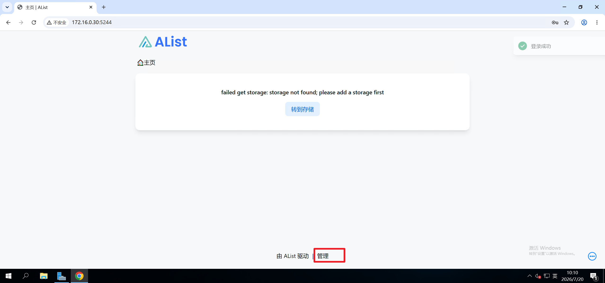

# 说明

Alist是一个存储管理项目。代码`https://github.com/AlistGo/alist`

# 快速部署

若没有自定义配置的需求，可在全新环境快速部署，

```bash
docker compose up -d
```

# 查询

查询部署状态，

```bash
root@test:/data# docker compose ps -a
NAME      IMAGE                                                                    COMMAND            SERVICE   CREATED         STATUS         PORTS
alist     swr.cn-north-4.myhuaweicloud.com/ddn-k8s/ghcr.io/alistgo/alist:v3.62.0   "/entrypoint.sh"   alist     4 seconds ago   Up 4 seconds   0.0.0.0:5244->5244/tcp, [::]:5244->5244/tcp, 5245/tcp
```

查询自动分配的密码

```bash
root@test:/data# docker logs alist 
INFO[2026-07-20 02:08:15] reading config file: data/config.json        
INFO[2026-07-20 02:08:15] config file not exists, creating default config file 
INFO[2026-07-20 02:08:15] load config from env with prefix:            
INFO[2026-07-20 02:08:15] init logrus...                               
INFO[2026-07-20 02:08:15] Successfully created the admin user and the initial password is: wrwiNx53 
WARN[2026-07-20 02:08:15] init tool Transmission failed: failed get transmission version: can't get session values: 'session-get' rpc method failed: failed to execute HTTP request: Post "http://localhost:9091/transmission/rpc": dial tcp [::1]:9091: connect: connection refused 
INFO[2026-07-20 02:08:15] init tool 115 Cloud success: ok              
WARN[2026-07-20 02:08:15] init tool aria2 failed: failed get aria2 version: Post "http://localhost:6800/jsonrpc": dial tcp [::1]:6800: connect: connection refused 
INFO[2026-07-20 02:08:15] init tool GuangYaPan success: ok             
INFO[2026-07-20 02:08:15] init tool SimpleHttp success: ok             
INFO[2026-07-20 02:08:15] init tool PikPak success: ok                 
WARN[2026-07-20 02:08:15] init tool qBittorrent failed: Post "http://localhost:8080/api/v2/auth/login": dial tcp [::1]:8080: connect: connection refused 
INFO[2026-07-20 02:08:15] init tool Thunder success: ok                
INFO[2026-07-20 02:08:15] start HTTP server @ 0.0.0.0:5244            
```


# 访问

浏览器访问`IP:5244` ，默认账户`admin` ，密码是上述日志中的`wrwiNx53`

首次访问，应点击管理配置存储对接到alist，




# 自定义配置

如需自定义配置，参考以下说明，

`compose.yaml`是部署文件，说明如下

```bash
services:
  alist:
    # 容器镜像来自：https://github.com/AlistGo/alist/pkgs/container/alist ， 务必选择准确版本号
    image: swr.cn-north-4.myhuaweicloud.com/ddn-k8s/ghcr.io/alistgo/alist:v3.62.0
    container_name: alist
    volumes:
      # 数据持久化
      - 'alist_data:/opt/alist/data'
      # 挂载本地config.json至容器指定路径
      - ./config.json:/opt/alist/data/config.json
    ports:
      - '5244:5244'
    environment:
      - PUID=0
      - PGID=0
      - UMASK=022
    restart: unless-stopped
    # 指定自定义网络
    networks:
      alist-net:

volumes:
  alist_data:
    name: alist_data

# 定义自定义网络
networks:
  alist-net:
    name: alist-net
```

`config.json`是alist的配置文件，说明参考`https://alistgo.com/config/configuration.html` ，不做解释。

```bash
{
  "force": false,
  # 此处可以指定URL的后缀，默认是/，此处若配置aaa，实际访问会跳转IP;5244/aaa
  "site_url": "",
  "cdn": "",
  "jwt_secret": "YRaOORpTQDoWMQn5",
  "token_expires_in": 48,
  "database": {
    "type": "sqlite3",
    "host": "",
    "port": 0,
    "user": "",
    "password": "",
    "name": "",
    "db_file": "data/data.db",
    "table_prefix": "x_",
    "ssl_mode": "",
    "dsn": ""
  },
  "meilisearch": {
    "host": "http://localhost:7700",
    "api_key": "",
    "index_prefix": ""
  },
  "scheme": {
    "address": "0.0.0.0",
    "http_port": 5244,
    "https_port": -1,
    "force_https": false,
    "cert_file": "",
    "key_file": "",
    "unix_file": "",
    "unix_file_perm": "",
    "enable_h2c": false
  },
  "temp_dir": "data/temp",
  "bleve_dir": "data/bleve",
  "dist_dir": "",
  "log": {
    "enable": true,
    "name": "data/log/log.log",
    "max_size": 50,
    "max_backups": 30,
    "max_age": 28,
    "compress": false
  },
  "delayed_start": 0,
  "max_connections": 0,
  "max_concurrency": 64,
  "tls_insecure_skip_verify": false,
  "tasks": {
    "download": {
      "workers": 5,
      "max_retry": 1,
      "task_persistant": false
    },
    "transfer": {
      "workers": 5,
      "max_retry": 2,
      "task_persistant": false
    },
    "upload": {
      "workers": 5,
      "max_retry": 0,
      "task_persistant": false
    },
    "copy": {
      "workers": 5,
      "max_retry": 2,
      "task_persistant": false
    },
    "decompress": {
      "workers": 5,
      "max_retry": 2,
      "task_persistant": false
    },
    "decompress_upload": {
      "workers": 5,
      "max_retry": 2,
      "task_persistant": false
    },
    "s3_transition": {
      "workers": 5,
      "max_retry": 2,
      "task_persistant": false
    },
    "allow_retry_canceled": false
  },
  "cors": {
    "allow_origins": [
      "*"
    ],
    "allow_methods": [
      "*"
    ],
    "allow_headers": [
      "*"
    ]
  },
  "s3": {
    "enable": false,
    "port": 5246,
    "ssl": false
  },
  "ftp": {
    "enable": false,
    "listen": ":5221",
    "find_pasv_port_attempts": 50,
    "active_transfer_port_non_20": false,
    "idle_timeout": 900,
    "connection_timeout": 30,
    "disable_active_mode": false,
    "default_transfer_binary": false,
    "enable_active_conn_ip_check": true,
    "enable_pasv_conn_ip_check": true
  },
  "sftp": {
    "enable": false,
    "listen": ":5222"
  },
  "mcp": {
    "enable": false,
    "port": 5248
  },
  "last_launched_version": "v3.62.0"
}
```

