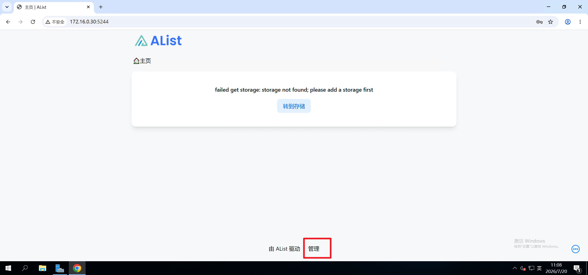

# 说明

在k8s环境部署alist。alist的配置文件在容器启动时，必须是可读写状态。

`v1.yaml`标准部署。支持数据持久化。

`v2.yaml` 改造部署，基于v1，支持自定义配置文件。

容器镜像`https://github.com/AlistGo/alist/pkgs/container/alist`

# 部署

全新环境可以快速部署，

```bash
kubectl create namespace alist
kubectl apply -f alist.yaml -n alist
```

#  查询

确认部署状态，确认5244映射的物理机端口

```bash
root@master1:/opt/alist# kubectl get all -n alist 
NAME                                    READY   STATUS    RESTARTS   AGE
pod/alist-deployment-5cc86f99d7-q6fhh   1/1     Running   0          18s

NAME                              TYPE        CLUSTER-IP      EXTERNAL-IP   PORT(S)          AGE
service/alist-clusterip-service   ClusterIP   10.233.33.194   <none>        5244/TCP         18s
service/alist-nodeport-service    NodePort    10.233.29.30    <none>        5244:30601/TCP   18s

NAME                               READY   UP-TO-DATE   AVAILABLE   AGE
deployment.apps/alist-deployment   1/1     1            1           18s

NAME                                          DESIRED   CURRENT   READY   AGE
replicaset.apps/alist-deployment-5cc86f99d7   1         1         1       18s

```

查询admin账户的密码

```bash
root@master1:/opt/alist# kubectl logs -n alist pod/alist-deployment-5cc86f99d7-q6fhh 
Defaulted container "alist-container" out of: alist-container, init-config (init)
INFO[2026-07-20 02:55:45] reading config file: data/config.json        
INFO[2026-07-20 02:55:45] load config from env with prefix:            
INFO[2026-07-20 02:55:45] init logrus...                               
INFO[2026-07-20 02:55:45] Successfully created the admin user and the initial password is: wwHzb7XR 
WARN[2026-07-20 02:55:45] init tool qBittorrent failed: Post "http://localhost:8080/api/v2/auth/login": dial tcp [::1]:8080: connect: connection refused 
INFO[2026-07-20 02:55:45] init tool Thunder success: ok                
WARN[2026-07-20 02:55:45] init tool Transmission failed: failed get transmission version: can't get session values: 'session-get' rpc method failed: failed to execute HTTP request: Post "http://localhost:9091/transmission/rpc": dial tcp [::1]:9091: connect: connection refused 
INFO[2026-07-20 02:55:45] init tool 115 Cloud success: ok              
WARN[2026-07-20 02:55:45] init tool aria2 failed: failed get aria2 version: Post "http://localhost:6800/jsonrpc": dial tcp [::1]:6800: connect: connection refused 
INFO[2026-07-20 02:55:45] init tool GuangYaPan success: ok             
INFO[2026-07-20 02:55:45] init tool SimpleHttp success: ok             
INFO[2026-07-20 02:55:45] init tool PikPak success: ok                 
INFO[2026-07-20 02:55:45] start HTTP server @ 0.0.0.0:5244             

```

# 访问

前文所示，浏览器访问`master node1的IP:30601`。账户`admin`，密码`wwHzb7XR`

首次访问需在管理功能里配置对接存储。



# 自定义配置

需自定义配置时，可使用`v2.yaml`参考以下说明

`config.json`参考`https://alistgo.com/config/configuration.html`

```bash
apiVersion: v1
kind: ConfigMap
metadata:
  name: alist-config
  labels:
    app: alist
data:
  # 可自定义alist的配置文件
  config.json: |
    {
      "force": false,
      # 可指定URL的后缀内容
      "site_url": "",
      "cdn": "",
      "jwt_secret": "YRaOORpTQDoWMQn5",
      "token_expires_in": 48,
      "database": {
        "type": "sqlite3",
        "host": "",
        "port": 0,
        "user": "",
        "password": "",
        "name": "",
        "db_file": "data/data.db",
        "table_prefix": "x_",
        "ssl_mode": "",
        "dsn": ""
      },
      "meilisearch": {
        "host": "http://localhost:7700",
        "api_key": "",
        "index_prefix": ""
      },
      "scheme": {
        "address": "0.0.0.0",
        "http_port": 5244,
        "https_port": -1,
        "force_https": false,
        "cert_file": "",
        "key_file": "",
        "unix_file": "",
        "unix_file_perm": "",
        "enable_h2c": false
      },
      "temp_dir": "data/temp",
      "bleve_dir": "data/bleve",
      "dist_dir": "",
      "log": {
        "enable": true,
        "name": "data/log/log.log",
        "max_size": 50,
        "max_backups": 30,
        "max_age": 28,
        "compress": false
      },
      "delayed_start": 0,
      "max_connections": 0,
      "max_concurrency": 64,
      "tls_insecure_skip_verify": false,
      "tasks": {
        "download": {
          "workers": 5,
          "max_retry": 1,
          "task_persistant": false
        },
        "transfer": {
          "workers": 5,
          "max_retry": 2,
          "task_persistant": false
        },
        "upload": {
          "workers": 5,
          "max_retry": 0,
          "task_persistant": false
        },
        "copy": {
          "workers": 5,
          "max_retry": 2,
          "task_persistant": false
        },
        "decompress": {
          "workers": 5,
          "max_retry": 2,
          "task_persistant": false
        },
        "decompress_upload": {
          "workers": 5,
          "max_retry": 2,
          "task_persistant": false
        },
        "s3_transition": {
          "workers": 5,
          "max_retry": 2,
          "task_persistant": false
        },
        "allow_retry_canceled": false
      },
      "cors": {
        "allow_origins": [
          "*"
        ],
        "allow_methods": [
          "*"
        ],
        "allow_headers": [
          "*"
        ]
      },
      "s3": {
        "enable": false,
        "port": 5246,
        "ssl": false
      },
      "ftp": {
        "enable": false,
        "listen": ":5221",
        "find_pasv_port_attempts": 50,
        "active_transfer_port_non_20": false,
        "idle_timeout": 900,
        "connection_timeout": 30,
        "disable_active_mode": false,
        "default_transfer_binary": false,
        "enable_active_conn_ip_check": true,
        "enable_pasv_conn_ip_check": true
      },
      "sftp": {
        "enable": false,
        "listen": ":5222"
      },
      "mcp": {
        "enable": false,
        "port": 5248
      },
      "last_launched_version": "v3.62.0"
    }
---
apiVersion: v1
kind: PersistentVolumeClaim
metadata:
  name: alist-pvc
  labels:
    app: alist
spec:
  accessModes:
    - ReadWriteOnce

  resources:
    requests:
      storage: 5Gi
---
apiVersion: apps/v1
kind: Deployment
metadata:
  name: alist-deployment
  labels:
    app: alist
spec:
  replicas: 1

  selector:
    matchLabels:
      app: alist

  template:
    metadata:
      labels:
        app: alist

    spec:
    # 用于初始化配置文件，使配置文件在初次启动时可读写。
      initContainers:
        - name: init-config
          image: swr.cn-north-4.myhuaweicloud.com/ddn-k8s/docker.io/library/busybox:1.38.0
          command: ['sh', '-c', 'if [ ! -f /data/config.json ]; then cp /config-src/config.json /data/config.json; echo "config.json copied"; else echo "config.json already exists, skipping"; fi']
          volumeMounts:
            - name: alist-config
              mountPath: /config-src
            - name: alist-data
              mountPath: /data

      containers:
        - name: alist-container
          image: swr.cn-north-4.myhuaweicloud.com/ddn-k8s/ghcr.io/alistgo/alist:v3.62.0

          imagePullPolicy: IfNotPresent

          ports:
            - name: http
              containerPort: 5244
              protocol: TCP

          env:
            - name: PUID
              value: "0"

            - name: PGID
              value: "0"

            - name: UMASK
              value: "022"
          # 数据持久化
          volumeMounts:
            - name: alist-data
              mountPath: /opt/alist/data

          resources:
            requests:
              cpu: 100m
              memory: 128Mi

            limits:
              cpu: "1"
              memory: 1Gi

      volumes:
        - name: alist-config
          configMap:
            name: alist-config
        - name: alist-data
          persistentVolumeClaim:
            claimName: alist-pvc
---
apiVersion: v1
kind: Service
metadata:
  name: alist-clusterip-service
  labels:
    app: alist

spec:
  type: ClusterIP

  selector:
    app: alist

  ports:
    - name: http
      protocol: TCP
      port: 5244
      targetPort: 5244
---
apiVersion: v1
kind: Service
metadata:
  name: alist-nodeport-service
  labels:
    app: alist

spec:
  type: NodePort

  selector:
    app: alist

  ports:
    - name: http
      protocol: TCP
      port: 5244
      targetPort: 5244

```

