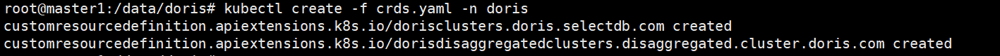
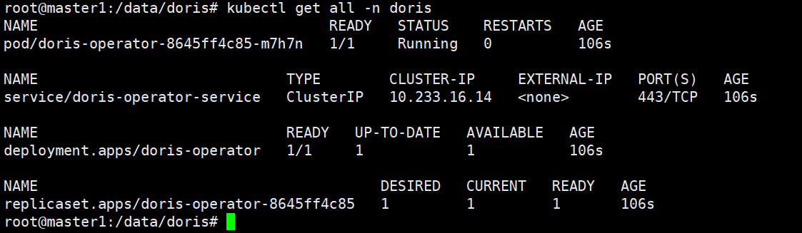
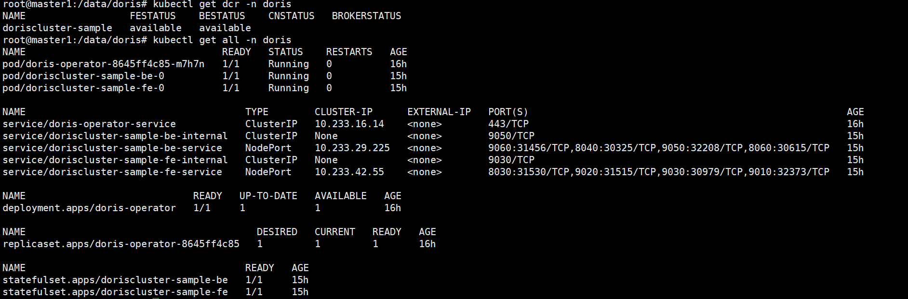
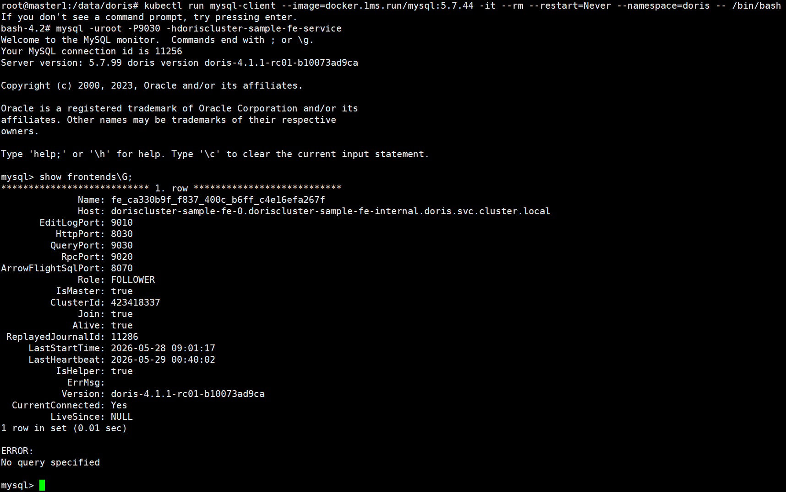

# 说明

在k8s环境部署Doris集群，存算一体。支持离线和联网部署。

# 参考资料

`https://doris.apache.org/docs/dev/install/deploy-on-kubernetes/intro`

# 创建namespace

```bash
kubectl create namespace doris
```


# 部署Doris Operator CRD

离线部署时，需下载`https://raw.githubusercontent.com/apache/doris-operator/master/config/crd/bases/crds.yaml`

```bash
kubectl create -f crds.yaml -n doris
```




# 部署Doris Operator

离线部署时，

需下载文件`https://raw.githubusercontent.com/apache/doris-operator/master/config/operator/operator.yaml`

下载容器镜像`apache/doris:operator-latest`

```bash
kubectl apply -f operator.yaml -n doris
```




# 部署Doris集群

离线部署时，需下载`https://raw.githubusercontent.com/apache/doris-operator/master/doc/examples/doriscluster-sample.yaml`，需下载容器镜像，`https://hub.docker.com/r/apache/doris/tags`

修改文件时需参考`https://doris.apache.org/docs/dev/install/deploy-on-kubernetes/integrated-storage-compute/install-config-cluster` ，根据业务需求做改动。当前默认配置仅适用于最小资源环境。


部署

```bash
kubectl apply -f doriscluster-sample.yaml -n doris
```


# 查询验证

```bash
kubectl get dcr -n doris
kubectl get all -n doris
```

需等待较长时间，查询结果类似下图，




集群内访问测试

```bash
# 创建临时MySQL客户端
kubectl run mysql-client --image=mysql:5.7.44 -it --rm --restart=Never --namespace=doris -- /bin/bash
# 访问Doris
mysql -uroot -P9030 -hdoriscluster-sample-fe-service
# 查询节点
show frontends\G;
show backends\G;
```



