# 更新计划

配置文件挂载到容器内指定位置。更精确管理配置文件。

# 说明

在docker环境部署Hadoop任意版本。
以Hadoop v3.1.1为例展示操作步骤。

参考`https://hadoop.apache.org/docs/stable/hadoop-yarn/hadoop-yarn-site/DockerContainers.html`

# 配置说明

目录v1是Hadoop原版。

目录v2是改造版，推荐使用。已做配置优化。

## 数据持久化
数据持久化通过数据卷挂载容器指定目录方式实现。 重建容器后，docker自动将数据卷挂载回容器指定目录，重新读取原数据。

# 构建容器镜像
推荐使用现有容器镜像。若对Hadoop进行改造，可定制镜像。 参考上级目录的`imageBuild`

# 启动Hadoop
```bash
docker compose up -d
```

# 查询Hadoop集群状态
```bash
docker compose ps -a
```

# 环境清理
清空Hadoop集群组件，测试环境可清理所有数据，生产环境建议留存数据。

## 留存数据

```bash
docker compose down
```

## 不留存数据
```bash
docker compose down -v
```


# 数据持久化测试
以下方法用于证明数据持久化生效，确保容器故障后不丢失数据。

## 测试namenode

以下方法证明namenode数据持久化生效。

```bash
# 1. 进入 NameNode 容器
docker exec -it hadoop-namenode bash

# 2. 在 HDFS 中创建测试目录
hdfs dfs -mkdir /test_persistence

# 3. 创建一个包含时间戳的测试文件，写入 HDFS
echo "This is a test file created at $(date)" > /tmp/test_file.txt
hdfs dfs -put /tmp/test_file.txt /test_persistence/namenode_test.txt

# 4. 退出容器
exit

# 5. 使用 down/up 重建 Namenode 服务
# 注意：这里只操作 Namenode
docker compose stop namenode
docker compose rm -f namenode

# 6. 重新启动集群（这会重建并启动 Namenode）
docker compose up -d namenode

# 7. 进入 NameNode 容器
docker exec -it hadoop-namenode bash

# 8. 尝试列出并查看刚才创建的文件
hdfs dfs -ls /test_persistence
hdfs dfs -cat /test_persistence/namenode_test.txt

# 9. 退出容器
exit
```

## 测试datanode
以下方法证明datanode数据持久化生效

### 模拟容器故障场景

确认容器状态正常

```bash
docker ps -a
```

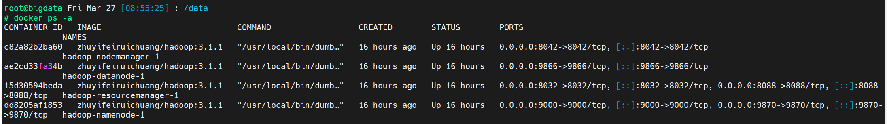

在容器内写入测试数据

```bash
docker exec -it hadoop-namenode bash
echo "验证DataNode数据持久化：容器重启后数据不丢失" > persist-test.txt
hdfs dfs -put persist-test.txt /
hdfs dfs -ls /
hdfs dfs -cat /persist-test.txt
exit
```

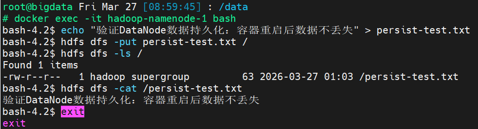

删除容器，确认容器真实删除

```bash
docker compose down
docker ps -a
```

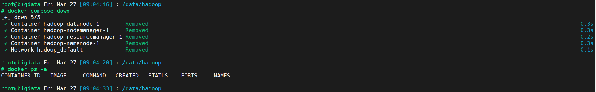

重建容器，确认容器正常

```bash
docker compose up -d
docker compose ps -a
```

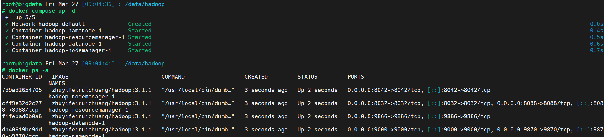

验证数据状态，

```bash
docker exec -it hadoop-namenode bash
hdfs dfs -ls /
hdfs dfs -cat /persist-test.txt
exit
```

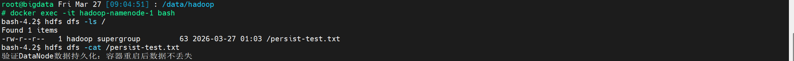

证明常规启停容器时，数据持久化生效。

模拟破坏删除容器，重建容器并测试数据，

```bash
 docker rm -f hadoop-datanode
 docker compose up -d datanode
 docker exec -it hadoop-namenode hdfs dfs -cat /persist-test.txt
```

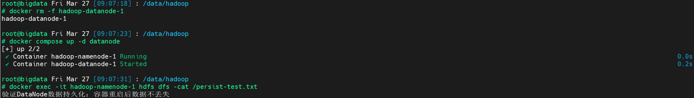

证明破坏删除容器时，数据持久化生效。

### 模拟数据卷故障场景

备份数据卷，将现有数据卷所在目录备份到其他位置

```bash
cp -r hadoop-dn-data/ /opt/
```

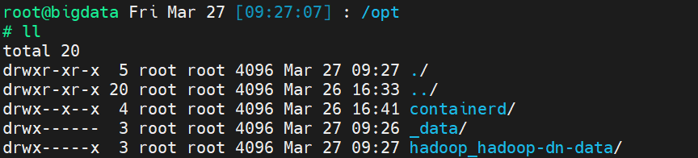


删除容器，

```bash
docker compose down
```

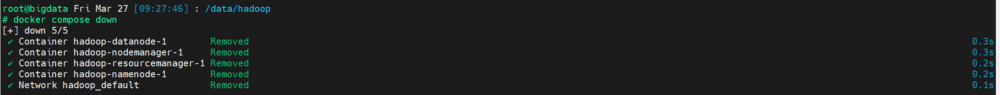

删除数据卷，模拟数据卷被破坏，

```bash
docker volume rm hadoop-dn-data
```

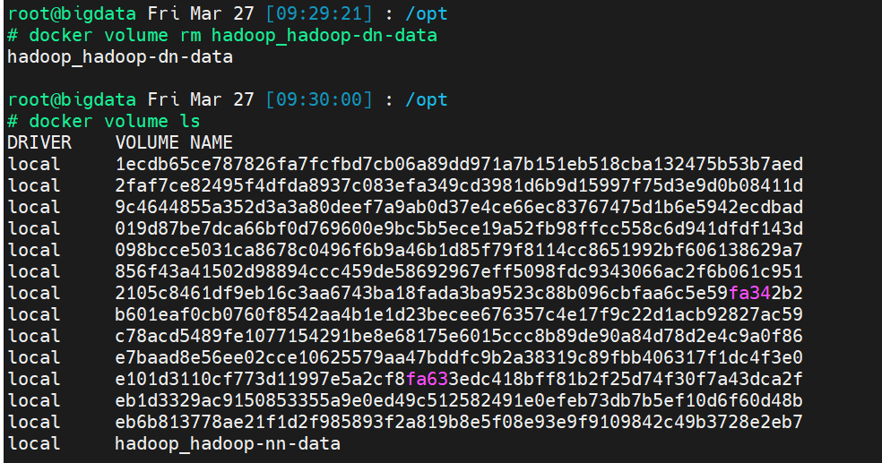

重建容器，

```bash
docker compose up -d
```

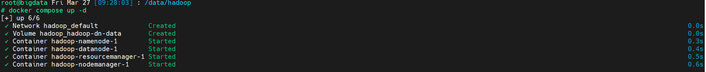

可见容器存在故障，已找不到数据，

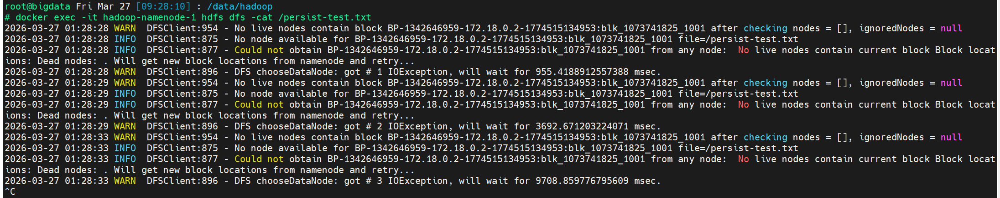

删除容器，删除重建重启时的无数据的卷，新建空数据卷。

注意：必须先有数据卷，才能再把数据复制过去，否则新建数据卷会使旧数据混乱。

```bash
docker compose down
docker volume rm hadoop-dn-data
docker volume create hadoop-dn-data
```

将备份数据转移到新数据卷存储位置，

```bash
cp -r hadoop-dn-data/ /data/docker/volumes/
```

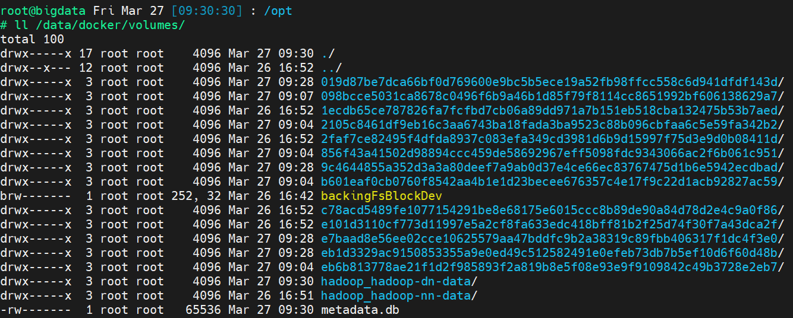

创建容器

```bash
docker compose up -d
```

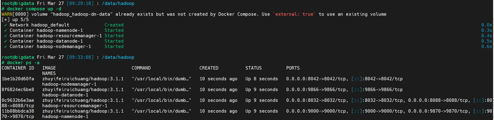

验证数据状态

```bash
 docker exec -it hadoop-namenode hdfs dfs -cat /persist-test.txt
```

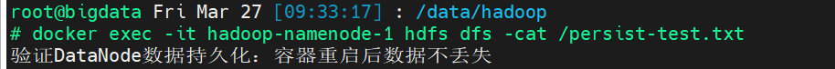

证明数据卷被破坏时，可通过数据备份恢复，实现数据持久化。

