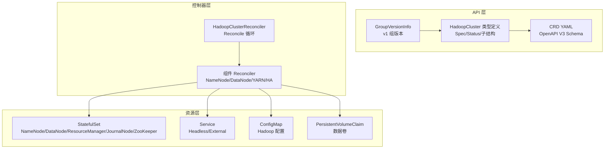
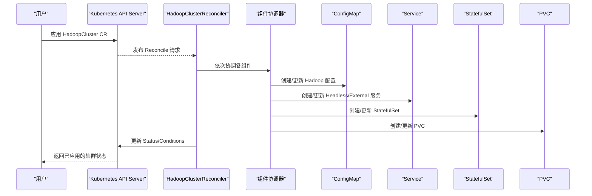
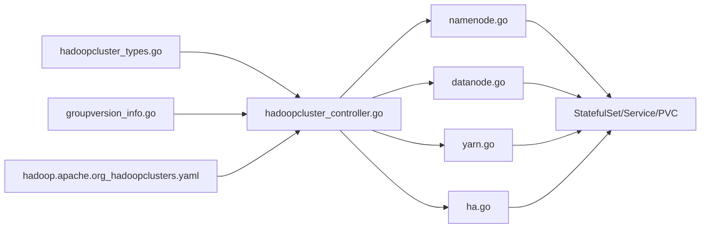

# API 参考

<cite>
**本文引用的文件**
- [hadoopcluster_types.go](file://hadoop-operator/api/v1/hadoopcluster_types.go)
- [groupversion_info.go](file://hadoop-operator/api/v1/groupversion_info.go)
- [hadoop.apache.org_hadoopclusters.yaml](file://hadoop-operator/config/crd/bases/hadoop.apache.org_hadoopclusters.yaml)
- [hadoopcluster_controller.go](file://hadoop-operator/internal/controller/hadoopcluster_controller.go)
- [namenode.go](file://hadoop-operator/internal/reconciler/namenode.go)
- [datanode.go](file://hadoop-operator/internal/reconciler/datanode.go)
- [yarn.go](file://hadoop-operator/internal/reconciler/yarn.go)
- [ha.go](file://hadoop-operator/internal/reconciler/ha.go)
- [hadoop_v1_hadoopcluster.yaml](file://hadoop-operator/config/samples/hadoop_v1_hadoopcluster.yaml)
- [hadoop_v1_hadoopcluster_ha.yaml](file://hadoop-operator/config/samples/hadoop_v1_hadoopcluster_ha.yaml)
- [offline-deployment.yaml](file://hadoop-operator/config/samples/offline-deployment.yaml)
- [README.md](file://hadoop-operator/README.md)
- [go.mod](file://hadoop-operator/go.mod)
</cite>

## 目录
1. [简介](#简介)
2. [项目结构](#项目结构)
3. [核心组件](#核心组件)
4. [架构总览](#架构总览)
5. [详细组件分析](#详细组件分析)
6. [依赖关系分析](#依赖关系分析)
7. [性能与可靠性考量](#性能与可靠性考量)
8. [故障排查指南](#故障排查指南)
9. [结论](#结论)
10. [附录](#附录)

## 简介
本文件为 Apache Hadoop Operator v3 的完整 API 参考，聚焦于 HadoopCluster CRD 的字段定义、数据类型、验证规则与使用约束；解释控制器接口、Reconciler 方法与 Kubernetes 资源操作 API；提供 CRD 规范、字段说明与示例配置；涵盖 API 版本兼容性、变更历史与迁移指南；阐述自定义资源的状态字段、条件类型与事件处理；并给出 API 使用示例、最佳实践与常见错误规避方法。

## 项目结构
- CRD 定义与 OpenAPI V3 规范位于 config/crd/bases 下，Go 类型定义位于 api/v1。
- 控制器实现位于 internal/controller，组件协调器位于 internal/reconciler。
- 示例配置位于 config/samples，README 提供快速开始与架构说明。

图表来源
- [groupversion_info.go:27-36](file://hadoop-operator/api/v1/groupversion_info.go#L27-L36)
- [hadoopcluster_types.go:24-46](file://hadoop-operator/api/v1/hadoopcluster_types.go#L24-L46)
- [hadoop.apache.org_hadoopclusters.yaml:18-411](file://hadoop-operator/config/crd/bases/hadoop.apache.org_hadoopclusters.yaml#L18-L411)
- [hadoopcluster_controller.go:41-145](file://hadoop-operator/internal/controller/hadoopcluster_controller.go#L41-L145)
- [namenode.go:35-114](file://hadoop-operator/internal/reconciler/namenode.go#L35-L114)
- [datanode.go:34-113](file://hadoop-operator/internal/reconciler/datanode.go#L34-L113)
- [yarn.go:34-113](file://hadoop-operator/internal/reconciler/yarn.go#L34-L113)
- [ha.go:34-177](file://hadoop-operator/internal/reconciler/ha.go#L34-L177)

章节来源
- [README.md:128-230](file://hadoop-operator/README.md#L128-L230)
- [hadoopcluster_types.go:24-46](file://hadoop-operator/api/v1/hadoopcluster_types.go#L24-L46)
- [hadoop.apache.org_hadoopclusters.yaml:18-411](file://hadoop-operator/config/crd/bases/hadoop.apache.org_hadoopclusters.yaml#L18-L411)

## 核心组件
- HadoopCluster CRD：描述 HDFS 与 YARN 组件的期望状态、镜像、存储、服务、安全与监控等配置，并携带状态字段与条件。
- 控制器 HadoopClusterReconciler：负责 Reconcile 循环，按顺序协调 ConfigMap、服务、StatefulSet、PVC 等资源，更新状态与条件。
- 组件协调器：分别处理 NameNode、DataNode、ResourceManager、NodeManager、ZooKeeper 与 JournalNode 的创建与更新逻辑。

章节来源
- [hadoopcluster_types.go:297-315](file://hadoop-operator/api/v1/hadoopcluster_types.go#L297-L315)
- [hadoopcluster_controller.go:41-145](file://hadoop-operator/internal/controller/hadoopcluster_controller.go#L41-L145)
- [namenode.go:116-317](file://hadoop-operator/internal/reconciler/namenode.go#L116-L317)
- [datanode.go:115-321](file://hadoop-operator/internal/reconciler/datanode.go#L115-L321)
- [yarn.go:115-447](file://hadoop-operator/internal/reconciler/yarn.go#L115-L447)
- [ha.go:34-177](file://hadoop-operator/internal/reconciler/ha.go#L34-L177)

## 架构总览
HadoopCluster CRD 通过控制器驱动，生成并维护以下资源：
- ConfigMap：承载 Hadoop 配置文件（core-site、hdfs-site、yarn-site 等）。
- Service：Headless 服务用于稳定网络标识，External 服务暴露 RPC/Web 端口。
- StatefulSet：NameNode、DataNode、ResourceManager、NodeManager、ZooKeeper、JournalNode。
- PVC：持久化数据卷，按需创建。

图表来源
- [hadoopcluster_controller.go:104-144](file://hadoop-operator/internal/controller/hadoopcluster_controller.go#L104-L144)
- [namenode.go:35-114](file://hadoop-operator/internal/reconciler/namenode.go#L35-L114)
- [datanode.go:34-113](file://hadoop-operator/internal/reconciler/datanode.go#L34-L113)
- [yarn.go:34-113](file://hadoop-operator/internal/reconciler/yarn.go#L34-L113)
- [ha.go:34-177](file://hadoop-operator/internal/reconciler/ha.go#L34-L177)

## 详细组件分析

### HadoopCluster CRD 字段定义与规范
- 组与版本：hadoop.apache.org/v1
- 资源：hadoopclusters，短名 hc，命名空间作用域
- 打印列：Phase、Age
- 状态子资源：status

字段概览（按层级与用途分组）：
- 顶层 Spec
  - image：镜像仓库、标签、拉取策略、拉取密钥
  - hdfs：NameNode、DataNode 配置
  - yarn：ResourceManager、NodeManager 配置
  - config：coreSite、hdfsSite、yarnSite、mapredSite、capacityScheduler
  - security：kerberos、tls、ranger
  - metrics：启用指标、导出器镜像、ServiceMonitor
- 状态 Status
  - phase：集群阶段（Pending/Created/Running/Failed/Deleting/Upgrading）
  - conditions：Ready/Progressing/Degraded 条件
  - nameNode、dataNode、resourceManager、nodeManager：各组件就绪副本、总数、活跃/备用节点等

CRD OpenAPI V3 规范要点：
- 所有对象属性均为可选（除非明确 required），允许渐进式配置
- ServiceSpec 中的 nodePorts、annotations 为映射类型
- StorageSpec 的 size 支持字符串表达式（如 "100Gi"）
- 资源请求/限制使用 Kubernetes 资源模型
- ServiceMonitorSpec 的 labels 为键值映射，interval 为字符串

章节来源
- [hadoopcluster_types.go:24-46](file://hadoop-operator/api/v1/hadoopcluster_types.go#L24-L46)
- [hadoopcluster_types.go:48-295](file://hadoop-operator/api/v1/hadoopcluster_types.go#L48-L295)
- [hadoopcluster_types.go:297-315](file://hadoop-operator/api/v1/hadoopcluster_types.go#L297-L315)
- [hadoopcluster_types.go:317-345](file://hadoop-operator/api/v1/hadoopcluster_types.go#L317-L345)
- [hadoopcluster_types.go:347-389](file://hadoop-operator/api/v1/hadoopcluster_types.go#L347-L389)
- [hadoop.apache.org_hadoopclusters.yaml:18-411](file://hadoop-operator/config/crd/bases/hadoop.apache.org_hadoopclusters.yaml#L18-L411)

### 控制器接口与 Reconciler 方法
- Reconcile(ctx, req)：主循环
  - 获取 CR 实例，设置初始 Phase 为 Pending 并写入 status
  - 添加 Finalizer，处理删除流程
  - 将 Phase 设为 Creating，触发事件
  - 顺序调用组件协调器：ConfigMap、NameNode 服务与 StatefulSet、DataNode 服务与 StatefulSet、ResourceManager 服务与 StatefulSet、NodeManager 服务与 StatefulSet
  - 更新 Status（各组件 replicas/readyReplicas、活跃/备用节点、Ready 条件）
  - 若全部组件就绪且 Phase 非 Running，则更新为 Running 并记录事件
  - 默认每 30 秒重试
- 删除流程：设置 Phase 为 Deleting，移除 Finalizer 后返回
- SetupWithManager：声明对 HadoopCluster 的监听，并拥有 StatefulSet、Service、ConfigMap、PVC 等资源

章节来源
- [hadoopcluster_controller.go:58-145](file://hadoop-operator/internal/controller/hadoopcluster_controller.go#L58-L145)
- [hadoopcluster_controller.go:149-167](file://hadoop-operator/internal/controller/hadoopcluster_controller.go#L149-L167)
- [hadoopcluster_controller.go:169-174](file://hadoop-operator/internal/controller/hadoopcluster_controller.go#L169-L174)
- [hadoopcluster_controller.go:176-227](file://hadoop-operator/internal/controller/hadoopcluster_controller.go#L176-L227)
- [hadoopcluster_controller.go:229-239](file://hadoop-operator/internal/controller/hadoopcluster_controller.go#L229-L239)

### Kubernetes 资源操作 API
- RBAC 权限
  - hadoopclusters：get/list/watch/create/update/patch/delete/status/finalizers
  - apps：statefulsets/deployments
  - core：services/configmaps/persistentvolumeclaims/events
- 事件：创建、运行、错误等事件通过 EventRecorder 记录
- OwnerReference：所有由控制器创建的资源均设置控制器为 Owner

章节来源
- [hadoopcluster_controller.go:48-56](file://hadoop-operator/internal/controller/hadoopcluster_controller.go#L48-L56)
- [hadoopcluster_controller.go:101-121](file://hadoop-operator/internal/controller/hadoopcluster_controller.go#L101-L121)

### 组件协调器（NameNode）
- 服务
  - Headless 服务：稳定 DNS 名称，暴露 RPC/Web 端口
  - External 服务：根据 ServiceSpec.type 与 nodePorts 映射创建
- StatefulSet
  - 默认副本数：若未指定则为 1；HA 模式下最少 2
  - InitContainer：初始化数据目录与权限；HA 模式下首实例格式化 NameNode
  - Container：启动 hdfs namenode，配置探针与日志目录
  - Volume：hadoop-config、logs；PVC：namenode-data
- HA 协作
  - 当 HA 启用时，NameNode 与 JournalNode、ZooKeeper 协同工作（由 HA 协调器负责）

章节来源
- [namenode.go:35-114](file://hadoop-operator/internal/reconciler/namenode.go#L35-L114)
- [namenode.go:116-317](file://hadoop-operator/internal/reconciler/namenode.go#L116-L317)
- [namenode.go:328-362](file://hadoop-operator/internal/reconciler/namenode.go#L328-L362)

### 组件协调器（DataNode）
- 服务
  - Headless 服务：暴露 data/web 端口
  - External 服务：根据 ServiceSpec.type 与 nodePorts 映射创建
- StatefulSet
  - 默认副本数：若未指定则为 3
  - InitContainer：等待 NameNode 就绪后设置数据目录权限
  - Container：启动 hdfs datanode，配置探针与日志目录
  - Volume：hadoop-config；PVC：datanode-data
- 依赖
  - 通过 Headless 服务访问 NameNode

章节来源
- [datanode.go:34-113](file://hadoop-operator/internal/reconciler/datanode.go#L34-L113)
- [datanode.go:115-321](file://hadoop-operator/internal/reconciler/datanode.go#L115-L321)

### 组件协调器（YARN）
- ResourceManager
  - 服务：headless 与 external，端口 8032（RPC）、8088（Web）
  - StatefulSet：默认副本数 1；HA 模式下最少 2；容器命令 yarn resourcemanager
- NodeManager
  - 服务：headless 与 external，端口 8042（Web）
  - StatefulSet：默认副本数 2；InitContainer 等待 ResourceManager 就绪
- 探针：liveness/readiness 健康检查路径与周期

章节来源
- [yarn.go:34-113](file://hadoop-operator/internal/reconciler/yarn.go#L34-L113)
- [yarn.go:115-240](file://hadoop-operator/internal/reconciler/yarn.go#L115-L240)
- [yarn.go:242-310](file://hadoop-operator/internal/reconciler/yarn.go#L242-L310)
- [yarn.go:312-447](file://hadoop-operator/internal/reconciler/yarn.go#L312-L447)

### 高可用（HA）协调器
- ZooKeeper
  - 若配置外部连接串则跳过内部部署；否则创建 Headless 服务与 3 副本 StatefulSet（zookeeper:3.8），PVC 10Gi
- JournalNode
  - HA 启用时创建 Headless 服务与 StatefulSet，默认副本数 3；容器命令 hdfs journalnode
- 服务器列表
  - 通过 getZooKeeperServers 生成集群内服务地址列表

章节来源
- [ha.go:34-177](file://hadoop-operator/internal/reconciler/ha.go#L34-L177)
- [ha.go:179-363](file://hadoop-operator/internal/reconciler/ha.go#L179-L363)
- [ha.go:383-393](file://hadoop-operator/internal/reconciler/ha.go#L383-L393)

### 状态字段、条件类型与事件处理
- Phase
  - Pending/Created/Running/Failed/Deleting/Upgrading
- Conditions
  - Ready：集群整体就绪
  - Progressing：正在创建或升级
  - Degraded：部分组件异常
- 事件
  - 创建、运行、错误等事件通过 EventRecorder 记录，便于排障

章节来源
- [hadoopcluster_types.go:317-345](file://hadoop-operator/api/v1/hadoopcluster_types.go#L317-L345)
- [hadoopcluster_types.go:297-315](file://hadoop-operator/api/v1/hadoopcluster_types.go#L297-L315)
- [hadoopcluster_controller.go:101-121](file://hadoop-operator/internal/controller/hadoopcluster_controller.go#L101-L121)
- [hadoopcluster_controller.go:135-141](file://hadoop-operator/internal/controller/hadoopcluster_controller.go#L135-L141)

### API 版本兼容性与迁移指南
- API 组与版本：hadoop.apache.org/v1
- 依赖的 Kubernetes 版本：Go 1.21，k8s.io/* v0.29.0，controller-runtime v0.17.0
- 迁移建议
  - 从旧版本升级时，先应用 CRD YAML，再升级 Operator 镜像
  - 注意 CRD 字段的可选性变化，避免遗漏必填项
  - HA 配置中 JournalNode 副本数应满足最小仲裁要求（≥3）

章节来源
- [groupversion_info.go:27-36](file://hadoop-operator/api/v1/groupversion_info.go#L27-L36)
- [go.mod:3-10](file://hadoop-operator/go.mod#L3-L10)
- [hadoopcluster_types.go:113-114](file://hadoop-operator/api/v1/hadoopcluster_types.go#L113-L114)

### CRD 规范与字段说明（摘要）
- image.repository/tag/pullPolicy/pullSecrets
- hdfs.nameNode.replicas/resources/storage/service/ha/affinity/tolerations
- hdfs.dataNode.replicas/resources/storage/service/affinity/tolerations
- yarn.resourceManager.replicas/resources/service/ha/affinity/tolerations
- yarn.nodeManager.replicas/resources/service/affinity/tolerations
- config.coreSite/hdfsSite/yarnSite/mapredSite/capacityScheduler
- security.kerberos.enabled/realm/kdc/adminServer/keytabSecret
- security.tls.enabled/certificateSecret
- security.ranger.enabled/adminURL
- metrics.enabled/exporterImage/serviceMonitor.enabled/labels/interval

章节来源
- [hadoopcluster_types.go:48-295](file://hadoop-operator/api/v1/hadoopcluster_types.go#L48-L295)
- [hadoop.apache.org_hadoopclusters.yaml:42-406](file://hadoop-operator/config/crd/bases/hadoop.apache.org_hadoopclusters.yaml#L42-L406)

### 示例配置
- 基础部署：包含 NameNode、DataNode、ResourceManager、NodeManager 的基础配置
- 高可用部署：NameNode/ResourceManager HA，JournalNode 副本数与亲和性
- 离线部署：私有镜像仓库、拉取密钥、外部 ZooKeeper 连接串、ServiceMonitor 关闭

章节来源
- [hadoop_v1_hadoopcluster.yaml:1-80](file://hadoop-operator/config/samples/hadoop_v1_hadoopcluster.yaml#L1-L80)
- [hadoop_v1_hadoopcluster_ha.yaml:1-107](file://hadoop-operator/config/samples/hadoop_v1_hadoopcluster_ha.yaml#L1-L107)
- [offline-deployment.yaml:1-135](file://hadoop-operator/config/samples/offline-deployment.yaml#L1-L135)

## 依赖关系分析

图表来源
- [hadoopcluster_types.go:415-417](file://hadoop-operator/api/v1/hadoopcluster_types.go#L415-L417)
- [groupversion_info.go:27-36](file://hadoop-operator/api/v1/groupversion_info.go#L27-L36)
- [hadoopcluster_controller.go:41-46](file://hadoop-operator/internal/controller/hadoopcluster_controller.go#L41-L46)
- [namenode.go:116-317](file://hadoop-operator/internal/reconciler/namenode.go#L116-L317)
- [datanode.go:115-321](file://hadoop-operator/internal/reconciler/datanode.go#L115-L321)
- [yarn.go:115-447](file://hadoop-operator/internal/reconciler/yarn.go#L115-L447)
- [ha.go:34-177](file://hadoop-operator/internal/reconciler/ha.go#L34-L177)

章节来源
- [hadoopcluster_controller.go:230-239](file://hadoop-operator/internal/controller/hadoopcluster_controller.go#L230-L239)

## 性能与可靠性考量
- 资源配额：合理设置 requests/limits，避免 OOM 或资源争抢
- 存储：根据数据规模选择合适的 size、StorageClass 与 AccessMode
- 副本数：NameNode/ResourceManager HA 至少 2；JournalNode 至少 3；DataNode/NodeManager 建议 ≥3
- 探针：健康检查路径与周期需结合负载调整
- 网络：Headless 服务保证稳定 DNS；External 服务暴露必要端口
- 事件：关注控制器事件，及时发现异常

[本节为通用指导，无需特定文件来源]

## 故障排查指南
- Pod 启动失败：查看 Pod 事件与日志
- NameNode 格式化失败：检查 PVC 状态与手动格式化
- DataNode 无法连接 NameNode：检查网络连通性与配置
- 镜像拉取失败：检查镜像存在性与 Secret 配置

章节来源
- [README.md:276-318](file://hadoop-operator/README.md#L276-L318)

## 结论
HadoopCluster CRD 提供了对 HDFS 与 YARN 的全生命周期管理能力，配合控制器与组件协调器，能够自动化地创建与维护 Hadoop 集群。通过 CRD 的 OpenAPI V3 规范与清晰的状态/条件设计，用户可以以声明式方式管理复杂的分布式系统。建议在生产环境中遵循副本数、存储与资源配额的最佳实践，并利用 HA 与监控能力提升可靠性与可观测性。

[本节为总结，无需特定文件来源]

## 附录

### API 使用示例与最佳实践
- 使用示例
  - 基础部署：参考基础示例配置，逐步添加 HDFS 与 YARN 组件
  - 高可用部署：启用 NameNode/ResourceManager HA，配置 JournalNode 副本数与亲和性
  - 离线部署：配置私有镜像仓库与拉取密钥，必要时使用外部 ZooKeeper
- 最佳实践
  - 优先使用稳定的 StorageClass 与合适的 AccessMode
  - 为关键组件设置亲和性与容忍度，确保跨节点分布
  - 启用监控并配置 ServiceMonitor，便于 Prometheus 抓取指标
  - 严格控制资源请求/限制，避免资源争用

章节来源
- [hadoop_v1_hadoopcluster.yaml:1-80](file://hadoop-operator/config/samples/hadoop_v1_hadoopcluster.yaml#L1-L80)
- [hadoop_v1_hadoopcluster_ha.yaml:1-107](file://hadoop-operator/config/samples/hadoop_v1_hadoopcluster_ha.yaml#L1-L107)
- [offline-deployment.yaml:1-135](file://hadoop-operator/config/samples/offline-deployment.yaml#L1-L135)
- [README.md:128-230](file://hadoop-operator/README.md#L128-L230)