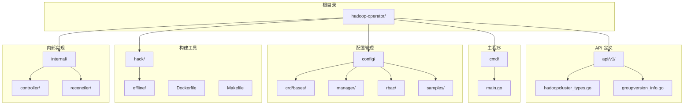
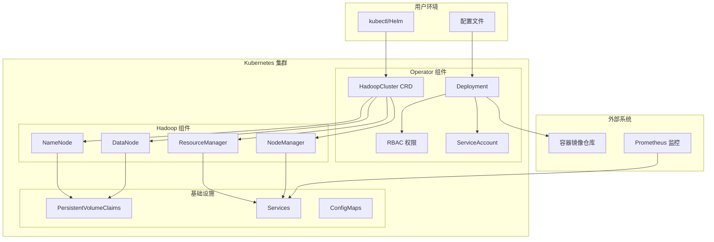
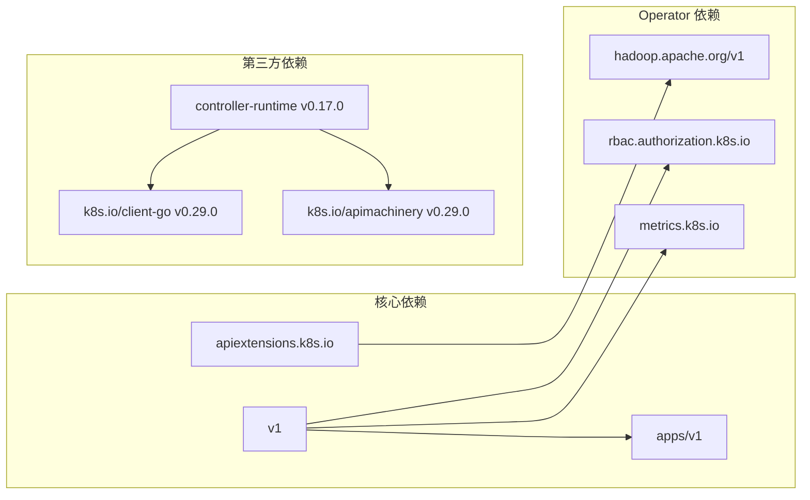
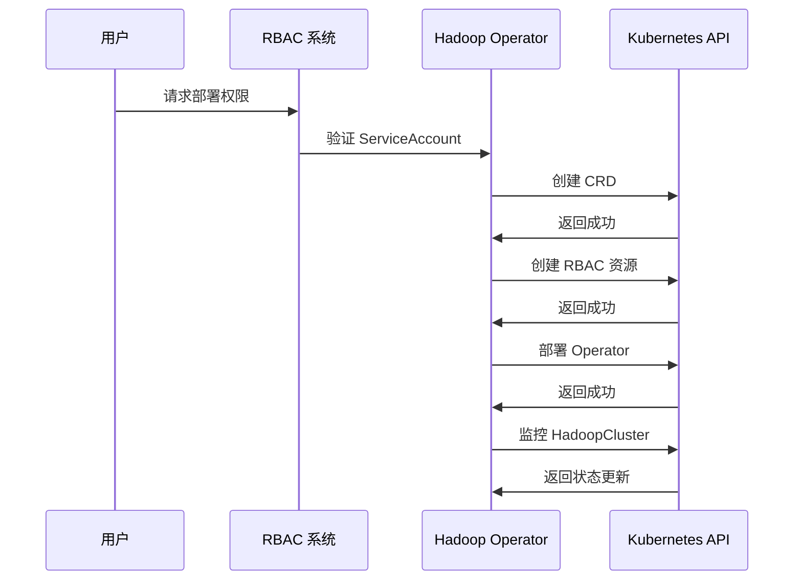

# 前置条件与环境准备

<cite>
**本文档引用的文件**
- [README.md](file://README.md)
- [go.mod](file://go.mod)
- [Makefile](file://Makefile)
- [Dockerfile](file://Dockerfile)
- [main.go](file://cmd/main.go)
- [hadoop.apache.org_hadoopclusters.yaml](file://config/crd/bases/hadoop.apache.org_hadoopclusters.yaml)
- [hadoop_v1_hadoopcluster.yaml](file://config/samples/hadoop_v1_hadoopcluster.yaml)
- [hadoop_v1_hadoopcluster_ha.yaml](file://config/samples/hadoop_v1_hadoopcluster_ha.yaml)
- [manager.yaml](file://config/manager/manager.yaml)
- [service_account.yaml](file://config/rbac/service_account.yaml)
- [role.yaml](file://config/rbac/role.yaml)
- [role_binding.yaml](file://config/rbac/role_binding.yaml)
- [save-images.sh](file://hack/offline/save-images.sh)
- [load-images.sh](file://hack/offline/load-images.sh)
</cite>

## 目录
1. [简介](#简介)
2. [项目结构](#项目结构)
3. [核心组件](#核心组件)
4. [架构概览](#架构概览)
5. [详细组件分析](#详细组件分析)
6. [依赖关系分析](#依赖关系分析)
7. [性能考虑](#性能考虑)
8. [故障排查指南](#故障排查指南)
9. [结论](#结论)
10. [附录](#附录)

## 简介

Hadoop Operator 是一个用于在 Kubernetes 上部署和管理 Hadoop 集群的生产级 Operator。该项目支持 HDFS 和 YARN 的高可用部署，以及离线环境部署。本文档专注于部署前的前置条件与环境准备，确保读者能够在部署前完成所有必要的准备工作。

## 项目结构

Hadoop Operator 项目采用标准的 Kubernetes Operator 结构，主要包含以下核心目录：

**图表来源**
- [README.md: 235-251:235-251](file://README.md#L235-L251)
- [Makefile: 1-165:1-165](file://Makefile#L1-L165)

**章节来源**
- [README.md: 235-251:235-251](file://README.md#L235-L251)
- [Makefile: 1-165:1-165](file://Makefile#L1-L165)

## 核心组件

### Kubernetes 版本要求

根据项目文档，Hadoop Operator 需要 Kubernetes 版本 1.24 或更高版本：

- **最低版本要求**: Kubernetes 1.24+
- **兼容性**: 支持 1.29.0 测试环境
- **Go 版本**: Go 1.21

这些要求确保了与现代 Kubernetes 特性的兼容性，包括 CRD、RBAC 和各种工作负载类型的支持。

### kubectl 工具配置

kubectl 是 Kubernetes 的命令行工具，必须正确配置以访问目标集群：

- **配置文件**: `~/.kube/config`
- **权限要求**: 需要具有管理员权限以部署 CRD、RBAC 规则和 Operator
- **集群连接**: 确保能够连接到目标 Kubernetes 集群

### Helm 3.x 可选安装

Helm 3.x 提供了可选的包管理功能：

- **版本要求**: Helm 3.x
- **用途**: 可用于更复杂的部署场景和配置管理
- **替代方案**: 项目也提供了基于 kubectl 的直接部署方式

**章节来源**
- [README.md: 17-21:17-21](file://README.md#L17-L21)
- [go.mod: 3](file://go.mod#L3)
- [Makefile: 4](file://Makefile#L4)

## 架构概览

Hadoop Operator 的整体架构基于 Kubernetes Operator 模式：

**图表来源**
- [README.md: 320-347:320-347](file://README.md#L320-L347)
- [manager.yaml: 10-80:10-80](file://config/manager/manager.yaml#L10-L80)
- [hadoop.apache.org_hadoopclusters.yaml: 1-411:1-411](file://config/crd/bases/hadoop.apache.org_hadoopclusters.yaml#L1-L411)

## 详细组件分析

### 系统资源要求

根据示例配置，Hadoop 组件的资源需求如下：

#### NameNode 资源要求
- **基础模式**: 1个副本，CPU 500m-1000m，内存 2Gi-4Gi
- **高可用模式**: 2个副本，CPU 1000m-2000m，内存 4Gi-8Gi
- **存储**: 50Gi-100Gi，使用指定的 StorageClass

#### DataNode 资源要求
- **副本数**: 3个（基础模式），可根据需要调整
- **CPU**: 500m-1000m（基础模式），1000m-2000m（高可用模式）
- **内存**: 2Gi-4Gi（基础模式），4Gi-8Gi（高可用模式）
- **存储**: 200Gi-500Gi

#### ResourceManager 资源要求
- **副本数**: 1-2个（高可用模式）
- **CPU**: 500m-1000m
- **内存**: 2Gi-4Gi

#### NodeManager 资源要求
- **副本数**: 3个
- **CPU**: 500m-1000m
- **内存**: 2Gi-4Gi

### 网络配置要求

Hadoop 组件需要特定的网络配置：

#### 服务类型
- **NameNode**: 支持 NodePort 类型，端口 30070（Web UI）、30090（RPC）
- **ResourceManager**: 支持 NodePort 类型，端口 30088
- **Headless 服务**: 用于 StatefulSet 内部通信

#### 端口映射
- NameNode RPC 端口: 9000
- NameNode Web UI: 9870
- ResourceManager Web UI: 8088
- DataNode HTTP: 50075
- NodeManager HTTP: 8042

### 存储类配置要求

项目支持动态 PVC 和多种 StorageClass：

#### 存储配置参数
- **大小**: 50Gi-500Gi（根据组件类型）
- **StorageClass**: 默认使用 "standard"
- **访问模式**: ReadWriteOnce (RWO)

#### 高可用存储要求
- **JournalNode**: 至少 3 个副本，每个 50Gi
- **NameNode HA**: 需要可靠的持久化存储
- **DataNode**: 大容量存储，建议使用高性能存储类

### 环境检查清单

部署前必须完成以下检查：

#### 基础环境检查
- [ ] Kubernetes 集群版本 ≥ 1.24
- [ ] kubectl 已正确配置并可访问集群
- [ ] 具备集群管理员权限
- [ ] 网络连通性正常

#### 存储环境检查
- [ ] 至少一个可用的 StorageClass
- [ ] 存储配额充足
- [ ] PVC 动态供应正常工作

#### 网络环境检查
- [ ] DNS 解析正常
- [ ] 集群内服务发现正常
- [ ] 外部访问端口未被占用

#### 安全环境检查
- [ ] RBAC 权限配置正确
- [ ] ServiceAccount 具备必要权限
- [ ] TLS 证书配置（如需要）

**章节来源**
- [hadoop_v1_hadoopcluster.yaml: 12-80:12-80](file://config/samples/hadoop_v1_hadoopcluster.yaml#L12-L80)
- [hadoop_v1_hadoopcluster_ha.yaml: 12-107:12-107](file://config/samples/hadoop_v1_hadoopcluster_ha.yaml#L12-L107)
- [manager.yaml: 31-79:31-79](file://config/manager/manager.yaml#L31-L79)

## 依赖关系分析

### Kubernetes API 依赖

项目依赖于多个 Kubernetes API 组：

**图表来源**
- [go.mod: 5-10:5-10](file://go.mod#L5-L10)
- [hadoop.apache.org_hadoopclusters.yaml: 8-17:8-17](file://config/crd/bases/hadoop.apache.org_hadoopclusters.yaml#L8-L17)

### RBAC 权限模型

Operator 需要广泛的权限来管理 Hadoop 组件：

**图表来源**
- [role.yaml: 6-100:6-100](file://config/rbac/role.yaml#L6-L100)
- [role_binding.yaml: 8-16:8-16](file://config/rbac/role_binding.yaml#L8-L16)

**章节来源**
- [go.mod: 5-10:5-10](file://go.mod#L5-L10)
- [role.yaml: 6-100:6-100](file://config/rbac/role.yaml#L6-L100)

## 性能考虑

### 资源优化建议

1. **CPU 配置**: 建议为 NameNode 和 ResourceManager 分配专用 CPU 核心
2. **内存配置**: Hadoop 组件对内存敏感，建议预留充足的内存
3. **存储性能**: 使用高性能存储类以获得更好的 I/O 性能
4. **网络带宽**: 确保集群网络带宽满足大数据传输需求

### 高可用配置

- **NameNode HA**: 至少 2 个 NameNode 副本
- **ResourceManager HA**: 至少 2 个 ResourceManager 副本
- **JournalNode**: 3 个副本确保故障转移能力

## 故障排查指南

### 常见部署问题

#### 1. Pod 启动失败

**症状**: Pod 处于 Pending 或 CrashLoopBackOff 状态

**排查步骤**:
1. 检查 Pod 事件: `kubectl describe pod <pod-name>`
2. 查看 Pod 日志: `kubectl logs <pod-name> --previous`
3. 检查资源限制: `kubectl top pod <pod-name>`
4. 验证存储权限: `kubectl get pvc`

#### 2. NameNode 格式化失败

**症状**: NameNode 无法启动或显示格式化错误

**解决方法**:
1. 检查 PVC 状态: `kubectl get pvc`
2. 验证存储类可用性
3. 手动格式化 NameNode: `kubectl exec -it <namenode-pod> -- hdfs namenode -format -force`
4. 检查磁盘空间和权限

#### 3. DataNode 无法连接到 NameNode

**症状**: DataNode 报告无法连接到 NameNode

**排查步骤**:
1. 检查网络连通性: `kubectl exec -it <datanode-pod> -- nc -zv <namenode-service> 9000`
2. 验证 DNS 解析: `kubectl exec -it <datanode-pod> -- nslookup <namenode-service>`
3. 检查配置: `kubectl get configmap <cluster-name>-config -o yaml`
4. 验证服务端点: `kubectl get endpoints <namenode-service>`

#### 4. 镜像拉取失败

**症状**: Pod 显示 ImagePullBackOff 错误

**解决方法**:
1. 检查镜像是否存在: `docker pull <image>`
2. 验证镜像拉取密钥: `kubectl get secret regcred -o yaml`
3. 检查命名空间: `kubectl get secrets -n <namespace>`
4. 验证私有仓库配置

### 离线部署问题

#### 1. 镜像加载失败

**症状**: 离线环境中无法加载镜像

**解决方法**:
1. 确认镜像文件完整性
2. 检查 Docker 版本兼容性
3. 验证镜像格式: `docker inspect <image>`
4. 清理 Docker 缓存后重试

#### 2. 私有仓库推送失败

**症状**: 无法将镜像推送到私有仓库

**解决方法**:
1. 验证仓库可达性
2. 检查认证凭据
3. 确认网络代理设置
4. 验证防火墙规则

**章节来源**
- [README.md: 276-318:276-318](file://README.md#L276-L318)
- [save-images.sh: 45-57:45-57](file://hack/offline/save-images.sh#L45-L57)
- [load-images.sh: 46-69:46-69](file://hack/offline/load-images.sh#L46-L69)

## 结论

Hadoop Operator 的部署需要满足严格的环境要求。通过仔细检查 Kubernetes 版本、网络配置、存储类和 RBAC 权限，可以大大减少部署过程中的问题。建议在生产环境中遵循以下最佳实践：

1. **充分测试**: 在预生产环境中验证所有配置
2. **备份策略**: 准备完整的备份和恢复计划
3. **监控配置**: 预先配置监控和告警系统
4. **文档记录**: 详细记录所有配置变更
5. **团队培训**: 确保运维团队熟悉 Operator 的使用

## 附录

### 验证步骤清单

#### 基础验证
- [ ] 验证 Kubernetes 版本: `kubectl version --short`
- [ ] 检查集群状态: `kubectl get nodes`
- [ ] 验证 RBAC 权限: `kubectl auth can-i create hadoopclusters`

#### 存储验证
- [ ] 检查 StorageClass: `kubectl get storageclass`
- [ ] 测试 PVC 创建: `kubectl apply -f test-pvc.yaml`
- [ ] 验证存储配额: `kubectl describe sc <storageclass>`

#### 网络验证
- [ ] 检查 DNS: `kubectl run dns-test --image=busybox --rm -it -- nslookup kubernetes.default`
- [ ] 测试服务连通性: `kubectl run net-test --image=busybox --rm -it -- wget -qO- http://<service>:<port>`
- [ ] 验证端口可用性: `kubectl get svc`

### 环境准备检查表

#### Kubernetes 环境
- [ ] 集群版本 ≥ 1.24
- [ ] 集群状态稳定
- [ ] 管理员权限已配置
- [ ] 集群网络正常

#### 存储环境
- [ ] 至少一个 StorageClass 可用
- [ ] 存储配额充足
- [ ] PVC 动态供应正常
- [ ] 存储性能满足要求

#### 网络环境
- [ ] DNS 解析正常
- [ ] 集群内服务发现正常
- [ ] 外部访问端口开放
- [ ] 防火墙规则正确配置

#### 安全环境
- [ ] RBAC 权限配置正确
- [ ] ServiceAccount 具备必要权限
- [ ] TLS 证书配置（如需要）
- [ ] 安全策略符合要求