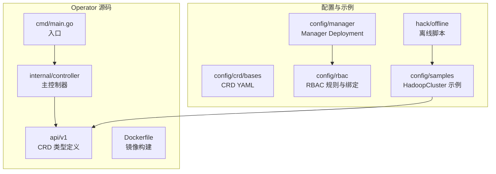
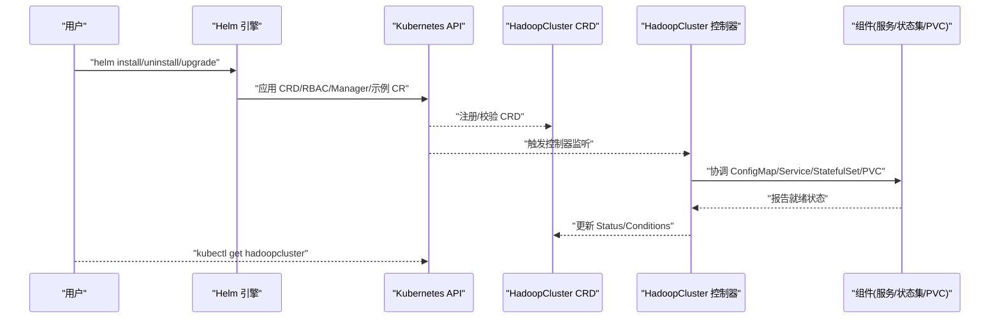
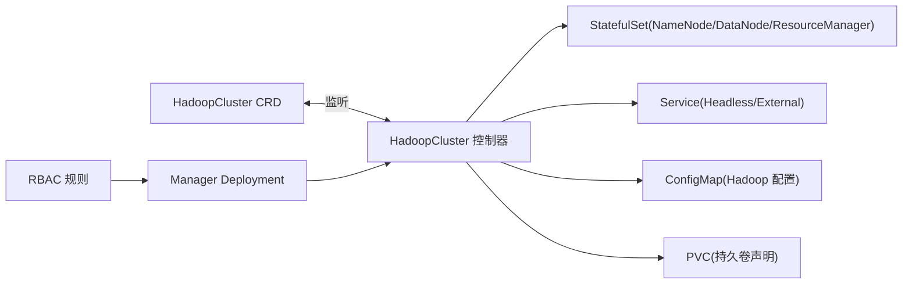

# Helm Chart 部署

<cite>
**本文引用的文件**
- [README.md](file://hadoop-operator/README.md)
- [hadoopcluster_types.go](file://hadoop-operator/api/v1/hadoopcluster_types.go)
- [hadoopcluster_controller.go](file://hadoop-operator/internal/controller/hadoopcluster_controller.go)
- [manager.yaml](file://hadoop-operator/config/manager/manager.yaml)
- [role.yaml](file://hadoop-operator/config/rbac/role.yaml)
- [role_binding.yaml](file://hadoop-operator/config/rbac/role_binding.yaml)
- [service_account.yaml](file://hadoop-operator/config/rbac/service_account.yaml)
- [hadoop_v1_hadoopcluster.yaml](file://hadoop-operator/config/samples/hadoop_v1_hadoopcluster.yaml)
- [hadoop_v1_hadoopcluster_ha.yaml](file://hadoop-operator/config/samples/hadoop_v1_hadoopcluster_ha.yaml)
- [offline-deployment.yaml](file://hadoop-operator/config/samples/offline-deployment.yaml)
- [save-images.sh](file://hadoop-operator/hack/offline/save-images.sh)
- [main.go](file://hadoop-operator/cmd/main.go)
- [Dockerfile](file://hadoop-operator/Dockerfile)
</cite>

## 目录
1. [简介](#简介)
2. [项目结构](#项目结构)
3. [核心组件](#核心组件)
4. [架构总览](#架构总览)
5. [详细组件分析](#详细组件分析)
6. [依赖关系分析](#依赖关系分析)
7. [性能考虑](#性能考虑)
8. [故障排查指南](#故障排查指南)
9. [结论](#结论)
10. [附录](#附录)

## 简介
本指南面向希望使用 Helm 3.x 部署 Hadoop Operator 的用户，目标是提供从 Chart 结构、values.yaml 配置项、安装命令到升级/回滚/卸载的完整操作手册，并对比 Helm 与 kubectl 的差异，覆盖基础部署、高可用部署与离线部署等典型场景。

Helm Chart 将 Operator、RBAC、CRD、示例 HadoopCluster 资源统一打包，便于版本化管理、复现部署与审计。结合项目现有资源，建议以“Chart 化”方式将 config/manager、config/rbac、config/crd 与 config/samples 中的资源进行模板化，形成可配置的 Helm 包。

## 项目结构
Hadoop Operator 项目采用标准的 Kubebuilder 项目布局，核心目录与职责如下：
- api/v1：CRD 类型定义，描述 HadoopCluster 的 Spec/Status 字段
- internal/controller：主控制器，负责根据 HadoopCluster CR 的期望状态进行协调
- config：Kubernetes 清单集合，包括 CRD、RBAC、Manager Deployment 与示例 CR
- hack/offline：离线部署脚本，用于镜像导出/导入
- cmd/main.go：Operator 入口，初始化 Manager、注册控制器与健康检查
- Dockerfile：构建 Operator 镜像

图表来源
- [hadoopcluster_types.go:24-46](file://hadoop-operator/api/v1/hadoopcluster_types.go#L24-L46)
- [hadoopcluster_controller.go:41-46](file://hadoop-operator/internal/controller/hadoopcluster_controller.go#L41-L46)
- [manager.yaml:10-79](file://hadoop-operator/config/manager/manager.yaml#L10-L79)
- [role.yaml:1-100](file://hadoop-operator/config/rbac/role.yaml#L1-L100)
- [role_binding.yaml:1-16](file://hadoop-operator/config/rbac/role_binding.yaml#L1-L16)
- [service_account.yaml:1-9](file://hadoop-operator/config/rbac/service_account.yaml#L1-L9)
- [hadoop_v1_hadoopcluster.yaml:1-80](file://hadoop-operator/config/samples/hadoop_v1_hadoopcluster.yaml#L1-L80)
- [offline-deployment.yaml:1-135](file://hadoop-operator/config/samples/offline-deployment.yaml#L1-L135)

章节来源
- [README.md:15-82](file://hadoop-operator/README.md#L15-L82)
- [main.go:54-149](file://hadoop-operator/cmd/main.go#L54-L149)

## 核心组件
- HadoopCluster CRD：定义 Hadoop 集群的规格，包括镜像、HDFS（NameNode/DataNode）、YARN（ResourceManager/NodeManager）、配置覆盖、安全与监控等字段
- HadoopCluster 控制器：监听 HadoopCluster CR，按顺序协调 ConfigMap、Service、StatefulSet/PVC 等资源，维护 Status 与条件
- RBAC：授予控制器对 CR、Deployment/StatefulSet、Service、ConfigMap、PVC 等资源的 CRUD 权限
- Manager Deployment：部署 Operator Pod，内置健康探针与指标端口
- 示例 CR：提供基础与高可用两种典型配置，离线部署示例展示私有镜像仓库与外部 ZooKeeper 的使用

章节来源
- [hadoopcluster_types.go:24-418](file://hadoop-operator/api/v1/hadoopcluster_types.go#L24-L418)
- [hadoopcluster_controller.go:41-239](file://hadoop-operator/internal/controller/hadoopcluster_controller.go#L41-L239)
- [role.yaml:1-100](file://hadoop-operator/config/rbac/role.yaml#L1-L100)
- [manager.yaml:10-79](file://hadoop-operator/config/manager/manager.yaml#L10-L79)
- [hadoop_v1_hadoopcluster.yaml:1-80](file://hadoop-operator/config/samples/hadoop_v1_hadoopcluster.yaml#L1-L80)
- [hadoop_v1_hadoopcluster_ha.yaml:1-107](file://hadoop-operator/config/samples/hadoop_v1_hadoopcluster_ha.yaml#L1-L107)
- [offline-deployment.yaml:1-135](file://hadoop-operator/config/samples/offline-deployment.yaml#L1-L135)

## 架构总览
Helm Chart 的部署流程将以下资源串联起来：先安装 CRD，再应用 RBAC，然后部署 Manager，最后创建 HadoopCluster CR。控制器根据 CR 生成并维护 HDFS/YARN 组件所需的 ConfigMap、Service 与 StatefulSet/PVC。

图表来源
- [manager.yaml:10-79](file://hadoop-operator/config/manager/manager.yaml#L10-L79)
- [role.yaml:1-100](file://hadoop-operator/config/rbac/role.yaml#L1-L100)
- [hadoopcluster_controller.go:104-144](file://hadoop-operator/internal/controller/hadoopcluster_controller.go#L104-L144)
- [hadoopcluster_types.go:297-315](file://hadoop-operator/api/v1/hadoopcluster_types.go#L297-L315)

## 详细组件分析

### HadoopCluster CRD 字段与 values.yaml 映射
HadoopCluster 的 Spec 字段与 Helm values 的映射关系如下（仅列出常用键）：
- image.repository → image.repository
- image.tag → image.tag
- image.pullPolicy → image.pullPolicy
- image.pullSecrets → image.pullSecrets
- hdfs.nameNode.replicas → hdfs.nameNode.replicas
- hdfs.nameNode.resources → hdfs.nameNode.resources.*
- hdfs.nameNode.storage → hdfs.nameNode.storage.*
- hdfs.nameNode.service → hdfs.nameNode.service.*
- hdfs.nameNode.ha.enabled → hdfs.nameNode.ha.enabled
- hdfs.nameNode.ha.journalNode.replicas → hdfs.nameNode.ha.journalNode.replicas
- hdfs.dataNode.replicas → hdfs.dataNode.replicas
- hdfs.dataNode.resources → hdfs.dataNode.resources.*
- hdfs.dataNode.storage → hdfs.dataNode.storage.*
- yarn.resourceManager.replicas → yarn.resourceManager.replicas
- yarn.resourceManager.resources → yarn.resourceManager.resources.*
- yarn.resourceManager.service → yarn.resourceManager.service.*
- yarn.resourceManager.ha.enabled → yarn.resourceManager.ha.enabled
- yarn.nodeManager.replicas → yarn.nodeManager.replicas
- yarn.nodeManager.resources → yarn.nodeManager.resources.*
- config.* → config.*（coreSite/hdfsSite/yarnSite/mapredSite/capacityScheduler）
- metrics.* → metrics.*

章节来源
- [hadoopcluster_types.go:24-46](file://hadoop-operator/api/v1/hadoopcluster_types.go#L24-L46)
- [hadoopcluster_types.go:48-59](file://hadoop-operator/api/v1/hadoopcluster_types.go#L48-L59)
- [hadoopcluster_types.go:61-67](file://hadoop-operator/api/v1/hadoopcluster_types.go#L61-L67)
- [hadoopcluster_types.go:69-90](file://hadoop-operator/api/v1/hadoopcluster_types.go#L69-L90)
- [hadoopcluster_types.go:104-120](file://hadoop-operator/api/v1/hadoopcluster_types.go#L104-L120)
- [hadoopcluster_types.go:122-140](file://hadoop-operator/api/v1/hadoopcluster_types.go#L122-L140)
- [hadoopcluster_types.go:142-148](file://hadoop-operator/api/v1/hadoopcluster_types.go#L142-L148)
- [hadoopcluster_types.go:150-169](file://hadoop-operator/api/v1/hadoopcluster_types.go#L150-L169)
- [hadoopcluster_types.go:171-187](file://hadoop-operator/api/v1/hadoopcluster_types.go#L171-L187)
- [hadoopcluster_types.go:214-231](file://hadoop-operator/api/v1/hadoopcluster_types.go#L214-L231)
- [hadoopcluster_types.go:273-295](file://hadoop-operator/api/v1/hadoopcluster_types.go#L273-L295)

### Helm Chart 结构建议
基于现有资源，建议将 Chart 目录组织如下：
- templates/
  - crd.yaml（来自 config/crd/bases）
  - rbac.yaml（来自 config/rbac）
  - manager.yaml（来自 config/manager）
  - hadoopcluster.yaml（来自 config/samples）
- values.yaml（包含上述映射的所有可配置项）
- charts/（可选：依赖子 Chart，如 Prometheus Operator）
- crds/（可选：将 CRD 放入 crds/ 并在 Chart.yaml 中声明）

该结构使 Chart 可以通过 helm install/uninstall/upgrade 完整地管理 Operator 生命周期与集群资源。

### values.yaml 配置项说明
- image.repository：容器镜像仓库
- image.tag：镜像标签
- image.pullPolicy：镜像拉取策略
- image.pullSecrets：镜像拉取密钥列表
- hdfs.nameNode.replicas：NameNode 副本数（HA 场景建议 ≥2）
- hdfs.nameNode.resources：CPU/内存请求与限制
- hdfs.nameNode.storage.size/storageClassName/accessMode：PVC 大小与 StorageClass
- hdfs.nameNode.service.type/nodePorts/annotations：Service 类型与端口映射
- hdfs.nameNode.ha.enabled：启用 NameNode HA
- hdfs.nameNode.ha.zookeeper.connectionString：外部 ZooKeeper 连接串（可选）
- hdfs.nameNode.ha.journalNode.replicas/resources/storage：JournalNode 规格
- hdfs.dataNode.replicas/resources/storage/service/affinity/tolerations：DataNode 规格
- yarn.resourceManager.replicas/resources/service/ha/affinity/tolerations：ResourceManager 规格与 HA
- yarn.nodeManager.replicas/resources/service/affinity/tolerations：NodeManager 规格
- config.coreSite/hdfsSite/yarnSite/mapredSite/capacityScheduler：Hadoop 配置覆盖
- metrics.enabled/exporterImage/serviceMonitor.*：Prometheus 监控开关与 ServiceMonitor 标签

章节来源
- [hadoopcluster_types.go:24-46](file://hadoop-operator/api/v1/hadoopcluster_types.go#L24-L46)
- [hadoopcluster_types.go:48-59](file://hadoop-operator/api/v1/hadoopcluster_types.go#L48-L59)
- [hadoopcluster_types.go:69-90](file://hadoop-operator/api/v1/hadoopcluster_types.go#L69-L90)
- [hadoopcluster_types.go:104-120](file://hadoop-operator/api/v1/hadoopcluster_types.go#L104-L120)
- [hadoopcluster_types.go:122-140](file://hadoop-operator/api/v1/hadoopcluster_types.go#L122-L140)
- [hadoopcluster_types.go:150-169](file://hadoop-operator/api/v1/hadoopcluster_types.go#L150-L169)
- [hadoopcluster_types.go:171-187](file://hadoop-operator/api/v1/hadoopcluster_types.go#L171-L187)
- [hadoopcluster_types.go:214-231](file://hadoop-operator/api/v1/hadoopcluster_types.go#L214-L231)
- [hadoopcluster_types.go:273-295](file://hadoop-operator/api/v1/hadoopcluster_types.go#L273-L295)

### 不同部署场景的配置模板
- 基础部署：参考基础示例 CR，设置最小副本数与默认存储类
- 高可用部署：启用 NameNode/ResourceManager HA，配置 JournalNode 与反亲和性
- 离线部署：使用私有镜像仓库与离线镜像包，必要时指定外部 ZooKeeper

章节来源
- [hadoop_v1_hadoopcluster.yaml:1-80](file://hadoop-operator/config/samples/hadoop_v1_hadoopcluster.yaml#L1-L80)
- [hadoop_v1_hadoopcluster_ha.yaml:1-107](file://hadoop-operator/config/samples/hadoop_v1_hadoopcluster_ha.yaml#L1-L107)
- [offline-deployment.yaml:1-135](file://hadoop-operator/config/samples/offline-deployment.yaml#L1-L135)

### 安装命令与参数说明
- 安装 Operator（含 CRD/RBAC/Manager）：helm install hadoop-operator ./chart
- 安装 Hadoop 集群：helm install hadoop-cluster ./chart --set-file specFromFile=./samples/hadoop_v1_hadoopcluster.yaml
- 升级：helm upgrade hadoop-cluster ./chart -f values.yaml
- 回滚：helm rollback hadoop-cluster <revision>
- 卸载：helm uninstall hadoop-cluster

说明
- 若需将 CRD 与 RBAC 作为独立 Chart 发布，可拆分安装顺序
- values.yaml 中的路径与键名需与 CRD 字段保持一致

章节来源
- [README.md:23-82](file://hadoop-operator/README.md#L23-L82)
- [hadoopcluster_types.go:24-46](file://hadoop-operator/api/v1/hadoopcluster_types.go#L24-L46)

### 对比：Helm 与 kubectl 部署
- 版本化与审计：Helm 提供 Release 管理，便于追踪变更与回滚
- 可复现性：values.yaml 将配置显式化，适合 CI/CD 与多环境一致性
- 依赖管理：Helm 可整合 CRDs、RBAC、Manager 与示例 CR，减少手工步骤
- 复杂度权衡：Helm Chart 需要模板化与 values 映射，初期投入较高；但长期收益显著

章节来源
- [README.md:23-82](file://hadoop-operator/README.md#L23-L82)

## 依赖关系分析
HadoopCluster 控制器对 CRD、Deployment、Service、ConfigMap、PVC 等资源具有所有权与操作权限；Manager Deployment 依赖 RBAC 规则；示例 CR 依赖 CRD。

图表来源
- [hadoopcluster_controller.go:230-239](file://hadoop-operator/internal/controller/hadoopcluster_controller.go#L230-L239)
- [role.yaml:1-100](file://hadoop-operator/config/rbac/role.yaml#L1-L100)
- [manager.yaml:10-79](file://hadoop-operator/config/manager/manager.yaml#L10-L79)

章节来源
- [hadoopcluster_controller.go:48-56](file://hadoop-operator/internal/controller/hadoopcluster_controller.go#L48-L56)
- [role.yaml:1-100](file://hadoop-operator/config/rbac/role.yaml#L1-L100)
- [manager.yaml:10-79](file://hadoop-operator/config/manager/manager.yaml#L10-L79)

## 性能考虑
- 资源配额：为 NameNode、ResourceManager、DataNode、NodeManager 设置合理的 requests/limits，避免资源争抢
- 存储规划：根据数据规模选择合适的 StorageClass 与容量，关注 IOPS 与延迟
- 反亲和性：在 HA 场景中启用 Pod 反亲和性，提升容灾能力
- 监控开销：启用 Prometheus Exporter 与 ServiceMonitor 时注意采集频率与指标范围

## 故障排查指南
- Pod 启动失败：查看 Pod 事件与上一次容器日志，定位镜像拉取或配置错误
- NameNode 初始化失败：检查 PVC 状态与存储类，必要时手动格式化（谨慎操作）
- DataNode 连接 NameNode 失败：检查网络连通性与配置，核对 core-site 中的 fs.defaultFS
- 镜像拉取失败：确认私有仓库凭据与 Secret 名称正确

章节来源
- [README.md:276-318](file://hadoop-operator/README.md#L276-L318)

## 结论
通过 Helm Chart 管理 Hadoop Operator，可以实现配置标准化、版本化与自动化运维。结合 CRD、RBAC、Manager 与示例 CR，Helm 能够覆盖从基础到高可用再到离线部署的多种场景。建议在生产环境中配合 CI/CD 与 GitOps 实践，持续演进 values.yaml 与 Chart 版本。

## 附录

### 离线部署操作指南
- 准备镜像：在联网环境导出 Hadoop 与 ZooKeeper 镜像至 tar 包
- 导入镜像：在离线环境加载 tar 包或推送至私有仓库
- 配置镜像凭据：创建镜像拉取 Secret 并在 values.yaml 中引用
- 部署集群：应用离线示例 CR，或在 values.yaml 中指定私有仓库与凭据

章节来源
- [save-images.sh:1-66](file://hadoop-operator/hack/offline/save-images.sh#L1-L66)
- [README.md:84-126](file://hadoop-operator/README.md#L84-L126)
- [offline-deployment.yaml:1-135](file://hadoop-operator/config/samples/offline-deployment.yaml#L1-L135)

### Chart 升级、回滚与卸载
- 升级：修改 values.yaml 后执行 helm upgrade，支持灰度与分批滚动
- 回滚：使用 helm rollback 指定历史版本，快速恢复
- 卸载：helm uninstall 删除 Release；若需保留 PVC，注意清理策略

章节来源
- [README.md:23-82](file://hadoop-operator/README.md#L23-L82)