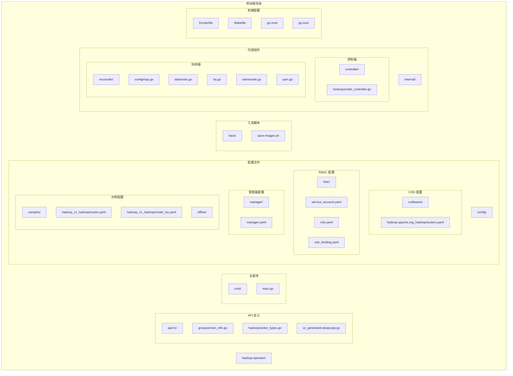
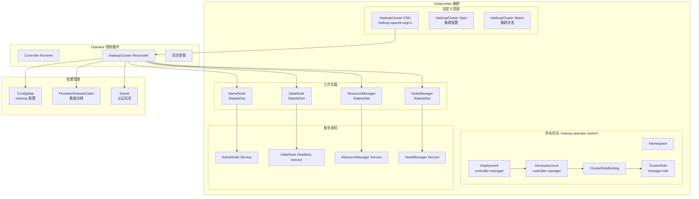
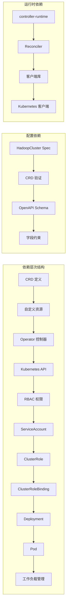

# kubectl 命令行部署

<cite>
**本文档引用的文件**
- [README.md](file://README.md)
- [hadoop.apache.org_hadoopclusters.yaml](file://config/crd/bases/hadoop.apache.org_hadoopclusters.yaml)
- [service_account.yaml](file://config/rbac/service_account.yaml)
- [role.yaml](file://config/rbac/role.yaml)
- [role_binding.yaml](file://config/rbac/role_binding.yaml)
- [manager.yaml](file://config/manager/manager.yaml)
- [hadoop_v1_hadoopcluster.yaml](file://config/samples/hadoop_v1_hadoopcluster.yaml)
- [offline-deployment.yaml](file://config/samples/offline-deployment.yaml)
- [main.go](file://cmd/main.go)
- [go.mod](file://go.mod)
- [Dockerfile](file://Dockerfile)
- [Makefile](file://Makefile)
- [save-images.sh](file://hack/offline/save-images.sh)
</cite>

## 目录
1. [简介](#简介)
2. [项目结构](#项目结构)
3. [核心组件](#核心组件)
4. [架构概览](#架构概览)
5. [详细组件分析](#详细组件分析)
6. [依赖关系分析](#依赖关系分析)
7. [性能考虑](#性能考虑)
8. [故障排除指南](#故障排除指南)
9. [结论](#结论)
10. [附录](#附录)

## 简介

Hadoop Operator 是一个用于在 Kubernetes 上部署和管理 Hadoop 集群的生产级 Operator。它支持 HDFS 和 YARN 的高可用部署，以及离线环境部署。本文档提供了完整的 kubectl 命令行部署指南，按照正确的顺序说明三个关键步骤：1) 安装 CRD（Custom Resource Definition），2) 配置 RBAC 权限，3) 部署 Operator。

## 项目结构

该项目采用标准的 Kubebuilder 项目结构，主要包含以下关键目录：



**图表来源**
- [README.md: 235-251:235-251](file://README.md#L235-L251)
- [Makefile: 1-L165:1-165](file://Makefile#L1-L165)

**章节来源**
- [README.md: 235-251:235-251](file://README.md#L235-L251)
- [Makefile: 1-L165:1-165](file://Makefile#L1-L165)

## 核心组件

### HadoopCluster CRD

HadoopCluster 是项目的核心自定义资源定义，它定义了 Hadoop 集群的完整配置规范。CRD 支持以下主要功能：

- **HDFS 配置**：NameNode、DataNode 的副本数、资源限制、存储配置
- **YARN 配置**：ResourceManager、NodeManager 的副本数和资源管理
- **镜像配置**：Docker 镜像仓库、标签、拉取策略
- **监控配置**：Prometheus 监控集成
- **安全配置**：Kerberos、TLS、Ranger 集成预留

### RBAC 权限模型

Operator 使用最小权限原则配置 RBAC 权限，包括：

- **ServiceAccount**：controller-manager 服务账户
- **ClusterRole**：管理所有必需的 Kubernetes 资源权限
- **ClusterRoleBinding**：将服务账户绑定到 ClusterRole

### Operator 部署配置

管理器部署配置包含：
- **命名空间**：hadoop-operator-system
- **Deployment**：单实例控制器管理器
- **探针配置**：健康检查和就绪检查
- **资源限制**：CPU 和内存配额

**章节来源**
- [hadoop.apache.org_hadoopclusters.yaml: 1-L411:1-411](file://config/crd/bases/hadoop.apache.org_hadoopclusters.yaml#L1-L411)
- [service_account.yaml: 1-L9:1-9](file://config/rbac/service_account.yaml#L1-L9)
- [role.yaml: 1-L100:1-100](file://config/rbac/role.yaml#L1-L100)
- [role_binding.yaml: 1-L16:1-16](file://config/rbac/role_binding.yaml#L1-L16)
- [manager.yaml: 1-L80:1-80](file://config/manager/manager.yaml#L1-L80)

## 架构概览



**图表来源**
- [main.go: 125-L132:125-132](file://cmd/main.go#L125-L132)
- [manager.yaml: 10-L80:10-80](file://config/manager/manager.yaml#L10-L80)
- [hadoop.apache.org_hadoopclusters.yaml: 28-L406:28-406](file://config/crd/bases/hadoop.apache.org_hadoopclusters.yaml#L28-L406)

## 详细组件分析

### 步骤 1：安装 CRD（Custom Resource Definition）

#### 命令执行

```bash
# 安装 HadoopCluster CRD
kubectl apply -f config/crd/bases/hadoop.apache.org_hadoopclusters.yaml
```

#### 参数说明

- `-f`: 指定要应用的 YAML 文件路径
- `config/crd/bases/hadoop.apache.org_hadoopclusters.yaml`: CRD 定义文件

#### 预期输出

```bash
customresourcedefinition.apiextensions.k8s.io/hadoopclusters.hadoop.apache.org created
```

#### 作用和必要性

CRD 是整个 Operator 架构的基础，它：
- 定义了 HadoopCluster 自定义资源的结构
- 提供了 Kubernetes API 中的 HadoopCluster 对象
- 支持完整的 OpenAPI 验证和打印列
- 允许用户通过 YAML 配置 Hadoop 集群

#### 验证步骤

```bash
# 验证 CRD 是否存在
kubectl get crd hadoopclusters.hadoop.apache.org

# 查看 CRD 详情
kubectl show crd hadoopclusters.hadoop.apache.org
```

**章节来源**
- [README.md: 27-L36:27-36](file://README.md#L27-L36)
- [hadoop.apache.org_hadoopclusters.yaml: 1-L8:1-8](file://config/crd/bases/hadoop.apache.org_hadoopclusters.yaml#L1-L8)

### 步骤 2：配置 RBAC 权限

#### 命令执行

```bash
# 安装 RBAC 配置
kubectl apply -f config/rbac/
```

#### 参数说明

- `-f`: 指定要应用的目录
- `config/rbac/`: 包含 RBAC 配置的目录

#### 预期输出

```bash
serviceaccount/controller-manager created
clusterrole.rbac.authorization.k8s.io/manager-role created
clusterrolebinding.rbac.authorization.k8s.io/manager-rolebinding created
```

#### 作用和必要性

RBAC 配置确保 Operator 具备必要的权限：
- **读写权限**：ConfigMap、PersistentVolumeClaim、Services
- **控制权限**：Deployments、StatefulSets
- **CRD 权限**：HadoopCluster 资源的创建、更新、删除
- **事件权限**：记录操作事件

#### 验证步骤

```bash
# 验证 ServiceAccount
kubectl get serviceaccount controller-manager -n hadoop-operator-system

# 验证 ClusterRole
kubectl get clusterrole manager-role

# 验证 ClusterRoleBinding
kubectl get clusterrolebinding manager-rolebinding

# 检查权限授予
kubectl auth can-i create hadoopclusters --as=system:serviceaccount:hadoop-operator-system:controller-manager
```

**章节来源**
- [README.md: 31-L32:31-32](file://README.md#L31-L32)
- [service_account.yaml: 1-L9:1-9](file://config/rbac/service_account.yaml#L1-L9)
- [role.yaml: 1-L100:1-100](file://config/rbac/role.yaml#L1-L100)
- [role_binding.yaml: 1-L16:1-16](file://config/rbac/role_binding.yaml#L1-L16)

### 步骤 3：部署 Operator

#### 命令执行

```bash
# 部署 Operator
kubectl apply -f config/manager/manager.yaml
```

#### 参数说明

- `-f`: 指定要应用的 YAML 文件路径
- `config/manager/manager.yaml`: Operator 部署配置

#### 预期输出

```bash
namespace/hadoop-operator-system created
deployment.apps/controller-manager created
```

#### 作用和必要性

Operator 部署配置包含：
- **命名空间隔离**：hadoop-operator-system
- **单实例部署**：确保单一控制器实例
- **健康检查**：Liveness 和 Readiness 探针
- **资源限制**：CPU 和内存配额
- **安全配置**：非特权容器运行

#### 验证步骤

```bash
# 验证命名空间
kubectl get namespace hadoop-operator-system

# 验证 Deployment
kubectl get deployment controller-manager -n hadoop-operator-system

# 验证 Pod 状态
kubectl get pods -n hadoop-operator-system

# 检查 Operator 日志
kubectl logs -n hadoop-operator-system deployment/controller-manager
```

**章节来源**
- [README.md: 34-L35:34-35](file://README.md#L34-L35)
- [manager.yaml: 1-L80:1-80](file://config/manager/manager.yaml#L1-L80)
- [main.go: 125-L132:125-132](file://cmd/main.go#L125-L132)

## 依赖关系分析



**图表来源**
- [go.mod: 5-L10:5-10](file://go.mod#L5-L10)
- [main.go: 37-L40:37-40](file://cmd/main.go#L37-L40)
- [hadoop.apache.org_hadoopclusters.yaml: 28-L406:28-406](file://config/crd/bases/hadoop.apache.org_hadoopclusters.yaml#L28-L406)

**章节来源**
- [go.mod: 1-L69:1-69](file://go.mod#L1-L69)
- [main.go: 19-L40:19-40](file://cmd/main.go#L19-L40)

## 性能考虑

### 资源配置优化

- **CPU 配置**：Operator 默认请求 10m CPU，限制 500m CPU
- **内存配置**：默认请求 64Mi 内存，限制 256Mi 内存
- **探针配置**：健康检查间隔合理设置，避免过度频繁

### 并发控制

- **领导者选举**：支持单实例部署，避免多个实例竞争
- **重试机制**：控制器内置重试逻辑处理临时故障

### 监控集成

- **指标导出**：支持 Prometheus 监控
- **健康检查**：提供健康和就绪探针
- **事件记录**：记录重要操作事件

## 故障排除指南

### 常见部署问题

#### 1. CRD 安装失败

**问题症状**：
```bash
Error from server (Forbidden): error when applying CRD: clusters.management.k8s.io "hadoopclusters" is forbidden: User "system:serviceaccount:kube-system:default" cannot create resource "clusters" in API group "management.k8s.io"
```

**解决方案**：
- 确保具有集群管理员权限
- 检查 RBAC 权限配置
- 验证 Kubernetes 版本兼容性

#### 2. RBAC 权限不足

**问题症状**：
```bash
Error from server (Forbidden): pods "controller-manager-7b5b7c8f8d-8n9v4" is forbidden: User "system:serviceaccount:hadoop-operator-system:controller-manager" cannot list resource "pods" in API group "" at the cluster scope
```

**解决方案**：
- 检查 ClusterRole 规则完整性
- 验证 ServiceAccount 绑定
- 确认 ClusterRoleBinding 配置正确

#### 3. Operator 启动失败

**问题症状**：
```bash
Error: failed calling webhook "webhook-server": failed to call webhook: Post "https://controller-manager-webhook-service.hadoop-operator-system.svc:443/mutating-hadoopclusters?timeout=10s": dial tcp 10.96.0.1:443: connect: connection refused
```

**解决方案**：
- 检查 Webhook 服务器状态
- 验证证书配置
- 确认 Service 可达性

### 验证部署状态

#### 基本验证命令

```bash
# 验证 CRD 状态
kubectl get crd hadoopclusters.hadoop.apache.org -o yaml

# 验证 RBAC 配置
kubectl auth can-i '*' '*' --as=system:serviceaccount:hadoop-operator-system:controller-manager

# 检查 Operator 状态
kubectl get pods -n hadoop-operator-system
kubectl describe pod -n hadoop-operator-system <pod-name>

# 查看 Operator 日志
kubectl logs -n hadoop-operator-system deployment/controller-manager -c manager
```

#### 集群配置验证

```bash
# 验证 HadoopCluster 资源
kubectl get hadoopcluster

# 检查 Operator 事件
kubectl get events --field-selector involvedObject.kind=HadoopCluster

# 验证存储类可用性
kubectl get storageclass
```

**章节来源**
- [README.md: 276-L318:276-318](file://README.md#L276-L318)

## 结论

Hadoop Operator 的 kubectl 部署遵循严格的顺序：先安装 CRD，再配置 RBAC 权限，最后部署 Operator。这种顺序确保了 Operator 能够正常工作所需的基础设施。

### 关键要点

1. **部署顺序的重要性**：每个步骤都有其特定的作用，必须按顺序执行
2. **权限最小化**：RBAC 配置遵循最小权限原则
3. **配置验证**：每步完成后都要进行验证
4. **监控集成**：完整的监控和健康检查机制

### 最佳实践

- 使用独立的命名空间隔离 Operator
- 实施适当的资源限制
- 配置合适的探针和健康检查
- 建立完善的监控和告警机制
- 制定回滚和恢复计划

## 生产环境部署

### 高可用部署配置

生产环境建议使用高可用配置：

```bash
# 创建命名空间
kubectl create namespace hadoop

# 部署生产级高可用集群
kubectl apply -f config/samples/hadoop_v1_hadoopcluster_production.yaml
```

### 生产环境配置要点

1. **NameNode HA**: 2个NameNode实例，自动故障转移
2. **ResourceManager HA**: 2个ResourceManager实例
3. **JournalNode**: 3个实例用于元数据同步
4. **Pod反亲和性**: 确保组件分布在不同节点
5. **资源限制**: 合理的CPU/内存配置
6. **持久化存储**: 使用StorageClass提供持久化
7. **监控集成**: 启用Prometheus监控

### 验证部署

```bash
# 查看集群状态
kubectl get hadoopcluster -n hadoop

# 查看Pod状态
kubectl get pods -n hadoop

# 查看服务
kubectl get svc -n hadoop

# 查看HDFS状态
kubectl exec -it hadoop-production-namenode-0 -n hadoop -- hdfs dfsadmin -report

# 查看YARN状态
kubectl exec -it hadoop-production-resourcemanager-0 -n hadoop -- yarn node -list
```

### 完整部署清单

```bash
# 1. 创建命名空间
kubectl apply -f config/namespace/namespace.yaml

# 2. 安装CRD
kubectl apply -f config/crd/bases/hadoop.apache.org_hadoopclusters.yaml

# 3. 配置RBAC
kubectl apply -f config/rbac/service_account.yaml
kubectl apply -f config/rbac/role.yaml
kubectl apply -f config/rbac/role_binding.yaml
kubectl apply -f config/rbac/leader_election_role.yaml
kubectl apply -f config/rbac/leader_election_role_binding.yaml

# 4. 部署Operator
kubectl apply -f config/manager/manager.yaml

# 5. 部署Hadoop集群（基础版）
kubectl apply -f config/samples/hadoop_v1_hadoopcluster.yaml

# 或部署高可用版
kubectl apply -f config/samples/hadoop_v1_hadoopcluster_ha.yaml

# 或部署生产环境版
kubectl apply -f config/samples/hadoop_v1_hadoopcluster_production.yaml
```

## 附录

### 离线部署指南

对于离线环境，项目提供了完整的离线部署工具链：

```bash
# 准备镜像
cd hack/offline
./save-images.sh --output-dir ./offline-images

# 传输到离线环境
tar czvf hadoop-images.tar.gz offline-images/

# 加载镜像
tar xzvf hadoop-images.tar.gz
./load-images.sh --input-dir ./offline-images

# 或者推送到私有仓库
./load-images.sh --input-dir ./offline-images --target-registry myregistry.example.com:5000
```

### 构建和部署

```bash
# 构建二进制
make build

# 构建 Docker 镜像
make docker-build IMG=myregistry/hadoop-operator:v1.0.0

# 推送镜像
make docker-push IMG=myregistry/hadoop-operator:v1.0.0

# 部署到集群
make deploy IMG=myregistry/hadoop-operator:v1.0.0
```

**章节来源**
- [README.md: 84-L126:84-126](file://README.md#L84-L126)
- [Makefile: 61-L96:61-96](file://Makefile#L61-L96)
- [save-images.sh: 1-L66:1-66](file://hack/offline/save-images.sh#L1-L66)- [hadoop_v1_hadoopcluster_production.yaml](file://hadoop-operator/config/samples/hadoop_v1_hadoopcluster_production.yaml)
