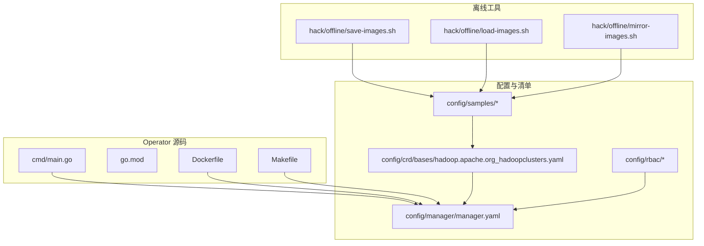
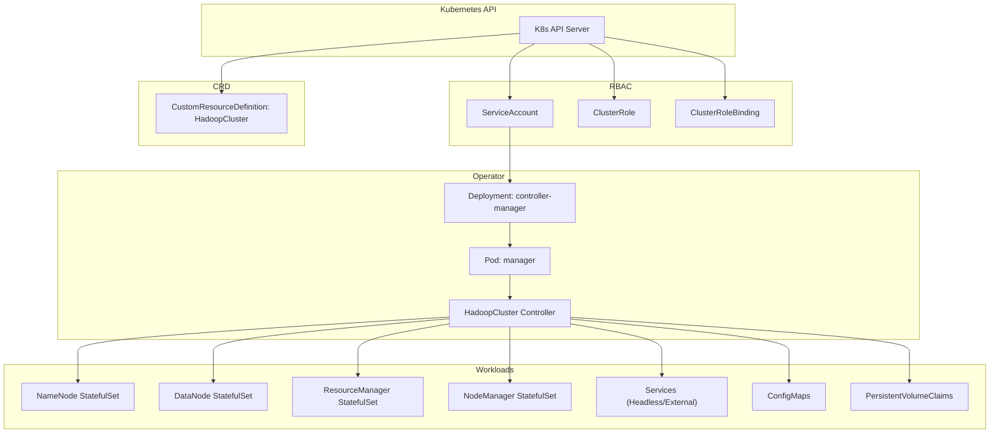
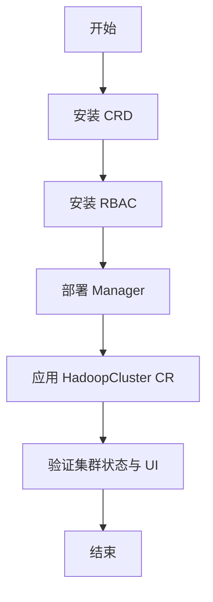
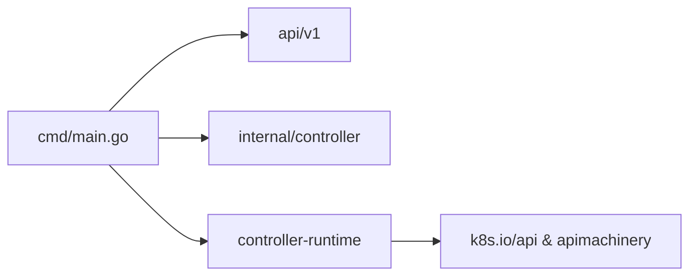

# 在线部署

<cite>
**本文引用的文件**
- [README.md](file://README.md)
- [go.mod](file://go.mod)
- [cmd/main.go](file://cmd/main.go)
- [config/crd/bases/hadoop.apache.org_hadoopclusters.yaml](file://config/crd/bases/hadoop.apache.org_hadoopclusters.yaml)
- [config/rbac/service_account.yaml](file://config/rbac/service_account.yaml)
- [config/rbac/role.yaml](file://config/rbac/role.yaml)
- [config/rbac/role_binding.yaml](file://config/rbac/role_binding.yaml)
- [config/manager/manager.yaml](file://config/manager/manager.yaml)
- [config/samples/hadoop_v1_hadoopcluster.yaml](file://config/samples/hadoop_v1_hadoopcluster.yaml)
- [config/samples/hadoop_v1_hadoopcluster_ha.yaml](file://config/samples/hadoop_v1_hadoopcluster_ha.yaml)
- [config/samples/offline-deployment.yaml](file://config/samples/offline-deployment.yaml)
- [Dockerfile](file://Dockerfile)
- [Makefile](file://Makefile)
- [hack/offline/save-images.sh](file://hack/offline/save-images.sh)
- [hack/offline/load-images.sh](file://hack/offline/load-images.sh)
- [hack/offline/mirror-images.sh](file://hack/offline/mirror-images.sh)
</cite>

## 目录
1. [简介](#简介)
2. [项目结构](#项目结构)
3. [核心组件](#核心组件)
4. [架构总览](#架构总览)
5. [详细组件分析](#详细组件分析)
6. [依赖分析](#依赖分析)
7. [性能考虑](#性能考虑)
8. [故障排查指南](#故障排查指南)
9. [结论](#结论)
10. [附录](#附录)

## 简介
本指南面向在 Kubernetes 上部署 Hadoop Operator 的用户与运维人员，提供三种部署方式的完整流程：kubectl 命令行部署、Helm Chart 部署（基于官方脚手架生成的 Kustomize 配置）、以及本地开发模式运行。文档涵盖 CRD 安装、RBAC 权限配置、Operator 部署与配置、部署顺序与依赖关系、验证方法、离线部署准备与镜像处理，以及常见问题排查。

## 项目结构
该仓库采用标准的 Kubebuilder 项目布局，核心目录与职责如下：
- api/v1：CRD 的 Go 类型定义与深度复制生成
- cmd/main.go：Operator 入口，初始化 Manager、注册控制器、健康检查与指标服务
- config/crd/bases：CRD YAML 定义
- config/rbac：ServiceAccount、ClusterRole、ClusterRoleBinding
- config/manager：Operator Deployment 与命名空间
- config/samples：HadoopCluster CR 示例（基础、高可用、离线）
- hack/offline：离线部署镜像准备与加载脚本
- Dockerfile、Makefile：构建与打包、部署目标

**图表来源**
- [cmd/main.go:1-150](file://cmd/main.go#L1-L150)
- [go.mod:1-69](file://go.mod#L1-L69)
- [Dockerfile:1-34](file://Dockerfile#L1-L34)
- [Makefile:1-165](file://Makefile#L1-L165)
- [config/crd/bases/hadoop.apache.org_hadoopclusters.yaml:1-411](file://config/crd/bases/hadoop.apache.org_hadoopclusters.yaml#L1-L411)
- [config/rbac/service_account.yaml:1-9](file://config/rbac/service_account.yaml#L1-L9)
- [config/rbac/role.yaml:1-100](file://config/rbac/role.yaml#L1-L100)
- [config/rbac/role_binding.yaml:1-16](file://config/rbac/role_binding.yaml#L1-L16)
- [config/manager/manager.yaml:1-80](file://config/manager/manager.yaml#L1-L80)
- [config/samples/hadoop_v1_hadoopcluster.yaml:1-80](file://config/samples/hadoop_v1_hadoopcluster.yaml#L1-L80)
- [config/samples/hadoop_v1_hadoopcluster_ha.yaml:1-107](file://config/samples/hadoop_v1_hadoopcluster_ha.yaml#L1-L107)
- [config/samples/offline-deployment.yaml:1-135](file://config/samples/offline-deployment.yaml#L1-L135)
- [hack/offline/save-images.sh:1-66](file://hack/offline/save-images.sh#L1-L66)
- [hack/offline/load-images.sh:1-75](file://hack/offline/load-images.sh#L1-L75)
- [hack/offline/mirror-images.sh:1-127](file://hack/offline/mirror-images.sh#L1-L127)

**章节来源**
- [README.md:23-82](file://README.md#L23-L82)
- [Makefile:39-118](file://Makefile#L39-L118)

## 核心组件
- CRD（自定义资源定义）：定义 HadoopCluster 资源的结构与状态字段，供 Operator 控制器观察与管理。
- RBAC：授予 Operator 对 CR、工作负载、服务、PVC 等资源的读写权限。
- Manager（Operator）：以 Deployment 形式运行，包含健康检查、指标端点、可选的 Webhook 与 Leader Election。
- CR 示例：提供基础与高可用两种典型配置，便于快速上手与生产参考。
- 离线工具：封装镜像保存、加载与镜像仓库镜像迁移，支撑离线环境部署。

**章节来源**
- [config/crd/bases/hadoop.apache.org_hadoopclusters.yaml:18-411](file://config/crd/bases/hadoop.apache.org_hadoopclusters.yaml#L18-L411)
- [config/rbac/role.yaml:6-100](file://config/rbac/role.yaml#L6-L100)
- [config/manager/manager.yaml:10-80](file://config/manager/manager.yaml#L10-L80)
- [config/samples/hadoop_v1_hadoopcluster.yaml:1-80](file://config/samples/hadoop_v1_hadoopcluster.yaml#L1-L80)
- [config/samples/hadoop_v1_hadoopcluster_ha.yaml:1-107](file://config/samples/hadoop_v1_hadoopcluster_ha.yaml#L1-L107)
- [config/samples/offline-deployment.yaml:1-135](file://config/samples/offline-deployment.yaml#L1-L135)

## 架构总览
下图展示 Operator 与 Kubernetes API、RBAC、CRD、Manager Deployment 之间的交互关系，以及 CR 示例如何驱动底层 StatefulSet/Service/PVC 等资源。

**图表来源**
- [config/rbac/service_account.yaml:1-9](file://config/rbac/service_account.yaml#L1-L9)
- [config/rbac/role.yaml:1-100](file://config/rbac/role.yaml#L1-L100)
- [config/rbac/role_binding.yaml:1-16](file://config/rbac/role_binding.yaml#L1-L16)
- [config/manager/manager.yaml:10-80](file://config/manager/manager.yaml#L10-L80)
- [config/crd/bases/hadoop.apache.org_hadoopclusters.yaml:1-411](file://config/crd/bases/hadoop.apache.org_hadoopclusters.yaml#L1-L411)

## 详细组件分析

### kubectl 命令行部署
- 步骤
  1) 安装 CRD：应用 CRD YAML
  2) 安装 RBAC：应用 ServiceAccount、ClusterRole、ClusterRoleBinding
  3) 部署 Manager：应用 Manager Deployment 与命名空间
- 命令示例（路径引用）
  - 安装 CRD：[kubectl apply -f config/crd/bases/hadoop.apache.org_hadoopclusters.yaml:28-35](file://README.md#L28-L35)
  - 安装 RBAC：[kubectl apply -f config/rbac/:31-35](file://README.md#L31-L35)
  - 部署 Manager：[kubectl apply -f config/manager/manager.yaml:34-35](file://README.md#L34-L35)
- 验证
  - 查看 CRD：[kubectl get crd hadoopclusters.hadoop.apache.org:66-82](file://README.md#L66-L82)
  - 查看命名空间与 Pod：[kubectl get ns && kubectl get pods -n hadoop-operator-system:66-82](file://README.md#L66-L82)
- 顺序与依赖
  - 必须先安装 CRD，再安装 RBAC，最后部署 Manager；否则会出现资源不存在或权限不足错误。

**章节来源**
- [README.md:25-36](file://README.md#L25-L36)
- [README.md:66-82](file://README.md#L66-L82)
- [config/crd/bases/hadoop.apache.org_hadoopclusters.yaml:1-411](file://config/crd/bases/hadoop.apache.org_hadoopclusters.yaml#L1-L411)
- [config/rbac/service_account.yaml:1-9](file://config/rbac/service_account.yaml#L1-L9)
- [config/rbac/role.yaml:1-100](file://config/rbac/role.yaml#L1-L100)
- [config/rbac/role_binding.yaml:1-16](file://config/rbac/role_binding.yaml#L1-L16)
- [config/manager/manager.yaml:1-80](file://config/manager/manager.yaml#L1-L80)

### Helm Chart 部署（基于 Kustomize）
- 说明
  - 本项目未提供独立的 Helm Chart 包，但提供了 Kustomize 配置与 Makefile 目标，可作为 Helm Chart 的“清单来源”进行二次封装。
- 关键步骤
  1) 使用 Makefile 的 install/uninstall 目标安装/卸载 CRD
  2) 使用 Makefile 的 deploy/undeploy 目标部署/移除 Manager
  3) 通过 Kustomize 编辑镜像地址后一次性应用
- 命令示例（路径引用）
  - 安装 CRD：[make install:103-105](file://Makefile#L103-L105)
  - 卸载 CRD：[make uninstall:107-109](file://Makefile#L107-L109)
  - 部署 Manager：[make deploy IMG=your-registry/hadoop-operator:tag:111-114](file://Makefile#L111-L114)
  - 移除 Manager：[make undeploy:116-118](file://Makefile#L116-L118)
- 验证
  - 同“kubectl 命令行部署”的验证步骤

**章节来源**
- [Makefile:103-118](file://Makefile#L103-L118)
- [README.md:25-36](file://README.md#L25-L36)

### 本地开发模式运行
- 说明
  - 通过本地运行 Operator 进程，直接连接集群，适合开发调试与快速迭代。
- 步骤
  1) 获取依赖：[go mod download:45-50](file://README.md#L45-L50)
  2) 运行：[make run:48-50](file://README.md#L48-L50)
- 注意
  - 本地运行时需确保 kubeconfig 正确，且具备相应 RBAC 权限。

**章节来源**
- [README.md:38-50](file://README.md#L38-L50)
- [Makefile:65-67](file://Makefile#L65-L67)

### CRD 安装与配置
- CRD 安装
  - 使用 kubectl 应用 CRD YAML
  - 或使用 Makefile 的 install 目标
- CRD 字段概览（节选）
  - spec.image：镜像仓库、标签、拉取策略、拉取密钥
  - spec.hdfs：NameNode/数据节点副本、资源、存储、服务类型与端口映射、HA 与 JournalNode 配置
  - spec.yarn：ResourceManager/NodeManager 副本、资源、服务类型与端口映射、HA 配置
  - spec.config：core-site、hdfs-site、yarn-site、mapred-site 等配置覆盖
  - spec.metrics：是否启用监控、ServiceMonitor 标签等
- 示例
  - 基础部署：[config/samples/hadoop_v1_hadoopcluster.yaml:1-80](file://config/samples/hadoop_v1_hadoopcluster.yaml#L1-L80)
  - 高可用部署：[config/samples/hadoop_v1_hadoopcluster_ha.yaml:1-107](file://config/samples/hadoop_v1_hadoopcluster_ha.yaml#L1-L107)
  - 离线部署：[config/samples/offline-deployment.yaml:1-135](file://config/samples/offline-deployment.yaml#L1-L135)

**章节来源**
- [config/crd/bases/hadoop.apache.org_hadoopclusters.yaml:42-313](file://config/crd/bases/hadoop.apache.org_hadoopclusters.yaml#L42-L313)
- [config/samples/hadoop_v1_hadoopcluster.yaml:1-80](file://config/samples/hadoop_v1_hadoopcluster.yaml#L1-L80)
- [config/samples/hadoop_v1_hadoopcluster_ha.yaml:1-107](file://config/samples/hadoop_v1_hadoopcluster_ha.yaml#L1-L107)
- [config/samples/offline-deployment.yaml:1-135](file://config/samples/offline-deployment.yaml#L1-L135)

### RBAC 权限配置
- 角色与绑定
  - ServiceAccount：controller-manager
  - ClusterRole：对 ConfigMap、PVC、Service、Deployment、StatefulSet、HadoopCluster CR 及其 finalizer/status 的 CRUD 权限
  - ClusterRoleBinding：将 SA 绑定到 ClusterRole
- 验证
  - 检查 ServiceAccount、ClusterRole、ClusterRoleBinding 是否存在
  - 查看 Pod 日志确认权限正常

**章节来源**
- [config/rbac/service_account.yaml:1-9](file://config/rbac/service_account.yaml#L1-L9)
- [config/rbac/role.yaml:6-100](file://config/rbac/role.yaml#L6-L100)
- [config/rbac/role_binding.yaml:1-16](file://config/rbac/role_binding.yaml#L1-L16)

### Operator 部署配置
- Manager Deployment
  - 命名空间：hadoop-operator-system
  - 容器镜像：默认 hadoop-operator:latest，可通过 Makefile 的 IMG 参数替换
  - 健康检查与就绪检查：/healthz 与 /readyz
  - 资源请求/限制：CPU/内存
  - 安全上下文：非特权容器
- 构建与镜像
  - Dockerfile：多阶段构建，最终使用 distroless 静态镜像
  - Makefile：docker-build、docker-push、docker-buildx（多平台）

**章节来源**
- [config/manager/manager.yaml:10-80](file://config/manager/manager.yaml#L10-L80)
- [Dockerfile:1-34](file://Dockerfile#L1-L34)
- [Makefile:72-95](file://Makefile#L72-L95)

### 部署顺序与依赖关系
- 顺序
  1) 安装 CRD
  2) 安装 RBAC
  3) 部署 Manager
  4) 应用 HadoopCluster CR（基础或高可用）
- 依赖
  - CRD 是所有后续资源的基础
  - RBAC 保证 Manager 对工作负载与 CR 的操作权限
  - Manager 需要健康检查端口与指标端口可用

**图表来源**
- [README.md:25-82](file://README.md#L25-L82)
- [Makefile:103-118](file://Makefile#L103-L118)

## 依赖分析
- 外部依赖
  - Kubernetes API 与 controller-runtime：版本 0.29.0
  - 其他间接依赖：zap、prometheus、yaml 等
- 内部依赖
  - cmd/main.go 引入 api/v1 与 internal/controller
  - Manager Deployment 依赖 RBAC 与 CRD

**图表来源**
- [cmd/main.go:37-51](file://cmd/main.go#L37-L51)
- [go.mod:5-10](file://go.mod#L5-L10)

**章节来源**
- [go.mod:1-69](file://go.mod#L1-L69)
- [cmd/main.go:19-40](file://cmd/main.go#L19-L40)

## 性能考虑
- 资源配额：根据集群规模调整 Manager 的 CPU/内存请求与限制
- 副本与亲和性：NameNode/ResourceManager 的反亲和性可提升高可用稳定性
- 存储：合理设置 StorageClass 与容量，避免 I/O 瓶颈
- 监控：启用 ServiceMonitor 以采集指标，结合 Prometheus/Grafana

## 故障排查指南
- Pod 启动失败
  - 查看事件与日志：[kubectl describe pod && kubectl logs:282-288](file://README.md#L282-L288)
- NameNode 格式化失败
  - 检查 PVC：[kubectl get pvc:294-298](file://README.md#L294-L298)
  - 手动格式化（谨慎）：[kubectl exec ... hdfs namenode -format -force:296-298](file://README.md#L296-L298)
- DataNode 无法连接 NameNode
  - 网络连通性检查：[nc -zv:302-308](file://README.md#L302-L308)
  - 配置校验：[kubectl get configmap ... -o yaml:306-308](file://README.md#L306-L308)
- 镜像拉取失败
  - 检查镜像存在性与 Secret：[docker pull && kubectl get secret:312-318](file://README.md#L312-L318)
- 离线部署镜像问题
  - 保存/加载/镜像镜像：[save-images.sh/load-images.sh/mirror-images.sh:84-126](file://README.md#L84-L126)

**章节来源**
- [README.md:276-318](file://README.md#L276-L318)
- [hack/offline/save-images.sh:1-66](file://hack/offline/save-images.sh#L1-L66)
- [hack/offline/load-images.sh:1-75](file://hack/offline/load-images.sh#L1-L75)
- [hack/offline/mirror-images.sh:1-127](file://hack/offline/mirror-images.sh#L1-L127)

## 结论
通过本指南，您可以在 Kubernetes 上完成 Hadoop Operator 的三种部署方式，并掌握 CRD、RBAC、Manager 的安装与验证流程。建议优先采用 kubectl 命令行部署以快速上线，生产环境可结合 Helm Chart 封装与 Kustomize 管理。离线环境请提前使用提供的脚本完成镜像准备与仓库镜像迁移。

## 附录
- 验证命令（路径引用）
  - 查看集群状态：[kubectl get hadoopcluster:68-82](file://README.md#L68-L82)
  - 查看 Pod：[kubectl get pods -l hadoop.apache.org/cluster=...:72-74](file://README.md#L72-L74)
  - 访问 NameNode UI：[kubectl port-forward svc/... 9870:9870](file://README.md#L75-L77)
  - 访问 ResourceManager UI：[kubectl port-forward svc/... 8088:8088](file://README.md#L79-L81)