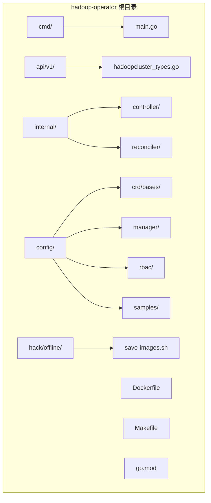
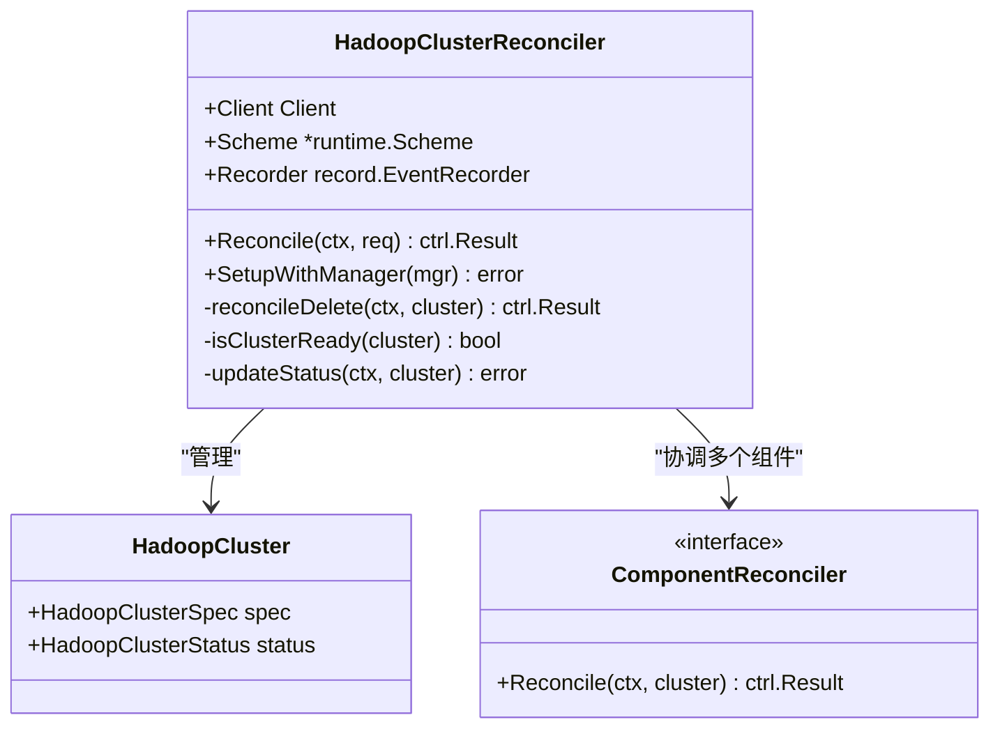
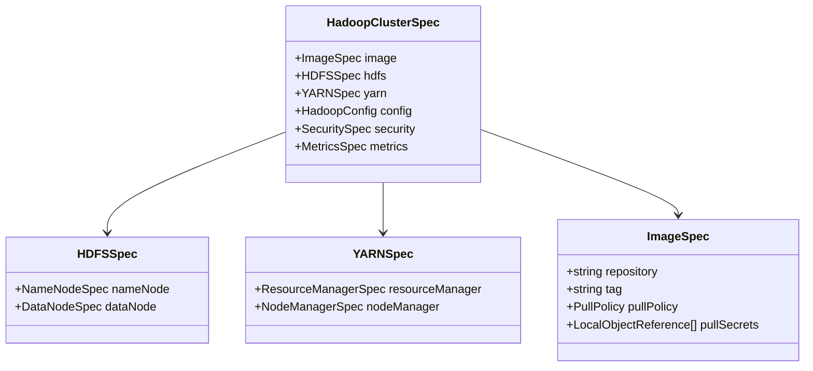
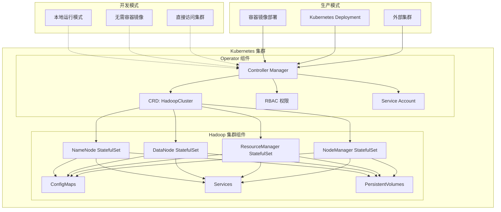
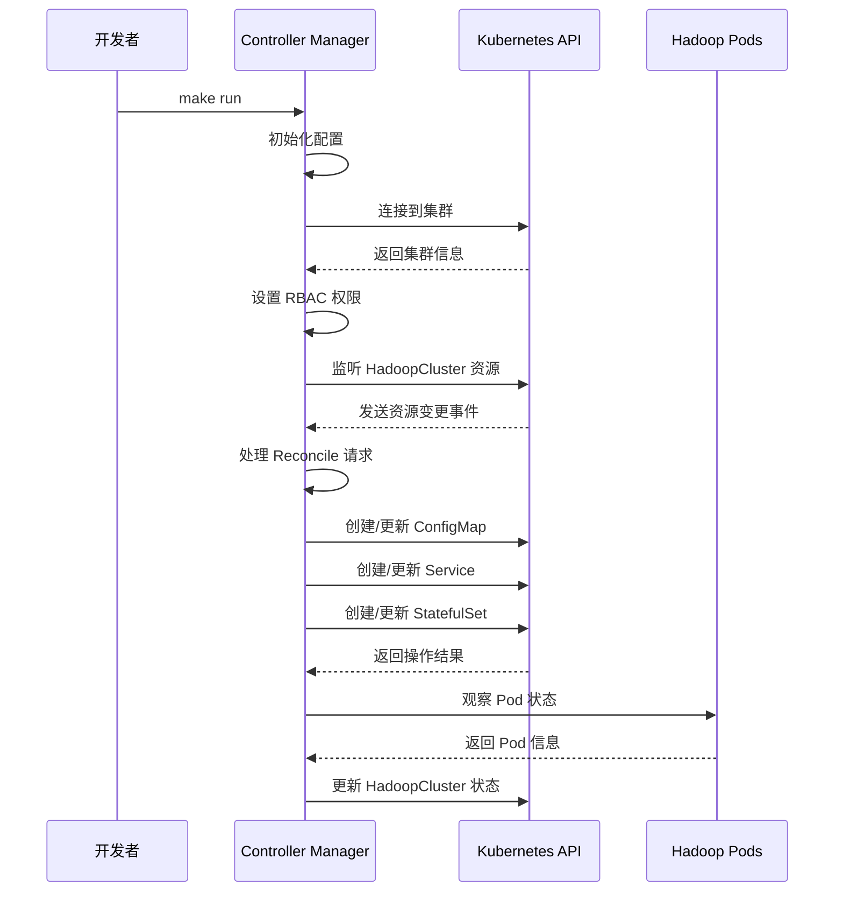
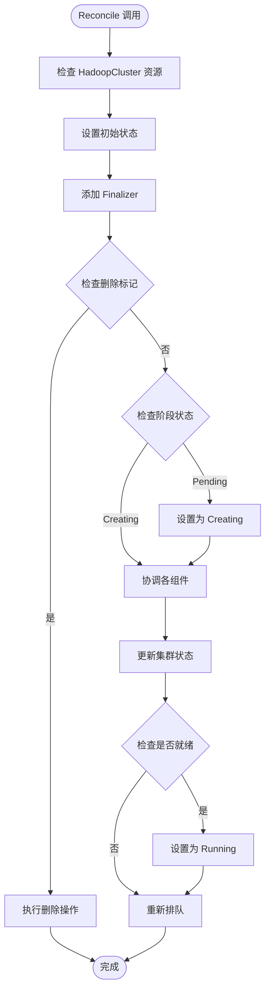
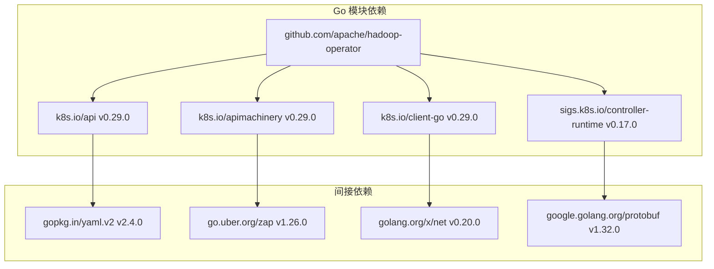
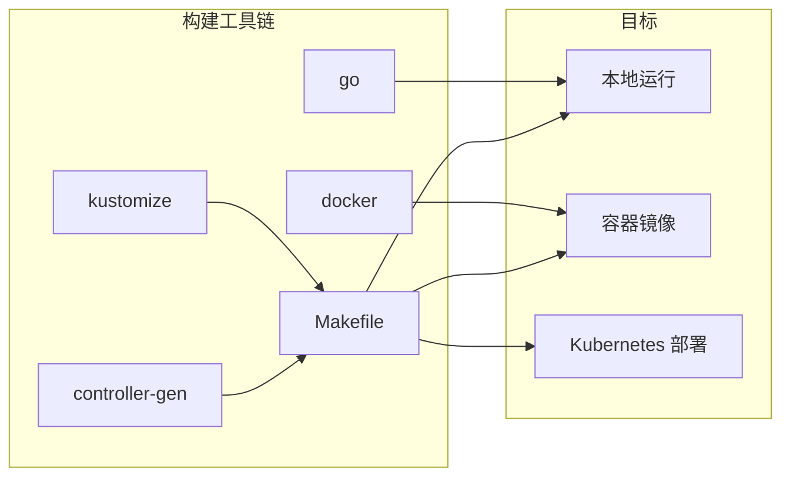

# 本地开发模式部署

<cite>
**本文档引用的文件**
- [main.go](file://hadoop-operator/cmd/main.go)
- [go.mod](file://hadoop-operator/go.mod)
- [Makefile](file://hadoop-operator/Makefile)
- [README.md](file://hadoop-operator/README.md)
- [Dockerfile](file://hadoop-operator/Dockerfile)
- [hadoopcluster_controller.go](file://hadoop-operator/internal/controller/hadoopcluster_controller.go)
- [hadoopcluster_types.go](file://hadoop-operator/api/v1/hadoopcluster_types.go)
- [manager.yaml](file://hadoop-operator/config/manager/manager.yaml)
- [service_account.yaml](file://hadoop-operator/config/rbac/service_account.yaml)
- [hadoop_v1_hadoopcluster.yaml](file://hadoop-operator/config/samples/hadoop_v1_hadoopcluster.yaml)
- [save-images.sh](file://hadoop-operator/hack/offline/save-images.sh)
- [namenode.go](file://hadoop-operator/internal/reconciler/namenode.go)
</cite>

## 目录
1. [简介](#简介)
2. [项目结构](#项目结构)
3. [核心组件](#核心组件)
4. [架构概览](#架构概览)
5. [详细组件分析](#详细组件分析)
6. [依赖分析](#依赖分析)
7. [性能考虑](#性能考虑)
8. [故障排除指南](#故障排除指南)
9. [结论](#结论)

## 简介

Hadoop Operator 是一个用于在 Kubernetes 上部署和管理 Hadoop 集群的生产级 Operator。该文档专注于本地开发模式的部署指南，详细说明如何在本地环境中运行 Hadoop Operator 进行开发和测试。本地开发模式与生产部署有显著区别，适合开发者进行功能验证、调试和性能测试。

## 项目结构

Hadoop Operator 采用标准的 Kubebuilder 项目结构，主要包含以下关键目录：



**图表来源**
- [main.go:1-150](file://hadoop-operator/cmd/main.go#L1-L150)
- [hadoopcluster_types.go:1-418](file://hadoop-operator/api/v1/hadoopcluster_types.go#L1-L418)

**章节来源**
- [README.md:233-251](file://hadoop-operator/README.md#L233-L251)
- [Makefile:1-165](file://hadoop-operator/Makefile#L1-L165)

## 核心组件

### 主控制器 (HadoopClusterReconciler)

主控制器是整个 Operator 的核心，负责协调 Hadoop 集群的生命周期管理：



**图表来源**
- [hadoopcluster_controller.go:41-239](file://hadoop-operator/internal/controller/hadoopcluster_controller.go#L41-L239)
- [hadoopcluster_types.go:397-413](file://hadoop-operator/api/v1/hadoopcluster_types.go#L397-L413)

### CRD 数据模型

Operator 使用自定义资源定义 (CRD) 来描述 Hadoop 集群配置：



**图表来源**
- [hadoopcluster_types.go:24-46](file://hadoop-operator/api/v1/hadoopcluster_types.go#L24-L46)
- [hadoopcluster_types.go:61-148](file://hadoop-operator/api/v1/hadoopcluster_types.go#L61-L148)

**章节来源**
- [hadoopcluster_controller.go:41-239](file://hadoop-operator/internal/controller/hadoopcluster_controller.go#L41-L239)
- [hadoopcluster_types.go:24-418](file://hadoop-operator/api/v1/hadoopcluster_types.go#L24-L418)

## 架构概览

Hadoop Operator 的整体架构基于 Kubernetes 控制器模式：



**图表来源**
- [main.go:97-119](file://hadoop-operator/cmd/main.go#L97-L119)
- [manager.yaml:10-79](file://hadoop-operator/config/manager/manager.yaml#L10-L79)

## 详细组件分析

### 本地开发模式配置

本地开发模式通过直接运行 Go 程序而非部署容器镜像来实现：



**图表来源**
- [main.go:54-148](file://hadoop-operator/cmd/main.go#L54-L148)
- [Makefile:65-67](file://hadoop-operator/Makefile#L65-L67)

### 组件协调器 (Reconciler)

每个 Hadoop 组件都有专门的协调器负责其生命周期管理：



**图表来源**
- [hadoopcluster_controller.go:60-144](file://hadoop-operator/internal/controller/hadoopcluster_controller.go#L60-L144)

**章节来源**
- [hadoopcluster_controller.go:104-126](file://hadoop-operator/internal/controller/hadoopcluster_controller.go#L104-L126)
- [namenode.go:36-114](file://hadoop-operator/internal/reconciler/namenode.go#L36-L114)

## 依赖分析

### Go 模块依赖

项目使用 Go 1.21 和 Kubernetes 控制器运行时框架：



**图表来源**
- [go.mod:5-68](file://hadoop-operator/go.mod#L5-L68)

### 构建和部署工具



**图表来源**
- [Makefile:39-95](file://hadoop-operator/Makefile#L39-L95)

**章节来源**
- [go.mod:1-69](file://hadoop-operator/go.mod#L1-L69)
- [Makefile:1-165](file://hadoop-operator/Makefile#L1-L165)

## 性能考虑

### 本地开发模式优势

1. **快速迭代**：无需构建容器镜像，直接运行 Go 程序
2. **实时调试**：可以使用 IDE 直接调试，支持断点和变量检查
3. **资源效率**：避免容器启动开销，内存占用更少
4. **开发体验**：支持热重载和自动重启

### 性能优化建议

1. **日志级别控制**：
   ```bash
   # 开发模式使用详细日志
   go run ./cmd/main.go --development
   
   # 生产模式使用简洁日志
   ./bin/manager --production
   ```

2. **并发控制**：
   - 调整 Reconcile 队列大小
   - 优化缓存策略
   - 合理设置重试间隔

3. **资源管理**：
   - 监控内存使用情况
   - 优化 Kubernetes API 调用频率
   - 实现智能缓存机制

## 故障排除指南

### 常见开发问题

#### 1. 本地运行失败

**问题症状**：
- 启动时报错："unable to start manager"
- 权限不足错误

**解决方案**：
```bash
# 检查 Kubernetes 配置
kubectl config current-context

# 确认 RBAC 权限
kubectl auth can-i get pods --all-namespaces

# 检查集群连接
kubectl cluster-info
```

#### 2. CRD 未注册

**问题症状**：
- 创建 HadoopCluster 资源时报错
- "no matches for kind 'HadoopCluster'"

**解决方案**：
```bash
# 生成并安装 CRD
make manifests
kubectl apply -f config/crd/bases/hadoop.apache.org_hadoopclusters.yaml
```

#### 3. 端口冲突

**问题症状**：
- 端口被占用错误
- metrics 或健康检查端口冲突

**解决方案**：
```bash
# 修改默认端口
go run ./cmd/main.go \
  --metrics-bind-address=:8082 \
  --health-probe-bind-address=:8083
```

#### 4. 镜像拉取问题

**问题症状**：
- Pod 启动失败，镜像拉取错误

**解决方案**：
```bash
# 使用本地镜像或私有仓库
kubectl patch deployment hadoop-operator-controller-manager \
  -n hadoop-operator-system \
  -p '{"spec":{"template":{"spec":{"imagePullSecrets":[{"name":"regcred"}]}}}}'
```

### 调试技巧

#### 1. 日志调试

```bash
# 启用详细日志
go run ./cmd/main.go --zap-devel

# 查看特定组件日志
kubectl logs -n hadoop-operator-system deployment/hadoop-operator-controller-manager -c manager
```

#### 2. 状态监控

```bash
# 监控 HadoopCluster 状态
kubectl get hadoopcluster -o yaml

# 查看事件
kubectl get events --field-selector involvedObject.kind='HadoopCluster'

# 跟踪 Reconcile 过程
kubectl logs -n hadoop-operator-system deployment/hadoop-operator-controller-manager -c manager | grep -E "(Reconcile|ERROR|WARN)"
```

#### 3. 网络调试

```bash
# 检查服务连通性
kubectl exec -it <pod-name> -- nc -zv <service-name> 9000

# 查看端口映射
kubectl get svc -o jsonpath='{.items[*].spec.ports[*].port}'
```

**章节来源**
- [README.md:276-318](file://hadoop-operator/README.md#L276-L318)
- [main.go:69-75](file://hadoop-operator/cmd/main.go#L69-L75)

## 结论

本地开发模式为 Hadoop Operator 的开发和测试提供了高效、灵活的环境。相比生产部署，本地模式具有以下优势：

1. **开发效率**：无需容器构建，直接运行和调试
2. **成本效益**：减少资源消耗和部署时间
3. **灵活性**：支持快速迭代和实验性功能测试
4. **调试便利**：IDE 集成和实时调试能力

### 最佳实践建议

1. **开发阶段**：使用本地模式进行功能开发和单元测试
2. **集成测试**：在隔离的测试集群中进行端到端测试
3. **性能测试**：在接近生产环境的配置下进行性能基准测试
4. **生产部署**：使用容器镜像和标准 Kubernetes 部署流程

通过合理利用本地开发模式，开发者可以显著提高 Hadoop Operator 的开发效率和质量，同时确保最终产品的稳定性和可靠性。