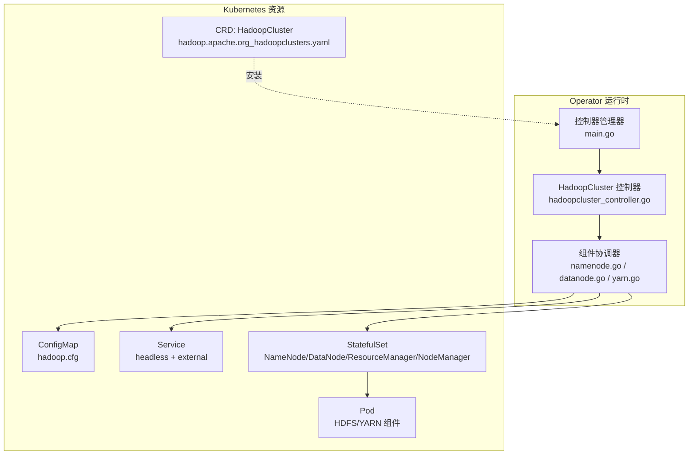
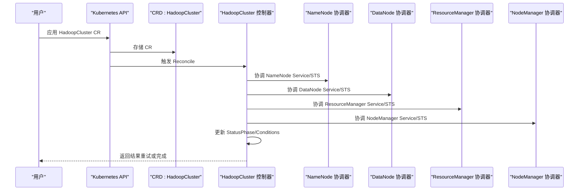
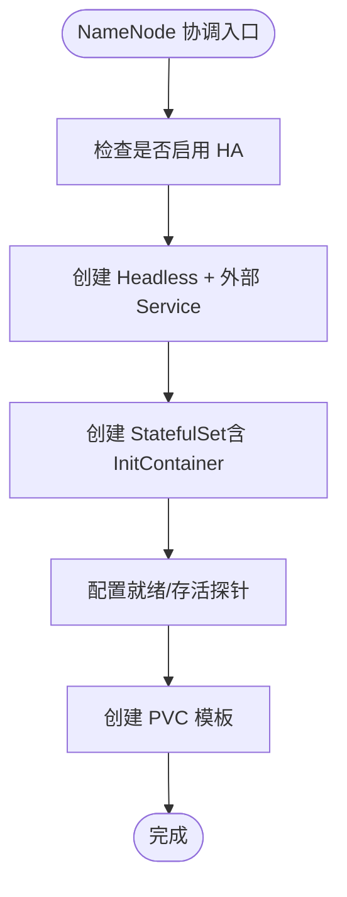
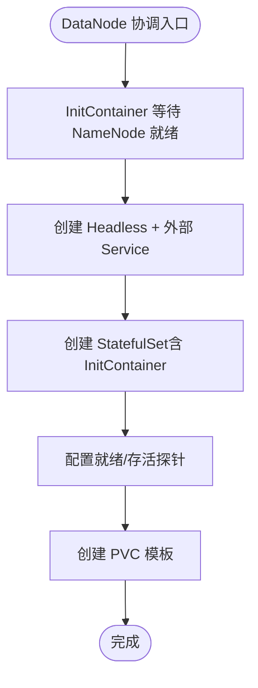
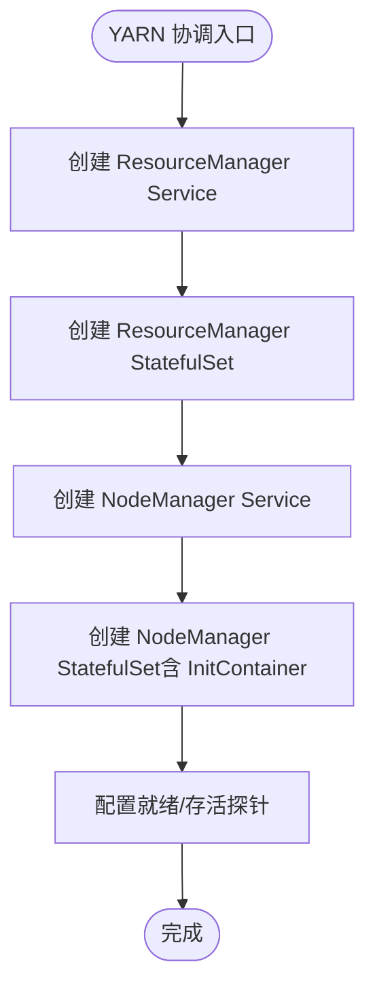
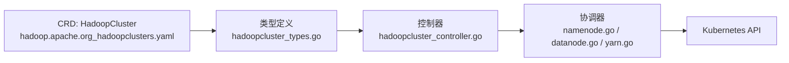

# 部署验证与测试

<cite>
**本文档引用的文件**
- [README.md](file://README.md)
- [main.go](file://cmd/main.go)
- [hadoopcluster_types.go](file://api/v1/hadoopcluster_types.go)
- [hadoopcluster_controller.go](file://internal/controller/hadoopcluster_controller.go)
- [hadoop.apache.org_hadoopclusters.yaml](file://config/crd/bases/hadoop.apache.org_hadoopclusters.yaml)
- [hadoop_v1_hadoopcluster.yaml](file://config/samples/hadoop_v1_hadoopcluster.yaml)
- [hadoop_v1_hadoopcluster_ha.yaml](file://config/samples/hadoop_v1_hadoopcluster_ha.yaml)
- [offline-deployment.yaml](file://config/samples/offline-deployment.yaml)
- [namenode.go](file://internal/reconciler/namenode.go)
- [datanode.go](file://internal/reconciler/datanode.go)
- [yarn.go](file://internal/reconciler/yarn.go)
- [Dockerfile](file://Dockerfile)
- [Makefile](file://Makefile)
</cite>

## 目录
1. [简介](#简介)
2. [项目结构](#项目结构)
3. [核心组件](#核心组件)
4. [架构总览](#架构总览)
5. [详细组件分析](#详细组件分析)
6. [依赖关系分析](#依赖关系分析)
7. [性能考虑](#性能考虑)
8. [故障排查指南](#故障排查指南)
9. [结论](#结论)
10. [附录](#附录)

## 简介
本指南面向在 Kubernetes 上部署与验证 Hadoop Operator 的用户，提供从安装到功能验证的完整流程，包括：
- Operator 状态检查与 CRD 安装验证
- 集群创建与状态检查
- 各组件（NameNode、DataNode、ResourceManager、NodeManager）就绪状态验证
- 端到端功能测试（HDFS 文件操作、YARN 任务提交）
- 监控指标验证与日志检查方法
- 失败诊断思路与常用排查命令

## 项目结构
该仓库采用标准的 Kubebuilder 项目结构，核心模块如下：
- api/v1：自定义资源 CRD 的 Go 类型定义
- cmd/main.go：Operator 入口，初始化控制器管理器、健康探针与指标服务
- internal/controller：主控制器，负责 HadoopCluster 资源的协调
- internal/reconciler：各组件协调器（NameNode、DataNode、YARN）
- config/crd/bases：CRD 定义
- config/samples：示例 HadoopCluster 配置（基础、高可用、离线）
- config/manager、config/rbac：Operator 部署与权限配置
- hack/offline：离线部署脚本
- Dockerfile、Makefile：构建与部署工具链

图表来源
- [main.go:54-149](file://cmd/main.go#L54-L149)
- [hadoopcluster_controller.go:104-144](file://internal/controller/hadoopcluster_controller.go#L104-L144)
- [hadoop.apache.org_hadoopclusters.yaml:1-411](file://config/crd/bases/hadoop.apache.org_hadoopclusters.yaml#L1-L411)

章节来源
- [README.md:233-251](file://README.md#L233-L251)
- [Makefile:103-118](file://Makefile#L103-L118)

## 核心组件
- 自定义资源 CRD：HadoopCluster，定义了镜像、HDFS、YARN、配置覆盖、安全与监控等字段，并提供状态字段（Phase、Conditions、各组件状态）
- 主控制器：按顺序协调 ConfigMap、Service、StatefulSet，更新集群状态，判断整体就绪
- 组件协调器：分别为 NameNode、DataNode、ResourceManager、NodeManager 创建/更新服务与状态集，设置探针与存储卷

章节来源
- [hadoopcluster_types.go:24-46](file://api/v1/hadoopcluster_types.go#L24-L46)
- [hadoopcluster_controller.go:104-144](file://internal/controller/hadoopcluster_controller.go#L104-L144)
- [hadoopcluster_types.go:297-315](file://api/v1/hadoopcluster_types.go#L297-L315)

## 架构总览
Operator 通过 CRD 管理 Hadoop 集群生命周期，控制器按顺序协调各组件，最终形成高可用的 HDFS 与 YARN 集群。

图表来源
- [hadoopcluster_controller.go:104-144](file://internal/controller/hadoopcluster_controller.go#L104-L144)
- [namenode.go:36-114](file://internal/reconciler/namenode.go#L36-L114)
- [datanode.go:35-113](file://internal/reconciler/datanode.go#L35-L113)
- [yarn.go:34-113](file://internal/reconciler/yarn.go#L34-L113)

## 详细组件分析

### NameNode 组件
- 服务：Headless 服务用于稳定 DNS；外部服务（NodePort/LoadBalancer）暴露 RPC/Web 端口
- 状态集：根据副本数创建 StatefulSet，支持 HA 模式（JournalNode/ZooKeeper）
- 初始化：InitContainer 格式化 NameNode（单实例或 HA 第一个实例），权限初始化
- 探针：就绪/存活探针访问 JMX 页面
- 存储：PVC 模板挂载数据目录

图表来源
- [namenode.go:36-114](file://internal/reconciler/namenode.go#L36-L114)
- [namenode.go:117-317](file://internal/reconciler/namenode.go#L117-L317)

章节来源
- [namenode.go:36-114](file://internal/reconciler/namenode.go#L36-L114)
- [namenode.go:117-317](file://internal/reconciler/namenode.go#L117-L317)

### DataNode 组件
- 服务：Headless + 外部服务，暴露数据与 Web 端口
- 状态集：等待 NameNode 就绪后启动，InitContainer 设置权限
- 探针：就绪/存活探针访问 Web 页面
- 存储：PVC 模板挂载数据目录

图表来源
- [datanode.go:35-113](file://internal/reconciler/datanode.go#L35-L113)
- [datanode.go:115-321](file://internal/reconciler/datanode.go#L115-L321)

章节来源
- [datanode.go:35-113](file://internal/reconciler/datanode.go#L35-L113)
- [datanode.go:115-321](file://internal/reconciler/datanode.go#L115-L321)

### ResourceManager 与 NodeManager 组件
- ResourceManager：Headless + 外部服务，暴露 RPC/Web 端口；HA 模式至少 2 副本
- NodeManager：Headless + 外部服务，暴露 Web 端口；InitContainer 等待 ResourceManager 就绪
- 探针：分别访问集群信息与节点页面

图表来源
- [yarn.go:34-113](file://internal/reconciler/yarn.go#L34-L113)
- [yarn.go:115-240](file://internal/reconciler/yarn.go#L115-L240)
- [yarn.go:242-310](file://internal/reconciler/yarn.go#L242-L310)
- [yarn.go:312-447](file://internal/reconciler/yarn.go#L312-L447)

章节来源
- [yarn.go:34-113](file://internal/reconciler/yarn.go#L34-L113)
- [yarn.go:115-240](file://internal/reconciler/yarn.go#L115-L240)
- [yarn.go:242-310](file://internal/reconciler/yarn.go#L242-L310)
- [yarn.go:312-447](file://internal/reconciler/yarn.go#L312-L447)

## 依赖关系分析
- 控制器依赖 CRD 定义的 HadoopCluster 类型
- 控制器 Owns StatefulSet/Service/ConfigMap/PVC，间接依赖 Kubernetes API
- 组件协调器依赖 HadoopCluster 规格（镜像、资源、存储、服务类型等）

图表来源
- [hadoop.apache.org_hadoopclusters.yaml:1-411](file://config/crd/bases/hadoop.apache.org_hadoopclusters.yaml#L1-L411)
- [hadoopcluster_types.go:24-46](file://api/v1/hadoopcluster_types.go#L24-L46)
- [hadoopcluster_controller.go:230-239](file://internal/controller/hadoopcluster_controller.go#L230-L239)

章节来源
- [hadoopcluster_controller.go:230-239](file://internal/controller/hadoopcluster_controller.go#L230-L239)

## 性能考虑
- 资源请求/限制：建议根据集群规模与工作负载合理设置 CPU/内存
- 存储：DataNode/NameNode PVC 大小与 StorageClass 影响 I/O 性能
- 探针间隔：默认探针周期适中，可根据集群规模调整
- HA 模式：NameNode/ResourceManager 至少 2 副本，JournalNode 至少 3 副本以保证仲裁

## 故障排查指南

### 部署前检查
- 确认 Kubernetes 版本满足要求（1.24+）
- 确认 kubectl 已正确配置
- 如需离线部署，准备私有镜像仓库与镜像拉取 Secret

章节来源
- [README.md:17-22](file://README.md#L17-L22)
- [README.md:84-127](file://README.md#L84-L127)

### 安装与 CRD 验证
- 安装 CRD
  - kubectl apply -f config/crd/bases/hadoop.apache.org_hadoopclusters.yaml
- 安装 RBAC
  - kubectl apply -f config/rbac/
- 部署 Operator
  - kubectl apply -f config/manager/manager.yaml
- 验证 Operator 运行
  - kubectl get pods -n <operator-namespace> -l control-plane=controller-manager

章节来源
- [README.md:23-36](file://README.md#L23-L36)
- [main.go:97-119](file://cmd/main.go#L97-L119)

### 集群创建与状态检查
- 应用示例配置（基础/高可用/离线）
  - kubectl apply -f config/samples/hadoop_v1_hadoopcluster.yaml
  - kubectl apply -f config/samples/hadoop_v1_hadoopcluster_ha.yaml
  - kubectl apply -f config/samples/offline-deployment.yaml
- 查看集群状态
  - kubectl get hadoopcluster
- 查看 Pod 状态
  - kubectl get pods -l hadoop.apache.org/cluster=<cluster-name>
- 查看各组件就绪状态
  - kubectl get hadoopcluster <cluster-name> -o jsonpath='{.status}'
  - 关注 Phase、Conditions、各组件 ReadyReplicas/Replicas

章节来源
- [README.md:52-82](file://README.md#L52-L82)
- [hadoopcluster_controller.go:169-174](file://internal/controller/hadoopcluster_controller.go#L169-L174)

### 组件就绪验证
- NameNode
  - 外部服务端口：9870（Web UI）、9000（RPC）
  - kubectl port-forward svc/<cluster>-namenode-external 9870:9870
- DataNode
  - 外部服务端口：9864（Web UI）、9866（数据端口）
  - kubectl port-forward svc/<cluster>-datanode-external 9864:9864
- ResourceManager
  - 外部服务端口：8088（Web UI）、8032（RPC）
  - kubectl port-forward svc/<cluster>-resourcemanager-external 8088:8088
- NodeManager
  - 外部服务端口：8042（Web UI）
  - kubectl port-forward svc/<cluster>-nodemanager-external 8042:8042

章节来源
- [README.md:75-82](file://README.md#L75-L82)
- [namenode.go:52-63](file://internal/reconciler/namenode.go#L52-L63)
- [datanode.go:51-62](file://internal/reconciler/datanode.go#L51-L62)
- [yarn.go:51-62](file://internal/reconciler/yarn.go#L51-L62)

### 端到端功能测试

#### HDFS 文件操作
- 通过 NameNode Web UI 或命令行进行基本操作（上传/下载/列出目录）
- 若无 UI，可通过 Pod 执行 HDFS 命令（需配置 HADOOP_CONF_DIR）

章节来源
- [hadoop_v1_hadoopcluster.yaml:70-81](file://config/samples/hadoop_v1_hadoopcluster.yaml#L70-L81)

#### YARN 任务提交
- 通过 ResourceManager Web UI 提交简单 MapReduce 任务
- 或通过 NodeManager 外部服务端口访问相关页面

章节来源
- [hadoop_v1_hadoopcluster.yaml:45-69](file://config/samples/hadoop_v1_hadoopcluster.yaml#L45-L69)

### 监控指标验证
- 启用 Prometheus 监控
  - 在 CR 中开启 metrics.enabled 与 ServiceMonitor
- 验证 ServiceMonitor 是否创建
  - kubectl get servicemonitor -l release=prometheus
- 验证指标端点
  - kubectl get endpoints <cluster>-hadoop-exporter

章节来源
- [hadoop_v1_hadoopcluster_ha.yaml:102-108](file://config/samples/hadoop_v1_hadoopcluster_ha.yaml#L102-L108)
- [hadoop_v1_hadoopcluster.yaml:70-81](file://config/samples/hadoop_v1_hadoopcluster.yaml#L70-L81)

### 日志检查方法
- 查看 Operator 日志
  - kubectl logs -n <operator-namespace> -l control-plane=controller-manager
- 查看各组件 Pod 日志
  - kubectl logs <pod-name>
- 查看上一次容器退出的日志
  - kubectl logs <pod-name> --previous

章节来源
- [README.md:286-288](file://README.md#L286-L288)

### 常见问题与排查命令
- Pod 启动失败
  - kubectl describe pod <pod-name>
  - kubectl logs <pod-name> --previous
- NameNode 格式化失败
  - kubectl get pvc
  - kubectl exec -it <namenode-pod> -- hdfs namenode -format -force
- DataNode 无法连接 NameNode
  - kubectl exec -it <datanode-pod> -- nc -zv <namenode-service> 9000
  - kubectl get configmap <cluster-name>-config -o yaml
- 镜像拉取失败
  - kubectl get secret regcred -o yaml

章节来源
- [README.md:280-318](file://README.md#L280-L318)

## 结论
通过本指南，您可以完成 Hadoop Operator 的安装与验证，确保 NameNode、DataNode、ResourceManager、NodeManager 各组件均处于就绪状态，并能够进行 HDFS 与 YARN 的端到端功能测试。结合监控与日志检查，可快速定位部署与运行中的问题。

## 附录

### 部署成功验证清单
- [ ] CRD 已安装
- [ ] Operator Pod 正常运行
- [ ] HadoopCluster CR 已创建且 Phase 为 Running
- [ ] NameNode/ResourceManager 至少 1 副本就绪
- [ ] DataNode/NodeManager 至少 1 副本就绪
- [ ] 各组件外部服务端口可达
- [ ] HDFS 文件操作与 YARN 任务提交成功
- [ ] Prometheus 指标可用（可选）

### 离线部署要点
- 准备离线镜像并加载至私有仓库
- 创建镜像拉取 Secret 并在 CR 中引用
- 使用 offline-deployment.yaml 部署

章节来源
- [README.md:84-127](file://README.md#L84-L127)
- [offline-deployment.yaml:1-136](file://config/samples/offline-deployment.yaml#L1-L136)