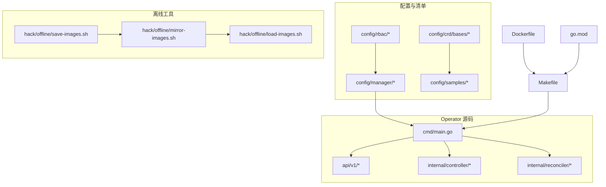
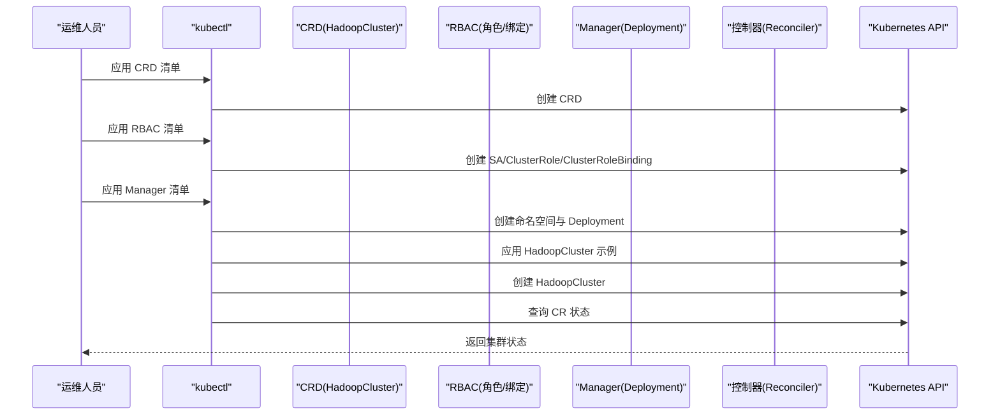
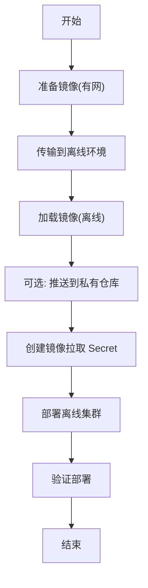
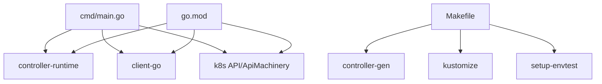

# 安装与部署

<cite>
**本文引用的文件**
- [README.md](file://hadoop-operator/README.md)
- [Dockerfile](file://hadoop-operator/Dockerfile)
- [Makefile](file://hadoop-operator/Makefile)
- [go.mod](file://hadoop-operator/go.mod)
- [main.go](file://hadoop-operator/cmd/main.go)
- [hadoop.apache.org_hadoopclusters.yaml](file://hadoop-operator/config/crd/bases/hadoop.apache.org_hadoopclusters.yaml)
- [service_account.yaml](file://hadoop-operator/config/rbac/service_account.yaml)
- [role.yaml](file://hadoop-operator/config/rbac/role.yaml)
- [role_binding.yaml](file://hadoop-operator/config/rbac/role_binding.yaml)
- [manager.yaml](file://hadoop-operator/config/manager/manager.yaml)
- [save-images.sh](file://hadoop-operator/hack/offline/save-images.sh)
- [mirror-images.sh](file://hadoop-operator/hack/offline/mirror-images.sh)
- [load-images.sh](file://hadoop-operator/hack/offline/load-images.sh)
- [offline-deployment.yaml](file://hadoop-operator/config/samples/offline-deployment.yaml)
- [hadoop_v1_hadoopcluster.yaml](file://hadoop-operator/config/samples/hadoop_v1_hadoopcluster.yaml)
</cite>

## 目录
1. [简介](#简介)
2. [项目结构](#项目结构)
3. [核心组件](#核心组件)
4. [架构总览](#架构总览)
5. [详细组件分析](#详细组件分析)
6. [依赖关系分析](#依赖关系分析)
7. [性能考虑](#性能考虑)
8. [故障排查指南](#故障排查指南)
9. [结论](#结论)
10. [附录](#附录)

## 简介
本指南面向不同技术背景的读者，提供 Apache Hadoop Operator v3 的完整安装与部署方案，覆盖以下要点：
- 前置条件检查与环境准备
- 两种部署方式：kubectl 命令行部署与本地开发模式运行
- RBAC 权限配置与 CRD 安装流程
- 离线部署：镜像准备、私有仓库配置与离线集群部署
- 部署验证方法、常见问题排查与最佳实践建议

## 项目结构
该仓库采用标准的 Kubebuilder 项目布局，核心目录与职责如下：
- api/v1：CRD 对应的 Go 类型定义与深度复制生成
- cmd/main.go：Operator 入口，初始化控制器运行时、健康探针与指标服务
- config/crd/bases：CRD YAML 定义
- config/rbac：ServiceAccount、ClusterRole、ClusterRoleBinding
- config/manager：Operator Deployment 与命名空间配置
- config/samples：示例 CR（含基础与高可用、离线部署）
- hack/offline：离线镜像准备与推送脚本
- Dockerfile、Makefile、go.mod：构建、打包与依赖管理

图表来源
- [main.go:1-150](file://hadoop-operator/cmd/main.go#L1-L150)
- [hadoop.apache.org_hadoopclusters.yaml:1-411](file://hadoop-operator/config/crd/bases/hadoop.apache.org_hadoopclusters.yaml#L1-L411)
- [service_account.yaml:1-9](file://hadoop-operator/config/rbac/service_account.yaml#L1-L9)
- [role.yaml:1-100](file://hadoop-operator/config/rbac/role.yaml#L1-L100)
- [role_binding.yaml:1-16](file://hadoop-operator/config/rbac/role_binding.yaml#L1-L16)
- [manager.yaml:1-80](file://hadoop-operator/config/manager/manager.yaml#L1-L80)
- [save-images.sh:1-66](file://hadoop-operator/hack/offline/save-images.sh#L1-L66)
- [mirror-images.sh:1-127](file://hadoop-operator/hack/offline/mirror-images.sh#L1-L127)
- [load-images.sh:1-75](file://hadoop-operator/hack/offline/load-images.sh#L1-L75)
- [Dockerfile:1-34](file://hadoop-operator/Dockerfile#L1-L34)
- [Makefile:1-165](file://hadoop-operator/Makefile#L1-L165)
- [go.mod:1-69](file://hadoop-operator/go.mod#L1-L69)

章节来源
- [README.md:23-50](file://hadoop-operator/README.md#L23-L50)
- [Makefile:1-165](file://hadoop-operator/Makefile#L1-L165)

## 核心组件
- CRD（自定义资源定义）：定义 HadoopCluster 资源的结构与状态字段，支持 HDFS、YARN、镜像、配置覆盖、监控等配置项
- RBAC：授予 Operator 控制器管理 CR、ConfigMap、PVC、Service、StatefulSet/Deployment 的权限
- Manager Deployment：以 Deployment 形式运行 Operator，内置健康检查与指标端点
- 离线工具链：封装镜像保存、镜像镜像、镜像加载与推送流程，便于离线环境部署

章节来源
- [hadoop.apache.org_hadoopclusters.yaml:1-411](file://hadoop-operator/config/crd/bases/hadoop.apache.org_hadoopclusters.yaml#L1-L411)
- [role.yaml:1-100](file://hadoop-operator/config/rbac/role.yaml#L1-L100)
- [manager.yaml:1-80](file://hadoop-operator/config/manager/manager.yaml#L1-L80)
- [save-images.sh:1-66](file://hadoop-operator/hack/offline/save-images.sh#L1-L66)
- [mirror-images.sh:1-127](file://hadoop-operator/hack/offline/mirror-images.sh#L1-L127)
- [load-images.sh:1-75](file://hadoop-operator/hack/offline/load-images.sh#L1-L75)

## 架构总览
下图展示 Operator 从安装到集群创建的关键交互路径。

图表来源
- [hadoop.apache.org_hadoopclusters.yaml:1-411](file://hadoop-operator/config/crd/bases/hadoop.apache.org_hadoopclusters.yaml#L1-L411)
- [service_account.yaml:1-9](file://hadoop-operator/config/rbac/service_account.yaml#L1-L9)
- [role.yaml:1-100](file://hadoop-operator/config/rbac/role.yaml#L1-L100)
- [role_binding.yaml:1-16](file://hadoop-operator/config/rbac/role_binding.yaml#L1-L16)
- [manager.yaml:1-80](file://hadoop-operator/config/manager/manager.yaml#L1-L80)
- [hadoop_v1_hadoopcluster.yaml:1-80](file://hadoop-operator/config/samples/hadoop_v1_hadoopcluster.yaml#L1-L80)

## 详细组件分析

### 1. 前置条件检查
- Kubernetes 版本：满足 1.24+ 要求
- kubectl 已正确配置并可访问集群
- Helm 3.x（可选，用于高级场景）

章节来源
- [README.md:17-22](file://hadoop-operator/README.md#L17-L22)

### 2. kubectl 命令行部署
- 步骤一：安装 CRD
  - 使用命令应用 CRD YAML
- 步骤二：安装 RBAC
  - 应用 ServiceAccount、ClusterRole、ClusterRoleBinding
- 步骤三：部署 Manager
  - 应用命名空间与 Deployment 清单

章节来源
- [README.md:25-36](file://hadoop-operator/README.md#L25-L36)
- [hadoop.apache.org_hadoopclusters.yaml:1-411](file://hadoop-operator/config/crd/bases/hadoop.apache.org_hadoopclusters.yaml#L1-L411)
- [service_account.yaml:1-9](file://hadoop-operator/config/rbac/service_account.yaml#L1-L9)
- [role.yaml:1-100](file://hadoop-operator/config/rbac/role.yaml#L1-L100)
- [role_binding.yaml:1-16](file://hadoop-operator/config/rbac/role_binding.yaml#L1-L16)
- [manager.yaml:1-80](file://hadoop-operator/config/manager/manager.yaml#L1-L80)

### 3. 本地开发模式运行
- 下载依赖：使用 go mod 下载依赖
- 运行 Operator：通过 make run 或直接 go run 启动本地控制器

章节来源
- [README.md:38-50](file://hadoop-operator/README.md#L38-L50)
- [Makefile:65-67](file://hadoop-operator/Makefile#L65-L67)

### 4. RBAC 权限配置
- ServiceAccount：用于绑定控制器运行身份
- ClusterRole：授予对 CR、ConfigMap、PVC、Service、StatefulSet/Deployment 的读写权限
- ClusterRoleBinding：将 ClusterRole 绑定到 ServiceAccount

图表来源
- [service_account.yaml:1-9](file://hadoop-operator/config/rbac/service_account.yaml#L1-L9)
- [role.yaml:1-100](file://hadoop-operator/config/rbac/role.yaml#L1-L100)
- [role_binding.yaml:1-16](file://hadoop-operator/config/rbac/role_binding.yaml#L1-L16)

章节来源
- [service_account.yaml:1-9](file://hadoop-operator/config/rbac/service_account.yaml#L1-L9)
- [role.yaml:1-100](file://hadoop-operator/config/rbac/role.yaml#L1-L100)
- [role_binding.yaml:1-16](file://hadoop-operator/config/rbac/role_binding.yaml#L1-L16)

### 5. CRD 安装过程
- CRD 定义包含 HadoopCluster 的 Spec 与 Status 字段，支持 HDFS、YARN、镜像、配置覆盖、监控等
- 通过 kubectl 应用 CRD YAML 完成安装

章节来源
- [hadoop.apache.org_hadoopclusters.yaml:1-411](file://hadoop-operator/config/crd/bases/hadoop.apache.org_hadoopclusters.yaml#L1-L411)

### 6. 部署 Hadoop 集群
- 基础部署：应用示例 CR（单 NameNode/ResourceManager）
- 高可用部署：应用 HA 示例 CR（NameNode/ResourceManager HA）

章节来源
- [README.md:52-64](file://hadoop-operator/README.md#L52-L64)
- [hadoop_v1_hadoopcluster.yaml:1-80](file://hadoop-operator/config/samples/hadoop_v1_hadoopcluster.yaml#L1-L80)

### 7. 离线部署指南
离线部署分为三个阶段：准备镜像、加载镜像、部署集群。

- 准备镜像（有网环境）
  - 使用脚本保存所需镜像到本地 tar 包
  - 传输 tar 包至离线环境
- 加载镜像（离线环境）
  - 从 tar 包加载镜像；可选择同时推送到私有仓库
- 私有仓库配置
  - 创建镜像拉取 Secret，供 Pod 拉取私有仓库镜像
- 部署离线集群
  - 应用离线部署示例 CR，指定私有仓库镜像与 Secret

图表来源
- [save-images.sh:1-66](file://hadoop-operator/hack/offline/save-images.sh#L1-L66)
- [load-images.sh:1-75](file://hadoop-operator/hack/offline/load-images.sh#L1-L75)
- [mirror-images.sh:1-127](file://hadoop-operator/hack/offline/mirror-images.sh#L1-L127)
- [offline-deployment.yaml:1-135](file://hadoop-operator/config/samples/offline-deployment.yaml#L1-L135)

章节来源
- [README.md:84-127](file://hadoop-operator/README.md#L84-L127)
- [save-images.sh:1-66](file://hadoop-operator/hack/offline/save-images.sh#L1-L66)
- [load-images.sh:1-75](file://hadoop-operator/hack/offline/load-images.sh#L1-L75)
- [mirror-images.sh:1-127](file://hadoop-operator/hack/offline/mirror-images.sh#L1-L127)
- [offline-deployment.yaml:1-135](file://hadoop-operator/config/samples/offline-deployment.yaml#L1-L135)

### 8. 部署验证方法
- 查看 HadoopCluster 列表与状态
- 查看相关 Pod、Service、StatefulSet/Deployment
- 通过端口转发访问 NameNode 与 ResourceManager UI

章节来源
- [README.md:66-82](file://hadoop-operator/README.md#L66-L82)

### 9. 构建与打包（可选）
- 构建二进制：make build
- 构建镜像：make docker-build
- 推送镜像：make docker-push
- 使用 Makefile 提供的 kustomize 与 controller-gen 工具

章节来源
- [README.md:253-274](file://hadoop-operator/README.md#L253-L274)
- [Makefile:61-96](file://hadoop-operator/Makefile#L61-L96)
- [Dockerfile:1-34](file://hadoop-operator/Dockerfile#L1-L34)
- [go.mod:1-69](file://hadoop-operator/go.mod#L1-L69)

## 依赖关系分析
- 运行时依赖：controller-runtime、client-go、k8s API 与 apimachinery
- 构建依赖：controller-gen、kustomize、envtest
- Operator 入口依赖 controller-runtime 初始化 Manager，并注册控制器与健康检查

图表来源
- [main.go:1-150](file://hadoop-operator/cmd/main.go#L1-L150)
- [Makefile:1-165](file://hadoop-operator/Makefile#L1-L165)
- [go.mod:1-69](file://hadoop-operator/go.mod#L1-L69)

章节来源
- [go.mod:1-69](file://hadoop-operator/go.mod#L1-L69)
- [Makefile:137-165](file://hadoop-operator/Makefile#L137-L165)
- [main.go:1-150](file://hadoop-operator/cmd/main.go#L1-L150)

## 性能考虑
- 资源请求与限制：根据组件规模合理设置 CPU/内存请求与限制
- Pod 反亲和性：通过拓扑键实现关键组件跨节点分布，提升可用性
- 存储类与大小：结合业务数据量选择合适的 StorageClass 与容量
- 监控与导出器：启用监控有助于及时发现性能瓶颈

## 故障排查指南
- Pod 启动失败：查看事件与日志，定位启动异常原因
- NameNode 格式化失败：检查 PVC 状态与手动格式化操作
- DataNode 无法连接 NameNode：检查网络连通性与配置
- 镜像拉取失败：确认镜像存在与 Secret 配置正确

章节来源
- [README.md:276-318](file://hadoop-operator/README.md#L276-L318)

## 结论
通过本指南，您可以在常规与离线环境下完成 Hadoop Operator v3 的安装与部署，并基于示例 CR 快速创建 HDFS 与 YARN 集群。建议在生产环境中结合资源规划、存储策略与监控体系，持续优化集群稳定性与性能。

## 附录
- 快速参考
  - 安装 CRD：kubectl apply -f config/crd/bases/hadoop.apache.org_hadoopclusters.yaml
  - 安装 RBAC：kubectl apply -f config/rbac/
  - 部署 Manager：kubectl apply -f config/manager/manager.yaml
  - 本地运行：make run
  - 离线镜像准备：hack/offline/save-images.sh
  - 离线镜像加载：hack/offline/load-images.sh
  - 离线集群部署：kubectl apply -f config/samples/offline-deployment.yaml

章节来源
- [README.md:25-127](file://hadoop-operator/README.md#L25-L127)
- [hadoop_v1_hadoopcluster.yaml:1-80](file://hadoop-operator/config/samples/hadoop_v1_hadoopcluster.yaml#L1-L80)
- [offline-deployment.yaml:1-135](file://hadoop-operator/config/samples/offline-deployment.yaml#L1-L135)