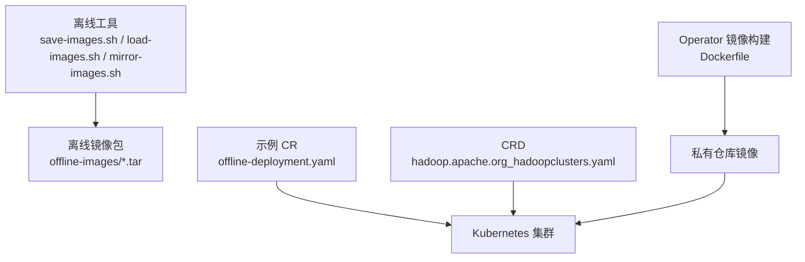
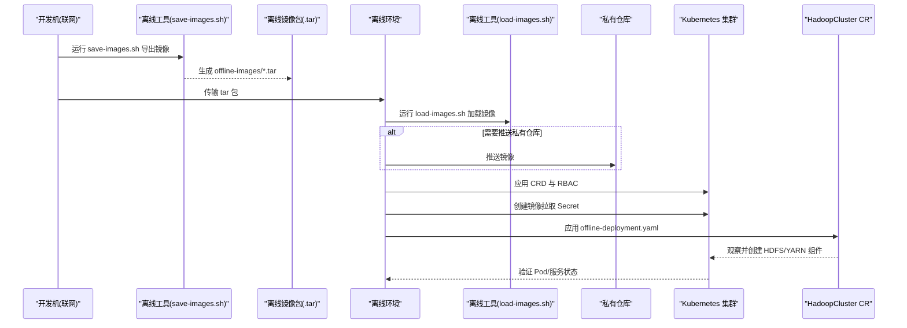
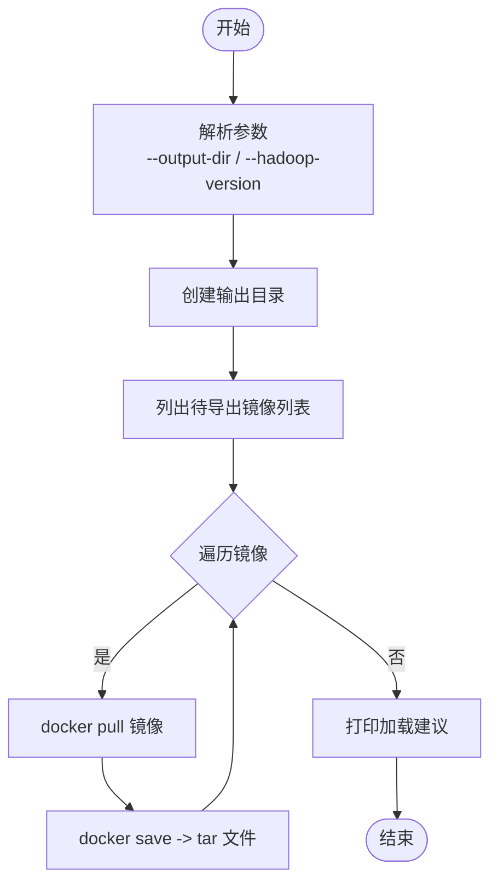
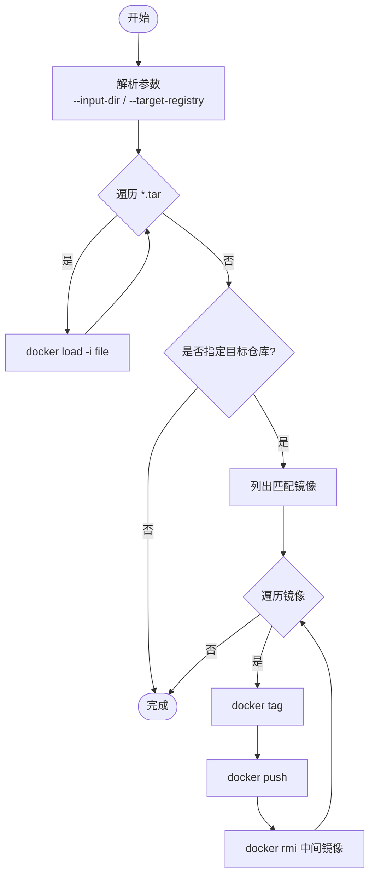
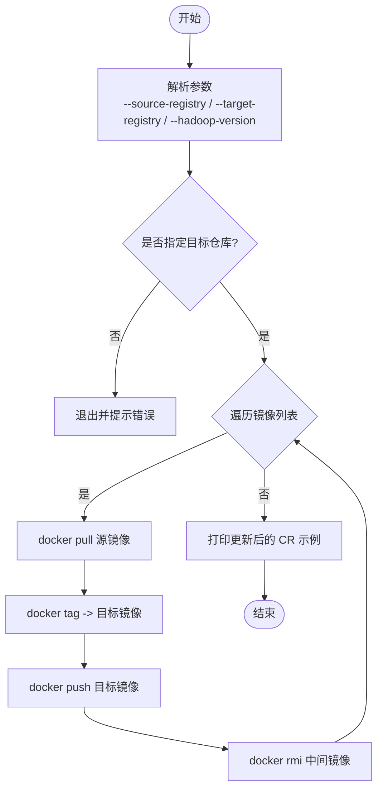
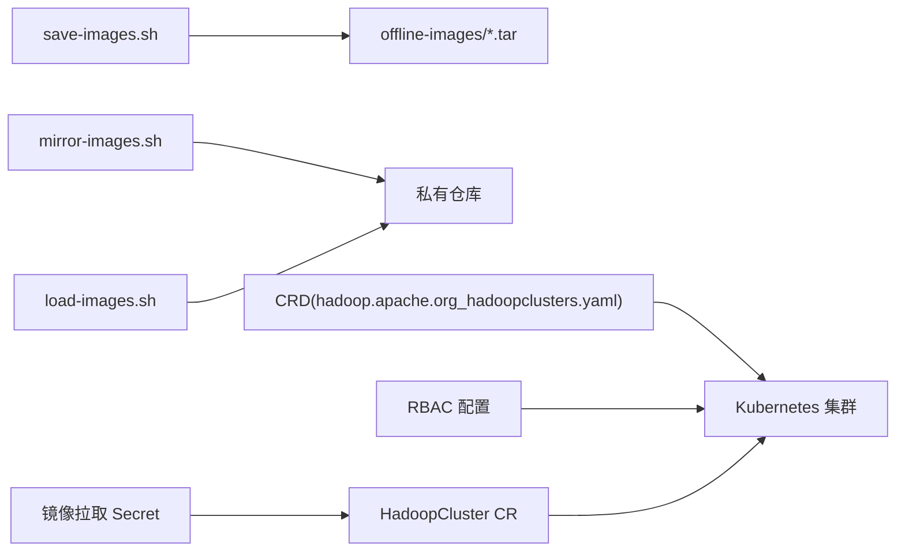

# 离线部署

<cite>
**本文引用的文件**
- [README.md](file://hadoop-operator/README.md)
- [save-images.sh](file://hadoop-operator/hack/offline/save-images.sh)
- [load-images.sh](file://hadoop-operator/hack/offline/load-images.sh)
- [mirror-images.sh](file://hadoop-operator/hack/offline/mirror-images.sh)
- [offline-deployment.yaml](file://hadoop-operator/config/samples/offline-deployment.yaml)
- [hadoop_v1_hadoopcluster.yaml](file://hadoop-operator/config/samples/hadoop_v1_hadoopcluster.yaml)
- [hadoop_v1_hadoopcluster_ha.yaml](file://hadoop-operator/config/samples/hadoop_v1_hadoopcluster_ha.yaml)
- [hadoop.apache.org_hadoopclusters.yaml](file://hadoop-operator/config/crd/bases/hadoop.apache.org_hadoopclusters.yaml)
- [Dockerfile](file://hadoop-operator/Dockerfile)
- [go.mod](file://hadoop-operator/go.mod)
</cite>

## 目录
1. [简介](#简介)
2. [项目结构](#项目结构)
3. [核心组件](#核心组件)
4. [架构总览](#架构总览)
5. [详细组件分析](#详细组件分析)
6. [依赖关系分析](#依赖关系分析)
7. [性能考虑](#性能考虑)
8. [故障排查指南](#故障排查指南)
9. [结论](#结论)
10. [附录](#附录)

## 简介
本指南面向在离线或受限网络环境中部署 Hadoop Operator 的用户，提供从镜像准备、私有仓库配置到集群部署与验证的完整流程。文档重点围绕以下工具与配置：
- 镜像导出工具：save-images.sh
- 镜像加载与推送工具：load-images.sh
- 私有仓库镜像镜像工具：mirror-images.sh
- 离线部署示例 CR：offline-deployment.yaml
- Operator 镜像构建：Dockerfile
- CRD 规范：hadoop.apache.org_hadoopclusters.yaml

## 项目结构
离线部署相关的关键位置如下：
- 离线工具：hadoop-operator/hack/offline/
- 示例 CR：hadoop-operator/config/samples/
- CRD：hadoop-operator/config/crd/bases/
- Operator 镜像构建：hadoop-operator/Dockerfile
- 项目说明与离线部署步骤：hadoop-operator/README.md

图表来源
- [save-images.sh:1-66](file://hadoop-operator/hack/offline/save-images.sh#L1-L66)
- [load-images.sh:1-75](file://hadoop-operator/hack/offline/load-images.sh#L1-L75)
- [mirror-images.sh:1-127](file://hadoop-operator/hack/offline/mirror-images.sh#L1-L127)
- [offline-deployment.yaml:1-135](file://hadoop-operator/config/samples/offline-deployment.yaml#L1-L135)
- [hadoop.apache.org_hadoopclusters.yaml:1-411](file://hadoop-operator/config/crd/bases/hadoop.apache.org_hadoopclusters.yaml#L1-L411)
- [Dockerfile:1-34](file://hadoop-operator/Dockerfile#L1-L34)

章节来源
- [README.md:84-127](file://hadoop-operator/README.md#L84-L127)

## 核心组件
- 镜像导出脚本 save-images.sh：从公共仓库拉取指定版本的 Hadoop 与 ZooKeeper 镜像，打包为 tar 文件，便于离线传输。
- 镜像加载脚本 load-images.sh：从 tar 包加载镜像；可选地将镜像推送到目标私有仓库。
- 私有仓库镜像镜像脚本 mirror-images.sh：直接从源仓库拉取并推送到目标私有仓库，同时清理中间镜像。
- 离线部署示例 CR offline-deployment.yaml：演示如何在离线环境中配置镜像仓库、拉取策略与认证 Secret。
- CRD 规范：定义 HadoopCluster CR 的字段与默认行为，支撑离线部署配置项。
- Operator 镜像构建：Dockerfile 展示了 Operator 二进制的构建与运行方式，便于在离线环境中构建与推送。

章节来源
- [save-images.sh:1-66](file://hadoop-operator/hack/offline/save-images.sh#L1-L66)
- [load-images.sh:1-75](file://hadoop-operator/hack/offline/load-images.sh#L1-L75)
- [mirror-images.sh:1-127](file://hadoop-operator/hack/offline/mirror-images.sh#L1-L127)
- [offline-deployment.yaml:1-135](file://hadoop-operator/config/samples/offline-deployment.yaml#L1-L135)
- [hadoop.apache.org_hadoopclusters.yaml:175-189](file://hadoop-operator/config/crd/bases/hadoop.apache.org_hadoopclusters.yaml#L175-L189)
- [Dockerfile:1-34](file://hadoop-operator/Dockerfile#L1-L34)

## 架构总览
离线部署的总体流程分为三个阶段：
- 准备阶段：在联网环境导出所需镜像，生成 tar 包。
- 传输阶段：将 tar 包安全传输至离线环境。
- 部署阶段：在离线环境加载镜像，配置私有仓库与认证，部署 CR 并验证。

图表来源
- [save-images.sh:1-66](file://hadoop-operator/hack/offline/save-images.sh#L1-L66)
- [load-images.sh:1-75](file://hadoop-operator/hack/offline/load-images.sh#L1-L75)
- [offline-deployment.yaml:1-135](file://hadoop-operator/config/samples/offline-deployment.yaml#L1-L135)
- [hadoop.apache.org_hadoopclusters.yaml:1-411](file://hadoop-operator/config/crd/bases/hadoop.apache.org_hadoopclusters.yaml#L1-L411)

## 详细组件分析

### 镜像导出工具 save-images.sh
- 功能概述
  - 支持自定义输出目录与 Hadoop 版本参数。
  - 默认导出 apache/hadoop 与 zookeeper 镜像。
  - 将每个镜像保存为独立 tar 文件，文件名由镜像名转换而来。
- 关键行为
  - 解析命令行参数，设置输出目录与 Hadoop 版本。
  - 循环拉取并保存镜像，最后打印加载建议。
- 使用建议
  - 在联网环境执行，确保 Docker 可用。
  - 传输前对 offline-images 目录进行压缩归档，便于离线环境解压。

图表来源
- [save-images.sh:1-66](file://hadoop-operator/hack/offline/save-images.sh#L1-L66)

章节来源
- [save-images.sh:1-66](file://hadoop-operator/hack/offline/save-images.sh#L1-L66)

### 镜像加载与推送工具 load-images.sh
- 功能概述
  - 从输入目录加载所有 tar 包中的镜像。
  - 可选将已加载镜像推送到目标私有仓库，并自动打上目标仓库前缀。
- 关键行为
  - 解析输入目录与目标仓库参数。
  - 遍历 tar 文件执行 docker load。
  - 若指定目标仓库，则枚举匹配的镜像并推送。
- 使用建议
  - 在离线环境执行，确保 Docker 可用。
  - 若私有仓库需要认证，需提前创建镜像拉取 Secret 并在 CR 中引用。

图表来源
- [load-images.sh:1-75](file://hadoop-operator/hack/offline/load-images.sh#L1-L75)

章节来源
- [load-images.sh:1-75](file://hadoop-operator/hack/offline/load-images.sh#L1-L75)

### 私有仓库镜像镜像工具 mirror-images.sh
- 功能概述
  - 直接从源仓库拉取镜像并推送到目标私有仓库，适合跨网络环境的镜像迁移。
  - 支持可选的源仓库前缀，便于通过代理或缓存层中转。
  - 清理中间镜像，避免本地空间占用。
- 关键行为
  - 解析源仓库、目标仓库、Hadoop 版本等参数。
  - 定义镜像镜像函数：拉取 -> 标记 -> 推送 -> 清理。
  - 输出更新后的 CR 示例片段，便于直接应用。
- 使用建议
  - 在可访问公网或源仓库的环境中执行。
  - 若目标仓库需要认证，需提前在目标仓库创建相应凭据。

图表来源
- [mirror-images.sh:1-127](file://hadoop-operator/hack/offline/mirror-images.sh#L1-L127)

章节来源
- [mirror-images.sh:1-127](file://hadoop-operator/hack/offline/mirror-images.sh#L1-L127)

### 离线部署示例 CR offline-deployment.yaml
- 配置要点
  - image.repository：指向私有仓库的镜像仓库路径。
  - image.tag：与导出镜像版本一致。
  - image.pullPolicy：建议使用 IfNotPresent。
  - image.pullSecrets：若私有仓库需要认证，需在此处引用 Secret 名称。
  - metrics.exporterImage：监控导出器镜像也应来自私有仓库。
  - 可选：metrics.serviceMonitor.enabled：离线环境通常禁用。
- 最佳实践
  - 将私有仓库地址与端口写入 CR，确保与实际仓库一致。
  - 如需认证，先在同命名空间创建镜像拉取 Secret，再在 CR 中引用。

章节来源
- [offline-deployment.yaml:1-135](file://hadoop-operator/config/samples/offline-deployment.yaml#L1-L135)

### CRD 字段与离线部署映射
- image 字段族
  - repository：镜像仓库路径。
  - tag：镜像标签。
  - pullPolicy：镜像拉取策略。
  - pullSecrets：镜像拉取密钥数组。
- metrics 字段族
  - exporterImage：监控导出器镜像。
  - serviceMonitor.enabled：是否启用 ServiceMonitor。
- 其他组件字段
  - hdfs.nameNode.ha.zookeeper.connectionString：外部 ZooKeeper 连接串（离线环境可复用已有 ZooKeeper）。
  - yarn.resourceManager.ha.enabled：YARN HA 开关。
  - storage.size/storageClassName：持久化存储大小与类型。

章节来源
- [hadoop.apache.org_hadoopclusters.yaml:175-208](file://hadoop-operator/config/crd/bases/hadoop.apache.org_hadoopclusters.yaml#L175-L208)

### Operator 镜像构建与发布
- 构建流程
  - 多阶段构建：Go 编译期构建二进制，最终使用 distroless 静态镜像运行。
  - 支持多平台构建参数（TARGETOS/TARGETARCH），便于适配不同硬件架构。
- 发布建议
  - 在离线环境中同样可构建并推送到私有仓库，确保 Operator 自身镜像可用。
  - 与 CR 中的镜像仓库保持一致，避免拉取失败。

章节来源
- [Dockerfile:1-34](file://hadoop-operator/Dockerfile#L1-L34)

## 依赖关系分析
- 离线工具与镜像生态
  - save-images.sh 与 mirror-images.sh 依赖 Docker 拉取能力。
  - load-images.sh 依赖 Docker 加载与推送能力。
- 部署依赖
  - CRD 与 RBAC 是部署 Operator 的前提。
  - 私有仓库与镜像拉取 Secret 是离线部署成功的关键。
- 版本一致性
  - Hadoop 版本需与导出/加载/推送的镜像版本一致，避免兼容性问题。

图表来源
- [save-images.sh:1-66](file://hadoop-operator/hack/offline/save-images.sh#L1-L66)
- [load-images.sh:1-75](file://hadoop-operator/hack/offline/load-images.sh#L1-L75)
- [mirror-images.sh:1-127](file://hadoop-operator/hack/offline/mirror-images.sh#L1-L127)
- [hadoop.apache.org_hadoopclusters.yaml:1-411](file://hadoop-operator/config/crd/bases/hadoop.apache.org_hadoopclusters.yaml#L1-L411)

## 性能考虑
- 镜像体积与传输效率
  - 优先选择精简基础镜像（如 distroless），减少体积与攻击面。
  - 对 tar 包进行压缩归档，提升传输效率。
- 镜像拉取策略
  - 离线环境建议使用 IfNotPresent，避免不必要的网络交互。
- 存储与资源
  - DataNode/NameNode 的存储容量与 IOPS 需满足业务峰值。
  - 资源请求与限制应结合历史负载与压测结果设定。

## 故障排查指南
- 镜像拉取失败
  - 检查私有仓库地址与端口是否正确。
  - 确认镜像拉取 Secret 是否存在且与仓库凭据匹配。
  - 使用 docker pull 手动验证镜像可达性。
- Pod 启动失败
  - 查看 Pod 事件与日志，定位启动阶段错误。
  - 检查 PVC 绑定状态与存储后端可用性。
- NameNode 格式化失败
  - 检查数据卷权限与挂载点。
  - 在确认数据可丢弃的前提下，按需手动格式化。
- DataNode 无法连接 NameNode
  - 检查服务 DNS 解析与端口连通性。
  - 核对 HDFS 配置与服务地址一致性。

章节来源
- [README.md:276-318](file://hadoop-operator/README.md#L276-L318)

## 结论
通过上述工具与配置，可在离线环境中高效完成 Hadoop Operator 的部署与运行。关键在于：
- 严格遵循镜像版本一致性；
- 正确配置私有仓库与认证；
- 使用示例 CR 作为模板快速落地；
- 结合监控与告警保障运维效率。

## 附录

### 离线部署工作流程（步骤详解）
- 准备阶段（联网环境）
  - 运行 save-images.sh 导出 Hadoop 与 ZooKeeper 镜像。
  - 将 offline-images 目录打包为 tar.gz，准备传输。
- 传输阶段
  - 将 tar.gz 包安全传输至离线环境。
- 部署阶段（离线环境）
  - 解压 tar.gz 至 offline-images。
  - 运行 load-images.sh 加载镜像；如需，指定目标私有仓库以推送。
  - 在集群中应用 CRD 与 RBAC。
  - 创建镜像拉取 Secret（若私有仓库需要认证）。
  - 应用 offline-deployment.yaml 或基于示例的 CR。
  - 验证集群状态与组件健康度。

章节来源
- [README.md:84-127](file://hadoop-operator/README.md#L84-L127)

### 镜像拉取策略与认证配置
- 拉取策略
  - IfNotPresent：仅当镜像不存在时拉取，适合离线环境。
  - Always：每次启动均尝试拉取，不推荐离线环境使用。
- 认证配置
  - 使用 kubectl create secret docker-registry 创建镜像拉取 Secret。
  - 在 CR 的 image.pullSecrets 中引用该 Secret 名称。

章节来源
- [offline-deployment.yaml:128-135](file://hadoop-operator/config/samples/offline-deployment.yaml#L128-L135)
- [hadoop.apache.org_hadoopclusters.yaml:178-184](file://hadoop-operator/config/crd/bases/hadoop.apache.org_hadoopclusters.yaml#L178-L184)

### 示例 CR 参考
- 基础 CR：hadoop_v1_hadoopcluster.yaml
- 高可用 CR：hadoop_v1_hadoopcluster_ha.yaml
- 离线 CR：offline-deployment.yaml

章节来源
- [hadoop_v1_hadoopcluster.yaml:1-80](file://hadoop-operator/config/samples/hadoop_v1_hadoopcluster.yaml#L1-L80)
- [hadoop_v1_hadoopcluster_ha.yaml:1-107](file://hadoop-operator/config/samples/hadoop_v1_hadoopcluster_ha.yaml#L1-L107)
- [offline-deployment.yaml:1-135](file://hadoop-operator/config/samples/offline-deployment.yaml#L1-L135)