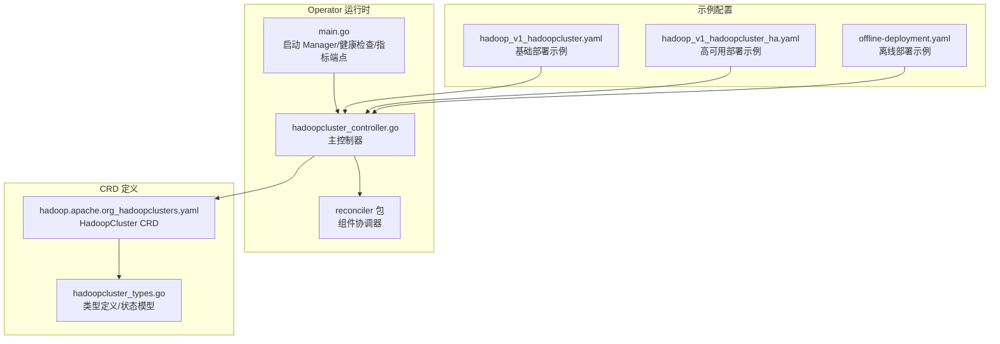
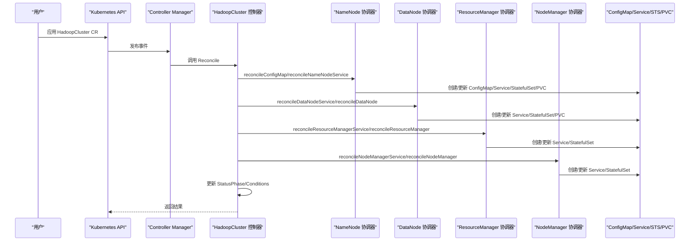
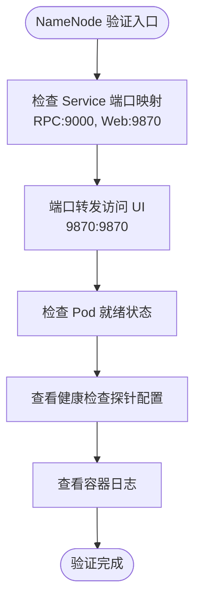
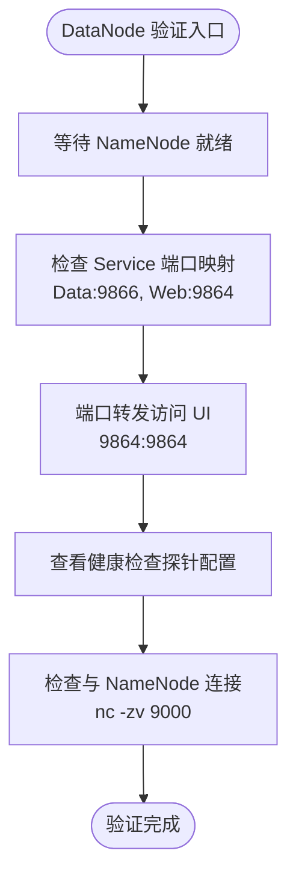
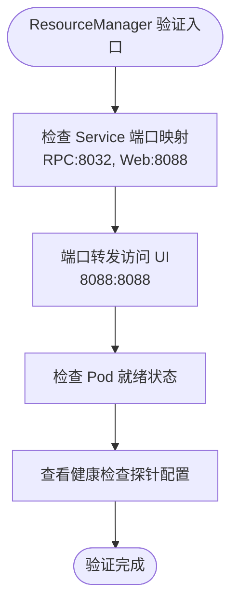
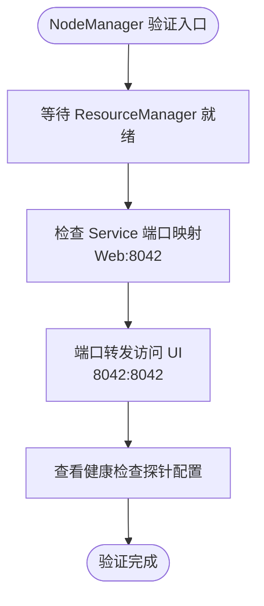
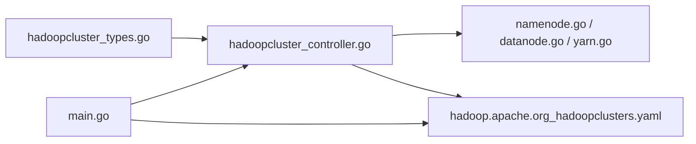

# 部署验证与测试

<cite>
**本文档引用的文件**
- [README.md](file://hadoop-operator/README.md)
- [main.go](file://hadoop-operator/cmd/main.go)
- [hadoopcluster_types.go](file://hadoop-operator/api/v1/hadoopcluster_types.go)
- [hadoopcluster_controller.go](file://hadoop-operator/internal/controller/hadoopcluster_controller.go)
- [namenode.go](file://hadoop-operator/internal/reconciler/namenode.go)
- [datanode.go](file://hadoop-operator/internal/reconciler/datanode.go)
- [yarn.go](file://hadoop-operator/internal/reconciler/yarn.go)
- [hadoop_v1_hadoopcluster.yaml](file://hadoop-operator/config/samples/hadoop_v1_hadoopcluster.yaml)
- [hadoop_v1_hadoopcluster_ha.yaml](file://hadoop-operator/config/samples/hadoop_v1_hadoopcluster_ha.yaml)
- [offline-deployment.yaml](file://hadoop-operator/config/samples/offline-deployment.yaml)
- [hadoop.apache.org_hadoopclusters.yaml](file://hadoop-operator/config/crd/bases/hadoop.apache.org_hadoopclusters.yaml)
</cite>

## 目录
1. [简介](#简介)
2. [项目结构](#项目结构)
3. [核心组件](#核心组件)
4. [架构概览](#架构概览)
5. [详细组件分析](#详细组件分析)
6. [依赖关系分析](#依赖关系分析)
7. [性能考虑](#性能考虑)
8. [故障排查指南](#故障排查指南)
9. [结论](#结论)
10. [附录](#附录)

## 简介
本文件提供 Hadoop Operator 和 Hadoop 集群的部署验证与测试指南。内容涵盖集群状态检查、Pod 运行状态验证、服务连通性测试、NameNode UI 和 ResourceManager UI 访问方法、健康检查命令、日志查看方法、性能监控验证，以及部署成功判断标准和故障排查基本步骤。

## 项目结构
该项目采用 Kubernetes Operator 模式，通过自定义资源 HadoopCluster 来声明式管理 Hadoop 集群。核心目录结构如下：
- api/v1：定义 HadoopCluster CRD 的 Go 类型和状态模型
- internal/controller：主控制器，负责协调 Hadoop 组件生命周期
- internal/reconciler：各组件协调器（NameNode、DataNode、ResourceManager、NodeManager）
- config/samples：示例配置文件（基础部署、高可用部署、离线部署）
- config/crd：CRD 定义
- cmd/main.go：Operator 入口，包含健康检查和指标端点配置

**图表来源**
- [main.go:54-149](file://hadoop-operator/cmd/main.go#L54-L149)
- [hadoopcluster_controller.go:41-239](file://hadoop-operator/internal/controller/hadoopcluster_controller.go#L41-L239)
- [hadoopcluster_types.go:24-418](file://hadoop-operator/api/v1/hadoopcluster_types.go#L24-L418)

**章节来源**
- [README.md:233-251](file://hadoop-operator/README.md#L233-L251)
- [main.go:54-149](file://hadoop-operator/cmd/main.go#L54-L149)
- [hadoopcluster_controller.go:41-239](file://hadoop-operator/internal/controller/hadoopcluster_controller.go#L41-L239)

## 核心组件
- HadoopCluster CRD：描述 Hadoop 集群的期望状态，包括镜像、HDFS、YARN、配置覆盖、安全和监控等字段
- 主控制器：监听 HadoopCluster 资源变更，按顺序协调各组件（ConfigMap、Service、StatefulSet/PVC）
- 组件协调器：分别为 NameNode、DataNode、ResourceManager、NodeManager 创建和更新对应的 Kubernetes 资源
- 状态模型：包含集群阶段（Phase）、条件（Conditions）和各组件就绪状态（ReadyReplicas/Replicas）

关键验证点：
- 集群阶段从 Pending -> Creating -> Running
- 各组件 ReadyReplicas > 0 且与总副本数匹配
- 通过 kubectl get hadoopcluster 查看 Phase 和 Age 列

**章节来源**
- [hadoopcluster_types.go:297-396](file://hadoop-operator/api/v1/hadoopcluster_types.go#L297-L396)
- [hadoopcluster_controller.go:169-174](file://hadoop-operator/internal/controller/hadoopcluster_controller.go#L169-L174)
- [hadoopcluster_controller.go:176-227](file://hadoop-operator/internal/controller/hadoopcluster_controller.go#L176-L227)

## 架构概览
Hadoop Operator 通过 Reconcile 循环持续对比期望状态与实际状态，并通过组件协调器创建/更新相关资源。健康检查和指标端点由 Manager 提供。

**图表来源**
- [hadoopcluster_controller.go:104-144](file://hadoop-operator/internal/controller/hadoopcluster_controller.go#L104-L144)
- [namenode.go:36-114](file://hadoop-operator/internal/reconciler/namenode.go#L36-L114)
- [datanode.go:35-113](file://hadoop-operator/internal/reconciler/datanode.go#L35-L113)
- [yarn.go:35-113](file://hadoop-operator/internal/reconciler/yarn.go#L35-L113)

## 详细组件分析

### NameNode 组件验证
NameNode 通过 Headless Service 和外部 Service 暴露 RPC 和 Web UI 端口。健康检查探针使用 HTTP GET /jmx。

验证步骤：
- 检查服务端口映射：RPC 9000、Web 9870
- 通过端口转发访问 UI：`kubectl port-forward svc/<cluster>-namenode-external 9870:9870`
- 查看 Pod 就绪状态：`kubectl get pods -l app=hadoop-namenode`
- 检查健康检查：`kubectl get pod <namenode-pod> -o jsonpath='{.spec.containers[0].livenessProbe}'`

**图表来源**
- [namenode.go:36-114](file://hadoop-operator/internal/reconciler/namenode.go#L36-L114)
- [namenode.go:235-254](file://hadoop-operator/internal/reconciler/namenode.go#L235-L254)

**章节来源**
- [namenode.go:36-114](file://hadoop-operator/internal/reconciler/namenode.go#L36-L114)
- [namenode.go:235-254](file://hadoop-operator/internal/reconciler/namenode.go#L235-L254)

### DataNode 组件验证
DataNode 通过 Headless Service 和外部 Service 暴露数据端口和 Web UI 端口。健康检查探针使用 HTTP GET "/"。

验证步骤：
- 检查服务端口映射：Data 9866、Web 9864
- 等待 NameNode 就绪后再启动 DataNode（InitContainer 中使用 nc 检测 9000 端口）
- 通过端口转发访问 UI：`kubectl port-forward svc/<cluster>-datanode-external 9864:9864`
- 检查 DataNode 是否连接到 NameNode：`nc -zv <namenode-service> 9000`

**图表来源**
- [datanode.go:184-191](file://hadoop-operator/internal/reconciler/datanode.go#L184-L191)
- [datanode.go:259-268](file://hadoop-operator/internal/reconciler/datanode.go#L259-L268)

**章节来源**
- [datanode.go:184-191](file://hadoop-operator/internal/reconciler/datanode.go#L184-L191)
- [datanode.go:259-268](file://hadoop-operator/internal/reconciler/datanode.go#L259-L268)

### ResourceManager 组件验证
ResourceManager 通过 Headless Service 和外部 Service 暴露 RPC 和 Web UI 端口。健康检查探针使用 HTTP GET /ws/v1/cluster/info。

验证步骤：
- 检查服务端口映射：RPC 8032、Web 8088
- 通过端口转发访问 UI：`kubectl port-forward svc/<cluster>-resourcemanager-external 8088:8088`
- 检查 Pod 就绪状态：`kubectl get pods -l app=hadoop-resourcemanager`
- 检查健康检查：`kubectl get pod <resourcemanager-pod> -o jsonpath='{.spec.containers[0].readinessProbe}'`

**图表来源**
- [yarn.go:35-113](file://hadoop-operator/internal/reconciler/yarn.go#L35-L113)
- [yarn.go:199-208](file://hadoop-operator/internal/reconciler/yarn.go#L199-L208)

**章节来源**
- [yarn.go:35-113](file://hadoop-operator/internal/reconciler/yarn.go#L35-L113)
- [yarn.go:199-208](file://hadoop-operator/internal/reconciler/yarn.go#L199-L208)

### NodeManager 组件验证
NodeManager 通过 Headless Service 和外部 Service 暴露 Web UI 端口。健康检查探针使用 HTTP GET /node。

验证步骤：
- 检查服务端口映射：Web 8042
- 等待 ResourceManager 就绪后再启动 NodeManager（InitContainer 中使用 nc 检测 8032 端口）
- 通过端口转发访问 UI：`kubectl port-forward svc/<cluster>-nodemanager-external 8042:8042`
- 检查健康检查：`kubectl get pod <nodemanager-pod> -o jsonpath='{.spec.containers[0].livenessProbe}'`

**图表来源**
- [yarn.go:367-374](file://hadoop-operator/internal/reconciler/yarn.go#L367-L374)
- [yarn.go:396-415](file://hadoop-operator/internal/reconciler/yarn.go#L396-L415)

**章节来源**
- [yarn.go:367-374](file://hadoop-operator/internal/reconciler/yarn.go#L367-L374)
- [yarn.go:396-415](file://hadoop-operator/internal/reconciler/yarn.go#L396-L415)

## 依赖关系分析
- 主控制器依赖 CRD 类型定义和各组件协调器
- 组件协调器依赖 Kubernetes API（Service、StatefulSet、PersistentVolumeClaim）
- Operator 运行时依赖 controller-runtime（Manager、Healthz/Readyz、Metrics）

**图表来源**
- [hadoopcluster_types.go:397-418](file://hadoop-operator/api/v1/hadoopcluster_types.go#L397-L418)
- [hadoopcluster_controller.go:125-132](file://hadoop-operator/internal/controller/hadoopcluster_controller.go#L125-L132)
- [main.go:97-119](file://hadoop-operator/cmd/main.go#L97-L119)

**章节来源**
- [hadoopcluster_controller.go:125-132](file://hadoop-operator/internal/controller/hadoopcluster_controller.go#L125-L132)
- [main.go:97-119](file://hadoop-operator/cmd/main.go#L97-L119)

## 性能考虑
- 资源请求/限制：各组件默认配置了 CPU 和内存请求/限制，可根据集群规模调整
- 存储配置：NameNode/DataNode 使用 PVC，建议选择合适的 StorageClass 和访问模式
- 亲和性与容忍度：可通过 Affinity/Tolerations 实现节点分布控制
- 监控：支持启用 Prometheus 指标导出和 ServiceMonitor

[本节为通用指导，无需特定文件来源]

## 故障排查指南

### 集群状态检查
- 查看 HadoopCluster 资源状态：`kubectl get hadoopcluster`
- 查看各组件就绪状态：`kubectl get pods -l hadoop.apache.org/cluster=<cluster-name>`
- 查看 Operator 日志：`kubectl logs deployment/<operator-deployment> -c manager`

### Pod 启动失败
- 查看 Pod 事件：`kubectl describe pod <pod-name>`
- 查看上一次容器日志：`kubectl logs <pod-name> --previous`
- 检查镜像拉取：确认镜像仓库可达、PullSecret 正确

### NameNode 格式化失败
- 检查 PVC 状态：`kubectl get pvc`
- 手动格式化（谨慎操作）：`kubectl exec -it <namenode-pod> -- hdfs namenode -format -force`

### DataNode 无法连接到 NameNode
- 检查网络连通性：`kubectl exec -it <datanode-pod> -- nc -zv <namenode-service> 9000`
- 检查配置：`kubectl get configmap <cluster-name>-config -o yaml`

### 镜像拉取失败
- 检查镜像是否存在：`docker pull <image>`
- 检查 Secret 配置：`kubectl get secret regcred -o yaml`

**章节来源**
- [README.md:276-318](file://hadoop-operator/README.md#L276-L318)

## 结论
通过本文档提供的验证流程和故障排查步骤，可以系统地确认 Hadoop Operator 和 Hadoop 集群的部署状态。建议在生产环境中结合监控指标进行持续验证，并根据实际负载调整资源配置。

[本节为总结，无需特定文件来源]

## 附录

### 部署验证清单
- [ ] 集群阶段：HadoopCluster Phase 显示为 Running
- [ ] NameNode：ReadyReplicas > 0，UI 可访问
- [ ] DataNode：ReadyReplicas > 0，与 NameNode 连通
- [ ] ResourceManager：ReadyReplicas > 0，UI 可访问
- [ ] NodeManager：ReadyReplicas > 0，与 ResourceManager 连通
- [ ] 健康检查：各组件 Liveness/Readiness 探针正常
- [ ] 日志：无关键错误日志
- [ ] 监控：Prometheus 指标可抓取

### 常用命令参考
- 验证集群状态：`kubectl get hadoopcluster`
- 查看 Pod：`kubectl get pods -l hadoop.apache.org/cluster=<cluster-name>`
- NameNode UI：`kubectl port-forward svc/<cluster>-namenode-external 9870:9870`
- ResourceManager UI：`kubectl port-forward svc/<cluster>-resourcemanager-external 8088:8088`
- 查看事件：`kubectl describe pod <pod-name>`
- 查看日志：`kubectl logs <pod-name> --previous`

**章节来源**
- [README.md:66-82](file://hadoop-operator/README.md#L66-L82)