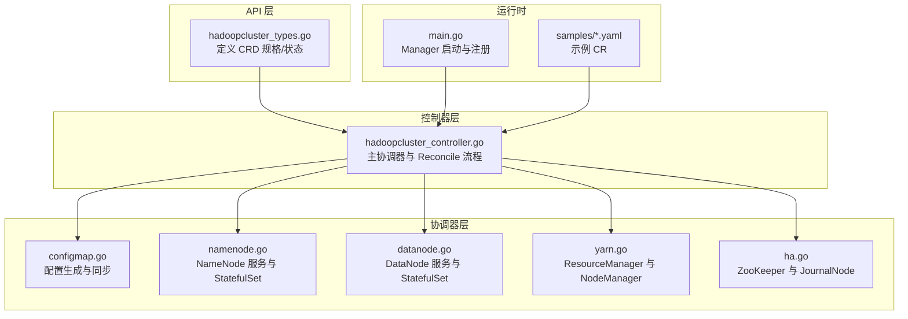
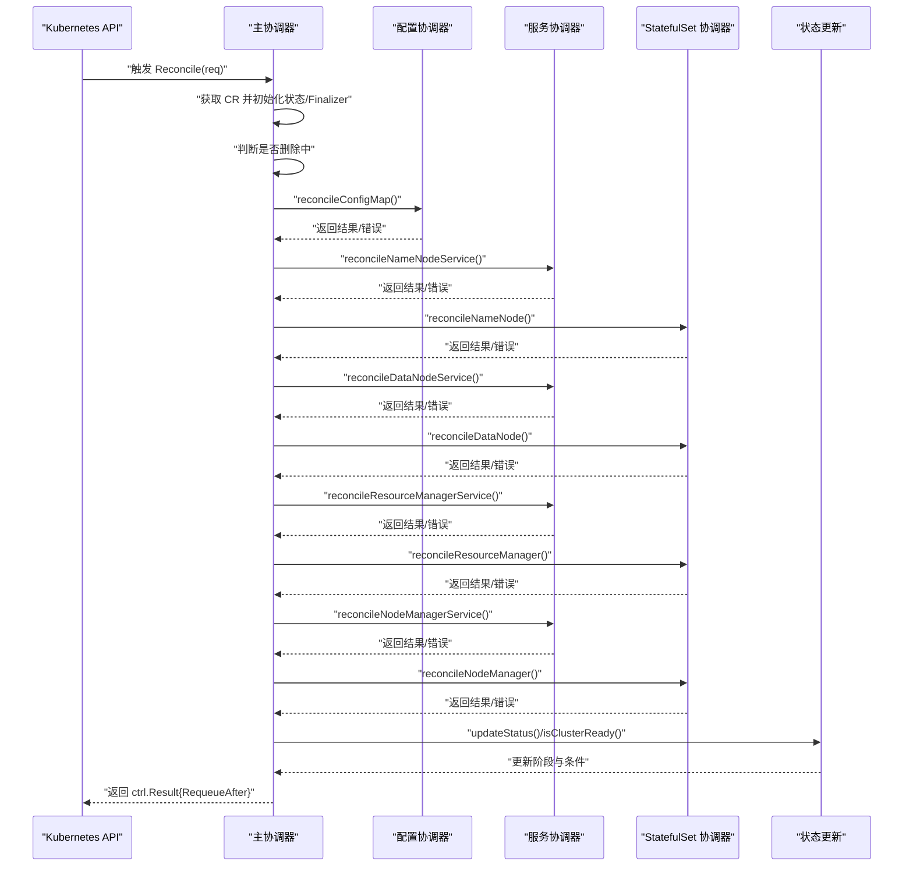
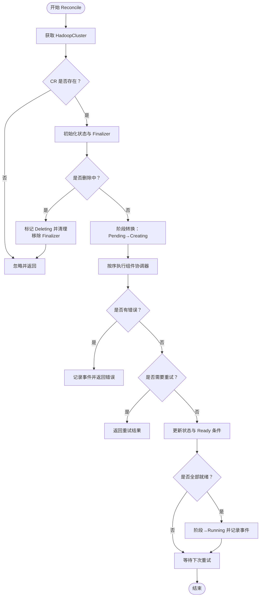
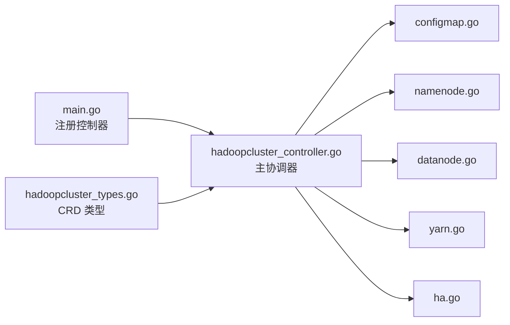

# Reconciler 模式架构

<cite>
**本文档引用的文件**
- [hadoop-operator/internal/controller/hadoopcluster_controller.go](file://hadoop-operator/internal/controller/hadoopcluster_controller.go)
- [hadoop-operator/internal/reconciler/configmap.go](file://hadoop-operator/internal/reconciler/configmap.go)
- [hadoop-operator/internal/reconciler/namenode.go](file://hadoop-operator/internal/reconciler/namenode.go)
- [hadoop-operator/internal/reconciler/datanode.go](file://hadoop-operator/internal/reconciler/datanode.go)
- [hadoop-operator/internal/reconciler/yarn.go](file://hadoop-operator/internal/reconciler/yarn.go)
- [hadoop-operator/internal/reconciler/ha.go](file://hadoop-operator/internal/reconciler/ha.go)
- [hadoop-operator/api/v1/hadoopcluster_types.go](file://hadoop-operator/api/v1/hadoopcluster_types.go)
- [hadoop-operator/cmd/main.go](file://hadoop-operator/cmd/main.go)
- [hadoop-operator/config/samples/hadoop_v1_hadoopcluster.yaml](file://hadoop-operator/config/samples/hadoop_v1_hadoopcluster.yaml)
- [hadoop-operator/config/samples/hadoop_v1_hadoopcluster_ha.yaml](file://hadoop-operator/config/samples/hadoop_v1_hadoopcluster_ha.yaml)
</cite>

## 目录
1. [简介](#简介)
2. [项目结构](#项目结构)
3. [核心组件](#核心组件)
4. [架构总览](#架构总览)
5. [详细组件分析](#详细组件分析)
6. [依赖分析](#依赖分析)
7. [性能考虑](#性能考虑)
8. [故障排查指南](#故障排查指南)
9. [结论](#结论)
10. [附录](#附录)

## 简介
本文件系统化阐述 Apache Hadoop Operator v3 的 Reconciler 模式架构，重点围绕 ComponentReconciler 接口的设计理念与实现方式，解释组件协调器的执行顺序、状态检查与资源创建逻辑，以及 Reconcile 方法的返回值处理、重试策略与幂等性保障。同时提供通用协调器开发模式、错误处理机制与状态更新流程，并给出自定义协调器开发指南与最佳实践，帮助读者快速理解并扩展该控制器体系。

## 项目结构
该项目采用基于功能模块的分层组织方式：
- api/v1：定义 HadoopCluster CRD 及其规格、状态模型
- internal/controller：控制器入口与主协调器
- internal/reconciler：按组件拆分的协调器实现（ConfigMap、NameNode、DataNode、YARN、HA）
- config/samples：示例 CR 定义（单活与高可用）
- cmd/main.go：控制器管理器启动入口

图表来源
- [hadoop-operator/internal/controller/hadoopcluster_controller.go:104-126](file://hadoop-operator/internal/controller/hadoopcluster_controller.go#L104-L126)
- [hadoop-operator/internal/reconciler/configmap.go:44-68](file://hadoop-operator/internal/reconciler/configmap.go#L44-L68)
- [hadoop-operator/internal/reconciler/namenode.go:36-114](file://hadoop-operator/internal/reconciler/namenode.go#L36-L114)
- [hadoop-operator/internal/reconciler/datanode.go:35-113](file://hadoop-operator/internal/reconciler/datanode.go#L35-L113)
- [hadoop-operator/internal/reconciler/yarn.go:35-113](file://hadoop-operator/internal/reconciler/yarn.go#L35-L113)
- [hadoop-operator/internal/reconciler/ha.go:35-177](file://hadoop-operator/internal/reconciler/ha.go#L35-L177)
- [hadoop-operator/cmd/main.go:125-132](file://hadoop-operator/cmd/main.go#L125-L132)

章节来源
- [hadoop-operator/internal/controller/hadoopcluster_controller.go:104-145](file://hadoop-operator/internal/controller/hadoopcluster_controller.go#L104-L145)
- [hadoop-operator/cmd/main.go:125-132](file://hadoop-operator/cmd/main.go#L125-L132)

## 核心组件
- 主协调器 HadoopClusterReconciler：负责拉取 CR、设置初始状态、添加 Finalizer、处理删除、按序调用各组件协调器、更新状态与阶段、周期性重试
- 组件协调器 ComponentReconciler：函数类型，接收上下文与集群对象，返回结果与错误；每个组件一个协调器方法
- CRD 类型与状态：HadoopClusterSpec/HadoopClusterStatus 定义了 HDFS/YARN 配置、资源请求/限制、存储、服务类型、条件与各组件状态字段

章节来源
- [hadoop-operator/internal/controller/hadoopcluster_controller.go:42-46](file://hadoop-operator/internal/controller/hadoopcluster_controller.go#L42-L46)
- [hadoop-operator/internal/reconciler/configmap.go:40-41](file://hadoop-operator/internal/reconciler/configmap.go#L40-L41)
- [hadoop-operator/api/v1/hadoopcluster_types.go:297-315](file://hadoop-operator/api/v1/hadoopcluster_types.go#L297-L315)

## 架构总览
Reconciler 模式以“期望状态 vs 实际状态”的对比为核心，通过一系列幂等的协调器方法逐步推进到目标状态。主协调器在每次 Reconcile 中：
- 获取并校验 CR
- 初始化状态与 Finalizer
- 处理删除路径
- 依次调用组件协调器（严格顺序）
- 更新状态与阶段
- 返回周期性重试

图表来源
- [hadoop-operator/internal/controller/hadoopcluster_controller.go:104-145](file://hadoop-operator/internal/controller/hadoopcluster_controller.go#L104-L145)
- [hadoop-operator/internal/reconciler/configmap.go:44-68](file://hadoop-operator/internal/reconciler/configmap.go#L44-L68)
- [hadoop-operator/internal/reconciler/namenode.go:36-114](file://hadoop-operator/internal/reconciler/namenode.go#L36-L114)
- [hadoop-operator/internal/reconciler/datanode.go:35-113](file://hadoop-operator/internal/reconciler/datanode.go#L35-L113)
- [hadoop-operator/internal/reconciler/yarn.go:35-113](file://hadoop-operator/internal/reconciler/yarn.go#L35-L113)

## 详细组件分析

### 主协调器与 Reconcile 执行流
- 资源获取与错误处理：若 CR 不存在则忽略；获取失败则返回错误
- 初始状态与 Finalizer：首次创建时设置 Phase 为 Pending，随后更新为 Creating；添加 Finalizer 用于清理
- 删除路径：标记 Deleting 并移除 Finalizer
- 组件协调器顺序：严格按 ConfigMap → NameNode 服务/STS → DataNode 服务/STS → ResourceManager 服务/STS → NodeManager 服务/STS 顺序执行
- 错误与重试：任一协调器返回错误即记录事件并返回；若任一协调器要求重试（Requeue 或 RequeueAfter），立即返回
- 状态更新：更新各组件 ReadyReplicas、构建 Ready 条件；当所有组件就绪时进入 Running 阶段
- 周期性重试：默认每 30 秒一次轮询检查

图表来源
- [hadoop-operator/internal/controller/hadoopcluster_controller.go:60-145](file://hadoop-operator/internal/controller/hadoopcluster_controller.go#L60-L145)

章节来源
- [hadoop-operator/internal/controller/hadoopcluster_controller.go:60-145](file://hadoop-operator/internal/controller/hadoopcluster_controller.go#L60-L145)

### ComponentReconciler 接口设计与实现
- 接口定义：ComponentReconciler 是一个函数类型，签名统一为 (ctx, cluster) → (ctrl.Result, error)，便于在主协调器中以切片顺序迭代调用
- 设计理念：
  - 幂等性：每个协调器内部使用 CreateOrUpdate 与 SetControllerReference，确保多次执行不会产生副作用
  - 顺序性：通过主协调器的顺序列表控制组件创建顺序，避免依赖未满足导致的失败
  - 可组合性：每个组件独立封装，便于扩展新组件或替换现有组件
- 实现要点：
  - 使用 controllerutil.CreateOrUpdate 将期望配置与实际资源对齐
  - 设置 OwnerReference，使资源随 CR 生命周期自动回收
  - 通过 Probe/Liveness/Readiness 等健康检查保障组件可用性
  - 通过 ConfigMap 注入 Hadoop 配置，支持用户覆盖

章节来源
- [hadoop-operator/internal/reconciler/configmap.go:40-41](file://hadoop-operator/internal/reconciler/configmap.go#L40-L41)
- [hadoop-operator/internal/reconciler/namenode.go:165-310](file://hadoop-operator/internal/reconciler/namenode.go#L165-L310)
- [hadoop-operator/internal/reconciler/datanode.go:161-314](file://hadoop-operator/internal/reconciler/datanode.go#L161-L314)
- [hadoop-operator/internal/reconciler/yarn.go:152-233](file://hadoop-operator/internal/reconciler/yarn.go#L152-L233)

### 配置协调器（ConfigMap）
- 功能：生成 Hadoop 核心配置（core-site.xml、hdfs-site.xml、yarn-site.xml、mapred-site.xml、capacity-scheduler.xml），并注入 ZooKeeper 信息（内部或外部）
- 关键点：
  - 生成 XML 内容并写入 ConfigMap.Data
  - 支持用户覆盖（CoreSite/HDFSSite/YARNSite/MapredSite/CapacityScheduler）
  - 选择内部 ZooKeeper 或外部连接串
  - 设置 OwnerReference，随 CR 自动回收

章节来源
- [hadoop-operator/internal/reconciler/configmap.go:44-68](file://hadoop-operator/internal/reconciler/configmap.go#L44-L68)
- [hadoop-operator/internal/reconciler/configmap.go:70-209](file://hadoop-operator/internal/reconciler/configmap.go#L70-L209)
- [hadoop-operator/internal/reconciler/configmap.go:224-245](file://hadoop-operator/internal/reconciler/configmap.go#L224-L245)

### NameNode 协调器（服务与 StatefulSet）
- 服务：Headless 服务用于稳定网络标识；外部服务（NodePort/LoadBalancer）暴露 RPC/Web 端口
- StatefulSet：根据 HA 开关决定副本数（至少 2），挂载 PVC、配置 InitContainer 与容器启动脚本，设置探针
- HA 支持：当启用 HA 时，NameNode 启动脚本与初始化脚本不同，JournalNode 与 ZooKeeper 由 HA 协调器提供

章节来源
- [hadoop-operator/internal/reconciler/namenode.go:36-114](file://hadoop-operator/internal/reconciler/namenode.go#L36-L114)
- [hadoop-operator/internal/reconciler/namenode.go:117-317](file://hadoop-operator/internal/reconciler/namenode.go#L117-L317)

### DataNode 协调器（服务与 StatefulSet）
- 服务：Headless 服务与外部服务
- StatefulSet：等待 NameNode 就绪后再启动，InitContainer 设置权限与数据目录，容器启动 HDFS DataNode
- 存储：PVC 按需创建，支持 StorageClassName 与访问模式

章节来源
- [hadoop-operator/internal/reconciler/datanode.go:35-113](file://hadoop-operator/internal/reconciler/datanode.go#L35-L113)
- [hadoop-operator/internal/reconciler/datanode.go:116-321](file://hadoop-operator/internal/reconciler/datanode.go#L116-L321)

### YARN 协调器（ResourceManager 与 NodeManager）
- 服务：Headless 与外部服务，暴露 RPC/Web 端口
- StatefulSet：ResourceManager/NodeManager 分别创建，NodeManager 会等待 ResourceManager 就绪
- 探针：HTTPGet 探针检测 Web 端口，确保组件可用

章节来源
- [hadoop-operator/internal/reconciler/yarn.go:35-113](file://hadoop-operator/internal/reconciler/yarn.go#L35-L113)
- [hadoop-operator/internal/reconciler/yarn.go:116-240](file://hadoop-operator/internal/reconciler/yarn.go#L116-L240)
- [hadoop-operator/internal/reconciler/yarn.go:243-310](file://hadoop-operator/internal/reconciler/yarn.go#L243-L310)
- [hadoop-operator/internal/reconciler/yarn.go:313-447](file://hadoop-operator/internal/reconciler/yarn.go#L313-L447)

### HA 协调器（ZooKeeper 与 JournalNode）
- ZooKeeper：当未配置外部连接串时，部署内部 ZooKeeper（3 节点），提供客户端/成员/选举端口
- JournalNode：仅在 NameNode HA 启用时创建，至少 3 个副本构成仲裁
- 服务器列表：根据集群名动态生成 ZooKeeper 服务器列表

章节来源
- [hadoop-operator/internal/reconciler/ha.go:35-177](file://hadoop-operator/internal/reconciler/ha.go#L35-L177)
- [hadoop-operator/internal/reconciler/ha.go:180-363](file://hadoop-operator/internal/reconciler/ha.go#L180-L363)
- [hadoop-operator/internal/reconciler/ha.go:383-393](file://hadoop-operator/internal/reconciler/ha.go#L383-L393)

### 状态更新与 Ready 判定
- 状态更新：从各组件 StatefulSet 读取副本数与就绪副本数，填充 CR 状态
- Ready 条件：当 NameNode/DataNode/ResourceManager/NodeManager 均有就绪副本时，条件置为 True
- 阶段推进：Pending→Creating→Running，记录事件并持久化

章节来源
- [hadoop-operator/internal/controller/hadoopcluster_controller.go:176-227](file://hadoop-operator/internal/controller/hadoopcluster_controller.go#L176-L227)
- [hadoop-operator/internal/controller/hadoopcluster_controller.go:169-174](file://hadoop-operator/internal/controller/hadoopcluster_controller.go#L169-L174)

## 依赖分析
- 控制器与协调器：主协调器持有 client、scheme、event recorder，协调器方法作为闭包绑定到主协调器实例
- CRD 与状态：HadoopClusterSpec/Status 定义了组件规格与状态字段，供协调器读取与更新
- 运行时：main.go 注册控制器并启动 Manager，控制器通过 Owns/For 指定对 CR 与所拥有的资源的监听

图表来源
- [hadoop-operator/cmd/main.go:125-132](file://hadoop-operator/cmd/main.go#L125-L132)
- [hadoop-operator/internal/controller/hadoopcluster_controller.go:230-238](file://hadoop-operator/internal/controller/hadoopcluster_controller.go#L230-L238)
- [hadoop-operator/api/v1/hadoopcluster_types.go:297-315](file://hadoop-operator/api/v1/hadoopcluster_types.go#L297-L315)

章节来源
- [hadoop-operator/cmd/main.go:125-132](file://hadoop-operator/cmd/main.go#L125-L132)
- [hadoop-operator/internal/controller/hadoopcluster_controller.go:230-238](file://hadoop-operator/internal/controller/hadoopcluster_controller.go#L230-L238)

## 性能考虑
- 重试策略：主协调器默认每 30 秒重试一次，避免频繁轮询造成 API 压力；组件协调器可在特定条件下返回 Requeue/RequeueAfter 提前退出
- 幂等性：所有资源创建均使用 CreateOrUpdate，减少重复操作
- 顺序依赖：严格的组件顺序可降低因依赖缺失导致的失败重试次数
- 健康检查：合理的 Liveness/Readiness 探针可加速故障发现与恢复

## 故障排查指南
- 常见问题定位
  - CR 不存在：Reconcile 会忽略并返回，确认 CR 是否正确安装与命名空间
  - 获取 CR 失败：检查 RBAC 权限与 API 可达性
  - 协调器错误：查看事件记录与日志，逐个组件排查（服务/STS/PVC/ConfigMap）
  - 重试未生效：确认组件协调器是否正确返回 Requeue/RequeueAfter
- 建议步骤
  - 查看 CR 状态与阶段，确认 Ready 条件
  - 检查各组件 StatefulSet 的就绪副本数
  - 查看对应 Pod 的事件与日志
  - 对照示例 CR（单活/高可用）核对配置

章节来源
- [hadoop-operator/internal/controller/hadoopcluster_controller.go:60-145](file://hadoop-operator/internal/controller/hadoopcluster_controller.go#L60-L145)
- [hadoop-operator/config/samples/hadoop_v1_hadoopcluster.yaml:1-80](file://hadoop-operator/config/samples/hadoop_v1_hadoopcluster.yaml#L1-L80)
- [hadoop-operator/config/samples/hadoop_v1_hadoopcluster_ha.yaml:1-107](file://hadoop-operator/config/samples/hadoop_v1_hadoopcluster_ha.yaml#L1-L107)

## 结论
该 Reconciler 架构以主协调器为中心，通过 ComponentReconciler 函数类型的统一接口，实现了对 Hadoop 组件的有序、幂等、可观测的生命周期管理。严格的执行顺序、完善的错误处理与状态更新机制，使得控制器能够在复杂拓扑（含 HA）下保持一致性与稳定性。遵循本文档的通用模式与最佳实践，可高效扩展新的组件协调器并维护系统的长期可维护性。

## 附录

### Reconcile 返回值与重试策略
- 返回 ctrl.Result{RequeueAfter}：默认每 30 秒重试
- 返回 Requeue/RequeueAfter：提前退出当前轮次，等待后续触发
- 返回错误：记录事件并立即终止当前轮次，等待下一次触发

章节来源
- [hadoop-operator/internal/controller/hadoopcluster_controller.go:144-145](file://hadoop-operator/internal/controller/hadoopcluster_controller.go#L144-L145)

### 幂等性保障
- 使用 controllerutil.CreateOrUpdate 对资源进行对齐
- 设置 OwnerReference，确保资源随 CR 生命周期回收
- 统一的标签与选择器，避免跨组件冲突

章节来源
- [hadoop-operator/internal/reconciler/configmap.go:58-61](file://hadoop-operator/internal/reconciler/configmap.go#L58-L61)
- [hadoop-operator/internal/reconciler/namenode.go:165-310](file://hadoop-operator/internal/reconciler/namenode.go#L165-L310)
- [hadoop-operator/internal/reconciler/datanode.go:161-314](file://hadoop-operator/internal/reconciler/datanode.go#L161-L314)
- [hadoop-operator/internal/reconciler/yarn.go:152-233](file://hadoop-operator/internal/reconciler/yarn.go#L152-L233)

### 自定义协调器开发指南与最佳实践
- 新增组件协调器
  - 在 internal/reconciler 下新增文件，实现函数签名 (ctx, cluster) → (ctrl.Result, error)
  - 使用 controllerutil.CreateOrUpdate 创建/更新资源
  - 设置 OwnerReference，确保资源被 CR 管理
  - 在主协调器的顺序列表中加入新协调器
- 最佳实践
  - 保持幂等：多次执行不产生副作用
  - 明确错误语义：区分可重试与不可重试错误
  - 合理设置探针：提升故障发现速度
  - 用户覆盖优先：允许通过 CRSpec 覆盖默认行为
  - 顺序与依赖：将依赖前置的组件放在前面

章节来源
- [hadoop-operator/internal/reconciler/configmap.go:40-41](file://hadoop-operator/internal/reconciler/configmap.go#L40-L41)
- [hadoop-operator/internal/controller/hadoopcluster_controller.go:104-126](file://hadoop-operator/internal/controller/hadoopcluster_controller.go#L104-L126)