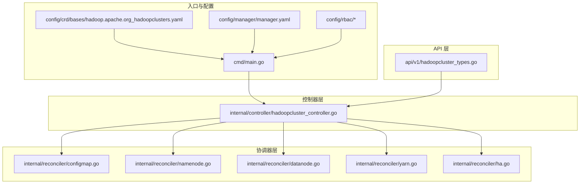
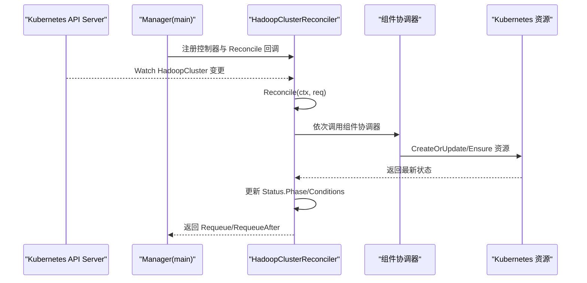
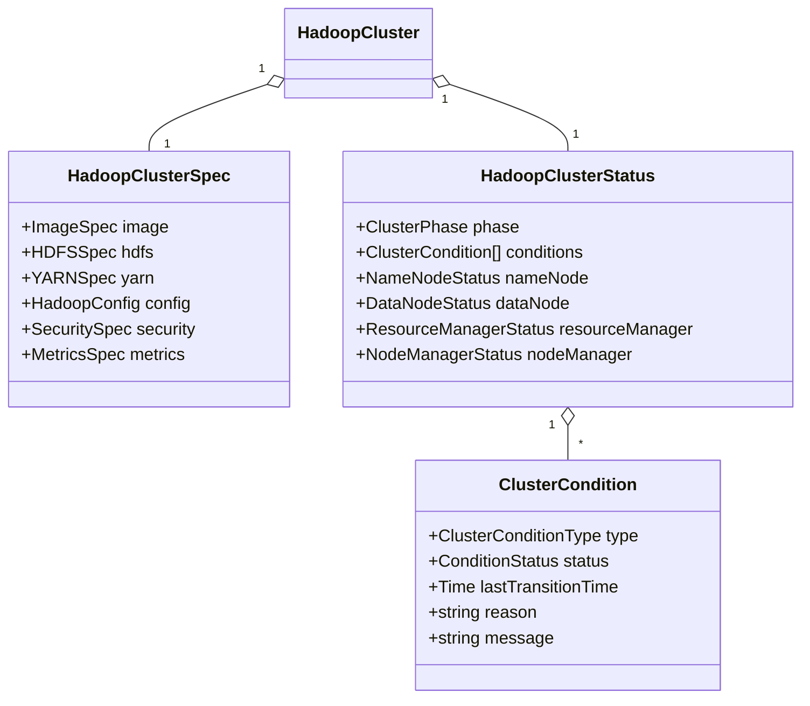
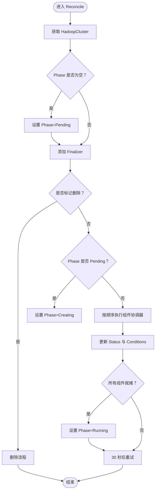
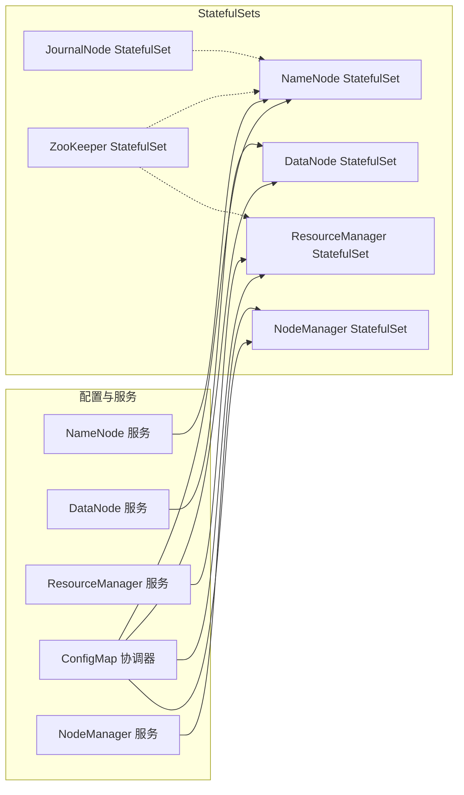
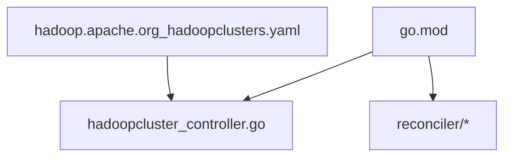

# 代码架构设计

<cite>
**本文档引用的文件**
- [main.go](file://hadoop-operator/cmd/main.go)
- [hadoopcluster_types.go](file://hadoop-operator/api/v1/hadoopcluster_types.go)
- [hadoopcluster_controller.go](file://hadoop-operator/internal/controller/hadoopcluster_controller.go)
- [configmap.go](file://hadoop-operator/internal/reconciler/configmap.go)
- [namenode.go](file://hadoop-operator/internal/reconciler/namenode.go)
- [datanode.go](file://hadoop-operator/internal/reconciler/datanode.go)
- [yarn.go](file://hadoop-operator/internal/reconciler/yarn.go)
- [ha.go](file://hadoop-operator/internal/reconciler/ha.go)
- [go.mod](file://hadoop-operator/go.mod)
- [README.md](file://hadoop-operator/README.md)
- [hadoop.apache.org_hadoopclusters.yaml](file://hadoop-operator/config/crd/bases/hadoop.apache.org_hadoopclusters.yaml)
</cite>

## 目录
1. [引言](#引言)
2. [项目结构](#项目结构)
3. [核心组件](#核心组件)
4. [架构总览](#架构总览)
5. [详细组件分析](#详细组件分析)
6. [依赖分析](#依赖分析)
7. [性能考虑](#性能考虑)
8. [故障排查指南](#故障排查指南)
9. [结论](#结论)
10. [附录](#附录)

## 引言
本文件面向 Apache Hadoop Operator v3 的代码架构设计，系统性阐述控制器架构模式、Reconciler 模式的工作原理与机制；深入解析 HadoopCluster CRD 的数据模型、状态管理与条件处理；详解组件协调器（NameNode、DataNode、ResourceManager 等）的设计与协调逻辑；并提供架构图与组件交互流程图，说明错误处理机制、重试策略与并发控制；最后给出扩展点设计、插件化架构与自定义组件开发指南，帮助读者快速理解并扩展该 Operator。

## 项目结构
该项目采用标准的 Kubebuilder 项目布局，核心目录与职责如下：
- hadoop-operator/cmd/main.go：Operator 入口，初始化 Manager、注册控制器与 Webhook、健康检查等。
- hadoop-operator/api/v1/hadoopcluster_types.go：HadoopCluster CRD 的 Go 类型定义与状态模型。
- hadoop-operator/internal/controller/hadoopcluster_controller.go：主控制器，负责 HadoopCluster 资源的 Reconcile 循环与生命周期管理。
- hadoop-operator/internal/reconciler/*：组件协调器，按顺序协调 ConfigMap、服务、StatefulSet 等资源。
- hadoop-operator/config/crd/bases/hadoop.apache.org_hadoopclusters.yaml：CRD 定义文件。
- hadoop-operator/config/manager/manager.yaml、config/rbac/*：部署与权限配置。
- hadoop-operator/go.mod：依赖声明。
- hadoop-operator/README.md：功能说明与使用指南。

**图表来源**
- [main.go:54-149](file://hadoop-operator/cmd/main.go#L54-L149)
- [hadoopcluster_controller.go:230-238](file://hadoop-operator/internal/controller/hadoopcluster_controller.go#L230-L238)
- [hadoopcluster_types.go:397-413](file://hadoop-operator/api/v1/hadoopcluster_types.go#L397-L413)

**章节来源**
- [main.go:19-52](file://hadoop-operator/cmd/main.go#L19-L52)
- [README.md:233-251](file://hadoop-operator/README.md#L233-L251)

## 核心组件
- HadoopCluster CRD：描述 HDFS/YARN 组件的期望状态，包含镜像、存储、服务、安全、监控等配置，以及各组件的状态字段与条件。
- 主控制器 HadoopClusterReconciler：实现 Reconcile 循环，负责创建/更新/删除资源，并维护 CR 的 Phase 与 Conditions。
- 组件协调器：按顺序协调 ConfigMap、服务、StatefulSet 等资源，分别处理 NameNode、DataNode、ResourceManager、NodeManager 与 HA 组件。

**章节来源**
- [hadoopcluster_types.go:24-46](file://hadoop-operator/api/v1/hadoopcluster_types.go#L24-L46)
- [hadoopcluster_controller.go:42-46](file://hadoop-operator/internal/controller/hadoopcluster_controller.go#L42-L46)
- [configmap.go:44-68](file://hadoop-operator/internal/reconciler/configmap.go#L44-L68)

## 架构总览
该 Operator 采用经典的 Kubebuilder 控制器架构，结合 Reconciler 模式，以“期望状态”驱动“实际状态”的收敛过程。主控制器负责整体编排，组件协调器负责具体资源的创建与更新，最终形成完整的 HDFS/YARN 集群。

**图表来源**
- [main.go:125-132](file://hadoop-operator/cmd/main.go#L125-L132)
- [hadoopcluster_controller.go:60-145](file://hadoop-operator/internal/controller/hadoopcluster_controller.go#L60-L145)
- [hadoopcluster_controller.go:176-227](file://hadoop-operator/internal/controller/hadoopcluster_controller.go#L176-L227)

## 详细组件分析

### HadoopCluster CRD 数据模型与状态管理
- 规范（Spec）：包含镜像、HDFS（NameNode/DataNode）、YARN（ResourceManager/NodeManager）、配置覆盖、安全、监控等字段。
- 状态（Status）：包含 Phase（阶段）、Conditions（条件）、各组件的 Ready/Total 副本数等。
- 条件（Conditions）：Ready/Progressing/Degraded 三类条件，配合 LastTransitionTime、Reason、Message 实现状态机。

**图表来源**
- [hadoopcluster_types.go:24-46](file://hadoop-operator/api/v1/hadoopcluster_types.go#L24-L46)
- [hadoopcluster_types.go:297-315](file://hadoopOperator/api/v1/hadoopcluster_types.go#L297-L315)
- [hadoopcluster_types.go:329-345](file://hadoop-operator/api/v1/hadoopcluster_types.go#L329-L345)

**章节来源**
- [hadoopcluster_types.go:297-345](file://hadoop-operator/api/v1/hadoopcluster_types.go#L297-L345)

### Reconciler 模式与主控制器
- Reconcile 循环：主控制器在每次回调中获取 CR，设置初始 Phase，添加 Finalizer，处理删除流程，然后按顺序调用组件协调器。
- 组件协调器顺序：ConfigMap -> NameNode Service -> NameNode -> DataNode Service -> DataNode -> ResourceManager Service -> ResourceManager -> NodeManager Service -> NodeManager。
- 状态更新：从各组件的 StatefulSet 获取副本数与就绪数，更新 CR 的 Status 并设置 Ready 条件。
- 并发控制：通过 Requeue/RequeueAfter 控制下次轮询间隔，避免频繁轮询造成压力。

**图表来源**
- [hadoopcluster_controller.go:60-145](file://hadoop-operator/internal/controller/hadoopcluster_controller.go#L60-L145)
- [hadoopcluster_controller.go:176-227](file://hadoop-operator/internal/controller/hadoopcluster_controller.go#L176-L227)

**章节来源**
- [hadoopcluster_controller.go:60-145](file://hadoop-operator/internal/controller/hadoopcluster_controller.go#L60-L145)
- [hadoopcluster_controller.go:176-227](file://hadoop-operator/internal/controller/hadoopcluster_controller.go#L176-L227)

### 组件协调器设计与实现
- ConfigMap 协调器：生成 Hadoop 配置（core-site、hdfs-site、yarn-site、mapred-site、capacity-scheduler），支持用户覆盖，注入到各组件容器。
- NameNode 协调器：创建 Headless 与外部 Service，创建 StatefulSet（支持 HA 与 JournalNode），配置 InitContainer、探针与持久卷。
- DataNode 协调器：等待 NameNode 就绪后再启动，配置 InitContainer 初始化权限与目录，创建 Headless 与外部 Service，创建 StatefulSet。
- ResourceManager/NodeManager 协调器：创建 Headless 与外部 Service，创建 StatefulSet，配置探针与持久卷。
- HA 协调器：根据配置决定是否使用外部 ZooKeeper 或内部 ZooKeeper 与 JournalNode，创建对应服务与 StatefulSet。

**图表来源**
- [configmap.go:44-68](file://hadoop-operator/internal/reconciler/configmap.go#L44-L68)
- [namenode.go:36-114](file://hadoop-operator/internal/reconciler/namenode.go#L36-L114)
- [namenode.go:117-317](file://hadoop-operator/internal/reconciler/namenode.go#L117-L317)
- [datanode.go:35-113](file://hadoop-operator/internal/reconciler/datanode.go#L35-L113)
- [datanode.go:116-321](file://hadoop-operator/internal/reconciler/datanode.go#L116-L321)
- [yarn.go:35-113](file://hadoop-operator/internal/reconciler/yarn.go#L35-L113)
- [yarn.go:116-240](file://hadoop-operator/internal/reconciler/yarn.go#L116-L240)
- [yarn.go:243-310](file://hadoop-operator/internal/reconciler/yarn.go#L243-L310)
- [yarn.go:313-447](file://hadoop-operator/internal/reconciler/yarn.go#L313-L447)
- [ha.go:35-177](file://hadoop-operator/internal/reconciler/ha.go#L35-L177)
- [ha.go:180-363](file://hadoop-operator/internal/reconciler/ha.go#L180-L363)

**章节来源**
- [configmap.go:70-209](file://hadoop-operator/internal/reconciler/configmap.go#L70-L209)
- [namenode.go:117-317](file://hadoop-operator/internal/reconciler/namenode.go#L117-L317)
- [datanode.go:116-321](file://hadoop-operator/internal/reconciler/datanode.go#L116-L321)
- [yarn.go:116-447](file://hadoop-operator/internal/reconciler/yarn.go#L116-L447)
- [ha.go:35-363](file://hadoop-operator/internal/reconciler/ha.go#L35-L363)

### 错误处理机制、重试策略与并发控制
- 错误处理：Reconcile 中对获取 CR 失败、创建资源失败进行错误返回；记录 Warning 事件；必要时立即返回错误终止当前循环。
- 重试策略：组件协调器返回 Requeue/RequeueAfter 控制下次轮询；主控制器默认每 30 秒重试一次；组件内部通过探针与 InitContainer 等手段等待依赖就绪。
- 并发控制：通过 Requeue/RequeueAfter 控制轮询频率；通过 Finalizer 确保删除流程有序；通过 OwnerReference 将子资源托管给控制器。

**章节来源**
- [hadoopcluster_controller.go:60-145](file://hadoop-operator/internal/controller/hadoopcluster_controller.go#L60-L145)
- [hadoopcluster_controller.go:176-227](file://hadoop-operator/internal/controller/hadoopcluster_controller.go#L176-L227)

### 扩展点设计、插件化架构与自定义组件开发
- 扩展点：组件协调器以函数类型 ComponentReconciler 暴露，可在主控制器中插入新的协调器或替换现有顺序。
- 插件化：ConfigMap 协调器通过 generateHadoopConfig 支持用户覆盖，便于扩展新的 Hadoop 配置项。
- 自定义组件：新增组件时，建议遵循现有命名规范与标签体系，提供 Service、Headless Service、StatefulSet 与探针配置，并在主控制器顺序中加入协调器。

**章节来源**
- [hadoopcluster_controller.go:105-115](file://hadoop-operator/internal/controller/hadoopcluster_controller.go#L105-L115)
- [configmap.go:70-209](file://hadoop-operator/internal/reconciler/configmap.go#L70-L209)

## 依赖分析
- 语言与框架：Go 1.21 + controller-runtime v0.17.0。
- 关键依赖：k8s.io/api、k8s.io/apimachinery、k8s.io/client-go。
- CRD 与 RBAC：通过 kubebuilder 生成，包含打印列与 OpenAPI V3 Schema。

**图表来源**
- [go.mod:5-10](file://hadoop-operator/go.mod#L5-L10)
- [hadoop.apache.org_hadoopclusters.yaml:28-67](file://hadoop-operator/config/crd/bases/hadoop.apache.org_hadoopclusters.yaml#L28-L67)

**章节来源**
- [go.mod:5-10](file://hadoop-operator/go.mod#L5-L10)
- [hadoop.apache.org_hadoopclusters.yaml:1-50](file://hadoop-operator/config/crd/bases/hadoop.apache.org_hadoopclusters.yaml#L1-L50)

## 性能考虑
- 轮询间隔：默认 30 秒，可根据集群规模与组件复杂度调整。
- 资源请求/限制：各组件默认配置了 CPU/内存请求与限制，建议结合实际负载进行优化。
- 探针：Liveness/Readiness 探针有助于快速发现异常并触发重建。
- 存储：PVC 动态绑定与合适的 StorageClass 可提升 I/O 性能。

[本节为通用指导，无需特定文件引用]

## 故障排查指南
- Pod 启动失败：查看 Pod 事件与日志，确认镜像拉取、权限与配置正确。
- NameNode 格式化失败：检查 PVC 状态与磁盘权限，必要时手动格式化。
- DataNode 无法连接 NameNode：检查网络连通性与服务 DNS 解析。
- 镜像拉取失败：检查镜像仓库与 Secret 配置。

**章节来源**
- [README.md:276-318](file://hadoop-operator/README.md#L276-L318)

## 结论
该 Operator 通过清晰的控制器与 Reconciler 分层，实现了对 HDFS/YARN 的全生命周期管理。CRD 数据模型完整覆盖了配置、状态与条件；组件协调器按序驱动资源收敛；错误处理与重试策略保证了系统的稳定性。扩展点与插件化设计为后续功能增强提供了良好基础。

[本节为总结，无需特定文件引用]

## 附录
- 快速开始与安装步骤参见 README。
- CRD 配置示例与参数说明参见 README。

**章节来源**
- [README.md:15-127](file://hadoop-operator/README.md#L15-L127)