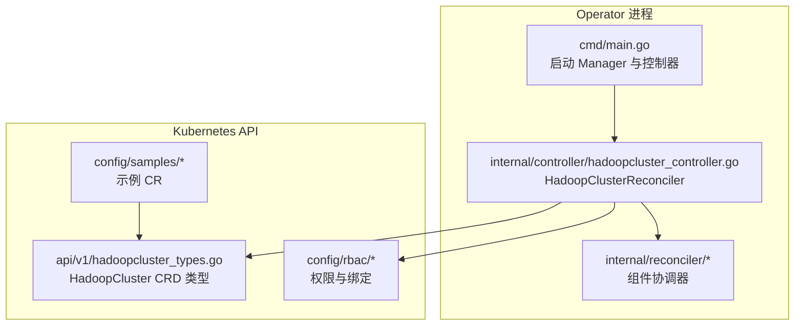
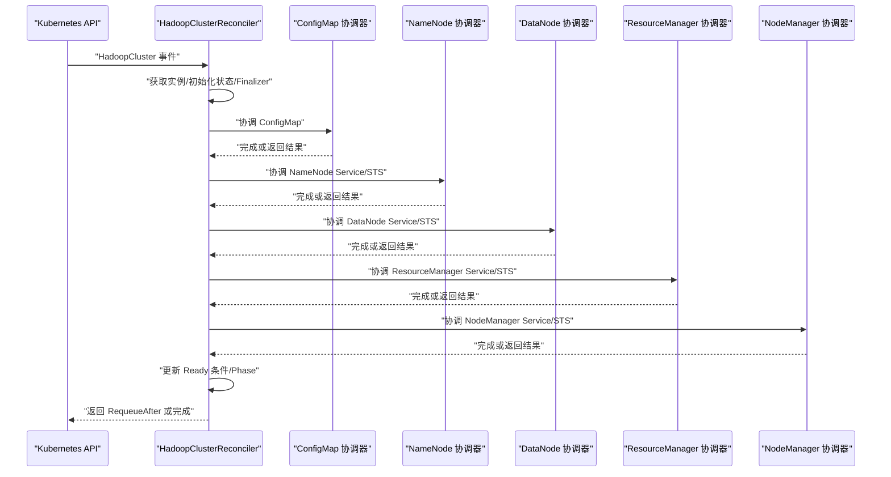
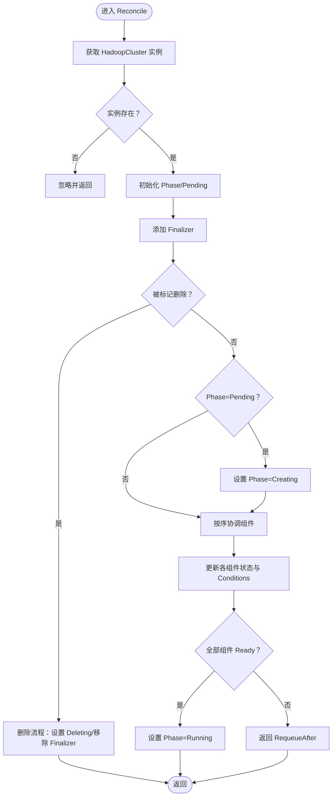
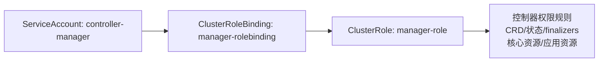
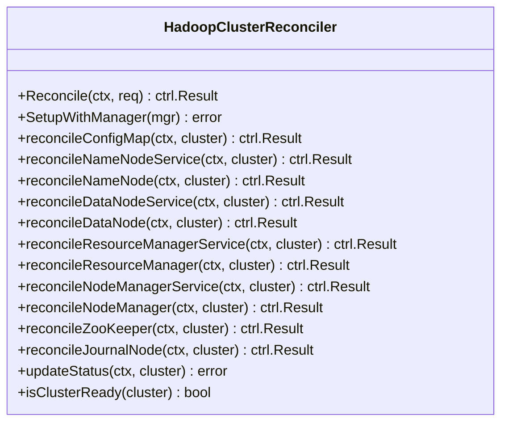
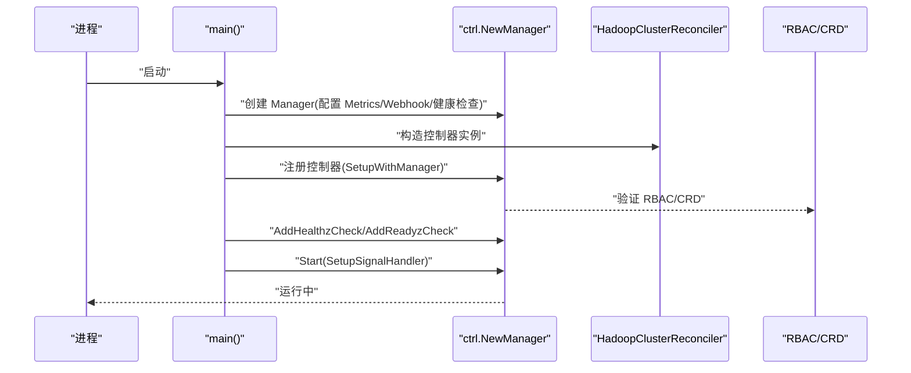
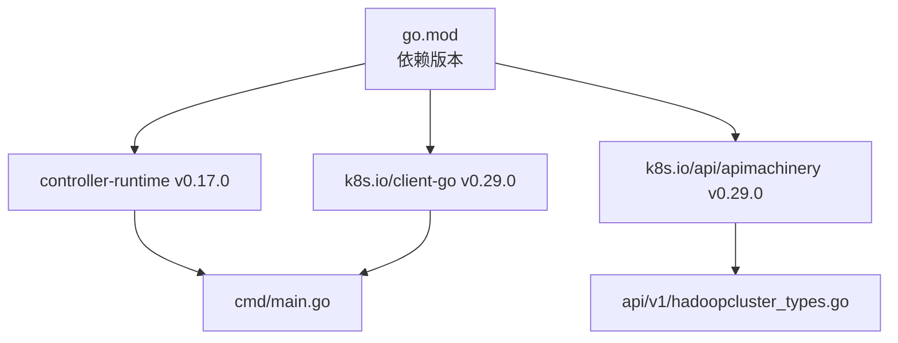

# 控制器模式实现

<cite>
**本文档引用的文件**
- [main.go](file://hadoop-operator/cmd/main.go)
- [hadoopcluster_controller.go](file://hadoop-operator/internal/controller/hadoopcluster_controller.go)
- [hadoopcluster_types.go](file://hadoop-operator/api/v1/hadoopcluster_types.go)
- [configmap.go](file://hadoop-operator/internal/reconciler/configmap.go)
- [namenode.go](file://hadoop-operator/internal/reconciler/namenode.go)
- [datanode.go](file://hadoop-operator/internal/reconciler/datanode.go)
- [yarn.go](file://hadoop-operator/internal/reconciler/yarn.go)
- [ha.go](file://hadoop-operator/internal/reconciler/ha.go)
- [role.yaml](file://hadoop-operator/config/rbac/role.yaml)
- [role_binding.yaml](file://hadoop-operator/config/rbac/role_binding.yaml)
- [service_account.yaml](file://hadoop-operator/config/rbac/service_account.yaml)
- [hadoop_v1_hadoopcluster.yaml](file://hadoop-operator/config/samples/hadoop_v1_hadoopcluster.yaml)
- [hadoop_v1_hadoopcluster_ha.yaml](file://hadoop-operator/config/samples/hadoop_v1_hadoopcluster_ha.yaml)
- [go.mod](file://hadoop-operator/go.mod)
- [README.md](file://hadoop-operator/README.md)
</cite>

## 目录
1. [简介](#简介)
2. [项目结构](#项目结构)
3. [核心组件](#核心组件)
4. [架构总览](#架构总览)
5. [详细组件分析](#详细组件分析)
6. [依赖关系分析](#依赖关系分析)
7. [性能考虑](#性能考虑)
8. [故障排查指南](#故障排查指南)
9. [结论](#结论)
10. [附录](#附录)

## 简介
本文件面向 Apache Hadoop Operator v3 的控制器模式实现，重点解析 HadoopClusterReconciler 的设计与实现，涵盖 Reconcile 方法的工作机制、事件循环处理、状态同步逻辑、生命周期管理（初始化/运行时/清理）、RBAC 权限配置、Finalizer 机制与资源所有权管理、启动流程、错误处理与重试策略，以及扩展点与自定义控制器开发指南。内容基于代码库实际实现进行深入分析，并提供可视化图表帮助理解。

## 项目结构
项目采用标准的 Kubebuilder 项目布局，核心目录与职责如下：
- hadoop-operator/api/v1：CRD 类型定义与状态模型
- hadoop-operator/cmd/main.go：Operator 启动入口，构建 Manager、注册控制器与健康检查
- hadoop-operator/internal/controller：主控制器实现（HadoopClusterReconciler）
- hadoop-operator/internal/reconciler：各组件协调器（ConfigMap、NameNode、DataNode、ResourceManager、NodeManager、HA）
- hadoop-operator/config：CRD、RBAC、部署样例与 Kustomize 配置
- hadoop-operator/go.mod：Go 依赖版本声明

**图表来源**
- [main.go:54-149](file://hadoop-operator/cmd/main.go#L54-L149)
- [hadoopcluster_controller.go:41-239](file://hadoop-operator/internal/controller/hadoopcluster_controller.go#L41-L239)
- [hadoopcluster_types.go:397-413](file://hadoop-operator/api/v1/hadoopcluster_types.go#L397-L413)

**章节来源**
- [main.go:19-52](file://hadoop-operator/cmd/main.go#L19-L52)
- [README.md:235-251](file://hadoop-operator/README.md#L235-L251)

## 核心组件
- HadoopClusterReconciler：主控制器，负责对 HadoopCluster 资源进行协调，按顺序调用各组件协调器，更新状态与条件，并维护 Finalizer。
- Reconciler 组件：独立的组件协调器函数，封装 ConfigMap、NameNode、DataNode、ResourceManager、NodeManager、HA 的创建/更新逻辑。
- CRD 类型：定义 HadoopCluster 的 Spec 与 Status 结构，包含集群阶段、条件、各组件状态等。
- RBAC：为控制器授予对 CRD、核心资源与应用资源的操作权限，并允许更新 finalizers 与 status。

**章节来源**
- [hadoopcluster_controller.go:41-239](file://hadoop-operator/internal/controller/hadoopcluster_controller.go#L41-L239)
- [hadoopcluster_types.go:24-413](file://hadoop-operator/api/v1/hadoopcluster_types.go#L24-L413)
- [role.yaml:6-99](file://hadoop-operator/config/rbac/role.yaml#L6-L99)

## 架构总览
Hadoop Operator 采用 controller-runtime 的控制器模式，Reconcile 循环以 HadoopCluster 为根对象，通过 Owned 关系管理 StatefulSet、Service、ConfigMap、PVC 等子资源。控制器在每次 Reconcile 中：
- 获取并校验 HadoopCluster 实例
- 初始化状态与 Finalizer
- 处理删除流程
- 依次协调各组件（ConfigMap → NameNode Service/STS → DataNode Service/STS → ResourceManager Service/STS → NodeManager Service/STS）
- 更新集群 Ready 条件与 Phase
- 返回 RequeueAfter 以周期性同步

**图表来源**
- [hadoopcluster_controller.go:60-145](file://hadoop-operator/internal/controller/hadoopcluster_controller.go#L60-L145)
- [configmap.go:44-68](file://hadoop-operator/internal/reconciler/configmap.go#L44-L68)
- [namenode.go:36-114](file://hadoop-operator/internal/reconciler/namenode.go#L36-L114)
- [datanode.go:35-113](file://hadoop-operator/internal/reconciler/datanode.go#L35-L113)
- [yarn.go:35-113](file://hadoop-operator/internal/reconciler/yarn.go#L35-L113)

## 详细组件分析

### HadoopClusterReconciler 设计与 Reconcile 机制
- Reconcile 入口：接收请求后先获取 HadoopCluster 实例，若不存在则忽略；若存在但未设置 Phase，则初始化为 Pending 并立即更新状态。
- Finalizer 管理：确保实例删除前执行清理，添加/移除 Finalizer 通过 controllerutil 完成。
- 删除流程：当 DeletionTimestamp 非空时，进入删除协调流程，设置 Deleting Phase，并移除 Finalizer 后返回。
- 组件协调顺序：按 ConfigMap → NameNode Service/STS → DataNode Service/STS → ResourceManager Service/STS → NodeManager Service/STS 的顺序逐一调用，任一环节返回错误或需要重试时立即中断并返回。
- 状态更新：从各组件 StatefulSet 读取副本与就绪副本，更新 Status 中各组件字段，并根据 Ready 条件更新 Conditions。
- 运行态推进：当 Phase 为 Pending 时切换为 Creating；当所有组件 Ready 且 Phase 不是 Running 时，更新为 Running 并记录事件。

**图表来源**
- [hadoopcluster_controller.go:60-145](file://hadoop-operator/internal/controller/hadoopcluster_controller.go#L60-L145)
- [hadoopcluster_controller.go:149-167](file://hadoop-operator/internal/controller/hadoopcluster_controller.go#L149-L167)
- [hadoopcluster_controller.go:176-227](file://hadoop-operator/internal/controller/hadoopcluster_controller.go#L176-L227)

**章节来源**
- [hadoopcluster_controller.go:60-145](file://hadoop-operator/internal/controller/hadoopcluster_controller.go#L60-L145)
- [hadoopcluster_controller.go:149-167](file://hadoop-operator/internal/controller/hadoopcluster_controller.go#L149-L167)
- [hadoopcluster_controller.go:176-227](file://hadoop-operator/internal/controller/hadoopcluster_controller.go#L176-L227)

### RBAC 权限配置与资源所有权
- RBAC 规则：控制器需要对 HadoopCluster CR、其 finalizers 与 status，以及 ConfigMap、Service、StatefulSet、PVC、Events 等资源进行 CRUD 操作。
- 资源所有权：通过 Owned 关系声明，控制器对 StatefulSet、Service、ConfigMap、PVC 具有 OwnerReference 管理权，删除 HadoopCluster 时这些子资源会随父资源自动清理（PVC 默认保留）。
- ServiceAccount 与 RoleBinding：通过 Kustomize 配置将 ServiceAccount 绑定到 ClusterRole，赋予控制器所需权限。

**图表来源**
- [role.yaml:6-99](file://hadoop-operator/config/rbac/role.yaml#L6-L99)
- [role_binding.yaml:8-15](file://hadoop-operator/config/rbac/role_binding.yaml#L8-L15)
- [service_account.yaml:3-8](file://hadoop-operator/config/rbac/service_account.yaml#L3-L8)

**章节来源**
- [role.yaml:6-99](file://hadoop-operator/config/rbac/role.yaml#L6-L99)
- [role_binding.yaml:8-15](file://hadoop-operator/config/rbac/role_binding.yaml#L8-L15)
- [service_account.yaml:3-8](file://hadoop-operator/config/rbac/service_account.yaml#L3-L8)

### Finalizer 机制与资源所有权管理
- Finalizer 添加：在实例创建时添加自定义 Finalizer，确保删除前执行清理。
- 删除流程：进入删除协调时设置 Deleting Phase，随后移除 Finalizer 并返回，使实例最终被回收。
- Ownership：通过 controllerutil.SetControllerReference 将子资源与 HadoopCluster 建立 OwnerReference，保证生命周期一致性。

**章节来源**
- [hadoopcluster_controller.go:82-88](file://hadoop-operator/internal/controller/hadoopcluster_controller.go#L82-L88)
- [hadoopcluster_controller.go:149-167](file://hadoop-operator/internal/controller/hadoopcluster_controller.go#L149-L167)

### 生命周期管理
- 初始化：首次创建时设置 Phase=Pending，立即更新状态，避免后续重复初始化。
- 运行时：周期性 Reconcile（默认 30 秒），同步各组件状态与 Ready 条件。
- 清理：删除时设置 Deleting 并移除 Finalizer，触发子资源清理（PVC 默认保留）。

**章节来源**
- [hadoopcluster_controller.go:74-80](file://hadoop-operator/internal/controller/hadoopcluster_controller.go#L74-L80)
- [hadoopcluster_controller.go:95-102](file://hadoop-operator/internal/controller/hadoopcluster_controller.go#L95-L102)
- [hadoopcluster_controller.go:149-167](file://hadoop-operator/internal/controller/hadoopcluster_controller.go#L149-L167)

### 错误处理与重试机制
- 错误传播：任一组件协调器返回错误时，记录 Warning 事件并立即返回错误，交由 controller-runtime 重试队列处理。
- 重试控制：若组件协调器返回 Requeue 或 RequeueAfter，则立即中断后续协调并按结果重试；否则继续下一个组件。
- 状态回写：任何阶段的错误都会阻止后续状态更新，直到该错误被解决。

**章节来源**
- [hadoopcluster_controller.go:117-126](file://hadoop-operator/internal/controller/hadoopcluster_controller.go#L117-L126)

### 组件协调器实现要点
- ConfigMap 协调器：生成 Hadoop 配置（core-site、hdfs-site、yarn-site、mapred-site、capacity-scheduler），支持用户覆盖，挂载到各组件容器。
- NameNode 协调器：创建 Headless Service 与外部 Service（NodePort/LoadBalancer），创建 StatefulSet，支持 HA（JournalNode、ZooKeeper）。
- DataNode 协调器：等待 NameNode 就绪后再启动，创建 Headless/外部 Service 与 StatefulSet，挂载数据卷。
- ResourceManager/NodeManager 协调器：创建 Headless/外部 Service 与 StatefulSet，支持 HA（ZooKeeper）。
- HA 协调器：内部部署 ZooKeeper 与 JournalNode（当启用 HA 且未指定外部 ZooKeeper）。

**图表来源**
- [hadoopcluster_controller.go:41-239](file://hadoop-operator/internal/controller/hadoopcluster_controller.go#L41-L239)
- [configmap.go:44-68](file://hadoop-operator/internal/reconciler/configmap.go#L44-L68)
- [namenode.go:36-317](file://hadoop-operator/internal/reconciler/namenode.go#L36-L317)
- [datanode.go:35-321](file://hadoop-operator/internal/reconciler/datanode.go#L35-L321)
- [yarn.go:35-447](file://hadoop-operator/internal/reconciler/yarn.go#L35-L447)
- [ha.go:35-363](file://hadoop-operator/internal/reconciler/ha.go#L35-L363)

**章节来源**
- [configmap.go:44-246](file://hadoop-operator/internal/reconciler/configmap.go#L44-L246)
- [namenode.go:36-317](file://hadoop-operator/internal/reconciler/namenode.go#L36-L317)
- [datanode.go:35-321](file://hadoop-operator/internal/reconciler/datanode.go#L35-L321)
- [yarn.go:35-447](file://hadoop-operator/internal/reconciler/yarn.go#L35-L447)
- [ha.go:35-363](file://hadoop-operator/internal/reconciler/ha.go#L35-L363)

### 启动流程与健康检查
- Manager 初始化：构建 Scheme，注册 CRD 类型，配置 Metrics、Webhook、健康检查端口与 LeaderElection。
- 控制器注册：将 HadoopClusterReconciler 注册到 Manager，并声明对 HadoopCluster 的监听与对其 Owned 资源的管理。
- 健康检查：注册 healthz/readyz 检查，便于探针探测。
- 信号处理：通过 SetupSignalHandler 接收 SIGTERM/SIGINT，优雅关闭 Manager。

**图表来源**
- [main.go:97-149](file://hadoop-operator/cmd/main.go#L97-L149)
- [hadoopcluster_controller.go:229-239](file://hadoop-operator/internal/controller/hadoopcluster_controller.go#L229-L239)

**章节来源**
- [main.go:97-149](file://hadoop-operator/cmd/main.go#L97-L149)

### 自定义控制器开发指南与扩展点
- 新增组件协调器：在 internal/reconciler 下新增文件，实现 ComponentReconciler 函数签名，并在 HadoopClusterReconciler 的协调顺序中加入。
- 扩展 CRD 字段：在 api/v1/HadoopClusterSpec 中添加新字段，在 ConfigMap 生成器中处理用户覆盖。
- 权限扩展：在 RBAC ClusterRole 中增加对应资源的 verbs，并在 SetupWithManager 中声明 Owns。
- 高可用扩展：参考 HA 协调器实现 ZooKeeper/JournalNode 的部署与配置。
- 配置覆盖：通过 ConfigMap 生成器的用户覆盖逻辑，支持灵活定制 Hadoop 配置。

**章节来源**
- [hadoopcluster_controller.go:105-115](file://hadoop-operator/internal/controller/hadoopcluster_controller.go#L105-L115)
- [configmap.go:70-209](file://hadoop-operator/internal/reconciler/configmap.go#L70-L209)
- [role.yaml:6-99](file://hadoop-operator/config/rbac/role.yaml#L6-L99)

## 依赖关系分析
- 版本依赖：基于 controller-runtime v0.17.0 与 Kubernetes v1.29，确保与 CRD、客户端库兼容。
- 组件耦合：HadoopClusterReconciler 通过 Owned 关系管理子资源，降低直接耦合；组件协调器相对独立，便于扩展与测试。
- 外部依赖：通过 ConfigMap 生成器集中管理 Hadoop 配置，减少各组件重复逻辑。

**图表来源**
- [go.mod:5-10](file://hadoop-operator/go.mod#L5-L10)

**章节来源**
- [go.mod:5-10](file://hadoop-operator/go.mod#L5-L10)

## 性能考虑
- Reconcile 周期：默认每 30 秒一次，适合集群状态稳定场景；可根据集群规模调整。
- 资源请求/限制：各组件默认设置合理的 CPU/内存请求与限制，避免资源争抢。
- 探针配置：健康/就绪探针合理设置初始延迟与周期，减少频繁重启。
- 存储配置：PVC 默认按需分配，建议结合业务选择合适的 StorageClass 与访问模式。

## 故障排查指南
- Pod 启动失败：查看 Pod 事件与日志，确认镜像拉取、权限与配置正确。
- NameNode 格式化失败：检查 PVC 状态与磁盘权限，必要时手动格式化。
- DataNode 无法连接 NameNode：检查服务连通性与配置，确认 core-site 中 fs.defaultFS 正确。
- 镜像拉取失败：检查镜像是否存在与 Secret 配置是否正确。

**章节来源**
- [README.md:276-318](file://hadoop-operator/README.md#L276-L318)

## 结论
HadoopClusterReconciler 采用清晰的分层架构与顺序协调模式，通过 Owned 关系与 Finalizer 机制实现资源全生命周期管理。RBAC 权限覆盖全面，启动流程健壮，错误处理与重试策略明确。通过模块化的组件协调器与可扩展的 CRD，开发者可以便捷地扩展新组件与功能，满足复杂场景下的 Hadoop 集群编排需求。

## 附录
- 示例 CR：基础与高可用部署示例，便于快速验证。
- 部署与运行：支持 kubectl 与本地开发运行两种方式。

**章节来源**
- [hadoop_v1_hadoopcluster.yaml:1-80](file://hadoop-operator/config/samples/hadoop_v1_hadoopcluster.yaml#L1-L80)
- [hadoop_v1_hadoopcluster_ha.yaml:1-107](file://hadoop-operator/config/samples/hadoop_v1_hadoopcluster_ha.yaml#L1-L107)
- [README.md:25-50](file://hadoop-operator/README.md#L25-L50)