# 数据模型设计

<cite>
**本文档引用的文件**
- [hadoopcluster_types.go](file://hadoop-operator/api/v1/hadoopcluster_types.go)
- [groupversion_info.go](file://hadoop-operator/api/v1/groupversion_info.go)
- [hadoop.apache.org_hadoopclusters.yaml](file://hadoop-operator/config/crd/bases/hadoop.apache.org_hadoopclusters.yaml)
- [hadoopcluster_controller.go](file://hadoop-operator/internal/controller/hadoopcluster_controller.go)
- [namenode.go](file://hadoop-operator/internal/reconciler/namenode.go)
- [datanode.go](file://hadoop-operator/internal/reconciler/datanode.go)
- [yarn.go](file://hadoop-operator/internal/reconciler/yarn.go)
- [ha.go](file://hadoop-operator/internal/reconciler/ha.go)
- [configmap.go](file://hadoop-operator/internal/reconciler/configmap.go)
- [hadoop_v1_hadoopcluster.yaml](file://hadoop-operator/config/samples/hadoop_v1_hadoopcluster.yaml)
- [hadoop_v1_hadoopcluster_ha.yaml](file://hadoop-operator/config/samples/hadoop_v1_hadoopcluster_ha.yaml)
- [offline-deployment.yaml](file://hadoop-operator/config/samples/offline-deployment.yaml)
</cite>

## 目录
1. [简介](#简介)
2. [项目结构](#项目结构)
3. [核心数据模型](#核心数据模型)
4. [架构概览](#架构概览)
5. [详细组件分析](#详细组件分析)
6. [状态管理机制](#状态管理机制)
7. [健康检查与故障检测](#健康检查与故障检测)
8. [数据验证与约束](#数据验证与约束)
9. [默认值设置](#默认值设置)
10. [数据模型演进策略](#数据模型演进策略)
11. [性能考量](#性能考量)
12. [故障排除指南](#故障排除指南)
13. [结论](#结论)

## 简介

Apache Hadoop Operator v3 是一个用于在 Kubernetes 上部署和管理 Hadoop 集群的生产级 Operator。该版本专注于提供完整的 Hadoop 生态系统支持，包括 HDFS 和 YARN 的高可用部署，以及离线环境部署能力。

本文件详细阐述了 HadoopCluster CRD 的数据模型设计，包括 Spec、Status 和 Conditions 字段的定义和用途，以及集群状态管理机制、组件状态模型、健康检查机制和故障检测策略。

## 项目结构

该项目采用标准的 Kubernetes Operator 结构，主要包含以下核心目录：

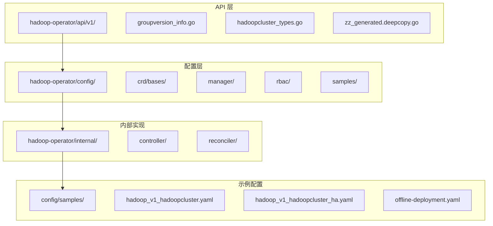

**图表来源**
- [hadoopcluster_types.go:1-418](file://hadoop-operator/api/v1/hadoopcluster_types.go#L1-L418)
- [hadoopcluster_controller.go:1-239](file://hadoop-operator/internal/controller/hadoopcluster_controller.go#L1-L239)

**章节来源**
- [hadoopcluster_types.go:17-418](file://hadoop-operator/api/v1/hadoopcluster_types.go#L17-L418)
- [hadoopcluster_controller.go:17-239](file://hadoop-operator/internal/controller/hadoopcluster_controller.go#L17-L239)

## 核心数据模型

### HadoopCluster CRD 结构

HadoopCluster CRD 采用分层的数据结构设计，提供了完整的 Hadoop 集群配置能力：

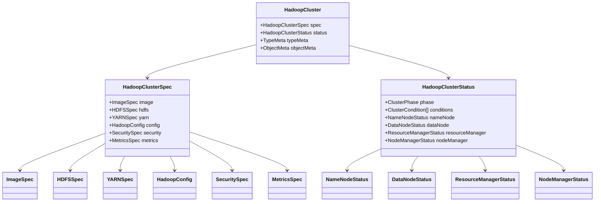

**图表来源**
- [hadoopcluster_types.go:24-46](file://hadoop-operator/api/v1/hadoopcluster_types.go#L24-L46)
- [hadoopcluster_types.go:297-315](file://hadoop-operator/api/v1/hadoopcluster_types.go#L297-L315)

### Spec 字段详解

#### ImageSpec - 镜像配置
ImageSpec 定义了容器镜像的配置参数：
- **Repository**: Docker 镜像仓库地址
- **Tag**: 镜像标签，默认使用 Hadoop 版本
- **PullPolicy**: 镜像拉取策略
- **PullSecrets**: 镜像拉取认证信息

#### HDFSSpec - HDFS 配置
HDFSSpec 包含 NameNode 和 DataNode 的完整配置：
- **NameNode**: NameNode 服务配置，支持高可用模式
- **DataNode**: DataNode 服务配置，支持副本管理

#### YARNSpec - YARN 配置
YARNSpec 提供资源管理器和节点管理器的配置：
- **ResourceManager**: 资源管理器配置，支持高可用
- **NodeManager**: 节点管理器配置

#### HadoopConfig - 配置覆盖
HadoopConfig 允许用户覆盖默认的 Hadoop 配置：
- **CoreSite**: core-site.xml 配置
- **HDFSSite**: hdfs-site.xml 配置  
- **YARNSite**: yarn-site.xml 配置
- **MapredSite**: mapred-site.xml 配置
- **CapacityScheduler**: capacity-scheduler.xml 配置

#### SecuritySpec - 安全配置
支持多种安全机制的集成：
- **Kerberos**: Kerberos 认证配置
- **TLS**: TLS 加密通信配置
- **Ranger**: Apache Ranger 权限管理集成

#### MetricsSpec - 监控配置
集成 Prometheus 监控能力：
- **Enabled**: 是否启用监控
- **ExporterImage**: 监控导出器镜像
- **ServiceMonitor**: Prometheus ServiceMonitor 配置

**章节来源**
- [hadoopcluster_types.go:48-295](file://hadoop-operator/api/v1/hadoopcluster_types.go#L48-L295)

## 架构概览

Hadoop Operator 采用 Kubernetes 控制器模式，通过 CRD 定义集群状态，并通过控制器实现期望状态到实际状态的转换：

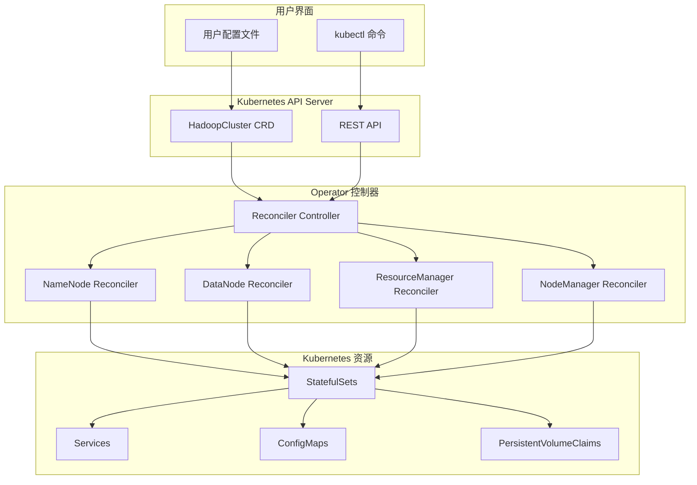

**图表来源**
- [hadoopcluster_controller.go:41-145](file://hadoop-operator/internal/controller/hadoopcluster_controller.go#L41-L145)
- [hadoopcluster_types.go:391-413](file://hadoop-operator/api/v1/hadoopcluster_types.go#L391-L413)

## 详细组件分析

### NameNode 组件模型

NameNode 是 HDFS 的核心组件，负责元数据管理和文件系统命名空间：

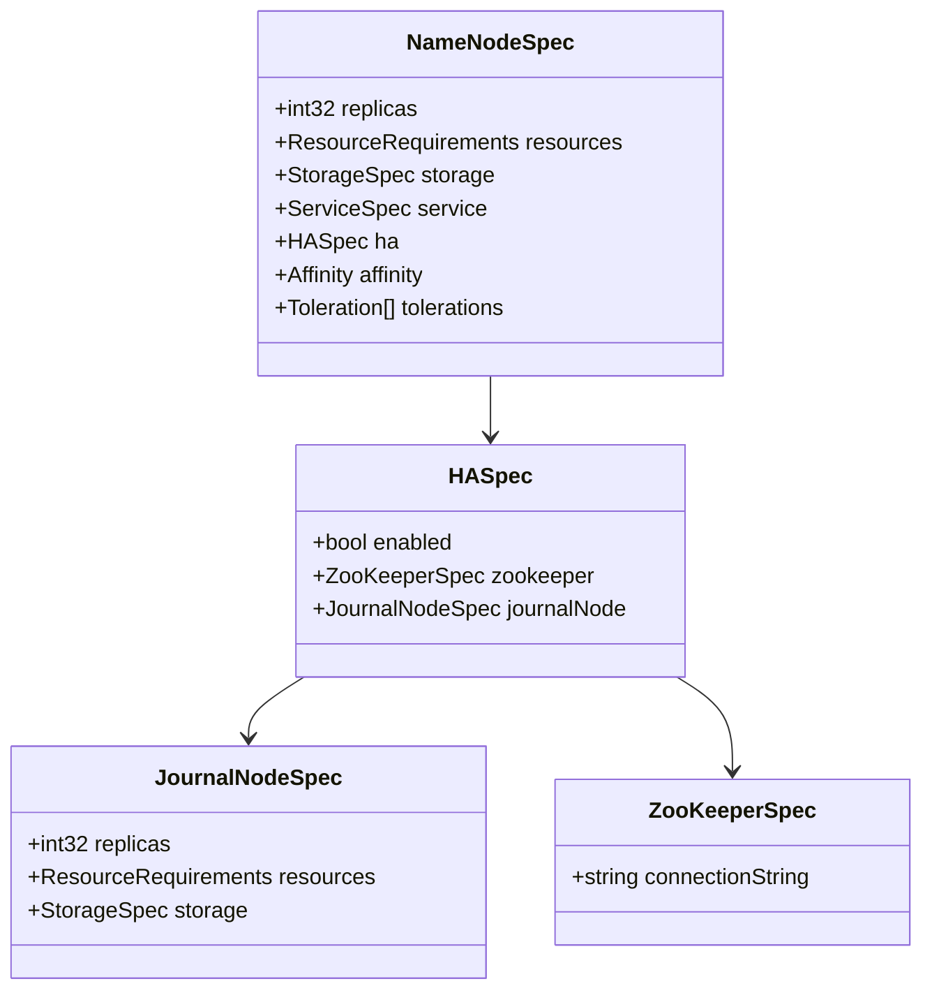

**图表来源**
- [hadoopcluster_types.go:69-120](file://hadoop-operator/api/v1/hadoopcluster_types.go#L69-L120)

#### NameNode 状态模型
NameNode 状态包含活跃节点和备用节点的信息：
- **ReadyReplicas**: 就绪的 NameNode 副本数量
- **Replicas**: 总共的 NameNode 副本数量
- **Active**: 当前活跃的 NameNode 实例
- **Standby**: 备用的 NameNode 实例列表

**章节来源**
- [hadoopcluster_types.go:347-357](file://hadoop-operator/api/v1/hadoopcluster_types.go#L347-L357)

### DataNode 组件模型

DataNode 负责存储实际的数据块：

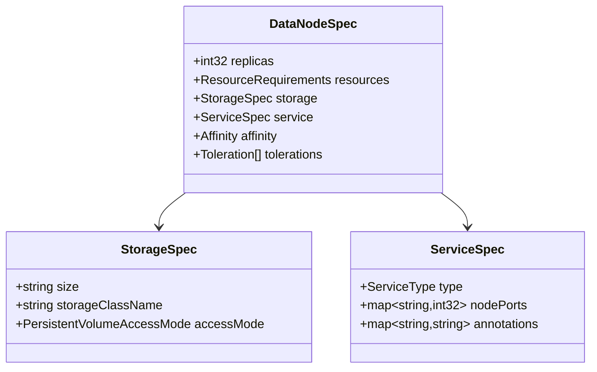

**图表来源**
- [hadoopcluster_types.go:122-140](file://hadoop-operator/api/v1/hadoopcluster_types.go#L122-L140)

#### DataNode 状态模型
DataNode 状态监控存储节点的健康状况：
- **ReadyReplicas**: 就绪的 DataNode 副本数量
- **Replicas**: 总共的 DataNode 副本数量
- **LiveNodes**: 活跃的数据节点数量
- **DeadNodes**: 死亡的数据节点数量

**章节来源**
- [hadoopcluster_types.go:359-369](file://hadoop-operator/api/v1/hadoopcluster_types.go#L359-L369)

### ResourceManager 组件模型

ResourceManager 管理集群中的资源分配：

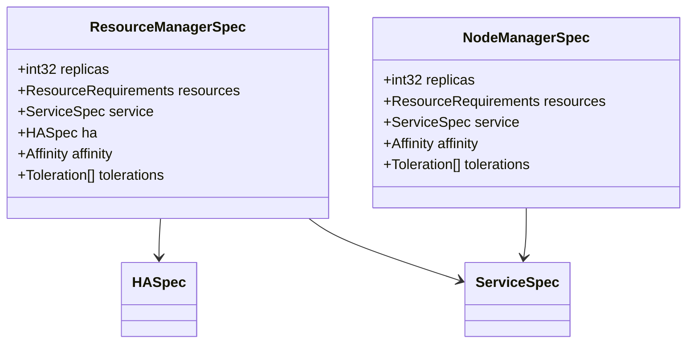

**图表来源**
- [hadoopcluster_types.go:150-187](file://hadoop-operator/api/v1/hadoopcluster_types.go#L150-L187)

#### ResourceManager 状态模型
ResourceManager 状态包含高可用配置信息：
- **ReadyReplicas**: 就绪的 ResourceManager 副本数量
- **Replicas**: 总共的 ResourceManager 副本数量
- **Active**: 当前活跃的 ResourceManager 实例
- **Standby**: 备用的 ResourceManager 实例列表

**章节来源**
- [hadoopcluster_types.go:371-381](file://hadoop-operator/api/v1/hadoopcluster_types.go#L371-L381)

### NodeManager 组件模型

NodeManager 在每个工作节点上运行，管理单个节点的资源：

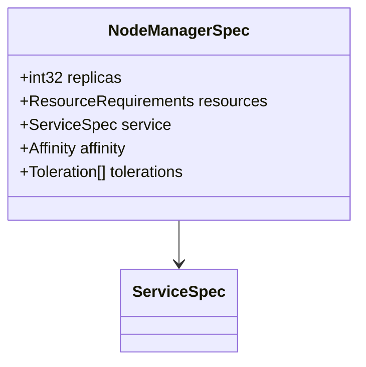

**图表来源**
- [hadoopcluster_types.go:171-187](file://hadoop-operator/api/v1/hadoopcluster_types.go#L171-L187)

#### NodeManager 状态模型
NodeManager 状态相对简单，主要关注就绪状态：
- **ReadyReplicas**: 就绪的 NodeManager 副本数量
- **Replicas**: 总共的 NodeManager 副本数量

**章节来源**
- [hadoopcluster_types.go:383-389](file://hadoop-operator/api/v1/hadoopcluster_types.go#L383-L389)

## 状态管理机制

### Phase 状态转换

HadoopCluster 支持多种阶段状态，用于表示集群的不同生命周期阶段：

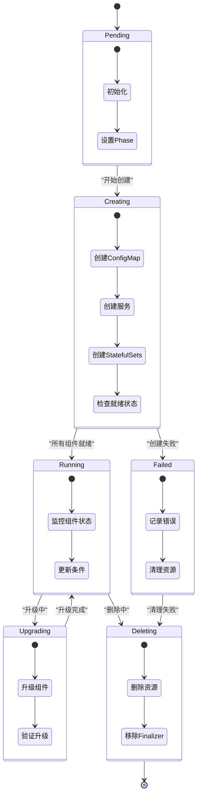

**图表来源**
- [hadoopcluster_controller.go:95-142](file://hadoop-operator/internal/controller/hadoopcluster_controller.go#L95-L142)

### ReadyReplicas 计数机制

控制器通过查询 Kubernetes StatefulSet 的就绪副本数来确定组件的就绪状态：

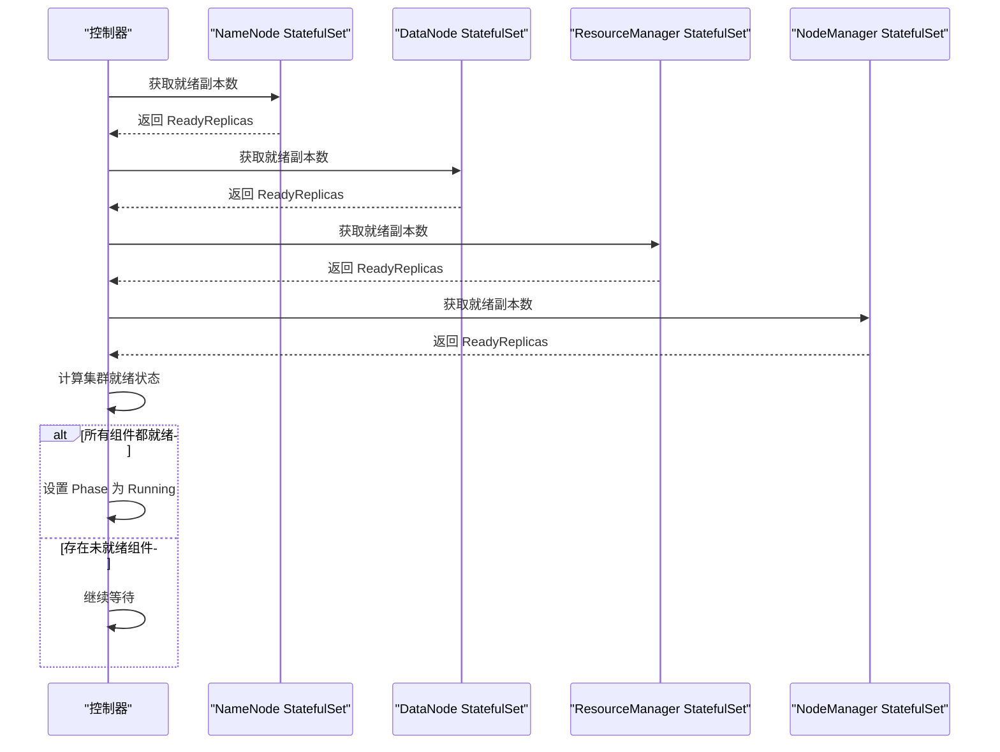

**图表来源**
- [hadoopcluster_controller.go:169-174](file://hadoop-operator/internal/controller/hadoopcluster_controller.go#L169-L174)
- [hadoopcluster_controller.go:176-227](file://hadoop-operator/internal/controller/hadoopcluster_controller.go#L176-L227)

### 条件判断逻辑

集群条件系统提供了更细粒度的状态描述：

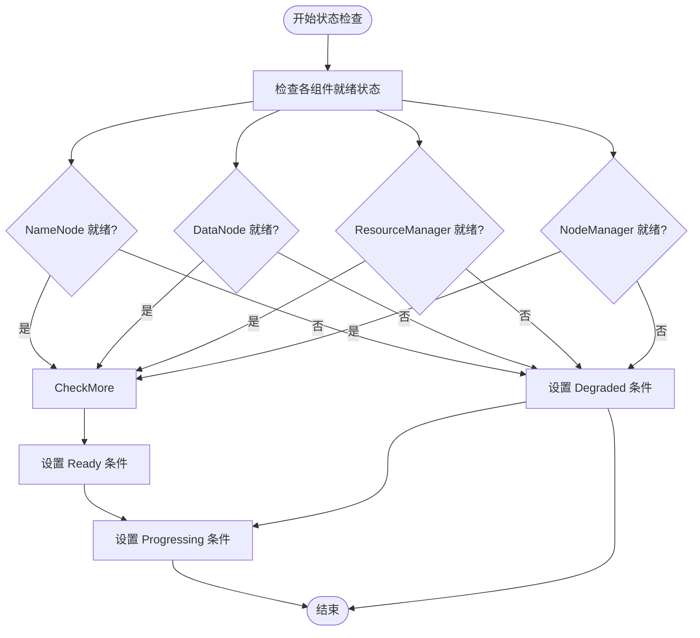

**图表来源**
- [hadoopcluster_controller.go:209-227](file://hadoop-operator/internal/controller/hadoopcluster_controller.go#L209-L227)

**章节来源**
- [hadoopcluster_types.go:317-345](file://hadoop-operator/api/v1/hadoopcluster_types.go#L317-L345)
- [hadoopcluster_controller.go:169-227](file://hadoop-operator/internal/controller/hadoopcluster_controller.go#L169-L227)

## 健康检查与故障检测

### 探针配置

每个组件都配置了健康检查探针，用于监控服务的可用性：

#### NameNode 探针
- **Liveness Probe**: 每30秒检查一次 JMX 端点
- **Readiness Probe**: 每10秒检查一次 JMX 端点
- **初始延迟**: 100秒（启动时长）

#### DataNode 探针
- **Liveness Probe**: 每20秒检查一次根路径
- **Readiness Probe**: 每10秒检查一次根路径
- **初始延迟**: 60秒

#### ResourceManager 探针
- **Liveness Probe**: 每30秒检查一次集群信息端点
- **Readiness Probe**: 每10秒检查一次集群信息端点
- **初始延迟**: 60秒

#### NodeManager 探针
- **Liveness Probe**: 每30秒检查一次节点信息端点
- **Readiness Probe**: 每10秒检查一次节点信息端点
- **初始延迟**: 60秒

### 故障检测策略

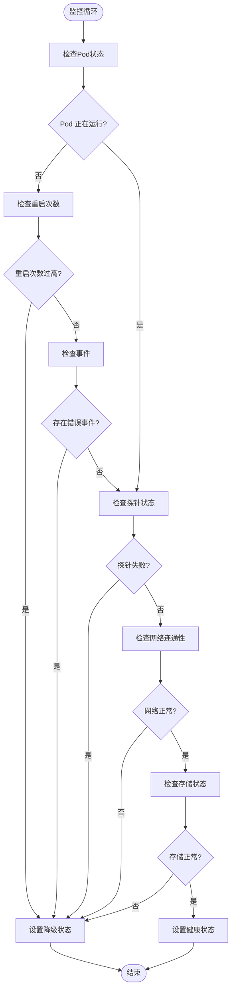

**图表来源**
- [namenode.go:235-254](file://hadoop-operator/internal/reconciler/namenode.go#L235-L254)
- [datanode.go:249-268](file://hadoop-operator/internal/reconciler/datanode.go#L249-L268)
- [yarn.go:189-208](file://hadoop-operator/internal/reconciler/yarn.go#L189-L208)
- [yarn.go:396-415](file://hadoop-operator/internal/reconciler/yarn.go#L396-L415)

**章节来源**
- [namenode.go:235-254](file://hadoop-operator/internal/reconciler/namenode.go#L235-L254)
- [datanode.go:249-268](file://hadoop-operator/internal/reconciler/datanode.go#L249-L268)
- [yarn.go:189-208](file://hadoop-operator/internal/reconciler/yarn.go#L189-L208)
- [yarn.go:396-415](file://hadoop-operator/internal/reconciler/yarn.go#L396-L415)

## 数据验证与约束

### 字段约束规则

HadoopCluster CRD 实现了严格的字段验证机制：

#### 必需字段验证
- **NameNode replicas**: HA 模式下至少需要2个副本
- **JournalNode replicas**: 至少需要3个副本以形成法定人数
- **DataNode replicas**: 默认至少3个副本
- **NodeManager replicas**: 默认至少2个副本

#### 资源限制验证
- **CPU 请求**: 最小值为 500m
- **内存请求**: 最小值为 2Gi
- **CPU 限制**: 最小值为 1000m
- **内存限制**: 最小值为 4Gi

#### 存储配置验证
- **NameNode 存储**: 默认 20Gi
- **DataNode 存储**: 默认 100Gi
- **JournalNode 存储**: 默认 20Gi

#### 高可用配置验证
- **NameNode HA**: 需要至少2个 NameNode 副本
- **ResourceManager HA**: 需要至少2个 ResourceManager 副本
- **JournalNode**: 至少3个副本形成法定人数

**章节来源**
- [namenode.go:120-129](file://hadoop-operator/internal/reconciler/namenode.go#L120-L129)
- [datanode.go:119-122](file://hadoop-operator/internal/reconciler/datanode.go#L119-L122)
- [yarn.go:119-127](file://hadoop-operator/internal/reconciler/yarn.go#L119-L127)
- [ha.go:188-191](file://hadoop-operator/internal/reconciler/ha.go#L188-L191)

## 默认值设置

### 自动默认值机制

控制器实现了智能的默认值设置，确保配置的完整性：

#### 镜像默认值
- **Repository**: apache/hadoop（如果未指定）
- **Tag**: 3.3.6（如果未指定）
- **PullPolicy**: IfNotPresent（如果未指定）

#### 资源默认值
- **NameNode**: 
  - CPU 请求: 500m
  - 内存请求: 2Gi
  - CPU 限制: 1000m
  - 内存限制: 4Gi
- **DataNode**:
  - CPU 请求: 500m
  - 内存请求: 2Gi
  - CPU 限制: 1000m
  - 内存限制: 4Gi
- **ResourceManager**:
  - CPU 请求: 500m
  - 内存请求: 2Gi
  - CPU 限制: 1000m
  - 内存限制: 4Gi
- **NodeManager**:
  - CPU 请求: 500m
  - 内存请求: 2Gi
  - CPU 限制: 1000m
  - 内存限制: 4Gi

#### 存储默认值
- **NameNode**: 20Gi
- **DataNode**: 100Gi
- **JournalNode**: 20Gi
- **JournalNode 存储类**: ReadWriteOnce

#### 服务默认值
- **NameNode 服务类型**: NodePort
- **DataNode 服务类型**: NodePort
- **ResourceManager 服务类型**: NodePort
- **NodeManager 服务类型**: NodePort

**章节来源**
- [configmap.go:235-245](file://hadoop-operator/internal/reconciler/configmap.go#L235-L245)
- [namenode.go:141-152](file://hadoop-operator/internal/reconciler/namenode.go#L141-L152)
- [datanode.go:134-145](file://hadoop-operator/internal/reconciler/datanode.go#L134-L145)
- [yarn.go:139-150](file://hadoop-operator/internal/reconciler/yarn.go#L139-L150)

## 数据模型演进策略

### 向后兼容性考虑

Hadoop Operator v3 在设计时充分考虑了向后兼容性：

#### API 版本管理
- 使用 Kubernetes 标准的 API 版本化机制
- 保持 v1 版本的稳定性
- 为未来功能扩展预留空间

#### 字段兼容性
- 新增字段标记为可选
- 保持现有字段的兼容性
- 提供清晰的迁移指南

#### 配置继承
- 支持从旧版本配置自动迁移
- 提供配置验证和修复机制
- 保持配置文件的向后兼容

### 扩展性设计

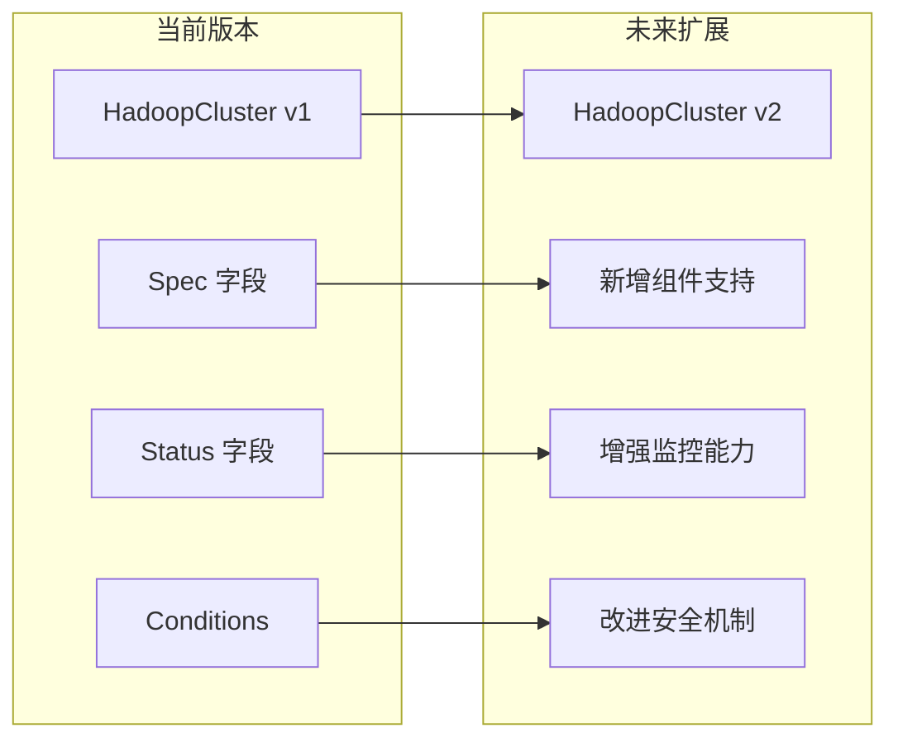

**图表来源**
- [hadoopcluster_types.go:391-413](file://hadoop-operator/api/v1/hadoopcluster_types.go#L391-L413)

## 性能考量

### 资源优化

#### 存储优化
- 使用 PVC 动态分配存储
- 支持多种 StorageClass
- 优化存储访问模式

#### 网络优化
- 使用 Headless 服务支持稳定网络标识
- 优化服务发现机制
- 减少网络延迟

#### 计算优化
- 合理的资源请求和限制
- 支持亲和性和反亲和性
- 优化调度策略

### 监控优化

#### 指标收集
- 集成 Prometheus 监控
- 支持自定义指标
- 提供性能基准

#### 日志管理
- 标准化的日志格式
- 支持日志聚合
- 提供调试信息

## 故障排除指南

### 常见问题诊断

#### NameNode 启动失败
- 检查 NameNode 镜像和版本
- 验证存储权限和挂载
- 检查 ZooKeeper 连接状态

#### DataNode 连接问题
- 验证 NameNode 服务可达性
- 检查 DataNode 存储配置
- 确认网络策略设置

#### ResourceManager 高可用问题
- 检查 ZooKeeper 集群状态
- 验证 JournalNode 配置
- 确认仲裁机制正常

#### NodeManager 调度问题
- 检查资源配额和限制
- 验证节点亲和性配置
- 确认容器运行时状态

### 调试工具

#### 配置验证
- 使用 kubectl describe 检查资源状态
- 查看事件日志了解错误原因
- 验证配置映射内容

#### 网络诊断
- 使用 kubectl exec 进入容器
- 检查服务端口连通性
- 验证 DNS 解析结果

#### 存储诊断
- 检查 PVC 绑定状态
- 验证存储类配置
- 确认存储权限设置

**章节来源**
- [hadoopcluster_controller.go:149-167](file://hadoop-operator/internal/controller/hadoopcluster_controller.go#L149-L167)

## 结论

Apache Hadoop Operator v3 的数据模型设计体现了现代 Kubernetes Operator 的最佳实践。通过清晰的分层架构、完善的配置管理、智能的状态跟踪和健壮的故障处理机制，该设计为生产环境的 Hadoop 集群部署提供了可靠的基础。

关键优势包括：
- **模块化设计**: 清晰的组件分离和职责划分
- **强类型约束**: 严格的字段验证和默认值机制
- **状态管理**: 完整的生命周期管理和健康检查
- **扩展性**: 灵活的配置选项和向后兼容性
- **可观测性**: 全面的监控和诊断能力

该数据模型为 Hadoop 在 Kubernetes 环境中的稳定运行奠定了坚实基础，同时为未来的功能扩展和性能优化预留了充足的空间。