# 组件协调器设计

<cite>
**本文档引用的文件**
- [hadoopcluster_controller.go](file://hadoop-operator/internal/controller/hadoopcluster_controller.go)
- [namenode.go](file://hadoop-operator/internal/reconciler/namenode.go)
- [datanode.go](file://hadoop-operator/internal/reconciler/datanode.go)
- [yarn.go](file://hadoop-operator/internal/reconciler/yarn.go)
- [ha.go](file://hadoop-operator/internal/reconciler/ha.go)
- [configmap.go](file://hadoop-operator/internal/reconciler/configmap.go)
- [hadoopcluster_types.go](file://hadoop-operator/api/v1/hadoopcluster_types.go)
- [main.go](file://hadoop-operator/cmd/main.go)
- [README.md](file://hadoop-operator/README.md)
- [hadoop_v1_hadoopcluster.yaml](file://hadoop-operator/config/samples/hadoop_v1_hadoopcluster.yaml)
- [hadoop_v1_hadoopcluster_ha.yaml](file://hadoop-operator/config/samples/hadoop_v1_hadoopcluster_ha.yaml)
</cite>

## 目录
1. [简介](#简介)
2. [项目结构](#项目结构)
3. [核心组件](#核心组件)
4. [架构概览](#架构概览)
5. [详细组件分析](#详细组件分析)
6. [依赖关系分析](#依赖关系分析)
7. [性能考虑](#性能考虑)
8. [故障排查指南](#故障排查指南)
9. [结论](#结论)
10. [附录](#附录)

## 简介

Apache Hadoop Operator v3 是一个用于在 Kubernetes 上部署和管理 Hadoop 集群的生产级 Operator。该系统采用控制器模式，通过自定义资源定义（CRD）来描述 Hadoop 集群的状态，并通过协调器组件自动管理各个 Hadoop 组件的生命周期。

该 Operator 支持完整的 Hadoop 生态系统组件：
- **HDFS 组件**：NameNode（支持高可用）、DataNode
- **YARN 组件**：ResourceManager（支持高可用）、NodeManager
- **高可用协调**：内置 ZooKeeper 和 JournalNode 支持

## 项目结构

项目采用标准的 Kubernetes Operator 结构，主要分为以下几个层次：

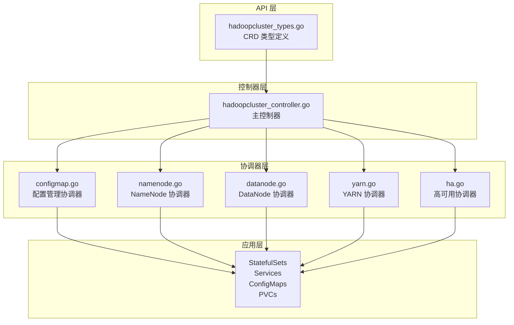

**图表来源**
- [hadoopcluster_controller.go:17-46](file://hadoop-operator/internal/controller/hadoopcluster_controller.go#L17-L46)
- [hadoopcluster_types.go:24-46](file://hadoop-operator/api/v1/hadoopcluster_types.go#L24-L46)

**章节来源**
- [main.go:17-52](file://hadoop-operator/cmd/main.go#L17-L52)
- [README.md:235-251](file://hadoop-operator/README.md#L235-L251)

## 核心组件

### 主控制器 HadoopClusterReconciler

主控制器是整个 Operator 的核心，负责协调所有组件的生命周期。它实现了标准的 Kubernetes Reconciler 模式，通过 Reconcile 循环来确保集群状态与期望状态一致。

#### 关键特性
- **阶段化部署**：按顺序创建配置、服务和 StatefulSets
- **状态跟踪**：维护集群的运行阶段和条件状态
- **事件记录**：使用 EventRecorder 记录关键操作事件
- **最终化器**：确保资源清理和优雅删除

#### 部署顺序控制
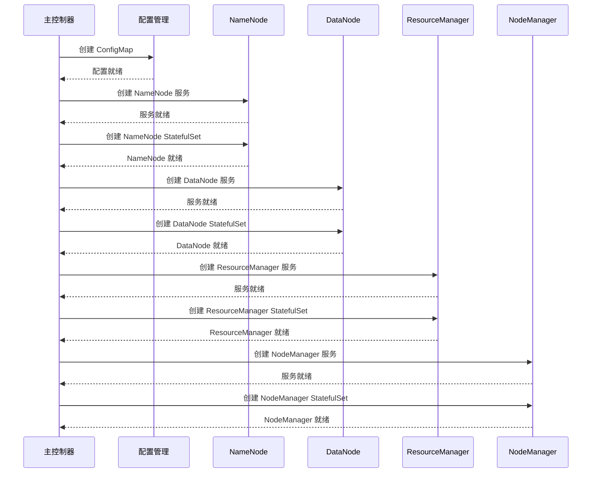

**图表来源**
- [hadoopcluster_controller.go:104-126](file://hadoop-operator/internal/controller/hadoopcluster_controller.go#L104-L126)

**章节来源**
- [hadoopcluster_controller.go:41-145](file://hadoop-operator/internal/controller/hadoopcluster_controller.go#L41-L145)

### 组件协调器接口设计

所有组件协调器都遵循统一的接口模式：

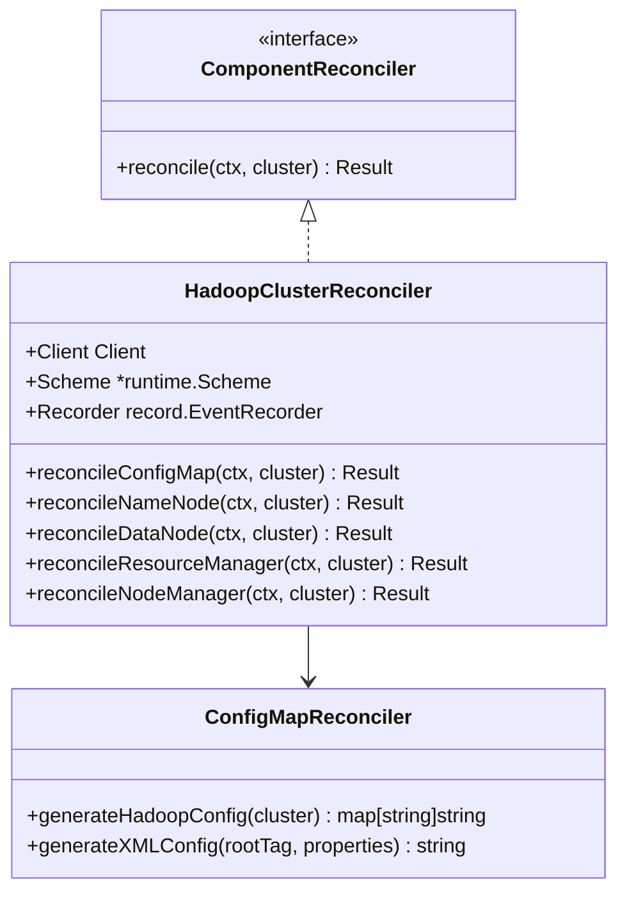

**图表来源**
- [hadoopcluster_controller.go:41-46](file://hadoop-operator/internal/controller/hadoopcluster_controller.go#L41-L46)
- [configmap.go:40-41](file://hadoop-operator/internal/reconciler/configmap.go#L40-L41)

**章节来源**
- [configmap.go:40-41](file://hadoop-operator/internal/reconciler/configmap.go#L40-L41)

## 架构概览

### 系统架构图

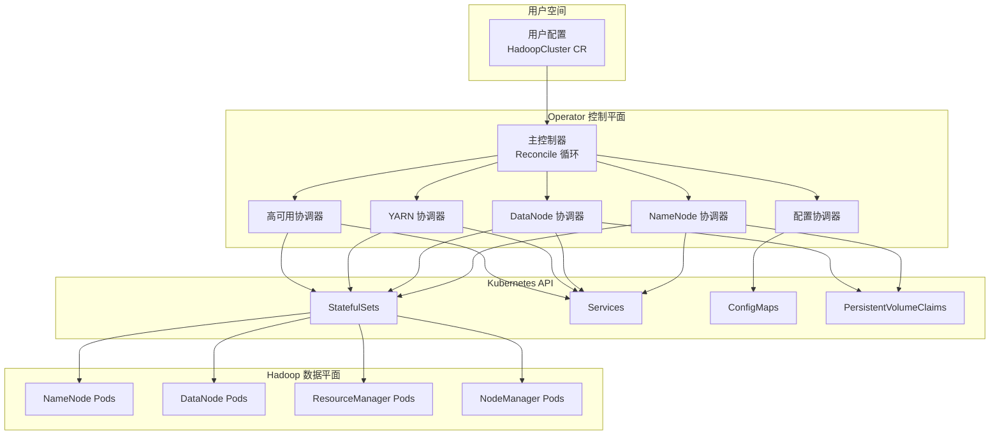

**图表来源**
- [hadoopcluster_controller.go:230-238](file://hadoop-operator/internal/controller/hadoopcluster_controller.go#L230-L238)
- [hadoopcluster_types.go:297-315](file://hadoop-operator/api/v1/hadoopcluster_types.go#L297-L315)

### 组件间依赖关系

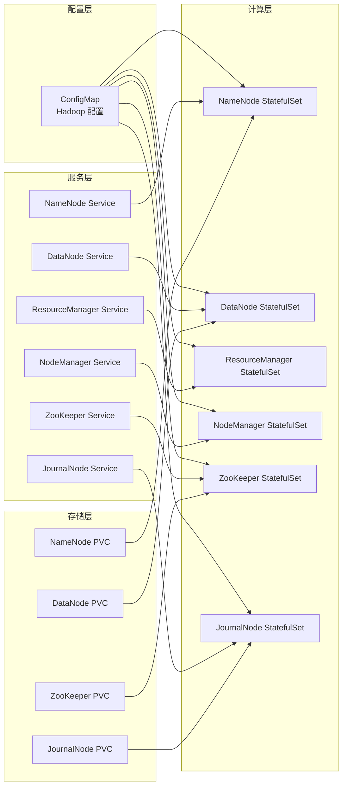

**图表来源**
- [namenode.go:292-308](file://hadoop-operator/internal/reconciler/namenode.go#L292-L308)
- [datanode.go:296-312](file://hadoop-operator/internal/reconciler/datanode.go#L296-L312)
- [yarn.go:229-231](file://hadoop-operator/internal/reconciler/yarn.go#L229-L231)

## 详细组件分析

### NameNode 组件协调器

NameNode 协调器负责管理 HDFS 的 NameNode 组件，支持单实例和高可用两种模式。

#### 核心功能
- **服务管理**：创建 Headless 服务和外部访问服务
- **StatefulSet 管理**：配置 NameNode 的持久化存储和资源限制
- **初始化脚本**：根据 HA 模式生成不同的初始化逻辑
- **存储配置**：支持动态 PVC 和多种存储类

#### HA 模式特殊处理

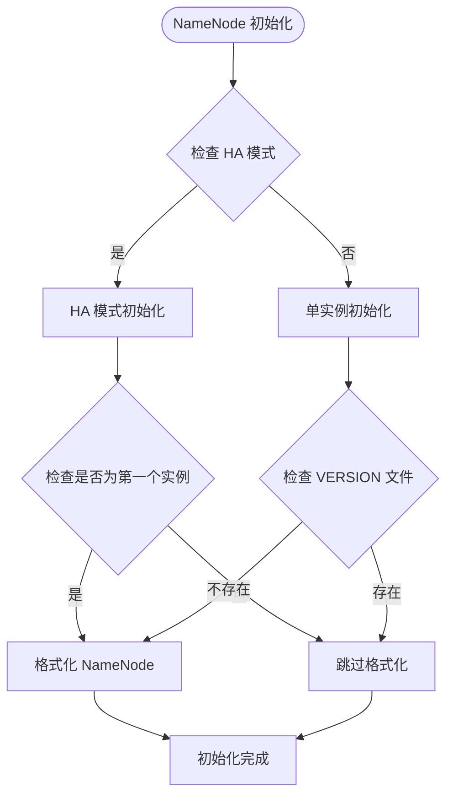

**图表来源**
- [namenode.go:328-358](file://hadoop-operator/internal/reconciler/namenode.go#L328-L358)

#### 配置生成机制

NameNode 协调器会根据集群配置生成 Hadoop 配置文件：

**章节来源**
- [namenode.go:117-317](file://hadoop-operator/internal/reconciler/namenode.go#L117-L317)

### DataNode 组件协调器

DataNode 协调器负责管理 HDFS 的 DataNode 组件，确保数据节点能够正确连接到 NameNode。

#### 核心功能
- **依赖等待**：通过 init container 等待 NameNode 就绪
- **权限管理**：设置正确的文件系统权限
- **存储配置**：配置 DataNode 的数据目录存储
- **健康检查**：实现 Liveness 和 Readiness 探针

#### 启动流程

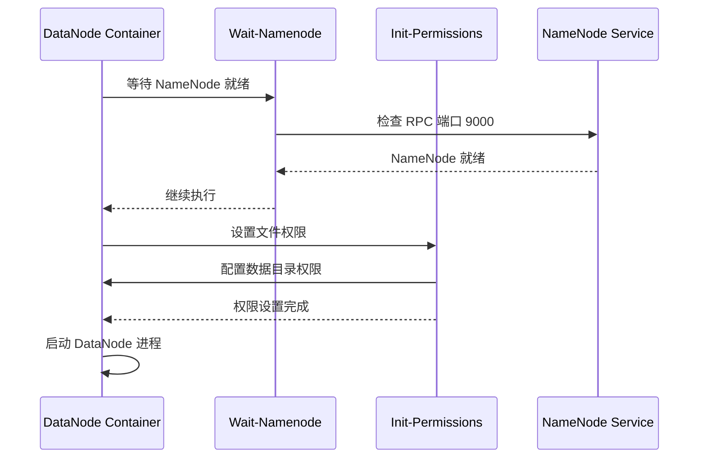

**图表来源**
- [datanode.go:184-191](file://hadoop-operator/internal/reconciler/datanode.go#L184-L191)

**章节来源**
- [datanode.go:116-321](file://hadoop-operator/internal/reconciler/datanode.go#L116-L321)

### ResourceManager 组件协调器

ResourceManager 协调器负责管理 YARN 的 ResourceManager 组件，支持高可用模式。

#### 核心功能
- **服务管理**：创建 ResourceManager 的 Headless 和外部服务
- **高可用支持**：配置多个 ResourceManager 实例
- **健康检查**：实现基于 REST API 的健康检查
- **配置注入**：通过环境变量传递配置信息

#### 高可用配置

ResourceManager 协调器支持两种高可用模式：

1. **基于 ZooKeeper 的自动故障转移**
2. **基于文件系统的手动切换**

**章节来源**
- [yarn.go:116-240](file://hadoop-operator/internal/reconciler/yarn.go#L116-L240)

### NodeManager 组件协调器

NodeManager 协调器负责管理 YARN 的 NodeManager 组件，确保计算节点能够正常工作。

#### 核心功能
- **依赖等待**：等待 ResourceManager 就绪
- **资源管理**：配置计算资源和内存限制
- **健康检查**：实现基于 REST API 的健康检查
- **配置挂载**：挂载 Hadoop 配置文件

#### 启动流程

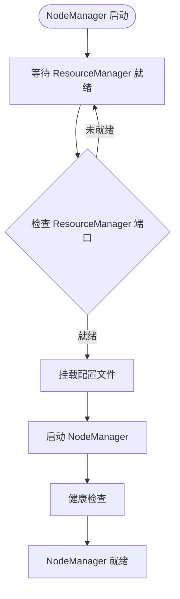

**图表来源**
- [yarn.go:367-374](file://hadoop-operator/internal/reconciler/yarn.go#L367-L374)

**章节来源**
- [yarn.go:313-447](file://hadoop-operator/internal/reconciler/yarn.go#L313-L447)

### 高可用协调器

高可用协调器负责管理 Hadoop 集群的高可用基础设施，包括 ZooKeeper 和 JournalNode。

#### ZooKeeper 集群管理

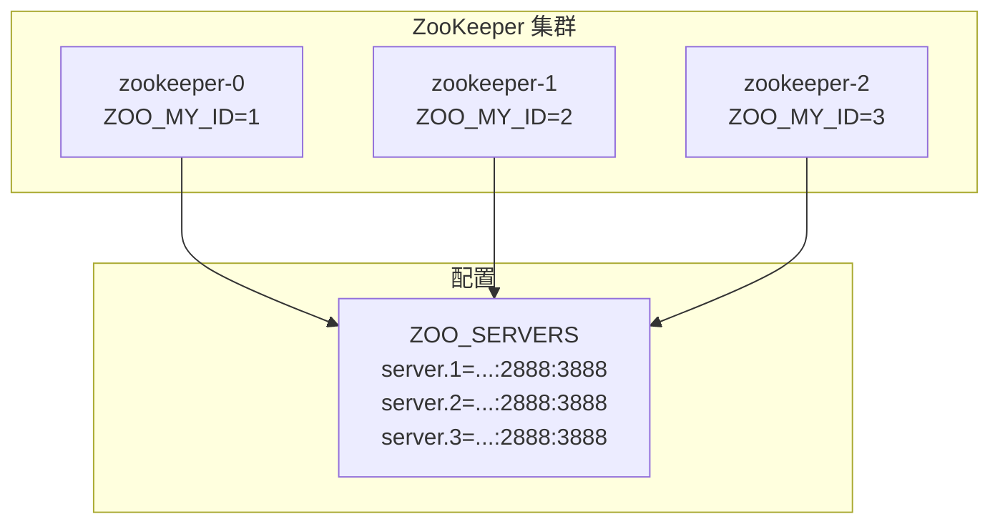

**图表来源**
- [ha.go:125-142](file://hadoop-operator/internal/reconciler/ha.go#L125-L142)

#### JournalNode 管理

JournalNode 协调器负责管理 HDFS HA 的编辑日志服务：

- **仲裁支持**：至少 3 个实例确保仲裁
- **存储配置**：独立的存储空间用于日志存储
- **健康检查**：基于 Web UI 的健康检查

**章节来源**
- [ha.go:35-177](file://hadoop-operator/internal/reconciler/ha.go#L35-L177)

### 配置管理协调器

配置管理协调器负责生成和维护 Hadoop 的配置文件，是所有组件协调器的基础。

#### 配置生成策略

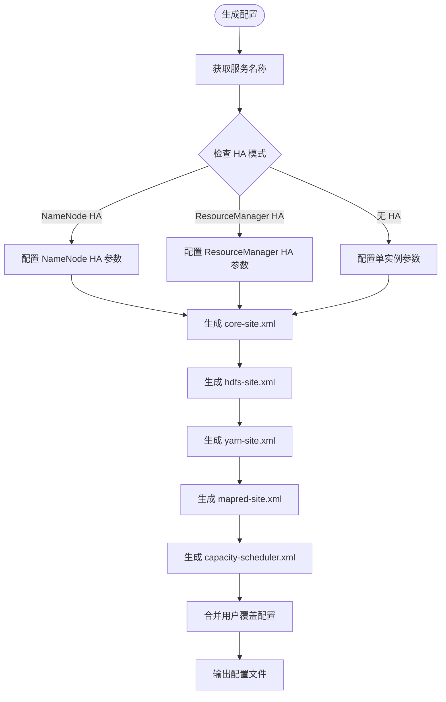

**图表来源**
- [configmap.go:70-209](file://hadoop-operator/internal/reconciler/configmap.go#L70-L209)

#### 配置覆盖机制

配置管理协调器支持用户自定义配置覆盖：

- **逐项覆盖**：用户可以在 CR 中指定特定配置项
- **XML 生成**：将配置转换为标准的 Hadoop XML 格式
- **动态更新**：当用户修改配置时，重新生成 ConfigMap

**章节来源**
- [configmap.go:44-68](file://hadoop-operator/internal/reconciler/configmap.go#L44-L68)

## 依赖关系分析

### 组件耦合度分析

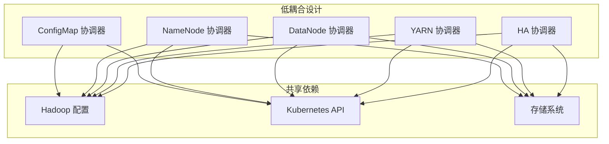

**图表来源**
- [hadoopcluster_controller.go:105-115](file://hadoop-operator/internal/controller/hadoopcluster_controller.go#L105-L115)

### 外部依赖关系

| 组件 | 外部依赖 | 用途 |
|------|----------|------|
| NameNode | HDFS 文件系统 | 存储元数据 |
| DataNode | HDFS 文件系统 | 存储数据块 |
| ResourceManager | YARN 调度器 | 集群资源管理 |
| NodeManager | YARN 调度器 | 计算资源执行 |
| ZooKeeper | 分布式协调 | HA 状态管理 |
| JournalNode | HDFS HA | 编辑日志同步 |

**章节来源**
- [hadoopcluster_types.go:61-187](file://hadoop-operator/api/v1/hadoopcluster_types.go#L61-L187)

## 性能考虑

### 资源优化策略

1. **存储优化**
   - 使用独立的 PVC 为每个组件分配专用存储
   - 支持多种 StorageClass 以适应不同存储后端
   - 配置合理的存储大小和访问模式

2. **网络优化**
   - 使用 Headless 服务确保稳定的 Pod DNS 名称
   - 配置适当的 Service 类型（ClusterIP、NodePort、LoadBalancer）
   - 优化端口映射以减少网络冲突

3. **资源限制**
   - 为每个组件设置合理的 CPU 和内存请求/限制
   - 支持亲和性和反亲和性配置
   - 提供默认资源配置作为最佳实践

### 启动性能优化

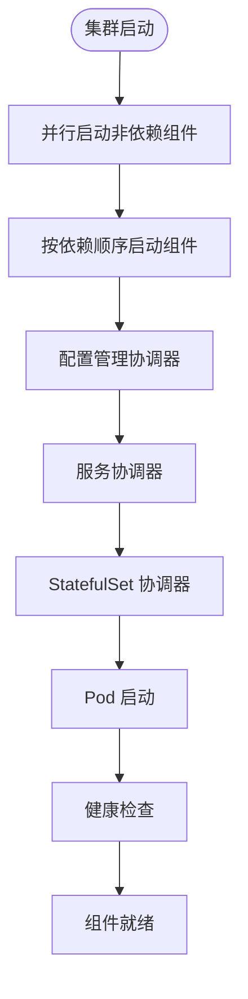

## 故障排查指南

### 常见问题诊断

#### NameNode 启动失败
1. **检查存储权限**
   ```bash
   kubectl exec -it <namenode-pod> -- ls -la /opt/hadoop/data/nn
   ```

2. **验证配置文件**
   ```bash
   kubectl exec -it <namenode-pod> -- cat /opt/hadoop/etc/hadoop/core-site.xml
   ```

3. **查看日志**
   ```bash
   kubectl logs <namenode-pod> -c namenode
   ```

#### DataNode 连接问题
1. **检查 NameNode 服务**
   ```bash
   kubectl get svc <cluster-name>-namenode
   kubectl get ep <cluster-name>-namenode
   ```

2. **验证网络连通性**
   ```bash
   kubectl exec -it <datanode-pod> -- nc -zv <namenode-service> 9000
   ```

3. **检查 DataNode 日志**
   ```bash
   kubectl logs <datanode-pod> -c datanode
   ```

#### ResourceManager HA 问题
1. **检查 ZooKeeper 集群**
   ```bash
   kubectl get pods -l app=zookeeper
   kubectl logs <zookeeper-pod>
   ```

2. **验证 JournalNode 状态**
   ```bash
   kubectl get pods -l app=hadoop-journalnode
   kubectl logs <journalnode-pod>
   ```

3. **检查 ResourceManager 配置**
   ```bash
   kubectl exec -it <resourcemanager-pod> -- cat /opt/hadoop/etc/hadoop/yarn-site.xml
   ```

### 错误处理机制

系统实现了多层次的错误处理：

1. **Reconcile 循环中的错误捕获**
   - 每个协调器都会返回错误信息
   - 主控制器记录事件并继续重试

2. **组件级别的健康检查**
   - Liveness 探针检测进程状态
   - Readiness 探针检测服务可用性
   - 自动重启失败的容器

3. **状态报告机制**
   - 更新 HadoopCluster 状态
   - 设置条件状态（Ready、Progressing、Degraded）
   - 提供详细的错误信息

**章节来源**
- [hadoopcluster_controller.go:169-227](file://hadoop-operator/internal/controller/hadoopcluster_controller.go#L169-L227)

## 结论

Apache Hadoop Operator v3 的组件协调器设计体现了现代 Kubernetes Operator 的最佳实践：

### 设计优势
- **模块化架构**：清晰的职责分离和低耦合设计
- **可扩展性**：统一的协调器接口便于添加新组件
- **高可用支持**：内置的 HA 机制确保集群可靠性
- **配置灵活性**：支持丰富的配置覆盖选项

### 技术亮点
- **阶段化部署**：确保组件间的正确启动顺序
- **智能配置生成**：根据集群状态动态生成配置
- **完善的错误处理**：多层次的错误检测和恢复机制
- **状态同步机制**：实时跟踪和报告组件状态

### 发展建议
1. **监控集成增强**：增加更详细的指标收集和告警
2. **安全加固**：完善 Kerberos、TLS 等安全特性的实现
3. **性能优化**：针对大规模集群的性能调优
4. **自动化运维**：增加自动备份、升级等运维功能

该设计为 Hadoop 在 Kubernetes 环境中的部署和管理提供了可靠的技术基础，适合生产环境的长期稳定运行。

## 附录

### 新组件协调器开发指南

#### 开发步骤
1. **创建协调器文件**
   ```go
   package reconciler
   
   func (r *HadoopClusterReconciler) reconcileNewComponent(ctx context.Context, cluster *hadoopv1.HadoopCluster) (ctrl.Result, error) {
       // 实现组件协调逻辑
   }
   ```

2. **注册协调器**
   ```go
   reconcilers := []reconciler.ComponentReconciler{
       r.reconcileConfigMap,
       r.reconcileNameNodeService,
       r.reconcileNameNode,
       r.reconcileNewComponent, // 添加新组件
   }
   ```

3. **实现配置生成**
   ```go
   func (r *HadoopClusterReconciler) generateNewComponentConfig(cluster *hadoopv1.HadoopCluster) map[string]string {
       // 生成组件配置
   }
   ```

#### 扩展点说明
- **配置覆盖**：支持用户自定义配置
- **健康检查**：实现 Liveness 和 Readiness 探针
- **存储管理**：支持 PVC 动态创建
- **服务暴露**：支持多种 Service 类型

### 配置参考

#### 基础配置示例
```yaml
apiVersion: hadoop.apache.org/v1
kind: HadoopCluster
metadata:
  name: hadoop-sample
spec:
  image:
    repository: apache/hadoop
    tag: "3.3.6"
    pullPolicy: IfNotPresent
  
  hdfs:
    nameNode:
      replicas: 1
      resources:
        requests:
          memory: "2Gi"
          cpu: "500m"
        limits:
          memory: "4Gi"
          cpu: "1000m"
      storage:
        size: "50Gi"
        storageClassName: standard
```

**章节来源**
- [hadoop_v1_hadoopcluster.yaml:1-81](file://hadoop-operator/config/samples/hadoop_v1_hadoopcluster.yaml#L1-L81)
- [hadoop_v1_hadoopcluster_ha.yaml:1-108](file://hadoop-operator/config/samples/hadoop_v1_hadoopcluster_ha.yaml#L1-L108)