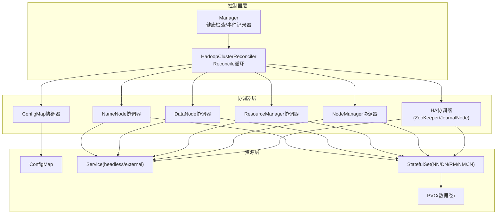
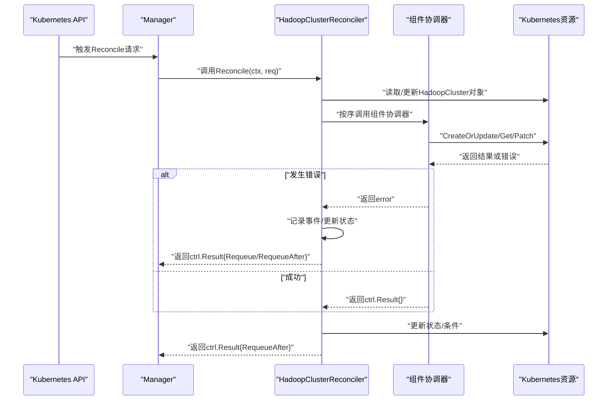
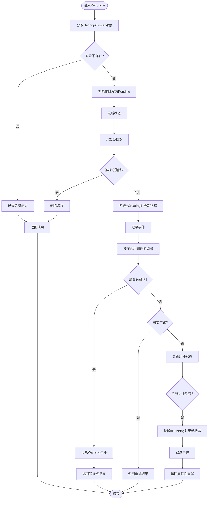
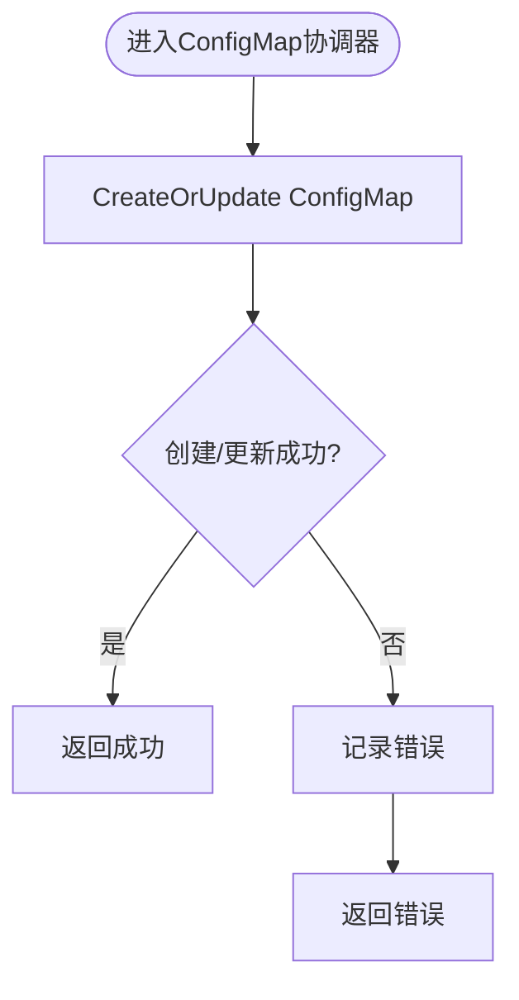
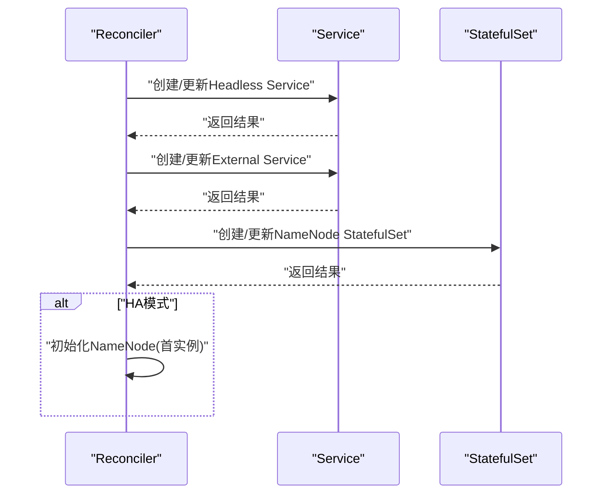
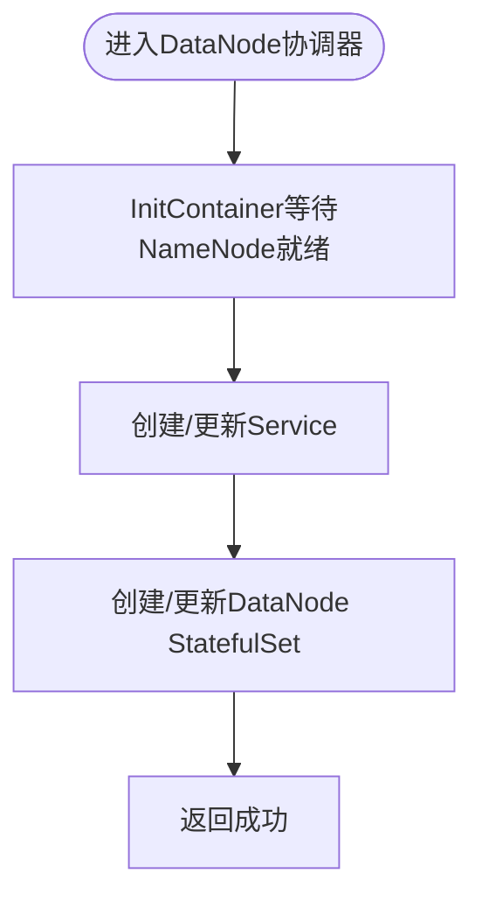
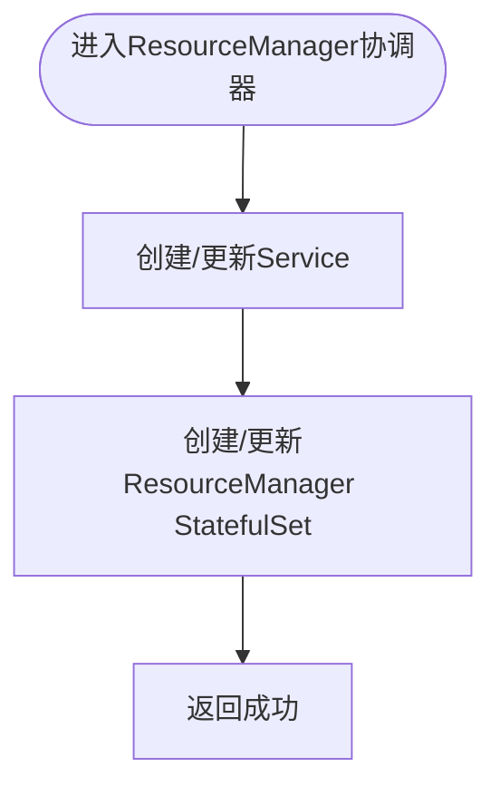
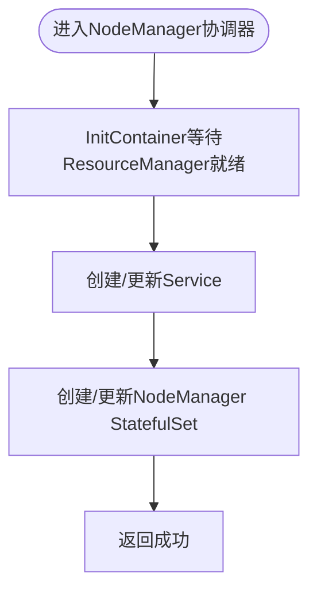
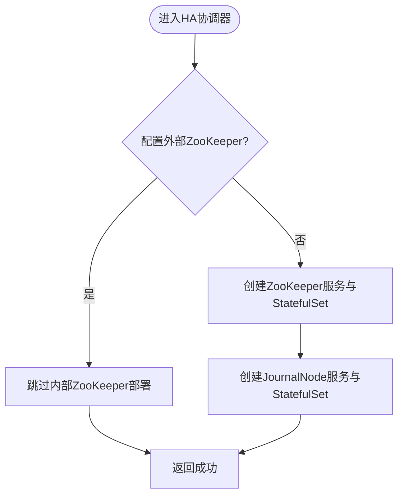
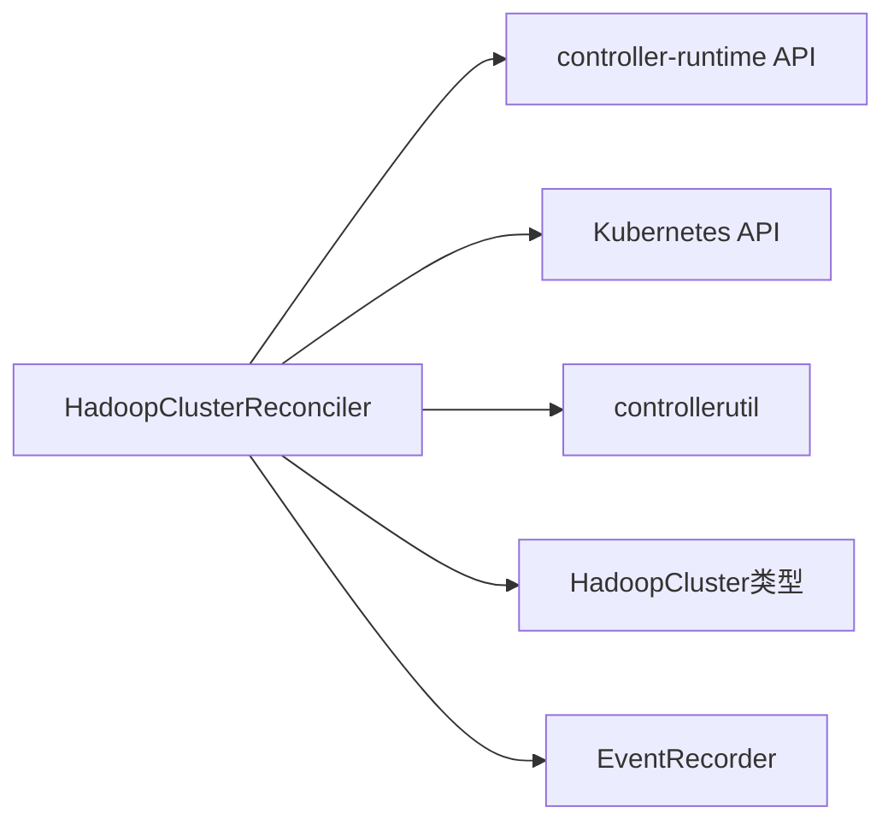

# 错误处理与重试机制

<cite>
**本文档引用的文件**
- [main.go](file://hadoop-operator/cmd/main.go)
- [hadoopcluster_controller.go](file://hadoop-operator/internal/controller/hadoopcluster_controller.go)
- [hadoopcluster_types.go](file://hadoop-operator/api/v1/hadoopcluster_types.go)
- [configmap.go](file://hadoop-operator/internal/reconciler/configmap.go)
- [namenode.go](file://hadoop-operator/internal/reconciler/namenode.go)
- [datanode.go](file://hadoop-operator/internal/reconciler/datanode.go)
- [ha.go](file://hadoop-operator/internal/reconciler/ha.go)
- [yarn.go](file://hadoop-operator/internal/reconciler/yarn.go)
- [README.md](file://hadoop-operator/README.md)
- [go.mod](file://hadoop-operator/go.mod)
</cite>

## 目录
1. [简介](#简介)
2. [项目结构](#项目结构)
3. [核心组件](#核心组件)
4. [架构总览](#架构总览)
5. [详细组件分析](#详细组件分析)
6. [依赖分析](#依赖分析)
7. [性能考虑](#性能考虑)
8. [故障排查指南](#故障排查指南)
9. [结论](#结论)
10. [附录](#附录)

## 简介
本文件聚焦于 Apache Hadoop Operator v3 的错误处理与重试机制，系统性阐述控制器中的错误分类、异常处理策略、恢复机制与重试策略实现。重点解释 Reconcile 方法中的错误传播、事件记录与状态更新逻辑，并结合各组件协调器（ConfigMap、NameNode、DataNode、ResourceManager、NodeManager、HA/ZooKeeper/JournalNode）的实现细节，给出常见错误场景的处理方案与故障诊断建议。同时提供错误监控与告警机制的实践路径，帮助运维人员快速定位与解决问题。

## 项目结构
- 控制器入口与管理器初始化位于命令入口文件中，负责启动 Manager、注册健康检查与事件记录器。
- 主控制器 HadoopClusterReconciler 实现 Reconcile 循环，按顺序调用各组件协调器，并进行状态更新与事件记录。
- 组件协调器分别负责 ConfigMap、服务、StatefulSet 等资源的创建/更新与错误处理。
- CRD 定义了 HadoopCluster 的规格与状态字段，为错误状态与条件信息提供载体。

**图表来源**
- [main.go:97-148](file://hadoop-operator/cmd/main.go#L97-L148)
- [hadoopcluster_controller.go:104-144](file://hadoop-operator/internal/controller/hadoopcluster_controller.go#L104-L144)
- [configmap.go:44-68](file://hadoop-operator/internal/reconciler/configmap.go#L44-L68)
- [namenode.go:36-114](file://hadoop-operator/internal/reconciler/namenode.go#L36-L114)
- [datanode.go:35-113](file://hadoop-operator/internal/reconciler/datanode.go#L35-L113)
- [yarn.go:35-113](file://hadoop-operator/internal/reconciler/yarn.go#L35-L113)
- [ha.go:35-177](file://hadoop-operator/internal/reconciler/ha.go#L35-L177)

**章节来源**
- [main.go:54-148](file://hadoop-operator/cmd/main.go#L54-L148)
- [hadoopcluster_controller.go:41-239](file://hadoop-operator/internal/controller/hadoopcluster_controller.go#L41-L239)

## 核心组件
- 控制器入口与管理器：负责初始化 Scheme、创建 Manager、注册健康检查与事件记录器，确保 Operator 正常运行。
- 主控制器 Reconciler：实现 Reconcile 循环，按顺序执行组件协调器，处理删除流程、阶段转换、状态更新与事件记录。
- 组件协调器：封装各组件（ConfigMap、NameNode、DataNode、ResourceManager、NodeManager、HA）的创建/更新逻辑与错误处理。
- CRD 类型：定义 HadoopCluster 的规格与状态，包含阶段、条件、各组件状态等字段，支撑错误状态与恢复判断。

**章节来源**
- [main.go:47-148](file://hadoop-operator/cmd/main.go#L47-L148)
- [hadoopcluster_controller.go:41-239](file://hadoop-operator/internal/controller/hadoopcluster_controller.go#L41-L239)
- [hadoopcluster_types.go:297-389](file://hadoop-operator/api/v1/hadoopcluster_types.go#L297-L389)

## 架构总览
控制器采用 controller-runtime 的 Reconcile 模式，通过 Manager 管理生命周期与健康检查，Reconciler 以幂等方式协调资源，确保期望状态与实际状态一致。错误处理遵循“失败即返回”的原则，配合事件记录器与状态更新，形成闭环的可观测性与可恢复性。

**图表来源**
- [hadoopcluster_controller.go:60-144](file://hadoop-operator/internal/controller/hadoopcluster_controller.go#L60-L144)
- [configmap.go:44-68](file://hadoop-operator/internal/reconciler/configmap.go#L44-L68)
- [namenode.go:117-317](file://hadoop-operator/internal/reconciler/namenode.go#L117-L317)
- [datanode.go:116-321](file://hadoop-operator/internal/reconciler/datanode.go#L116-L321)
- [yarn.go:116-240](file://hadoop-operator/internal/reconciler/yarn.go#L116-L240)
- [ha.go:179-363](file://hadoop-operator/internal/reconciler/ha.go#L179-L363)

## 详细组件分析

### Reconcile 方法与错误传播
- 资源获取失败：当目标 HadoopCluster 对象不存在时，记录信息并直接返回，避免重复处理；若因其他原因获取失败，则记录错误并返回，由框架决定是否重试。
- 初始状态设置：若未设置阶段，初始化为 Pending 并立即更新状态，确保后续流程有明确起点。
- 清理终结器：在删除流程中设置删除阶段并移除终结器，保证资源清理。
- 阶段推进：从 Pending 到 Creating，再到 Running，期间记录事件并更新状态。
- 组件顺序：依次调用 ConfigMap、NameNode 服务、NameNode、DataNode 服务、DataNode、ResourceManager 服务、ResourceManager、NodeManager 服务、NodeManager 协调器。
- 错误传播：任一协调器返回错误时，记录 Warning 事件并立即返回，交由框架控制重试；若返回 Requeue/RequeueAfter，则提前结束本次循环。
- 状态更新：在所有组件协调完成后，更新各组件 ReadyReplicas、条件等状态信息；若全部组件就绪，切换到 Running 阶段并记录事件。

**图表来源**
- [hadoopcluster_controller.go:60-144](file://hadoop-operator/internal/controller/hadoopcluster_controller.go#L60-L144)
- [hadoopcluster_controller.go:149-167](file://hadoop-operator/internal/controller/hadoopcluster_controller.go#L149-L167)
- [hadoopcluster_controller.go:176-227](file://hadoop-operator/internal/controller/hadoopcluster_controller.go#L176-L227)

**章节来源**
- [hadoopcluster_controller.go:60-144](file://hadoop-operator/internal/controller/hadoopcluster_controller.go#L60-L144)
- [hadoopcluster_controller.go:149-167](file://hadoop-operator/internal/controller/hadoopcluster_controller.go#L149-L167)
- [hadoopcluster_controller.go:176-227](file://hadoop-operator/internal/controller/hadoopcluster_controller.go#L176-L227)

### ConfigMap 协调器
- 功能：生成 Hadoop 配置（core-site.xml、hdfs-site.xml、yarn-site.xml、mapred-site.xml、capacity-scheduler.xml），写入 ConfigMap 并建立控制器引用。
- 错误处理：CreateOrUpdate 失败时记录错误并返回，交由上层 Reconcile 决定重试策略。
- 配置生成：根据 HA 模式与用户覆盖配置生成最终 XML 内容。

**图表来源**
- [configmap.go:44-68](file://hadoop-operator/internal/reconciler/configmap.go#L44-L68)

**章节来源**
- [configmap.go:44-68](file://hadoop-operator/internal/reconciler/configmap.go#L44-L68)
- [configmap.go:70-209](file://hadoop-operator/internal/reconciler/configmap.go#L70-L209)

### NameNode 协调器
- 功能：创建 Headless 与外部 Service，创建 StatefulSet（含 InitContainer 初始化与权限设置、探针配置、卷挂载等）。
- 错误处理：Service/StatefulSet CreateOrUpdate 失败时记录错误并返回；NameNode HA 模式下自动调整副本数。
- HA 支持：根据配置启用 HA，必要时格式化 NameNode（单实例或首实例）。

**图表来源**
- [namenode.go:36-114](file://hadoop-operator/internal/reconciler/namenode.go#L36-L114)
- [namenode.go:117-317](file://hadoop-operator/internal/reconciler/namenode.go#L117-L317)

**章节来源**
- [namenode.go:36-114](file://hadoop-operator/internal/reconciler/namenode.go#L36-L114)
- [namenode.go:117-317](file://hadoop-operator/internal/reconciler/namenode.go#L117-L317)

### DataNode 协调器
- 功能：创建 Headless 与外部 Service，创建 StatefulSet（含等待 NameNode 就绪的 InitContainer、权限初始化、探针配置、卷挂载等）。
- 错误处理：Service/StatefulSet CreateOrUpdate 失败时记录错误并返回；DataNode 通过 nc 检测 NameNode 端口 9000 确保依赖就绪。
- 依赖等待：InitContainer 中等待 NameNode 可达后才启动 DataNode。

**图表来源**
- [datanode.go:116-321](file://hadoop-operator/internal/reconciler/datanode.go#L116-L321)

**章节来源**
- [datanode.go:116-321](file://hadoop-operator/internal/reconciler/datanode.go#L116-L321)

### ResourceManager 协调器
- 功能：创建 Headless 与外部 Service，创建 StatefulSet（含探针配置、卷挂载等）。
- 错误处理：Service/StatefulSet CreateOrUpdate 失败时记录错误并返回；ResourceManager HA 模式下自动调整副本数。
- 依赖等待：NodeManager 通过 InitContainer 等待 ResourceManager 就绪后再启动。

**图表来源**
- [yarn.go:116-240](file://hadoop-operator/internal/reconciler/yarn.go#L116-L240)

**章节来源**
- [yarn.go:116-240](file://hadoop-operator/internal/reconciler/yarn.go#L116-L240)

### NodeManager 协调器
- 功能：创建 Headless 与外部 Service，创建 StatefulSet（含等待 ResourceManager 就绪的 InitContainer、探针配置、卷挂载等）。
- 错误处理：Service/StatefulSet CreateOrUpdate 失败时记录错误并返回。
- 依赖等待：InitContainer 中等待 ResourceManager 可达后才启动 NodeManager。

**图表来源**
- [yarn.go:313-447](file://hadoop-operator/internal/reconciler/yarn.go#L313-L447)

**章节来源**
- [yarn.go:313-447](file://hadoop-operator/internal/reconciler/yarn.go#L313-L447)

### HA/ZooKeeper/JournalNode 协调器
- 功能：根据配置选择外部或内部 ZooKeeper；创建 ZooKeeper 服务与 StatefulSet；创建 JournalNode 服务与 StatefulSet（HA 模式下）。
- 错误处理：服务/StatefulSet CreateOrUpdate 失败时记录错误并返回；内部 ZooKeeper 默认副本数为 3，JournalNode 最小副本数为 3。
- 服务器列表：生成 ZooKeeper 服务器列表供 NameNode/ResourceManager HA 使用。

**图表来源**
- [ha.go:35-177](file://hadoop-operator/internal/reconciler/ha.go#L35-L177)
- [ha.go:179-363](file://hadoop-operator/internal/reconciler/ha.go#L179-L363)

**章节来源**
- [ha.go:35-177](file://hadoop-operator/internal/reconciler/ha.go#L35-L177)
- [ha.go:179-363](file://hadoop-operator/internal/reconciler/ha.go#L179-L363)

## 依赖分析
- 控制器依赖 controller-runtime 的 Reconcile 模式与客户端库，通过 CreateOrUpdate 实现幂等操作。
- 组件协调器依赖 Kubernetes API（Service、StatefulSet、ConfigMap、PVC）与 controllerutil 工具函数。
- CRD 类型定义了 HadoopCluster 的状态字段，为错误状态与恢复判断提供依据。
- 事件记录器用于记录 Warning/Normal 事件，便于审计与排障。

**图表来源**
- [hadoopcluster_controller.go:19-38](file://hadoop-operator/internal/controller/hadoopcluster_controller.go#L19-L38)
- [hadoopcluster_types.go:297-389](file://hadoop-operator/api/v1/hadoopcluster_types.go#L297-L389)

**章节来源**
- [hadoopcluster_controller.go:19-38](file://hadoop-operator/internal/controller/hadoopcluster_controller.go#L19-L38)
- [hadoopcluster_types.go:297-389](file://hadoop-operator/api/v1/hadoopcluster_types.go#L297-L389)

## 性能考虑
- Reconcile 周期：默认每 30 秒重试一次，避免频繁轮询造成资源压力。
- 组件顺序：按依赖顺序执行，减少因依赖未就绪导致的无效重试。
- 幂等操作：通过 CreateOrUpdate 降低重复创建成本。
- 探针配置：合理的 Liveness/Readiness 探针有助于快速发现异常并触发重建。

[本节为通用性能讨论，不直接分析具体文件]

## 故障排查指南

### 常见错误场景与处理方案
- 资源不存在
  - 现象：Reconcile 获取对象失败且为 NotFound。
  - 处理：记录忽略信息并返回成功，避免重复处理。
  - 参考路径：[hadoopcluster_controller.go:65-72](file://hadoop-operator/internal/controller/hadoopcluster_controller.go#L65-L72)

- 权限不足
  - 现象：创建/更新资源时返回权限相关错误。
  - 处理：检查 RBAC 配置与 ServiceAccount 权限；确认 Operator 具备对 CRD、Service、StatefulSet、ConfigMap、PVC 的相应权限。
  - 参考路径：[hadoopcluster_controller.go:48-56](file://hadoop-operator/internal/controller/hadoopcluster_controller.go#L48-L56)

- 网络异常
  - 现象：DataNode/NodeManager 等组件等待依赖服务超时。
  - 处理：检查服务名称、命名空间与端口；验证 Service 是否就绪；使用 nc 检查端口可达性。
  - 参考路径：
    - [datanode.go:184-191](file://hadoop-operator/internal/reconciler/datanode.go#L184-L191)
    - [yarn.go:367-374](file://hadoop-operator/internal/reconciler/yarn.go#L367-L374)

- 镜像拉取失败
  - 现象：Pod 拉取镜像失败。
  - 处理：检查镜像仓库、PullSecrets 与网络连通性。
  - 参考路径：[README.md:310-318](file://hadoop-operator/README.md#L310-L318)

- NameNode 格式化失败
  - 现象：首次启动 NameNode 失败。
  - 处理：检查 PVC 与存储类；必要时手动格式化（谨慎操作）。
  - 参考路径：[README.md:290-298](file://hadoop-operator/README.md#L290-L298)

- 配置错误
  - 现象：Hadoop 配置不生效或冲突。
  - 处理：检查 ConfigMap 内容与用户覆盖项；确认配置生成逻辑。
  - 参考路径：
    - [configmap.go:70-209](file://hadoop-operator/internal/reconciler/configmap.go#L70-L209)
    - [configmap.go:211-222](file://hadoop-operator/internal/reconciler/configmap.go#L211-L222)

### 错误监控与告警
- 事件记录：控制器在 Reconcile 出错时记录 Warning 事件，在阶段转换时记录 Normal 事件，便于审计与排障。
- 健康检查：Manager 提供 healthz/readyz 接口，可用于存活与就绪探测。
- 状态更新：通过 Status().Update 更新 Phase、Conditions 与各组件状态，形成可观测的错误状态。
- 建议：结合 Prometheus 与 ServiceMonitor（若启用）收集指标，设置基于事件与状态变化的告警规则。

**章节来源**
- [hadoopcluster_controller.go:101-102](file://hadoop-operator/internal/controller/hadoopcluster_controller.go#L101-L102)
- [hadoopcluster_controller.go:137-141](file://hadoop-operator/internal/controller/hadoopcluster_controller.go#L137-L141)
- [hadoopcluster_controller.go:176-227](file://hadoop-operator/internal/controller/hadoopcluster_controller.go#L176-L227)
- [main.go:135-142](file://hadoop-operator/cmd/main.go#L135-L142)

## 结论
本项目通过 controller-runtime 的 Reconcile 模式实现了高可用的 Hadoop 集群编排。错误处理遵循“失败即返回”的原则，配合事件记录器与状态更新，形成闭环的可观测性与可恢复性。组件协调器以幂等方式管理资源，依赖等待与探针配置提升了系统的稳定性。建议在生产环境中结合健康检查、事件与状态监控，建立完善的告警体系，以快速响应与恢复异常情况。

[本节为总结性内容，不直接分析具体文件]

## 附录
- 项目版本与依赖：Go 1.21，controller-runtime v0.17.0，Kubernetes API v0.29.0。
- 快速开始与示例：参考 README 中的安装与部署步骤，使用示例 CRD 验证功能。

**章节来源**
- [go.mod:3-10](file://hadoop-operator/go.mod#L3-L10)
- [README.md:15-82](file://hadoop-operator/README.md#L15-L82)