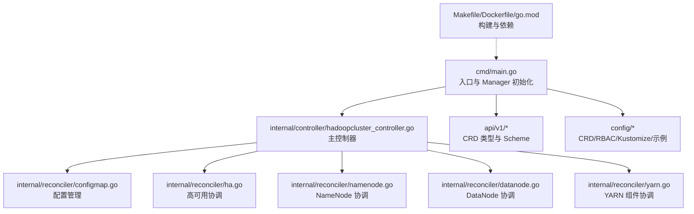
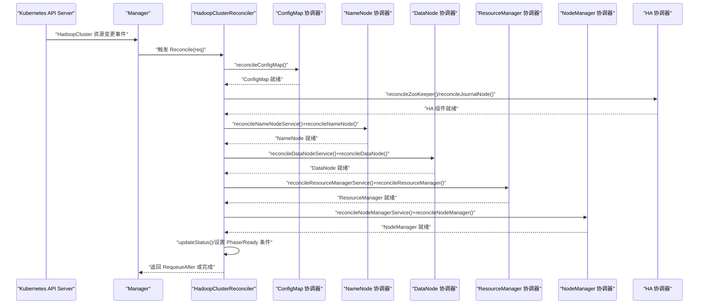
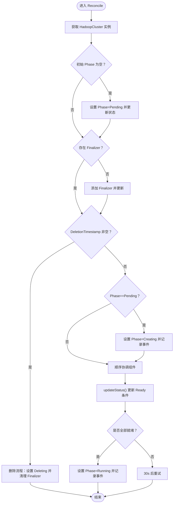
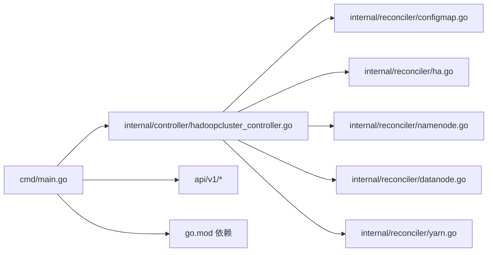

# 开发指南

<cite>
**本文引用的文件**   
- [README.md](file://README.md)
- [go.mod](file://go.mod)
- [Makefile](file://Makefile)
- [Dockerfile](file://Dockerfile)
- [cmd/main.go](file://cmd/main.go)
- [api/v1/groupversion_info.go](file://api/v1/groupversion_info.go)
- [api/v1/hadoopcluster_types.go](file://api/v1/hadoopcluster_types.go)
- [internal/controller/hadoopcluster_controller.go](file://internal/controller/hadoopcluster_controller.go)
- [internal/reconciler/configmap.go](file://internal/reconciler/configmap.go)
- [internal/reconciler/ha.go](file://internal/reconciler/ha.go)
- [internal/reconciler/namenode.go](file://internal/reconciler/namenode.go)
- [internal/reconciler/datanode.go](file://internal/reconciler/datanode.go)
- [internal/reconciler/yarn.go](file://internal/reconciler/yarn.go)
- [config/samples/hadoop_v1_hadoopcluster.yaml](file://config/samples/hadoop_v1_hadoopcluster.yaml)
- [hack/offline/save-images.sh](file://hack/offline/save-images.sh)
</cite>

## 目录
1. [简介](#简介)
2. [项目结构](#项目结构)
3. [核心组件](#核心组件)
4. [架构总览](#架构总览)
5. [详细组件分析](#详细组件分析)
6. [依赖分析](#依赖分析)
7. [性能考虑](#性能考虑)
8. [故障排查指南](#故障排查指南)
9. [结论](#结论)
10. [附录](#附录)

## 简介
本指南面向 Apache Hadoop Operator v3 的开发者与维护者，系统阐述项目结构、代码组织方式、开发与测试流程、构建与打包流程、Docker 镜像构建、本地开发与测试环境配置，并深入解析控制器架构、Reconciler 模式与 Kubernetes API 使用方式。同时提供扩展点与自定义开发方法、代码规范与最佳实践，以及常见问题的解决方案。

## 项目结构
该项目采用基于模块的分层组织方式，遵循 Kubebuilder 生成的典型布局：
- cmd/main.go：Operator 入口，初始化 Manager、注册控制器与 Webhook、健康检查与指标服务
- api/v1：CRD 类型定义与 Scheme 注册
- internal/controller：主控制器（HadoopClusterReconciler），负责协调与状态更新
- internal/reconciler：按组件拆分的协调器（ConfigMap、NameNode、DataNode、ResourceManager、NodeManager、HA）
- config：CRD、RBAC、示例与 Kustomize 配置
- hack/offline：离线部署脚本（镜像导出/导入）
- Makefile、Dockerfile、go.mod：构建与打包工具链

图表来源
- [cmd/main.go:54-149](file://cmd/main.go#L54-L149)
- [internal/controller/hadoopcluster_controller.go:104-144](file://internal/controller/hadoopcluster_controller.go#L104-L144)
- [internal/reconciler/configmap.go:44-68](file://internal/reconciler/configmap.go#L44-L68)
- [internal/reconciler/ha.go:35-176](file://internal/reconciler/ha.go#L35-L176)
- [internal/reconciler/namenode.go:36-114](file://internal/reconciler/namenode.go#L36-L114)
- [internal/reconciler/datanode.go:35-113](file://internal/reconciler/datanode.go#L35-L113)
- [internal/reconciler/yarn.go:35-113](file://internal/reconciler/yarn.go#L35-L113)

章节来源
- [README.md:233-251](file://README.md#L233-L251)
- [Makefile:24-96](file://Makefile#L24-L96)
- [Dockerfile:1-34](file://Dockerfile#L1-L34)
- [go.mod:1-69](file://go.mod#L1-L69)

## 核心组件
- 入口与 Manager
  - 初始化 Scheme，注册 CRD 类型与内置类型
  - 配置 Metrics、Webhook、健康检查、LeaderElection
  - 创建并注册 HadoopClusterReconciler 控制器
- 主控制器（HadoopClusterReconciler）
  - 实现 Reconcile 循环，顺序协调各组件
  - 管理 Finalizer、删除流程、状态更新与 Ready 条件
  - 通过 Owned 资源（StatefulSet/Service/ConfigMap/PVC）进行生命周期管理
- Reconciler 分层
  - ConfigMap：生成 Hadoop 配置（core-site、hdfs-site、yarn-site、mapred-site、capacity-scheduler）
  - HA：根据配置选择外部或内部 ZooKeeper，协调 JournalNode
  - NameNode/DataNode/YARN：分别创建 Headless/External Service 与 StatefulSet，注入 ConfigMap、PVC、探针与资源限制
- CRD 类型
  - HadoopClusterSpec：镜像、HDFS、YARN、配置覆盖、安全、监控等
  - HadoopClusterStatus：阶段、条件、各组件就绪状态

章节来源
- [cmd/main.go:47-149](file://cmd/main.go#L47-L149)
- [internal/controller/hadoopcluster_controller.go:41-239](file://internal/controller/hadoopcluster_controller.go#L41-L239)
- [api/v1/hadoopcluster_types.go:24-46](file://api/v1/hadoopcluster_types.go#L24-L46)
- [api/v1/hadoopcluster_types.go:297-315](file://api/v1/hadoopcluster_types.go#L297-L315)

## 架构总览
Operator 以 Reconciler 为核心，通过 Manager 统一调度，对 HadoopCluster 资源进行持续协调，确保 Kubernetes 中的期望状态与实际状态一致。协调过程包括：创建/更新 ConfigMap、Headless/External Service、StatefulSet、PVC；在 HA 模式下创建 ZooKeeper/JournalNode；最后更新 Status 与 Ready 条件。

图表来源
- [internal/controller/hadoopcluster_controller.go:104-144](file://internal/controller/hadoopcluster_controller.go#L104-L144)
- [internal/reconciler/configmap.go:44-68](file://internal/reconciler/configmap.go#L44-L68)
- [internal/reconciler/ha.go:35-176](file://internal/reconciler/ha.go#L35-L176)
- [internal/reconciler/namenode.go:36-114](file://internal/reconciler/namenode.go#L36-L114)
- [internal/reconciler/datanode.go:35-113](file://internal/reconciler/datanode.go#L35-L113)
- [internal/reconciler/yarn.go:35-113](file://internal/reconciler/yarn.go#L35-L113)

## 详细组件分析

### 主控制器：HadoopClusterReconciler
- 关键职责
  - 获取/校验 HadoopCluster 实例
  - 设置初始 Phase 与 Finalizer
  - 删除流程处理（Phase=Deleting，移除 Finalizer）
  - 顺序协调各组件（ConfigMap → NameNode → DataNode → ResourceManager → NodeManager）
  - 更新 Status（各组件 ReadyReplicas、Conditions）
  - Ready 判定：所有组件至少 1 个就绪
- RBAC 权限
  - 对 HadoopCluster、StatefulSet、Deployment、Service、ConfigMap、PVC、Event 的 CRUD 权限
- OwnerReference
  - 通过 Owned 关系管理子资源生命周期

图表来源
- [internal/controller/hadoopcluster_controller.go:60-227](file://internal/controller/hadoopcluster_controller.go#L60-L227)

章节来源
- [internal/controller/hadoopcluster_controller.go:41-239](file://internal/controller/hadoopcluster_controller.go#L41-L239)

### ConfigMap 协调器
- 生成 Hadoop 配置
  - core-site：默认 fs.defaultFS、代理用户、HA 场景下 zookeeper quorum
  - hdfs-site：NameNode/DataNode 数据目录、HA 参数（nameservices、ha.namenodes、rpc/http 地址、自动故障转移）
  - yarn-site：ResourceManager 地址、HA 参数（zk 地址、rm-ids、webapp 地址）
  - mapred-site：框架名与环境变量
  - capacity-scheduler：默认队列与容量参数
- 用户覆盖：支持在 CRD spec.config 下覆盖上述配置项
- XML 生成：统一生成 XML 字符串写入 ConfigMap

章节来源
- [internal/reconciler/configmap.go:44-209](file://internal/reconciler/configmap.go#L44-L209)
- [internal/reconciler/configmap.go:211-246](file://internal/reconciler/configmap.go#L211-L246)

### HA 协调器
- 外部 ZooKeeper
  - 若配置了 connectionString，则直接使用外部 ZooKeeper，跳过内部部署
- 内部 ZooKeeper
  - Headless Service（2181/2888/3888）
  - StatefulSet（3 副本），持久卷 10Gi，环境变量 ZOO_MY_ID、ZOO_SERVERS
  - ZOO_SERVERS 由 getZooKeeperServers 生成
- JournalNode
  - HA 启用时创建 Headless Service（8485/8480）与 StatefulSet（默认 3 副本）
  - 挂载 hadoop-config 与 journal 数据卷

章节来源
- [internal/reconciler/ha.go:35-177](file://internal/reconciler/ha.go#L35-L177)
- [internal/reconciler/ha.go:179-363](file://internal/reconciler/ha.go#L179-L363)
- [internal/reconciler/ha.go:383-394](file://internal/reconciler/ha.go#L383-L394)

### NameNode 协调器
- Service
  - Headless Service（rpc=9000、web=9870）
  - External Service（默认 NodePort，支持自定义 NodePorts）
- StatefulSet
  - 默认副本 1，HA 模式下最少 2
  - InitContainer：格式化 NameNode（HA 模式下仅首实例执行）
  - 主容器：启动 hdfs namenode，挂载 hadoop-config、logs、PVC
  - 探针：/jmx，健康与就绪
  - 资源：requests/limits 默认值
  - 存储：默认 20Gi，支持 StorageClassName 与 AccessMode

章节来源
- [internal/reconciler/namenode.go:36-114](file://internal/reconciler/namenode.go#L36-L114)
- [internal/reconciler/namenode.go:117-317](file://internal/reconciler/namenode.go#L117-L317)
- [internal/reconciler/namenode.go:328-362](file://internal/reconciler/namenode.go#L328-L362)

### DataNode 协调器
- Service
  - Headless Service（data=9866、web=9864）
  - External Service（默认 NodePort）
- StatefulSet
  - 默认副本 3
  - InitContainers：
    - wait-for-namenode：等待 NameNode 可达
    - init-permissions：准备数据目录权限
  - 主容器：启动 hdfs datanode，挂载 hadoop-config、PVC
  - 探针：/，健康与就绪
  - 资源与存储默认值同 NameNode

章节来源
- [internal/reconciler/datanode.go:35-113](file://internal/reconciler/datanode.go#L35-L113)
- [internal/reconciler/datanode.go:116-321](file://internal/reconciler/datanode.go#L116-L321)

### YARN 协调器
- ResourceManager
  - Service：headless（rpc=8032、web=8088），External Service（默认 NodePort）
  - StatefulSet：默认副本 1，HA 模式下最少 2
  - 主容器：yarn resourcemanager，挂载 hadoop-config
  - 探针：/ws/v1/cluster/info
- NodeManager
  - Service：headless（web=8042），External Service（默认 NodePort）
  - StatefulSet：默认副本 2
  - InitContainer：wait-for-resourcemanager
  - 主容器：yarn nodemanager，挂载 hadoop-config
  - 探针：/node

章节来源
- [internal/reconciler/yarn.go:35-113](file://internal/reconciler/yarn.go#L35-L113)
- [internal/reconciler/yarn.go:116-240](file://internal/reconciler/yarn.go#L116-L240)
- [internal/reconciler/yarn.go:243-310](file://internal/reconciler/yarn.go#L243-L310)
- [internal/reconciler/yarn.go:313-447](file://internal/reconciler/yarn.go#L313-L447)

### CRD 类型与状态模型
- HadoopClusterSpec
  - Image：镜像仓库、标签、拉取策略、拉取密钥
  - HDFS：NameNode、DataNode 配置（副本、资源、存储、服务、HA、亲和性、容忍度）
  - YARN：ResourceManager、NodeManager 配置（副本、资源、服务、HA、亲和性、容忍度）
  - Config：coreSite、hdfsSite、yarnSite、mapredSite、capacityScheduler 覆盖
  - Security：Kerberos、TLS、Ranger 预留
  - Metrics：Prometheus 指标与 ServiceMonitor
- HadoopClusterStatus
  - Phase：Pending/Created/Running/Failed/Deleting/Upgrading
  - Conditions：Ready/Progressing/Degraded
  - 各组件 Status：ReadyReplicas/Replicas、活跃/备用节点信息

章节来源
- [api/v1/hadoopcluster_types.go:24-46](file://api/v1/hadoopcluster_types.go#L24-L46)
- [api/v1/hadoopcluster_types.go:297-315](file://api/v1/hadoopcluster_types.go#L297-L315)
- [api/v1/hadoopcluster_types.go:317-345](file://api/v1/hadoopcluster_types.go#L317-L345)
- [api/v1/hadoopcluster_types.go:347-389](file://api/v1/hadoopcluster_types.go#L347-L389)

## 依赖分析
- 语言与版本
  - Go 1.21
  - controller-runtime v0.17.0
  - Kubernetes API v0.29.0
- 关键依赖
  - k8s.io/api、k8s.io/apimachinery、k8s.io/client-go
  - sigs.k8s.io/controller-runtime
  - Prometheus 客户端（间接）
- 项目内依赖关系
  - cmd/main.go 依赖 api/v1 与 internal/controller
  - internal/controller 依赖 internal/reconciler
  - internal/reconciler 依赖 api/v1 类型与 controller-runtime

图表来源
- [go.mod:5-10](file://go.mod#L5-L10)
- [cmd/main.go:37-39](file://cmd/main.go#L37-L39)
- [internal/controller/hadoopcluster_controller.go:37-38](file://internal/controller/hadoopcluster_controller.go#L37-L38)

章节来源
- [go.mod:1-69](file://go.mod#L1-L69)

## 性能考虑
- 资源配额
  - 各组件默认 requests/limits 提供基础隔离，建议结合集群规模与负载调整
- 探针频率
  - Liveness/Readiness 探针周期适中，避免过于频繁导致额外开销
- 存储
  - PVC 默认大小与 StorageClass 影响 I/O 与成本，建议按数据量与 SLA 评估
- HA 组件
  - ZooKeeper 3 副本与 JournalNode 3 副本满足最小仲裁，建议在跨可用区部署提升可靠性
- 指标与健康检查
  - 启用 metrics 与 health/readyz 检查，便于运维观测与自动恢复

## 故障排查指南
- 常见问题定位
  - Pod 启动失败：查看 Pod 事件与上一次容器日志
  - NameNode 格式化失败：检查 PVC 状态与手动格式化命令
  - DataNode 无法连接 NameNode：使用网络探测确认连通性，核对 ConfigMap
  - 镜像拉取失败：验证镜像存在与 Secret 配置
- 建议流程
  - 使用 kubectl describe/ logs 定位具体组件
  - 检查 HadoopCluster 状态与 Conditions
  - 核对 ConfigMap 生成内容与 CRD 配置覆盖

章节来源
- [README.md:276-318](file://README.md#L276-L318)

## 结论
本指南从架构、组件、流程与工具链四个维度梳理了 Apache Hadoop Operator v3 的开发要点。通过清晰的 Reconciler 分层与完善的 CRD 模型，Operator 能够稳定地在 Kubernetes 上部署与管理 Hadoop 集群。建议在开发过程中严格遵循 RBAC、资源与探针配置的最佳实践，并结合离线部署工具链完善交付流程。

## 附录

### 开发环境搭建
- 前置要求
  - Kubernetes 1.24+、kubectl、Helm（可选）
- 本地运行
  - 下载依赖：go mod download
  - 运行：make run
- 部署 CRD/RBAC/Manager
  - 安装 CRD：kubectl apply -f config/crd/bases/hadoop.apache.org_hadoopclusters.yaml
  - 安装 RBAC：kubectl apply -f config/rbac/
  - 部署 Manager：kubectl apply -f config/manager/manager.yaml

章节来源
- [README.md:17-50](file://README.md#L17-L50)

### 构建与打包
- 二进制构建：make build
- Docker 镜像：make docker-build IMG=<镜像名>
- 多平台镜像：make docker-buildx IMG=<镜像名>
- 部署：make deploy（先替换镜像，再应用 Kustomize）

章节来源
- [Makefile:61-96](file://Makefile#L61-L96)
- [Dockerfile:1-34](file://Dockerfile#L1-L34)

### 测试策略
- 单元测试：make test
- 端到端测试：make test-e2e（需安装 envtest K8s 版本）

章节来源
- [README.md:266-274](file://README.md#L266-L274)
- [Makefile:55-58](file://Makefile#L55-L58)

### 离线部署
- 导出镜像：hack/offline/save-images.sh
- 传输 tar 包至离线环境后加载镜像
- 私有仓库配置：创建 docker-registry Secret 并在 CRD 中指定拉取密钥

章节来源
- [README.md:84-126](file://README.md#L84-L126)
- [hack/offline/save-images.sh:1-66](file://hack/offline/save-images.sh#L1-L66)

### 示例配置
- 基础与 HA 部署样例位于 config/samples
- 可直接应用示例进行快速验证

章节来源
- [README.md:52-82](file://README.md#L52-L82)
- [config/samples/hadoop_v1_hadoopcluster.yaml:1-80](file://config/samples/hadoop_v1_hadoopcluster.yaml#L1-L80)

### 代码贡献流程
- Fork 仓库并创建功能分支
- 编写/更新单元测试与必要注释
- 运行 make test 与静态检查（fmt/vet）
- 提交 PR 并关联 Issue

章节来源
- [README.md:349-356](file://README.md#L349-L356)
- [Makefile:47-58](file://Makefile#L47-L58)

### 扩展点与自定义开发
- 新增组件协调器：参考现有 reconciler/* 文件，实现 reconcileXxxService 与 reconcileXxx
- 自定义配置覆盖：在 CRD spec.config 中新增配置段落
- 自定义探针/资源：在对应协调器中调整 Probe 与 ResourceRequirements
- 自定义 HA 组件：在 HA 协调器中扩展逻辑（如外部组件对接）

章节来源
- [internal/reconciler/configmap.go:70-209](file://internal/reconciler/configmap.go#L70-L209)
- [internal/reconciler/namenode.go:117-317](file://internal/reconciler/namenode.go#L117-L317)
- [internal/reconciler/datanode.go:116-321](file://internal/reconciler/datanode.go#L116-L321)
- [internal/reconciler/yarn.go:116-447](file://internal/reconciler/yarn.go#L116-L447)
- [internal/reconciler/ha.go:35-363](file://internal/reconciler/ha.go#L35-L363)

### 代码规范与最佳实践
- 使用 controllerutil.CreateOrUpdate 统一资源创建/更新
- 明确 RBAC 权限范围，最小权限原则
- 为每个组件设置 OwnerReference，确保生命周期一致
- 为关键容器设置健康/就绪探针，避免误判
- 使用 ConfigMap 管理配置，支持用户覆盖
- HA 模式下合理设置副本数与存储，保障仲裁与数据安全