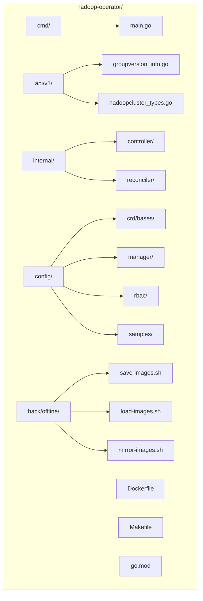
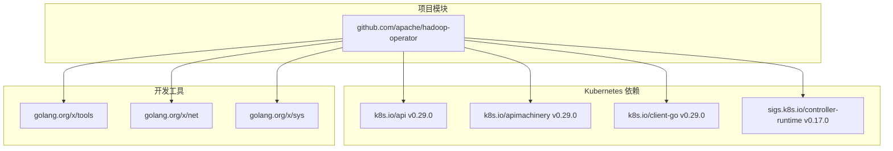
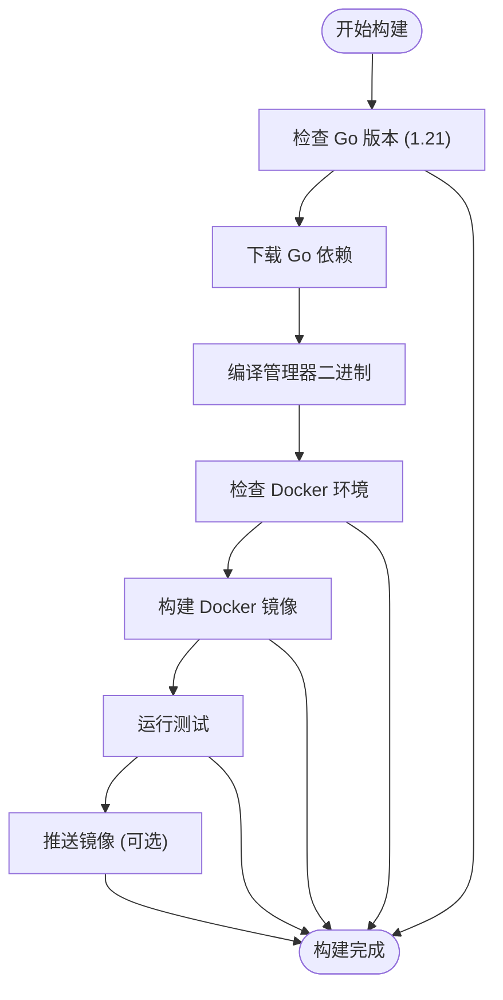

# 开发环境搭建

<cite>
**本文档引用的文件**
- [README.md](file://hadoop-operator/README.md)
- [go.mod](file://hadoop-operator/go.mod)
- [Makefile](file://hadoop-operator/Makefile)
- [Dockerfile](file://hadoop-operator/Dockerfile)
- [main.go](file://hadoop-operator/cmd/main.go)
- [groupversion_info.go](file://hadoop-operator/api/v1/groupversion_info.go)
- [hadoopcluster_types.go](file://hadoop-operator/api/v1/hadoopcluster_types.go)
- [save-images.sh](file://hadoop-operator/hack/offline/save-images.sh)
- [load-images.sh](file://hadoop-operator/hack/offline/load-images.sh)
- [mirror-images.sh](file://hadoop-operator/hack/offline/mirror-images.sh)
- [hadoop_v1_hadoopcluster.yaml](file://hadoop-operator/config/samples/hadoop_v1_hadoopcluster.yaml)
- [hadoop_v1_hadoopcluster_ha.yaml](file://hadoop-operator/config/samples/hadoop_v1_hadoopcluster_ha.yaml)
- [offline-deployment.yaml](file://hadoop-operator/config/samples/offline-deployment.yaml)
</cite>

## 目录
1. [简介](#简介)
2. [项目结构](#项目结构)
3. [核心组件](#核心组件)
4. [架构概览](#架构概览)
5. [详细组件分析](#详细组件分析)
6. [依赖关系分析](#依赖关系分析)
7. [性能考虑](#性能考虑)
8. [故障排查指南](#故障排查指南)
9. [结论](#结论)
10. [附录](#附录)

## 简介
Apache Hadoop Operator v3 是一个用于在 Kubernetes 上部署和管理 Hadoop 集群的生产级 Operator。该项目支持 HDFS 和 YARN 的高可用部署，以及离线环境部署。Operator 通过自定义资源定义（CRD）来管理 Hadoop 集群的生命周期，包括 NameNode、DataNode、ResourceManager 和 NodeManager 组件的协调。

## 项目结构
该项目采用标准的 Kubernetes Operator 项目结构，主要包含以下关键目录：



**图表来源**
- [Makefile:1-165](file://hadoop-operator/Makefile#L1-L165)
- [go.mod:1-69](file://hadoop-operator/go.mod#L1-L69)

**章节来源**
- [README.md:235-251](file://hadoop-operator/README.md#L235-L251)

## 核心组件
项目的核心组件包括：

### 1. 应用程序入口点
- **main.go**: Operator 的主入口，负责初始化控制器管理器、注册控制器和健康检查端点

### 2. API 定义
- **groupversion_info.go**: 定义了 Hadoop API 组和版本信息
- **hadoopcluster_types.go**: 定义了 HadoopCluster CRD 的完整数据模型

### 3. 控制器层
- **controller/**: 主控制器实现
- **reconciler/**: 组件协调器，处理具体的 Hadoop 组件管理

### 4. 配置管理
- **config/**: 包含 CRD、RBAC、部署配置和示例
- **hack/offline/**: 离线部署工具脚本

**章节来源**
- [main.go:17-150](file://hadoop-operator/cmd/main.go#L17-L150)
- [groupversion_info.go:17-37](file://hadoop-operator/api/v1/groupversion_info.go#L17-L37)
- [hadoopcluster_types.go:24-418](file://hadoop-operator/api/v1/hadoopcluster_types.go#L24-L418)

## 架构概览
Apache Hadoop Operator 采用 Kubernetes 控制器模式，通过自定义资源定义来管理 Hadoop 集群：

```mermaid
graph TB
subgraph "Kubernetes 集群"
subgraph "Operator 组件"
A[HadoopCluster Controller]
B[ConfigMap Reconciler]
C[Service Reconciler]
D[StatefulSet Reconciler]
end
subgraph "Hadoop 组件"
E[NameNode (HA)]
F[DataNode]
G[ResourceManager (HA)]
H[NodeManager]
end
subgraph "Kubernetes 资源"
I[ConfigMaps]
J[Services]
K[StatefulSets]
L[PersistentVolumeClaims]
end
end
A --> B
A --> C
A --> D
B --> I
C --> J
D --> K
D --> L
I --> E
J --> E
K --> E
L --> E
I --> F
J --> F
K --> F
I --> G
J --> G
K --> G
I --> H
J --> H
K --> H
```

**图表来源**
- [main.go:125-133](file://hadoop-operator/cmd/main.go#L125-L133)
- [hadoopcluster_types.go:24-46](file://hadoop-operator/api/v1/hadoopcluster_types.go#L24-L46)

## 详细组件分析

### Go 语言环境配置
项目使用 Go 1.21 作为开发和构建环境：

#### 版本要求
- **Go 版本**: 1.21
- **模块路径**: github.com/apache/hadoop-operator

#### 依赖管理
项目使用 Go modules 进行依赖管理，主要依赖包括：
- Kubernetes API 库 (v0.29.0)
- controller-runtime (v0.17.0)
- 客户端库和工具包

**章节来源**
- [go.mod:3](file://hadoop-operator/go.mod#L3)
- [go.mod:5-10](file://hadoop-operator/go.mod#L5-L10)

### Makefile 构建系统
Makefile 提供了完整的开发工作流，包含以下主要目标：

#### 开发相关目标
- **build**: 构建管理器二进制文件
- **run**: 在本地运行控制器
- **test**: 运行单元测试
- **fmt**: 运行 go fmt 格式化
- **vet**: 运行 go vet 代码检查

#### 生成工具目标
- **manifests**: 生成 RBAC、Webhook 和 CRD 对象
- **generate**: 生成 DeepCopy 代码

#### Docker 相关目标
- **docker-build**: 构建 Docker 镜像
- **docker-push**: 推送 Docker 镜像
- **docker-buildx**: 多平台构建镜像

#### 部署相关目标
- **install**: 安装 CRD 到集群
- **uninstall**: 从集群卸载 CRD
- **deploy**: 部署控制器到集群
- **undeploy**: 从集群卸载控制器

#### 工具安装目标
- **kustomize**: 下载 kustomize 工具
- **controller-gen**: 下载 controller-gen 工具
- **envtest**: 下载 setup-envtest 工具

**章节来源**
- [Makefile:24-165](file://hadoop-operator/Makefile#L24-L165)

### Docker 容器化配置
Dockerfile 实现了多阶段构建：

#### 构建阶段
- **基础镜像**: golang:1.21
- **工作目录**: /workspace
- **依赖缓存**: 使用 go.mod 和 go.sum 进行依赖缓存
- **源码复制**: 复制 cmd、api、internal 目录

#### 运行阶段
- **基础镜像**: gcr.io/distroless/static:nonroot
- **用户**: 65532:65532 (非特权用户)
- **入口点**: /manager

#### 平台支持
- 支持多架构构建 (linux/arm64, linux/amd64, linux/s390x, linux/ppc64le)
- 使用 CGO_ENABLED=0 进行静态链接

**章节来源**
- [Dockerfile:1-34](file://hadoop-operator/Dockerfile#L1-L34)

### Kubernetes 集群要求
项目对 Kubernetes 集群有明确的要求：

#### 基础要求
- **Kubernetes 版本**: 1.24+
- **kubectl**: 已正确配置
- **Helm 3.x**: 可选（用于高级部署）

#### 权限要求
- 需要具有创建 CRD、RBAC 角色、部署控制器的权限
- 需要具有创建 ConfigMap、Service、StatefulSet、PersistentVolumeClaim 的权限

#### 网络要求
- 集群内部 DNS 服务正常工作
- 节点间网络连通性良好
- 需要访问 Docker 镜像仓库

**章节来源**
- [README.md:17-22](file://hadoop-operator/README.md#L17-L22)

### 离线部署工具
项目提供了完整的离线部署工具集：

#### 镜像保存工具
- **save-images.sh**: 保存 Hadoop 和 ZooKeeper 镜像到本地 tar 文件
- 支持自定义输出目录和 Hadoop 版本参数

#### 镜像加载工具
- **load-images.sh**: 从 tar 文件加载镜像到本地 Docker
- 支持推送到私有镜像仓库

#### 镜像镜像工具
- **mirror-images.sh**: 直接从源仓库镜像到目标私有仓库
- 支持代理配置和版本控制

**章节来源**
- [save-images.sh:1-66](file://hadoop-operator/hack/offline/save-images.sh#L1-L66)
- [load-images.sh:1-75](file://hadoop-operator/hack/offline/load-images.sh#L1-L75)
- [mirror-images.sh:1-127](file://hadoop-operator/hack/offline/mirror-images.sh#L1-L127)

## 依赖关系分析

### Go 模块依赖图


**图表来源**
- [go.mod:5-68](file://hadoop-operator/go.mod#L5-L68)

### 构建流程依赖


**图表来源**
- [Makefile:61-78](file://hadoop-operator/Makefile#L61-L78)
- [Dockerfile:12](file://hadoop-operator/Dockerfile#L12)

**章节来源**
- [go.mod:1-69](file://hadoop-operator/go.mod#L1-L69)
- [Makefile:120-165](file://hadoop-operator/Makefile#L120-L165)

## 性能考虑
基于代码分析，项目在性能方面有以下特点：

### 内存和 CPU 资源
- NameNode 默认请求内存 4Gi，CPU 1000m
- DataNode 默认请求内存 4Gi，CPU 1000m  
- ResourceManager 默认请求内存 4Gi，CPU 1000m
- NodeManager 默认请求内存 4Gi，CPU 1000m

### 存储配置
- NameNode 默认存储 100Gi
- DataNode 默认存储 500Gi
- JournalNode 默认存储 50Gi

### 网络优化
- 使用 Headless Services 为 StatefulSets 提供稳定的网络标识
- 支持反亲和性配置，确保组件分布在不同节点上

## 故障排查指南

### 常见问题诊断

#### 1. Pod 启动失败
**症状**: Pod 处于 Pending 或 CrashLoopBackOff 状态
**排查步骤**:
1. 检查 Pod 事件: `kubectl describe pod <pod-name>`
2. 查看容器日志: `kubectl logs <pod-name> --previous`
3. 检查资源配额和限制
4. 验证存储类和持久卷声明

#### 2. NameNode 格式化失败
**症状**: NameNode 无法启动或报格式化错误
**排查步骤**:
1. 检查 PVC 状态: `kubectl get pvc`
2. 验证存储权限和挂载点
3. 手动格式化 (谨慎操作): `kubectl exec -it <namenode-pod> -- hdfs namenode -format -force`

#### 3. DataNode 无法连接到 NameNode
**症状**: DataNode 报连接超时或拒绝
**排查步骤**:
1. 检查网络连通性: `kubectl exec -it <datanode-pod> -- nc -zv <namenode-service> 9000`
2. 验证配置映射: `kubectl get configmap <cluster-name>-config -o yaml`
3. 检查服务端点: `kubectl get endpoints <namenode-service>`

#### 4. 镜像拉取失败
**症状**: Pod 显示 ImagePullBackOff 错误
**排查步骤**:
1. 检查镜像是否存在: `docker pull <image>`
2. 验证镜像拉取密钥: `kubectl get secret regcred -o yaml`
3. 检查命名空间权限

**章节来源**
- [README.md:276-318](file://hadoop-operator/README.md#L276-L318)

### 开发环境问题解决

#### 1. Go 版本不兼容
**问题**: make 命令执行失败，提示 Go 版本不匹配
**解决方案**:
1. 升级到 Go 1.21 或更高版本
2. 清理模块缓存: `go clean -cache`
3. 重新下载依赖: `go mod download`

#### 2. Docker 构建失败
**问题**: docker-build 目标执行失败
**解决方案**:
1. 确保 Docker 服务正在运行
2. 检查 Docker 镜像仓库访问权限
3. 验证 Dockerfile 语法
4. 尝试清理构建缓存: `docker builder prune`

#### 3. Kubernetes 集群连接问题
**问题**: kubectl 命令无法连接到集群
**解决方案**:
1. 检查 kubeconfig 文件: `kubectl config view`
2. 验证集群上下文: `kubectl config current-context`
3. 检查网络连接和防火墙设置
4. 验证集群证书和权限

## 结论
Apache Hadoop Operator v3 提供了一个功能完整、架构清晰的 Kubernetes Hadoop 管理解决方案。项目采用现代化的开发实践，包括：

1. **标准化的项目结构**: 符合 Kubernetes Operator 最佳实践
2. **完善的构建系统**: Makefile 提供全面的开发工作流
3. **容器化部署**: 多阶段 Docker 构建支持多架构
4. **离线部署能力**: 完整的离线部署工具链
5. **详细的文档**: 包含开发指南和故障排查

对于开发者而言，按照本文档的环境搭建步骤，可以快速建立完整的开发环境，进行 Hadoop Operator 的开发和测试工作。

## 附录

### 开发环境搭建步骤

#### 1. 基础环境准备
1. 安装 Go 1.21 或更高版本
2. 安装 Docker
3. 安装 kubectl
4. 准备 Kubernetes 集群 (1.24+)

#### 2. 项目克隆和依赖安装
```bash
git clone https://github.com/apache/hadoop-operator.git
cd hadoop-operator
go mod download
```

#### 3. 本地运行
```bash
make run
```

#### 4. 构建和测试
```bash
make build
make test
```

#### 5. 部署到集群
```bash
make install
make deploy
```

### 关键配置文件说明

#### HadoopCluster CRD 配置
- **基础配置**: [hadoop_v1_hadoopcluster.yaml](file://hadoop-operator/config/samples/hadoop_v1_hadoopcluster.yaml)
- **高可用配置**: [hadoop_v1_hadoopcluster_ha.yaml](file://hadoop-operator/config/samples/hadoop_v1_hadoopcluster_ha.yaml)
- **离线部署配置**: [offline-deployment.yaml](file://hadoop-operator/config/samples/offline-deployment.yaml)

#### 离线部署流程
1. 准备镜像: `./hack/offline/save-images.sh`
2. 传输到离线环境
3. 加载镜像: `./hack/offline/load-images.sh`
4. 更新配置并部署