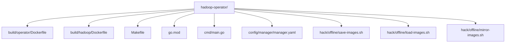
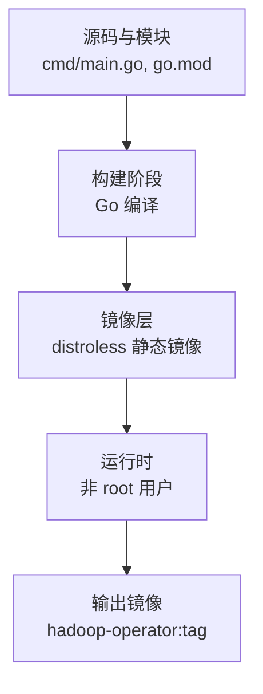
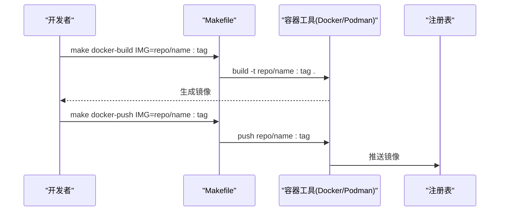
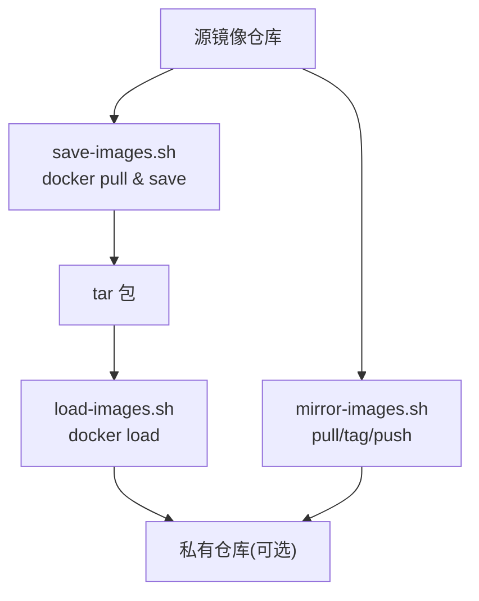
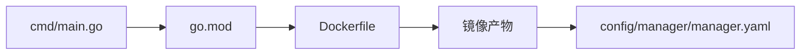

# Docker 打包

<cite>
**本文引用的文件**
- [build/operator/Dockerfile](file://hadoop-operator/build/operator/Dockerfile) - Operator 多阶段构建 Dockerfile
- [build/operator/README.md](file://hadoop-operator/build/operator/README.md) - Operator 镜像构建说明
- [build/hadoop/Dockerfile](file://hadoop-operator/build/hadoop/Dockerfile) - Hadoop 集群组件 Dockerfile
- [build/hadoop/README.md](file://hadoop-operator/build/hadoop/README.md) - Hadoop 镜像构建说明
- [build/README.md](file://hadoop-operator/build/README.md) - 构建指南总览
- [Makefile](file://hadoop-operator/Makefile) - 构建目标定义
- [README.md](file://hadoop-operator/README.md)
- [go.mod](file://hadoop-operator/go.mod)
- [cmd/main.go](file://hadoop-operator/cmd/main.go)
- [config/manager/manager.yaml](file://hadoop-operator/config/manager/manager.yaml)
- [config/samples/offline-deployment.yaml](file://hadoop-operator/config/samples/offline-deployment.yaml)
- [hack/offline/save-images.sh](file://hadoop-operator/hack/offline/save-images.sh)
- [hack/offline/load-images.sh](file://hadoop-operator/hack/offline/load-images.sh)
- [hack/offline/mirror-images.sh](file://hadoop-operator/hack/offline/mirror-images.sh)
</cite>

## 目录
1. [简介](#简介)
2. [项目结构](#项目结构)
3. [核心组件](#核心组件)
4. [架构总览](#架构总览)
5. [详细组件分析](#详细组件分析)
6. [依赖关系分析](#依赖关系分析)
7. [性能与体积优化](#性能与体积优化)
8. [故障排查指南](#故障排查指南)
9. [结论](#结论)
10. [附录](#附录)

## 简介
本指南面向 Apache Hadoop Operator 的镜像打包与分发，涵盖以下两个核心镜像的构建：

1. **Hadoop Operator 镜像** - 负责管理 Hadoop 集群生命周期的 Kubernetes Operator
2. **Hadoop 集群组件镜像** - 运行 NameNode、DataNode、ResourceManager、NodeManager 等组件的基础镜像

### 镜像名称对应关系

构建的镜像名称需要与部署配置中的镜像名称保持一致：

| 镜像类型 | 构建默认名称 | 部署配置位置 | 部署默认名称 |
|---------|-------------|-------------|-------------|
| **Operator** | `apache/hadoop-operator:latest` | `config/manager/manager.yaml` | `apache/hadoop-operator:latest` |
| **Hadoop** | `apache/hadoop:3.3.6` | `config/samples/hadoop_v1_hadoopcluster.yaml` | `apache/hadoop:3.3.6` |

**重要提示**：
- 构建时通过 `IMG` 变量指定 Operator 镜像名称
- 构建时通过 `HADOOP_VERSION` 变量指定 Hadoop 版本标签
- 部署前请确保构建的镜像名称与部署配置中的 `image` 字段一致
- 使用私有仓库时，需要同时修改构建命令和部署配置中的镜像地址

文档围绕单平台构建（docker-build）、多平台构建（docker-buildx）与镜像推送（docker-push）展开，系统说明 Dockerfile 的多阶段构建策略、镜像体积优化、安全加固与最佳实践。同时给出不同 CPU 架构（arm64、amd64、s390x、ppc64le）的构建配置建议，容器工具选择（Docker/Podman）与替代方案，以及离线环境镜像准备流程。

## 项目结构
- 顶层目录包含 Operator 源码与示例资源：
  - hadoop-operator：Operator 源码、构建脚本与配置
  - 示例资源：namenode、datanode、resourcemanager、nodemanager 的 CR 示例与配置
- 关键构建与打包相关文件：
  - hadoop-operator/build/operator/Dockerfile：Operator 多阶段构建与运行时基础镜像
  - hadoop-operator/build/operator/README.md：Operator 镜像构建说明
  - hadoop-operator/build/hadoop/Dockerfile：Hadoop 集群组件基础镜像
  - hadoop-operator/build/hadoop/README.md：Hadoop 镜像构建说明
  - hadoop-operator/build/README.md：构建指南总览
  - hadoop-operator/Makefile：构建、推送、多平台构建等目标
  - hadoop-operator/config/manager/manager.yaml：部署配置，包含节点亲和性与架构约束
  - hadoop-operator/hack/offline/*：离线镜像准备脚本



图表来源
- [build/operator/Dockerfile](file://hadoop-operator/build/operator/Dockerfile)
- [build/hadoop/Dockerfile](file://hadoop-operator/build/hadoop/Dockerfile)
- [Makefile](file://hadoop-operator/Makefile)
- [go.mod](file://hadoop-operator/go.mod)
- [cmd/main.go](file://hadoop-operator/cmd/main.go)
- [config/manager/manager.yaml](file://hadoop-operator/config/manager/manager.yaml)
- [config/samples/offline-deployment.yaml](file://hadoop-operator/config/samples/offline-deployment.yaml)
- [hack/offline/save-images.sh](file://hadoop-operator/hack/offline/save-images.sh)
- [hack/offline/load-images.sh](file://hadoop-operator/hack/offline/load-images.sh)
- [hack/offline/mirror-images.sh](file://hadoop-operator/hack/offline/mirror-images.sh)

章节来源
- [build/operator/Dockerfile](file://hadoop-operator/build/operator/Dockerfile)
- [build/hadoop/Dockerfile](file://hadoop-operator/build/hadoop/Dockerfile)
- [Makefile](file://hadoop-operator/Makefile)
- [README.md](file://hadoop-operator/README.md)

## 核心组件
- 多阶段构建
  - 第一阶段：基于官方 Go 基础镜像进行编译，下载依赖并构建二进制
  - 第二阶段：基于 distroless 静态镜像，仅拷贝二进制与非 root 用户运行
- 构建目标
  - docker-build：单平台构建
  - docker-buildx：多平台构建并推送
  - docker-push：推送镜像
- 容器工具
  - 默认使用 Docker；可通过变量切换为 Podman
- 平台支持
  - Makefile 中预设多平台列表（arm64、amd64、s390x、ppc64le）
  - Dockerfile 支持通过 TARGETOS/TARGETARCH 构建与主机一致的二进制

章节来源
- [Dockerfile](file://hadoop-operator/Dockerfile)
- [Makefile](file://hadoop-operator/Makefile)

## 架构总览
下图展示从源码到最终镜像的关键步骤与工具链交互。



图表来源
- [Dockerfile](file://hadoop-operator/Dockerfile)
- [cmd/main.go](file://hadoop-operator/cmd/main.go)
- [go.mod](file://hadoop-operator/go.mod)

## 详细组件分析

### Dockerfile 多阶段构建
- 构建阶段
  - 设置工作目录，复制模块清单与源码
  - 使用模块缓存策略，先下载依赖再复制源码，避免重复下载
  - 通过参数 TARGETOS/TARGETARCH 控制目标平台，CGO 禁用以获得静态二进制
- 运行阶段
  - 基于 distroless 静态镜像，设置非 root 用户，入口为二进制
- 优势
  - 最小化运行时镜像体积与攻击面
  - 静态链接减少运行时依赖

```mermaid
flowchart TD
A["FROM golang:1.21"] --> B["WORKDIR /workspace"]
B --> C["COPY go.mod go.sum"]
C --> D["go mod download"]
D --> E["COPY cmd/main.go api/ internal/"]
E --> F["CGO_ENABLED=0 GOOS=linux GOARCH=TARGETARCH go build"]
F --> G["FROM distroless/static:nonroot"]
G --> H["COPY --from=builder /workspace/manager ."]
H --> I["USER 65532:65532"]
I --> J["ENTRYPOINT [\"/manager\"]"]
```

图表来源
- [Dockerfile](file://hadoop-operator/Dockerfile)

章节来源
- [Dockerfile](file://hadoop-operator/Dockerfile)

### Makefile 构建与推送目标
- docker-build
  - 单平台构建，使用当前容器工具（默认 Docker）
  - 支持通过 IMG 变量指定镜像名与标签
- docker-buildx
  - 多平台构建并推送，平台列表默认包含 arm64、amd64、s390x、ppc64le
  - 通过临时修改 Dockerfile 插入平台参数，使用 buildx 创建/切换 builder 并执行构建
- docker-push
  - 将已构建镜像推送到注册表
- 容器工具选择
  - CONTAINER_TOOL 可切换为 podman，便于在不安装 Docker 的环境中使用
- 部署集成
  - 部署配置中默认使用 hadoop-operator:latest，可通过 kustomize 替换为自定义镜像



图表来源
- [Makefile](file://hadoop-operator/Makefile)

章节来源
- [Makefile](file://hadoop-operator/Makefile)
- [config/manager/manager.yaml](file://hadoop-operator/config/manager/manager.yaml)

### 离线环境镜像准备
- save-images.sh
  - 拉取并保存指定版本的 Hadoop 与 ZooKeeper 镜像到 tar 包
- load-images.sh
  - 从 tar 包加载镜像，可选推送到私有仓库
- mirror-images.sh
  - 将源镜像镜像到目标私有仓库，便于离线部署



图表来源
- [hack/offline/save-images.sh](file://hadoop-operator/hack/offline/save-images.sh)
- [hack/offline/load-images.sh](file://hadoop-operator/hack/offline/load-images.sh)
- [hack/offline/mirror-images.sh](file://hadoop-operator/hack/offline/mirror-images.sh)

章节来源
- [hack/offline/save-images.sh](file://hadoop-operator/hack/offline/save-images.sh)
- [hack/offline/load-images.sh](file://hadoop-operator/hack/offline/load-images.sh)
- [hack/offline/mirror-images.sh](file://hadoop-operator/hack/offline/mirror-images.sh)
- [config/samples/offline-deployment.yaml](file://hadoop-operator/config/samples/offline-deployment.yaml)

## 依赖关系分析
- 源码与构建
  - cmd/main.go 为入口，go.mod 管理依赖版本
  - Dockerfile 依赖 go.mod 与源码进行编译
- 运行时与部署
  - config/manager/manager.yaml 定义了节点亲和性与架构约束，包含 amd64、arm64、ppc64le、s390x
  - 部署镜像默认为 hadoop-operator:latest，可通过 kustomize 替换



图表来源
- [cmd/main.go](file://hadoop-operator/cmd/main.go)
- [go.mod](file://hadoop-operator/go.mod)
- [Dockerfile](file://hadoop-operator/Dockerfile)
- [config/manager/manager.yaml](file://hadoop-operator/config/manager/manager.yaml)

章节来源
- [cmd/main.go](file://hadoop-operator/cmd/main.go)
- [go.mod](file://hadoop-operator/go.mod)
- [config/manager/manager.yaml](file://hadoop-operator/config/manager/manager.yaml)

## 性能与体积优化
- 静态编译与最小运行时
  - 禁用 CGO，生成静态二进制，减少运行时依赖
  - 使用 distroless 静态镜像，无 shell 与包管理器，降低攻击面与体积
- 依赖缓存与分层
  - 先下载依赖再复制源码，避免频繁重新下载
- 多平台构建
  - 使用 buildx 并行构建多架构镜像，减少重复工作
- 安全加固
  - 非 root 用户运行
  - 禁用 HTTP/2（通过 TLS 配置），降低协议漏洞风险
- 镜像体积建议
  - 保持 distroless 基础镜像不变
  - 避免在镜像中引入额外工具或调试包
  - 使用 .dockerignore（如存在）排除不必要的构建上下文文件

章节来源
- [Dockerfile](file://hadoop-operator/Dockerfile)
- [cmd/main.go](file://hadoop-operator/cmd/main.go)

## 故障排查指南
- 构建失败（依赖下载/编译）
  - 确认网络可达与代理配置
  - 清理依赖缓存后重试
- 多平台构建失败
  - 确保启用 BuildKit 与 buildx
  - 检查平台列表与目标注册表权限
- 镜像拉取失败
  - 检查镜像名称与标签是否正确
  - 如使用私有仓库，确认拉取密钥与网络连通性
- 离线环境镜像加载失败
  - 确认 tar 包完整性与加载顺序
  - 若需推送到私有仓库，检查仓库地址与认证信息

章节来源
- [Makefile](file://hadoop-operator/Makefile)
- [hack/offline/load-images.sh](file://hadoop-operator/hack/offline/load-images.sh)
- [README.md](file://hadoop-operator/README.md)

## Hadoop 集群组件镜像构建

### 镜像概述
Hadoop 集群组件镜像是一个统一的基础镜像，支持运行以下组件：
- **NameNode** - HDFS 元数据管理
- **DataNode** - HDFS 数据存储
- **ResourceManager** - YARN 资源管理
- **NodeManager** - YARN 节点管理
- **JournalNode** - HA 模式下的元数据同步
- **JobHistoryServer** - MapReduce 作业历史服务

### Dockerfile 结构

```dockerfile
# 阶段 1: 下载和准备阶段
FROM alpine:3.19 AS downloader
# - 下载官方 Hadoop 发行版
# - 验证 SHA512 校验和
# - 清理不必要的文件

# 阶段 2: 运行时基础镜像
FROM eclipse-temurin:11-jre-alpine
# - 基于 Eclipse Temurin JRE 11
# - 创建 hadoop 用户 (UID 1000)
# - 安装必要工具 (bash, curl, netcat, procps)
# - 配置 Hadoop 环境变量
# - 暴露所有必要端口
# - 配置健康检查
```

### 配置文件
镜像包含以下预配置文件模板：
- `core-site.xml` - 核心配置（默认文件系统、临时目录等）
- `hdfs-site.xml` - HDFS 配置（块大小、副本数、端口等）
- `yarn-site.xml` - YARN 配置（资源管理、内存设置等）
- `mapred-site.xml` - MapReduce 配置

### 启动脚本
- `entrypoint.sh` - 主入口脚本，根据组件类型执行初始化
- `healthcheck.sh` - 健康检查脚本，支持各组件的健康检测

### 构建 Hadoop 镜像

```bash
# 使用 Makefile（推荐）
cd hadoop-operator
make build-hadoop-image

# 指定版本构建
make build-hadoop-image HADOOP_VERSION=3.3.6

# 多平台构建
make build-hadoop-multiarch PLATFORMS=linux/amd64,linux/arm64

# 使用 Docker 直接构建
cd hadoop-operator/build/hadoop
docker build -t apache/hadoop:3.3.6 .

# 多平台构建并推送
docker buildx build --platform linux/amd64,linux/arm64 \
  -t registry.example.com/apache/hadoop:3.3.6 \
  --push .
```

### 运行 Hadoop 容器

```bash
# 运行 NameNode
docker run -d \
  -e HADOOP_COMPONENT=namenode \
  -p 9870:9870 -p 9000:9000 \
  -v namenode-data:/opt/hadoop/data/nn \
  apache/hadoop:3.3.6 \
  hdfs namenode

# 运行 DataNode
docker run -d \
  -e HADOOP_COMPONENT=datanode \
  -e NAMENODE_HOST=namenode \
  -p 9864:9864 \
  -v datanode-data:/opt/hadoop/data/dn \
  apache/hadoop:3.3.6 \
  hdfs datanode

# 运行 ResourceManager
docker run -d \
  -e HADOOP_COMPONENT=resourcemanager \
  -p 8088:8088 \
  apache/hadoop:3.3.6 \
  yarn resourcemanager

# 运行 NodeManager
docker run -d \
  -e HADOOP_COMPONENT=nodemanager \
  -e RESOURCEMANAGER_HOST=resourcemanager \
  -p 8042:8042 \
  apache/hadoop:3.3.6 \
  yarn nodemanager
```

## 快速开始：构建所有镜像

### 一键构建

```bash
cd hadoop-operator

# 构建所有镜像（本地）
make build-images

# 构建并推送到私有仓库
make push-images DOCKER_REGISTRY=registry.example.com

# 自定义版本构建
make build-images IMG=apache/hadoop-operator:v1.0.0 HADOOP_VERSION=3.3.6
make push-images IMG=apache/hadoop-operator:v1.0.0 DOCKER_REGISTRY=registry.example.com
```

### 分步构建

```bash
# 仅构建 Operator 镜像
make build-operator-image

# 仅构建 Hadoop 镜像
make build-hadoop-image

# 构建多平台 Operator 镜像
make docker-buildx IMG=registry.example.com/hadoop-operator:v1.0.0

# 构建多平台 Hadoop 镜像
make build-hadoop-multiarch
```

## 镜像安全扫描

```bash
# 使用 Makefile 扫描 Operator 镜像
make image-scan

# 使用 Trivy 手动扫描
trivy image apache/hadoop-operator:latest
trivy image apache/hadoop:3.3.6

# 使用 Snyk 扫描
snyk container test apache/hadoop-operator:latest
```

## 结论
本指南总结了 Hadoop Operator 的镜像构建与分发策略：

1. **Operator 镜像** - 采用多阶段构建与 distroless 运行时实现最小化体积与安全基线
2. **Hadoop 镜像** - 基于 Eclipse Temurin JRE，支持所有集群组件的统一基础镜像
3. **构建工具** - 通过 Makefile 和统一构建脚本提供便捷的构建、多平台构建与推送流程
4. **离线支持** - 结合离线脚本满足私有仓库与离线部署场景

遵循本文建议可在保证安全性的同时提升交付效率与可维护性。

## 附录

### 常用命令与参数

#### Operator 镜像构建
- 单平台构建
  - `make docker-build IMG=your-repo/hadoop-operator:vX.Y.Z`
- 多平台构建与推送
  - `make docker-buildx IMG=your-repo/hadoop-operator:vX.Y.Z`
  - 平台列表默认包含 linux/arm64,linux/amd64,linux/s390x,linux/ppc64le
- 推送镜像
  - `make docker-push IMG=your-repo/hadoop-operator:vX.Y.Z`

#### Hadoop 镜像构建
- 单平台构建
  - `make build-hadoop-image HADOOP_VERSION=3.3.6`
- 多平台构建
  - `make build-hadoop-multiarch PLATFORMS=linux/amd64,linux/arm64`
- 直接 Docker 构建
  - `docker build -t your-repo/hadoop:3.3.6 build/hadoop/`

#### 其他命令
- 切换容器工具
  - `CONTAINER_TOOL=podman make docker-build ...`
- 部署替换镜像
  - `kustomize edit set image controller=your-repo/hadoop-operator:vX.Y.Z`
- 构建所有镜像
  - `make build-images`
- 推送所有镜像
  - `make push-images DOCKER_REGISTRY=registry.example.com`
  - `make push-images IMG=apache/hadoop-operator:v1.0.0 DOCKER_REGISTRY=registry.example.com`

章节来源
- [Makefile](file://hadoop-operator/Makefile)
- [build/operator/Dockerfile](file://hadoop-operator/build/operator/Dockerfile)
- [build/hadoop/Dockerfile](file://hadoop-operator/build/hadoop/Dockerfile)
- [config/manager/manager.yaml](file://hadoop-operator/config/manager/manager.yaml)

### 不同架构支持策略
- 平台列表
  - 默认支持 arm64、amd64、s390x、ppc64le
- 运行时亲和性
  - 部署配置中显式包含上述架构，确保调度到对应节点
- 构建一致性
  - Dockerfile 通过 TARGETOS/TARGETARCH 与 CGO 禁用，确保二进制与镜像平台一致

章节来源
- [Makefile](file://hadoop-operator/Makefile)
- [build/operator/Dockerfile](file://hadoop-operator/build/operator/Dockerfile)
- [build/hadoop/Dockerfile](file://hadoop-operator/build/hadoop/Dockerfile)
- [config/manager/manager.yaml](file://hadoop-operator/config/manager/manager.yaml)

### 容器工具选择与替代方案
- 默认 Docker，可通过 CONTAINER_TOOL=podman 切换
- 适用于不安装 Docker 的环境或需要 rootless 构建的场景

章节来源
- [Makefile](file://hadoop-operator/Makefile)

### 安全扫描与合规建议
- 镜像扫描
  - 使用镜像扫描工具对 distroless 基础镜像与二进制进行漏洞扫描
  - `make image-scan` 扫描 Operator 镜像
  - `trivy image apache/hadoop-operator:latest` 手动扫描
- 最小权限
  - 非 root 用户运行，drop ALL 能力
  - Operator 使用 UID 65532 (distroless nonroot)
  - Hadoop 使用 UID 1000 (hadoop 用户)
- 网络与凭据
  - 私有仓库使用 TLS 与拉取密钥，避免明文凭据
- 版本管理
  - 固定 Go 版本与依赖版本，确保可复现构建

章节来源
- [build/operator/Dockerfile](file://hadoop-operator/build/operator/Dockerfile)
- [build/hadoop/Dockerfile](file://hadoop-operator/build/hadoop/Dockerfile)
- [config/manager/manager.yaml](file://hadoop-operator/config/manager/manager.yaml)