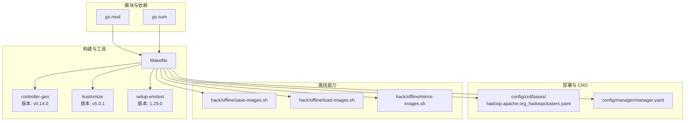
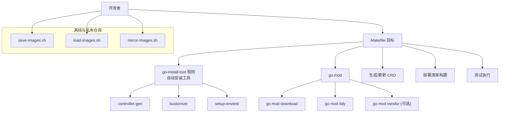
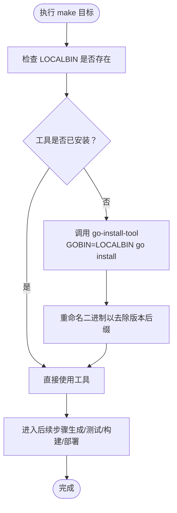
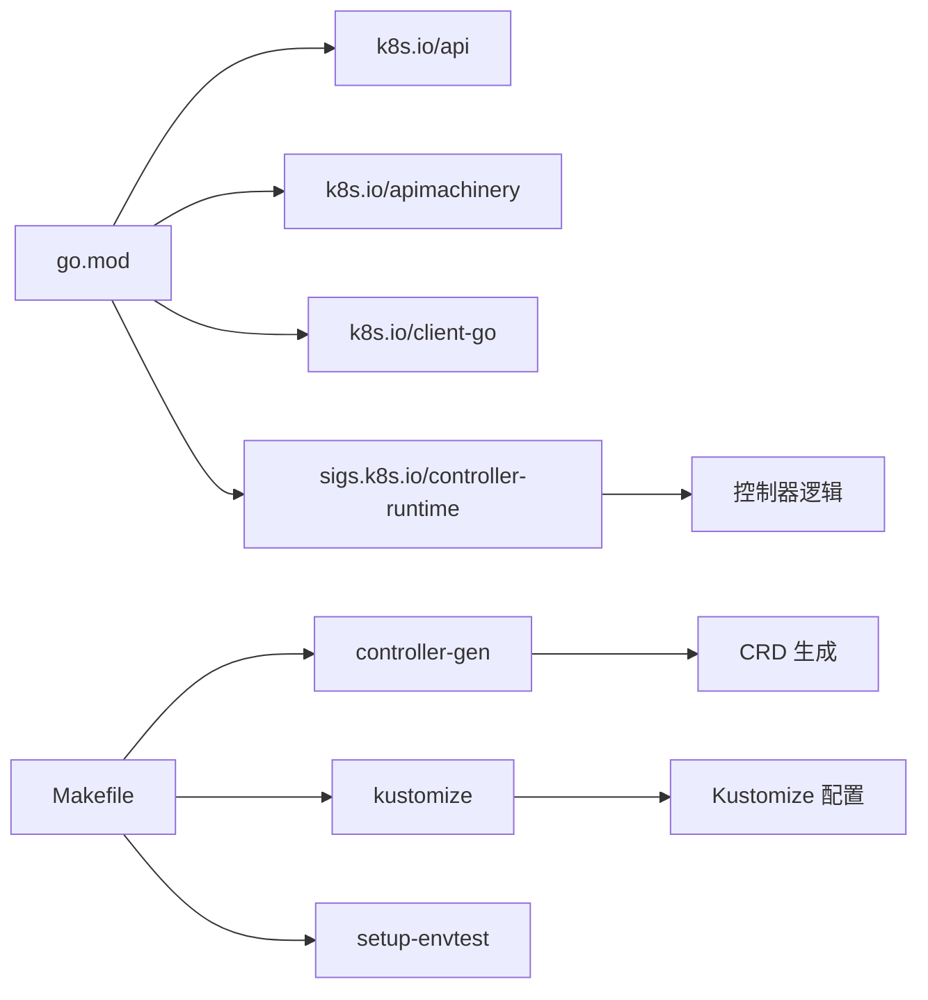

# 依赖管理

<cite>
**本文引用的文件**
- [go.mod](file://hadoop-operator/go.mod)
- [go.sum](file://hadoop-operator/go.sum)
- [Makefile](file://hadoop-operator/Makefile)
- [README.md](file://hadoop-operator/README.md)
- [hadoop.apache.org_hadoopclusters.yaml](file://hadoop-operator/config/crd/bases/hadoop.apache.org_hadoopclusters.yaml)
- [manager.yaml](file://hadoop-operator/config/manager/manager.yaml)
- [save-images.sh](file://hadoop-operator/hack/offline/save-images.sh)
- [load-images.sh](file://hadoop-operator/hack/offline/load-images.sh)
- [mirror-images.sh](file://hadoop-operator/hack/offline/mirror-images.sh)
</cite>

## 目录
1. [简介](#简介)
2. [项目结构](#项目结构)
3. [核心组件](#核心组件)
4. [架构总览](#架构总览)
5. [详细组件分析](#详细组件分析)
6. [依赖分析](#依赖分析)
7. [性能考虑](#性能考虑)
8. [故障排查指南](#故障排查指南)
9. [结论](#结论)
10. [附录](#附录)

## 简介
本指南聚焦于 Apache Hadoop Operator v3 的依赖管理，围绕以下主题展开：
- go.mod 与 go.sum 的结构、模块声明、版本约束与依赖解析机制
- Makefile 中构建依赖工具（controller-gen、kustomize、envtest）的版本管理与自动安装流程
- 依赖更新、版本升级与冲突解决方法
- Go modules 代理配置、私有仓库支持与依赖缓存优化策略
- 依赖安全扫描、许可证合规检查与依赖审计最佳实践

## 项目结构
该仓库采用“模块化 + Makefile 工具链 + Kustomize 部署”的组织方式：
- 模块与依赖：位于根目录的 go.mod/go.sum 描述 Go 语言依赖树与校验和
- 构建与工具：Makefile 提供统一入口，负责下载并安装 controller-gen、kustomize、setup-envtest 等工具
- 部署与 CRD：config 目录下的 Kustomize 配置与 CRD YAML，由 controller-gen 生成或更新
- 离线能力：hack/offline 脚本提供镜像保存、加载与镜像镜像到私有仓库的能力

图表来源
- [go.mod:1-69](file://hadoop-operator/go.mod#L1-L69)
- [go.sum:1-224](file://hadoop-operator/go.sum#L1-L224)
- [Makefile:120-165](file://hadoop-operator/Makefile#L120-L165)
- [hadoop.apache.org_hadoopclusters.yaml:1-200](file://hadoop-operator/config/crd/bases/hadoop.apache.org_hadoopclusters.yaml#L1-L200)
- [manager.yaml:1-70](file://hadoop-operator/config/manager/manager.yaml#L1-L70)
- [save-images.sh:1-66](file://hadoop-operator/hack/offline/save-images.sh#L1-L66)
- [load-images.sh:1-75](file://hadoop-operator/hack/offline/load-images.sh#L1-L75)
- [mirror-images.sh:1-127](file://hadoop-operator/hack/offline/mirror-images.sh#L1-L127)

章节来源
- [go.mod:1-69](file://hadoop-operator/go.mod#L1-L69)
- [go.sum:1-224](file://hadoop-operator/go.sum#L1-L224)
- [Makefile:1-165](file://hadoop-operator/Makefile#L1-L165)
- [README.md:1-356](file://hadoop-operator/README.md#L1-L356)

## 核心组件
- 模块与版本约束
  - 模块名：github.com/apache/hadoop-operator
  - Go 版本：1.21
  - 直接依赖：k8s.io/api、k8s.io/apimachinery、k8s.io/client-go、sigs.k8s.io/controller-runtime
  - 间接依赖：大量第三方库（如 Prometheus、Uber zap、Google protobuf、k8s 相关组件等）
- 构建依赖工具
  - controller-gen：版本 v0.14.0，用于生成 RBAC、CRD、DeepCopy 等
  - kustomize：版本 v5.0.1，用于构建最终部署清单
  - setup-envtest：版本 1.29.0，用于测试时下载并设置本地 K8s 环境
- 部署与 CRD
  - CRD 注解中包含 controller-gen 版本信息，确保生成一致性
  - Manager Deployment 使用 hadoop-operator:latest 镜像，可通过 Makefile 变量替换

章节来源
- [go.mod:1-69](file://hadoop-operator/go.mod#L1-L69)
- [Makefile:120-165](file://hadoop-operator/Makefile#L120-L165)
- [hadoop.apache.org_hadoopclusters.yaml:1-200](file://hadoop-operator/config/crd/bases/hadoop.apache.org_hadoopclusters.yaml#L1-L200)
- [manager.yaml:1-70](file://hadoop-operator/config/manager/manager.yaml#L1-L70)

## 架构总览
下图展示了依赖管理在整体工作流中的位置与交互关系。

图表来源
- [Makefile:120-165](file://hadoop-operator/Makefile#L120-L165)
- [go.mod:1-69](file://hadoop-operator/go.mod#L1-L69)
- [save-images.sh:1-66](file://hadoop-operator/hack/offline/save-images.sh#L1-L66)
- [load-images.sh:1-75](file://hadoop-operator/hack/offline/load-images.sh#L1-L75)
- [mirror-images.sh:1-127](file://hadoop-operator/hack/offline/mirror-images.sh#L1-L127)

## 详细组件分析

### go.mod 与 go.sum 结构与作用
- 模块声明与 Go 版本
  - 模块路径与 Go 版本在文件顶部声明，决定编译器与工具链版本
- 直接依赖与版本
  - 直接依赖集中在 require 块中，版本以语义化版本指定
  - 间接依赖在第二段 require 块中列出，便于追踪传递依赖
- 依赖解析与校验
  - go.sum 包含每个模块的哈希值，确保依赖完整性与可复现性
  - go mod download 会根据 go.mod 下载依赖；go mod tidy 会修剪未使用依赖并补充缺失条目
- 版本约束与升级策略
  - 使用 ^、~ 或具体版本号进行约束
  - 升级时建议先小版本再大版本，结合测试与 CI 验证

章节来源
- [go.mod:1-69](file://hadoop-operator/go.mod#L1-L69)
- [go.sum:1-224](file://hadoop-operator/go.sum#L1-L224)
- [README.md:45-47](file://hadoop-operator/README.md#L45-L47)

### Makefile 中的依赖工具管理
- 工具安装与版本
  - LOCALBIN 作为本地安装目录，工具二进制默认安装至 bin/
  - KUSTOMIZE_VERSION、CONTROLLER_TOOLS_VERSION、ENVTEST_K8S_VERSION 分别控制 kustomize、controller-gen、envtest 的版本
- 自动安装流程
  - go-install-tool 宏：若目标二进制不存在，则通过 GOBIN=LOCALBIN go install 安装，并重命名以去除版本后缀
  - 目标 .PHONY: kustomize、controller-gen、envtest 分别调用该宏完成下载
- 工具在工作流中的使用
  - manifests/generate/test/build/run 等目标串联工具链，保证生成、测试、构建的一致性
  - test 目标通过 setup-envtest 指定 K8s 版本并注入 KUBECTL_ASSETS 环境变量

图表来源
- [Makefile:120-165](file://hadoop-operator/Makefile#L120-L165)

章节来源
- [Makefile:120-165](file://hadoop-operator/Makefile#L120-L165)

### 依赖更新、版本升级与冲突解决
- 更新 Go 依赖
  - 使用 go get 更新到最新次要/补丁版本，随后执行 go mod tidy 与 go mod vendor（如需）
- 升级控制器工具
  - 修改 Makefile 中的版本常量（KUSTOMIZE_VERSION、CONTROLLER_TOOLS_VERSION、ENVTEST_K8S_VERSION），重新运行对应目标以安装新版本
- 冲突解决
  - 若出现版本冲突，优先在 go.mod 中显式 pin 一个版本，再运行 go mod tidy
  - 对于测试环境，确保 ENVTEST_K8S_VERSION 与本地/CI 集群版本匹配
- 验证与回归
  - 运行 make test 与 make manifests/generate 确保生成物与测试通过

章节来源
- [Makefile:120-165](file://hadoop-operator/Makefile#L120-L165)
- [go.mod:1-69](file://hadoop-operator/go.mod#L1-L69)

### Go modules 代理、私有仓库与缓存优化
- 代理配置
  - 可通过 GOPROXY 设置公共代理或私有代理，加速下载与规避网络问题
- 私有仓库支持
  - 使用 GOPRIVATE 指定私有模块前缀，避免被代理干扰
  - 结合镜像脚本（save-images.sh、load-images.sh、mirror-images.sh）实现离线部署与私有镜像仓库
- 缓存优化
  - 使用 go env -w GOMODCACHE 控制模块缓存目录，提升重复构建速度
  - 在 CI 中缓存模块缓存与 bin/ 目录，减少重复安装时间

章节来源
- [Makefile:1-165](file://hadoop-operator/Makefile#L1-L165)
- [save-images.sh:1-66](file://hadoop-operator/hack/offline/save-images.sh#L1-L66)
- [load-images.sh:1-75](file://hadoop-operator/hack/offline/load-images.sh#L1-L75)
- [mirror-images.sh:1-127](file://hadoop-operator/hack/offline/mirror-images.sh#L1-L127)

### 依赖安全扫描、许可证合规与审计
- 安全扫描
  - 使用 govulncheck 或类似工具对构建产物进行漏洞扫描
  - 在 CI 中集成扫描步骤，阻断高危漏洞合并
- 许可证合规
  - 使用 depguard 或 license-compliance 工具限制不合规许可证
  - 在 PR 中加入许可证检查，确保新增依赖符合项目策略
- 审计与追踪
  - 定期执行 go list -m -versions 列出模块版本历史
  - 保留 go.sum 与构建元数据，便于追溯供应链来源

[本节为通用指导，无需特定文件引用]

## 依赖分析
- 模块耦合与内聚
  - 模块与工具链通过 Makefile 解耦，工具版本集中管理，降低维护成本
- 外部依赖与集成点
  - Kubernetes 生态（client-go、controller-runtime、kustomize）与 Prometheus 生态（client_golang）为主要外部集成点
- 潜在循环依赖
  - 当前结构无明显循环依赖；若引入自定义代码生成工具，应避免反向依赖 controller-runtime
- 接口契约与实现细节
  - CRD 生成与控制器生成由 controller-gen 提供契约；envtest 与 K8s 版本保持一致以避免行为差异

图表来源
- [go.mod:1-69](file://hadoop-operator/go.mod#L1-L69)
- [Makefile:120-165](file://hadoop-operator/Makefile#L120-L165)
- [hadoop.apache.org_hadoopclusters.yaml:1-200](file://hadoop-operator/config/crd/bases/hadoop.apache.org_hadoopclusters.yaml#L1-L200)

章节来源
- [go.mod:1-69](file://hadoop-operator/go.mod#L1-L69)
- [Makefile:120-165](file://hadoop-operator/Makefile#L120-L165)

## 性能考虑
- 构建阶段
  - 将工具安装到本地 bin/ 并在 CI 中缓存，减少重复安装时间
  - 使用多平台构建（docker buildx）时，合理设置平台列表与缓存策略
- 依赖下载
  - 启用代理与缓存，避免重复下载相同模块
  - 在离线环境中预热镜像与依赖，缩短首次构建时间
- 测试阶段
  - 使用 setup-envtest 固定 K8s 版本，减少测试波动带来的性能回退

[本节为通用指导，无需特定文件引用]

## 故障排查指南
- 工具未找到或版本不匹配
  - 确认 LOCALBIN 是否在 PATH 中，或显式设置 GOBIN
  - 清理旧版本二进制后重新运行对应目标（如 make controller-gen）
- 测试失败与 K8s 版本不一致
  - 检查 ENVTEST_K8S_VERSION 与集群版本是否匹配
  - 使用 KUBECTL_ASSETS 输出路径验证 envtest 是否正确初始化
- 依赖下载缓慢或失败
  - 配置 GOPROXY 与 GONOPROXY，必要时使用私有代理
  - 在离线环境使用 save-images.sh 与 load-images.sh 预热镜像
- CRD 生成不一致
  - 确认 controller-gen 版本与注释中的版本一致（CRD 注解包含 controller-gen 版本）

章节来源
- [Makefile:120-165](file://hadoop-operator/Makefile#L120-L165)
- [hadoop.apache.org_hadoopclusters.yaml:1-200](file://hadoop-operator/config/crd/bases/hadoop.apache.org_hadoopclusters.yaml#L1-L200)

## 结论
本指南系统梳理了 Apache Hadoop Operator v3 的依赖管理实践：以 go.mod/go.sum 为核心，配合 Makefile 的工具链自动化与 Kustomize 的部署流程，形成从开发、测试到部署的闭环。通过明确的版本管理策略、离线能力与安全合规流程，可有效提升项目的可维护性与可复现性。

[本节为总结性内容，无需特定文件引用]

## 附录
- 关键命令参考
  - go mod download：下载依赖
  - go mod tidy：整理依赖
  - go mod vendor：导出 vendor（如需）
  - make manifests/generate/test/build/run：统一入口
  - make docker-build/docker-push/docker-buildx：容器化构建与推送
- 离线部署脚本
  - save-images.sh：保存镜像到 tar
  - load-images.sh：从 tar 加载镜像或推送到私有仓库
  - mirror-images.sh：将镜像镜像到私有仓库并输出示例 CR

章节来源
- [README.md:253-274](file://hadoop-operator/README.md#L253-L274)
- [save-images.sh:1-66](file://hadoop-operator/hack/offline/save-images.sh#L1-L66)
- [load-images.sh:1-75](file://hadoop-operator/hack/offline/load-images.sh#L1-L75)
- [mirror-images.sh:1-127](file://hadoop-operator/hack/offline/mirror-images.sh#L1-L127)