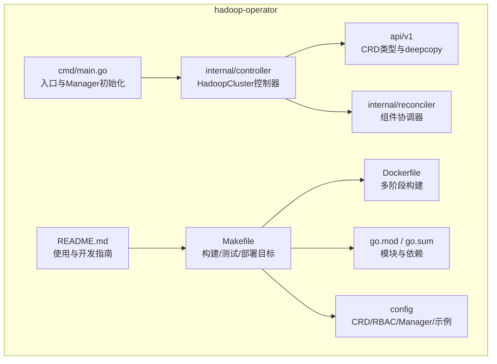
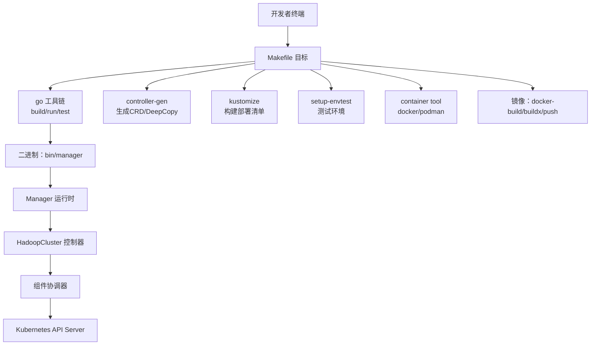
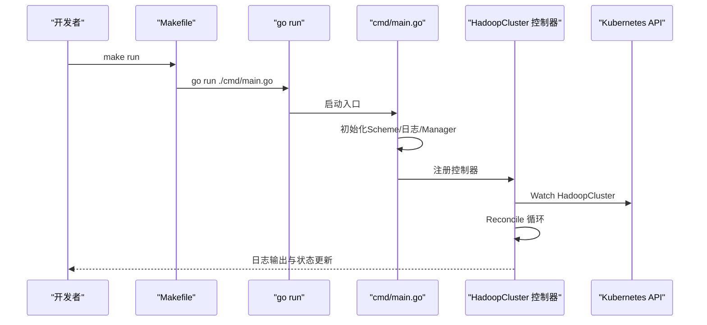
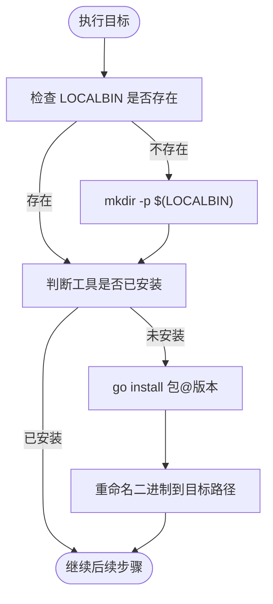
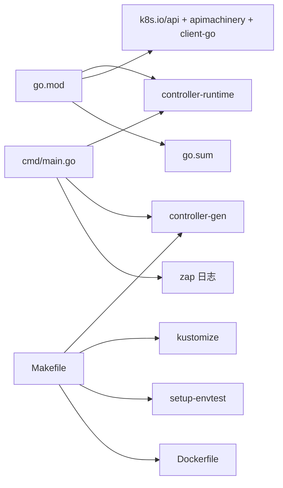

# 本地构建

<cite>
**本文引用的文件列表**
- [Makefile](file://hadoop-operator/Makefile)
- [go.mod](file://hadoop-operator/go.mod)
- [go.sum](file://hadoop-operator/go.sum)
- [Dockerfile](file://hadoop-operator/Dockerfile)
- [cmd/main.go](file://hadoop-operator/cmd/main.go)
- [internal/controller/hadoopcluster_controller.go](file://hadoop-operator/internal/controller/hadoopcluster_controller.go)
- [api/v1/hadoopcluster_types.go](file://hadoop-operator/api/v1/hadoopcluster_types.go)
- [README.md](file://hadoop-operator/README.md)
</cite>

## 目录
1. [简介](#简介)
2. [项目结构](#项目结构)
3. [核心组件](#核心组件)
4. [架构总览](#架构总览)
5. [详细组件分析](#详细组件分析)
6. [依赖关系分析](#依赖关系分析)
7. [性能与构建优化](#性能与构建优化)
8. [故障排查指南](#故障排查指南)
9. [结论](#结论)
10. [附录](#附录)

## 简介
本指南面向希望在本地快速构建与运行 Apache Hadoop Operator v3 的开发者，系统讲解 Makefile 中各构建目标的作用与执行流程，涵盖：
- 编译二进制：build
- 本地运行控制器：run
- 代码格式化：fmt
- 静态分析：vet
- 单元测试与环境准备：test
- 镜像构建与多平台支持：docker-build、docker-buildx、docker-push
- 部署与卸载 CRD/资源：install、uninstall、deploy、undeploy
- 依赖工具自动安装：controller-gen、kustomize、envtest

同时提供 Go 模块依赖管理、构建环境配置、依赖工具安装、常见问题排查与性能优化建议，帮助你高效完成本地开发与调试。

## 项目结构
该仓库采用典型的 Kubebuilder 项目布局，核心目录与职责如下：
- hadoop-operator/
  - api/v1：CRD 对应的 Go 类型定义与生成文件
  - cmd/main.go：Operator 入口，初始化 Scheme、Manager、控制器与健康检查
  - internal/controller：主控制器实现，负责 HadoopCluster 资源的协调
  - internal/reconciler：各组件（NameNode、DataNode、ResourceManager、NodeManager、ConfigMap、HA）的协调逻辑
  - config：CRD、RBAC、ServiceAccount、Manager 部署配置与示例
  - hack/offline：离线镜像准备脚本
  - Dockerfile：多阶段构建镜像
  - Makefile：统一的构建、测试、打包与部署目标
  - go.mod / go.sum：Go 模块与依赖清单
  - README.md：功能说明、快速开始、离线部署、开发指南与故障排查

图表来源
- [Makefile](file://hadoop-operator/Makefile)
- [go.mod](file://hadoop-operator/go.mod)
- [cmd/main.go](file://hadoop-operator/cmd/main.go)
- [internal/controller/hadoopcluster_controller.go](file://hadoop-operator/internal/controller/hadoopcluster_controller.go)
- [api/v1/hadoopcluster_types.go](file://hadoop-operator/api/v1/hadoopcluster_types.go)

章节来源
- [README.md](file://hadoop-operator/README.md)
- [Makefile](file://hadoop-operator/Makefile)

## 核心组件
- 控制器入口与 Manager 初始化：cmd/main.go 负责解析命令行参数、设置日志、创建 Manager、注册控制器、添加健康检查与 Ready 检查，并启动 Manager。
- 主控制器：internal/controller/HadoopClusterReconciler 实现 Reconcile 循环，按顺序协调 ConfigMap、服务、StatefulSets 等资源，维护集群状态机。
- CRD 类型：api/v1/HadoopClusterSpec 等类型定义了 HadoopCluster 的期望状态，包括镜像、HDFS、YARN、配置覆盖、安全与监控等字段。
- 构建与打包：Makefile 提供 build、run、fmt、vet、test、docker-build、docker-buildx、docker-push、install、uninstall、deploy、undeploy 等目标；Dockerfile 使用多阶段构建，先在 builder 镜像中下载依赖与编译二进制，再复制到 distroless 静态基础镜像。

章节来源
- [cmd/main.go](file://hadoop-operator/cmd/main.go)
- [internal/controller/hadoopcluster_controller.go](file://hadoop-operator/internal/controller/hadoopcluster_controller.go)
- [api/v1/hadoopcluster_types.go](file://hadoop-operator/api/v1/hadoopcluster_types.go)
- [Dockerfile](file://hadoop-operator/Dockerfile)
- [Makefile](file://hadoop-operator/Makefile)

## 架构总览
下图展示从本地运行到容器镜像构建的整体流程，以及关键依赖工具的调用关系。

图表来源
- [Makefile](file://hadoop-operator/Makefile)
- [Dockerfile](file://hadoop-operator/Dockerfile)
- [cmd/main.go](file://hadoop-operator/cmd/main.go)
- [internal/controller/hadoopcluster_controller.go](file://hadoop-operator/internal/controller/hadoopcluster_controller.go)

## 详细组件分析

### 构建目标详解
- build：生成二进制文件。前置依赖为 manifests、generate、fmt、vet。最终产物位于 bin/manager。
- run：在宿主机直接运行控制器，便于本地调试。等价于 go run ./cmd/main.go。
- fmt：对所有包执行 go fmt。
- vet：对所有包执行 go vet。
- test：运行单元测试前会自动准备 envtest 所需的 Kubernetes 版本资产，并输出覆盖率文件。
- docker-build：基于 Dockerfile 构建镜像，默认标签为 hadoop-operator:latest。
- docker-buildx：跨平台构建并推送镜像，支持多架构（如 linux/amd64、arm64、s390x、ppc64le），需要启用 buildx 与 BuildKit。
- docker-push：推送已构建镜像。
- install/uninstall/deploy/undeploy：通过 kustomize 构建并应用/删除 CRD、RBAC、ServiceAccount 与 Manager 配置。

章节来源
- [Makefile](file://hadoop-operator/Makefile)

### 本地运行流程（run）

图表来源
- [Makefile](file://hadoop-operator/Makefile)
- [cmd/main.go](file://hadoop-operator/cmd/main.go)
- [internal/controller/hadoopcluster_controller.go](file://hadoop-operator/internal/controller/hadoopcluster_controller.go)

### 依赖工具自动安装机制
Makefile 通过 go-install-tool 宏在 LOCALBIN 下按需下载 controller-gen、kustomize、setup-envtest，版本由变量控制。这些工具在生成 CRD、构建部署清单与测试环境准备中被调用。

图表来源
- [Makefile](file://hadoop-operator/Makefile)

### 代码生成与 CRD 更新
- manifests：调用 controller-gen 生成 RBAC、Webhook、CRD 等对象，并输出到 config/crd/bases。
- generate：生成 DeepCopy/DeepCopyInto/DeepCopyObject 方法，确保 CRD 类型可深度拷贝。

章节来源
- [Makefile](file://hadoop-operator/Makefile)

### 镜像构建与多平台支持
- docker-build：使用 Dockerfile 构建单平台镜像。
- docker-buildx：复制 Dockerfile 为 Dockerfile.cross 并启用 buildx，按指定平台列表构建与推送。
- Dockerfile：多阶段构建，先在 builder 镜像中下载 go.mod/go.sum 以缓存依赖，再复制源码并编译出 manager 二进制，最后复制到 distroless 静态镜像。

章节来源
- [Makefile](file://hadoop-operator/Makefile)
- [Dockerfile](file://hadoop-operator/Dockerfile)

### 部署与卸载流程
- install：应用 CRD 清单。
- uninstall：删除 CRD（可忽略不存在错误）。
- deploy：通过 kustomize 设置镜像标签并应用默认配置。
- undeploy：删除已部署资源（可忽略不存在错误）。

章节来源
- [Makefile](file://hadoop-operator/Makefile)

## 依赖关系分析
- Go 模块与版本：go.mod 指定 Go 1.21，依赖 k8s.io/* 与 sigs.k8s.io/controller-runtime 等核心库。
- 间接依赖：go.sum 记录了所有直接与间接依赖及其校验值，确保可复现构建。
- 构建工具链：Makefile 依赖 controller-gen、kustomize、setup-envtest 等工具，通过 go-install-tool 自动安装。
- 运行时依赖：cmd/main.go 引入 controller-runtime、zap 日志、webhook 与 CRD Scheme，用于 Manager 初始化与控制器注册。

图表来源
- [go.mod](file://hadoop-operator/go.mod)
- [go.sum](file://hadoop-operator/go.sum)
- [Makefile](file://hadoop-operator/Makefile)
- [Dockerfile](file://hadoop-operator/Dockerfile)
- [cmd/main.go](file://hadoop-operator/cmd/main.go)

章节来源
- [go.mod](file://hadoop-operator/go.mod)
- [go.sum](file://hadoop-operator/go.sum)
- [Makefile](file://hadoop-operator/Makefile)
- [cmd/main.go](file://hadoop-operator/cmd/main.go)

## 性能与构建优化
- 依赖缓存：Dockerfile 在 builder 阶段先复制 go.mod/go.sum 并执行 go mod download，避免源码变更导致依赖层失效。
- 交叉编译：docker-buildx 支持多架构构建，结合 BuildKit 可提升跨平台效率。
- 构建参数：Makefile 中 CONTAINER_TOOL 可替换为 podman 等其他容器工具；SHELL 与 .SHELLFLAGS 设定为 bash 且开启管道失败即退出，有助于 CI/CD 环境中的健壮性。
- 二进制体积：使用 distroless 静态镜像作为最终基础镜像，减少镜像大小与攻击面。
- 本地开发：使用 make run 可在宿主机直接运行，无需频繁构建镜像，适合迭代调试。

章节来源
- [Dockerfile](file://hadoop-operator/Dockerfile)
- [Makefile](file://hadoop-operator/Makefile)

## 故障排查指南
- 依赖工具缺失或版本不匹配
  - 症状：执行 make 时提示 controller-gen/kustomize/envtest 未找到
  - 处理：Makefile 会自动安装所需工具至 LOCALBIN，确认 LOCALBIN 可执行；若失败，检查网络与 go install 权限
- 测试环境准备失败
  - 症状：make test 报错，找不到 kubebuilder 测试资产
  - 处理：确保 ENVTEST_K8S_VERSION 与 setup-envtest 版本匹配；检查 LOCALBIN 可执行权限
- 镜像构建失败
  - 症状：docker-buildx 报错，提示未启用 BuildKit 或无法推送
  - 处理：启用 buildx 与 BuildKit；确保镜像仓库凭证正确；检查 IMG 标签格式
- 本地运行失败
  - 症状：make run 启动后无日志或立即退出
  - 处理：检查 kubeconfig 是否可用；确认集群版本满足前置要求；查看日志与错误输出
- 部署失败
  - 症状：kubectl 应用配置时报错或资源冲突
  - 处理：使用 make uninstall/undeploy 清理后再重新部署；核对 config/default 与 config/manager 的镜像标签

章节来源
- [Makefile](file://hadoop-operator/Makefile)
- [README.md](file://hadoop-operator/README.md)

## 结论
通过本指南，你可以：
- 明确 Makefile 各目标的职责与执行顺序
- 在本地快速完成代码格式化、静态分析、单元测试与二进制构建
- 使用 run 快速调试控制器，或使用 docker-build/docker-buildx 构建多平台镜像
- 借助自动安装的依赖工具完成 CRD 生成与部署
- 在遇到问题时快速定位并解决常见构建与运行问题

## 附录

### 本地开发环境搭建步骤
- 安装 Go 1.21 或以上版本，确保 GOPATH/GOBIN 配置正确
- 准备 kubectl 并配置可用的集群上下文
- 安装 Docker 或 Podman（CONTAINER_TOOL 可替换）
- 在 hadoop-operator 目录执行：
  - 下载依赖：go mod download
  - 生成 CRD/DeepCopy：make manifests generate
  - 格式化与静态分析：make fmt vet
  - 运行控制器：make run
  - 运行测试：make test
  - 构建镜像：make docker-build IMG=your-repo/hadoop-operator:tag
  - 多平台构建并推送：make docker-buildx IMG=your-repo/hadoop-operator:tag
  - 部署到集群：make install deploy

章节来源
- [README.md](file://hadoop-operator/README.md)
- [Makefile](file://hadoop-operator/Makefile)
- [go.mod](file://hadoop-operator/go.mod)