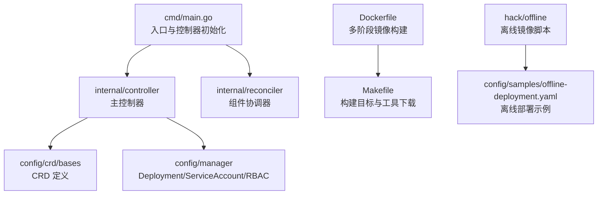
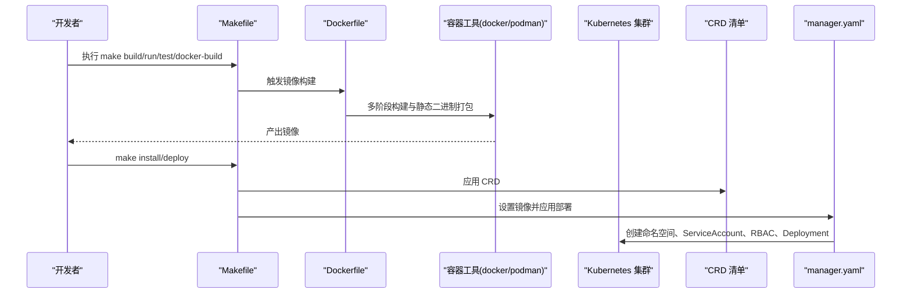
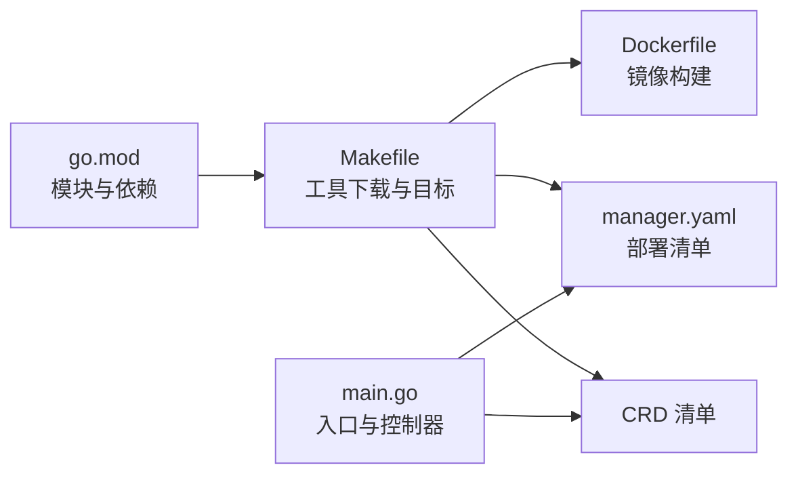

# 构建与打包

<cite>
**本文引用的文件**
- [Makefile](file://hadoop-operator/Makefile)
- [Dockerfile](file://hadoop-operator/Dockerfile)
- [go.mod](file://hadoop-operator/go.mod)
- [README.md](file://hadoop-operator/README.md)
- [main.go](file://hadoop-operator/cmd/main.go)
- [manager.yaml](file://hadoop-operator/config/manager/manager.yaml)
- [hadoop.apache.org_hadoopclusters.yaml](file://hadoop-operator/config/crd/bases/hadoop.apache.org_hadoopclusters.yaml)
- [save-images.sh](file://hadoop-operator/hack/offline/save-images.sh)
- [load-images.sh](file://hadoop-operator/hack/offline/load-images.sh)
- [mirror-images.sh](file://hadoop-operator/hack/offline/mirror-images.sh)
- [offline-deployment.yaml](file://hadoop-operator/config/samples/offline-deployment.yaml)
</cite>

## 目录
1. [简介](#简介)
2. [项目结构](#项目结构)
3. [核心组件](#核心组件)
4. [架构总览](#架构总览)
5. [详细组件分析](#详细组件分析)
6. [依赖关系分析](#依赖关系分析)
7. [性能与构建优化](#性能与构建优化)
8. [故障排查指南](#故障排查指南)
9. [结论](#结论)
10. [附录](#附录)

## 简介
本指南面向 Apache Hadoop Operator v3 的构建与打包流程，系统讲解 Makefile 中各构建目标的作用与使用方式，涵盖本地构建、运行、测试、容器镜像构建与推送、多平台镜像构建、离线部署镜像准备与私有仓库配置，并给出版本管理、发布流程与持续集成建议，以及构建优化与缓存策略。

## 项目结构
该项目采用基于模块化的分层组织：
- cmd/main.go：Operator 入口，初始化控制器、指标、健康探针与 Webhook。
- api/v1：CRD 类型定义与生成物。
- internal/controller 与 internal/reconciler：控制器与组件协调器实现。
- config：Kubernetes 清单与 Kustomize 配置。
- hack/offline：离线部署相关脚本。
- Dockerfile 与 Makefile：镜像构建与构建流程编排。
- go.mod：Go 模块与依赖版本。

图表来源
- [main.go:1-150](file://hadoop-operator/cmd/main.go#L1-L150)
- [manager.yaml:1-80](file://hadoop-operator/config/manager/manager.yaml#L1-L80)
- [hadoop.apache.org_hadoopclusters.yaml:1-411](file://hadoop-operator/config/crd/bases/hadoop.apache.org_hadoopclusters.yaml#L1-L411)
- [Dockerfile:1-34](file://hadoop-operator/Dockerfile#L1-L34)
- [Makefile:1-165](file://hadoop-operator/Makefile#L1-L165)
- [offline-deployment.yaml:1-135](file://hadoop-operator/config/samples/offline-deployment.yaml#L1-L135)

章节来源
- [README.md:233-251](file://hadoop-operator/README.md#L233-L251)

## 核心组件
- 构建目标与工具链
  - Makefile 提供统一的构建、测试、安装/卸载 CRD、部署/卸载 Operator、下载工具等目标。
  - 依赖工具通过 LOCALBIN 下载并缓存，避免重复安装。
- 镜像构建
  - Dockerfile 采用多阶段构建，先在 builder 阶段编译静态二进制，再复制到 distroless 静态基础镜像，最小化镜像体积与攻击面。
- 离线部署
  - 提供 save-images.sh、load-images.sh、mirror-images.sh 三类脚本，支持保存、加载与镜像镜像到私有仓库。
- 配置清单
  - manager.yaml 定义命名空间、Deployment、探针、资源限制与安全上下文；CRD 定义了 HadoopCluster 的完整字段与状态。

章节来源
- [Makefile:1-165](file://hadoop-operator/Makefile#L1-L165)
- [Dockerfile:1-34](file://hadoop-operator/Dockerfile#L1-L34)
- [manager.yaml:1-80](file://hadoop-operator/config/manager/manager.yaml#L1-L80)
- [hadoop.apache.org_hadoopclusters.yaml:1-411](file://hadoop-operator/config/crd/bases/hadoop.apache.org_hadoopclusters.yaml#L1-L411)

## 架构总览
下图展示从源码到镜像、再到 Kubernetes 集群部署的整体流程。

图表来源
- [Makefile:61-118](file://hadoop-operator/Makefile#L61-L118)
- [Dockerfile:1-34](file://hadoop-operator/Dockerfile#L1-L34)
- [manager.yaml:1-80](file://hadoop-operator/config/manager/manager.yaml#L1-L80)

## 详细组件分析

### Makefile 构建目标详解
- 通用与开发目标
  - help：打印所有目标与描述。
  - fmt、vet：格式化与静态检查。
  - generate、manifests：生成代码与 CRD/RBAC/Webhook 清单。
- 构建与运行
  - build：编译二进制至 bin/manager。
  - run：在本地以 go run 运行控制器。
  - test：准备 envtest 资源后执行单元测试。
- 镜像构建与推送
  - docker-build：使用容器工具构建镜像，默认标签来自 IMG。
  - docker-push：推送镜像。
  - docker-buildx：多平台构建并推送，支持 linux/arm64、linux/amd64、linux/s390x、linux/ppc64le。
- 部署与卸载
  - install/uninstall：安装/卸载 CRD。
  - deploy/undeploy：设置镜像并部署/卸载控制器。
- 工具下载与版本
  - kustomize、controller-gen、envtest：自动下载到 bin 目录，版本由变量控制。

章节来源
- [Makefile:24-165](file://hadoop-operator/Makefile#L24-L165)

### Dockerfile 多阶段构建与镜像优化
- 多阶段构建
  - builder 阶段：复制 go.mod/go.sum 并执行 go mod download 缓存依赖；随后复制源码并编译静态二进制。
  - 最终阶段：基于 distroless 静态镜像，仅复制二进制并设置非 root 用户运行。
- 平台与架构
  - 支持通过 TARGETOS/TARGETARCH 构建不同平台二进制；docker-buildx 通过 BuildKit 与 buildx 实现多平台镜像。
- 安全与体积
  - 使用 distroless 静态基础镜像，减少攻击面；CGO_ENABLED=0 生成纯静态二进制，提升可移植性。

章节来源
- [Dockerfile:1-34](file://hadoop-operator/Dockerfile#L1-L34)

### 离线部署镜像准备与私有仓库配置
- 保存镜像（有网环境）
  - 使用 save-images.sh 将 Hadoop 与 ZooKeeper 镜像保存为 tar 包，便于离线传输。
- 加载镜像（离线环境）
  - 使用 load-images.sh 从 tar 包加载镜像；可选将镜像打标签并推送到私有仓库。
- 私有仓库镜像镜像
  - 使用 mirror-images.sh 将源镜像拉取并推送到目标私有仓库，便于批量处理。
- 配置与部署
  - 在 offline-deployment.yaml 中配置私有仓库镜像、拉取策略与 Secret；按需启用监控导出器镜像。

章节来源
- [save-images.sh:1-66](file://hadoop-operator/hack/offline/save-images.sh#L1-L66)
- [load-images.sh:1-75](file://hadoop-operator/hack/offline/load-images.sh#L1-L75)
- [mirror-images.sh:1-127](file://hadoop-operator/hack/offline/mirror-images.sh#L1-L127)
- [offline-deployment.yaml:1-135](file://hadoop-operator/config/samples/offline-deployment.yaml#L1-L135)

### 部署清单与 CRD 字段
- manager.yaml
  - 定义命名空间、Deployment、探针、资源请求/限制、安全上下文与亲和性约束。
- CRD 定义
  - HadoopCluster CRD 完整描述了镜像、HDFS、YARN、配置覆盖、监控、安全等字段与状态。

章节来源
- [manager.yaml:1-80](file://hadoop-operator/config/manager/manager.yaml#L1-L80)
- [hadoop.apache.org_hadoopclusters.yaml:1-411](file://hadoop-operator/config/crd/bases/hadoop.apache.org_hadoopclusters.yaml#L1-L411)

## 依赖关系分析
- 模块与工具
  - go.mod 指定 Go 版本与依赖版本，确保构建一致性。
  - Makefile 通过 go-install-tool 自动下载 controller-gen、kustomize、envtest 到 bin 目录，避免手工安装。
- 控制器与入口
  - main.go 初始化 Scheme、控制器、健康/就绪探针与 Webhook，绑定 metrics 地址与 TLS 配置。

图表来源
- [go.mod:1-69](file://hadoop-operator/go.mod#L1-L69)
- [Makefile:120-165](file://hadoop-operator/Makefile#L120-L165)
- [Dockerfile:1-34](file://hadoop-operator/Dockerfile#L1-L34)
- [manager.yaml:1-80](file://hadoop-operator/config/manager/manager.yaml#L1-L80)
- [hadoop.apache.org_hadoopclusters.yaml:1-411](file://hadoop-operator/config/crd/bases/hadoop.apache.org_hadoopclusters.yaml#L1-L411)
- [main.go:1-150](file://hadoop-operator/cmd/main.go#L1-L150)

章节来源
- [go.mod:1-69](file://hadoop-operator/go.mod#L1-L69)
- [Makefile:120-165](file://hadoop-operator/Makefile#L120-L165)
- [main.go:1-150](file://hadoop-operator/cmd/main.go#L1-L150)

## 性能与构建优化
- 依赖缓存
  - Dockerfile 先复制 go.mod/go.sum 再复制源码，最大化依赖层缓存命中率。
  - Makefile 工具下载到 bin 目录并复用，避免重复下载。
- 构建产物最小化
  - 使用 distroless 静态镜像与 CGO_ENABLED=0 生成静态二进制，显著降低镜像体积与启动时间。
- 多平台构建
  - docker-buildx 支持多架构并行构建与推送，结合 BuildKit 与 buildx 提升效率。
- 并行与流水线
  - Makefile 目标可并行执行（如 docker-buildx），结合 CI 并行任务加速整体构建。

章节来源
- [Dockerfile:1-34](file://hadoop-operator/Dockerfile#L1-L34)
- [Makefile:87-96](file://hadoop-operator/Makefile#L87-L96)

## 故障排查指南
- 镜像拉取失败
  - 检查私有仓库 Secret 是否正确创建与挂载；确认镜像仓库地址与凭据匹配。
- 部署失败或 Pod 异常
  - 使用 kubectl describe/ logs 检查事件与日志；核对资源请求/限制与节点亲和性。
- 离线镜像加载
  - 确认 tar 包已完整传输；使用 load-images.sh 正确加载；若需推送私有仓库，检查网络与权限。
- 多平台镜像
  - 确保启用 BuildKit 与 buildx；检查平台列表与镜像标签；必要时清理 buildx builder。

章节来源
- [README.md:310-318](file://hadoop-operator/README.md#L310-L318)
- [load-images.sh:1-75](file://hadoop-operator/hack/offline/load-images.sh#L1-L75)
- [Makefile:87-96](file://hadoop-operator/Makefile#L87-L96)

## 结论
本指南系统梳理了 Apache Hadoop Operator v3 的构建与打包流程，涵盖本地开发、容器镜像构建与多平台支持、离线部署与私有仓库配置，并提供了性能优化与故障排查建议。遵循本文流程可在不同环境下稳定地构建、交付与运行 Hadoop Operator。

## 附录

### 常用命令速查
- 本地构建与运行
  - make build
  - make run
- 测试
  - make test
- 镜像构建与推送
  - make docker-build IMG=your-repo/hadoop-operator:tag
  - make docker-push IMG=your-repo/hadoop-operator:tag
- 多平台镜像
  - make docker-buildx IMG=your-repo/hadoop-operator:tag
- 部署与卸载
  - make install / make uninstall
  - make deploy / make undeploy

章节来源
- [README.md:253-274](file://hadoop-operator/README.md#L253-L274)
- [Makefile:61-118](file://hadoop-operator/Makefile#L61-L118)