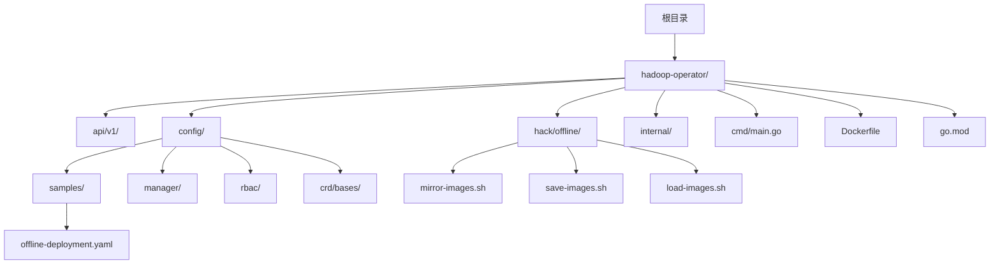
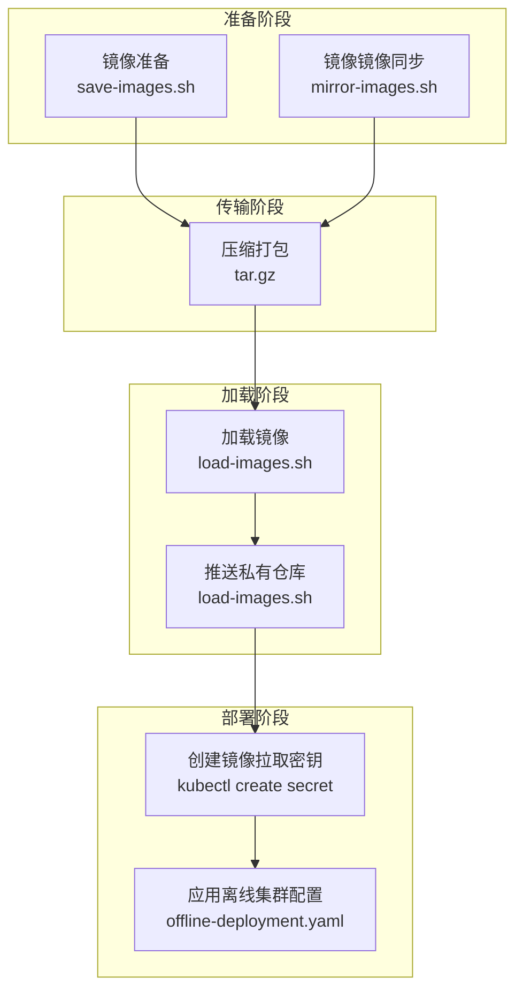
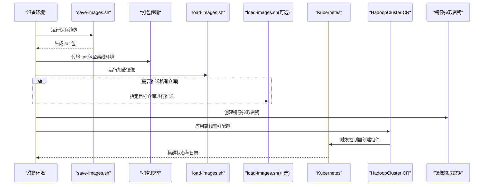
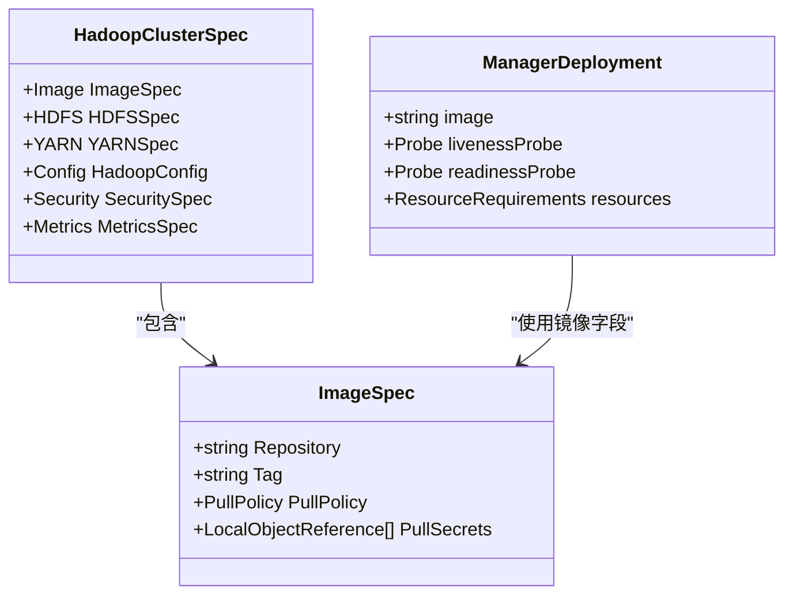

# 离线部署

<cite>
**本文引用的文件**
- [README.md](file://hadoop-operator/README.md)
- [Dockerfile](file://hadoop-operator/Dockerfile)
- [mirror-images.sh](file://hadoop-operator/hack/offline/mirror-images.sh)
- [save-images.sh](file://hadoop-operator/hack/offline/save-images.sh)
- [load-images.sh](file://hadoop-operator/hack/offline/load-images.sh)
- [offline-deployment.yaml](file://hadoop-operator/config/samples/offline-deployment.yaml)
- [hadoopcluster_types.go](file://hadoop-operator/api/v1/hadoopcluster_types.go)
- [manager.yaml](file://hadoop-operator/config/manager/manager.yaml)
- [go.mod](file://hadoop-operator/go.mod)
</cite>

## 目录
1. [简介](#简介)
2. [项目结构](#项目结构)
3. [核心组件](#核心组件)
4. [架构总览](#架构总览)
5. [详细组件分析](#详细组件分析)
6. [依赖关系分析](#依赖关系分析)
7. [性能考虑](#性能考虑)
8. [故障排查指南](#故障排查指南)
9. [结论](#结论)
10. [附录](#附录)

## 简介
本指南面向在离线或受限网络环境中部署 Apache Hadoop Operator v3 的用户，提供从镜像准备、镜像保存与加载，到私有镜像仓库配置与集群部署的完整流程。文档重点解释三个离线脚本的功能与使用方法，并给出离线环境准备清单、私有仓库搭建与配置建议、部署验证与故障排查步骤。

## 项目结构
- 顶层目录包含 Operator 源码与示例资源：
  - hadoop-operator：Operator 源码、CRD、RBAC、示例与离线工具
  - configmap.yaml、datanode.yaml、namenode.yaml、nodemanager.yaml、resourcemanager.yaml：组件示例资源（非离线专用）

图表来源
- [README.md:84-126](file://hadoop-operator/README.md#L84-L126)
- [offline-deployment.yaml](file://hadoop-operator/config/samples/offline-deployment.yaml)
- [mirror-images.sh](file://hadoop-operator/hack/offline/mirror-images.sh)
- [save-images.sh](file://hadoop-operator/hack/offline/save-images.sh)
- [load-images.sh](file://hadoop-operator/hack/offline/load-images.sh)

章节来源
- [README.md:84-126](file://hadoop-operator/README.md#L84-L126)
- [offline-deployment.yaml](file://hadoop-operator/config/samples/offline-deployment.yaml)

## 核心组件
- 离线镜像工具链
  - mirror-images.sh：将所需镜像从源仓库镜像到目标私有仓库，支持指定源仓库（代理）与版本参数
  - save-images.sh：将镜像保存为 tar 包，便于离线传输
  - load-images.sh：从 tar 包加载镜像，并可选择推送至私有仓库
- 私有镜像仓库配置
  - 通过 Kubernetes Secret 提供镜像拉取凭据
  - 在 HadoopCluster CR 中配置镜像仓库、标签、拉取策略与拉取密钥
- 离线部署示例
  - offline-deployment.yaml：示例离线集群配置，包含镜像仓库、HA、存储与监控等设置

章节来源
- [README.md:84-126](file://hadoop-operator/README.md#L84-L126)
- [hadoopcluster_types.go:48-59](file://hadoop-operator/api/v1/hadoopcluster_types.go#L48-L59)
- [offline-deployment.yaml](file://hadoop-operator/config/samples/offline-deployment.yaml)

## 架构总览
离线部署的关键流程由“镜像准备—镜像传输—镜像加载/推送—集群部署”构成，涉及以下组件交互：

图表来源
- [README.md:84-126](file://hadoop-operator/README.md#L84-L126)
- [save-images.sh](file://hadoop-operator/hack/offline/save-images.sh)
- [load-images.sh](file://hadoop-operator/hack/offline/load-images.sh)
- [offline-deployment.yaml](file://hadoop-operator/config/samples/offline-deployment.yaml)

## 详细组件分析

### 镜像准备与传输：save-images.sh
- 功能概述
  - 将 Hadoop 与 Zookeeper 镜像拉取并保存为 tar 包，输出到指定目录
  - 支持自定义输出目录与 Hadoop 版本参数
- 关键行为
  - 拉取镜像后执行保存，生成以镜像名转换命名的 tar 文件
  - 输出加载命令提示，便于在目标系统批量加载
- 使用场景
  - 适用于网络受限环境，先在有网环境完成镜像保存，再通过介质传输到离线环境

章节来源
- [save-images.sh:1-66](file://hadoop-operator/hack/offline/save-images.sh#L1-L66)

### 镜像镜像同步：mirror-images.sh
- 功能概述
  - 将指定镜像从源仓库镜像到目标私有仓库，支持可选的源仓库前缀（用于代理）
  - 自动处理 tag 与 push，并清理中间镜像
- 关键行为
  - 支持指定源仓库、目标仓库、Hadoop 版本等参数
  - 输出更新后的 HadoopCluster CR 示例，便于直接应用
- 使用场景
  - 适用于已有私有仓库且需统一镜像版本与命名空间的场景

章节来源
- [mirror-images.sh:1-127](file://hadoop-operator/hack/offline/mirror-images.sh#L1-L127)

### 镜像加载与推送：load-images.sh
- 功能概述
  - 从 tar 包批量加载镜像到本地 Docker 引擎
  - 可选地将已加载镜像打标签并推送到目标私有仓库
- 关键行为
  - 遍历输入目录中的 tar 文件并加载
  - 若提供目标仓库，则自动识别已加载镜像并推送
- 使用场景
  - 适用于离线环境直接加载镜像，或在加载后统一推送到私有仓库

章节来源
- [load-images.sh:1-75](file://hadoop-operator/hack/offline/load-images.sh#L1-L75)

### 私有镜像仓库配置与集群部署
- 镜像拉取密钥
  - 使用 kubectl create secret docker-registry 创建 regcred，包含私有仓库地址、用户名与密码
  - 在 HadoopCluster CR 的 image.pullSecrets 中引用该密钥
- 集群配置
  - 在 offline-deployment.yaml 中设置镜像仓库、标签与拉取策略
  - 可配置监控导出器镜像仓库，便于离线环境监控

章节来源
- [README.md:110-126](file://hadoop-operator/README.md#L110-L126)
- [hadoopcluster_types.go:48-59](file://hadoop-operator/api/v1/hadoopcluster_types.go#L48-L59)
- [offline-deployment.yaml](file://hadoop-operator/config/samples/offline-deployment.yaml)

### 离线部署流程时序

图表来源
- [README.md:84-126](file://hadoop-operator/README.md#L84-L126)
- [save-images.sh](file://hadoop-operator/hack/offline/save-images.sh)
- [load-images.sh](file://hadoop-operator/hack/offline/load-images.sh)
- [offline-deployment.yaml](file://hadoop-operator/config/samples/offline-deployment.yaml)

## 依赖关系分析
- 镜像工具与 Operator 镜像
  - Dockerfile 定义了 Operator 镜像构建过程，最终以 distroless 静态镜像为基础
  - 离线工具主要依赖 Docker CLI 与 tar 包，不直接依赖 Operator 二进制
- 配置模型
  - HadoopClusterSpec 中的 ImageSpec 字段控制镜像仓库、标签、拉取策略与拉取密钥
  - offline-deployment.yaml 展示了镜像仓库与监控导出器镜像的配置方式

图表来源
- [hadoopcluster_types.go:24-46](file://hadoop-operator/api/v1/hadoopcluster_types.go#L24-L46)
- [hadoopcluster_types.go:48-59](file://hadoop-operator/api/v1/hadoopcluster_types.go#L48-L59)
- [manager.yaml:52](file://hadoop-operator/config/manager/manager.yaml#L52)

章节来源
- [Dockerfile:1-34](file://hadoop-operator/Dockerfile#L1-L34)
- [hadoopcluster_types.go:24-46](file://hadoop-operator/api/v1/hadoopcluster_types.go#L24-L46)
- [manager.yaml:52](file://hadoop-operator/config/manager/manager.yaml#L52)

## 性能考虑
- 镜像体积与传输效率
  - 使用 distroless 基础镜像减少镜像体积，提升拉取速度
  - 离线传输时优先选择压缩率高的 tar.gz 格式
- 并发与资源
  - 镜像保存/加载/推送过程中建议避免同时进行大量 IO 操作
  - 在目标节点上合理分配磁盘空间，避免因空间不足导致失败

## 故障排查指南
- 镜像拉取失败
  - 检查镜像仓库地址、凭据与网络连通性
  - 确认 HadoopCluster CR 中的 image.pullSecrets 是否正确引用
- 镜像未被加载
  - 确认 load-images.sh 输入目录与 tar 文件存在
  - 如需推送私有仓库，确认目标仓库可达且具有写权限
- 集群组件启动异常
  - 使用 kubectl describe pod 与 kubectl logs 查看事件与日志
  - 检查 PVC 状态与存储类配置
- NameNode 格式化与连接问题
  - 检查 NameNode 与 DataNode 的服务连通性
  - 必要时手动格式化 NameNode（谨慎操作）

章节来源
- [README.md:276-318](file://hadoop-operator/README.md#L276-L318)

## 结论
通过离线工具链与私有镜像仓库配置，Apache Hadoop Operator v3 可在完全隔离的网络环境中稳定部署。建议在准备阶段明确镜像版本与仓库策略，在传输与加载阶段做好校验与备份，并在部署后进行充分验证与监控。

## 附录

### 离线环境准备清单
- 网络隔离
  - 明确离线环境的网络边界与访问策略
  - 准备可移动介质用于镜像包传输
- 存储空间规划
  - 评估 Hadoop 数据卷与 Zookeeper 日志卷的空间需求
  - 留足镜像缓存与日志空间余量
- 私有镜像仓库
  - 选择 Harbor/Nexus 等方案，确保 HTTPS 与访问控制
  - 预留足够磁盘容量与带宽

### 私有镜像仓库搭建与配置（概念性说明）
- Harbor/Nexus 部署
  - 安装并初始化私有仓库，启用 TLS 与用户认证
  - 创建命名空间/项目并授权访问
- 镜像推送
  - 在准备环境使用镜像工具将镜像推送到私有仓库
  - 在离线环境通过 kubectl create secret docker-registry 创建拉取密钥
- 集群配置
  - 在 HadoopCluster CR 中配置镜像仓库、标签与拉取密钥
  - 应用离线部署示例并观察组件状态

[本节为概念性内容，不直接对应具体源码文件]