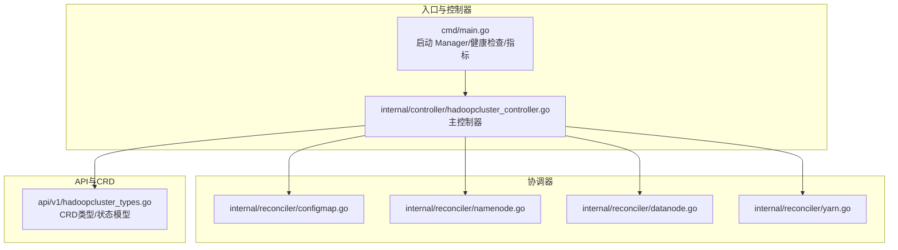
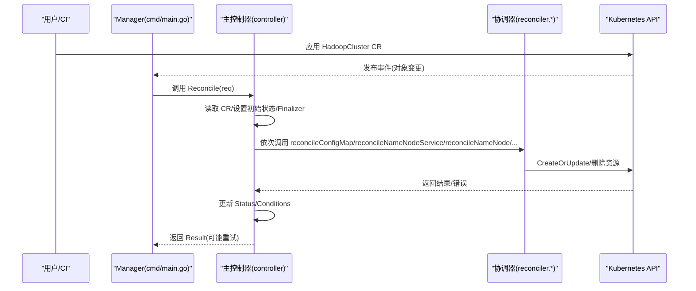
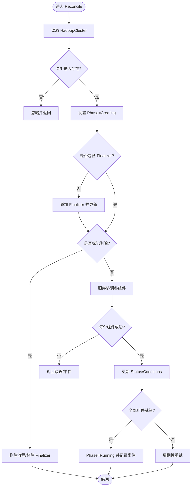
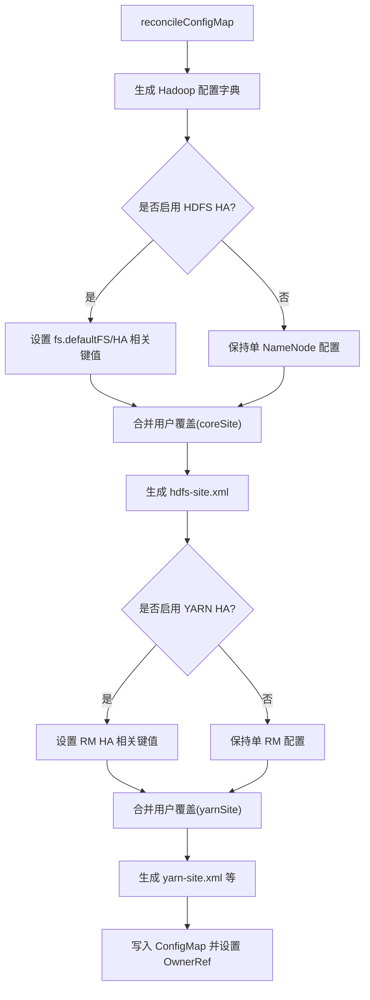
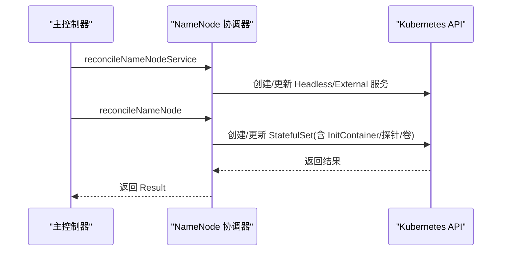
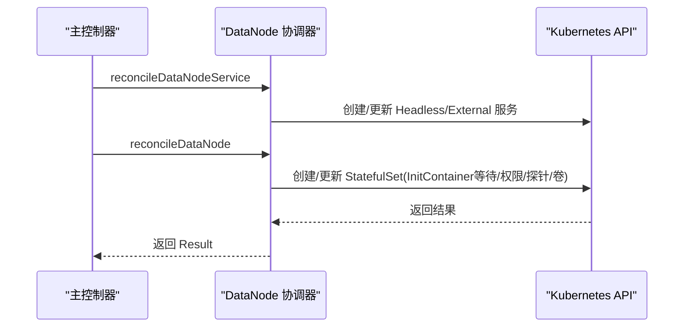
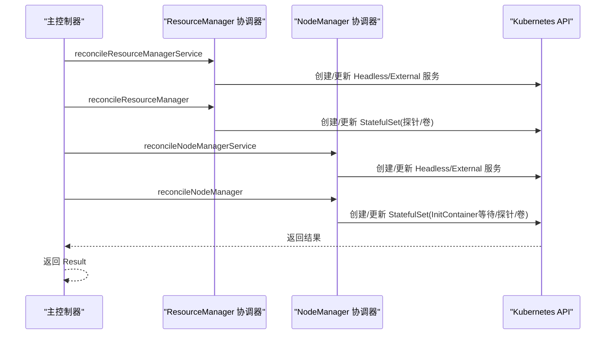
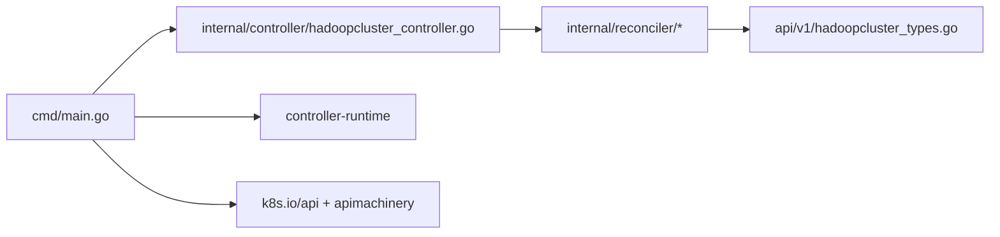
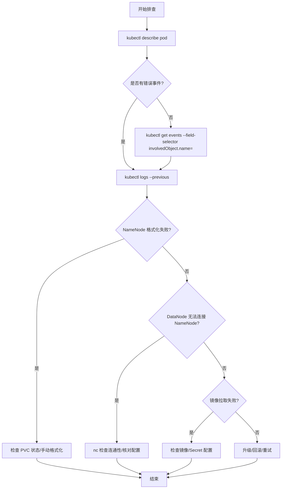

# 测试与调试

<cite>
**本文引用的文件**
- [go.mod](file://go.mod)
- [README.md](file://README.md)
- [Makefile](file://Makefile)
- [cmd/main.go](file://cmd/main.go)
- [api/v1/hadoopcluster_types.go](file://api/v1/hadoopcluster_types.go)
- [internal/controller/hadoopcluster_controller.go](file://internal/controller/hadoopcluster_controller.go)
- [internal/reconciler/configmap.go](file://internal/reconciler/configmap.go)
- [internal/reconciler/namenode.go](file://internal/reconciler/namenode.go)
- [internal/reconciler/datanode.go](file://internal/reconciler/datanode.go)
- [internal/reconciler/yarn.go](file://internal/reconciler/yarn.go)
- [config/samples/hadoop_v1_hadoopcluster.yaml](file://config/samples/hadoop_v1_hadoopcluster.yaml)
- [config/samples/hadoop_v1_hadoopcluster_ha.yaml](file://config/samples/hadoop_v1_hadoopcluster_ha.yaml)
</cite>

## 目录
1. [简介](#简介)
2. [项目结构](#项目结构)
3. [核心组件](#核心组件)
4. [架构总览](#架构总览)
5. [详细组件分析](#详细组件分析)
6. [依赖分析](#依赖分析)
7. [性能考虑](#性能考虑)
8. [故障排查指南](#故障排查指南)
9. [结论](#结论)
10. [附录](#附录)

## 简介
本指南面向 Apache Hadoop Operator v3 的测试与调试实践，围绕单元测试、集成测试、端到端测试的编写与执行展开；同时给出测试环境搭建、测试数据准备、用例设计原则、调试技巧、日志分析方法、常见问题诊断流程，以及基于 kubectl 与 controller-runtime 工具链的调试实操。此外，还涵盖性能测试、压力测试与故障注入测试方法，并提供测试覆盖率分析与质量保证流程建议。

## 项目结构
该项目采用典型的 controller-runtime 结构，主要模块包括：
- cmd/main.go：Operator 入口，初始化 Manager、注册控制器、健康探针与指标服务。
- api/v1：自定义资源 CRD 的 Go 类型定义与状态模型。
- internal/controller：主控制器，负责 HadoopCluster 资源的 Reconcile 循环与状态更新。
- internal/reconciler：各组件协调器（ConfigMap、NameNode、DataNode、ResourceManager、NodeManager），按顺序协调生成对应 Kubernetes 资源。
- config/samples：示例 CRD 配置，用于快速验证部署与测试。
- Makefile：提供构建、测试、安装、部署等常用目标。

**图表来源**
- [cmd/main.go:54-149](file://cmd/main.go#L54-L149)
- [internal/controller/hadoopcluster_controller.go:60-145](file://internal/controller/hadoopcluster_controller.go#L60-L145)
- [internal/reconciler/configmap.go:44-68](file://internal/reconciler/configmap.go#L44-L68)
- [internal/reconciler/namenode.go:117-317](file://internal/reconciler/namenode.go#L117-L317)
- [internal/reconciler/datanode.go:116-321](file://internal/reconciler/datanode.go#L116-L321)
- [internal/reconciler/yarn.go:115-240](file://internal/reconciler/yarn.go#L115-L240)
- [api/v1/hadoopcluster_types.go:24-418](file://api/v1/hadoopcluster_types.go#L24-L418)

**章节来源**
- [README.md:233-251](file://README.md#L233-L251)
- [Makefile:39-57](file://Makefile#L39-L57)

## 核心组件
- 主控制器（HadoopClusterReconciler）：负责读取 CR、设置初始状态、添加 Finalizer、处理删除、按顺序调用各组件协调器、更新状态与条件、周期性重试。
- 协调器（reconciler.*）：分别负责 ConfigMap、NameNode、DataNode、ResourceManager、NodeManager 的创建/更新逻辑，含服务、StatefulSet、PVC、探针与卷挂载等。
- CRD 类型与状态：定义了镜像、HDFS/YARN 规模、存储、服务暴露、配置覆盖、安全与监控等字段，以及 Phase、Conditions、各组件 ReadyReplicas 等状态。

关键职责与边界：
- 控制器只负责编排与状态同步，不直接执行业务逻辑。
- 协调器封装具体组件的资源模板与参数生成。
- CRD 类型定义决定测试输入与期望输出。

**章节来源**
- [internal/controller/hadoopcluster_controller.go:41-145](file://internal/controller/hadoopcluster_controller.go#L41-L145)
- [internal/reconciler/configmap.go:44-209](file://internal/reconciler/configmap.go#L44-L209)
- [internal/reconciler/namenode.go:117-317](file://internal/reconciler/namenode.go#L117-L317)
- [internal/reconciler/datanode.go:116-321](file://internal/reconciler/datanode.go#L116-L321)
- [internal/reconciler/yarn.go:115-240](file://internal/reconciler/yarn.go#L115-L240)
- [api/v1/hadoopcluster_types.go:24-418](file://api/v1/hadoopcluster_types.go#L24-L418)

## 架构总览
下图展示从 CR 到最终 Kubernetes 资源的编排路径，以及控制器与协调器之间的关系。

**图表来源**
- [cmd/main.go:125-132](file://cmd/main.go#L125-L132)
- [internal/controller/hadoopcluster_controller.go:104-144](file://internal/controller/hadoopcluster_controller.go#L104-L144)
- [internal/reconciler/configmap.go:44-68](file://internal/reconciler/configmap.go#L44-L68)
- [internal/reconciler/namenode.go:117-317](file://internal/reconciler/namenode.go#L117-L317)
- [internal/reconciler/datanode.go:116-321](file://internal/reconciler/datanode.go#L116-L321)
- [internal/reconciler/yarn.go:115-240](file://internal/reconciler/yarn.go#L115-L240)

## 详细组件分析

### 主控制器（HadoopClusterReconciler）
- 关键流程
  - 获取 CR 并处理不存在场景。
  - 初始化状态 Phase/Pending → Creating，写入 Status。
  - 添加 Finalizer，处理删除时清理与移除 Finalizer。
  - 顺序调用各组件协调器，任一返回错误或需要重试则短路。
  - 更新各组件 ReadyReplicas、Conditions，判定 Running。
  - 设置周期性重试间隔。
- 错误处理
  - 对协调器返回的错误记录事件并立即返回。
  - 对查询/更新状态失败进行错误传播。
- 可测试点
  - 不同 Phase 的进入路径。
  - 删除流程与 Finalizer 行为。
  - 组件顺序与早停逻辑。
  - 状态更新与 Ready 条件计算。

**图表来源**
- [internal/controller/hadoopcluster_controller.go:60-144](file://internal/controller/hadoopcluster_controller.go#L60-L144)

**章节来源**
- [internal/controller/hadoopcluster_controller.go:41-239](file://internal/controller/hadoopcluster_controller.go#L41-L239)

### 协调器：ConfigMap（Hadoop 配置）
- 作用：根据 CR 生成 core-site/hdfs-site/yarn-site/mapred-site/capacity-scheduler 等 XML 内容，注入 ZooKeeper/HDFS HA/RM HA 等配置。
- 关键点
  - 生成 XML 的函数与合并用户覆盖项。
  - HA 模式下的服务名与代理提供者配置。
  - 默认镜像选择与 ZooKeeper 仲裁地址解析。
- 测试要点
  - 不同 HA 开关组合下的配置差异。
  - 用户覆盖项优先级。
  - 外部 ZooKeeper 与默认 ZooKeeper 的分支逻辑。

**图表来源**
- [internal/reconciler/configmap.go:44-209](file://internal/reconciler/configmap.go#L44-L209)

**章节来源**
- [internal/reconciler/configmap.go:44-246](file://internal/reconciler/configmap.go#L44-L246)

### 协调器：NameNode（服务与 StatefulSet）
- 作用：创建 Headless/External 服务，创建 StatefulSet（含 InitContainer、探针、卷与 PVC 模板）。
- 关键点
  - HA 模式下副本数最小为 2，首实例格式化。
  - 资源请求/限制默认值与存储大小默认值。
  - 外部服务类型与 NodePort 映射。
- 测试要点
  - HA 与非 HA 的不同脚本与行为。
  - 资源与存储默认值覆盖。
  - 服务类型与端口映射。
  - 探针路径与健康检查。

**图表来源**
- [internal/controller/hadoopcluster_controller.go:107-114](file://internal/controller/hadoopcluster_controller.go#L107-L114)
- [internal/reconciler/namenode.go:36-114](file://internal/reconciler/namenode.go#L36-L114)
- [internal/reconciler/namenode.go:117-317](file://internal/reconciler/namenode.go#L117-L317)

**章节来源**
- [internal/reconciler/namenode.go:36-371](file://internal/reconciler/namenode.go#L36-L371)

### 协调器：DataNode（服务与 StatefulSet）
- 作用：创建 Headless/External 服务，创建 StatefulSet（含等待 NameNode 的 InitContainer、权限初始化、探针与卷）。
- 关键点
  - InitContainer 等待 NameNode RPC 端口可达。
  - 数据目录权限与挂载。
  - 资源默认值与存储默认值。
- 测试要点
  - 等待 NameNode 的脚本逻辑。
  - 权限初始化脚本与挂载路径。
  - 探针路径与 Ready/Liveness 行为。

**图表来源**
- [internal/controller/hadoopcluster_controller.go:110-111](file://internal/controller/hadoopcluster_controller.go#L110-L111)
- [internal/reconciler/datanode.go:35-113](file://internal/reconciler/datanode.go#L35-L113)
- [internal/reconciler/datanode.go:116-321](file://internal/reconciler/datanode.go#L116-L321)

**章节来源**
- [internal/reconciler/datanode.go:35-331](file://internal/reconciler/datanode.go#L35-L331)

### 协调器：ResourceManager 与 NodeManager（服务与 StatefulSet）
- 作用：分别为 YARN 的 RM 与 NM 创建 Headless/External 服务与 StatefulSet，含探针与卷。
- 关键点
  - HA 模式下 RM 副本数最小为 2。
  - NM 等待 RM RPC 端口可达。
  - 探针路径与健康检查。
- 测试要点
  - RM HA 与非 HA 的差异。
  - NM 等待 RM 的脚本逻辑。
  - 探针路径与 Ready/Liveness 行为。

**图表来源**
- [internal/controller/hadoopcluster_controller.go:112-114](file://internal/controller/hadoopcluster_controller.go#L112-L114)
- [internal/reconciler/yarn.go:35-113](file://internal/reconciler/yarn.go#L35-L113)
- [internal/reconciler/yarn.go:115-240](file://internal/reconciler/yarn.go#L115-L240)
- [internal/reconciler/yarn.go:242-310](file://internal/reconciler/yarn.go#L242-L310)
- [internal/reconciler/yarn.go:313-447](file://internal/reconciler/yarn.go#L313-L447)

**章节来源**
- [internal/reconciler/yarn.go:35-466](file://internal/reconciler/yarn.go#L35-L466)

## 依赖分析
- 外部依赖
  - controller-runtime v0.17.0：提供 Manager、Controller、Client、探针、指标服务器等。
  - k8s.io/api 与 apimachinery：Kubernetes 原生资源与客户端。
  - 日志与指标：zap、prometheus 客户端。
- 内部依赖
  - api/v1 提供 CRD 类型与状态。
  - internal/controller 依赖 internal/reconciler。
  - reconciler 依赖 api/v1 与 controller-runtime 的 client 与 controllerutil。

**图表来源**
- [go.mod:5-10](file://go.mod#L5-L10)
- [cmd/main.go:31-39](file://cmd/main.go#L31-L39)
- [internal/controller/hadoopcluster_controller.go:37-38](file://internal/controller/hadoopcluster_controller.go#L37-L38)
- [internal/reconciler/configmap.go:31-32](file://internal/reconciler/configmap.go#L31-L32)

**章节来源**
- [go.mod:1-69](file://go.mod#L1-L69)

## 性能考虑
- 控制器重试策略
  - 主控制器以固定周期重试，避免频繁轮询带来的压力。
  - 单个协调器返回重试时提前短路，减少不必要的后续步骤。
- 资源默认值
  - 协调器对资源请求/限制与存储大小设置了默认值，避免过小导致频繁重启。
- 探针与健康检查
  - 合理的 InitialDelaySeconds 与 PeriodSeconds，避免过度探测。
- 配置生成
  - ConfigMap 生成逻辑复杂度低，主要为字符串拼接与键值合并，性能开销可忽略。

优化建议
- 将探针路径与健康检查阈值根据集群规模与网络状况调整。
- 对大规模 DataNode/NodeManager 场景，适当放宽 InitialDelaySeconds。
- 使用更细粒度的状态更新与事件记录，降低重复工作。

**章节来源**
- [internal/controller/hadoopcluster_controller.go:144](file://internal/controller/hadoopcluster_controller.go#L144)
- [internal/reconciler/namenode.go:235-254](file://internal/reconciler/namenode.go#L235-L254)
- [internal/reconciler/datanode.go:249-268](file://internal/reconciler/datanode.go#L249-L268)
- [internal/reconciler/yarn.go:189-208](file://internal/reconciler/yarn.go#L189-L208)
- [internal/reconciler/yarn.go:396-415](file://internal/reconciler/yarn.go#L396-L415)

## 故障排查指南
- 常见问题定位
  - Pod 启动失败：查看 Pod 事件与上一次容器日志。
  - NameNode 格式化失败：检查 PVC 状态与手动格式化命令。
  - DataNode 无法连接 NameNode：使用网络连通性检查与配置校验。
  - 镜像拉取失败：检查镜像是否存在与 Secret 配置。
- 调试技巧
  - 使用 kubectl describe/ logs 获取详细信息。
  - 通过 kubectl get/ describe 检查 CR 状态与 Conditions。
  - 使用 kubectl port-forward 访问 NameNode/ResourceManager UI。
- 日志分析
  - 主控制器与协调器均使用 controller-runtime 日志库，可通过日志级别与输出格式控制。
  - 关注 Reconcile 循环中的错误事件与重试行为。

**章节来源**
- [README.md:276-318](file://README.md#L276-L318)

## 结论
本指南提供了针对 Apache Hadoop Operator v3 的系统化测试与调试方法论。通过明确单元测试、集成测试与端到端测试的目标与边界，结合控制器与协调器的职责划分，可以高效地设计与执行测试用例。配合 kubectl 与 controller-runtime 工具链，能够快速定位问题并进行修复。最后，建议持续关注覆盖率与质量门禁，确保 Operator 在多场景下的稳定性与可靠性。

## 附录

### 测试环境搭建与测试数据准备
- 测试环境
  - 使用 Makefile 中的测试目标运行单元测试，依赖 envtest 与 Kubernetes 版本。
  - 本地开发可直接运行主程序进行端到端验证。
- 测试数据
  - 使用 config/samples 下的基础与 HA 示例 CR，作为最小可运行测试集。
  - 可扩展添加不同规模、不同 HA 组合的 CR，覆盖异常路径与边界条件。

**章节来源**
- [Makefile:55-57](file://Makefile#L55-L57)
- [README.md:266-274](file://README.md#L266-L274)
- [config/samples/hadoop_v1_hadoopcluster.yaml:1-80](file://config/samples/hadoop_v1_hadoopcluster.yaml#L1-L80)
- [config/samples/hadoop_v1_hadoopcluster_ha.yaml:1-107](file://config/samples/hadoop_v1_hadoopcluster_ha.yaml#L1-L107)

### 单元测试（Unit Test）
- 目标
  - 验证协调器生成配置、服务与 StatefulSet 的正确性。
  - 验证主控制器状态更新、条件计算与重试逻辑。
- 建议
  - 使用 fake client 与 controller-runtime 的 reconciler 测试工具。
  - 针对 ConfigMap 生成函数、服务模板、StatefulSet 模板分别编写用例。
  - 覆盖 HA 与非 HA、默认值与覆盖值、错误返回路径。

**章节来源**
- [internal/reconciler/configmap.go:70-209](file://internal/reconciler/configmap.go#L70-L209)
- [internal/reconciler/namenode.go:117-317](file://internal/reconciler/namenode.go#L117-L317)
- [internal/reconciler/datanode.go:116-321](file://internal/reconciler/datanode.go#L116-L321)
- [internal/reconciler/yarn.go:115-447](file://internal/reconciler/yarn.go#L115-L447)
- [internal/controller/hadoopcluster_controller.go:60-227](file://internal/controller/hadoopcluster_controller.go#L60-L227)

### 集成测试（Integration Test）
- 目标
  - 验证控制器与 Kubernetes API 的交互，包括创建/更新/删除资源。
  - 验证 CR 状态与 Conditions 的一致性。
- 建议
  - 使用 envtest 启动内存中 etcd 与 API server。
  - 以最小 CR 为输入，逐步增加复杂度（HA、存储、服务类型等）。
  - 断言资源存在性、就绪状态与日志事件。

**章节来源**
- [Makefile:55-57](file://Makefile#L55-L57)

### 端到端测试（E2E Test）
- 目标
  - 在真实集群中验证 Operator 的全链路行为。
  - 验证 UI 可访问性与外部服务暴露。
- 建议
  - 使用示例 CR 进行部署验证。
  - 通过 port-forward 验证 NameNode/ResourceManager UI。
  - 记录并断言关键事件与状态转换。

**章节来源**
- [README.md:66-82](file://README.md#L66-L82)
- [config/samples/hadoop_v1_hadoopcluster.yaml:1-80](file://config/samples/hadoop_v1_hadoopcluster.yaml#L1-L80)
- [config/samples/hadoop_v1_hadoopcluster_ha.yaml:1-107](file://config/samples/hadoop_v1_hadoopcluster_ha.yaml#L1-L107)

### 调试技巧与工具
- kubectl
  - describe、logs、get、port-forward、apply/delete。
- controller-runtime
  - 日志选项、健康探针、指标端点、Webhook TLS 配置。
- 实战
  - 在主控制器与协调器中加入关键路径的日志与事件记录。
  - 使用探针路径与健康检查阈值进行快速定位。

**章节来源**
- [cmd/main.go:69-149](file://cmd/main.go#L69-L149)
- [internal/controller/hadoopcluster_controller.go:101-142](file://internal/controller/hadoopcluster_controller.go#L101-L142)

### 性能测试、压力测试与故障注入
- 性能测试
  - 以不同规模 CR（大量 DataNode/NodeManager）评估控制器重试与资源创建耗时。
- 压力测试
  - 模拟并发创建/删除多个集群，观察控制器吞吐与延迟。
- 故障注入
  - 注入网络分区、存储不可用、镜像拉取失败等场景，验证控制器的恢复能力与事件记录。

**章节来源**
- [internal/controller/hadoopcluster_controller.go:144](file://internal/controller/hadoopcluster_controller.go#L144)
- [internal/reconciler/datanode.go:184-191](file://internal/reconciler/datanode.go#L184-L191)
- [internal/reconciler/yarn.go:367-374](file://internal/reconciler/yarn.go#L367-L374)

### 测试覆盖率分析与质量保证
- 覆盖率
  - 使用 go test 的 -coverprofile 生成覆盖率报告，结合 CI 进行门禁。
- 质量保证
  - 代码格式化与静态检查（go fmt、go vet）。
  - 依赖版本与许可证合规性检查。
  - 文档与示例随代码同步更新。

**章节来源**
- [Makefile:55-57](file://Makefile#L55-L57)
- [README.md:266-274](file://README.md#L266-L274)