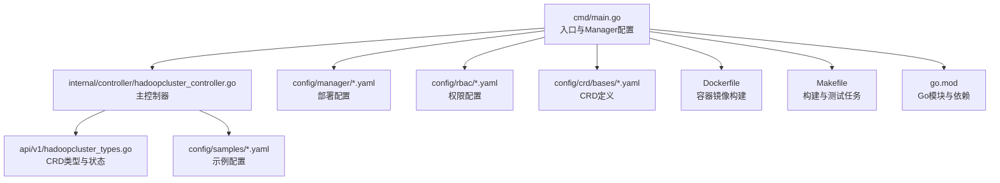
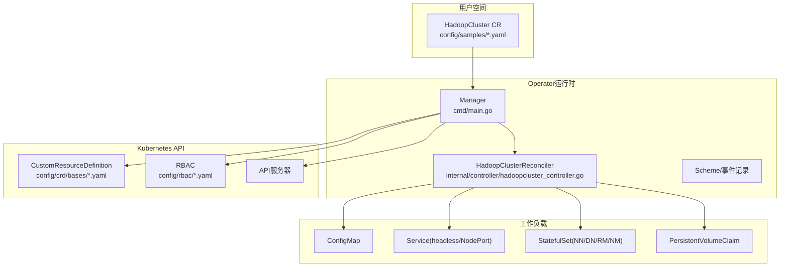
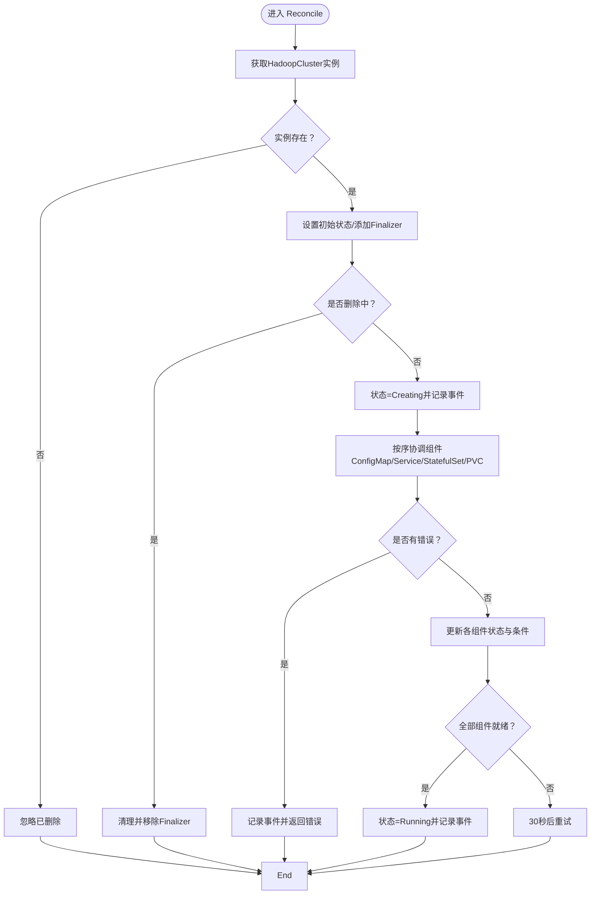
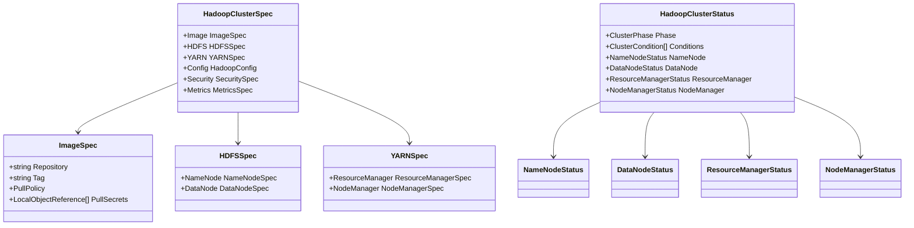
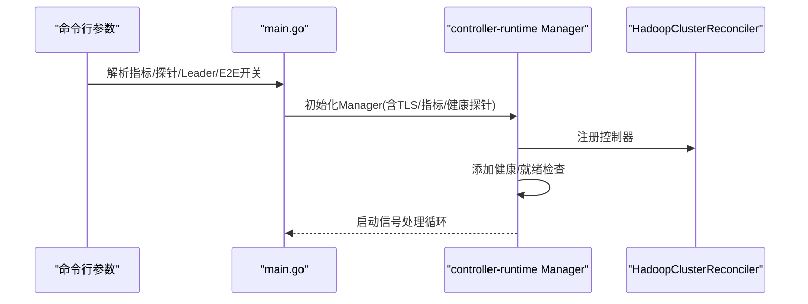
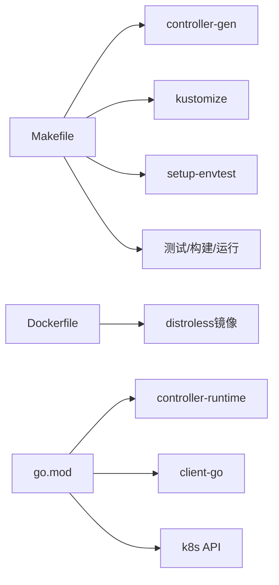

# 贡献指南

<cite>
**本文引用的文件**   
- [README.md](file://README.md)
- [go.mod](file://go.mod)
- [Makefile](file://Makefile)
- [Dockerfile](file://Dockerfile)
- [cmd/main.go](file://cmd/main.go)
- [api/v1/hadoopcluster_types.go](file://api/v1/hadoopcluster_types.go)
- [internal/controller/hadoopcluster_controller.go](file://internal/controller/hadoopcluster_controller.go)
- [config/samples/hadoop_v1_hadoopcluster.yaml](file://config/samples/hadoop_v1_hadoopcluster.yaml)
- [config/samples/hadoop_v1_hadoopcluster_ha.yaml](file://config/samples/hadoop_v1_hadoopcluster_ha.yaml)
- [config/samples/offline-deployment.yaml](file://config/samples/offline-deployment.yaml)
</cite>

## 目录
1. [简介](#简介)
2. [项目结构](#项目结构)
3. [核心组件](#核心组件)
4. [架构总览](#架构总览)
5. [详细组件分析](#详细组件分析)
6. [依赖关系分析](#依赖关系分析)
7. [性能与质量考量](#性能与质量考量)
8. [故障排查与本地验证](#故障排查与本地验证)
9. [贡献流程与规范](#贡献流程与规范)
10. [许可证与知识产权](#许可证与知识产权)
11. [结语](#结语)
12. [附录](#附录)

## 简介
本指南面向 Apache Hadoop Operator v3 的贡献者，提供从开发环境搭建、代码提交规范、分支管理策略、Pull Request 流程、代码审查标准、测试与文档更新规范，到本地验证、问题报告与社区参与的全流程说明。目标是帮助新贡献者快速上手，并确保高质量、可维护的代码持续演进。

## 项目结构
该仓库采用基于控制器（controller-runtime）的 Kubebuilder 项目结构，核心目录与职责如下：
- cmd/main.go：Operator 入口，初始化 Manager、注册控制器、健康探针与指标服务。
- api/v1/hadoopcluster_types.go：自定义资源 HadoopCluster 的类型定义与状态模型。
- internal/controller/hadoopcluster_controller.go：主控制器，负责 CR 的 Reconcile 循环与状态更新。
- config/samples/*：示例 CR 与离线部署样例，便于快速验证。
- config/crd、config/rbac、config/manager：CRD、RBAC 与 Operator 部署清单。
- hack/offline/*：离线环境镜像准备脚本。
- Makefile、Dockerfile、go.mod：构建、打包与依赖管理。

图表来源
- [cmd/main.go:54-149](file://cmd/main.go#L54-L149)
- [internal/controller/hadoopcluster_controller.go:41-239](file://internal/controller/hadoopcluster_controller.go#L41-L239)
- [api/v1/hadoopcluster_types.go:24-418](file://api/v1/hadoopcluster_types.go#L24-L418)

章节来源
- [README.md:231-251](file://README.md#L231-L251)
- [Makefile:1-165](file://Makefile#L1-L165)
- [Dockerfile:1-34](file://Dockerfile#L1-L34)
- [go.mod:1-69](file://go.mod#L1-L69)

## 核心组件
- 自定义资源（CRD）：HadoopCluster 类型定义了镜像、HDFS、YARN、配置覆盖、安全与监控等字段；状态包含阶段与各组件就绪情况。
- 主控制器：负责读取 CR、设置初始状态、添加 Finalizer、按顺序协调 ConfigMap/Service/StatefulSet/PVC 等资源、更新状态与条件。
- 入口与运行时：初始化 Scheme、启动 Manager、注册健康检查与指标端点、可选启用安全指标与 HTTP/2 控制。

章节来源
- [api/v1/hadoopcluster_types.go:24-418](file://api/v1/hadoopcluster_types.go#L24-L418)
- [internal/controller/hadoopcluster_controller.go:41-239](file://internal/controller/hadoopcluster_controller.go#L41-L239)
- [cmd/main.go:54-149](file://cmd/main.go#L54-L149)

## 架构总览
Operator 以 CRD 为中心，控制器驱动 Kubernetes API 对象的创建与变更，最终落地为 HDFS NameNode/DataNode、YARN ResourceManager/NodeManager 等工作负载。

图表来源
- [cmd/main.go:54-149](file://cmd/main.go#L54-L149)
- [internal/controller/hadoopcluster_controller.go:41-239](file://internal/controller/hadoopcluster_controller.go#L41-L239)
- [api/v1/hadoopcluster_types.go:24-418](file://api/v1/hadoopcluster_types.go#L24-L418)

## 详细组件分析

### 主控制器 Reconcile 流程
控制器按顺序协调各组件，若任一步返回需要重试或重新入队，则提前结束当前轮次；完成后更新整体状态与条件，并周期性重试。

图表来源
- [internal/controller/hadoopcluster_controller.go:60-145](file://internal/controller/hadoopcluster_controller.go#L60-L145)
- [internal/controller/hadoopcluster_controller.go:149-167](file://internal/controller/hadoopcluster_controller.go#L149-L167)
- [internal/controller/hadoopcluster_controller.go:169-227](file://internal/controller/hadoopcluster_controller.go#L169-L227)

章节来源
- [internal/controller/hadoopcluster_controller.go:41-239](file://internal/controller/hadoopcluster_controller.go#L41-L239)

### CRD 数据模型
HadoopClusterSpec 包含镜像、HDFS、YARN、配置覆盖、安全与监控等字段；状态包含阶段与各组件就绪信息。

图表来源
- [api/v1/hadoopcluster_types.go:24-418](file://api/v1/hadoopcluster_types.go#L24-L418)

章节来源
- [api/v1/hadoopcluster_types.go:24-418](file://api/v1/hadoopcluster_types.go#L24-L418)

### 入口与运行参数
入口程序负责解析命令行参数（指标绑定地址、健康探针地址、Leader 选举、安全指标、HTTP/2），并配置 TLS 选项与指标服务器。

图表来源
- [cmd/main.go:54-149](file://cmd/main.go#L54-L149)

章节来源
- [cmd/main.go:54-149](file://cmd/main.go#L54-L149)

## 依赖关系分析
- 构建与测试：Makefile 提供生成清单、代码生成、格式化、静态检查、测试、构建二进制、运行、打包镜像等目标；依赖 controller-gen、kustomize、envtest 等工具。
- 容器镜像：Dockerfile 基于 distroless 静态镜像，构建精简的二进制。
- 语言与依赖：go.mod 指定 Go 版本与 controller-runtime、client-go、k8s API 等依赖版本。

图表来源
- [Makefile:137-165](file://Makefile#L137-L165)
- [Dockerfile:1-34](file://Dockerfile#L1-L34)
- [go.mod:1-69](file://go.mod#L1-L69)

章节来源
- [Makefile:1-165](file://Makefile#L1-L165)
- [Dockerfile:1-34](file://Dockerfile#L1-L34)
- [go.mod:1-69](file://go.mod#L1-L69)

## 性能与质量考量
- 代码质量
  - 使用 go fmt 与 go vet 作为基础质量门禁。
  - 使用 controller-gen 生成 RBAC、CRD 与 DeepCopy 代码，保证一致性与可维护性。
- 构建与镜像
  - 多平台构建建议使用 docker buildx；镜像基于 distroless，减小攻击面。
- 运行时
  - 默认禁用 HTTP/2（通过 TLS 钩子注入）以降低已知风险；可选开启安全指标与指标 HTTPS。
- 状态更新与重试
  - 控制器按序协调组件，遇到错误立即记录并返回；否则周期性重试，避免忙等。

章节来源
- [Makefile:47-57](file://Makefile#L47-L57)
- [Makefile:87-96](file://Makefile#L87-L96)
- [cmd/main.go:83-91](file://cmd/main.go#L83-L91)
- [cmd/main.go:144-149](file://cmd/main.go#L144-L149)
- [internal/controller/hadoopcluster_controller.go:117-126](file://internal/controller/hadoopcluster_controller.go#L117-L126)

## 故障排查与本地验证
- 本地运行与验证
  - 使用 make run 在本地运行 Operator；使用示例 CR（基础/高可用/离线）进行部署验证。
  - 使用 kubectl 获取 CR、Pod、Service 状态，必要时进行端口转发访问 UI。
- 常见问题定位
  - Pod 启动失败：查看事件与日志。
  - NameNode 格式化失败：检查 PVC 状态，必要时手动格式化。
  - DataNode 无法连接 NameNode：检查网络连通性与配置。
  - 镜像拉取失败：检查镜像存在性与 Secret 配置。

章节来源
- [README.md:38-126](file://README.md#L38-L126)
- [README.md:276-318](file://README.md#L276-L318)
- [config/samples/hadoop_v1_hadoopcluster.yaml:1-80](file://config/samples/hadoop_v1_hadoopcluster.yaml#L1-L80)
- [config/samples/hadoop_v1_hadoopcluster_ha.yaml:1-107](file://config/samples/hadoop_v1_hadoopcluster_ha.yaml#L1-L107)
- [config/samples/offline-deployment.yaml:1-135](file://config/samples/offline-deployment.yaml#L1-L135)

## 贡献流程与规范

### 代码提交规范
- 提交信息
  - 使用清晰、简洁的描述，遵循“类型: 内容”的格式；如 feat: 新增高可用配置项。
  - 引用相关 Issue 或 PR 编号（如 Fixes #xxx）。
- 分支策略
  - 主分支：仅合并来自 Pull Request 的变更。
  - 功能分支：基于主分支创建，命名建议使用 feature/xxx 或 fix/xxx。
  - 发布前：在发布分支上进行回归测试与文档更新。
- 提交粒度
  - 小步提交，每个提交聚焦单一功能或修复；避免一次提交包含无关改动。

### Pull Request 流程
- PR 描述
  - 清晰说明变更目的、影响范围与测试方法；附带相关示例或截图。
- 代码审查
  - 至少一名维护者审查；审查要点包括：逻辑正确性、边界条件、错误处理、性能与安全性。
- CI 与测试
  - 通过 go fmt、go vet、单元测试与端到端测试；确保构建产物可正常运行。
- 合并策略
  - 优先使用 Squash Merge 保持提交历史整洁；确保 PR 关联的 Issue 已关闭或已迁移。

### 代码审查标准
- 正确性
  - 逻辑无误，边界条件覆盖充分；错误路径有明确处理与日志记录。
- 可维护性
  - 命名清晰、注释必要、模块内聚、依赖解耦；避免重复代码。
- 安全性
  - 禁止明文敏感信息；默认禁用不安全协议；最小权限原则。
- 性能
  - 避免不必要的重试与阻塞；合理使用缓存与指数退避。
- 文档与测试
  - 更新相关文档与示例；新增功能配套单元测试与端到端测试。

### 测试要求
- 单元测试
  - 使用 go test；确保覆盖率与稳定性。
- 端到端测试
  - 使用 envtest 与 kubebuilder 资产；在受控集群上验证 CR 生命周期。
- 本地验证
  - 使用示例 CR 验证部署、升级与删除流程；检查状态与事件。

章节来源
- [Makefile:55-57](file://Makefile#L55-L57)
- [README.md:266-274](file://README.md#L266-L274)

### 文档更新规范
- 代码注释
  - 关键函数与复杂逻辑添加注释；对外接口保持一致的注释风格。
- 示例与配置
  - 新增功能需配套示例 CR；离线部署场景补充离线镜像与 Secret 配置说明。
- 用户文档
  - README 中的功能说明、安装与使用步骤需同步更新。

章节来源
- [README.md:128-347](file://README.md#L128-L347)
- [config/samples/hadoop_v1_hadoopcluster.yaml:1-80](file://config/samples/hadoop_v1_hadoopcluster.yaml#L1-L80)
- [config/samples/hadoop_v1_hadoopcluster_ha.yaml:1-107](file://config/samples/hadoop_v1_hadoopcluster_ha.yaml#L1-L107)
- [config/samples/offline-deployment.yaml:1-135](file://config/samples/offline-deployment.yaml#L1-L135)

### 开发工作流程
- 环境准备
  - 安装 Go、kubectl、kustomize、controller-gen、envtest。
- 本地开发
  - 修改代码后执行 go fmt、go vet、go test；使用 make run 验证。
- 构建与打包
  - 使用 make build 或 make docker-build；必要时使用 make docker-buildx 多平台构建。
- 部署与验证
  - 使用 make deploy 或 kubectl 应用 config/manager；验证 CR 状态与组件就绪。

章节来源
- [Makefile:24-96](file://Makefile#L24-L96)
- [README.md:253-274](file://README.md#L253-L274)

### 代码质量检查清单
- 代码风格：通过 go fmt、go vet。
- 生成代码：运行 controller-gen 生成 RBAC、CRD 与 DeepCopy。
- 测试：通过 go test；必要时运行端到端测试。
- 构建：确保二进制与镜像可构建且可运行。
- 文档：更新 README 与示例 CR。

章节来源
- [Makefile:39-57](file://Makefile#L39-L57)
- [Dockerfile:1-34](file://Dockerfile#L1-L34)

### 报告问题与功能请求
- 问题报告
  - 提供环境信息（Kubernetes 版本、Operator 版本）、复现步骤、期望行为与实际行为。
- 功能请求
  - 说明使用场景、收益与实现建议；必要时附带设计草图或示例配置。

章节来源
- [README.md:349-356](file://README.md#L349-L356)

### 社区参与
- 讨论渠道
  - 通过 GitHub Issues/PR 参与讨论；关注发布说明与里程碑。
- 行为准则
  - 遵循 Apache 社区行为准则，保持尊重与包容。

章节来源
- [README.md:349-356](file://README.md#L349-L356)

## 许可证与知识产权
- 许可证
  - 本项目采用 Apache License 2.0，允许自由使用、修改与分发，但需保留版权与许可证声明。
- 贡献者许可协议（CLA）
  - 作为 Apache 软件基金会项目，贡献者需签署或确认已签署 Apache CLA。
- 知识产权
  - 贡献即表示同意将相关版权与专利权无条件转让给 Apache 软件基金会。

章节来源
- [README.md:353-356](file://README.md#L353-L356)

## 结语
感谢您对 Apache Hadoop Operator v3 的关注与贡献。请严格遵循上述流程与规范，共同维护高质量、可持续演进的开源项目生态。

## 附录

### 快速参考：常用命令
- 生成与校验：make manifests generate fmt vet
- 测试：make test
- 构建与运行：make build / make run
- 打包镜像：make docker-build IMG=xxx
- 部署：make deploy

章节来源
- [Makefile:39-118](file://Makefile#L39-L118)
- [README.md:253-274](file://README.md#L253-L274)