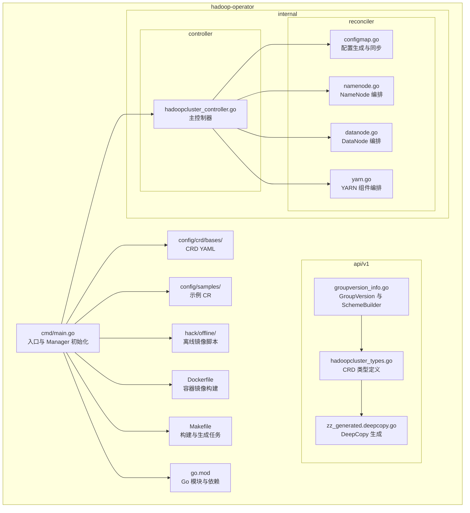
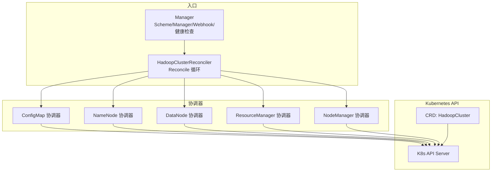
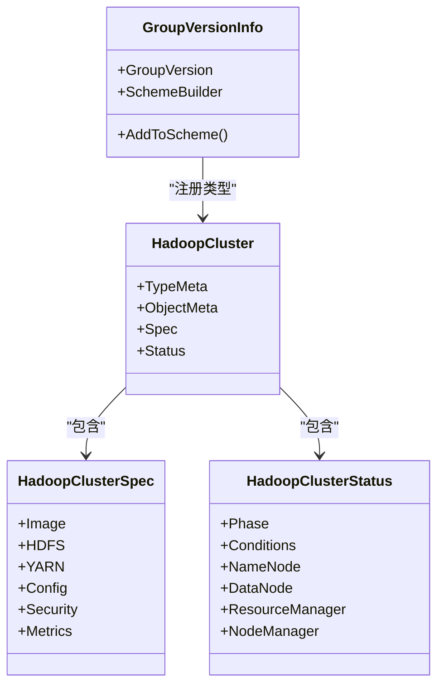
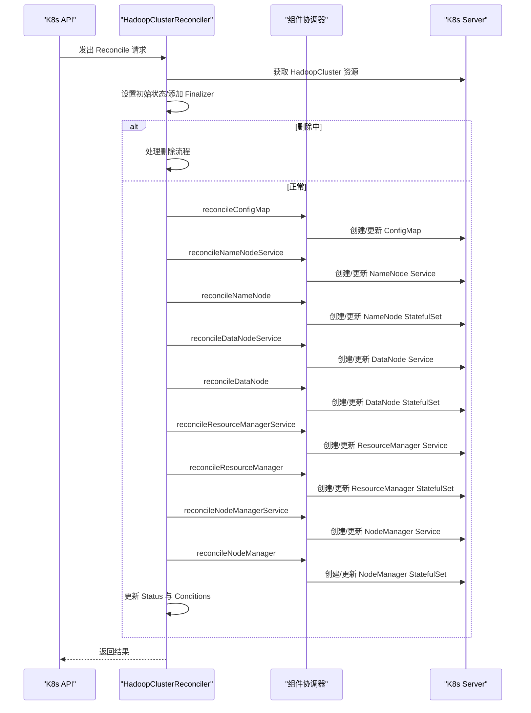
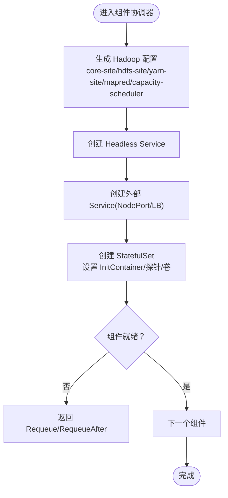
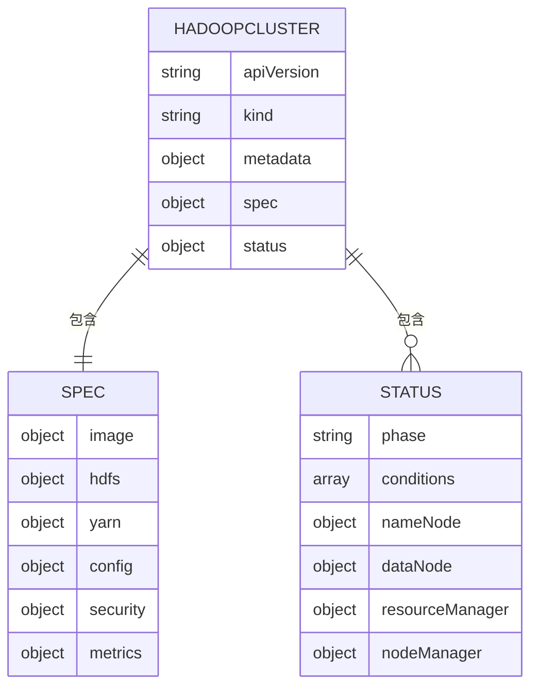
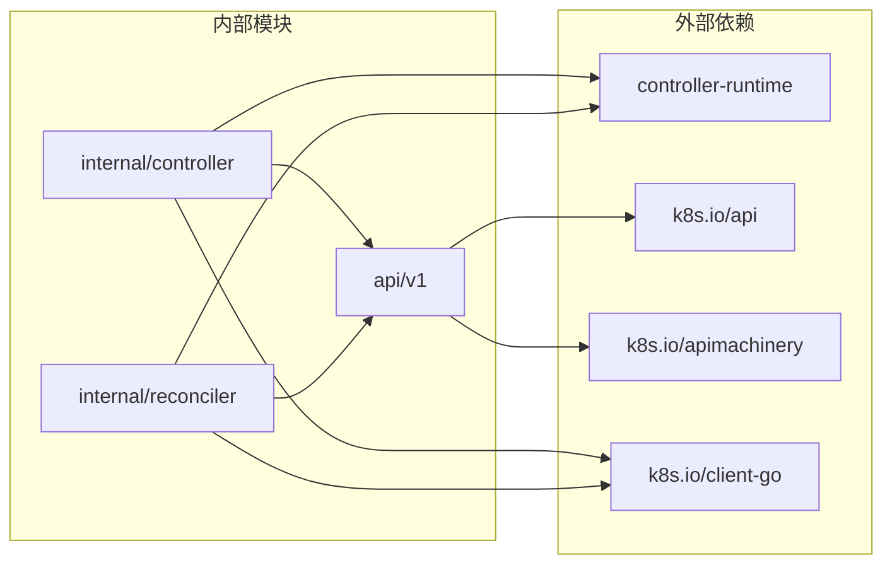

# 项目结构说明

<cite>
**本文档引用的文件**
- [go.mod](file://hadoop-operator/go.mod)
- [main.go](file://hadoop-operator/cmd/main.go)
- [groupversion_info.go](file://hadoop-operator/api/v1/groupversion_info.go)
- [hadoopcluster_types.go](file://hadoop-operator/api/v1/hadoopcluster_types.go)
- [zz_generated.deepcopy.go](file://hadoop-operator/api/v1/zz_generated.deepcopy.go)
- [hadoopcluster_controller.go](file://hadoop-operator/internal/controller/hadoopcluster_controller.go)
- [configmap.go](file://hadoop-operator/internal/reconciler/configmap.go)
- [namenode.go](file://hadoop-operator/internal/reconciler/namenode.go)
- [datanode.go](file://hadoop-operator/internal/reconciler/datanode.go)
- [yarn.go](file://hadoop-operator/internal/reconciler/yarn.go)
- [hadoop.apache.org_hadoopclusters.yaml](file://hadoop-operator/config/crd/bases/hadoop.apache.org_hadoopclusters.yaml)
- [Makefile](file://hadoop-operator/Makefile)
- [Dockerfile](file://hadoop-operator/Dockerfile)
- [README.md](file://hadoop-operator/README.md)
- [load-images.sh](file://hadoop-operator/hack/offline/load-images.sh)
- [hadoop_v1_hadoopcluster.yaml](file://hadoop-operator/config/samples/hadoop_v1_hadoopcluster.yaml)
</cite>

## 目录
1. [简介](#简介)
2. [项目结构](#项目结构)
3. [核心组件](#核心组件)
4. [架构总览](#架构总览)
5. [详细组件分析](#详细组件分析)
6. [依赖关系分析](#依赖关系分析)
7. [性能考虑](#性能考虑)
8. [故障排查指南](#故障排查指南)
9. [结论](#结论)
10. [附录](#附录)

## 简介
本项目是 Apache Hadoop Operator v3，基于 Kubernetes controller-runtime 构建，用于在 Kubernetes 集群中声明式地部署与管理 Hadoop 集群（HDFS 与 YARN）。其核心目标包括：
- 提供完整的 HDFS 与 YARN 组件编排能力
- 支持 NameNode 与 ResourceManager 的高可用部署
- 通过 CRD 提供灵活的配置覆盖与状态观测
- 支持离线环境部署与镜像管理
- 内置健康检查与就绪探针，确保组件稳定运行

## 项目结构
项目采用典型的 Kubebuilder 项目布局，按功能域分层组织：
- hadoop-operator/
  - api/v1：CRD 对应的 Go 类型定义与 Scheme 注册
  - cmd/main.go：Operator 入口，初始化 Manager、注册 Scheme、启动控制器
  - internal/controller：主控制器，负责 HadoopCluster 资源的协调循环
  - internal/reconciler：组件级协调器，按顺序编排 ConfigMap、服务与 StatefulSet
  - config/crd/bases：CRD YAML 清单
  - config/manager：Operator 部署配置
  - config/rbac：RBAC 权限配置
  - config/samples：示例 CR 与高可用配置
  - hack/offline：离线镜像处理脚本
  - Dockerfile、Makefile、go.mod、go.sum：构建与依赖管理

**图表来源**
- [main.go:1-150](file://hadoop-operator/cmd/main.go#L1-L150)
- [groupversion_info.go:1-37](file://hadoop-operator/api/v1/groupversion_info.go#L1-L37)
- [hadoopcluster_types.go:1-418](file://hadoop-operator/api/v1/hadoopcluster_types.go#L1-L418)
- [zz_generated.deepcopy.go](file://hadoop-operator/api/v1/zz_generated.deepcopy.go)
- [hadoopcluster_controller.go:1-239](file://hadoop-operator/internal/controller/hadoopcluster_controller.go#L1-L239)
- [configmap.go:1-246](file://hadoop-operator/internal/reconciler/configmap.go#L1-L246)
- [namenode.go:1-371](file://hadoop-operator/internal/reconciler/namenode.go#L1-L371)
- [datanode.go:1-331](file://hadoop-operator/internal/reconciler/datanode.go#L1-L331)
- [yarn.go:1-466](file://hadoop-operator/internal/reconciler/yarn.go#L1-L466)
- [hadoop.apache.org_hadoopclusters.yaml:1-411](file://hadoop-operator/config/crd/bases/hadoop.apache.org_hadoopclusters.yaml#L1-L411)
- [Makefile:1-165](file://hadoop-operator/Makefile#L1-L165)
- [Dockerfile:1-34](file://hadoop-operator/Dockerfile#L1-L34)
- [go.mod:1-69](file://hadoop-operator/go.mod#L1-L69)

**章节来源**
- [README.md:233-251](file://hadoop-operator/README.md#L233-L251)
- [Makefile:39-46](file://hadoop-operator/Makefile#L39-L46)

## 核心组件
- API 层（api/v1）
  - 定义 CRD 的 GroupVersion 与 SchemeBuilder，用于注册类型到运行时 Scheme
  - 定义 HadoopCluster CRD 的 Spec/Status 结构体，包含镜像、HDFS、YARN、配置覆盖、安全与监控等字段
  - 通过注解生成 DeepCopy 方法，确保对象安全复制
- 控制器层（internal/controller）
  - 主控制器 HadoopClusterReconciler 实现 Reconcile 循环，负责读取资源、设置初始状态、添加 Finalizer、处理删除流程
  - 以有序列表的方式调用多个组件协调器，保证 HDFS 与 YARN 组件的正确编排顺序
  - 更新集群状态与条件，记录事件
- 协调器层（internal/reconciler）
  - 将复杂编排拆分为细粒度组件：ConfigMap、NameNode、DataNode、ResourceManager、NodeManager
  - 每个组件负责生成对应的 ConfigMap、Service 与 StatefulSet，并设置 OwnerReference
  - 通过 CreateOrUpdate 与 controllerutil 确保资源幂等更新

**章节来源**
- [groupversion_info.go:17-36](file://hadoop-operator/api/v1/groupversion_info.go#L17-L36)
- [hadoopcluster_types.go:24-418](file://hadoop-operator/api/v1/hadoopcluster_types.go#L24-L418)
- [zz_generated.deepcopy.go](file://hadoop-operator/api/v1/zz_generated.deepcopy.go)
- [hadoopcluster_controller.go:41-239](file://hadoop-operator/internal/controller/hadoopcluster_controller.go#L41-L239)
- [configmap.go:43-246](file://hadoop-operator/internal/reconciler/configmap.go#L43-L246)
- [namenode.go:35-371](file://hadoop-operator/internal/reconciler/namenode.go#L35-L371)
- [datanode.go:34-331](file://hadoop-operator/internal/reconciler/datanode.go#L34-L331)
- [yarn.go:34-466](file://hadoop-operator/internal/reconciler/yarn.go#L34-L466)

## 架构总览
Operator 采用“入口 → 控制器 → 协调器”的三层架构：
- 入口（cmd/main.go）：初始化 Scheme、Manager、Metrics/Webhook、健康检查，注册主控制器
- 控制器（internal/controller）：实现 Reconcile 循环，维护资源生命周期与状态
- 协调器（internal/reconciler）：按组件维度进行资源生成与同步

**图表来源**
- [main.go:97-149](file://hadoop-operator/cmd/main.go#L97-L149)
- [hadoopcluster_controller.go:60-145](file://hadoop-operator/internal/controller/hadoopcluster_controller.go#L60-L145)
- [configmap.go:44-68](file://hadoop-operator/internal/reconciler/configmap.go#L44-L68)
- [namenode.go:117-317](file://hadoop-operator/internal/reconciler/namenode.go#L117-L317)
- [datanode.go:116-321](file://hadoop-operator/internal/reconciler/datanode.go#L116-L321)
- [yarn.go:115-447](file://hadoop-operator/internal/reconciler/yarn.go#L115-L447)
- [hadoop.apache.org_hadoopclusters.yaml:1-411](file://hadoop-operator/config/crd/bases/hadoop.apache.org_hadoopclusters.yaml#L1-L411)

## 详细组件分析

### API 层设计与职责
- GroupVersion 与 SchemeBuilder：统一管理 CRD 的 Group/Version 与类型注册入口
- CRD 类型定义：涵盖镜像、HDFS（NameNode/DataNode）、YARN（ResourceManager/NodeManager）、配置覆盖、安全与监控等
- DeepCopy 生成：通过注解自动生成 DeepCopy/Into/Object 方法，保障并发安全与对象复制一致性

**图表来源**
- [groupversion_info.go:27-36](file://hadoop-operator/api/v1/groupversion_info.go#L27-L36)
- [hadoopcluster_types.go:24-418](file://hadoop-operator/api/v1/hadoopcluster_types.go#L24-L418)

**章节来源**
- [groupversion_info.go:17-36](file://hadoop-operator/api/v1/groupversion_info.go#L17-L36)
- [hadoopcluster_types.go:24-418](file://hadoop-operator/api/v1/hadoopcluster_types.go#L24-L418)
- [zz_generated.deepcopy.go](file://hadoop-operator/api/v1/zz_generated.deepcopy.go)

### 控制器层设计与职责
- Reconcile 循环：获取资源、设置初始状态、添加 Finalizer、处理删除、按序调用组件协调器、更新状态与条件
- RBAC 注解：明确控制器所需的 CR、Deployment/StatefulSet、Service、ConfigMap、PVC、Event 等权限
- OwnerReference：通过 Owns 关联管理的子资源，确保生命周期一致

**图表来源**
- [hadoopcluster_controller.go:60-145](file://hadoop-operator/internal/controller/hadoopcluster_controller.go#L60-L145)
- [configmap.go:44-68](file://hadoop-operator/internal/reconciler/configmap.go#L44-L68)
- [namenode.go:117-317](file://hadoop-operator/internal/reconciler/namenode.go#L117-L317)
- [datanode.go:116-321](file://hadoop-operator/internal/reconciler/datanode.go#L116-L321)
- [yarn.go:115-447](file://hadoop-operator/internal/reconciler/yarn.go#L115-L447)

**章节来源**
- [hadoopcluster_controller.go:41-239](file://hadoop-operator/internal/controller/hadoopcluster_controller.go#L41-L239)

### 协调器层设计与职责
- ConfigMap 协调器：根据 CRD 配置生成 Hadoop XML 配置（core-site、hdfs-site、yarn-site、mapred-site、capacity-scheduler），支持用户覆盖
- NameNode 协调器：生成 Headless 与外部 Service，创建 StatefulSet；支持 HA 模式下的 JournalNode 与 ZooKeeper 集成
- DataNode 协调器：等待 NameNode 就绪后初始化数据目录，创建 StatefulSet 并挂载配置与 PVC
- YARN 协调器：分别生成 ResourceManager 与 NodeManager 的 Service 与 StatefulSet，支持 HA 与资源限制

**图表来源**
- [configmap.go:70-209](file://hadoop-operator/internal/reconciler/configmap.go#L70-L209)
- [namenode.go:117-317](file://hadoop-operator/internal/reconciler/namenode.go#L117-L317)
- [datanode.go:116-321](file://hadoop-operator/internal/reconciler/datanode.go#L116-L321)
- [yarn.go:115-447](file://hadoop-operator/internal/reconciler/yarn.go#L115-L447)

**章节来源**
- [configmap.go:43-246](file://hadoop-operator/internal/reconciler/configmap.go#L43-L246)
- [namenode.go:35-371](file://hadoop-operator/internal/reconciler/namenode.go#L35-L371)
- [datanode.go:34-331](file://hadoop-operator/internal/reconciler/datanode.go#L34-L331)
- [yarn.go:34-466](file://hadoop-operator/internal/reconciler/yarn.go#L34-L466)

### CRD 定义与组织方式
- CRD YAML 由 controller-gen 从注解生成，包含 Group、Version、Scope、AdditionalPrinterColumns、OpenAPI v3 Schema 等
- CRD 中的 Spec/Status 字段与 api/v1 类型一一对应，确保声明式配置与运行时状态的一致性

**图表来源**
- [hadoop.apache.org_hadoopclusters.yaml:27-411](file://hadoop-operator/config/crd/bases/hadoop.apache.org_hadoopclusters.yaml#L27-L411)
- [hadoopcluster_types.go:24-418](file://hadoop-operator/api/v1/hadoopcluster_types.go#L24-L418)

**章节来源**
- [hadoop.apache.org_hadoopclusters.yaml:1-411](file://hadoop-operator/config/crd/bases/hadoop.apache.org_hadoopclusters.yaml#L1-L411)

## 依赖关系分析
- Go 模块与版本
  - 使用 Go 1.21，依赖 controller-runtime v0.17.0、k8s.io/api 与 apimachinery v0.29.0
  - 通过 Makefile 的 controller-gen 与 kustomize 管理代码生成与部署清单
- 包组织原则
  - api/v1：仅暴露 CRD 类型与 Scheme 注册，不包含业务逻辑
  - internal/controller：控制器实现，直接依赖 api/v1 与 k8s.io client
  - internal/reconciler：组件协调器，封装具体资源生成逻辑
  - config/*：部署相关清单，samples 提供使用示例
- 导入路径约定
  - 内部模块统一使用 github.com/apache/hadoop-operator/{api/internal} 下的相对路径
  - 外部依赖通过 go.mod 管理，避免硬编码版本号

**图表来源**
- [go.mod:5-10](file://hadoop-operator/go.mod#L5-L10)
- [main.go:37-38](file://hadoop-operator/cmd/main.go#L37-L38)
- [hadoopcluster_controller.go:37-38](file://hadoop-operator/internal/controller/hadoopcluster_controller.go#L37-L38)
- [configmap.go:31-32](file://hadoop-operator/internal/reconciler/configmap.go#L31-L32)

**章节来源**
- [go.mod:1-69](file://hadoop-operator/go.mod#L1-L69)
- [Makefile:142-145](file://hadoop-operator/Makefile#L142-L145)

## 性能考虑
- 资源请求与限制：各组件默认设置合理的 CPU/内存请求与限制，避免资源争抢
- 探针配置：NameNode/ResourceManager/DataNode/NodeManager 均配置健康检查与就绪探针，缩短故障恢复时间
- 状态轮询间隔：控制器默认每 30 秒重新检查一次，平衡及时性与系统负载
- 存储策略：使用 PVC 动态分配，支持多 StorageClass 与访问模式
- 网络策略：Headless Service 用于稳定 Pod DNS，外部 Service 支持 NodePort/LB 暴露

[本节为通用指导，无需特定文件引用]

## 故障排查指南
- 常见问题定位
  - Pod 启动失败：查看 Pod 事件与上一次容器日志
  - NameNode 格式化失败：检查 PVC 状态与手动格式化命令
  - DataNode 无法连接 NameNode：检查网络连通性与配置
  - 镜像拉取失败：确认镜像存在与 Secret 配置
- 离线部署
  - 使用 hack/offline 脚本保存/加载镜像，或推送至私有仓库
  - 在示例 CR 中配置镜像仓库与拉取密钥

**章节来源**
- [README.md:276-318](file://hadoop-operator/README.md#L276-L318)
- [load-images.sh:1-75](file://hadoop-operator/hack/offline/load-images.sh#L1-L75)
- [hadoop_v1_hadoopcluster.yaml:1-80](file://hadoop-operator/config/samples/hadoop_v1_hadoopcluster.yaml#L1-L80)

## 结论
本项目通过清晰的分层架构与模块化设计，实现了对 Hadoop 集群在 Kubernetes 上的声明式管理。API 层提供稳定的 CRD 类型与 DeepCopy 支持，控制器层负责整体协调与状态维护，协调器层将复杂编排拆分为可维护的组件。配合 CRD、RBAC、部署清单与离线工具链，形成完整的开箱即用方案。

[本节为总结性内容，无需特定文件引用]

## 附录
- 构建与运行
  - 构建二进制：make build
  - 本地运行：make run
  - 构建镜像：make docker-build IMG=xxx
  - 部署 Operator：make deploy（或使用 kubectl 应用 config/manager 与 CRD）
- 代码生成
  - 生成 CRD 与 RBAC：make manifests
  - 生成 DeepCopy：make generate

**章节来源**
- [Makefile:40-46](file://hadoop-operator/Makefile#L40-L46)
- [README.md:253-274](file://hadoop-operator/README.md#L253-L274)