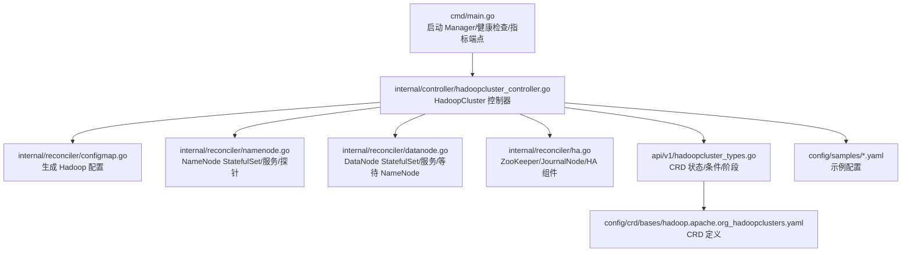
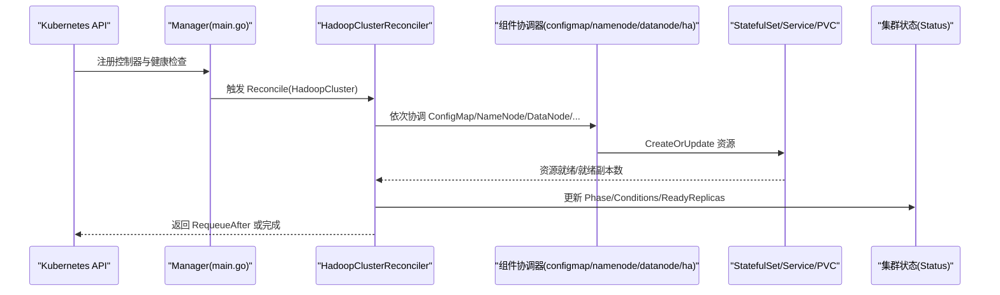
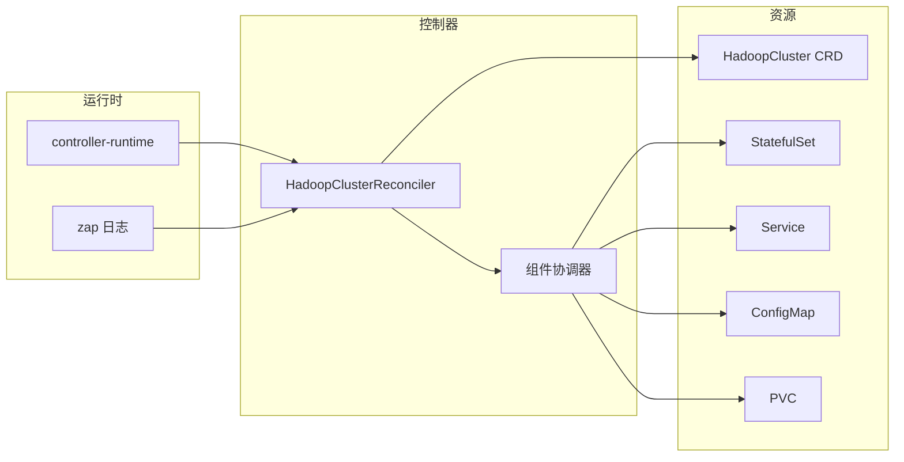

# 故障排查

<cite>
**本文引用的文件列表**
- [README.md](file://README.md)
- [main.go](file://cmd/main.go)
- [hadoopcluster_controller.go](file://internal/controller/hadoopcluster_controller.go)
- [hadoopcluster_types.go](file://api/v1/hadoopcluster_types.go)
- [hadoop.apache.org_hadoopclusters.yaml](file://config/crd/bases/hadoop.apache.org_hadoopclusters.yaml)
- [hadoop_v1_hadoopcluster.yaml](file://config/samples/hadoop_v1_hadoopcluster.yaml)
- [hadoop_v1_hadoopcluster_ha.yaml](file://config/samples/hadoop_v1_hadoopcluster_ha.yaml)
- [offline-deployment.yaml](file://config/samples/offline-deployment.yaml)
- [configmap.go](file://internal/reconciler/configmap.go)
- [namenode.go](file://internal/reconciler/namenode.go)
- [datanode.go](file://internal/reconciler/datanode.go)
- [ha.go](file://internal/reconciler/ha.go)
- [go.mod](file://go.mod)
</cite>

## 目录
1. [简介](#简介)
2. [项目结构](#项目结构)
3. [核心组件](#核心组件)
4. [架构总览](#架构总览)
5. [详细组件分析与故障排查](#详细组件分析与故障排查)
6. [依赖关系分析](#依赖关系分析)
7. [性能考量](#性能考量)
8. [故障排查指南](#故障排查指南)
9. [结论](#结论)
10. [附录](#附录)

## 简介
本指南面向在 Kubernetes 上使用 Apache Hadoop Operator v3 部署与运维 Hadoop 集群的工程师，聚焦于部署与运行过程中的常见问题与系统化排查方法。内容覆盖 Pod 启动失败、NameNode 格式化失败、DataNode 连接问题、镜像拉取失败等典型场景，并提供日志分析技巧、调试工具使用、性能诊断、监控指标解读、健康检查与告警配置、预防性维护与应急响应流程。

## 项目结构
- 控制器入口与运行时配置位于 cmd/main.go，负责初始化 Manager、注册健康检查与指标端点、启动主循环。
- 控制器实现位于 internal/controller/hadoopcluster_controller.go，负责 HadoopCluster 资源的协调与状态更新。
- CRD 定义与状态字段位于 api/v1/hadoopcluster_types.go 与 config/crd/bases/hadoop.apache.org_hadoopclusters.yaml。
- 组件协调器位于 internal/reconciler/*，分别处理 ConfigMap、NameNode、DataNode、ResourceManager、NodeManager、HA 组件。
- 示例配置位于 config/samples/*，包括基础部署、高可用部署与离线部署样例。

图表来源
- [main.go:54-149](file://cmd/main.go#L54-L149)
- [hadoopcluster_controller.go:60-145](file://internal/controller/hadoopcluster_controller.go#L60-L145)
- [hadoopcluster_types.go:297-395](file://api/v1/hadoopcluster_types.go#L297-L395)
- [hadoop.apache.org_hadoopclusters.yaml:26-411](file://config/crd/bases/hadoop.apache.org_hadoopclusters.yaml#L26-L411)

章节来源
- [README.md:236-251](file://README.md#L236-L251)
- [main.go:54-149](file://cmd/main.go#L54-L149)
- [hadoopcluster_controller.go:60-145](file://internal/controller/hadoopcluster_controller.go#L60-L145)
- [hadoopcluster_types.go:297-395](file://api/v1/hadoopcluster_types.go#L297-L395)
- [hadoop.apache.org_hadoopclusters.yaml:26-411](file://config/crd/bases/hadoop.apache.org_hadoopclusters.yaml#L26-L411)

## 核心组件
- 控制器（HadoopClusterReconciler）：按顺序协调 ConfigMap、NameNode 服务与 StatefulSet、DataNode 服务与 StatefulSet、ResourceManager 服务与 StatefulSet、NodeManager 服务与 StatefulSet；周期性更新集群状态与 Ready 条件。
- 组件协调器：
  - ConfigMap：根据 CRD 规格生成 core-site、hdfs-site、yarn-site、mapred-site、capacity-scheduler 等配置。
  - NameNode：创建 Headless 与外部服务，配置 InitContainer 初始化数据目录与格式化（HA 模式下差异化），配置 Liveness/Readiness 探针。
  - DataNode：创建 Headless 与外部服务，InitContainer 等待 NameNode 就绪后设置权限并启动 DataNode，配置探针。
  - HA：当启用 HA 时，创建 ZooKeeper（内部或外部）与 JournalNode，配置资源与存储。
- CRD 状态：包含 Phase（阶段）、Conditions（条件）、各组件 Ready/Replicas/Live/Standby 等状态字段。

章节来源
- [hadoopcluster_controller.go:104-145](file://internal/controller/hadoopcluster_controller.go#L104-L145)
- [hadoopcluster_controller.go:169-227](file://internal/controller/hadoopcluster_controller.go#L169-L227)
- [configmap.go:44-68](file://internal/reconciler/configmap.go#L44-L68)
- [namenode.go:117-317](file://internal/reconciler/namenode.go#L117-L317)
- [datanode.go:115-321](file://internal/reconciler/datanode.go#L115-L321)
- [ha.go:34-177](file://internal/reconciler/ha.go#L34-L177)
- [hadoopcluster_types.go:297-395](file://api/v1/hadoopcluster_types.go#L297-L395)

## 架构总览
Operator 通过 Reconcile 循环对 HadoopCluster 资源进行幂等协调，确保期望状态与实际状态一致。控制器拥有（Owns）StatefulSet、Service、ConfigMap、PVC 等资源，状态由 Status 字段反映。

图表来源
- [main.go:119-149](file://cmd/main.go#L119-L149)
- [hadoopcluster_controller.go:60-145](file://internal/controller/hadoopcluster_controller.go#L60-L145)
- [hadoopcluster_controller.go:176-227](file://internal/controller/hadoopcluster_controller.go#L176-L227)

## 详细组件分析与故障排查

### NameNode 组件与故障排查
- 关键点
  - Headless 服务与外部服务（NodePort/LoadBalancer）分别用于稳定访问与对外暴露。
  - InitContainer 在首次实例且未格式化时执行格式化；HA 模式下格式化逻辑不同。
  - 探针路径为 /jmx，健康检查周期与延迟已配置。
- 常见问题与排查
  - Pod 启动失败：查看 InitContainer 日志与容器日志，确认权限与挂载点；检查 PVC 是否绑定成功。
  - NameNode 无法对外提供服务：检查外部服务 NodePort/LoadBalancer 是否就绪；确认探针路径与端口。
  - HA 模式下切换异常：检查 ZooKeeper 与 JournalNode 是否就绪；核对 fs.defaultFS 与 HA 相关配置。
- 相关实现参考
  - 服务与 StatefulSet 创建、探针与卷挂载、InitContainer 格式化脚本与启动命令。
  
章节来源
- [namenode.go:36-114](file://internal/reconciler/namenode.go#L36-L114)
- [namenode.go:117-317](file://internal/reconciler/namenode.go#L117-L317)
- [namenode.go:328-362](file://internal/reconciler/namenode.go#L328-L362)
- [hadoopcluster_types.go:347-357](file://api/v1/hadoopcluster_types.go#L347-L357)

### DataNode 组件与故障排查
- 关键点
  - Headless 服务与外部服务；InitContainer 等待 NameNode RPC 端口就绪后再初始化权限并启动 DataNode。
  - 探针路径为 /，健康检查周期与延迟已配置。
- 常见问题与排查
  - DataNode 无法连接 NameNode：使用 nc 检查 9000 端口连通性；核对 core-site 中 fs.defaultFS 与 NameNode 服务名。
  - DataNode 启动失败：检查 InitContainer 等待脚本是否超时；确认 PVC 与挂载路径；核对权限与用户映射。
- 相关实现参考
  - 等待 NameNode 的 InitContainer 脚本、DataNode 启动命令与探针配置。

章节来源
- [datanode.go:35-113](file://internal/reconciler/datanode.go#L35-L113)
- [datanode.go:115-321](file://internal/reconciler/datanode.go#L115-L321)
- [hadoopcluster_types.go:359-369](file://api/v1/hadoopcluster_types.go#L359-L369)

### HA 组件与故障排查
- 关键点
  - 当启用 NameNode HA 时，自动创建 ZooKeeper（内部或外部）与 JournalNode；JournalNode 至少 3 个副本以满足仲裁。
  - ZooKeeper 服务端口、选举端口与客户端端口均开放；JournalNode 提供 RPC 与 Web 探针。
- 常见问题与排查
  - ZooKeeper 不可用：检查 Pod 就绪状态、PVC 与数据目录；核对 ZOO_SERVERS 与 POD_NAME 环境变量。
  - JournalNode 不可用：检查副本数与存储；确认探针路径与端口；核对 HDFS HA 相关配置。
  - 外部 ZooKeeper：若配置了 connectionString，则跳过内部 ZooKeeper 部署。
- 相关实现参考
  - ZooKeeper 与 JournalNode 的服务与 StatefulSet 创建、探针与存储配置。

章节来源
- [ha.go:34-177](file://internal/reconciler/ha.go#L34-L177)
- [ha.go:179-363](file://internal/reconciler/ha.go#L179-L363)
- [hadoopcluster_types.go:92-120](file://api/v1/hadoopcluster_types.go#L92-L120)

### ConfigMap 与配置覆盖
- 关键点
  - 生成 core-site、hdfs-site、yarn-site、mapred-site、capacity-scheduler 等配置；支持用户覆盖。
  - HA 模式下自动注入 fs.defaultFS、HA 名称服务、ZK 连接串、自动故障转移等参数。
- 常见问题与排查
  - 配置不生效：检查 ConfigMap 是否创建成功；确认容器挂载路径 /opt/hadoop/etc/hadoop；核对用户覆盖项。
  - HA 配置错误：核对 fs.defaultFS、dfs.nameservices、dfs.ha.namenodes.*、dfs.namenode.rpc-address.* 等键值。
- 相关实现参考
  - 配置生成逻辑与 XML 模板拼装。

章节来源
- [configmap.go:44-68](file://internal/reconciler/configmap.go#L44-L68)
- [configmap.go:70-209](file://internal/reconciler/configmap.go#L70-L209)
- [configmap.go:224-233](file://internal/reconciler/configmap.go#L224-L233)

### 镜像拉取与离线部署
- 关键点
  - 支持通过 pullSecrets 指定镜像拉取 Secret；示例中展示了私有仓库与认证 Secret 的配置。
  - 离线部署样例展示了私有仓库地址、认证 Secret 与存储类的使用。
- 常见问题与排查
  - 镜像拉取失败：检查镜像仓库可达性；核对 Secret 的 docker-server、用户名与密码；确认命名空间与 Secret 名称。
  - 离线环境不可达：提前在离线环境加载镜像或推送至私有仓库；验证 Pod ImagePullBackOff。
- 相关实现参考
  - 示例配置与离线部署说明。

章节来源
- [hadoop_v1_hadoopcluster.yaml:7-10](file://config/samples/hadoop_v1_hadoopcluster.yaml#L7-L10)
- [offline-deployment.yaml:7-14](file://config/samples/offline-deployment.yaml#L7-L14)
- [README.md:84-126](file://README.md#L84-L126)

## 依赖关系分析
- 控制器依赖 controller-runtime 进行 Manager、健康检查、指标端点与信号处理。
- CRD 定义与状态字段由 api/v1 提供，控制器通过 Status 字段上报 Phase 与 Conditions。
- 组件协调器依赖 Kubernetes API 对象（StatefulSet、Service、ConfigMap、PVC）进行创建与更新。

图表来源
- [go.mod:5-10](file://go.mod#L5-L10)
- [main.go:31-39](file://cmd/main.go#L31-L39)
- [hadoopcluster_controller.go:230-239](file://internal/controller/hadoopcluster_controller.go#L230-L239)

章节来源
- [go.mod:5-10](file://go.mod#L5-L10)
- [main.go:31-39](file://cmd/main.go#L31-L39)
- [hadoopcluster_controller.go:230-239](file://internal/controller/hadoopcluster_controller.go#L230-L239)

## 性能考量
- 资源请求与限制：NameNode、DataNode、ResourceManager、NodeManager 均支持 CPU/内存请求与限制配置，建议结合集群规模与负载调优。
- 存储：NameNode 与 DataNode 的 PVC 大小与 StorageClass 影响 I/O 性能；JournalNode 与 ZooKeeper 的存储大小与类型影响 HA 同步与仲裁性能。
- 探针间隔与延迟：过短的探针间隔会增加 API Server 压力；过长的延迟会影响快速发现故障的能力，需平衡。
- 网络：NameNode 与 DataNode 间 RPC 与 Web 端口连通性直接影响写入与读取性能；HA 模式下 ZooKeeper 与 JournalNode 的网络延迟决定切换速度。

章节来源
- [hadoopcluster_types.go:69-90](file://api/v1/hadoopcluster_types.go#L69-L90)
- [hadoopcluster_types.go:122-140](file://api/v1/hadoopcluster_types.go#L122-L140)
- [hadoopcluster_types.go:150-187](file://api/v1/hadoopcluster_types.go#L150-L187)
- [hadoopcluster_types.go:171-187](file://api/v1/hadoopcluster_types.go#L171-L187)
- [namenode.go:235-254](file://internal/reconciler/namenode.go#L235-L254)
- [datanode.go:249-268](file://internal/reconciler/datanode.go#L249-L268)
- [ha.go:292-311](file://internal/reconciler/ha.go#L292-L311)

## 故障排查指南

### 通用排查流程
- 检查资源状态
  - 获取 HadoopCluster 资源状态：kubectl get hadoopcluster <name> -o yaml
  - 查看各组件状态：kubectl get pods -l hadoop.apache.org/cluster=<cluster-name>
  - 查看服务与端口：kubectl get svc -l hadoop.apache.org/cluster=<cluster-name>
  - 查看 PVC：kubectl get pvc -l hadoop.apache.org/cluster=<cluster-name>
- 查看日志与事件
  - 查看 Pod 事件：kubectl describe pod <pod-name>
  - 查看容器日志：kubectl logs <pod-name> -c <container-name>
  - 查看上一次退出日志：kubectl logs <pod-name> --previous
- 核对配置
  - 检查 ConfigMap 内容：kubectl get configmap <cluster-name>-config -o yaml
  - 核对 CRD 规格：kubectl get hadoopcluster <name> -o yaml | grep -A 200 "spec:"
- 健康检查与指标
  - 访问健康检查端点：curl http://<manager-ip>:8081/healthz
  - 访问指标端点：curl http://<manager-ip>:8080/metrics

章节来源
- [README.md:280-318](file://README.md#L280-L318)
- [main.go:135-142](file://cmd/main.go#L135-L142)

### Pod 启动失败
- 可能原因
  - 镜像拉取失败（私有仓库认证、网络不可达）
  - 权限不足（InitContainer 需要特权或特定用户）
  - 卷挂载失败（PVC 未绑定、存储类不匹配）
  - 探针失败（端口未开放、路径错误）
- 排查步骤
  - 检查镜像拉取：kubectl describe pod <pod-name> | grep -i image
  - 检查权限与用户：查看 InitContainer 安全上下文与用户映射
  - 检查 PVC：kubectl get pvc <pvc-name> -o yaml
  - 检查探针：确认端口与路径与容器配置一致
- 相关实现参考
  - 镜像拉取策略与 Secret；InitContainer 权限与挂载；探针配置

章节来源
- [hadoopcluster_types.go:48-59](file://api/v1/hadoopcluster_types.go#L48-L59)
- [namenode.go:179-202](file://internal/reconciler/namenode.go#L179-L202)
- [datanode.go:178-221](file://internal/reconciler/datanode.go#L178-L221)
- [namenode.go:235-254](file://internal/reconciler/namenode.go#L235-L254)
- [datanode.go:249-268](file://internal/reconciler/datanode.go#L249-L268)

### NameNode 格式化失败
- 可能原因
  - 数据目录未初始化或权限不足
  - PVC 未正确绑定或存储不可用
  - HA 模式下格式化逻辑差异导致失败
- 排查步骤
  - 检查 PVC：kubectl get pvc
  - 检查数据目录权限与挂载：kubectl exec -it <namenode-pod> -- ls -ld /opt/hadoop/data/nn
  - 手动格式化（谨慎操作）：kubectl exec -it <namenode-pod> -- hdfs namenode -format -nonInteractive
  - 核对 InitContainer 脚本与环境变量
- 相关实现参考
  - InitContainer 格式化脚本；HA 模式下的格式化分支

章节来源
- [namenode.go:328-362](file://internal/reconciler/namenode.go#L328-L362)
- [README.md:290-298](file://README.md#L290-L298)

### DataNode 无法连接到 NameNode
- 可能原因
  - NameNode 未就绪或服务未暴露
  - 网络策略阻止 9000 端口
  - 配置错误（fs.defaultFS 指向错误的服务名或端口）
- 排查步骤
  - 检查 NameNode 服务与端口：kubectl get svc <cluster-name>-namenode
  - 在 DataNode 中测试连通性：kubectl exec -it <datanode-pod> -- nc -zv <namenode-service> 9000
  - 核对 ConfigMap 中 core-site 的 fs.defaultFS 与 NameNode 服务名
- 相关实现参考
  - DataNode 等待 NameNode 的 InitContainer 脚本；ConfigMap 生成逻辑

章节来源
- [datanode.go:184-191](file://internal/reconciler/datanode.go#L184-L191)
- [configmap.go:82-98](file://internal/reconciler/configmap.go#L82-L98)
- [README.md:300-308](file://README.md#L300-L308)

### 镜像拉取失败
- 可能原因
  - 私有仓库认证信息错误或缺失
  - 网络不可达或 DNS 解析失败
  - 镜像标签不存在或拼写错误
- 排查步骤
  - 检查 Secret：kubectl get secret regcred -o yaml
  - 验证镜像存在：docker pull <image> 或在目标节点尝试
  - 核对 CRD 中 image.repository/tag/pullPolicy/pullSecrets
- 相关实现参考
  - 示例配置中的私有仓库与认证 Secret；离线部署样例

章节来源
- [hadoop_v1_hadoopcluster.yaml:7-10](file://config/samples/hadoop_v1_hadoopcluster.yaml#L7-L10)
- [offline-deployment.yaml:7-14](file://config/samples/offline-deployment.yaml#L7-L14)
- [README.md:310-318](file://README.md#L310-L318)

### HA 模式异常
- 可能原因
  - ZooKeeper 未就绪或仲裁失败
  - JournalNode 副本不足或存储问题
  - HA 配置不一致（fs.defaultFS、nameservices、HA 代理提供者等）
- 排查步骤
  - 检查 ZooKeeper 与 JournalNode：kubectl get pods -l app=zookeeper|journalnode
  - 核对 ConfigMap 中 HA 相关键值：fs.defaultFS、dfs.nameservices、dfs.ha.namenodes.*、dfs.client.failover.proxy.provider.*
  - 检查外部 ZooKeeper 连接串配置
- 相关实现参考
  - HA 组件创建逻辑；ConfigMap 生成 HA 配置

章节来源
- [ha.go:34-177](file://internal/reconciler/ha.go#L34-L177)
- [configmap.go:95-130](file://internal/reconciler/configmap.go#L95-L130)
- [hadoopcluster_types.go:92-120](file://api/v1/hadoopcluster_types.go#L92-L120)

### 监控与健康检查
- 健康检查端点
  - healthz：/healthz
  - readyz：/readyz
- 指标端点
  - metrics：/metrics（默认 8080）
- 告警建议
  - Pod 重启次数、容器探针失败、PVC 绑定失败、NameNode/ResourceManager/NodeManager 就绪副本数为 0
  - HA 组件（ZooKeeper/JournalNode）就绪副本数低于阈值
- 相关实现参考
  - Manager 健康检查与指标端点注册

章节来源
- [main.go:135-142](file://cmd/main.go#L135-L142)
- [hadoopcluster_controller.go:134-142](file://internal/controller/hadoopcluster_controller.go#L134-L142)

### 日志分析技巧
- 关注关键日志位置
  - NameNode：/opt/hadoop/logs 下的日志文件
  - DataNode：/opt/hadoop/logs 下的日志文件
  - Hadoop 配置：/opt/hadoop/etc/hadoop 下的 XML 文件
- 常见日志关键词
  - NameNode 格式化失败、NameNode RPC/HTTP 端口监听、HA 切换日志
  - DataNode 启动、连接 NameNode、块传输日志
  - ZooKeeper/QuorumPeer、JournalNode RPC/Web 探针
- 相关实现参考
  - 容器日志挂载与环境变量设置

章节来源
- [namenode.go:266-269](file://internal/reconciler/namenode.go#L266-L269)
- [datanode.go:275-279](file://internal/reconciler/datanode.go#L275-L279)

### 性能问题诊断
- NameNode 性能
  - 检查 JVM 堆大小与日志输出；核对 dfs.namenode.handler.count 等参数
- DataNode 性能
  - 检查磁盘 I/O 与存储类型；核对 dfs.blocksize、dfs.replication
- ResourceManager/NodeManager 性能
  - 检查内存与 CPU 请求/限制；核对 yarn.scheduler.maximum-allocation-*、yarn.nodemanager.resource.*
- 相关实现参考
  - ConfigMap 中的 HDFS/YARN 参数覆盖

章节来源
- [configmap.go:107-136](file://internal/reconciler/configmap.go#L107-L136)
- [configmap.go:139-168](file://internal/reconciler/configmap.go#L139-L168)
- [hadoop_v1_hadoopcluster.yaml:69-80](file://config/samples/hadoop_v1_hadoopcluster.yaml#L69-L80)
- [hadoop_v1_hadoopcluster_ha.yaml:89-100](file://config/samples/hadoop_v1_hadoopcluster_ha.yaml#L89-L100)
- [offline-deployment.yaml:97-120](file://config/samples/offline-deployment.yaml#L97-L120)

### 预防性维护与应急响应
- 预防性维护
  - 定期检查 PVC 与存储使用率；核对资源请求/限制与节点容量
  - 定期备份 NameNode 数据目录（在停机窗口内）
  - HA 组件副本数与存储容量定期评估
- 应急响应
  - NameNode 失败：优先切换到备用 NameNode；必要时手动格式化（谨慎）
  - DataNode 失败：检查网络与存储；替换失败节点；重新平衡数据
  - HA 组件失败：检查 ZooKeeper 与 JournalNode；修复仲裁链路
- 相关实现参考
  - 状态字段 ReadyReplicas/Active/Standby；Phase 字段

章节来源
- [hadoopcluster_types.go:347-395](file://api/v1/hadoopcluster_types.go#L347-L395)
- [hadoopcluster_controller.go:169-174](file://internal/controller/hadoopcluster_controller.go#L169-L174)

## 结论
通过系统化的故障排查流程、日志分析与监控告警，可以快速定位并解决 Hadoop Operator v3 在 Kubernetes 上部署与运行中的常见问题。建议在生产环境中结合资源规划、存储策略与 HA 组件的稳定性设计，持续优化配置与监控策略，确保集群的高可用与高性能。

## 附录
- 示例配置参考
  - 基础部署：config/samples/hadoop_v1_hadoopcluster.yaml
  - 高可用部署：config/samples/hadoop_v1_hadoopcluster_ha.yaml
  - 离线部署：config/samples/offline-deployment.yaml
- CRD 定义与状态字段：config/crd/bases/hadoop.apache.org_hadoopclusters.yaml
- 控制器与组件协调器实现：internal/controller/hadoopcluster_controller.go、internal/reconciler/*