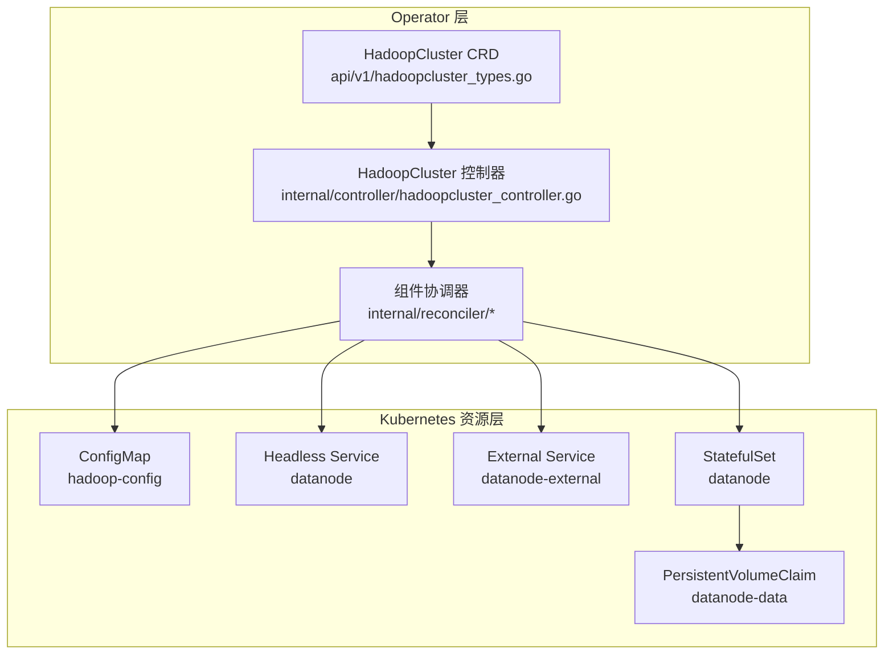
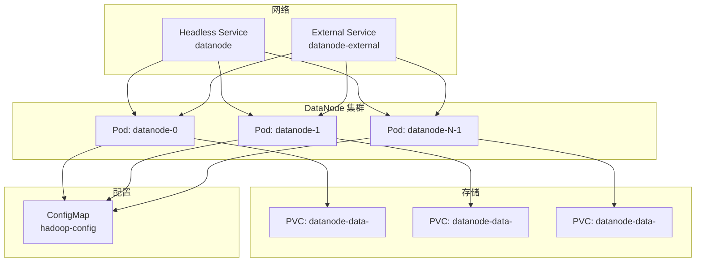
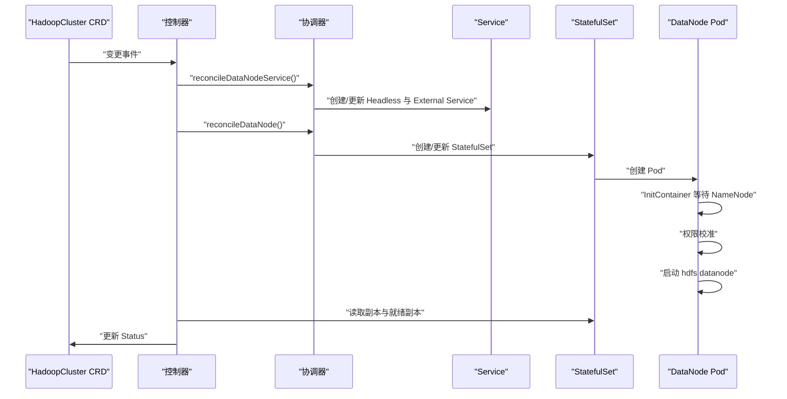

# DataNode 组件管理

<cite>
**本文档引用的文件**
- [hadoop-operator/internal/controller/hadoopcluster_controller.go](file://hadoop-operator/internal/controller/hadoopcluster_controller.go)
- [hadoop-operator/internal/reconciler/datanode.go](file://hadoop-operator/internal/reconciler/datanode.go)
- [hadoop-operator/api/v1/hadoopcluster_types.go](file://hadoop-operator/api/v1/hadoopcluster_types.go)
- [hadoop-operator/config/samples/hadoop_v1_hadoopcluster.yaml](file://hadoop-operator/config/samples/hadoop_v1_hadoopcluster.yaml)
- [hadoop-operator/config/samples/offline-deployment.yaml](file://hadoop-operator/config/samples/offline-deployment.yaml)
- [hadoop-operator/config/samples/hadoop_v1_hadoopcluster_ha.yaml](file://hadoop-operator/config/samples/hadoop_v1_hadoopcluster_ha.yaml)
- [hadoop-operator/README.md](file://hadoop-operator/README.md)
- [datanode.yaml](file://datanode.yaml)
- [configmap.yaml](file://configmap.yaml)
</cite>

## 目录
1. [简介](#简介)
2. [项目结构](#项目结构)
3. [核心组件](#核心组件)
4. [架构总览](#架构总览)
5. [详细组件分析](#详细组件分析)
6. [依赖关系分析](#依赖关系分析)
7. [性能考虑](#性能考虑)
8. [故障排查指南](#故障排查指南)
9. [结论](#结论)
10. [附录](#附录)

## 简介
本文件面向 HDFS DataNode 组件的运维与管理，基于该代码库中的 Kubernetes Operator 实现，系统阐述 DataNode 在 HDFS 中的数据存储职责、副本管理与存储策略，以及在 Kubernetes 环境中的部署配置、资源与网络规划、存储挂载点设置、扩展与收缩策略、健康检查与监控、磁盘空间管理、数据本地性优化、网络带宽管理与性能调优，以及常见故障排查方法。内容严格依据仓库中的 CRD 定义、控制器实现与示例配置进行整理，帮助读者快速掌握 DataNode 的全生命周期管理。

## 项目结构
该仓库采用标准的 Kubernetes Operator 结构：
- CRD 定义：描述 HadoopCluster 资源的期望状态与字段约束
- 控制器：负责根据 CRD 期望状态，协调生成/更新 ConfigMap、Service、StatefulSet 等资源
- Reconciler：按顺序协调各组件（NameNode、DataNode、ResourceManager、NodeManager）
- 示例配置：提供基础与高可用部署样例，涵盖 DataNode 的副本数、存储容量与存储类等关键参数

图表来源
- [hadoop-operator/api/v1/hadoopcluster_types.go:24-46](file://hadoop-operator/api/v1/hadoopcluster_types.go#L24-L46)
- [hadoop-operator/internal/controller/hadoopcluster_controller.go:104-115](file://hadoop-operator/internal/controller/hadoopcluster_controller.go#L104-L115)
- [hadoop-operator/internal/reconciler/datanode.go:34-113](file://hadoop-operator/internal/reconciler/datanode.go#L34-L113)

章节来源
- [hadoop-operator/README.md:233-251](file://hadoop-operator/README.md#L233-L251)
- [hadoop-operator/api/v1/hadoopcluster_types.go:24-46](file://hadoop-operator/api/v1/hadoopcluster_types.go#L24-L46)

## 核心组件
- HadoopCluster CRD：定义 HDFS、YARN、镜像、配置覆盖、安全与监控等字段，其中 DataNode 的副本数、资源请求/限制、存储大小与存储类、服务类型与端口映射均在此定义
- DataNode 控制器：负责生成 Headless Service、External Service 与 StatefulSet；为每个 DataNode Pod 提供初始化容器等待 NameNode 就绪、权限校准与启动 DataNode 进程；通过探针保障健康状态
- ConfigMap：提供 Hadoop 配置文件（core-site.xml、hdfs-site.xml、yarn-site.xml 等），其中包含 dfs.replication 等关键参数
- 示例配置：提供基础与高可用部署样例，展示如何配置 DataNode 的副本数、存储容量与存储类

章节来源
- [hadoop-operator/api/v1/hadoopcluster_types.go:122-140](file://hadoop-operator/api/v1/hadoopcluster_types.go#L122-L140)
- [hadoop-operator/internal/reconciler/datanode.go:115-321](file://hadoop-operator/internal/reconciler/datanode.go#L115-L321)
- [configmap.yaml:51-95](file://configmap.yaml#L51-L95)
- [hadoop-operator/config/samples/hadoop_v1_hadoopcluster.yaml:31-43](file://hadoop-operator/config/samples/hadoop_v1_hadoopcluster.yaml#L31-L43)

## 架构总览
DataNode 在该实现中的运行架构如下：
- 通过 Headless Service 提供稳定的 DNS 名称与稳定网络标识
- 通过 External Service 暴露 DataNode 的数据端口与 Web UI 端口
- StatefulSet 管理 DataNode 副本，Pod 通过初始化容器完成 NameNode 就绪等待与权限校准，主容器启动 hdfs datanode
- ConfigMap 注入 Hadoop 配置，包括数据目录、副本数等

图表来源
- [hadoop-operator/internal/reconciler/datanode.go:34-113](file://hadoop-operator/internal/reconciler/datanode.go#L34-L113)
- [hadoop-operator/internal/reconciler/datanode.go:115-321](file://hadoop-operator/internal/reconciler/datanode.go#L115-L321)

## 详细组件分析

### DataNode 数据块管理与副本策略
- 副本数量由 Hadoop 配置决定，示例中通过 ConfigMap 设置 dfs.replication，Operator 支持通过 CRD 的 config.hdfsSite 覆盖该值
- DataNode 副本数量直接影响写入时的复制行为与容灾能力，建议结合业务可靠性需求与存储成本权衡

章节来源
- [configmap.yaml:75-77](file://configmap.yaml#L75-L77)
- [hadoop-operator/config/samples/hadoop_v1_hadoopcluster.yaml:74-76](file://hadoop-operator/config/samples/hadoop_v1_hadoopcluster.yaml#L74-L76)

### DataNode 存储策略与容量规划
- 存储容量与存储类通过 CRD 的 DataNode.Storage 字段配置，StatefulSet 的 VolumeClaimTemplates 会为每个 Pod 动态绑定 PVC
- 默认存储大小与存储类可在 CRD 中指定，若未指定则控制器会设置默认值
- 存储访问模式默认为 ReadWriteOnce，可根据底层存储能力调整

章节来源
- [hadoop-operator/api/v1/hadoopcluster_types.go:189-199](file://hadoop-operator/api/v1/hadoopcluster_types.go#L189-L199)
- [hadoop-operator/internal/reconciler/datanode.go:147-156](file://hadoop-operator/internal/reconciler/datanode.go#L147-L156)
- [hadoop-operator/internal/reconciler/datanode.go:296-311](file://hadoop-operator/internal/reconciler/datanode.go#L296-L311)

### DataNode 部署配置要点
- 副本数：通过 CRD 的 DataNode.Replicas 指定，默认值由控制器设置
- 资源请求/限制：CPU 与内存的 requests/limits 可在 CRD 中配置，控制器会应用到 StatefulSet
- 服务暴露：Headless Service 用于稳定网络标识，External Service 暴露数据端口与 Web UI 端口，支持 NodePort/LoadBalancer
- 初始化容器：等待 NameNode RPC 端口就绪，再进行权限校准，最后启动 hdfs datanode

章节来源
- [hadoop-operator/internal/reconciler/datanode.go:119-122](file://hadoop-operator/internal/reconciler/datanode.go#L119-L122)
- [hadoop-operator/internal/reconciler/datanode.go:132-145](file://hadoop-operator/internal/reconciler/datanode.go#L132-L145)
- [hadoop-operator/internal/reconciler/datanode.go:34-113](file://hadoop-operator/internal/reconciler/datanode.go#L34-L113)
- [hadoop-operator/internal/reconciler/datanode.go:161-321](file://hadoop-operator/internal/reconciler/datanode.go#L161-L321)

### DataNode 资源需求、网络配置与存储挂载点
- 资源需求：requests/limits 的 CPU 与内存由 CRD 配置，控制器应用到 StatefulSet
- 网络配置：Headless Service 暴露 9866（数据）与 9864（Web），External Service 支持自定义 NodePort 映射
- 存储挂载点：DataNode 数据目录由 ConfigMap 中 dfs.datanode.data.dir 指定，容器内挂载至 /opt/hadoop/data/dn

章节来源
- [hadoop-operator/internal/reconciler/datanode.go:248-279](file://hadoop-operator/internal/reconciler/datanode.go#L248-L279)
- [hadoop-operator/internal/reconciler/datanode.go:282-294](file://hadoop-operator/internal/reconciler/datanode.go#L282-L294)
- [configmap.yaml:59-61](file://configmap.yaml#L59-L61)

### DataNode 扩展与收缩管理
- 扩展：通过修改 CRD 中 DataNode.Replicas 并触发控制器 reconcile，即可增加副本数
- 收缩：同样通过修改副本数减少副本，控制器会逐步删除多余 Pod
- 维护模式：可通过节点亲和性与容忍度策略将 DataNode 调度到特定节点或隔离节点，实现维护窗口内的滚动迁移

章节来源
- [hadoop-operator/api/v1/hadoopcluster_types.go:122-140](file://hadoop-operator/api/v1/hadoopcluster_types.go#L122-L140)
- [hadoop-operator/internal/reconciler/datanode.go:173-174](file://hadoop-operator/internal/reconciler/datanode.go#L173-L174)

### DataNode 健康检查、存储监控与磁盘空间管理
- 健康检查：通过 livenessProbe 与 readinessProbe 对 Web 端口进行 HTTP 探测，确保 DataNode Web UI 可用
- 存储监控：示例中提供 Prometheus 监控配置项，可启用 Hadoop Exporter 采集指标
- 磁盘空间管理：通过 PVC 动态扩容与存储类策略管理，结合 HDFS 的块放置与副本策略控制容量占用

章节来源
- [hadoop-operator/internal/reconciler/datanode.go:249-268](file://hadoop-operator/internal/reconciler/datanode.go#L249-L268)
- [hadoop-operator/config/samples/offline-deployment.yaml:122-126](file://hadoop-operator/config/samples/offline-deployment.yaml#L122-L126)

### 数据本地性优化、网络带宽管理与性能调优
- 数据本地性：通过 Pod 反亲和性与拓扑键（如 hostname）避免同机多副本，提升本地读写比例
- 网络带宽：合理设置服务类型与 NodePort，结合集群网络策略优化跨节点通信
- 性能调优：通过 CRD 的 config.hdfsSite/yarnSite 覆盖 HDFS/YARN 参数，如 dfs.blocksize、yarn.scheduler.maximum-allocation-mb 等

章节来源
- [hadoop-operator/config/samples/offline-deployment.yaml:39-49](file://hadoop-operator/config/samples/offline-deployment.yaml#L39-L49)
- [hadoop-operator/config/samples/hadoop_v1_hadoopcluster.yaml:74-76](file://hadoop-operator/config/samples/hadoop_v1_hadoopcluster.yaml#L74-L76)
- [hadoop-operator/config/samples/offline-deployment.yaml:106-114](file://hadoop-operator/config/samples/offline-deployment.yaml#L106-L114)

## 依赖关系分析
DataNode 的控制器流程如下：
- 控制器按顺序协调各组件，其中包含 DataNode 的服务与 StatefulSet
- 状态更新：控制器从 StatefulSet 读取副本与就绪副本数，更新 HadoopCluster 状态
- CRD 字段：DataNodeSpec 定义副本、资源、存储、服务、亲和性与容忍度等

图表来源
- [hadoop-operator/internal/controller/hadoopcluster_controller.go:104-126](file://hadoop-operator/internal/controller/hadoopcluster_controller.go#L104-L126)
- [hadoop-operator/internal/reconciler/datanode.go:34-113](file://hadoop-operator/internal/reconciler/datanode.go#L34-L113)
- [hadoop-operator/internal/reconciler/datanode.go:115-321](file://hadoop-operator/internal/reconciler/datanode.go#L115-L321)

章节来源
- [hadoop-operator/internal/controller/hadoopcluster_controller.go:169-174](file://hadoop-operator/internal/controller/hadoopcluster_controller.go#L169-L174)
- [hadoop-operator/api/v1/hadoopcluster_types.go:122-140](file://hadoop-operator/api/v1/hadoopcluster_types.go#L122-L140)

## 性能考虑
- 副本数与块大小：副本数越高，写入延迟与网络开销越大；块大小影响寻址与并行度，需结合业务场景调优
- 资源配额：为 DataNode 设置合理的 CPU 与内存请求/限制，避免资源争抢导致的抖动
- 存储类与访问模式：根据底层存储性能与可靠性选择合适的 StorageClass 与访问模式
- 网络拓扑：通过亲和性与容忍度策略，将 DataNode 与计算节点就近部署，减少跨机房/跨机架流量

## 故障排查指南
- Pod 启动失败：查看 Pod 事件与日志，确认镜像拉取、权限校准与 NameNode 连通性
- DataNode 无法连接 NameNode：检查网络连通性与配置，验证 NameNode 服务可达
- 镜像拉取失败：检查镜像仓库与拉取密钥配置
- 存储问题：检查 PVC 状态与绑定情况，确认存储类与容量满足预期

章节来源
- [hadoop-operator/README.md:276-318](file://hadoop-operator/README.md#L276-L318)
- [hadoop-operator/internal/reconciler/datanode.go:178-221](file://hadoop-operator/internal/reconciler/datanode.go#L178-L221)

## 结论
该代码库通过 CRD 与 Operator 将 DataNode 的部署、扩缩容、健康检查与存储管理标准化，配合 ConfigMap 的配置覆盖与示例配置，能够灵活适配不同规模与可靠性要求的 HDFS 集群。运维人员只需在 CRD 中声明期望状态，控制器即会自动完成资源编排与一致性维护，显著降低 DataNode 的运维复杂度。

## 附录
- 示例配置参考
  - 基础部署：[hadoop_v1_hadoopcluster.yaml:31-43](file://hadoop-operator/config/samples/hadoop_v1_hadoopcluster.yaml#L31-L43)
  - 高可用部署：[hadoop_v1_hadoopcluster_ha.yaml:43-54](file://hadoop-operator/config/samples/hadoop_v1_hadoopcluster_ha.yaml#L43-L54)
  - 离线部署：[offline-deployment.yaml:51-62](file://hadoop-operator/config/samples/offline-deployment.yaml#L51-L62)
- 单文件示例参考
  - DataNode 资源清单：[datanode.yaml:36-162](file://datanode.yaml#L36-L162)
  - Hadoop 配置：[configmap.yaml:51-95](file://configmap.yaml#L51-L95)