# NameNode 组件管理

<cite>
**本文档中引用的文件**
- [hadoop-operator/internal/controller/hadoopcluster_controller.go](file://hadoop-operator/internal/controller/hadoopcluster_controller.go)
- [hadoop-operator/internal/reconciler/namenode.go](file://hadoop-operator/internal/reconciler/namenode.go)
- [hadoop-operator/internal/reconciler/ha.go](file://hadoop-operator/internal/reconciler/ha.go)
- [hadoop-operator/internal/reconciler/configmap.go](file://hadoop-operator/internal/reconciler/configmap.go)
- [hadoop-operator/api/v1/hadoopcluster_types.go](file://hadoop-operator/api/v1/hadoopcluster_types.go)
- [hadoop-operator/config/samples/hadoop_v1_hadoopcluster.yaml](file://hadoop-operator/config/samples/hadoop_v1_hadoopcluster.yaml)
- [hadoop-operator/config/samples/hadoop_v1_hadoopcluster_ha.yaml](file://hadoop-operator/config/samples/hadoop_v1_hadoopcluster_ha.yaml)
- [namenode.yaml](file://namenode.yaml)
- [hadoop-operator/README.md](file://hadoop-operator/README.md)
</cite>

## 目录
1. [简介](#简介)
2. [项目结构](#项目结构)
3. [核心组件](#核心组件)
4. [架构概览](#架构概览)
5. [详细组件分析](#详细组件分析)
6. [部署配置详解](#部署配置详解)
7. [高可用模式配置](#高可用模式配置)
8. [资源与存储配置](#资源与存储配置)
9. [网络与服务配置](#网络与服务配置)
10. [健康检查与监控](#健康检查与监控)
11. [初始化脚本与启动流程](#初始化脚本与启动流程)
12. [故障排查指南](#故障排查指南)
13. [性能优化建议](#性能优化建议)
14. [结论](#结论)

## 简介

NameNode 是 Hadoop 分布式文件系统（HDFS）的核心组件，负责管理文件系统的命名空间、块映射和元数据。在 Kubernetes 环境中，Hadoop Operator 通过自定义资源定义（CRD）和控制器模式，实现了 NameNode 组件的自动化部署、管理和高可用配置。

该 Operator 提供了完整的 Hadoop 生态系统管理能力，包括 NameNode、DataNode、ResourceManager 和 NodeManager 的统一管理，支持单节点和高可用两种部署模式，具备完善的配置管理、监控集成和故障恢复机制。

## 项目结构

Hadoop Operator 采用分层架构设计，主要包含以下核心模块：

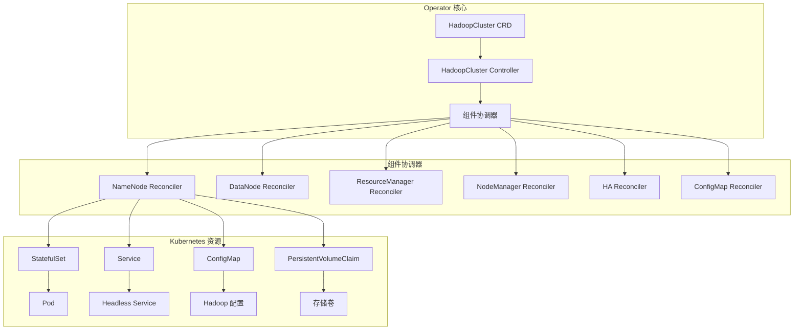

**图表来源**
- [hadoop-operator/internal/controller/hadoopcluster_controller.go:104-115](file://hadoop-operator/internal/controller/hadoopcluster_controller.go#L104-L115)
- [hadoop-operator/internal/reconciler/namenode.go:117-137](file://hadoop-operator/internal/reconciler/namenode.go#L117-L137)

**章节来源**
- [hadoop-operator/internal/controller/hadoopcluster_controller.go:17-46](file://hadoop-operator/internal/controller/hadoopcluster_controller.go#L17-L46)
- [hadoop-operator/internal/reconciler/namenode.go:17-33](file://hadoop-operator/internal/reconciler/namenode.go#L17-L33)

## 核心组件

### HadoopCluster 自定义资源

HadoopCluster 是 Operator 的核心自定义资源，定义了整个 Hadoop 集群的期望状态。其结构设计体现了声明式配置的优势：

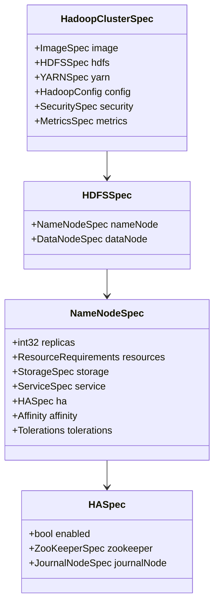

**图表来源**
- [hadoop-operator/api/v1/hadoopcluster_types.go:24-46](file://hadoop-operator/api/v1/hadoopcluster_types.go#L24-L46)
- [hadoop-operator/api/v1/hadoopcluster_types.go:61-90](file://hadoop-operator/api/v1/hadoopcluster_types.go#L61-L90)
- [hadoop-operator/api/v1/hadoopcluster_types.go:92-102](file://hadoop-operator/api/v1/hadoopcluster_types.go#L92-L102)

### 控制器架构

HadoopClusterController 作为主控制器，负责协调各个组件的生命周期管理：

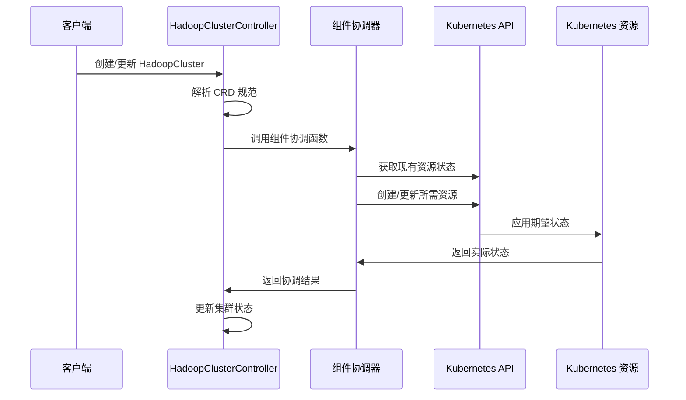

**图表来源**
- [hadoop-operator/internal/controller/hadoopcluster_controller.go:60-144](file://hadoop-operator/internal/controller/hadoopcluster_controller.go#L60-L144)

**章节来源**
- [hadoop-operator/api/v1/hadoopcluster_types.go:24-46](file://hadoop-operator/api/v1/hadoopcluster_types.go#L24-L46)
- [hadoop-operator/internal/controller/hadoopcluster_controller.go:58-144](file://hadoop-operator/internal/controller/hadoopcluster_controller.go#L58-L144)

## 架构概览

### 整体架构设计

Hadoop Operator 采用控制器-观察者模式，通过 Reconcile 循环实现期望状态到实际状态的收敛：

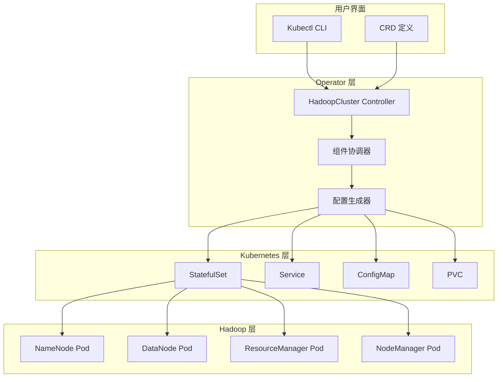

**图表来源**
- [hadoop-operator/internal/controller/hadoopcluster_controller.go:104-115](file://hadoop-operator/internal/controller/hadoopcluster_controller.go#L104-L115)
- [hadoop-operator/internal/reconciler/configmap.go:43-68](file://hadoop-operator/internal/reconciler/configmap.go#L43-L68)

### 组件协调顺序

控制器按照特定顺序协调各个组件，确保依赖关系得到正确处理：

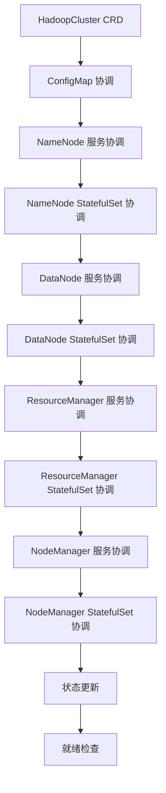

**图表来源**
- [hadoop-operator/internal/controller/hadoopcluster_controller.go:104-115](file://hadoop-operator/internal/controller/hadoopcluster_controller.go#L104-L115)

**章节来源**
- [hadoop-operator/internal/controller/hadoopcluster_controller.go:104-144](file://hadoop-operator/internal/controller/hadoopcluster_controller.go#L104-L144)

## 详细组件分析

### NameNode 服务配置

NameNode 服务分为 Headless Service 和外部服务两种类型，分别服务于内部通信和外部访问：

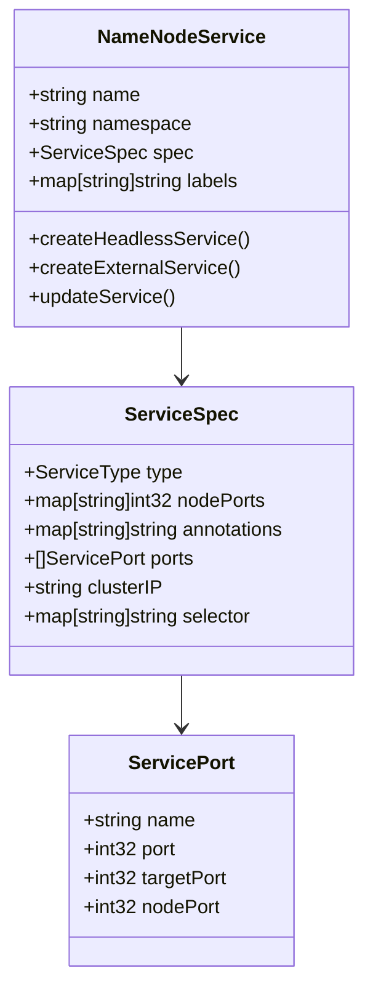

**图表来源**
- [hadoop-operator/internal/reconciler/namenode.go:35-114](file://hadoop-operator/internal/reconciler/namenode.go#L35-L114)

#### Headless Service 特性

Headless Service（ClusterIP: None）为 StatefulSet 提供稳定的网络标识：

| 特性 | 配置值 | 用途 |
|------|--------|------|
| ClusterIP | None | 禁用 ClusterIP，启用 DNS 记录 |
| 服务端口 | RPC: 9000, Web: 9870 | HDFS RPC 和 Web UI 端口 |
| 选择器 | app=hadoop-namenode | 匹配 NameNode Pod |
| 协议 | TCP | 支持 HDFS 协议 |

#### 外部服务配置

外部服务支持多种服务类型以满足不同部署需求：

| 服务类型 | 端口映射 | 适用场景 |
|----------|----------|----------|
| ClusterIP | 9000/RPC, 9870/Web | 内部集群访问 |
| NodePort | 30090/RPC, 30070/Web | 开发测试环境 |
| LoadBalancer | 9000/RPC, 9870/Web | 生产环境云部署 |

**章节来源**
- [hadoop-operator/internal/reconciler/namenode.go:35-114](file://hadoop-operator/internal/reconciler/namenode.go#L35-L114)

### NameNode StatefulSet 配置

NameNode 使用 StatefulSet 确保稳定的网络标识和持久化存储：

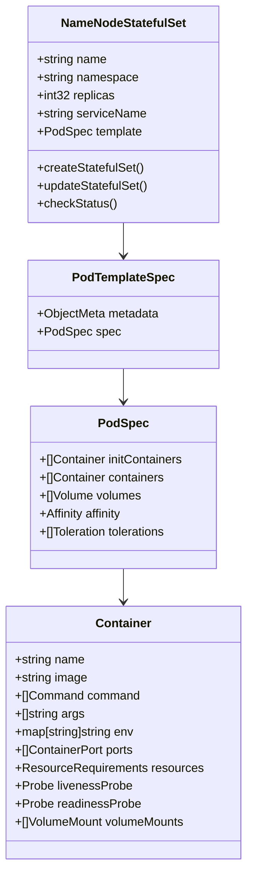

**图表来源**
- [hadoop-operator/internal/reconciler/namenode.go:116-317](file://hadoop-operator/internal/reconciler/namenode.go#L116-L317)

#### 初始化容器设计

初始化容器负责 NameNode 的预启动准备工作：

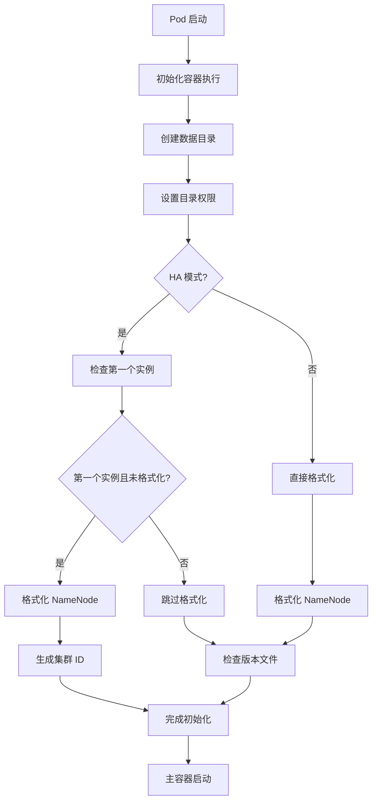

**图表来源**
- [hadoop-operator/internal/reconciler/namenode.go:328-358](file://hadoop-operator/internal/reconciler/namenode.go#L328-L358)

#### 主容器配置

主容器运行实际的 NameNode 进程，配置了完整的运行时环境：

| 配置项 | 值 | 说明 |
|--------|----|------|
| 镜像 | Hadoop 基础镜像 | 包含 HDFS 和 YARN 组件 |
| 命令 | exec hdfs namenode | 确保 PID 1 处理信号 |
| 环境变量 | HADOOP_CONF_DIR=/opt/hadoop/etc/hadoop | 配置文件路径 |
| 环境变量 | HADOOP_LOG_DIR=/opt/hadoop/logs | 日志目录 |
| 环境变量 | HADOOP_HEAPSIZE=1024 | JVM 堆大小(MB) |
| 端口 | 9000(RPC), 9870(Web) | HDFS 服务端口 |

**章节来源**
- [hadoop-operator/internal/reconciler/namenode.go:116-317](file://hadoop-operator/internal/reconciler/namenode.go#L116-L317)

### 配置管理机制

Hadoop 配置通过 ConfigMap 动态生成，支持 HA 模式的特殊配置：

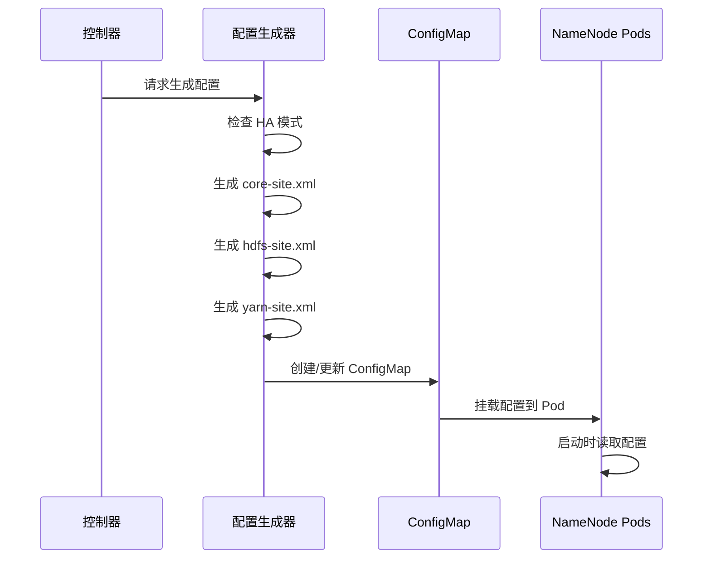

**图表来源**
- [hadoop-operator/internal/reconciler/configmap.go:43-68](file://hadoop-operator/internal/reconciler/configmap.go#L43-L68)

**章节来源**
- [hadoop-operator/internal/reconciler/configmap.go:70-209](file://hadoop-operator/internal/reconciler/configmap.go#L70-L209)

## 部署配置详解

### 基础部署配置

基础 NameNode 部署配置提供了最小化的功能集：

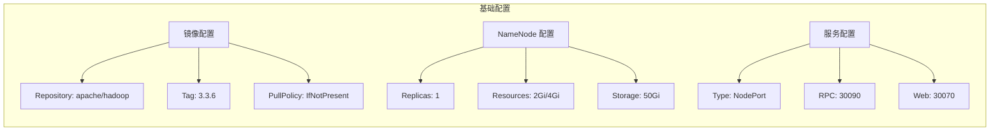

**图表来源**
- [hadoop-operator/config/samples/hadoop_v1_hadoopcluster.yaml:12-30](file://hadoop-operator/config/samples/hadoop_v1_hadoopcluster.yaml#L12-L30)

### 高可用部署配置

高可用模式需要额外的组件和更复杂的配置：

| 组件 | 配置要点 | 资源需求 |
|------|----------|----------|
| NameNode | replicas: 2, HA enabled | CPU: 1000m-2000m, Memory: 4Gi-8Gi |
| JournalNode | replicas: 3, quorum | CPU: 250m-500m, Memory: 1Gi-2Gi |
| ZooKeeper | 内置 3 节点 | CPU: 100m-200m, Memory: 128Mi-256Mi |

**章节来源**
- [hadoop-operator/config/samples/hadoop_v1_hadoopcluster_ha.yaml:12-32](file://hadoop-operator/config/samples/hadoop_v1_hadoopcluster_ha.yaml#L12-L32)

## 高可用模式配置

### 自动故障转移机制

Hadoop HA 通过 ZooKeeper 实现自动故障转移，配置了完整的故障检测和切换逻辑：

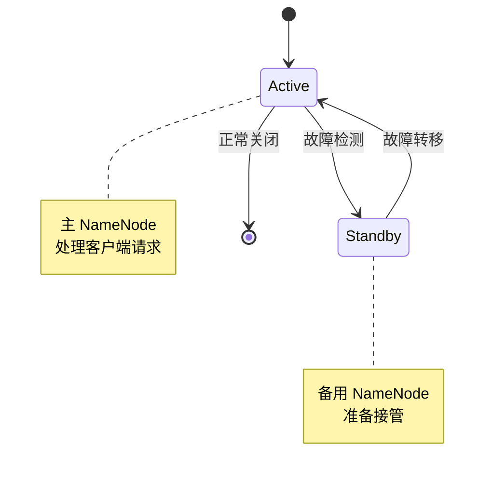

**图表来源**
- [hadoop-operator/internal/reconciler/configmap.go:120-130](file://hadoop-operator/internal/reconciler/configmap.go#L120-L130)

### 共享存储要求

HA 模式下的存储配置需要考虑数据一致性和访问模式：

| 存储类型 | 配置示例 | 适用场景 |
|----------|----------|----------|
| 本地存储 | storageClassName: local | 性能要求高的场景 |
| 网络存储 | storageClassName: standard | 高可用要求的场景 |
| 企业存储 | storageClassName: fast | 对延迟敏感的应用 |

### 仲裁节点配置

仲裁节点（JournalNode）为 NameNode 提供共享编辑日志，确保元数据的一致性：

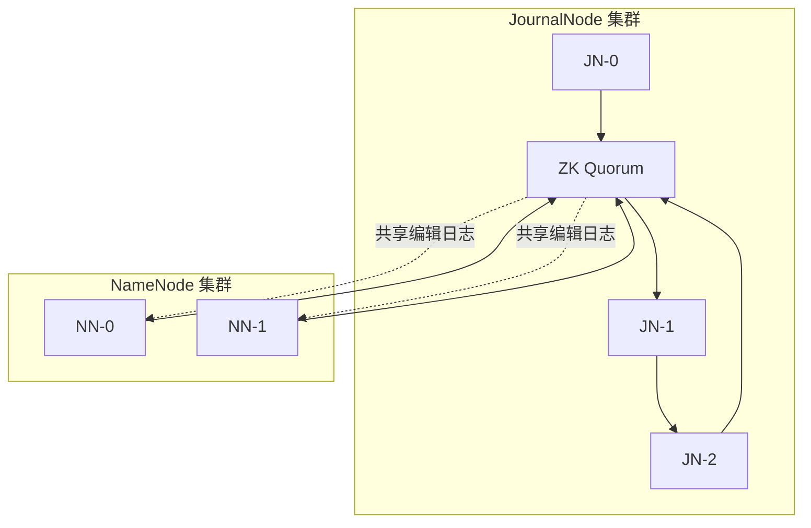

**图表来源**
- [hadoop-operator/internal/reconciler/ha.go:179-363](file://hadoop-operator/internal/reconciler/ha.go#L179-L363)

**章节来源**
- [hadoop-operator/internal/reconciler/ha.go:34-177](file://hadoop-operator/internal/reconciler/ha.go#L34-L177)
- [hadoop-operator/internal/reconciler/ha.go:179-363](file://hadoop-operator/internal/reconciler/ha.go#L179-L363)

## 资源与存储配置

### 资源限制策略

NameNode 的资源配置需要平衡性能和成本：

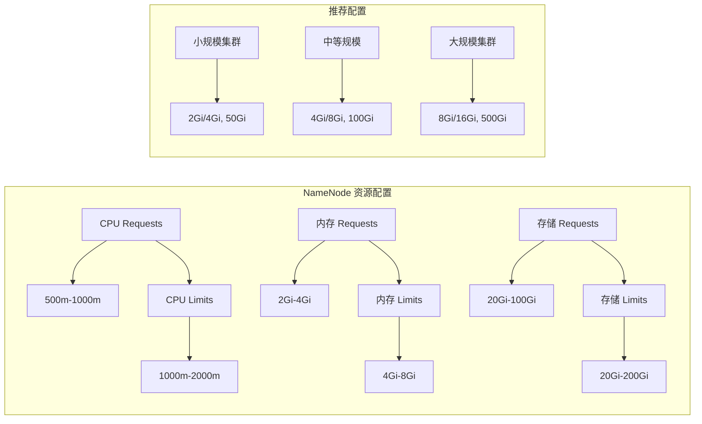

**图表来源**
- [hadoop-operator/internal/reconciler/namenode.go:140-152](file://hadoop-operator/internal/reconciler/namenode.go#L140-L152)

### 存储配置选项

存储配置需要考虑数据量、访问模式和成本：

| 存储类型 | 特点 | 适用场景 |
|----------|------|----------|
| SSD | 高 IOPS, 低延迟 | 元数据频繁访问 |
| HDD | 高容量, 低成本 | 大文件存储 |
| 云盘 | 弹性扩展, 备份 | 生产环境 |
| 本地盘 | 最高性能 | 专用集群 |

**章节来源**
- [hadoop-operator/internal/reconciler/namenode.go:154-163](file://hadoop-operator/internal/reconciler/namenode.go#L154-L163)

## 网络与服务配置

### 服务发现机制

NameNode 采用多种服务发现方式确保客户端能够正确连接：


**图表来源**
- [hadoop-operator/internal/reconciler/namenode.go:36-114](file://hadoop-operator/internal/reconciler/namenode.go#L36-L114)

### 端口配置策略

NameNode 需要监听多个端口以支持不同的协议和功能：

| 端口 | 协议 | 用途 | 安全性 |
|------|------|------|--------|
| 9000 | TCP | HDFS RPC | 需要防火墙规则 |
| 9870 | TCP | Web UI | 受限访问 |
| 8485 | TCP | JournalNode RPC | 内部网络 |
| 8480 | TCP | JournalNode Web | 内部网络 |
| 2181 | TCP | ZooKeeper 客户端 | 内部网络 |
| 2888 | TCP | ZooKeeper 服务器间通信 | 内部网络 |
| 3888 | TCP | ZooKeeper 选举 | 内部网络 |

**章节来源**
- [hadoop-operator/internal/reconciler/namenode.go:52-63](file://hadoop-operator/internal/reconciler/namenode.go#L52-L63)
- [hadoop-operator/internal/reconciler/ha.go:59-75](file://hadoop-operator/internal/reconciler/ha.go#L59-L75)

## 健康检查与监控

### 健康检查配置

NameNode 配置了完善的健康检查机制，确保服务的可用性：

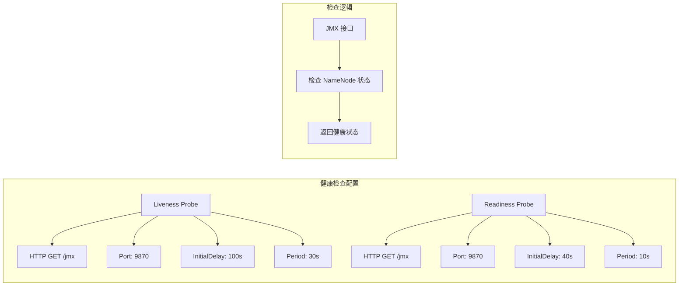

**图表来源**
- [hadoop-operator/internal/reconciler/namenode.go:235-254](file://hadoop-operator/internal/reconciler/namenode.go#L235-L254)

### 监控指标配置

监控配置支持 Prometheus 集成，提供全面的性能指标：

| 指标类别 | 指标名称 | 描述 |
|----------|----------|------|
| 基础指标 | hdfs_namenode_blocks_total | 块总数 |
| 基础指标 | hdfs_namenode_files_total | 文件总数 |
| 性能指标 | hdfs_namenode_get_block_locations_seconds | 获取块位置耗时 |
| 性能指标 | hdfs_namenode_create_file_seconds | 创建文件耗时 |
| 资源指标 | hdfs_namenode_heap_memory_bytes | JVM 堆内存使用 |
| 资源指标 | hdfs_namenode_cpu_seconds_total | CPU 使用时间 |

**章节来源**
- [hadoop-operator/internal/reconciler/namenode.go:235-254](file://hadoop-operator/internal/reconciler/namenode.go#L235-L254)
- [hadoop-operator/config/samples/hadoop_v1_hadoopcluster.yaml:101-107](file://hadoop-operator/config/samples/hadoop_v1_hadoopcluster.yaml#L101-L107)

## 初始化脚本与启动流程

### 初始化脚本工作机制

初始化脚本负责 NameNode 的预启动准备工作，确保系统处于正确的状态：

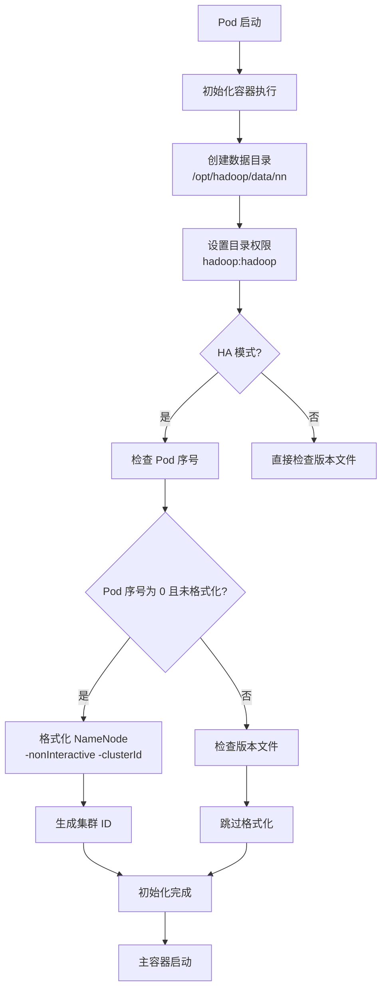

**图表来源**
- [hadoop-operator/internal/reconciler/namenode.go:328-358](file://hadoop-operator/internal/reconciler/namenode.go#L328-L358)

### 启动流程控制

主容器启动流程确保 NameNode 以正确的方式运行：

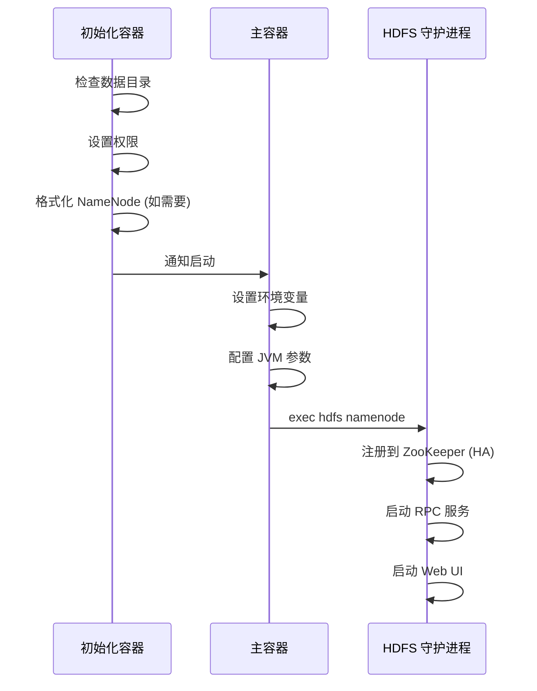

**图表来源**
- [hadoop-operator/internal/reconciler/namenode.go:360-362](file://hadoop-operator/internal/reconciler/namenode.go#L360-L362)

**章节来源**
- [hadoop-operator/internal/reconciler/namenode.go:328-362](file://hadoop-operator/internal/reconciler/namenode.go#L328-L362)

## 故障排查指南

### 常见错误诊断

#### NameNode 启动失败

**症状**: Pod 处于 CrashLoopBackOff 状态

**诊断步骤**:
1. 检查 Pod 事件
   ```bash
   kubectl describe pod <namenode-pod>
   ```

2. 查看初始化容器日志
   ```bash
   kubectl logs <namenode-pod> -c init-namenode
   ```

3. 查看主容器日志
   ```bash
   kubectl logs <namenode-pod> -c namenode
   ```

**可能原因**:
- 存储权限问题
- 配置文件错误
- 网络连接问题

#### 数据格式化问题

**症状**: NameNode 无法正常启动，提示需要格式化

**解决方案**:
1. 检查 PVC 状态
   ```bash
   kubectl get pvc | grep namenode
   ```

2. 手动格式化（谨慎操作）
   ```bash
   kubectl exec -it <namenode-pod> -- hdfs namenode -format -force
   ```

3. 清理数据目录（风险操作）
   ```bash
   kubectl exec -it <namenode-pod> -- rm -rf /opt/hadoop/data/nn/*
   ```

#### 网络连接问题

**症状**: DataNode 无法连接到 NameNode

**诊断方法**:
1. 检查服务可达性
   ```bash
   kubectl exec -it <datanode-pod> -- nc -zv <namenode-service> 9000
   ```

2. 检查 DNS 解析
   ```bash
   kubectl exec -it <datanode-pod> -- nslookup <namenode-service>
   ```

3. 查看网络策略
   ```bash
   kubectl get networkpolicy -A
   ```

**章节来源**
- [hadoop-operator/README.md:276-318](file://hadoop-operator/README.md#L276-L318)

### 日志分析技巧

#### 关键日志位置

| 组件 | 日志路径 | 关注点 |
|------|----------|--------|
| NameNode | /opt/hadoop/logs/hadoop-hadoop-namenode-*.log | 启动日志、错误信息 |
| DataNode | /opt/hadoop/logs/hadoop-hadoop-datanode-*.log | 数据传输、存储错误 |
| JournalNode | /opt/hadoop/logs/hadoop-hadoop-journalnode-*.log | 共享日志同步 |
| ZooKeeper | /opt/hadoop/logs/hadoop-zookeeper-*.log | 集群状态、仲裁 |

#### 常见错误模式

**启动阶段错误**:
- "NameNode is formatted" - 需要检查版本文件
- "Permission denied" - 权限设置问题
- "Connection refused" - 网络配置错误

**运行阶段错误**:
- "Block report failed" - 存储或网络问题
- "Heartbeat timeout" - 资源不足或网络延迟
- "Fencing failed" - HA 配置问题

### 性能调优建议

#### JVM 参数优化

根据集群规模调整 JVM 参数：

| 集群规模 | Heap Size | GC 策略 | 建议 |
|----------|-----------|---------|------|
| 小型集群 | 1024MB | G1GC | 适合测试环境 |
| 中型集群 | 2048-4096MB | G1GC | 生产环境默认 |
| 大型集群 | 8GB+ | G1GC | 高并发场景 |

#### 存储性能优化

1. **I/O 调度优化**
   ```bash
   # 检查磁盘 I/O
   iostat -x 1
   
   # 调整调度算法
   echo deadline > /sys/block/<device>/queue/scheduler
   ```

2. **网络优化**
   ```bash
   # 检查网络延迟
   ping -c 100 <namenode-service>
   
   # 调整 TCP 参数
   sysctl -w net.core.rmem_max=134217728
   sysctl -w net.core.wmem_max=134217728
   ```

#### 资源调优策略

1. **CPU 调优**
   - NameNode CPU 使用率应保持在 60-80%
   - 避免过度分配导致上下文切换开销

2. **内存调优**
   - JVM 堆大小不超过物理内存的 70%
   - 预留操作系统和其他进程内存

3. **存储调优**
   - 使用 SSD 作为元数据存储
   - 配置合适的缓存策略

**章节来源**
- [hadoop-operator/README.md:276-318](file://hadoop-operator/README.md#L276-L318)

## 性能优化建议

### 系统级优化

#### Linux 内核参数调优

```bash
# 文件描述符限制
echo "* soft nofile 65536" >> /etc/security/limits.conf
echo "* hard nofile 65536" >> /etc/security/limits.conf

# 内存相关参数
echo "vm.swappiness=1" >> /etc/sysctl.conf
echo "vm.dirty_ratio=15" >> /etc/sysctl.conf
echo "vm.dirty_background_ratio=5" >> /etc/sysctl.conf

# 网络参数
echo "net.core.somaxconn=32768" >> /etc/sysctl.conf
echo "net.ipv4.tcp_max_syn_backlog=32768" >> /etc/sysctl.conf
```

#### Kubernetes 调度优化

1. **亲和性配置**
   ```yaml
   affinity:
     podAntiAffinity:
       requiredDuringSchedulingIgnoredDuringExecution:
       - labelSelector:
           matchLabels:
             app: hadoop-namenode
         topologyKey: kubernetes.io/hostname
   ```

2. **容忍度配置**
   ```yaml
   tolerations:
   - key: "hadoop-role"
     operator: "Equal"
     value: "master"
     effect: "NoSchedule"
   ```

### Hadoop 参数优化

#### HDFS 相关参数

| 参数 | 默认值 | 建议值 | 说明 |
|------|--------|--------|------|
| dfs.block.size | 128MB | 256MB-1GB | 大文件优化 |
| dfs.namenode.handler.count | 10 | 20-50 | 并发处理能力 |
| dfs.namenode.checkpoint.period | 3600s | 7200s | 编辑日志合并 |
| dfs.namenode.checkpoint.txns | 1000000 | 1000000-5000000 | 编辑日志阈值 |

#### JVM 相关参数

```bash
# NameNode JVM 参数
export HADOOP_HEAPSIZE=2048
export HADOOP_NAMENODE_OPTS="-XX:+UseG1GC -XX:MaxGCPauseMillis=200"
export HADOOP_OPTS="$HADOOP_OPTS -XX:+PrintGCDateStamps"
```

## 结论

Hadoop Operator 为 NameNode 组件提供了完整的生命周期管理解决方案。通过声明式配置和自动化协调，实现了从基础部署到高可用配置的全方位支持。

### 主要优势

1. **声明式配置**: 通过 CRD 定义期望状态，简化了复杂配置的管理
2. **自动化协调**: 控制器自动处理组件间的依赖关系和状态收敛
3. **高可用支持**: 内置 HA 配置模板，支持快速部署高可用集群
4. **监控集成**: 完善的监控指标和告警机制
5. **故障恢复**: 自动化的故障检测和恢复能力

### 最佳实践建议

1. **资源配置**: 根据集群规模合理配置资源，避免过度或不足
2. **存储规划**: 选择合适的存储类型和容量，确保性能和可靠性
3. **网络设计**: 合理规划网络拓扑，确保组件间的通信效率
4. **监控体系**: 建立完善的监控和告警机制，及时发现和解决问题
5. **备份策略**: 制定数据备份和恢复计划，确保业务连续性

通过遵循这些最佳实践和配置指南，可以确保 NameNode 组件在 Kubernetes 环境中稳定、高效地运行，为整个 Hadoop 生态系统提供可靠的服务支撑。