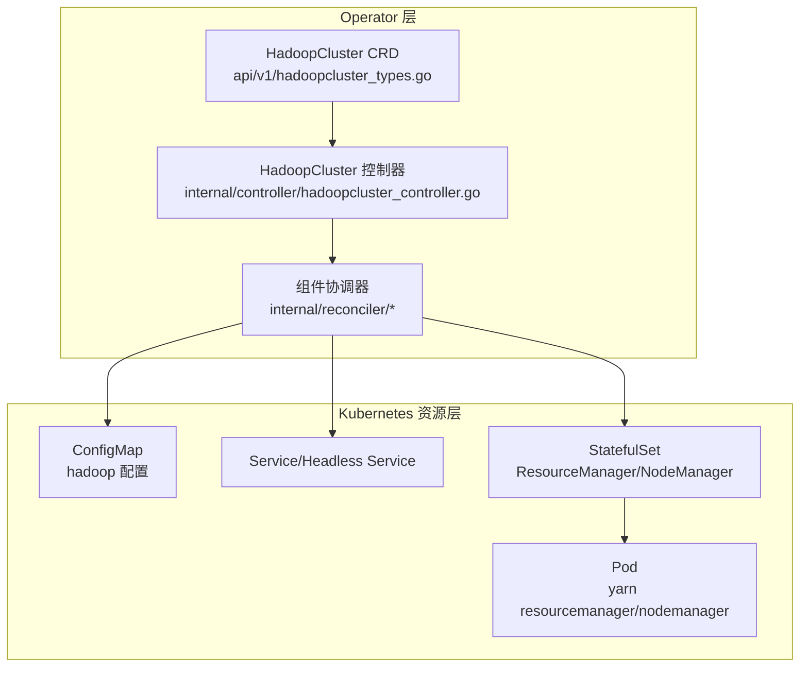
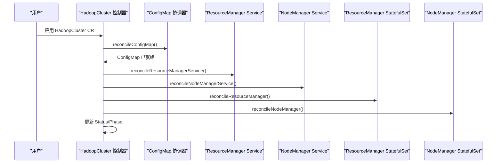
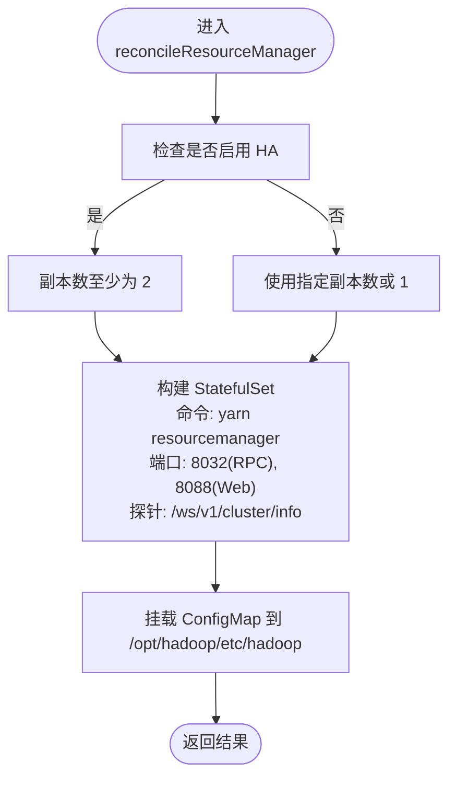
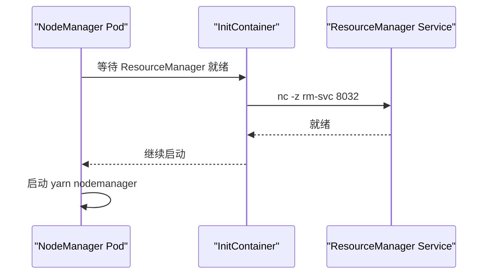
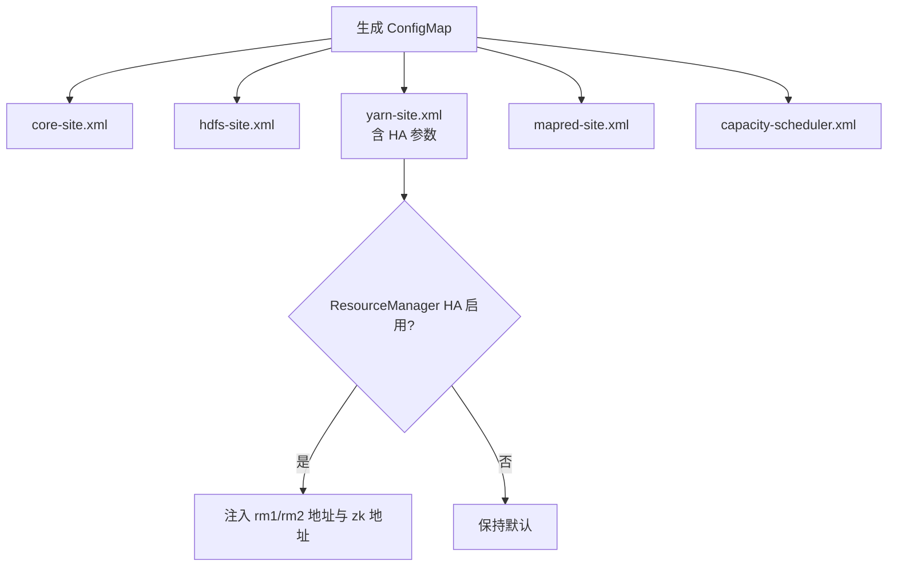
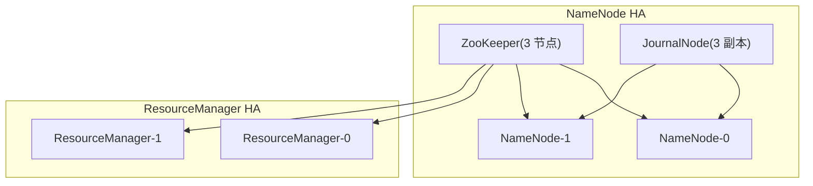
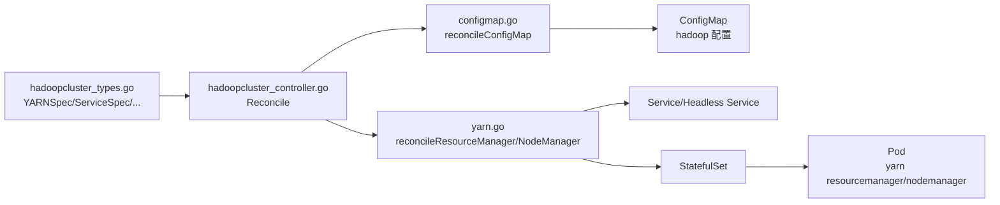

# YARN 组件管理

<cite>
**本文引用的文件列表**
- [hadoop-operator/internal/controller/hadoopcluster_controller.go](file://hadoop-operator/internal/controller/hadoopcluster_controller.go)
- [hadoop-operator/internal/reconciler/yarn.go](file://hadoop-operator/internal/reconciler/yarn.go)
- [hadoop-operator/internal/reconciler/configmap.go](file://hadoop-operator/internal/reconciler/configmap.go)
- [hadoop-operator/internal/reconciler/ha.go](file://hadoop-operator/internal/reconciler/ha.go)
- [hadoop-operator/api/v1/hadoopcluster_types.go](file://hadoop-operator/api/v1/hadoopcluster_types.go)
- [hadoop-operator/config/samples/hadoop_v1_hadoopcluster_ha.yaml](file://hadoop-operator/config/samples/hadoop_v1_hadoopcluster_ha.yaml)
- [hadoop-operator/config/samples/offline-deployment.yaml](file://hadoop-operator/config/samples/offline-deployment.yaml)
- [hadoop-operator/README.md](file://hadoop-operator/README.md)
- [resourcemanager.yaml](file://resourcemanager.yaml)
- [nodemanager.yaml](file://nodemanager.yaml)
</cite>

## 目录
1. [简介](#简介)
2. [项目结构](#项目结构)
3. [核心组件](#核心组件)
4. [架构总览](#架构总览)
5. [详细组件分析](#详细组件分析)
6. [依赖关系分析](#依赖关系分析)
7. [性能与资源管理](#性能与资源管理)
8. [故障排查指南](#故障排查指南)
9. [结论](#结论)
10. [附录](#附录)

## 简介
本文件面向运维与平台工程人员，系统化阐述基于 Kubernetes 的 YARN 组件管理实践，重点覆盖：
- ResourceManager 与 NodeManager 的职责与协作
- YARN 高可用（HA）配置与故障转移
- 节点资源管理与容器资源分配策略
- YARN 队列与容量调度、优先级与资源配额
- 应用生命周期管理（提交到完成）
- 容器资源隔离、网络与存储访问控制
- 性能监控、资源利用率分析与调度优化
- 常见问题诊断与排障

本项目通过自定义资源 HadoopCluster 与控制器，自动化编排 HDFS 与 YARN 组件，提供 YARN HA、配置注入、服务暴露与监控等能力。

## 项目结构
该项目采用标准的 Kubernetes Operator 结构，核心由 CRD、控制器与组件协调器组成：
- CRD 定义：HadoopClusterSpec/YARNSpec 等类型，描述 YARN 组件的副本、资源、服务、HA、亲和性等
- 控制器：统一编排顺序，依次创建 ConfigMap、NameNode、DataNode、ResourceManager、NodeManager
- 协调器：按组件生成 Service、Headless Service、StatefulSet、探针与卷挂载
- 示例：提供 HA 与离线部署样例，便于快速验证

图表来源
- [hadoop-operator/api/v1/hadoopcluster_types.go:24-46](file://hadoop-operator/api/v1/hadoopcluster_types.go#L24-L46)
- [hadoop-operator/internal/controller/hadoopcluster_controller.go:104-126](file://hadoop-operator/internal/controller/hadoopcluster_controller.go#L104-L126)
- [hadoop-operator/internal/reconciler/yarn.go:34-113](file://hadoop-operator/internal/reconciler/yarn.go#L34-L113)

章节来源
- [hadoop-operator/README.md:235-251](file://hadoop-operator/README.md#L235-L251)
- [hadoop-operator/internal/controller/hadoopcluster_controller.go:104-144](file://hadoop-operator/internal/controller/hadoopcluster_controller.go#L104-L144)

## 核心组件
- HadoopClusterSpec/YARNSpec：定义 YARN 的 ResourceManager 与 NodeManager 的副本数、资源、服务类型、亲和性、容忍度、HA 等
- HadoopCluster 控制器：负责按序编排各组件，更新状态，处理删除与最终化
- YARN 协调器：生成 ResourceManager 与 NodeManager 的 Headless/外部 Service、StatefulSet、探针与卷挂载
- ConfigMap 协调器：根据 CRD 生成 core-site、hdfs-site、yarn-site、mapred-site、capacity-scheduler 等配置
- HA 协调器：在未配置外部 ZooKeeper 时，内部部署 ZooKeeper；并按需生成 JournalNode

章节来源
- [hadoop-operator/api/v1/hadoopcluster_types.go:142-187](file://hadoop-operator/api/v1/hadoopcluster_types.go#L142-L187)
- [hadoop-operator/internal/controller/hadoopcluster_controller.go:104-144](file://hadoop-operator/internal/controller/hadoopcluster_controller.go#L104-L144)
- [hadoop-operator/internal/reconciler/yarn.go:34-240](file://hadoop-operator/internal/reconciler/yarn.go#L34-L240)
- [hadoop-operator/internal/reconciler/configmap.go:43-68](file://hadoop-operator/internal/reconciler/configmap.go#L43-L68)
- [hadoop-operator/internal/reconciler/ha.go:34-177](file://hadoop-operator/internal/reconciler/ha.go#L34-L177)

## 架构总览
YARN 组件在 Kubernetes 中以 StatefulSet 管理，通过 Headless Service 提供稳定网络标识，外部 Service 暴露 RPC/Web 端口。控制器负责：
- 生成 ConfigMap 注入 Hadoop 配置
- 为 ResourceManager/NodeManager 创建 Headless 与外部 Service
- 创建 StatefulSet 并设置探针、亲和性、容忍度、卷挂载
- 更新集群状态与阶段

图表来源
- [hadoop-operator/internal/controller/hadoopcluster_controller.go:104-144](file://hadoop-operator/internal/controller/hadoopcluster_controller.go#L104-L144)
- [hadoop-operator/internal/reconciler/configmap.go:43-68](file://hadoop-operator/internal/reconciler/configmap.go#L43-L68)
- [hadoop-operator/internal/reconciler/yarn.go:34-240](file://hadoop-operator/internal/reconciler/yarn.go#L34-L240)

## 详细组件分析

### ResourceManager 组件
- 服务暴露：Headless Service 用于稳定 DNS 标识；外部 Service 支持 NodePort/LB 暴露 RPC(8032)/Web(8088)
- StatefulSet：副本数默认 1，HA 场景至少 2；设置亲和性、容忍度、资源请求/限制、探针
- 命令与卷：启动 yarn resourcemanager，挂载 hadoop 配置 ConfigMap
- HA：当启用 HA 且副本数小于 2 时自动提升至 2；yarn-site.xml 注入 HA 相关参数

图表来源
- [hadoop-operator/internal/reconciler/yarn.go:115-240](file://hadoop-operator/internal/reconciler/yarn.go#L115-L240)

章节来源
- [hadoop-operator/internal/reconciler/yarn.go:34-113](file://hadoop-operator/internal/reconciler/yarn.go#L34-L113)
- [hadoop-operator/internal/reconciler/yarn.go:115-240](file://hadoop-operator/internal/reconciler/yarn.go#L115-L240)
- [hadoop-operator/internal/reconciler/configmap.go:138-168](file://hadoop-operator/internal/reconciler/configmap.go#L138-L168)

### NodeManager 组件
- 服务暴露：Headless Service 与外部 Service 暴露 Web(8042)
- StatefulSet：副本数默认 2；设置亲和性、容忍度、资源请求/限制、探针
- InitContainer：等待 ResourceManager RPC 端口就绪后再启动 NodeManager
- 命令与卷：启动 yarn nodemanager，挂载 hadoop 配置 ConfigMap

图表来源
- [hadoop-operator/internal/reconciler/yarn.go:312-447](file://hadoop-operator/internal/reconciler/yarn.go#L312-L447)

章节来源
- [hadoop-operator/internal/reconciler/yarn.go:242-310](file://hadoop-operator/internal/reconciler/yarn.go#L242-L310)
- [hadoop-operator/internal/reconciler/yarn.go:312-447](file://hadoop-operator/internal/reconciler/yarn.go#L312-L447)

### 配置注入与调度器
- ConfigMap：生成 core-site、hdfs-site、yarn-site、mapred-site、capacity-scheduler
- YARN HA：当启用 HA 时，yarn-site.xml 注入 rm1/rm2 地址、zk 地址、cluster-id 等
- 容量调度：capacity-scheduler.xml 默认配置单队列 default，可被 CRD 覆盖

图表来源
- [hadoop-operator/internal/reconciler/configmap.go:70-209](file://hadoop-operator/internal/reconciler/configmap.go#L70-L209)

章节来源
- [hadoop-operator/internal/reconciler/configmap.go:70-209](file://hadoop-operator/internal/reconciler/configmap.go#L70-L209)

### 高可用与 ZooKeeper/JournalNode
- 内部 ZooKeeper：未配置外部 ZooKeeper 时，自动部署 ZooKeeper 集群（3 节点），提供客户端/选举端口
- JournalNode：HA NameNode 的元数据同步组件，默认 3 副本，提供 RPC/Web 端口
- ResourceManager HA：通过 ZooKeeper 实现 RM 主备切换与状态同步

图表来源
- [hadoop-operator/internal/reconciler/ha.go:34-177](file://hadoop-operator/internal/reconciler/ha.go#L34-L177)
- [hadoop-operator/internal/reconciler/ha.go:179-363](file://hadoop-operator/internal/reconciler/ha.go#L179-L363)

章节来源
- [hadoop-operator/internal/reconciler/ha.go:34-177](file://hadoop-operator/internal/reconciler/ha.go#L34-L177)
- [hadoop-operator/internal/reconciler/ha.go:179-363](file://hadoop-operator/internal/reconciler/ha.go#L179-L363)

## 依赖关系分析
- 控制器依赖 CRD 类型定义，按顺序调用各组件协调器
- 协调器依赖 CRD 中的 YARN 配置（副本、资源、服务、HA、亲和性等）
- ConfigMap 作为配置中心，被 ResourceManager/NodeManager 容器挂载读取
- ResourceManager/NodeManager 通过 Headless Service 获取稳定 DNS 名称，外部 Service 暴露端口

图表来源
- [hadoop-operator/api/v1/hadoopcluster_types.go:142-187](file://hadoop-operator/api/v1/hadoopcluster_types.go#L142-L187)
- [hadoop-operator/internal/controller/hadoopcluster_controller.go:104-144](file://hadoop-operator/internal/controller/hadoopcluster_controller.go#L104-L144)
- [hadoop-operator/internal/reconciler/yarn.go:34-240](file://hadoop-operator/internal/reconciler/yarn.go#L34-L240)
- [hadoop-operator/internal/reconciler/configmap.go:43-68](file://hadoop-operator/internal/reconciler/configmap.go#L43-L68)

章节来源
- [hadoop-operator/internal/controller/hadoopcluster_controller.go:104-144](file://hadoop-operator/internal/controller/hadoopcluster_controller.go#L104-L144)
- [hadoop-operator/internal/reconciler/yarn.go:34-240](file://hadoop-operator/internal/reconciler/yarn.go#L34-L240)
- [hadoop-operator/internal/reconciler/configmap.go:43-68](file://hadoop-operator/internal/reconciler/configmap.go#L43-L68)

## 性能与资源管理

### 资源分配与隔离
- 资源请求/限制：YARN 组件默认设置 CPU/内存请求与限制，可在 CRD 中覆盖
- 亲和性与容忍度：支持 Pod 反亲和性与节点容忍度，避免热点与提升可用性
- 容器隔离：通过 Kubernetes 资源配额与 QoS 保障关键组件资源

章节来源
- [hadoop-operator/internal/reconciler/yarn.go:137-150](file://hadoop-operator/internal/reconciler/yarn.go#L137-L150)
- [hadoop-operator/internal/reconciler/yarn.go:329-342](file://hadoop-operator/internal/reconciler/yarn.go#L329-L342)
- [hadoop-operator/api/v1/hadoopcluster_types.go:150-187](file://hadoop-operator/api/v1/hadoopcluster_types.go#L150-L187)

### 调度器与队列
- 容量调度：默认 capacity-scheduler.xml 单队列 default，可按需覆盖
- 优先级与配额：可通过 capacity-scheduler.xml 调整最大应用数、AM 资源占比、队列容量与 ACL
- 资源上限：yarn.scheduler.maximum-allocation-mb/vcores 限制单容器最大资源

章节来源
- [hadoop-operator/internal/reconciler/configmap.go:184-206](file://hadoop-operator/internal/reconciler/configmap.go#L184-L206)
- [hadoop-operator/config/samples/hadoop_v1_hadoopcluster_ha.yaml:95-100](file://hadoop-operator/config/samples/hadoop_v1_hadoopcluster_ha.yaml#L95-L100)

### 监控与可观测性
- Prometheus Exporter：通过 metrics.exporterImage 与 ServiceMonitor 配置启用
- 端口暴露：ResourceManager/NodeManager 外部 Service 暴露 Web 端口，便于抓取指标

章节来源
- [hadoop-operator/api/v1/hadoopcluster_types.go:273-295](file://hadoop-operator/api/v1/hadoopcluster_types.go#L273-L295)
- [hadoop-operator/config/samples/offline-deployment.yaml:122-126](file://hadoop-operator/config/samples/offline-deployment.yaml#L122-L126)

## 故障排查指南

### 调度异常与 RM/NM 不可用
- 检查 ResourceManager/NodeManager Service 是否创建成功，端口映射是否正确
- 查看 StatefulSet 副本数与 Pod 状态，确认探针健康
- 若启用 HA，确认 ZooKeeper 可用且 rm1/rm2 地址解析正常

章节来源
- [hadoop-operator/internal/reconciler/yarn.go:34-113](file://hadoop-operator/internal/reconciler/yarn.go#L34-L113)
- [hadoop-operator/internal/reconciler/yarn.go:115-240](file://hadoop-operator/internal/reconciler/yarn.go#L115-L240)
- [hadoop-operator/internal/reconciler/ha.go:34-177](file://hadoop-operator/internal/reconciler/ha.go#L34-L177)

### 资源不足与 OOM
- 调整 YARN 组件的资源请求/限制，确保满足工作负载峰值
- 关注 capacity-scheduler 与 maximum-allocation 配置，避免单容器过大导致资源争抢

章节来源
- [hadoop-operator/internal/reconciler/yarn.go:137-150](file://hadoop-operator/internal/reconciler/yarn.go#L137-L150)
- [hadoop-operator/internal/reconciler/yarn.go:329-342](file://hadoop-operator/internal/reconciler/yarn.go#L329-L342)
- [hadoop-operator/config/samples/hadoop_v1_hadoopcluster_ha.yaml:95-100](file://hadoop-operator/config/samples/hadoop_v1_hadoopcluster_ha.yaml#L95-L100)

### 应用程序失败
- 检查 NodeManager 是否就绪（InitContainer 等待 RM 就绪）
- 查看 YARN Web UI（8088）与 Node Web UI（8042）定位作业状态
- 核对 capacity-scheduler 与队列 ACL，确保提交权限

章节来源
- [hadoop-operator/internal/reconciler/yarn.go:361-376](file://hadoop-operator/internal/reconciler/yarn.go#L361-L376)
- [hadoop-operator/internal/reconciler/configmap.go:138-168](file://hadoop-operator/internal/reconciler/configmap.go#L138-L168)

### 离线部署与镜像拉取
- 使用私有镜像仓库时，配置 image.pullSecrets
- 离线环境可参考 offline-deployment.yaml 的镜像与导出器配置

章节来源
- [hadoop-operator/config/samples/offline-deployment.yaml:7-15](file://hadoop-operator/config/samples/offline-deployment.yaml#L7-L15)
- [hadoop-operator/README.md:110-126](file://hadoop-operator/README.md#L110-L126)

## 结论
本项目通过 Operator 将 YARN 组件的部署、配置与运维标准化，支持 HA、资源隔离、网络与存储管理，并提供监控与排障路径。结合 CRD 的灵活配置，可在不同环境中快速落地 YARN 集群，满足生产级可用性与可维护性需求。

## 附录

### YARN 队列与容量调度配置要点
- 队列结构：单队列 default 或多队列场景
- 关键参数：最大应用数、AM 资源占比、队列容量、ACL、优先级
- 可通过 CRD 的 capacityScheduler 覆盖项进行调整

章节来源
- [hadoop-operator/internal/reconciler/configmap.go:184-206](file://hadoop-operator/internal/reconciler/configmap.go#L184-L206)
- [hadoop-operator/api/v1/hadoopcluster_types.go:228-231](file://hadoop-operator/api/v1/hadoopcluster_types.go#L228-L231)

### ResourceManager 与 NodeManager 端口
- ResourceManager：RPC(8032)、Web(8088)
- NodeManager：Web(8042)

章节来源
- [hadoop-operator/internal/reconciler/yarn.go:34-113](file://hadoop-operator/internal/reconciler/yarn.go#L34-L113)
- [hadoop-operator/internal/reconciler/yarn.go:242-310](file://hadoop-operator/internal/reconciler/yarn.go#L242-L310)

### 示例与参考
- HA 部署示例：包含 YARN HA、ZooKeeper、JournalNode 等
- 离线部署示例：私有镜像仓库、导出器与 ServiceMonitor 配置

章节来源
- [hadoop-operator/config/samples/hadoop_v1_hadoopcluster_ha.yaml:56-107](file://hadoop-operator/config/samples/hadoop_v1_hadoopcluster_ha.yaml#L56-L107)
- [hadoop-operator/config/samples/offline-deployment.yaml:64-127](file://hadoop-operator/config/samples/offline-deployment.yaml#L64-L127)