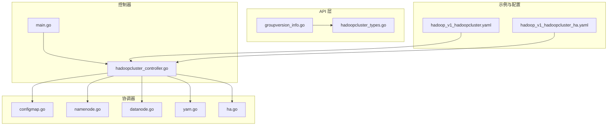
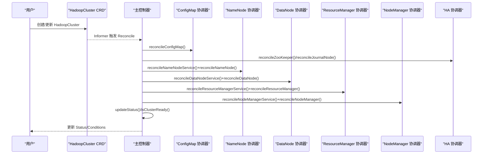
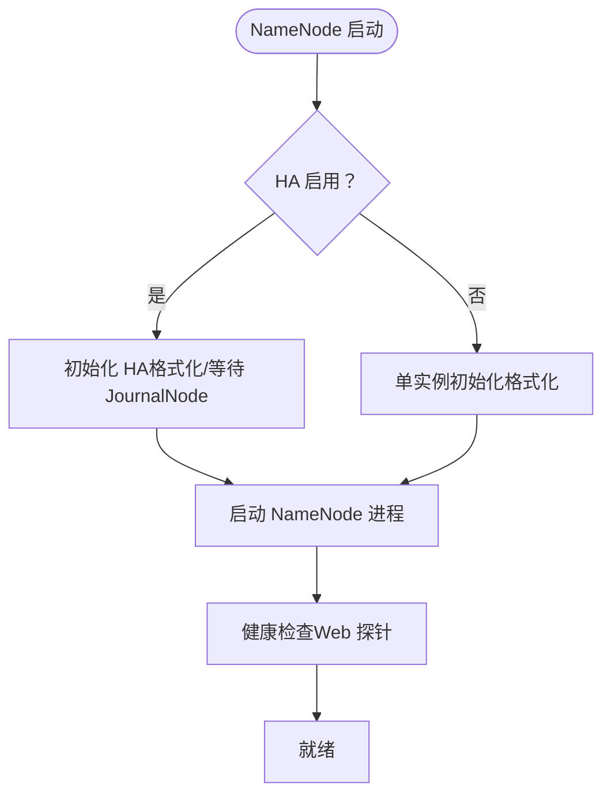
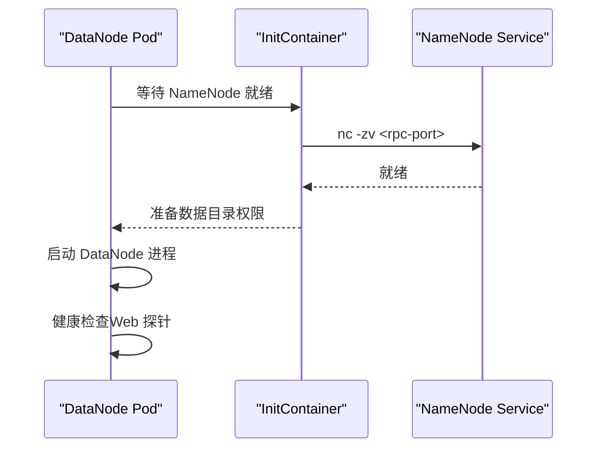
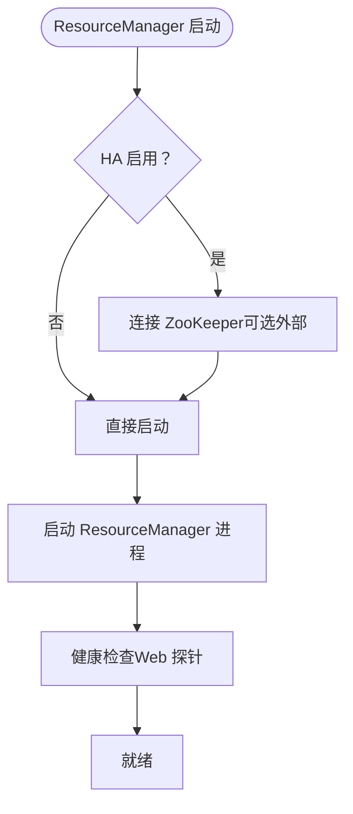
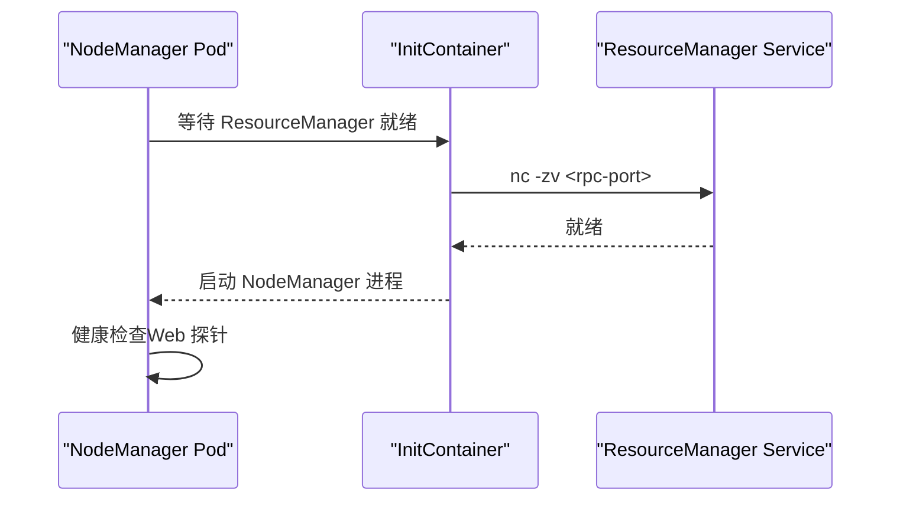
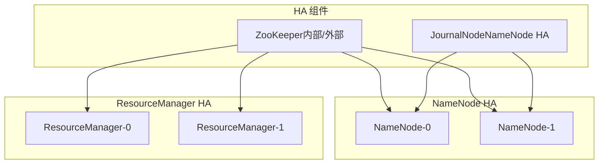
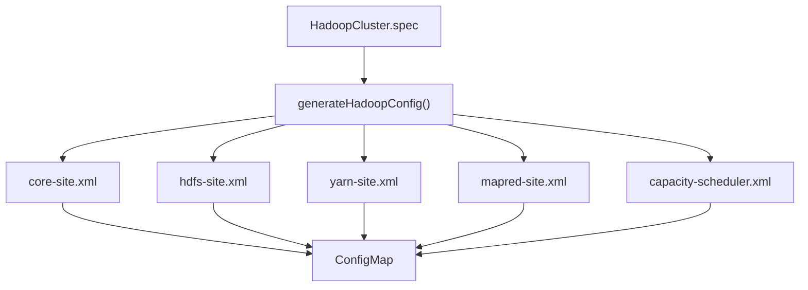
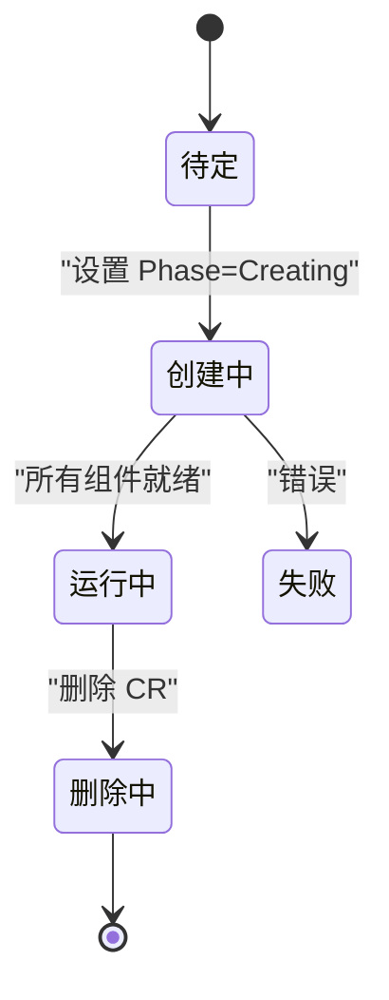
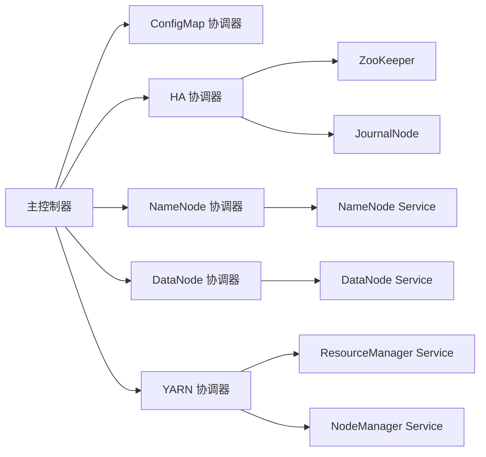

# 组件管理

<cite>
**本文引用的文件**
- [README.md](file://hadoop-operator/README.md)
- [main.go](file://hadoop-operator/cmd/main.go)
- [groupversion_info.go](file://hadoop-operator/api/v1/groupversion_info.go)
- [hadoopcluster_types.go](file://hadoop-operator/api/v1/hadoopcluster_types.go)
- [hadoopcluster_controller.go](file://hadoop-operator/internal/controller/hadoopcluster_controller.go)
- [configmap.go](file://hadoop-operator/internal/reconciler/configmap.go)
- [namenode.go](file://hadoop-operator/internal/reconciler/namenode.go)
- [datanode.go](file://hadoop-operator/internal/reconciler/datanode.go)
- [yarn.go](file://hadoop-operator/internal/reconciler/yarn.go)
- [ha.go](file://hadoop-operator/internal/reconciler/ha.go)
- [hadoop_v1_hadoopcluster.yaml](file://hadoop-operator/config/samples/hadoop_v1_hadoopcluster.yaml)
- [hadoop_v1_hadoopcluster_ha.yaml](file://hadoop-operator/config/samples/hadoop_v1_hadoopcluster_ha.yaml)
- [go.mod](file://hadoop-operator/go.mod)
</cite>

## 目录
1. [简介](#简介)
2. [项目结构](#项目结构)
3. [核心组件](#核心组件)
4. [架构总览](#架构总览)
5. [详细组件分析](#详细组件分析)
6. [依赖分析](#依赖分析)
7. [性能考虑](#性能考虑)
8. [故障排查指南](#故障排查指南)
9. [结论](#结论)
10. [附录](#附录)

## 简介
本文件面向 Hadoop 组件管理场景，围绕 NameNode、DataNode、ResourceManager、NodeManager 等核心组件，系统阐述其生命周期管理、职责边界、配置与部署策略、状态管理、高可用（HA）协调机制、故障转移与健康检查、组件间依赖与通信协议、数据流、监控与日志、性能调优、配置模板与资源分配策略等。文档基于仓库中的 CRD 定义、控制器与协调器实现、示例配置进行归纳总结，帮助读者快速理解并实践在 Kubernetes 上的 Hadoop 集群编排与运维。

## 项目结构
该项目采用标准的 Kubernetes Operator 结构：
- API 层：定义 HadoopCluster CRD 及其规格与状态字段
- 控制器层：主控制器负责协调各组件的创建与状态更新
- 协调器层：按组件拆分的 reconciler，分别处理 ConfigMap、NameNode、DataNode、YARN（ResourceManager/NodeManager）、HA（ZooKeeper/JournalNode）
- 示例与配置：提供基础与 HA 的集群样例，以及 Operator 部署清单

图表来源
- [main.go:54-149](file://hadoop-operator/cmd/main.go#L54-L149)
- [hadoopcluster_controller.go:104-145](file://hadoop-operator/internal/controller/hadoopcluster_controller.go#L104-L145)
- [configmap.go:43-68](file://hadoop-operator/internal/reconciler/configmap.go#L43-L68)
- [namenode.go:35-114](file://hadoop-operator/internal/reconciler/namenode.go#L35-L114)
- [datanode.go:34-113](file://hadoop-operator/internal/reconciler/datanode.go#L34-L113)
- [yarn.go:34-113](file://hadoop-operator/internal/reconciler/yarn.go#L34-L113)
- [ha.go:34-177](file://hadoop-operator/internal/reconciler/ha.go#L34-L177)

章节来源
- [README.md:233-251](file://hadoop-operator/README.md#L233-L251)
- [go.mod:1-69](file://hadoop-operator/go.mod#L1-L69)

## 核心组件
- HadoopCluster CRD：描述集群的镜像、HDFS、YARN、配置覆盖、安全、监控等期望状态
- 主控制器：负责 HadoopCluster 生命周期的协调，顺序调用各组件 reconciler，并维护状态与条件
- 组件协调器：分别为 ConfigMap、NameNode、DataNode、YARN（含 ResourceManager/NodeManager）、HA（ZooKeeper/JournalNode）生成对应 Kubernetes 资源

章节来源
- [hadoopcluster_types.go:24-46](file://hadoop-operator/api/v1/hadoopcluster_types.go#L24-L46)
- [hadoopcluster_controller.go:104-145](file://hadoop-operator/internal/controller/hadoopcluster_controller.go#L104-L145)

## 架构总览
Operator 以 CRD 为入口，控制器按顺序对组件进行“期望状态 -> 实际状态”的收敛，期间通过 ConfigMap 提供 Hadoop 配置，通过 StatefulSet/Service/PVC 等资源编排组件生命周期，HA 场景下引入 ZooKeeper 与 JournalNode 协调 NameNode/ResourceManager 的切换。

图表来源
- [hadoopcluster_controller.go:104-145](file://hadoop-operator/internal/controller/hadoopcluster_controller.go#L104-L145)
- [configmap.go:43-68](file://hadoop-operator/internal/reconciler/configmap.go#L43-L68)
- [namenode.go:35-114](file://hadoop-operator/internal/reconciler/namenode.go#L35-L114)
- [datanode.go:34-113](file://hadoop-operator/internal/reconciler/datanode.go#L34-L113)
- [yarn.go:34-113](file://hadoop-operator/internal/reconciler/yarn.go#L34-L113)
- [ha.go:34-177](file://hadoop-operator/internal/reconciler/ha.go#L34-L177)

## 详细组件分析

### NameNode 组件
- 职责
  - HDFS 元数据管理与命名空间服务
  - 在 HA 模式下配合 JournalNode 与 ZooKeeper 实现自动故障转移
- 配置要点
  - 头服务（headless）与外部服务（NodePort/LoadBalancer）分离
  - 支持副本数与资源请求/限制
  - 存储 PVC 模板，支持 StorageClass 与访问模式
  - 健康探针（liveness/readiness）基于 Web UI
- HA 协调
  - HA 开关、JournalNode 副本数（建议≥3）
  - ZooKeeper 作为可选外部或内部部署
  - 初始化脚本在 HA 模式下差异化处理
- 数据流
  - DataNode 通过 RPC 端口向 NameNode 注册与上报心跳
  - 客户端通过 NameNode 外部服务访问 HDFS

图表来源
- [namenode.go:116-317](file://hadoop-operator/internal/reconciler/namenode.go#L116-L317)
- [namenode.go:328-362](file://hadoop-operator/internal/reconciler/namenode.go#L328-L362)

章节来源
- [namenode.go:35-114](file://hadoop-operator/internal/reconciler/namenode.go#L35-L114)
- [namenode.go:116-317](file://hadoop-operator/internal/reconciler/namenode.go#L116-L317)
- [hadoopcluster_types.go:69-90](file://hadoop-operator/api/v1/hadoopcluster_types.go#L69-L90)

### DataNode 组件
- 职责
  - 存储实际数据块，响应读写请求
- 配置要点
  - 头服务与外部服务
  - 资源与存储 PVC 模板
  - 启动前等待 NameNode 就绪的 initContainer
  - 健康探针基于 Web UI
- 依赖关系
  - 依赖 NameNode 服务名解析
  - 通过 ConfigMap 获取 Hadoop 配置

图表来源
- [datanode.go:115-321](file://hadoop-operator/internal/reconciler/datanode.go#L115-L321)

章节来源
- [datanode.go:34-113](file://hadoop-operator/internal/reconciler/datanode.go#L34-L113)
- [datanode.go:115-321](file://hadoop-operator/internal/reconciler/datanode.go#L115-L321)

### ResourceManager 组件
- 职责
  - YARN 集群资源调度与应用生命周期管理
- 配置要点
  - 头服务与外部服务
  - HA 开关与副本数（建议≥2）
  - 健康探针基于 Web UI
- 依赖关系
  - 通过 ConfigMap 获取 Hadoop 配置
  - 与 ZooKeeper（可选）协作实现 RM HA

图表来源
- [yarn.go:115-240](file://hadoop-operator/internal/reconciler/yarn.go#L115-L240)

章节来源
- [yarn.go:34-113](file://hadoop-operator/internal/reconciler/yarn.go#L34-L113)
- [yarn.go:115-240](file://hadoop-operator/internal/reconciler/yarn.go#L115-L240)

### NodeManager 组件
- 职责
  - 节点上容器资源管理与任务执行
- 配置要点
  - 头服务与外部服务
  - 资源与健康探针
  - 启动前等待 ResourceManager 就绪的 initContainer
- 依赖关系
  - 依赖 ResourceManager 服务名解析
  - 通过 ConfigMap 获取 Hadoop 配置

图表来源
- [yarn.go:312-447](file://hadoop-operator/internal/reconciler/yarn.go#L312-L447)

章节来源
- [yarn.go:242-310](file://hadoop-operator/internal/reconciler/yarn.go#L242-L310)
- [yarn.go:312-447](file://hadoop-operator/internal/reconciler/yarn.go#L312-L447)

### 高可用（HA）协调机制
- ZooKeeper
  - 内部部署（默认 3 副本）或外部连接字符串
  - 用于 NameNode/ResourceManager 的元数据与选举协调
- JournalNode
  - NameNode HA 的共享编辑日志存储，建议副本数≥3
- 自动故障转移
  - NameNode/ResourceManager HA 启用后，自动配置 failover 与 zk 地址
- 协调器流程
  - 先创建 ZooKeeper 与 JournalNode（如启用 HA），再创建 NameNode/ResourceManager

图表来源
- [ha.go:34-177](file://hadoop-operator/internal/reconciler/ha.go#L34-L177)
- [hadoopcluster_types.go:92-120](file://hadoop-operator/api/v1/hadoopcluster_types.go#L92-L120)

章节来源
- [ha.go:34-177](file://hadoop-operator/internal/reconciler/ha.go#L34-L177)
- [hadoopcluster_types.go:92-120](file://hadoop-operator/api/v1/hadoopcluster_types.go#L92-L120)

### 配置管理与模板
- ConfigMap 生成
  - 自动生成 core-site、hdfs-site、yarn-site、mapred-site、capacity-scheduler 等配置
  - HA 模式下自动注入 fs.defaultFS、ha.zookeeper.quorum、NameNode/ResourceManager HA 相关键值
  - 用户可通过 spec.config.* 覆盖默认值
- 镜像与资源
  - 统一镜像仓库与标签，支持拉取策略与镜像拉取密钥
  - 各组件支持 requests/limits 与亲和性/容忍度

图表来源
- [configmap.go:70-209](file://hadoop-operator/internal/reconciler/configmap.go#L70-L209)

章节来源
- [configmap.go:43-68](file://hadoop-operator/internal/reconciler/configmap.go#L43-L68)
- [configmap.go:70-209](file://hadoop-operator/internal/reconciler/configmap.go#L70-L209)
- [hadoopcluster_types.go:214-295](file://hadoop-operator/api/v1/hadoopcluster_types.go#L214-L295)

### 状态管理与健康检查
- 状态字段
  - 集群阶段（Pending/Created/Running/Failed/Deleting/Upgrading）
  - 条件（Ready/Progressing/Degraded）
  - 各组件就绪副本数、总副本数、活跃/备用节点信息
- 健康检查
  - NameNode/ResourceManager/DataNode/NodeManager 均配置 liveness/readiness 探针
  - 通过 Web UI 路径进行健康检查
- 控制循环
  - 主控制器按顺序调用各组件 reconciler，更新状态并在 Ready 后进入 Running

图表来源
- [hadoopcluster_controller.go:169-174](file://hadoop-operator/internal/controller/hadoopcluster_controller.go#L169-L174)
- [hadoopcluster_types.go:297-389](file://hadoop-operator/api/v1/hadoopcluster_types.go#L297-L389)

章节来源
- [hadoopcluster_controller.go:169-227](file://hadoop-operator/internal/controller/hadoopcluster_controller.go#L169-L227)
- [hadoopcluster_types.go:297-389](file://hadoop-operator/api/v1/hadoopcluster_types.go#L297-L389)

### 组件间依赖与通信协议
- 服务发现
  - 通过 headless 服务与稳定 DNS 名称解析组件间通信
- 通信端口
  - NameNode: RPC(9000)/Web(9870)
  - DataNode: Data(9866)/Web(9864)
  - ResourceManager: RPC(8032)/Web(8088)
  - NodeManager: Web(8042)
  - JournalNode: RPC(8485)/Web(8480)
  - ZooKeeper: Client(2181)/Peer(2888)/Election(3888)
- 依赖链
  - DataNode/NodeManager 启动前需等待 NameNode/ResourceManager 就绪
  - HA 模式下 NameNode/ResourceManager 依赖 ZooKeeper/JournalNode

章节来源
- [namenode.go:48-114](file://hadoop-operator/internal/reconciler/namenode.go#L48-L114)
- [datanode.go:47-113](file://hadoop-operator/internal/reconciler/datanode.go#L47-L113)
- [yarn.go:47-113](file://hadoop-operator/internal/reconciler/yarn.go#L47-L113)
- [yarn.go:255-310](file://hadoop-operator/internal/reconciler/yarn.go#L255-L310)
- [ha.go:55-83](file://hadoop-operator/internal/reconciler/ha.go#L55-L83)

## 依赖分析
- 控制器与协调器耦合
  - 主控制器按固定顺序调用各组件 reconciler，确保依赖满足（如先 HA 再 NameNode/ResourceManager）
  - 协调器之间通过 CRD 规格与 ConfigMap 解耦
- 外部依赖
  - ZooKeeper（内部/外部）
  - JournalNode（仅 NameNode HA）
  - Kubernetes API（StatefulSet/Service/ConfigMap/PVC）
- 版本与运行时
  - 基于 controller-runtime v0.17，Kubernetes API v1.29

图表来源
- [hadoopcluster_controller.go:104-145](file://hadoop-operator/internal/controller/hadoopcluster_controller.go#L104-L145)
- [ha.go:34-177](file://hadoop-operator/internal/reconciler/ha.go#L34-L177)
- [namenode.go:35-114](file://hadoop-operator/internal/reconciler/namenode.go#L35-L114)
- [datanode.go:34-113](file://hadoop-operator/internal/reconciler/datanode.go#L34-L113)
- [yarn.go:34-113](file://hadoop-operator/internal/reconciler/yarn.go#L34-L113)

章节来源
- [go.mod:5-10](file://hadoop-operator/go.mod#L5-L10)
- [hadoopcluster_controller.go:104-145](file://hadoop-operator/internal/controller/hadoopcluster_controller.go#L104-L145)

## 性能考虑
- 资源规划
  - 为 NameNode/ResourceManager/DataNode/NodeManager 设置合理的 requests/limits，避免资源争抢
  - DataNode/NameNode 存储容量与 IOPS 需匹配业务规模
- 存储策略
  - 使用合适的 StorageClass 与访问模式，确保 PVC 动态绑定与持久化
  - JournalNode 存储建议独立 PV，保障日志写入性能
- 网络与亲和性
  - 利用反亲和性将关键组件分散到不同节点，提升 HA 可用性
- 探针参数
  - 合理设置初始延迟与周期，避免频繁重启
- 监控与指标
  - 启用 Prometheus 监控与 ServiceMonitor，采集各组件指标

## 故障排查指南
- 常见问题定位
  - Pod 启动失败：查看事件与历史日志
  - NameNode 格式化失败：检查 PVC 状态与手动格式化
  - DataNode 无法连接 NameNode：检查网络连通性与配置
  - 镜像拉取失败：检查镜像存在性与拉取密钥
- 健康检查失败
  - 检查 liveness/readiness 探针路径与端口映射
  - 查看组件 Web UI 是否可达
- HA 相关
  - ZooKeeper 不可用：确认内部部署或外部连接字符串正确
  - JournalNode 不可用：检查副本数与存储

章节来源
- [README.md:276-318](file://hadoop-operator/README.md#L276-L318)

## 结论
该 Hadoop Operator 通过 CRD 与控制器实现了对 HDFS 与 YARN 组件的全生命周期管理，具备完善的 HA 协调、健康检查与状态反馈能力。结合 ConfigMap 模板化配置与资源/存储模板，能够快速在 Kubernetes 上部署与运维 Hadoop 集群。建议在生产环境中结合监控、日志与容量规划，持续优化资源与存储策略，确保高可用与稳定性。

## 附录
- 示例配置
  - 基础集群：[hadoop_v1_hadoopcluster.yaml](file://hadoop-operator/config/samples/hadoop_v1_hadoopcluster.yaml)
  - HA 集群：[hadoop_v1_hadoopcluster_ha.yaml](file://hadoop-operator/config/samples/hadoop_v1_hadoopcluster_ha.yaml)
- API 与类型
  - GroupVersion 与 Scheme：[groupversion_info.go](file://hadoop-operator/api/v1/groupversion_info.go)
  - HadoopCluster 规格与状态：[hadoopcluster_types.go](file://hadoop-operator/api/v1/hadoopcluster_types.go)
- 运行时与入口
  - 主程序与管理器配置：[main.go](file://hadoop-operator/cmd/main.go)
  - 依赖版本：[go.mod](file://hadoop-operator/go.mod)