# 高可用模式管理

<cite>
**本文档引用的文件**
- [README.md](file://hadoop-operator/README.md)
- [hadoopcluster_types.go](file://hadoop-operator/api/v1/hadoopcluster_types.go)
- [hadoopcluster_controller.go](file://hadoop-operator/internal/controller/hadoopcluster_controller.go)
- [configmap.go](file://hadoop-operator/internal/reconciler/configmap.go)
- [ha.go](file://hadoop-operator/internal/reconciler/ha.go)
- [namenode.go](file://hadoop-operator/internal/reconciler/namenode.go)
- [yarn.go](file://hadoop-operator/internal/reconciler/yarn.go)
- [hadoop_v1_hadoopcluster_ha.yaml](file://hadoop-operator/config/samples/hadoop_v1_hadoopcluster_ha.yaml)
- [hadoop_v1_hadoopcluster.yaml](file://hadoop-operator/config/samples/hadoop_v1_hadoopcluster.yaml)
- [main.go](file://hadoop-operator/cmd/main.go)
</cite>

## 目录
1. [简介](#简介)
2. [项目结构](#项目结构)
3. [核心组件](#核心组件)
4. [架构概览](#架构概览)
5. [详细组件分析](#详细组件分析)
6. [依赖关系分析](#依赖关系分析)
7. [性能考虑](#性能考虑)
8. [故障排查指南](#故障排查指南)
9. [结论](#结论)

## 简介

Hadoop Operator 是一个用于在 Kubernetes 上部署和管理 Hadoop 集群的生产级 Operator。该项目专门支持 Hadoop 分布式文件系统（HDFS）和 YARN 的高可用（HA）部署，提供了完整的高可用架构解决方案。

该 Operator 支持以下主要功能：
- **完整组件支持**：NameNode、DataNode、ResourceManager、NodeManager
- **高可用 (HA)**：支持 NameNode HA 和 ResourceManager HA
- **配置管理**：通过 CRD 灵活配置 Hadoop 参数
- **离线部署**：支持私有镜像仓库和离线环境部署
- **监控集成**：支持 Prometheus 监控
- **存储管理**：支持动态 PVC 和多种 StorageClass

## 项目结构

Hadoop Operator 采用标准的 Kubernetes Operator 模式，具有清晰的分层架构：

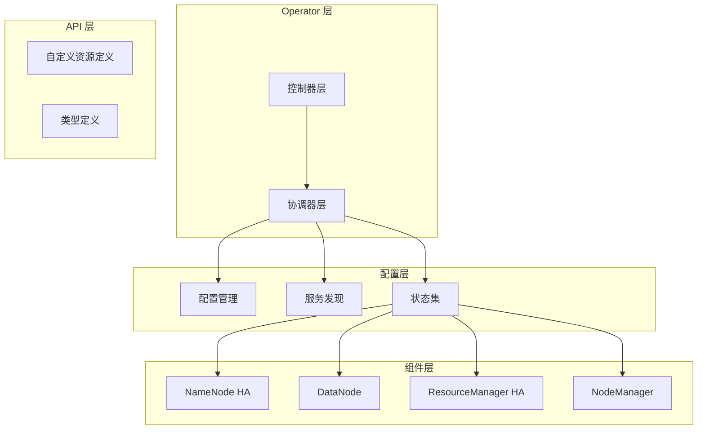
```mermaid
graph TB
subgraph "Operator 层"
Controller[控制器层]
Reconciler[协调器层]
end
subgraph "API 层"
CRD[自定义资源定义]
Types[类型定义]
end
subgraph "配置层"
ConfigMap[配置管理]
Services[服务发现]
StatefulSets[状态集]
end
subgraph "组件层"
NameNode[NameNode HA]
DataNode[DataNode]
ResourceManager[ResourceManager HA]
NodeManager[NodeManager]
end
Controller --> Reconciler
Reconciler --> ConfigMap
Reconciler --> Services
Reconciler --> StatefulSets
StatefulSets --> NameNode
StatefulSets --> DataNode
StatefulSets --> ResourceManager
StatefulSets --> NodeManager
```

**图表来源**
- [hadoopcluster_controller.go:105-126](file://hadoop-operator/internal/controller/hadoopcluster_controller.go#L105-L126)
- [hadoopcluster_types.go:24-46](file://hadoop-operator/api/v1/hadoopcluster_types.go#L24-L46)

**章节来源**
- [README.md:235-251](file://hadoop-operator/README.md#L235-L251)
- [hadoopcluster_controller.go:105-126](file://hadoop-operator/internal/controller/hadoopcluster_controller.go#L105-L126)

## 核心组件

### 自定义资源定义 (CRD)

HadoopCluster CRD 提供了完整的 Hadoop 集群配置模型，支持高可用模式的所有配置选项：

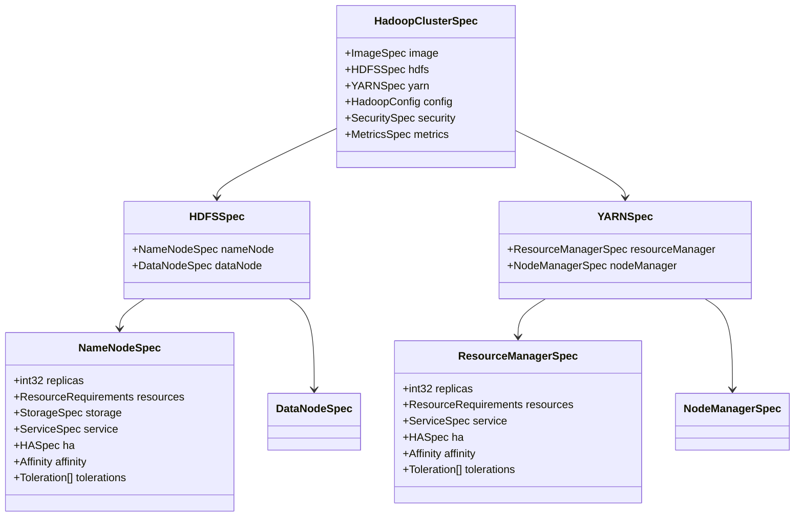
```mermaid
classDiagram
class HadoopClusterSpec {
+ImageSpec image
+HDFSSpec hdfs
+YARNSpec yarn
+HadoopConfig config
+SecuritySpec security
+MetricsSpec metrics
}
class HDFSSpec {
+NameNodeSpec nameNode
+DataNodeSpec dataNode
}
class NameNodeSpec {
+int32 replicas
+ResourceRequirements resources
+StorageSpec storage
+ServiceSpec service
+HASpec ha
+Affinity affinity
+Toleration[] tolerations
}
class YARNSpec {
+ResourceManagerSpec resourceManager
+NodeManagerSpec nodeManager
}
class ResourceManagerSpec {
+int32 replicas
+ResourceRequirements resources
+ServiceSpec service
+HASpec ha
+Affinity affinity
+Toleration[] tolerations
}
HadoopClusterSpec --> HDFSSpec
HadoopClusterSpec --> YARNSpec
HDFSSpec --> NameNodeSpec
HDFSSpec --> DataNodeSpec
YARNSpec --> ResourceManagerSpec
YARNSpec --> NodeManagerSpec
```

**图表来源**
- [hadoopcluster_types.go:24-187](file://hadoop-operator/api/v1/hadoopcluster_types.go#L24-L187)

### 控制器架构

控制器采用分层设计，实现了完整的生命周期管理：

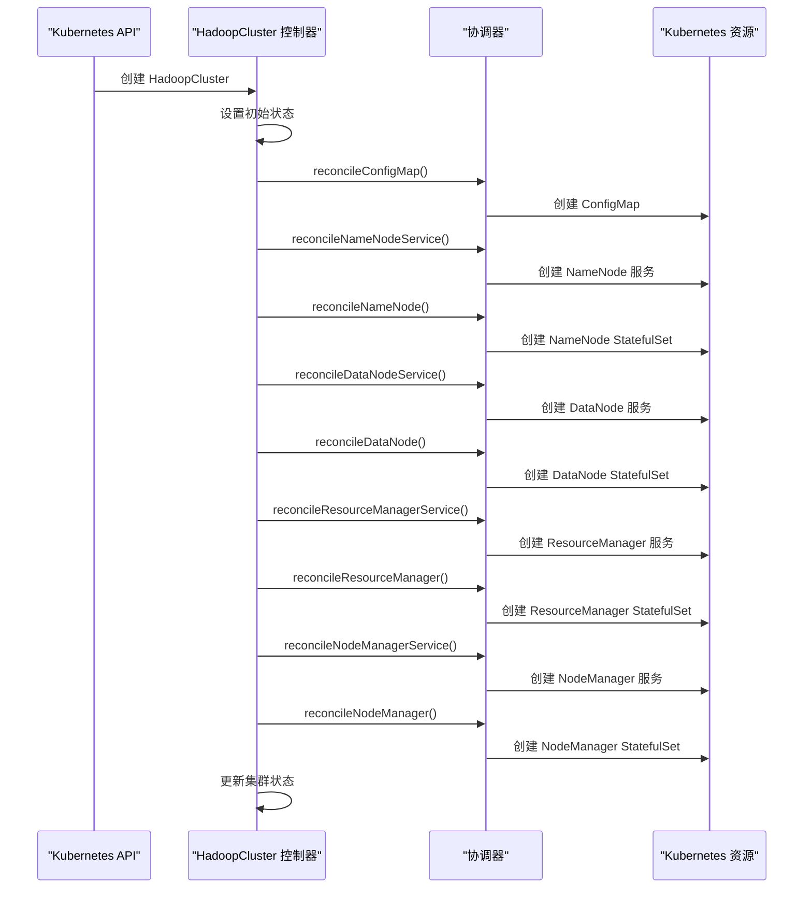
```mermaid
sequenceDiagram
participant Client as "Kubernetes API"
participant Controller as "HadoopCluster 控制器"
participant Reconciler as "协调器"
participant K8s as "Kubernetes 资源"
Client->>Controller : 创建 HadoopCluster
Controller->>Controller : 设置初始状态
Controller->>Reconciler : reconcileConfigMap()
Reconciler->>K8s : 创建 ConfigMap
Controller->>Reconciler : reconcileNameNodeService()
Reconciler->>K8s : 创建 NameNode 服务
Controller->>Reconciler : reconcileNameNode()
Reconciler->>K8s : 创建 NameNode StatefulSet
Controller->>Reconciler : reconcileDataNodeService()
Reconciler->>K8s : 创建 DataNode 服务
Controller->>Reconciler : reconcileDataNode()
Reconciler->>K8s : 创建 DataNode StatefulSet
Controller->>Reconciler : reconcileResourceManagerService()
Reconciler->>K8s : 创建 ResourceManager 服务
Controller->>Reconciler : reconcileResourceManager()
Reconciler->>K8s : 创建 ResourceManager StatefulSet
Controller->>Reconciler : reconcileNodeManagerService()
Reconciler->>K8s : 创建 NodeManager 服务
Controller->>Reconciler : reconcileNodeManager()
Reconciler->>K8s : 创建 NodeManager StatefulSet
Controller->>Controller : 更新集群状态
```

**图表来源**
- [hadoopcluster_controller.go:105-126](file://hadoop-operator/internal/controller/hadoopcluster_controller.go#L105-L126)
- [hadoopcluster_controller.go:176-227](file://hadoop-operator/internal/controller/hadoopcluster_controller.go#L176-L227)

**章节来源**
- [hadoopcluster_controller.go:41-145](file://hadoop-operator/internal/controller/hadoopcluster_controller.go#L41-L145)

## 架构概览

### 高可用架构设计

Hadoop Operator 实现了完整的高可用架构，支持 NameNode 和 ResourceManager 的双活模式：

```mermaid
graph TB
subgraph "NameNode 高可用"
NN1[NameNode-1<br/>Active]
NN2[NameNode-2<br/>Standby]
JN[JournalNode 集群<br/>3个副本]
ZK[ZooKeeper 集群<br/>3个副本]
FS[HDFS 文件系统]
NN1 < --> JN
NN2 < --> JN
NN1 < --> ZK
NN2 < --> ZK
JN --> FS
end
subgraph "ResourceManager 高可用"
RM1[ResourceManager-1<br/>Active]
RM2[ResourceManager-2<br/>Standby]
YARN[YARN 集群]
RM1 < --> ZK
RM2 < --> ZK
RM1 --> YARN
RM2 --> YARN
end
subgraph "客户端访问"
Client[客户端应用]
LB[负载均衡器]
end
Client --> LB
LB --> NN1
LB --> RM1
```

**图表来源**
- [hadoop_v1_hadoopcluster_ha.yaml:13-67](file://hadoop-operator/config/samples/hadoop_v1_hadoopcluster_ha.yaml#L13-L67)
- [configmap.go:95-130](file://hadoop-operator/internal/reconciler/configmap.go#L95-L130)

### 配置管理架构

配置管理系统负责生成和管理 Hadoop 的配置文件：

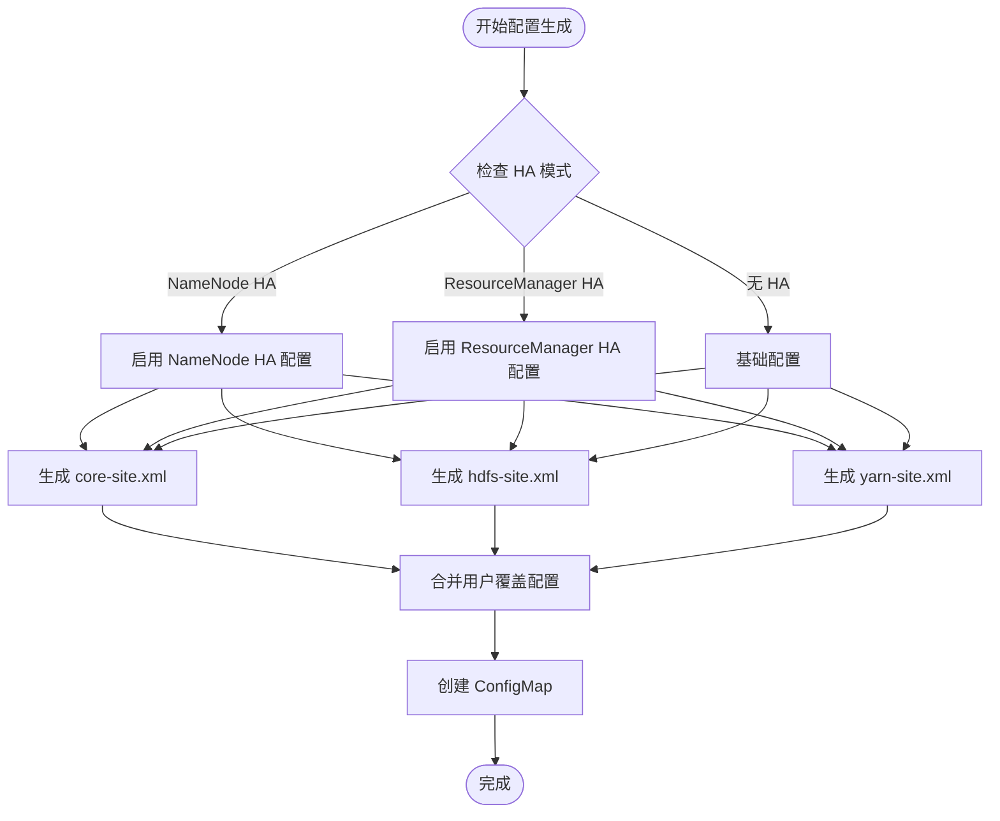
```mermaid
flowchart TD
Start([开始配置生成]) --> CheckHA{检查 HA 模式}
CheckHA --> |NameNode HA| NNHA[启用 NameNode HA 配置]
CheckHA --> |ResourceManager HA| RMHA[启用 ResourceManager HA 配置]
CheckHA --> |无 HA| NoHA[基础配置]
NNHA --> GenCore[生成 core-site.xml]
NNHA --> GenHDFS[生成 hdfs-site.xml]
NNHA --> GenYARN[生成 yarn-site.xml]
RMHA --> GenCore
RMHA --> GenHDFS
RMHA --> GenYARN
NoHA --> GenCore
NoHA --> GenHDFS
NoHA --> GenYARN
GenCore --> MergeOverrides[合并用户覆盖配置]
GenHDFS --> MergeOverrides
GenYARN --> MergeOverrides
MergeOverrides --> CreateCM[创建 ConfigMap]
CreateCM --> End([完成])
```

**图表来源**
- [configmap.go:70-209](file://hadoop-operator/internal/reconciler/configmap.go#L70-L209)

**章节来源**
- [configmap.go:70-209](file://hadoop-operator/internal/reconciler/configmap.go#L70-L209)

## 详细组件分析

### NameNode 高可用实现

NameNode 高可用是 Hadoop 集群的核心组件，通过共享存储和仲裁机制实现故障转移：

#### NameNode 配置

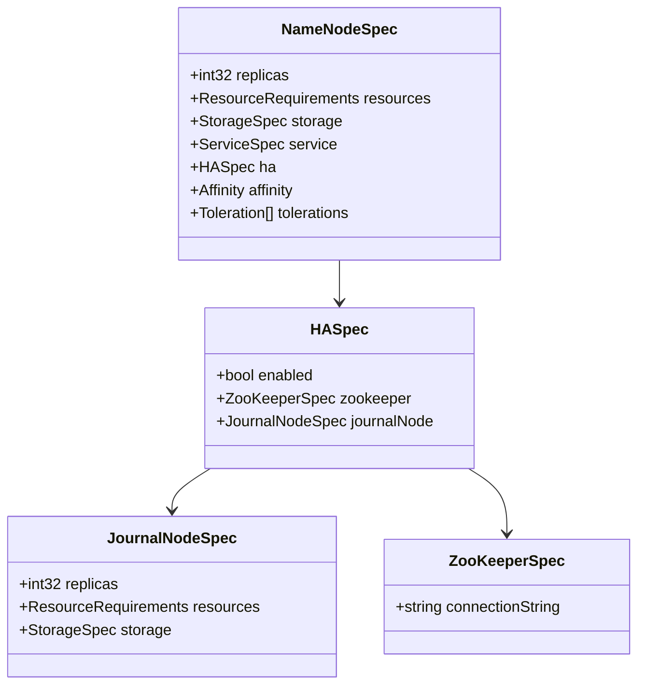
```mermaid
classDiagram
class NameNodeSpec {
+int32 replicas
+ResourceRequirements resources
+StorageSpec storage
+ServiceSpec service
+HASpec ha
+Affinity affinity
+Toleration[] tolerations
}
class HASpec {
+bool enabled
+ZooKeeperSpec zookeeper
+JournalNodeSpec journalNode
}
class JournalNodeSpec {
+int32 replicas
+ResourceRequirements resources
+StorageSpec storage
}
class ZooKeeperSpec {
+string connectionString
}
NameNodeSpec --> HASpec
HASpec --> JournalNodeSpec
HASpec --> ZooKeeperSpec
```

**图表来源**
- [hadoopcluster_types.go:69-120](file://hadoop-operator/api/v1/hadoopcluster_types.go#L69-L120)

#### JournalNode 集群

JournalNode 集群负责维护 NameNode 的编辑日志，确保两个 NameNode 之间的元数据同步：

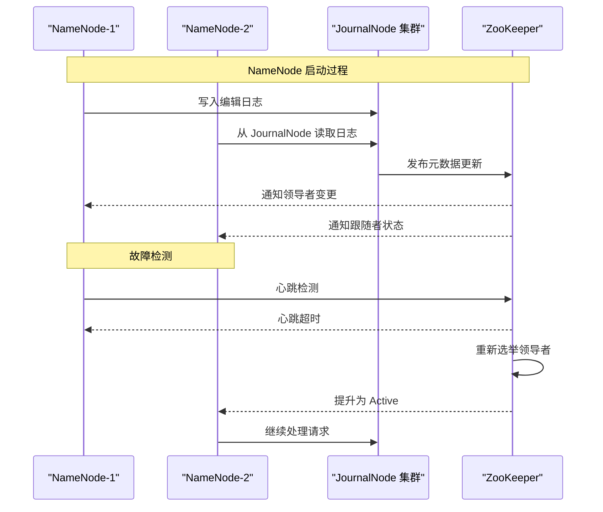
```mermaid
sequenceDiagram
participant NN1 as "NameNode-1"
participant NN2 as "NameNode-2"
participant JN as "JournalNode 集群"
participant ZK as "ZooKeeper"
Note over NN1,ZK : NameNode 启动过程
NN1->>JN : 写入编辑日志
NN2->>JN : 从 JournalNode 读取日志
JN->>ZK : 发布元数据更新
ZK-->>NN1 : 通知领导者变更
ZK-->>NN2 : 通知跟随者状态
Note over NN1,NN2 : 故障检测
NN1->>ZK : 心跳检测
ZK-->>NN1 : 心跳超时
ZK->>ZK : 重新选举领导者
ZK-->>NN2 : 提升为 Active
NN2->>JN : 继续处理请求
```

**图表来源**
- [ha.go:179-363](file://hadoop-operator/internal/reconciler/ha.go#L179-L363)
- [namenode.go:117-317](file://hadoop-operator/internal/reconciler/namenode.go#L117-L317)

#### NameNode 初始化脚本

NameNode 在启动时需要进行初始化，特别是在高可用模式下：

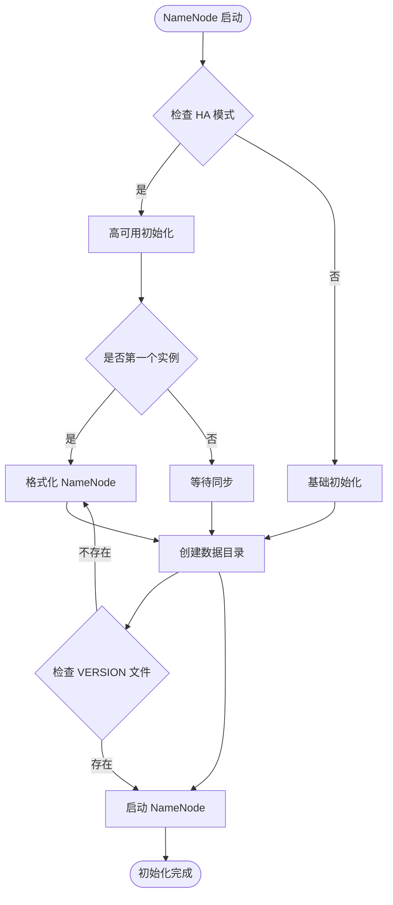
```mermaid
flowchart TD
Start([NameNode 启动]) --> CheckHA{检查 HA 模式}
CheckHA --> |是| HAInit[高可用初始化]
CheckHA --> |否| BasicInit[基础初始化]
HAInit --> FirstInstance{是否第一个实例}
FirstInstance --> |是| FormatNN[格式化 NameNode]
FirstInstance --> |否| WaitSync[等待同步]
FormatNN --> CreateDirs[创建数据目录]
WaitSync --> CreateDirs
BasicInit --> CreateDirs
CreateDirs --> CheckVersion{检查 VERSION 文件}
CheckVersion --> |不存在| FormatNN
CheckVersion --> |存在| StartNN[启动 NameNode]
CreateDirs --> StartNN
StartNN --> End([初始化完成])
```

**图表来源**
- [namenode.go:328-358](file://hadoop-operator/internal/reconciler/namenode.go#L328-L358)

**章节来源**
- [namenode.go:117-317](file://hadoop-operator/internal/reconciler/namenode.go#L117-L317)
- [ha.go:179-363](file://hadoop-operator/internal/reconciler/ha.go#L179-L363)

### ResourceManager 高可用实现

ResourceManager 高可用通过 ZooKeeper 实现领导者选举和状态同步：

#### ResourceManager 配置

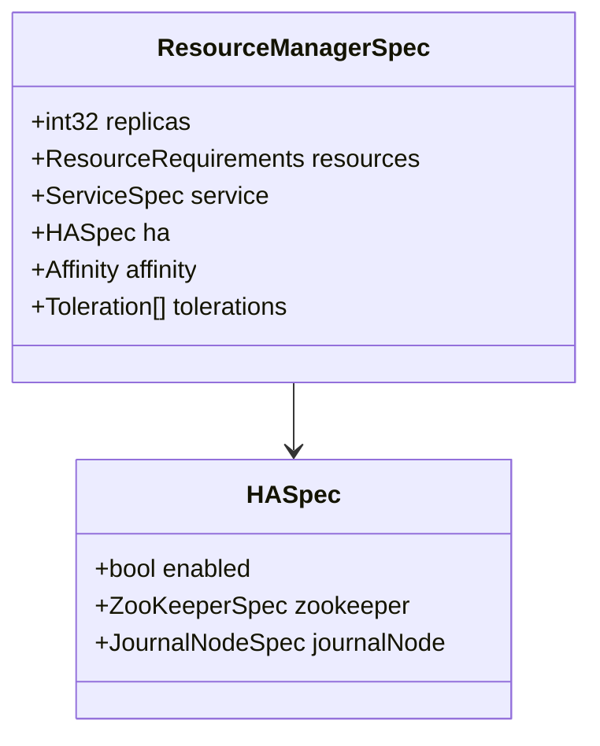
```mermaid
classDiagram
class ResourceManagerSpec {
+int32 replicas
+ResourceRequirements resources
+ServiceSpec service
+HASpec ha
+Affinity affinity
+Toleration[] tolerations
}
class HASpec {
+bool enabled
+ZooKeeperSpec zookeeper
+JournalNodeSpec journalNode
}
ResourceManagerSpec --> HASpec
```

**图表来源**
- [hadoopcluster_types.go:150-169](file://hadoop-operator/api/v1/hadoopcluster_types.go#L150-L169)

#### ResourceManager 状态管理

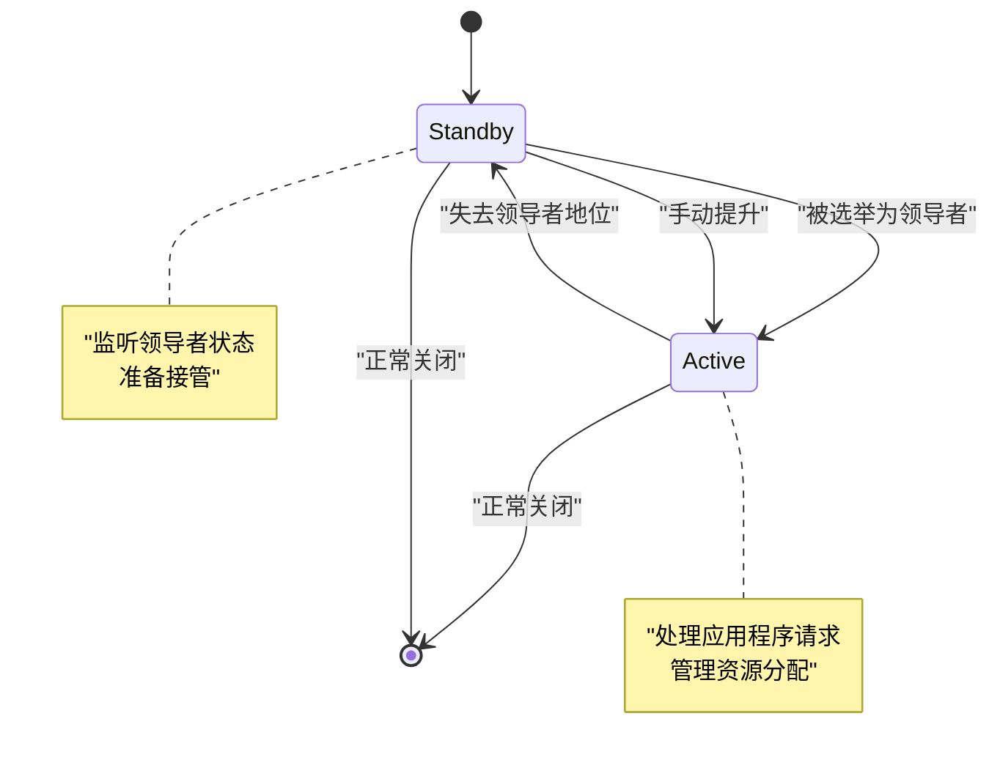
```mermaid
stateDiagram-v2
[*] --> Standby
Standby --> Active : "被选举为领导者"
Active --> Standby : "失去领导者地位"
Standby --> Active : "手动提升"
Active --> [*] : "正常关闭"
Standby --> [*] : "正常关闭"
note right of Active : "处理应用程序请求<br/>管理资源分配"
note right of Standby : "监听领导者状态<br/>准备接管"
```

**图表来源**
- [yarn.go:115-240](file://hadoop-operator/internal/reconciler/yarn.go#L115-L240)

**章节来源**
- [yarn.go:115-240](file://hadoop-operator/internal/reconciler/yarn.go#L115-L240)

### ZooKeeper 集群管理

ZooKeeper 在高可用架构中扮演着关键角色，提供分布式协调服务：

#### ZooKeeper 配置

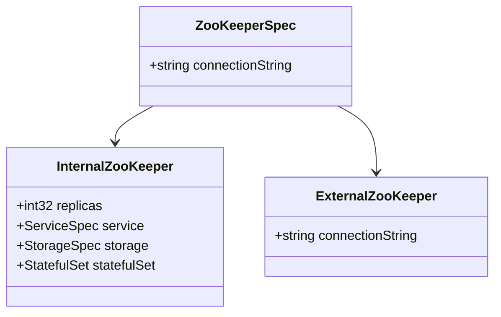
```mermaid
classDiagram
class ZooKeeperSpec {
+string connectionString
}
class InternalZooKeeper {
+int32 replicas
+ServiceSpec service
+StorageSpec storage
+StatefulSet statefulSet
}
class ExternalZooKeeper {
+string connectionString
}
ZooKeeperSpec --> InternalZooKeeper
ZooKeeperSpec --> ExternalZooKeeper
```

**图表来源**
- [hadoopcluster_types.go:104-109](file://hadoop-operator/api/v1/hadoopcluster_types.go#L104-L109)

#### ZooKeeper 服务发现

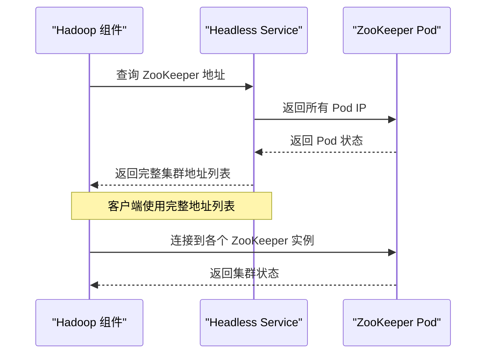
```mermaid
sequenceDiagram
participant Client as "Hadoop 组件"
participant SVC as "Headless Service"
participant Pod as "ZooKeeper Pod"
Client->>SVC : 查询 ZooKeeper 地址
SVC->>Pod : 返回所有 Pod IP
Pod-->>SVC : 返回 Pod 状态
SVC-->>Client : 返回完整集群地址列表
Note over Client,SVC : 客户端使用完整地址列表
Client->>Pod : 连接到各个 ZooKeeper 实例
Pod-->>Client : 返回集群状态
```

**图表来源**
- [ha.go:34-177](file://hadoop-operator/internal/reconciler/ha.go#L34-L177)

**章节来源**
- [ha.go:34-177](file://hadoop-operator/internal/reconciler/ha.go#L34-L177)

## 依赖关系分析

### 组件间依赖关系

Hadoop Operator 中各组件之间存在复杂的依赖关系：

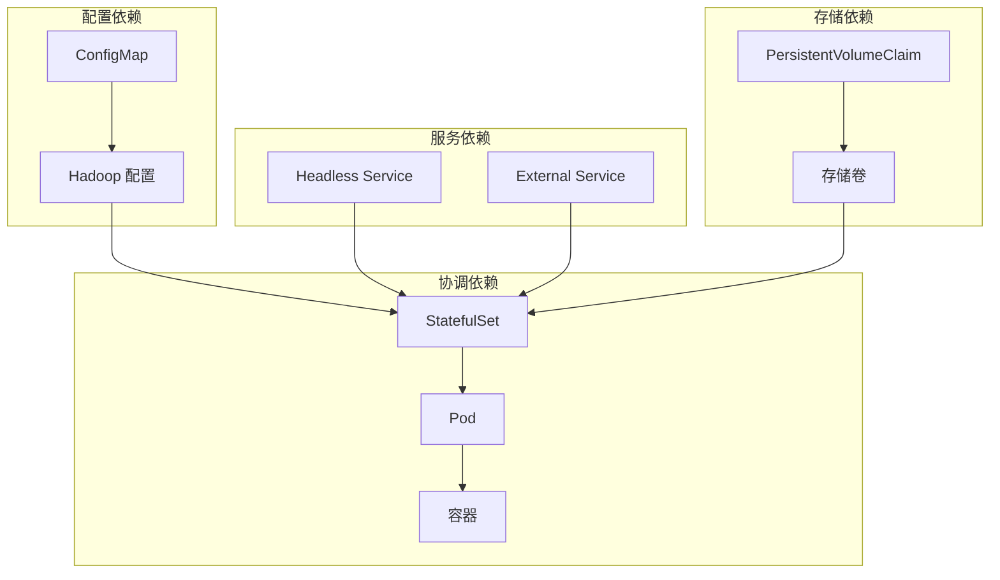
```mermaid
graph TB
subgraph "配置依赖"
ConfigMap[ConfigMap]
HadoopConfig[Hadoop 配置]
end
subgraph "服务依赖"
HeadlessSvc[Headless Service]
ExternalSvc[External Service]
end
subgraph "存储依赖"
PVC[PersistentVolumeClaim]
Storage[存储卷]
end
subgraph "协调依赖"
StatefulSet[StatefulSet]
Pod[Pod]
Container[容器]
end
ConfigMap --> HadoopConfig
HadoopConfig --> StatefulSet
HeadlessSvc --> StatefulSet
ExternalSvc --> StatefulSet
PVC --> Storage
Storage --> StatefulSet
StatefulSet --> Pod
Pod --> Container
```

**图表来源**
- [hadoopcluster_controller.go:105-126](file://hadoop-operator/internal/controller/hadoopcluster_controller.go#L105-L126)

### 数据流分析

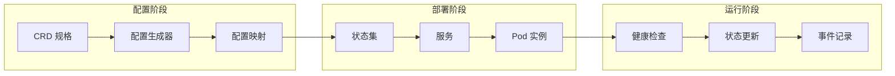
```mermaid
flowchart LR
subgraph "配置阶段"
Spec[CRD 规格]
ConfigGen[配置生成器]
ConfigMap[配置映射]
end
subgraph "部署阶段"
StatefulSet[状态集]
Service[服务]
Pod[Pod 实例]
end
subgraph "运行阶段"
HealthCheck[健康检查]
StatusUpdate[状态更新]
Event[事件记录]
end
Spec --> ConfigGen
ConfigGen --> ConfigMap
ConfigMap --> StatefulSet
StatefulSet --> Service
Service --> Pod
Pod --> HealthCheck
HealthCheck --> StatusUpdate
StatusUpdate --> Event
```

**图表来源**
- [hadoopcluster_controller.go:176-227](file://hadoop-operator/internal/controller/hadoopcluster_controller.go#L176-L227)

**章节来源**
- [hadoopcluster_controller.go:176-227](file://hadoop-operator/internal/controller/hadoopcluster_controller.go#L176-L227)

## 性能考虑

### 资源配置最佳实践

Hadoop 集群的性能很大程度上取决于合理的资源配置：

#### NameNode 资源配置

| 组件 | 最小内存 | 最小 CPU | 建议内存 | 建议 CPU |
|------|----------|----------|----------|----------|
| NameNode | 2Gi | 500m | 4Gi | 1000m |
| JournalNode | 1Gi | 250m | 2Gi | 500m |
| ResourceManager | 2Gi | 500m | 4Gi | 1000m |

#### 存储配置建议

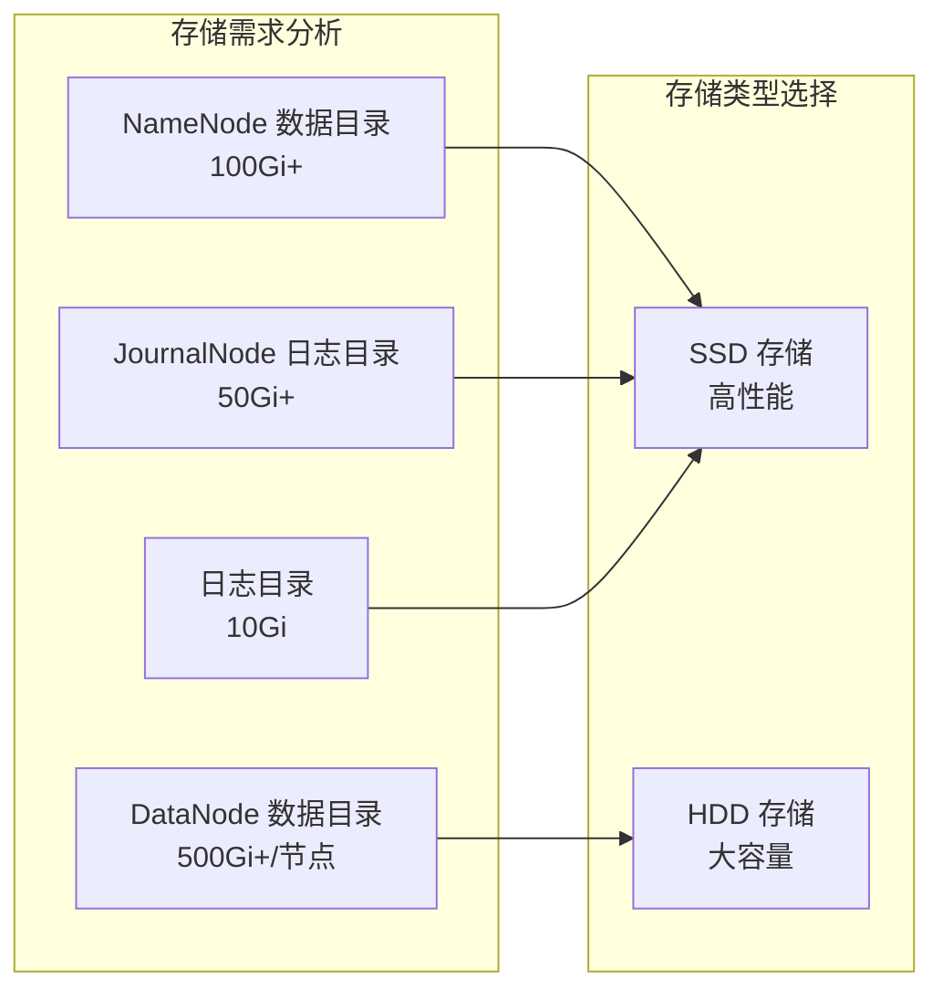
```mermaid
graph LR
subgraph "存储需求分析"
NN[NameNode 数据目录<br/>100Gi+]
JN[JournalNode 日志目录<br/>50Gi+]
DN[DataNode 数据目录<br/>500Gi+/节点]
Logs[日志目录<br/>10Gi]
end
subgraph "存储类型选择"
SSD[SSD 存储<br/>高性能]
HDD[HDD 存储<br/>大容量]
end
NN --> SSD
JN --> SSD
DN --> HDD
Logs --> SSD
```

### 网络拓扑优化

为了确保高可用架构的性能，建议采用以下网络拓扑：

1. **跨可用区部署**：NameNode 和 JournalNode 应分布在不同的可用区
2. **低延迟网络**：确保集群内部通信的低延迟
3. **带宽规划**：为数据传输预留充足的网络带宽

## 故障排查指南

### 常见故障场景

#### NameNode 启动失败

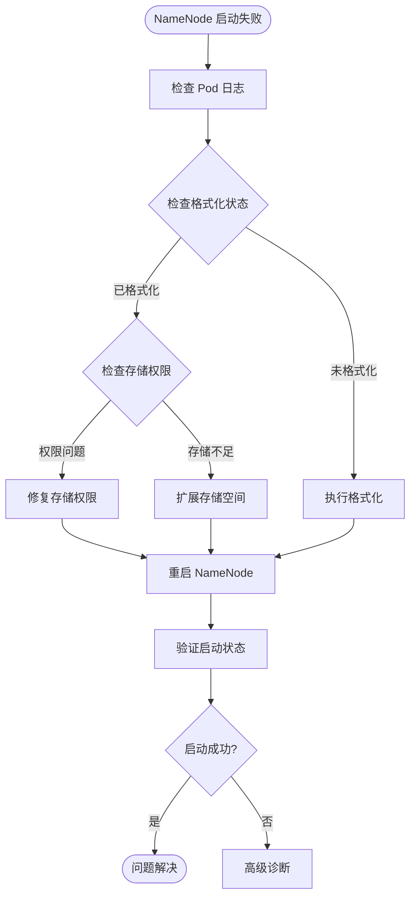
```mermaid
flowchart TD
Start([NameNode 启动失败]) --> CheckLogs[检查 Pod 日志]
CheckLogs --> CheckFormat{检查格式化状态}
CheckFormat --> |未格式化| FormatNN[执行格式化]
CheckFormat --> |已格式化| CheckStorage{检查存储权限}
CheckStorage --> |权限问题| FixPerm[修复存储权限]
CheckStorage --> |存储不足| ExpandStorage[扩展存储空间]
FixPerm --> RestartNN[重启 NameNode]
ExpandStorage --> RestartNN
FormatNN --> RestartNN
RestartNN --> Verify[验证启动状态]
Verify --> Success{启动成功?}
Success --> |是| End([问题解决])
Success --> |否| AdvancedDiag[高级诊断]
```

**图表来源**
- [namenode.go:328-358](file://hadoop-operator/internal/reconciler/namenode.go#L328-L358)

#### ResourceManager 故障转移

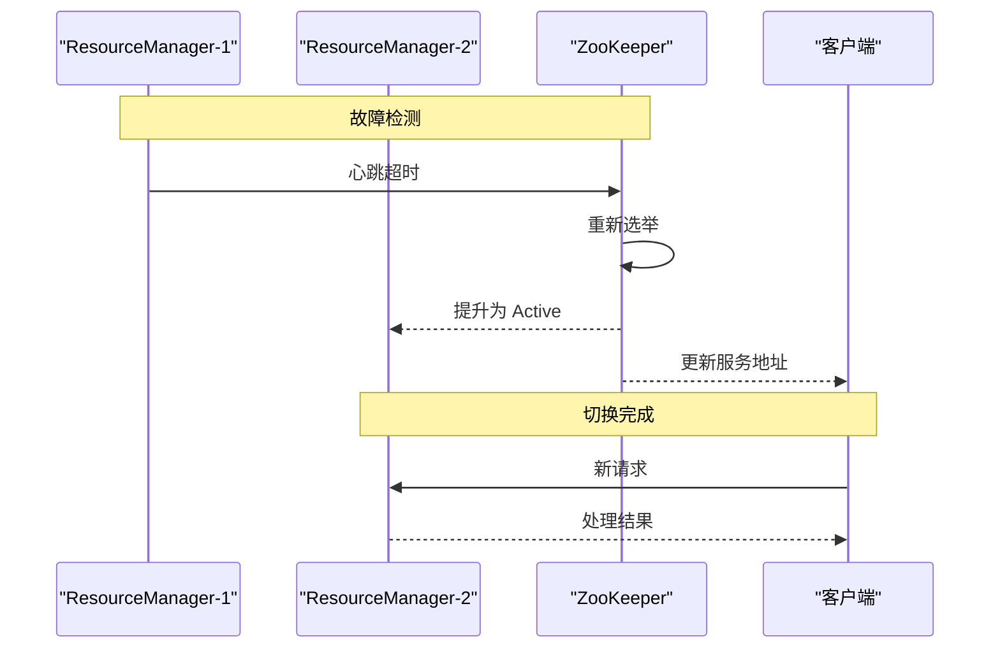
```mermaid
sequenceDiagram
participant RM1 as "ResourceManager-1"
participant RM2 as "ResourceManager-2"
participant ZK as "ZooKeeper"
participant Client as "客户端"
Note over RM1,ZK : 故障检测
RM1->>ZK : 心跳超时
ZK->>ZK : 重新选举
ZK-->>RM2 : 提升为 Active
ZK-->>Client : 更新服务地址
Note over RM2,Client : 切换完成
Client->>RM2 : 新请求
RM2-->>Client : 处理结果
```

**图表来源**
- [yarn.go:115-240](file://hadoop-operator/internal/reconciler/yarn.go#L115-L240)

#### JournalNode 集群问题

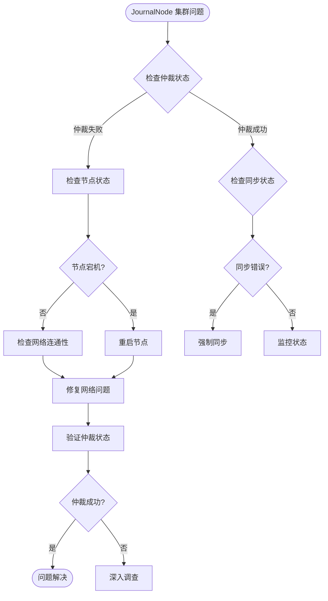
```mermaid
flowchart TD
Start([JournalNode 集群问题]) --> CheckQuorum{检查仲裁状态}
CheckQuorum --> |仲裁失败| CheckNodes[检查节点状态]
CheckQuorum --> |仲裁成功| CheckSync{检查同步状态}
CheckNodes --> NodeDown{节点宕机?}
NodeDown --> |是| RestartNode[重启节点]
NodeDown --> |否| CheckNetwork[检查网络连通性]
CheckNetwork --> FixNetwork[修复网络问题]
RestartNode --> FixNetwork
FixNetwork --> VerifyQuorum[验证仲裁状态]
CheckSync --> SyncError{同步错误?}
SyncError --> |是| ForceSync[强制同步]
SyncError --> |否| Monitor[监控状态]
VerifyQuorum --> Success{仲裁成功?}
Success --> |是| End([问题解决])
Success --> |否| Investigate[深入调查]
```

**图表来源**
- [ha.go:179-363](file://hadoop-operator/internal/reconciler/ha.go#L179-L363)

### 监控和告警配置

#### 健康检查配置

Hadoop Operator 为各个组件配置了完善的健康检查：

| 组件 | 就绪检查路径 | 存活检查路径 | 检查间隔 |
|------|-------------|-------------|----------|
| NameNode | /jmx | /jmx | 10秒 |
| ResourceManager | /ws/v1/cluster/info | /ws/v1/cluster/info | 10秒 |
| DataNode | /jmx | /jmx | 10秒 |
| NodeManager | /node | /node | 10秒 |
| JournalNode | / | / | 10秒 |

#### 关键指标监控

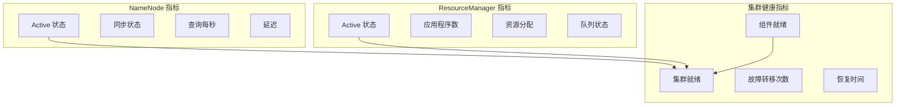
```mermaid
graph TB
subgraph "NameNode 指标"
NNActive[Active 状态]
NBSync[同步状态]
NNQPS[查询每秒]
NNLatency[延迟]
end
subgraph "ResourceManager 指标"
RMACTIVE[Active 状态]
RMApps[应用程序数]
RMResAlloc[资源分配]
RMQueue[队列状态]
end
subgraph "集群健康指标"
ClusterReady[集群就绪]
ComponentReady[组件就绪]
FailoverCount[故障转移次数]
RecoveryTime[恢复时间]
end
NNActive --> ClusterReady
RMACTIVE --> ClusterReady
ComponentReady --> ClusterReady
```

**章节来源**
- [namenode.go:235-254](file://hadoop-operator/internal/reconciler/namenode.go#L235-L254)
- [yarn.go:189-208](file://hadoop-operator/internal/reconciler/yarn.go#L189-L208)

## 结论

Hadoop Operator 提供了一个完整、可靠的高可用 Hadoop 集群管理解决方案。通过精心设计的架构和完善的配置管理，该 Operator 能够：

1. **简化部署复杂度**：通过 CRD 和自动化协调器，大幅简化了 Hadoop 集群的部署和管理
2. **确保高可用性**：实现了 NameNode 和 ResourceManager 的双活模式，提供了自动故障转移能力
3. **提供灵活配置**：支持丰富的配置选项，满足不同场景的需求
4. **增强可观测性**：集成了监控和告警机制，便于运维管理
5. **保证数据一致性**：通过 JournalNode 和 ZooKeeper 的协作，确保数据的一致性和可靠性

该解决方案特别适合需要在 Kubernetes 环境中运行大规模 Hadoop 集群的企业用户，能够显著提高集群的可用性和运维效率。