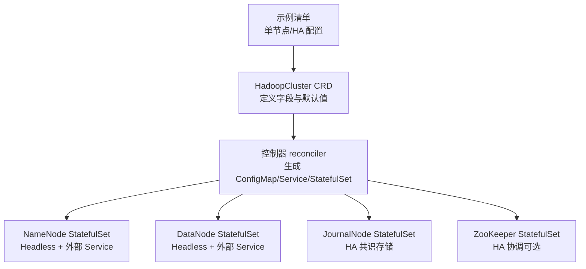
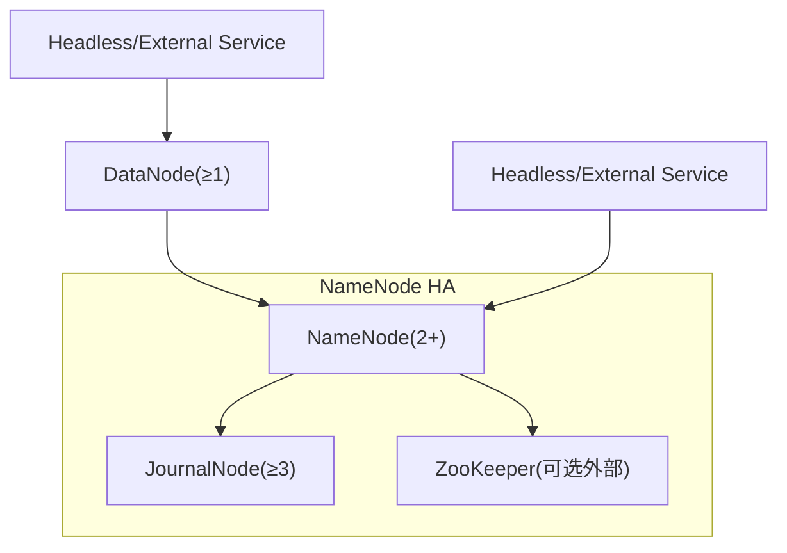
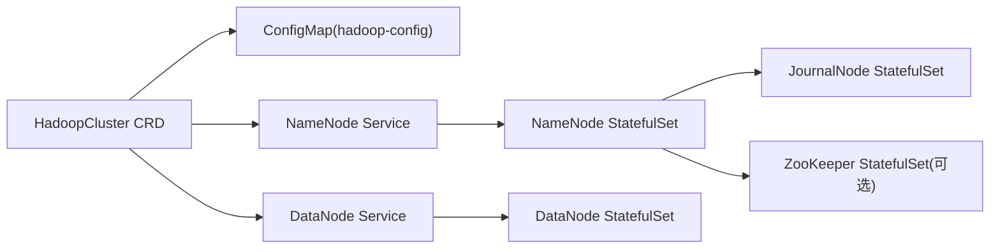

# HDFS 配置

<cite>
**本文引用的文件**
- [hadoopcluster_types.go](file://hadoop-operator/api/v1/hadoopcluster_types.go)
- [hadoop_v1_hadoopcluster.yaml](file://hadoop-operator/config/samples/hadoop_v1_hadoopcluster.yaml)
- [hadoop_v1_hadoopcluster_ha.yaml](file://hadoop-operator/config/samples/hadoop_v1_hadoopcluster_ha.yaml)
- [namenode.yaml](file://namenode.yaml)
- [datanode.yaml](file://datanode.yaml)
- [configmap.yaml](file://configmap.yaml)
- [hadoop.apache.org_hadoopclusters.yaml](file://hadoop-operator/config/crd/bases/hadoop.apache.org_hadoopclusters.yaml)
- [namenode.go](file://hadoop-operator/internal/reconciler/namenode.go)
- [datanode.go](file://hadoop-operator/internal/reconciler/datanode.go)
- [ha.go](file://hadoop-operator/internal/reconciler/ha.go)
- [README.md](file://hadoop-operator/README.md)
</cite>

## 目录
1. [简介](#简介)
2. [项目结构](#项目结构)
3. [核心组件](#核心组件)
4. [架构总览](#架构总览)
5. [详细组件分析](#详细组件分析)
6. [依赖关系分析](#依赖关系分析)
7. [性能与容量规划](#性能与容量规划)
8. [故障排查指南](#故障排查指南)
9. [结论](#结论)
10. [附录：配置示例与最佳实践](#附录配置示例与最佳实践)

## 简介
本文件面向使用 Hadoop Operator 在 Kubernetes 中部署与管理 HDFS 的用户，提供 HDFS 组件的配置参考与最佳实践。重点覆盖 NameNodeSpec 与 DataNodeSpec 的全部配置项，包括副本数、资源限制、存储配置、服务配置、亲和性配置；同时详解 NameNode 的高可用（HA）配置与 JournalNode 的配置选项，并给出单节点与多节点部署示例及约束说明。

## 项目结构
HDFS 配置由 CRD 定义与控制器逻辑共同决定：
- CRD 规范定义了 HadoopClusterSpec 的字段与默认行为
- 控制器根据 CRD 配置生成 ConfigMap、Service 与 StatefulSet 等资源
- 示例清单展示了典型单节点与 HA 场景的配置

图表来源
- [hadoop.apache.org_hadoopclusters.yaml:68-173](file://hadoop-operator/config/crd/bases/hadoop.apache.org_hadoopclusters.yaml#L68-L173)
- [namenode.go:35-114](file://hadoop-operator/internal/reconciler/namenode.go#L35-L114)
- [datanode.go:34-113](file://hadoop-operator/internal/reconciler/datanode.go#L34-L113)
- [ha.go:34-177](file://hadoop-operator/internal/reconciler/ha.go#L34-L177)

章节来源
- [hadoopcluster_types.go:24-46](file://hadoop-operator/api/v1/hadoopcluster_types.go#L24-L46)
- [hadoop.apache.org_hadoopclusters.yaml:42-173](file://hadoop-operator/config/crd/bases/hadoop.apache.org_hadoopclusters.yaml#L42-L173)

## 核心组件
- HadoopClusterSpec：顶层配置对象，包含镜像、HDFS、YARN、配置覆盖、安全、指标等字段
- HDFSSpec：HDFS 子配置，包含 NameNode 与 DataNode
- NameNodeSpec：NameNode 的副本、资源、存储、服务、HA、亲和性、容忍度
- DataNodeSpec：DataNode 的副本、资源、存储、服务、亲和性、容忍度
- HASpec/JournalNodeSpec：HA 开关、JournalNode 副本与存储、ZooKeeper 连接串
- StorageSpec/ServiceSpec：存储大小/类名/访问模式、服务类型/端口映射/注解
- HadoopConfig：core-site/hdfs-site/yarn-site/mapred-site/capacity-scheduler 的键值覆盖

章节来源
- [hadoopcluster_types.go:24-46](file://hadoop-operator/api/v1/hadoopcluster_types.go#L24-L46)
- [hadoopcluster_types.go:61-140](file://hadoop-operator/api/v1/hadoopcluster_types.go#L61-L140)
- [hadoopcluster_types.go:189-212](file://hadoop-operator/api/v1/hadoopcluster_types.go#L189-L212)
- [hadoopcluster_types.go:214-231](file://hadoop-operator/api/v1/hadoopcluster_types.go#L214-L231)

## 架构总览
NameNode HA 依赖 JournalNode 与 ZooKeeper（可选外部）进行元数据同步与领导者选举；DataNode 通过 NameNode 提供的数据块放置与复制策略工作。

图表来源
- [hadoopcluster_types.go:92-120](file://hadoop-operator/api/v1/hadoopcluster_types.go#L92-L120)
- [hadoop_v1_hadoopcluster_ha.yaml:12-55](file://hadoop-operator/config/samples/hadoop_v1_hadoopcluster_ha.yaml#L12-L55)
- [ha.go:34-177](file://hadoop-operator/internal/reconciler/ha.go#L34-L177)

## 详细组件分析

### NameNodeSpec 配置详解
- 副本数（replicas）
  - 单实例：默认 1
  - HA 模式：建议至少 2，控制器会确保 HA 下最小副本为 2
- 资源限制（resources）
  - requests/limits：CPU/内存请求与限制
  - 默认值：若未设置，控制器会填充默认资源
- 存储（storage）
  - size：PVC 大小
  - storageClassName：存储类名
  - accessMode：默认 ReadWriteOnce
- 服务（service）
  - type：ClusterIP/NodePort/LoadBalancer
  - nodePorts：rpc/web 端口映射
  - annotations：服务注解
- 高可用（ha）
  - enabled：启用 HA
  - journalNode：JournalNode 副本、资源、存储
  - zookeeper：外部 ZooKeeper 连接串（不提供则内部部署）
- 亲和性与容忍度（affinity/tolerations）
  - 用于调度控制，避免同主机部署或允许污点容忍

章节来源
- [hadoopcluster_types.go:69-90](file://hadoop-operator/api/v1/hadoopcluster_types.go#L69-L90)
- [hadoopcluster_types.go:92-120](file://hadoop-operator/api/v1/hadoopcluster_types.go#L92-L120)
- [hadoopcluster_types.go:189-212](file://hadoop-operator/api/v1/hadoopcluster_types.go#L189-L212)
- [namenode.go:117-170](file://hadoop-operator/internal/reconciler/namenode.go#L117-L170)
- [hadoop_v1_hadoopcluster_ha.yaml:12-55](file://hadoop-operator/config/samples/hadoop_v1_hadoopcluster_ha.yaml#L12-L55)

### DataNodeSpec 配置详解
- 副本数（replicas）
  - 默认 3，控制器会确保未设置时使用默认值
- 资源限制（resources）
  - requests/limits：CPU/内存请求与限制
- 存储（storage）
  - size/storageClassName/accessMode：PVC 配置
- 服务（service）
  - type/nodePorts/annotations：与 NameNode 类似
- 亲和性与容忍度（affinity/tolerations）

章节来源
- [hadoopcluster_types.go:122-140](file://hadoop-operator/api/v1/hadoopcluster_types.go#L122-L140)
- [hadoopcluster_types.go:189-212](file://hadoop-operator/api/v1/hadoopcluster_types.go#L189-L212)
- [datanode.go:115-160](file://hadoop-operator/internal/reconciler/datanode.go#L115-L160)
- [hadoop_v1_hadoopcluster.yaml:31-43](file://hadoop-operator/config/samples/hadoop_v1_hadoopcluster.yaml#L31-L43)

### JournalNode 配置详解
- 副本数（replicas）
  - 至少 3 以满足仲裁多数（quorum），不足时控制器强制设为 3
- 资源限制（resources）
  - requests/limits：CPU/内存请求与限制
- 存储（storage）
  - size/storageClassName：PVC 配置
- 端口与健康检查
  - RPC 端口 8485，Web 端口 8480，带就绪/存活探针

章节来源
- [hadoopcluster_types.go:111-120](file://hadoop-operator/api/v1/hadoopcluster_types.go#L111-L120)
- [ha.go:179-363](file://hadoop-operator/internal/reconciler/ha.go#L179-L363)

### ZooKeeper 配置（可选）
- 外部 ZooKeeper
  - 通过 connectionString 指定连接串，若提供则跳过内部部署
- 内部 ZooKeeper
  - Headless Service + 3 副本 StatefulSet，端口 2181/2888/3888
  - 默认 PVC 10Gi，ReadWriteOnce

章节来源
- [hadoopcluster_types.go:104-109](file://hadoop-operator/api/v1/hadoopcluster_types.go#L104-L109)
- [ha.go:34-177](file://hadoop-operator/internal/reconciler/ha.go#L34-L177)

### Hadoop 配置覆盖（HadoopConfig）
- coreSite/hdfsSite/yarnSite/mapredSite/capacityScheduler
  - 通过键值对覆盖对应配置文件中的属性

章节来源
- [hadoopcluster_types.go:214-231](file://hadoop-operator/api/v1/hadoopcluster_types.go#L214-L231)
- [configmap.yaml:6-227](file://configmap.yaml#L6-L227)

### 安全配置（SecuritySpec）
- Kerberos：启用、realm、KDC、AdminServer、KeytabSecret
- TLS：启用、证书 Secret
- Ranger：启用、AdminURL

章节来源
- [hadoopcluster_types.go:233-272](file://hadoop-operator/api/v1/hadoopcluster_types.go#L233-L272)

## 依赖关系分析
- NameNode 与 DataNode 通过 Service 进行通信
- HA 模式下，NameNode 依赖 JournalNode 与 ZooKeeper（可选外部）
- ConfigMap 提供 Hadoop 配置文件挂载给各组件
- 控制器根据 CRD 字段生成对应资源

图表来源
- [hadoop.apache.org_hadoopclusters.yaml:68-173](file://hadoop-operator/config/crd/bases/hadoop.apache.org_hadoopclusters.yaml#L68-L173)
- [configmap.yaml:4-227](file://configmap.yaml#L4-L227)
- [namenode.go:35-114](file://hadoop-operator/internal/reconciler/namenode.go#L35-L114)
- [datanode.go:34-113](file://hadoop-operator/internal/reconciler/datanode.go#L34-L113)
- [ha.go:34-177](file://hadoop-operator/internal/reconciler/ha.go#L34-L177)

章节来源
- [hadoop_operator/internal/reconciler/namenode.go:117-317](file://hadoop-operator/internal/reconciler/namenode.go#L117-L317)
- [hadoop_operator/internal/reconciler/datanode.go:115-321](file://hadoop-operator/internal/reconciler/datanode.go#L115-L321)
- [hadoop_operator/internal/reconciler/ha.go:179-363](file://hadoop-operator/internal/reconciler/ha.go#L179-L363)

## 性能与容量规划
- NameNode
  - 资源：根据数据规模与并发请求调整 CPU/内存
  - 存储：NameNode 元数据目录需要高性能持久化存储
  - HA：JournalNode 建议独立存储与网络隔离，避免单点
- DataNode
  - 存储：容量与 IOPS 需匹配业务写入与读取负载
  - 资源：根据副本数与并发任务调整内存与 CPU
- 网络
  - NameNode 与 DataNode 间高吞吐通信，建议低延迟网络
  - JournalNode 与 ZooKeeper 需稳定网络与低延迟
- 容量
  - 副本数与磁盘空间需平衡数据冗余与成本

[本节为通用指导，无需特定文件引用]

## 故障排查指南
- NameNode 启动失败
  - 检查 PVC 是否绑定成功、存储类是否可用
  - 查看 Pod 事件与日志，确认初始化脚本执行情况
- DataNode 无法连接 NameNode
  - 检查 NameNode Service 与端口可达性
  - 核对 core-site/hdfs-site 中 fs.defaultFS 与 NameNode 地址
- HA 不生效
  - 确认 JournalNode 副本数 ≥3，且网络连通
  - 若使用外部 ZooKeeper，确认连接串正确
- 镜像拉取失败
  - 检查镜像仓库凭据 Secret 是否存在且命名空间正确

章节来源
- [README.md:276-318](file://hadoop-operator/README.md#L276-L318)

## 结论
通过 Hadoop Operator 的 CRD 与控制器，HDFS 的部署与运维变得高度标准化与可声明化。合理配置 NameNodeSpec 与 DataNodeSpec 的副本、资源、存储与服务，结合 HA 的 JournalNode 与 ZooKeeper（可选），可在 Kubernetes 上构建稳定可靠的 HDFS 集群。建议在生产环境中遵循副本数、存储与网络隔离的最佳实践，并结合监控与告警体系保障集群健康。

[本节为总结，无需特定文件引用]

## 附录：配置示例与最佳实践

### 单节点 HDFS 配置要点
- NameNode
  - replicas: 1
  - resources: 设置合理的 requests/limits
  - storage: size 与 storageClassName 满足元数据与临时目录需求
  - service: type 可选 NodePort，配置 nodePorts 映射 rpc/web
- DataNode
  - replicas: 通常 3
  - resources: 与 NameNode 类似
  - storage: 容量与 IOPS 满足业务负载
- HadoopConfig
  - coreSite: fs.defaultFS 指向单实例 NameNode Service
  - hdfsSite: dfs.replication、dfs.permissions.enabled 等按需设置

章节来源
- [hadoop_v1_hadoopcluster.yaml:12-80](file://hadoop-operator/config/samples/hadoop_v1_hadoopcluster.yaml#L12-L80)
- [configmap.yaml:6-95](file://configmap.yaml#L6-L95)

### 多节点（HA）HDFS 配置要点
- NameNode
  - replicas: 2（HA）
  - ha.enabled: true
  - journalNode.replicas: ≥3
  - storage: 建议更大容量与更高性能
  - affinity: 使用反亲和避免同主机
- DataNode
  - replicas: ≥3
  - storage: 容量充足，IOPS 足够
- HadoopConfig
  - hdfsSite: dfs.replication、dfs.permissions.enabled、dfs.webhdfs.enabled 等
- Metrics
  - enabled: true，ServiceMonitor 可选开启

章节来源
- [hadoop_v1_hadoopcluster_ha.yaml:12-107](file://hadoop-operator/config/samples/hadoop_v1_hadoopcluster_ha.yaml#L12-L107)
- [hadoop_operator/internal/reconciler/ha.go:179-363](file://hadoop-operator/internal/reconciler/ha.go#L179-L363)

### 配置约束与默认行为
- NameNode
  - HA 模式下 replicas 最小为 2
  - 未设置 storage.size 时使用默认值
  - 未设置 service.type 时默认 NodePort
- DataNode
  - replicas 默认 3
  - storage.accessMode 默认 ReadWriteOnce
- JournalNode
  - replicas 最小 3（不足时强制）
  - 默认 PVC 20Gi
- ZooKeeper
  - 未提供外部连接串时内部部署 3 副本
  - 默认 PVC 10Gi

章节来源
- [namenode.go:117-170](file://hadoop-operator/internal/reconciler/namenode.go#L117-L170)
- [datanode.go:115-160](file://hadoop-operator/internal/reconciler/datanode.go#L115-L160)
- [ha.go:179-363](file://hadoop-operator/internal/reconciler/ha.go#L179-L363)
- [hadoop_operator/internal/reconciler/namenode.go:154-163](file://hadoop-operator/internal/reconciler/namenode.go#L154-L163)
- [hadoop_operator/internal/reconciler/datanode.go:147-156](file://hadoop-operator/internal/reconciler/datanode.go#L147-L156)

### 网络与安全配置建议
- 网络
  - NameNode 与 DataNode 之间高带宽低延迟
  - JournalNode 与 ZooKeeper 网络稳定
- 安全
  - 生产环境建议启用 Kerberos/TLS/Ranger
  - 严格控制 Service 暴露范围，优先使用 ClusterIP 并通过 Ingress/网关访问

章节来源
- [hadoopcluster_types.go:233-272](file://hadoop-operator/api/v1/hadoopcluster_types.go#L233-L272)
- [hadoop_v1_hadoopcluster_ha.yaml:12-107](file://hadoop-operator/config/samples/hadoop_v1_hadoopcluster_ha.yaml#L12-L107)