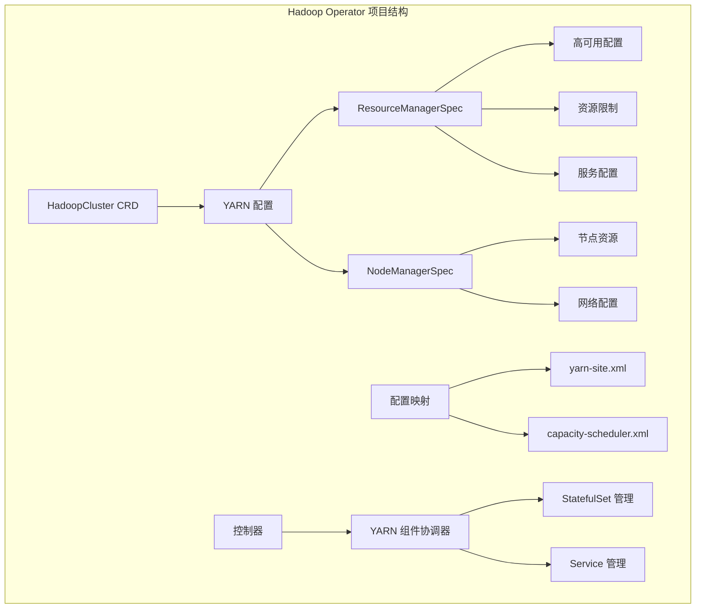
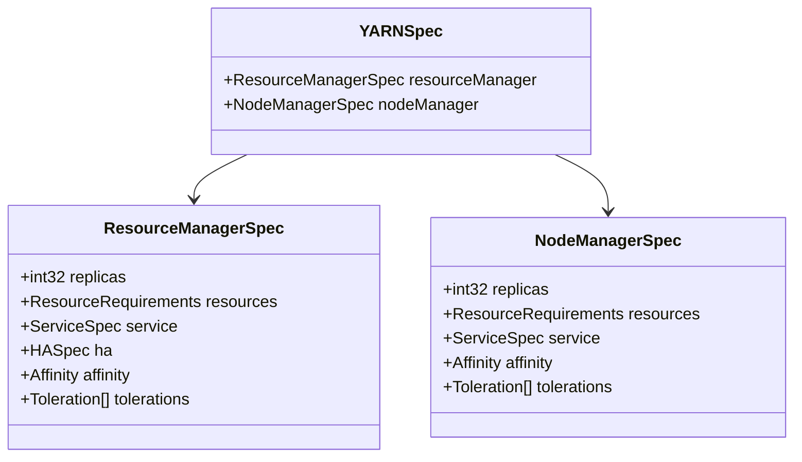
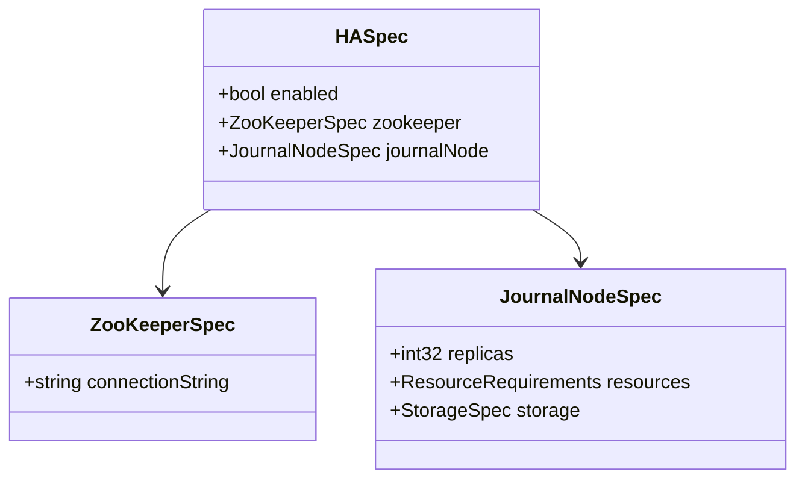
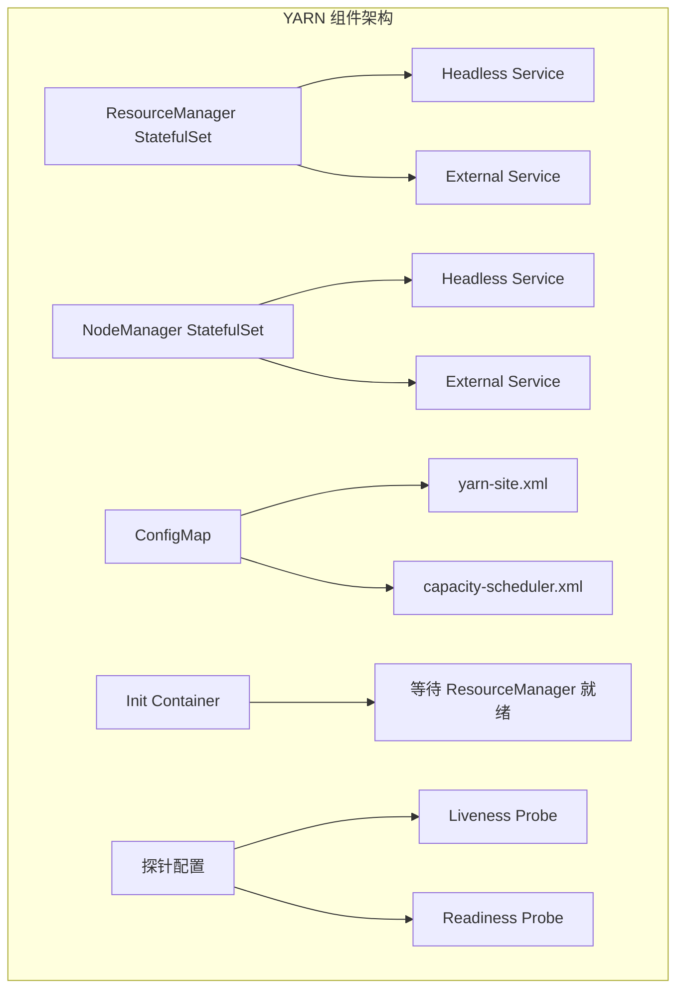
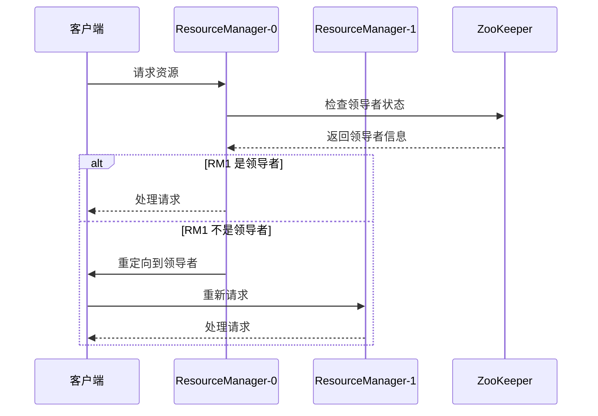
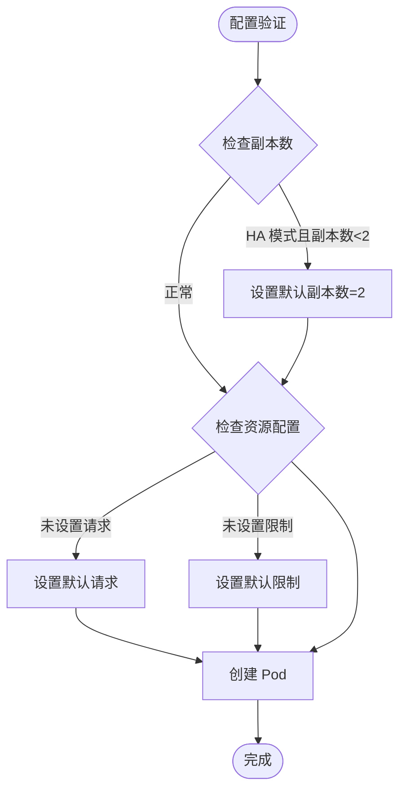
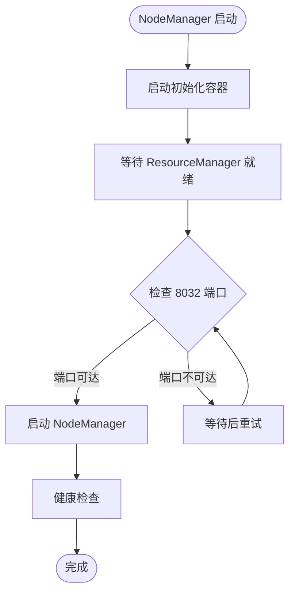
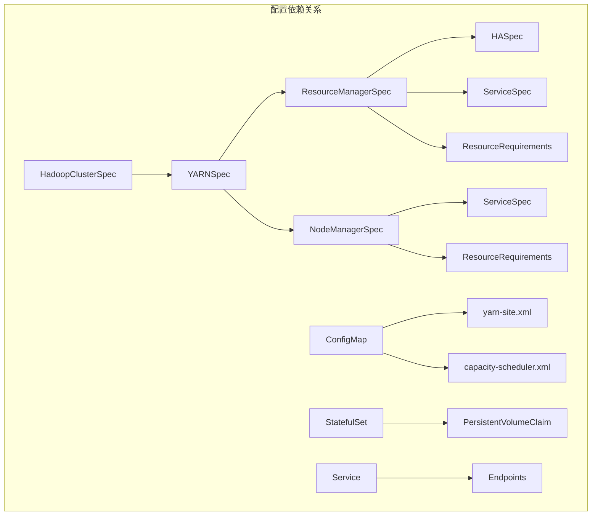
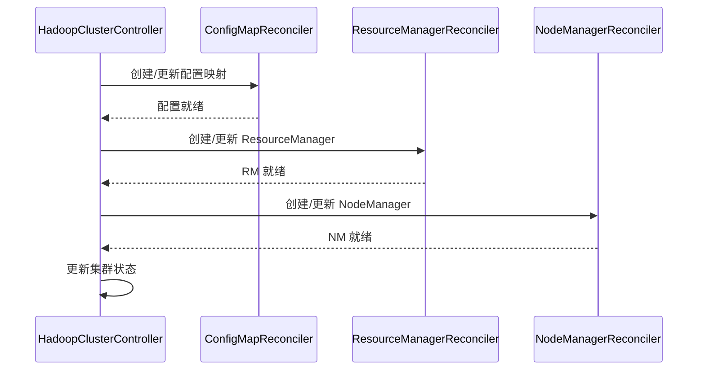
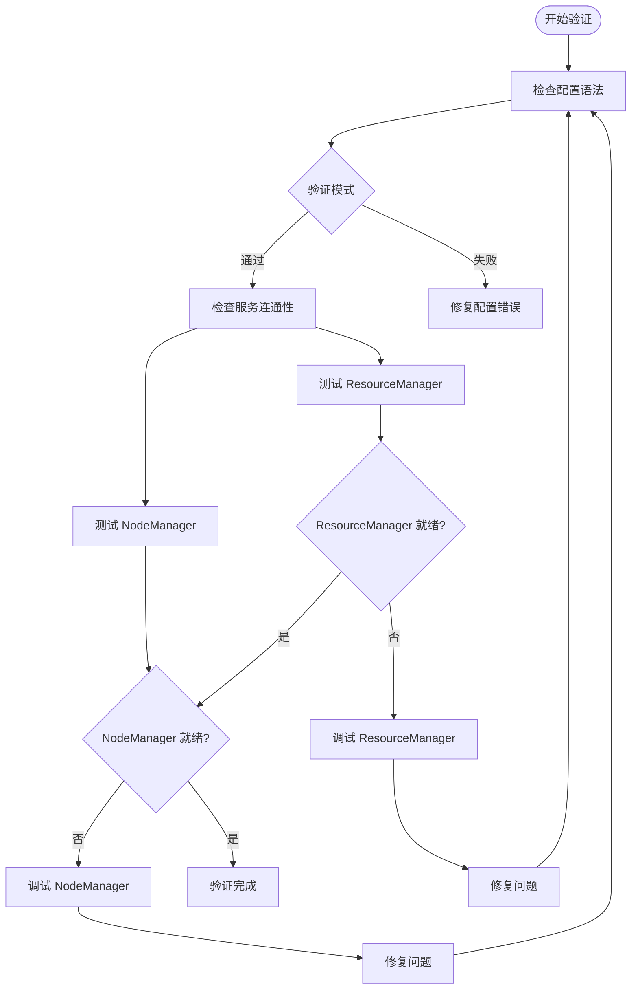

# YARN 配置

<cite>
**本文档引用的文件**
- [hadoopcluster_types.go](file://hadoop-operator/api/v1/hadoopcluster_types.go)
- [hadoopcluster_controller.go](file://hadoop-operator/internal/controller/hadoopcluster_controller.go)
- [yarn.go](file://hadoop-operator/internal/reconciler/yarn.go)
- [configmap.go](file://hadoop-operator/internal/reconciler/configmap.go)
- [hadoop_v1_hadoopcluster.yaml](file://hadoop-operator/config/samples/hadoop_v1_hadoopcluster.yaml)
- [hadoop_v1_hadoopcluster_ha.yaml](file://hadoop-operator/config/samples/hadoop_v1_hadoopcluster_ha.yaml)
- [offline-deployment.yaml](file://hadoop-operator/config/samples/offline-deployment.yaml)
- [resourcemanager.yaml](file://resourcemanager.yaml)
- [nodemanager.yaml](file://nodemanager.yaml)
- [configmap.yaml](file://configmap.yaml)
</cite>

## 目录
1. [简介](#简介)
2. [项目结构](#项目结构)
3. [核心组件](#核心组件)
4. [架构概览](#架构概览)
5. [详细组件分析](#详细组件分析)
6. [依赖关系分析](#依赖关系分析)
7. [性能考虑](#性能考虑)
8. [故障排除指南](#故障排除指南)
9. [结论](#结论)

## 简介

本文件为 YARN 组件配置的详细参考文档，基于 Apache Hadoop Operator 项目中的 YARN 实现。文档全面解释了 ResourceManagerSpec 和 NodeManagerSpec 的配置参数，包括副本数、资源限制、服务配置、高可用配置等。详细说明了 ResourceManager 的高可用模式配置和 NodeManager 的资源配置选项，并提供了完整的 YARN 配置示例，展示如何配置资源管理和节点管理。

## 项目结构

该项目采用 Kubernetes Operator 模式，通过自定义资源定义（CRD）来管理 Hadoop 集群。YARN 组件作为 HadoopCluster 资源的一部分进行配置和管理。

**图表来源**
- [hadoopcluster_types.go:142-187](file://hadoop-operator/api/v1/hadoopcluster_types.go#L142-L187)
- [yarn.go:34-447](file://hadoop-operator/internal/reconciler/yarn.go#L34-L447)

**章节来源**
- [hadoopcluster_types.go:24-46](file://hadoop-operator/api/v1/hadoopcluster_types.go#L24-L46)
- [hadoopcluster_controller.go:104-127](file://hadoop-operator/internal/controller/hadoopcluster_controller.go#L104-L127)

## 核心组件

### YARNSpec 结构

YARNSpec 是 YARN 组件的顶层配置对象，包含 ResourceManager 和 NodeManager 的配置。

**图表来源**
- [hadoopcluster_types.go:142-187](file://hadoop-operator/api/v1/hadoopcluster_types.go#L142-L187)

### 高可用配置

高可用配置支持 NameNode 和 ResourceManager 的 HA 模式，通过 ZooKeeper 进行协调。

**图表来源**
- [hadoopcluster_types.go:92-120](file://hadoop-operator/api/v1/hadoopcluster_types.go#L92-L120)

**章节来源**
- [hadoopcluster_types.go:142-187](file://hadoop-operator/api/v1/hadoopcluster_types.go#L142-L187)
- [hadoopcluster_types.go:92-120](file://hadoop-operator/api/v1/hadoopcluster_types.go#L92-L120)

## 架构概览

YARN 组件通过 Kubernetes StatefulSet 进行管理，每个组件都有对应的 Headless Service 和外部 Service。

**图表来源**
- [yarn.go:34-113](file://hadoop-operator/internal/reconciler/yarn.go#L34-L113)
- [yarn.go:242-310](file://hadoop-operator/internal/reconciler/yarn.go#L242-L310)

## 详细组件分析

### ResourceManager 配置

ResourceManager 是 YARN 集群的主控组件，负责集群资源的统一管理和调度。

#### 基本配置参数

| 参数 | 类型 | 描述 | 默认值 |
|------|------|------|--------|
| replicas | int32 | ResourceManager 副本数量 | 1 |
| resources.requests.cpu | string | CPU 请求量 | 500m |
| resources.requests.memory | string | 内存请求量 | 2Gi |
| resources.limits.cpu | string | CPU 限制量 | 1000m |
| resources.limits.memory | string | 内存限制量 | 4Gi |
| service.type | ServiceType | 服务类型 | NodePort |
| service.nodePorts.rpc | int32 | RPC 端口 | 自动分配 |
| service.nodePorts.web | int32 | Web UI 端口 | 自动分配 |

#### 高可用配置

ResourceManager 支持双活高可用模式，需要至少 2 个副本。

**图表来源**
- [yarn.go:115-240](file://hadoop-operator/internal/reconciler/yarn.go#L115-L240)
- [configmap.go:138-162](file://hadoop-operator/internal/reconciler/configmap.go#L138-L162)

#### 资源配置策略

**图表来源**
- [yarn.go:119-150](file://hadoop-operator/internal/reconciler/yarn.go#L119-L150)

**章节来源**
- [hadoopcluster_types.go:150-169](file://hadoop-operator/api/v1/hadoopcluster_types.go#L150-L169)
- [yarn.go:115-240](file://hadoop-operator/internal/reconciler/yarn.go#L115-L240)

### NodeManager 配置

NodeManager 是 YARN 集群的工作节点组件，负责单个节点上的资源管理和任务执行。

#### 基本配置参数

| 参数 | 类型 | 描述 | 默认值 |
|------|------|------|--------|
| replicas | int32 | NodeManager 副本数量 | 2 |
| resources.requests.cpu | string | CPU 请求量 | 500m |
| resources.requests.memory | string | 内存请求量 | 2Gi |
| resources.limits.cpu | string | CPU 限制量 | 1000m |
| resources.limits.memory | string | 内存限制量 | 4Gi |
| service.type | ServiceType | 服务类型 | NodePort |
| service.nodePorts.web | int32 | Web UI 端口 | 自动分配 |

#### 初始化容器配置

NodeManager 启动前需要等待 ResourceManager 就绪：

**图表来源**
- [yarn.go:312-447](file://hadoop-operator/internal/reconciler/yarn.go#L312-L447)

**章节来源**
- [hadoopcluster_types.go:171-187](file://hadoop-operator/api/v1/hadoopcluster_types.go#L171-L187)
- [yarn.go:312-447](file://hadoop-operator/internal/reconciler/yarn.go#L312-L447)

### 服务发现配置

YARN 组件使用 Kubernetes DNS 进行服务发现，自动解析服务地址。

#### 服务地址解析

| 组件 | 服务名称 | 地址格式 | 端口 |
|------|----------|----------|------|
| ResourceManager | `{cluster}-resourcemanager` | `{pod}.{cluster}-resourcemanager.{namespace}.svc.cluster.local` | 8032(RPC), 8088(Web) |
| NodeManager | `{cluster}-nodemanager` | `{pod}.{cluster}-nodemanager.{namespace}.svc.cluster.local` | 8042(Web) |

**章节来源**
- [yarn.go:345-346](file://hadoop-operator/internal/reconciler/yarn.go#L345-L346)
- [configmap.go:74-75](file://hadoop-operator/internal/reconciler/configmap.go#L74-L75)

## 依赖关系分析

### 组件间依赖

**图表来源**
- [hadoopcluster_types.go:24-46](file://hadoop-operator/api/v1/hadoopcluster_types.go#L24-L46)
- [yarn.go:34-447](file://hadoop-operator/internal/reconciler/yarn.go#L34-L447)

### 控制器协调流程

**图表来源**
- [hadoopcluster_controller.go:104-127](file://hadoop-operator/internal/controller/hadoopcluster_controller.go#L104-L127)

**章节来源**
- [hadoopcluster_controller.go:104-145](file://hadoop-operator/internal/controller/hadoopcluster_controller.go#L104-L145)

## 性能考虑

### 资源配置最佳实践

1. **CPU 配置**
   - 建议 ResourceManager 的 CPU 请求至少 500m，限制至少 1000m
   - NodeManager 的 CPU 请求至少 500m，限制至少 1000m
   - 根据集群规模调整副本数：生产环境建议至少 2 个 ResourceManager

2. **内存配置**
   - ResourceManager 内存请求建议 2Gi，限制 4Gi
   - NodeManager 内存请求建议 2Gi，限制 4Gi
   - 节点内存应根据工作负载类型进行调整

3. **存储配置**
   - 使用本地 SSD 存储以提高 I/O 性能
   - 配置适当的存储类和访问模式

### 调度器优化参数

| 参数 | 推荐值 | 说明 |
|------|--------|------|
| yarn.scheduler.maximum-allocation-mb | 8192 | 单任务最大内存 |
| yarn.scheduler.maximum-allocation-vcores | 4 | 单任务最大 CPU 核心数 |
| yarn.nodemanager.resource.memory-mb | 8192 | 节点总内存 |
| yarn.nodemanager.resource.cpu-vcores | 4 | 节点总 CPU 核心数 |

**章节来源**
- [hadoop_v1_hadoopcluster_ha.yaml:98-99](file://hadoop-operator/config/samples/hadoop_v1_hadoopcluster_ha.yaml#L98-L99)
- [offline-deployment.yaml:113-114](file://hadoop-operator/config/samples/offline-deployment.yaml#L113-L114)

## 故障排除指南

### 常见问题诊断

1. **ResourceManager 无法启动**
   - 检查 ZooKeeper 连接状态
   - 验证高可用配置是否正确
   - 查看 Pod 日志和事件

2. **NodeManager 注册失败**
   - 确认 ResourceManager 服务地址解析
   - 检查网络连通性和防火墙规则
   - 验证资源配额和限制

3. **服务发现问题**
   - 检查 DNS 解析是否正常
   - 验证 Service Selector 配置
   - 确认 Pod 标签匹配

### 配置验证

**图表来源**
- [hadoopcluster_controller.go:169-174](file://hadoop-operator/internal/controller/hadoopcluster_controller.go#L169-L174)

**章节来源**
- [hadoopcluster_controller.go:169-227](file://hadoop-operator/internal/controller/hadoopcluster_controller.go#L169-L227)

## 结论

本 YARN 配置参考文档详细介绍了基于 Kubernetes Operator 的 YARN 组件配置方法。通过 ResourceManagerSpec 和 NodeManagerSpec，用户可以灵活配置 YARN 集群的各项参数，包括副本数、资源限制、服务配置和高可用模式。文档提供了完整的配置示例和最佳实践建议，帮助用户构建稳定高效的 YARN 集群。

关键要点：
- ResourceManager 高可用模式需要至少 2 个副本
- NodeManager 启动前需要等待 ResourceManager 就绪
- 通过 ConfigMap 自动管理 Hadoop 配置文件
- 支持多种服务发现和服务暴露方式
- 提供完整的监控和故障排除机制