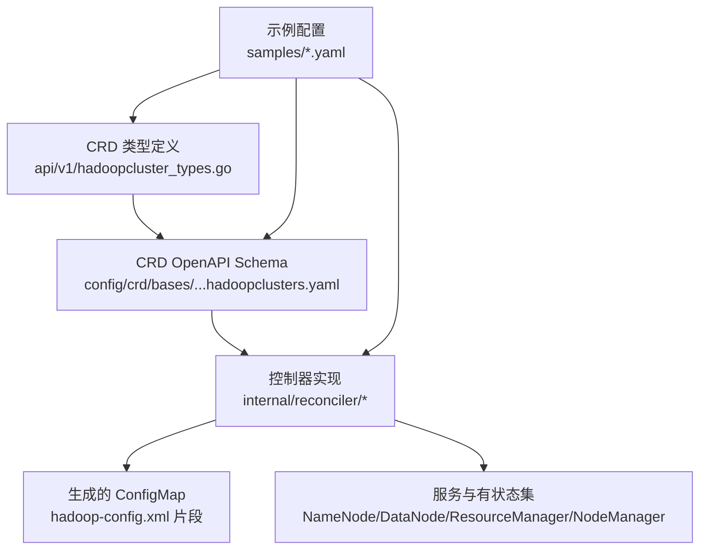
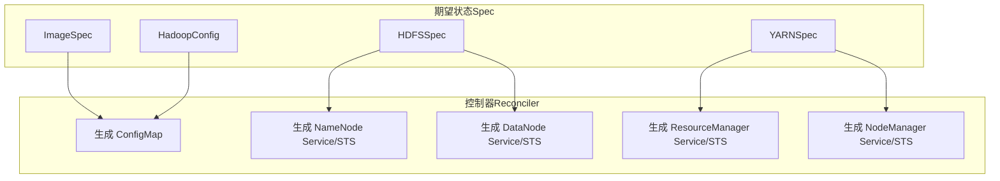
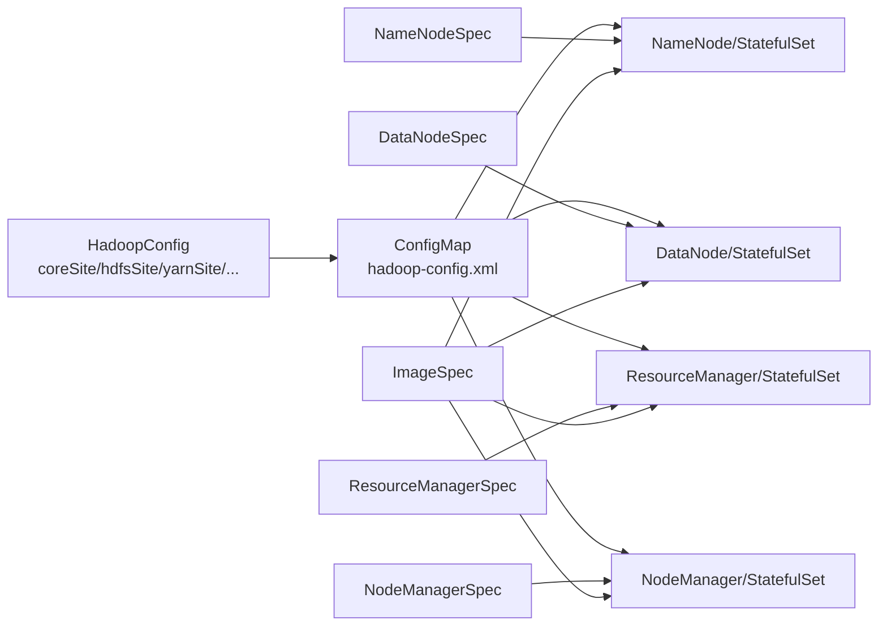

# 基础配置

<cite>
**本文引用的文件列表**
- [hadoopcluster_types.go](file://hadoop-operator/api/v1/hadoopcluster_types.go)
- [hadoop.apache.org_hadoopclusters.yaml](file://hadoop-operator/config/crd/bases/hadoop.apache.org_hadoopclusters.yaml)
- [hadoop_v1_hadoopcluster.yaml](file://hadoop-operator/config/samples/hadoop_v1_hadoopcluster.yaml)
- [hadoop_v1_hadoopcluster_ha.yaml](file://hadoop-operator/config/samples/hadoop_v1_hadoopcluster_ha.yaml)
- [offline-deployment.yaml](file://hadoop-operator/config/samples/offline-deployment.yaml)
- [configmap.go](file://hadoop-operator/internal/reconciler/configmap.go)
- [namenode.go](file://hadoop-operator/internal/reconciler/namenode.go)
- [datanode.go](file://hadoop-operator/internal/reconciler/datanode.go)
- [yarn.go](file://hadoop-operator/internal/reconciler/yarn.go)
- [README.md](file://hadoop-operator/README.md)
</cite>

## 目录
1. [简介](#简介)
2. [项目结构](#项目结构)
3. [核心组件](#核心组件)
4. [架构总览](#架构总览)
5. [详细组件分析](#详细组件分析)
6. [依赖关系分析](#依赖关系分析)
7. [性能与资源建议](#性能与资源建议)
8. [故障排查指南](#故障排查指南)
9. [结论](#结论)
10. [附录：配置示例与最佳实践](#附录配置示例与最佳实践)

## 简介
本章节聚焦于 HadoopCluster CRD 的“基础配置”部分，系统梳理 HadoopClusterSpec 中的关键字段，包括镜像配置（ImageSpec）、HDFS 配置（HDFSSpec）、YARN 配置（YARNSpec）、配置覆盖（HadoopConfig）等。我们将从数据类型、默认行为、可选性与使用场景出发，结合控制器实现细节，解释各字段之间的关系与约束，并提供常见问题与解决方案。

## 项目结构
- CRD 定义与类型：位于 api/v1 下的类型定义文件，描述 HadoopClusterSpec 及其子结构。
- CRD YAML：位于 config/crd/bases 下，描述 OpenAPI v3 Schema，明确字段类型与可选性。
- 示例配置：位于 config/samples 下，包含基础与高可用部署样例，以及离线部署样例。
- 控制器实现：位于 internal/reconciler 下，负责根据 Spec 生成 ConfigMap、Service 与 StatefulSet 等资源。

图表来源
- [hadoopcluster_types.go:24-46](file://hadoop-operator/api/v1/hadoopcluster_types.go#L24-L46)
- [hadoop.apache.org_hadoopclusters.yaml:42-313](file://hadoop-operator/config/crd/bases/hadoop.apache.org_hadoopclusters.yaml#L42-L313)

章节来源
- [hadoopcluster_types.go:1-418](file://hadoop-operator/api/v1/hadoopcluster_types.go#L1-L418)
- [hadoop.apache.org_hadoopclusters.yaml:1-411](file://hadoop-operator/config/crd/bases/hadoop.apache.org_hadoopclusters.yaml#L1-L411)

## 核心组件
本节对 HadoopClusterSpec 的核心字段进行逐项说明，涵盖数据类型、默认行为、可选性与典型用途。

- 镜像配置（ImageSpec）
  - 字段
    - repository：字符串，容器镜像仓库，默认为空；若为空，控制器会回退到默认值。
    - tag：字符串，镜像标签，默认为空；若为空，控制器会回退到默认值。
    - pullPolicy：枚举（k8s corev1.PullPolicy），镜像拉取策略，默认为空。
    - pullSecrets：数组（LocalObjectReference），拉取私有仓库所需的 Secret 引用，默认为空。
  - 默认行为与可选性
    - repository/tag 为空时，控制器会使用默认镜像仓库与标签。
    - pullPolicy 未设置时，遵循 Kubernetes 默认策略。
    - pullSecrets 仅在需要访问私有仓库时配置。
  - 使用场景
    - 生产环境使用固定 tag 并配合 pullSecrets。
    - 离线环境使用私有仓库并配置 pullSecrets。
  - 关键实现参考
    - 镜像拼接逻辑与默认值回退：[configmap.go:235-245](file://hadoop-operator/internal/reconciler/configmap.go#L235-L245)

- HDFS 配置（HDFSSpec）
  - 字段
    - nameNode：NameNodeSpec，包含副本数、资源、存储、服务、高可用、亲和性与容忍度。
    - dataNode：DataNodeSpec，包含副本数、资源、存储、服务、亲和性与容忍度。
  - 使用场景
    - 单实例或高可用（HA）NameNode。
    - 多副本 DataNode，按容量与副本需求配置存储大小与 StorageClass。
  - 关键实现参考
    - NameNode 服务与 StatefulSet 的默认端口、资源默认值与存储默认值：
      - [namenode.go:117-164](file://hadoop-operator/internal/reconciler/namenode.go#L117-L164)
    - DataNode 服务与 StatefulSet 的默认端口、资源默认值与存储默认值：
      - [datanode.go:115-157](file://hadoop-operator/internal/reconciler/datanode.go#L115-L157)

- YARN 配置（YARNSpec）
  - 字段
    - resourceManager：ResourceManagerSpec，包含副本数、资源、服务、高可用、亲和性与容忍度。
    - nodeManager：NodeManagerSpec，包含副本数、资源、服务、亲和性与容忍度。
  - 使用场景
    - 单实例或高可用（HA）ResourceManager。
    - 多副本 NodeManager，按计算负载与内存需求配置资源。
  - 关键实现参考
    - ResourceManager 服务与 StatefulSet 的默认端口、资源默认值与等待依赖：
      - [yarn.go:115-151](file://hadoop-operator/internal/reconciler/yarn.go#L115-L151)
    - NodeManager 服务与 StatefulSet 的默认端口、资源默认值与等待依赖：
      - [yarn.go:312-343](file://hadoop-operator/internal/reconciler/yarn.go#L312-L343)

- 配置覆盖（HadoopConfig）
  - 字段
    - coreSite：映射，覆盖 core-site.xml。
    - hdfsSite：映射，覆盖 hdfs-site.xml。
    - yarnSite：映射，覆盖 yarn-site.xml。
    - mapredSite：映射，覆盖 mapred-site.xml。
    - capacityScheduler：映射，覆盖 capacity-scheduler.xml。
  - 使用场景
    - 覆盖 fs.defaultFS、副本数、WebHDFS、YARN 调度器参数等。
  - 关键实现参考
    - ConfigMap 生成逻辑与用户覆盖合并：
      - [configmap.go:70-209](file://hadoop-operator/internal/reconciler/configmap.go#L70-L209)

章节来源
- [hadoopcluster_types.go:24-46](file://hadoop-operator/api/v1/hadoopcluster_types.go#L24-L46)
- [hadoopcluster_types.go:48-59](file://hadoop-operator/api/v1/hadoopcluster_types.go#L48-L59)
- [hadoopcluster_types.go:61-67](file://hadoop-operator/api/v1/hadoopcluster_types.go#L61-L67)
- [hadoopcluster_types.go:142-148](file://hadoop-operator/api/v1/hadoopcluster_types.go#L142-L148)
- [hadoopcluster_types.go:214-231](file://hadoop-operator/api/v1/hadoopcluster_types.go#L214-L231)
- [configmap.go:70-209](file://hadoop-operator/internal/reconciler/configmap.go#L70-L209)

## 架构总览
下图展示了 HadoopClusterSpec 与控制器生成资源的关系：Spec 作为“期望状态”，控制器根据 Spec 生成 ConfigMap、Service 与 StatefulSet 等资源。

图表来源
- [hadoopcluster_types.go:24-46](file://hadoop-operator/api/v1/hadoopcluster_types.go#L24-L46)
- [configmap.go:43-68](file://hadoop-operator/internal/reconciler/configmap.go#L43-L68)
- [namenode.go:116-164](file://hadoop-operator/internal/reconciler/namenode.go#L116-L164)
- [datanode.go:115-157](file://hadoop-operator/internal/reconciler/datanode.go#L115-L157)
- [yarn.go:115-151](file://hadoop-operator/internal/reconciler/yarn.go#L115-L151)

## 详细组件分析

### 镜像配置（ImageSpec）
- 数据类型与默认行为
  - repository：字符串；为空时，控制器回退到默认值。
  - tag：字符串；为空时，控制器回退到默认值。
  - pullPolicy：枚举；为空时采用 Kubernetes 默认策略。
  - pullSecrets：数组；仅在需要访问私有仓库时配置。
- 关键实现
  - 镜像拼接与默认值回退：[configmap.go:235-245](file://hadoop-operator/internal/reconciler/configmap.go#L235-L245)
- 使用建议
  - 生产环境建议显式指定 repository 与 tag，避免漂移。
  - 私有仓库需配置 pullSecrets，并在 CR 中声明。

章节来源
- [hadoopcluster_types.go:48-59](file://hadoop-operator/api/v1/hadoopcluster_types.go#L48-L59)
- [configmap.go:235-245](file://hadoop-operator/internal/reconciler/configmap.go#L235-L245)

### HDFS 配置（HDFSSpec）
- NameNodeSpec
  - replicas：整数；若为 0，控制器默认为 1；若启用 HA，则至少为 2。
  - resources：资源请求/限制；若为空，控制器设置默认值。
  - storage：存储大小、StorageClass、访问模式；若为空，控制器设置默认值。
  - service：服务类型、NodePort 映射、注解；若为空，控制器设置默认类型。
  - ha：高可用开关、JournalNode、ZooKeeper（可选）。
  - affinity/tolerations：调度约束。
- DataNodeSpec
  - replicas：整数；若为 0，控制器默认为 3。
  - resources/storage/service/affinity/tolerations：同上。
- 关键实现
  - NameNode 默认值与 HA 逻辑：[namenode.go:117-164](file://hadoop-operator/internal/reconciler/namenode.go#L117-L164)
  - DataNode 默认值与依赖等待：[datanode.go:115-157](file://hadoop-operator/internal/reconciler/datanode.go#L115-L157)
- 使用建议
  - HA 模式下，NameNode 至少 2 个副本，JournalNode 至少 3 个副本以形成法定人数。
  - DataNode 副本数应与集群规模与数据量匹配，合理设置存储大小与 StorageClass。

章节来源
- [hadoopcluster_types.go:69-90](file://hadoop-operator/api/v1/hadoopcluster_types.go#L69-L90)
- [hadoopcluster_types.go:122-140](file://hadoop-operator/api/v1/hadoopcluster_types.go#L122-L140)
- [namenode.go:117-164](file://hadoop-operator/internal/reconciler/namenode.go#L117-L164)
- [datanode.go:115-157](file://hadoop-operator/internal/reconciler/datanode.go#L115-L157)

### YARN 配置（YARNSpec）
- ResourceManagerSpec
  - replicas：整数；若为 0，控制器默认为 1；若启用 HA，则至少为 2。
  - resources：资源请求/限制；若为空，控制器设置默认值。
  - service：服务类型、NodePort 映射、注解；若为空，控制器设置默认类型。
  - ha：高可用开关。
  - affinity/tolerations：调度约束。
- NodeManagerSpec
  - replicas：整数；若为 0，控制器默认为 2。
  - resources：资源请求/限制；若为空，控制器设置默认值。
  - service：服务类型、NodePort 映射、注解；若为空，控制器设置默认类型。
  - affinity/tolerations：调度约束。
- 关键实现
  - ResourceManager 默认值与 HA 逻辑：[yarn.go:115-151](file://hadoop-operator/internal/reconciler/yarn.go#L115-L151)
  - NodeManager 默认值与依赖等待：[yarn.go:312-343](file://hadoop-operator/internal/reconciler/yarn.go#L312-L343)
- 使用建议
  - HA 模式下，ResourceManager 至少 2 个副本。
  - NodeManager 副本数与计算节点数量匹配，合理设置资源上限。

章节来源
- [hadoopcluster_types.go:150-169](file://hadoop-operator/api/v1/hadoopcluster_types.go#L150-L169)
- [hadoopcluster_types.go:171-187](file://hadoop-operator/api/v1/hadoopcluster_types.go#L171-L187)
- [yarn.go:115-151](file://hadoop-operator/internal/reconciler/yarn.go#L115-L151)
- [yarn.go:312-343](file://hadoop-operator/internal/reconciler/yarn.go#L312-L343)

### 配置覆盖（HadoopConfig）
- 字段说明
  - coreSite：覆盖 core-site.xml。
  - hdfsSite：覆盖 hdfs-site.xml。
  - yarnSite：覆盖 yarn-site.xml。
  - mapredSite：覆盖 mapred-site.xml。
  - capacityScheduler：覆盖 capacity-scheduler.xml。
- 关键实现
  - ConfigMap 生成与用户覆盖合并：[configmap.go:70-209](file://hadoop-operator/internal/reconciler/configmap.go#L70-L209)
- 使用建议
  - 优先通过 CRD 的 HadoopConfig 字段进行覆盖，避免直接修改生成的 ConfigMap。
  - HA 模式下，注意 fs.defaultFS、ZK 连接串等关键参数的正确性。

章节来源
- [hadoopcluster_types.go:214-231](file://hadoop-operator/api/v1/hadoopcluster_types.go#L214-L231)
- [configmap.go:70-209](file://hadoop-operator/internal/reconciler/configmap.go#L70-L209)

## 依赖关系分析
- 字段间依赖
  - HA 模式依赖 JournalNode 与 ZooKeeper（或外部 ZooKeeper）。
  - DataNode/NodeManager 依赖 NameNode/ResourceManager 的可达性。
  - ConfigMap 由 HadoopConfig 与服务名动态生成。
- 控制器生成资源的依赖链
  - ConfigMap -> NameNode/DataNode/ResourceManager/NodeManager（容器挂载 ConfigMap）
  - Service -> StatefulSet（Headless 与外部服务）

图表来源
- [configmap.go:43-68](file://hadoop-operator/internal/reconciler/configmap.go#L43-L68)
- [namenode.go:116-164](file://hadoop-operator/internal/reconciler/namenode.go#L116-L164)
- [datanode.go:115-157](file://hadoop-operator/internal/reconciler/datanode.go#L115-L157)
- [yarn.go:115-151](file://hadoop-operator/internal/reconciler/yarn.go#L115-L151)

章节来源
- [hadoopcluster_types.go:24-46](file://hadoop-operator/api/v1/hadoopcluster_types.go#L24-L46)
- [configmap.go:70-209](file://hadoop-operator/internal/reconciler/configmap.go#L70-L209)

## 性能与资源建议
- 资源请求/限制
  - NameNode/DataNode/ResourceManager/NodeManager 若未显式设置，控制器会设置默认值。建议根据集群规模与工作负载显式配置，避免默认值不足导致性能瓶颈。
- 存储
  - NameNode/DataNode 的存储大小与 StorageClass 应满足数据增长预期，合理选择访问模式（如 ReadWriteOnce）。
- 网络与服务
  - 服务类型（ClusterIP/NodePort/LoadBalancer）与 NodePort 映射应结合访问需求配置。
- HA 与亲和性
  - HA 模式下，NameNode/ResourceManager 至少 2 个副本；通过亲和性避免同一副本调度到同一节点。

章节来源
- [namenode.go:139-164](file://hadoop-operator/internal/reconciler/namenode.go#L139-L164)
- [datanode.go:132-157](file://hadoop-operator/internal/reconciler/datanode.go#L132-L157)
- [yarn.go:137-151](file://hadoop-operator/internal/reconciler/yarn.go#L137-L151)

## 故障排查指南
- 镜像拉取失败
  - 检查镜像仓库是否可达、pullSecrets 是否正确配置。
  - 参考离线部署示例中 Secret 的创建方式。
- NameNode 初始化失败
  - 检查 PVC 是否绑定成功，存储大小与 StorageClass 是否正确。
  - HA 模式下检查 JournalNode 与 ZooKeeper 的可用性。
- DataNode 无法连接 NameNode
  - 检查 NameNode 服务与端口（RPC 9000），确认网络连通性。
  - 检查 ConfigMap 中 fs.defaultFS 是否正确。
- ResourceManager/NodeManager 无法启动
  - 检查 ResourceManager 服务与端口（RPC 8032），确认网络连通性。
  - 检查 ConfigMap 中 yarn.resourcemanager.hostname 等参数。

章节来源
- [README.md:276-318](file://hadoop-operator/README.md#L276-L318)
- [offline-deployment.yaml:8-15](file://hadoop-operator/config/samples/offline-deployment.yaml#L8-L15)
- [configmap.go:70-209](file://hadoop-operator/internal/reconciler/configmap.go#L70-L209)

## 结论
HadoopClusterSpec 的基础配置围绕“镜像、HDFS、YARN、配置覆盖”四大块展开。通过 CRD 的强类型定义与控制器的默认值回退机制，用户可以以声明式的方式快速部署 Hadoop 集群，并在需要时通过 HadoopConfig 进行精细化调整。HA 模式、存储与网络配置是影响稳定性与性能的关键因素，建议结合实际业务规模与资源情况进行合理规划。

## 附录：配置示例与最佳实践
- 基础部署示例
  - 参考：[hadoop_v1_hadoopcluster.yaml:1-80](file://hadoop-operator/config/samples/hadoop_v1_hadoopcluster.yaml#L1-L80)
- 高可用部署示例
  - 参考：[hadoop_v1_hadoopcluster_ha.yaml:1-107](file://hadoop-operator/config/samples/hadoop_v1_hadoopcluster_ha.yaml#L1-L107)
- 离线部署示例
  - 参考：[offline-deployment.yaml:1-135](file://hadoop-operator/config/samples/offline-deployment.yaml#L1-L135)
- 最佳实践
  - 显式设置镜像仓库与标签，避免漂移。
  - HA 模式下，NameNode 至少 2 副本，JournalNode 至少 3 副本，ZooKeeper 连接串正确。
  - DataNode/NodeManager 副本数与资源按工作负载评估配置。
  - 通过 HadoopConfig 覆盖关键参数，避免直接修改生成的 ConfigMap。

章节来源
- [hadoop_v1_hadoopcluster.yaml:1-80](file://hadoop-operator/config/samples/hadoop_v1_hadoopcluster.yaml#L1-L80)
- [hadoop_v1_hadoopcluster_ha.yaml:1-107](file://hadoop-operator/config/samples/hadoop_v1_hadoopcluster_ha.yaml#L1-L107)
- [offline-deployment.yaml:1-135](file://hadoop-operator/config/samples/offline-deployment.yaml#L1-L135)