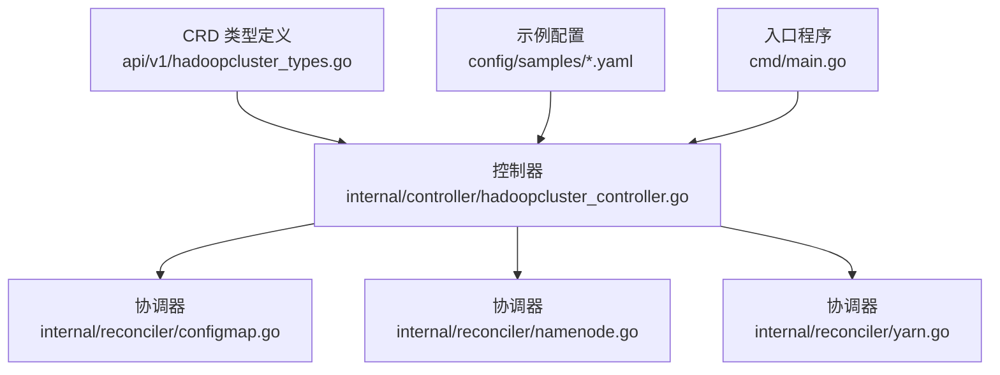
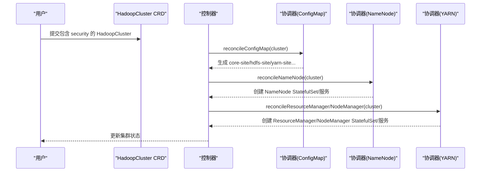
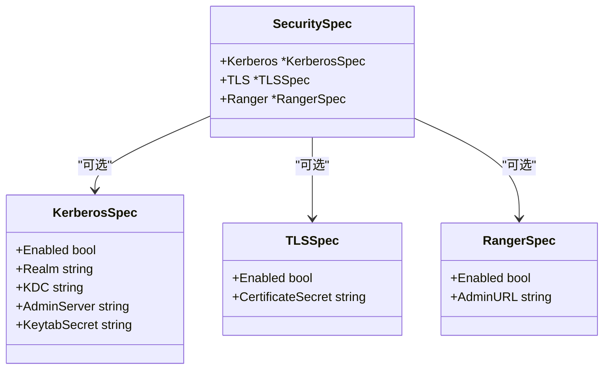
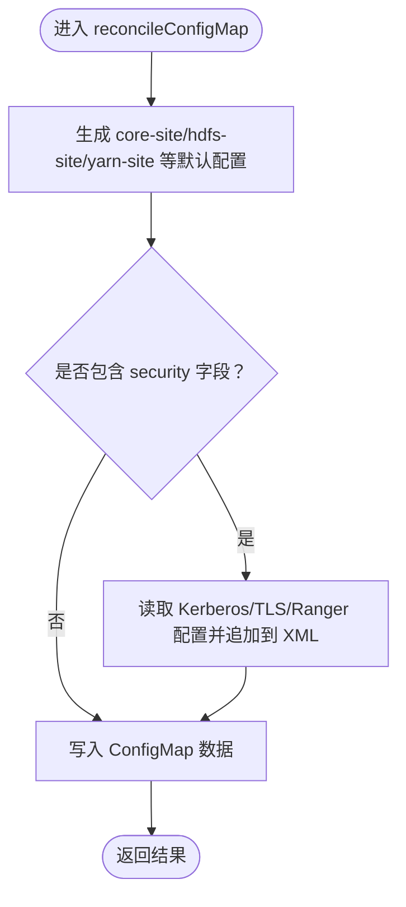
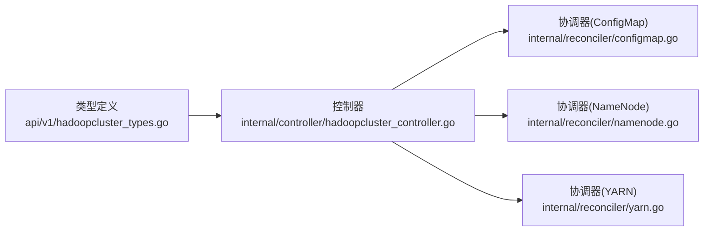

# 安全配置

<cite>
**本文引用的文件**   
- [hadoopcluster_types.go](file://hadoop-operator/api/v1/hadoopcluster_types.go)
- [hadoopcluster_controller.go](file://hadoop-operator/internal/controller/hadoopcluster_controller.go)
- [configmap.go](file://hadoop-operator/internal/reconciler/configmap.go)
- [namenode.go](file://hadoop-operator/internal/reconciler/namenode.go)
- [yarn.go](file://hadoop-operator/internal/reconciler/yarn.go)
- [main.go](file://hadoop-operator/cmd/main.go)
- [hadoop_v1_hadoopcluster.yaml](file://hadoop-operator/config/samples/hadoop_v1_hadoopcluster.yaml)
- [hadoop_v1_hadoopcluster_ha.yaml](file://hadoop-operator/config/samples/hadoop_v1_hadoopcluster_ha.yaml)
- [offline-deployment.yaml](file://hadoop-operator/config/samples/offline-deployment.yaml)
- [README.md](file://hadoop-operator/README.md)
</cite>

## 目录
1. [简介](#简介)
2. [项目结构](#项目结构)
3. [核心组件](#核心组件)
4. [架构总览](#架构总览)
5. [详细组件分析](#详细组件分析)
6. [依赖分析](#依赖分析)
7. [性能考虑](#性能考虑)
8. [故障排查指南](#故障排查指南)
9. [结论](#结论)
10. [附录](#附录)

## 简介
本文件为 Hadoop Operator 的“安全配置”参考文档，聚焦于 SecuritySpec 结构及其子项 KerberosSpec、TLSSpec、RangerSpec 的设计与使用建议。当前代码库中，这些字段已作为 CRD 结构预留，但控制器实现尚未对这些安全能力进行具体落地。本文基于现有类型定义与样例，提供安全配置的完整参考、最佳实践、安全注意事项、密钥与证书管理要点，以及常见问题排查思路。

## 项目结构
- CRD 类型定义位于 api/v1，包含 HadoopClusterSpec 与 SecuritySpec 等结构。
- 控制器位于 internal/controller，负责集群生命周期编排。
- 协调器位于 internal/reconciler，负责生成 ConfigMap、服务与 StatefulSet 等资源。
- 示例位于 config/samples，展示基础与高可用部署方式；离线部署示例展示了镜像与 Secret 的使用方式。

**图表来源**
- [hadoopcluster_types.go:233-271](file://hadoop-operator/api/v1/hadoopcluster_types.go#L233-L271)
- [hadoopcluster_controller.go:104-126](file://hadoop-operator/internal/controller/hadoopcluster_controller.go#L104-L126)
- [configmap.go:44-68](file://hadoop-operator/internal/reconciler/configmap.go#L44-L68)
- [namenode.go:117-316](file://hadoop-operator/internal/reconciler/namenode.go#L117-L316)
- [yarn.go:115-239](file://hadoop-operator/internal/reconciler/yarn.go#L115-L239)
- [main.go:125-132](file://hadoop-operator/cmd/main.go#L125-L132)

**章节来源**
- [hadoopcluster_types.go:233-271](file://hadoop-operator/api/v1/hadoopcluster_types.go#L233-L271)
- [hadoopcluster_controller.go:104-126](file://hadoop-operator/internal/controller/hadoopcluster_controller.go#L104-L126)
- [configmap.go:44-68](file://hadoop-operator/internal/reconciler/configmap.go#L44-L68)
- [namenode.go:117-316](file://hadoop-operator/internal/reconciler/namenode.go#L117-L316)
- [yarn.go:115-239](file://hadoop-operator/internal/reconciler/yarn.go#L115-L239)
- [main.go:125-132](file://hadoop-operator/cmd/main.go#L125-L132)

## 核心组件
- SecuritySpec：顶层安全配置容器，包含 Kerberos、TLS、Ranger 三个子配置。
- KerberosSpec：启用 Kerberos 认证，需提供 Realm、KDC、AdminServer、KeytabSecret 等。
- TLSSpec：启用 TLS，需提供证书 Secret 引用。
- RangerSpec：启用 Apache Ranger 集成，需提供 AdminURL。

上述字段均以指针形式存在，表示可选启用；当未设置时，控制器不会注入对应安全参数。

**章节来源**
- [hadoopcluster_types.go:233-271](file://hadoop-operator/api/v1/hadoopcluster_types.go#L233-L271)

## 架构总览
从 CRD 到 Pod 的安全配置路径如下：
- 用户在 HadoopCluster.spec.security 中声明 Kerberos/TLS/Ranger。
- 控制器按顺序编排组件（ConfigMap → 服务 → StatefulSet），协调器根据 spec 生成 Hadoop 配置。
- 当前实现未对 security 字段做特殊处理，因此不会自动写入 Kerberos、TLS 或 Ranger 的 Hadoop 配置项。
- 若后续扩展，通常会在协调器生成 ConfigMap 时，依据 security.* 字段追加相应配置。

**图表来源**
- [hadoopcluster_controller.go:104-126](file://hadoop-operator/internal/controller/hadoopcluster_controller.go#L104-L126)
- [configmap.go:44-68](file://hadoop-operator/internal/reconciler/configmap.go#L44-L68)
- [namenode.go:117-316](file://hadoop-operator/internal/reconciler/namenode.go#L117-L316)
- [yarn.go:115-239](file://hadoop-operator/internal/reconciler/yarn.go#L115-L239)

## 详细组件分析

### SecuritySpec 结构与字段
- Kerberos：启用后，需提供 Realm、KDC、AdminServer、KeytabSecret。
- TLS：启用后，需提供证书 Secret 名称。
- Ranger：启用后，需提供 Ranger Admin URL。

注意：当前控制器未读取这些字段，也不会在生成的 ConfigMap 中写入对应属性。如需启用，应在协调器中增加对 security.* 的处理逻辑。

**图表来源**
- [hadoopcluster_types.go:233-271](file://hadoop-operator/api/v1/hadoopcluster_types.go#L233-L271)

**章节来源**
- [hadoopcluster_types.go:233-271](file://hadoop-operator/api/v1/hadoopcluster_types.go#L233-L271)

### Kerberos 认证配置（KerberosSpec）
- 字段说明
  - Enabled：是否启用 Kerberos。
  - Realm：Kerberos 领域名称。
  - KDC：KDC 地址。
  - AdminServer：管理服务器地址。
  - KeytabSecret：包含 keytab 文件的 Secret 名称。
- 实施建议
  - 将 keytab 文件放入 Kubernetes Secret，并在 KerberosSpec 中引用。
  - 在生成的 ConfigMap 中追加 Hadoop/Kerberos 相关属性（例如 core-site 中的 kerberos 相关项）。
  - 在各组件容器中挂载该 Secret，并在启动脚本中执行 kinit 或使用票据缓存。
- 注意事项
  - 时间同步至关重要（NTP），避免票据过期。
  - Keytab 权限应最小化，仅允许运行账户读取。
  - 建议定期轮换 Keytab，避免长期不变。

**章节来源**
- [hadoopcluster_types.go:246-257](file://hadoop-operator/api/v1/hadoopcluster_types.go#L246-L257)

### TLS 加密配置（TLSSpec）
- 字段说明
  - Enabled：是否启用 TLS。
  - CertificateSecret：包含证书与私钥的 Secret 名称。
- 实施建议
  - 使用自签名或受信 CA 签发的证书，确保服务间通信加密。
  - 在生成的 ConfigMap 中追加 Hadoop TLS 相关属性（如 HTTPS 端口、信任库等）。
  - 在各组件容器中挂载证书 Secret，并在启动脚本中配置 Java keystore/truststore。
- 注意事项
  - 私钥必须保密，仅授予必要容器访问。
  - 证书链完整性校验，避免中间人攻击。
  - 定期更新证书，避免过期导致连接中断。

**章节来源**
- [hadoopcluster_types.go:259-264](file://hadoop-operator/api/v1/hadoopcluster_types.go#L259-L264)

### Apache Ranger 集成配置（RangerSpec）
- 字段说明
  - Enabled：是否启用 Ranger。
  - AdminURL：Ranger Admin 服务地址。
- 实施建议
  - 在生成的 ConfigMap 中追加 Hadoop-Ranger 相关属性（如 ACL provider、鉴权类等）。
  - 在各组件容器中配置 Ranger 客户端，确保与 Ranger Admin 通信正常。
- 注意事项
  - Ranger Admin URL 应稳定可达，避免鉴权失败。
  - 客户端与 Ranger 服务的版本兼容性需验证。
  - 权限策略应最小授权，避免过度放权。

**章节来源**
- [hadoopcluster_types.go:266-271](file://hadoop-operator/api/v1/hadoopcluster_types.go#L266-L271)

### 配置生成与安全字段的关系
- 当前协调器生成 ConfigMap 时，会根据 HDFS/YARN 的 HA、服务类型等生成 core-site/hdfs-site/yarn-site 等配置，但不会读取 security.* 字段。
- 如需启用 Kerberos/TLS/Ranger，应在协调器中增加对 SecuritySpec 的处理逻辑，将相应属性写入对应的 XML 文件。

**图表来源**
- [configmap.go:70-209](file://hadoop-operator/internal/reconciler/configmap.go#L70-L209)
- [hadoopcluster_types.go:233-271](file://hadoop-operator/api/v1/hadoopcluster_types.go#L233-L271)

**章节来源**
- [configmap.go:70-209](file://hadoop-operator/internal/reconciler/configmap.go#L70-L209)
- [hadoopcluster_types.go:233-271](file://hadoop-operator/api/v1/hadoopcluster_types.go#L233-L271)

### 安全配置示例（基于现有样例的扩展思路）
以下为在现有样例基础上添加 security 字段的思路说明（不直接粘贴代码内容）：
- 在 HadoopCluster.spec.security 下分别声明 kerberos、tls、ranger 三段配置，并设置 Enabled 为 true。
- Kerberos：填写 Realm、KDC、AdminServer、KeytabSecret。
- TLS：填写 CertificateSecret。
- Ranger：填写 AdminURL。
- 应用后，控制器会按既定顺序编排组件；若后续扩展了对 security.* 的处理，将在 ConfigMap 中体现相应配置。

**章节来源**
- [hadoop_v1_hadoopcluster.yaml:69-79](file://hadoop-operator/config/samples/hadoop_v1_hadoopcluster.yaml#L69-L79)
- [hadoop_v1_hadoopcluster_ha.yaml:89-99](file://hadoop-operator/config/samples/hadoop_v1_hadoopcluster_ha.yaml#L89-L99)
- [offline-deployment.yaml:121-126](file://hadoop-operator/config/samples/offline-deployment.yaml#L121-L126)

## 依赖分析
- 控制器依赖协调器生成 ConfigMap、服务与 StatefulSet。
- 协调器依赖 HadoopCluster.spec 的结构化配置，当前未读取 security.* 字段。
- 安全能力的启用取决于后续对协调器的扩展。

**图表来源**
- [hadoopcluster_types.go:233-271](file://hadoop-operator/api/v1/hadoopcluster_types.go#L233-L271)
- [hadoopcluster_controller.go:104-126](file://hadoop-operator/internal/controller/hadoopcluster_controller.go#L104-L126)
- [configmap.go:44-68](file://hadoop-operator/internal/reconciler/configmap.go#L44-L68)
- [namenode.go:117-316](file://hadoop-operator/internal/reconciler/namenode.go#L117-L316)
- [yarn.go:115-239](file://hadoop-operator/internal/reconciler/yarn.go#L115-L239)

**章节来源**
- [hadoopcluster_types.go:233-271](file://hadoop-operator/api/v1/hadoopcluster_types.go#L233-L271)
- [hadoopcluster_controller.go:104-126](file://hadoop-operator/internal/controller/hadoopcluster_controller.go#L104-L126)
- [configmap.go:44-68](file://hadoop-operator/internal/reconciler/configmap.go#L44-L68)
- [namenode.go:117-316](file://hadoop-operator/internal/reconciler/namenode.go#L117-L316)
- [yarn.go:115-239](file://hadoop-operator/internal/reconciler/yarn.go#L115-L239)

## 性能考虑
- 安全配置本身不引入额外计算开销，但证书与密钥的挂载与解析会带来少量 I/O。
- Kerberos 认证涉及票据获取与校验，建议在客户端与服务端保持时间同步，减少重试与失败带来的延迟。
- TLS 握手会增加少量 CPU 开销，可通过合理的证书链长度与硬件加速优化。

## 故障排查指南
- 通用排查
  - 查看控制器日志与事件，确认资源创建顺序与错误信息。
  - 使用 kubectl describe 获取 Pod/Service/ConfigMap 的详细事件。
- Kerberos 相关
  - 检查 Keytab Secret 是否存在且权限正确。
  - 核对 Realm/KDC/AdminServer 配置是否与 KDC 一致。
  - 确认时间同步（NTP），避免票据过期。
- TLS 相关
  - 检查证书 Secret 是否包含完整证书链与私钥。
  - 确认证书域名与服务 DNS 名称匹配。
  - 避免使用过期或不受信的证书。
- Ranger 相关
  - 确认 AdminURL 可达且返回健康状态。
  - 检查客户端与 Ranger 的版本兼容性。
  - 核对权限策略是否正确下发。

**章节来源**
- [README.md:276-318](file://hadoop-operator/README.md#L276-L318)

## 结论
- SecuritySpec 及其 Kerberos/TLS/Ranger 字段已在 CRD 中预留，当前控制器未对其做具体实现。
- 启用安全能力需要在协调器中扩展对 security.* 的读取与配置注入逻辑。
- 建议遵循最小权限、时间同步、证书链完整与定期轮换等最佳实践，确保生产环境安全与稳定。

## 附录

### 最佳实践清单
- 密钥与证书
  - 使用 Kubernetes Secret 管理 Keytab、证书与私钥。
  - 严格控制 Secret 的访问权限，最小化暴露面。
  - 定期轮换 Keytab 与证书，避免长期不变。
- Kerberos
  - 保持 NTP 同步，避免票据过期。
  - 使用强密码与短生命周期票据。
- TLS
  - 使用受信 CA 签发的证书，避免自签风险。
  - 证书链完整，域名与 SAN 匹配。
- Ranger
  - AdminURL 稳定可达，策略最小授权。
  - 版本兼容性验证，避免客户端与服务端不一致。

### 参考示例位置
- 基础部署示例：[hadoop_v1_hadoopcluster.yaml:1-80](file://hadoop-operator/config/samples/hadoop_v1_hadoopcluster.yaml#L1-L80)
- 高可用部署示例：[hadoop_v1_hadoopcluster_ha.yaml:1-107](file://hadoop-operator/config/samples/hadoop_v1_hadoopcluster_ha.yaml#L1-L107)
- 离线部署示例（镜像与 Secret）：[offline-deployment.yaml:1-135](file://hadoop-operator/config/samples/offline-deployment.yaml#L1-L135)