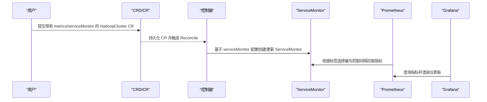
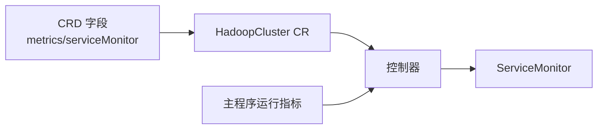

# 监控配置

<cite>
**本文引用的文件列表**
- [hadoopcluster_types.go](file://hadoop-operator/api/v1/hadoopcluster_types.go)
- [hadoop_v1_hadoopcluster.yaml](file://hadoop-operator/config/samples/hadoop_v1_hadoopcluster.yaml)
- [hadoop_v1_hadoopcluster_ha.yaml](file://hadoop-operator/config/samples/hadoop_v1_hadoopcluster_ha.yaml)
- [offline-deployment.yaml](file://hadoop-operator/config/samples/offline-deployment.yaml)
- [hadoop.apache.org_hadoopclusters.yaml](file://hadoop-operator/config/crd/bases/hadoop.apache.org_hadoopclusters.yaml)
- [main.go](file://hadoop-operator/cmd/main.go)
- [hadoopcluster_controller.go](file://hadoop-operator/internal/controller/hadoopcluster_controller.go)
- [namenode.go](file://hadoop-operator/internal/reconciler/namenode.go)
- [yarn.go](file://hadoop-operator/internal/reconciler/yarn.go)
</cite>

## 目录
1. [简介](#简介)
2. [项目结构](#项目结构)
3. [核心组件](#核心组件)
4. [架构总览](#架构总览)
5. [详细组件分析](#详细组件分析)
6. [依赖关系分析](#依赖关系分析)
7. [性能考量](#性能考量)
8. [故障排查指南](#故障排查指南)
9. [结论](#结论)
10. [附录](#附录)

## 简介
本文件面向运维与平台工程团队，系统化梳理 Hadoop Operator 中的监控配置能力，重点覆盖以下内容：
- MetricsSpec 与 ServiceMonitorSpec 的字段语义与配置方式
- Prometheus 指标导出与 ServiceMonitor 自动创建机制
- 监控标签匹配策略与抓取间隔控制
- 监控配置启用方法与 Prometheus 集成选项
- 完整的监控配置示例（含集群监控与指标收集）
- 监控配置对性能的影响与优化建议
- 监控告警与仪表板集成的实践建议

## 项目结构
监控配置相关的核心代码与资源分布如下：
- CRD 定义：在 CRD 中声明了 metrics 字段及其子对象 serviceMonitor 的结构
- 类型定义：在 API 层定义了 MetricsSpec 与 ServiceMonitorSpec 的结构体
- 示例清单：提供了标准与高可用场景下的监控配置示例
- 控制器与编排：控制器负责集群生命周期管理，监控配置通过 CRD 与示例进行落地
- 运行时指标：Operator 自身运行指标由主程序配置暴露

```mermaid
graph TB
subgraph "API 层"
Types["类型定义<br/>MetricsSpec/ServiceMonitorSpec"]
end
subgraph "CRD"
CRD["CRD 定义<br/>metrics/serviceMonitor 字段"]
end
subgraph "示例清单"
Sample1["标准集群示例<br/>hadoop_v1_hadoopcluster.yaml"]
Sample2["高可用集群示例<br/>hadoop_v1_hadoopcluster_ha.yaml"]
Sample3["离线部署示例<br/>offline-deployment.yaml"]
end
subgraph "控制器"
Ctrl["控制器<br/>HadoopClusterReconciler"]
Reconciler["编排器<br/>namenode.go/yarn.go"]
end
subgraph "运行时"
Main["主程序<br/>main.go 暴露运行指标"]
end
Types --> CRD
CRD --> Sample1
CRD --> Sample2
CRD --> Sample3
Ctrl --> Reconciler
Main --> Ctrl
```

图表来源
- [hadoopcluster_types.go:273-295](file://hadoop-operator/api/v1/hadoopcluster_types.go#L273-L295)
- [hadoop.apache.org_hadoopclusters.yaml:190-208](file://hadoop-operator/config/crd/bases/hadoop.apache.org_hadoopclusters.yaml#L190-L208)
- [hadoop_v1_hadoopcluster_ha.yaml:101-107](file://hadoop-operator/config/samples/hadoop_v1_hadoopcluster_ha.yaml#L101-L107)
- [offline-deployment.yaml:121-127](file://hadoop-operator/config/samples/offline-deployment.yaml#L121-L127)
- [main.go:54-119](file://hadoop-operator/cmd/main.go#L54-L119)

章节来源
- [hadoopcluster_types.go:273-295](file://hadoop-operator/api/v1/hadoopcluster_types.go#L273-L295)
- [hadoop.apache.org_hadoopclusters.yaml:190-208](file://hadoop-operator/config/crd/bases/hadoop.apache.org_hadoopclusters.yaml#L190-L208)
- [hadoop_v1_hadoopcluster.yaml:1-80](file://hadoop-operator/config/samples/hadoop_v1_hadoopcluster.yaml#L1-L80)
- [hadoop_v1_hadoopcluster_ha.yaml:101-107](file://hadoop-operator/config/samples/hadoop_v1_hadoopcluster_ha.yaml#L101-L107)
- [offline-deployment.yaml:121-127](file://hadoop-operator/config/samples/offline-deployment.yaml#L121-L127)
- [main.go:54-119](file://hadoop-operator/cmd/main.go#L54-L119)

## 核心组件
- MetricsSpec：顶层监控配置对象，用于开启 Prometheus 指标导出与 ServiceMonitor 创建
- ServiceMonitorSpec：Prometheus Operator 的 ServiceMonitor 资源配置，用于匹配目标服务并抓取指标
- CRD 字段：在 CRD 中声明 metrics 与 serviceMonitor 的结构，供用户在 HadoopCluster CR 中使用
- 示例清单：提供标准与高可用场景下的监控配置示例，便于直接应用

章节来源
- [hadoopcluster_types.go:273-295](file://hadoop-operator/api/v1/hadoopcluster_types.go#L273-L295)
- [hadoop.apache.org_hadoopclusters.yaml:190-208](file://hadoop-operator/config/crd/bases/hadoop.apache.org_hadoopclusters.yaml#L190-L208)
- [hadoop_v1_hadoopcluster_ha.yaml:101-107](file://hadoop-operator/config/samples/hadoop_v1_hadoopcluster_ha.yaml#L101-L107)
- [offline-deployment.yaml:121-127](file://hadoop-operator/config/samples/offline-deployment.yaml#L121-L127)

## 架构总览
监控配置在 Hadoop Operator 中的端到端流程如下：
- 用户在 HadoopCluster CR 中配置 metrics.enabled 与 serviceMonitor
- CRD 将配置持久化到集群
- 控制器根据 CRD 内容生成或更新相关资源（如 ServiceMonitor）
- Prometheus Operator 根据 ServiceMonitor 的标签选择器与抓取间隔，从目标服务抓取指标
- 用户通过 Grafana 或其他可视化工具消费 Prometheus 数据



图表来源
- [hadoop_v1_hadoopcluster_ha.yaml:101-107](file://hadoop-operator/config/samples/hadoop_v1_hadoopcluster_ha.yaml#L101-L107)
- [hadoop.apache.org_hadoopclusters.yaml:190-208](file://hadoop-operator/config/crd/bases/hadoop.apache.org_hadoopclusters.yaml#L190-L208)

## 详细组件分析

### MetricsSpec 配置项详解
- enabled：布尔值，开启或关闭 Prometheus 指标导出功能
- exporterImage：可选字符串，指定自定义指标导出器镜像（例如离线环境下的私有仓库镜像）
- serviceMonitor：可选对象，用于启用 Prometheus Operator 的 ServiceMonitor 自动创建

章节来源
- [hadoopcluster_types.go:273-283](file://hadoop-operator/api/v1/hadoopcluster_types.go#L273-L283)
- [hadoop.apache.org_hadoopclusters.yaml:190-208](file://hadoop-operator/config/crd/bases/hadoop.apache.org_hadoopclusters.yaml#L190-L208)
- [offline-deployment.yaml:121-127](file://hadoop-operator/config/samples/offline-deployment.yaml#L121-L127)

### ServiceMonitorSpec 配置项详解
- enabled：布尔值，启用或禁用 ServiceMonitor 创建
- labels：键值对映射，用于匹配 Prometheus 实例（如 release=release-name）
- interval：字符串，指标抓取间隔（如 30s）

章节来源
- [hadoopcluster_types.go:285-295](file://hadoop-operator/api/v1/hadoopcluster_types.go#L285-L295)
- [hadoop.apache.org_hadoopclusters.yaml:197-207](file://hadoop-operator/config/crd/bases/hadoop.apache.org_hadoopclusters.yaml#L197-L207)
- [hadoop_v1_hadoopcluster_ha.yaml:101-107](file://hadoop-operator/config/samples/hadoop_v1_hadoopcluster_ha.yaml#L101-L107)

### 监控配置启用方法与 Prometheus 集成
- 在 HadoopCluster CR 的 spec.metrics 下设置 enabled 为 true
- 如需 Prometheus Operator 自动发现与抓取，设置 serviceMonitor.enabled 为 true，并配置 labels 与 interval
- 若在离线环境，可通过 exporterImage 指定私有仓库镜像

章节来源
- [hadoop_v1_hadoopcluster_ha.yaml:101-107](file://hadoop-operator/config/samples/hadoop_v1_hadoopcluster_ha.yaml#L101-L107)
- [offline-deployment.yaml:121-127](file://hadoop-operator/config/samples/offline-deployment.yaml#L121-L127)

### 监控配置示例
- 标准集群示例：未显式配置 metrics，表示不启用监控导出
- 高可用集群示例：启用 metrics 与 serviceMonitor，并设置 labels 以匹配 Prometheus 实例
- 离线部署示例：启用 metrics 并指定 exporterImage；serviceMonitor.enabled 可按需关闭

章节来源
- [hadoop_v1_hadoopcluster.yaml:1-80](file://hadoop-operator/config/samples/hadoop_v1_hadoopcluster.yaml#L1-L80)
- [hadoop_v1_hadoopcluster_ha.yaml:101-107](file://hadoop-operator/config/samples/hadoop_v1_hadoopcluster_ha.yaml#L101-L107)
- [offline-deployment.yaml:121-127](file://hadoop-operator/config/samples/offline-deployment.yaml#L121-L127)

### 监控数据的使用方法
- 通过 Prometheus 抓取 ServiceMonitor 指定的服务端口与路径
- 在 Grafana 中添加 Prometheus 数据源并创建面板
- 结合告警规则（Prometheus Alerting）实现自动化告警

（本节为通用实践说明，不直接分析具体文件）

### 监控告警配置与仪表板集成
- 告警：基于 Prometheus 规则（PrometheusRule）定义阈值与告警条件
- 仪表板：在 Grafana 中导入 Hadoop 相关 Dashboard JSON，或自定义面板展示关键指标
- 标签匹配：通过 serviceMonitor.labels 与 Prometheus 实例标签保持一致，确保正确抓取

（本节为通用实践说明，不直接分析具体文件）

## 依赖关系分析
- CRD 与类型定义：CRD 声明 metrics 与 serviceMonitor 字段，类型定义提供结构约束
- 示例清单：示例中展示如何在 CR 中启用监控与配置 ServiceMonitor
- 控制器：控制器负责集群生命周期管理，监控配置通过 CRD 与示例进行落地
- 运行时指标：主程序暴露控制器自身的运行指标，便于观察 Operator 本身健康状况



图表来源
- [hadoop.apache.org_hadoopclusters.yaml:190-208](file://hadoop-operator/config/crd/bases/hadoop.apache.org_hadoopclusters.yaml#L190-L208)
- [hadoop_v1_hadoopcluster_ha.yaml:101-107](file://hadoop-operator/config/samples/hadoop_v1_hadoopcluster_ha.yaml#L101-L107)
- [main.go:54-119](file://hadoop-operator/cmd/main.go#L54-L119)

章节来源
- [hadoop.apache.org_hadoopclusters.yaml:190-208](file://hadoop-operator/config/crd/bases/hadoop.apache.org_hadoopclusters.yaml#L190-L208)
- [hadoop_v1_hadoopcluster_ha.yaml:101-107](file://hadoop-operator/config/samples/hadoop_v1_hadoopcluster_ha.yaml#L101-L107)
- [main.go:54-119](file://hadoop-operator/cmd/main.go#L54-L119)

## 性能考量
- 抓取频率与资源消耗：较短的抓取间隔会增加 Prometheus 与被监控服务的压力，建议结合业务负载合理设置 interval
- 标签匹配开销：过多或过宽的标签匹配会增加 Prometheus 的选择成本，建议精确配置 labels
- 导出器镜像：在离线环境使用私有仓库镜像可避免网络波动带来的抓取失败，但需确保镜像大小与版本稳定
- 控制器自身指标：主程序暴露的运行指标可用于观察控制器健康度，避免因控制器异常导致监控配置无法生效

（本节为通用指导，不直接分析具体文件）

## 故障排查指南
- CRD 字段缺失：确认 CRD 已安装且包含 metrics 与 serviceMonitor 字段
- ServiceMonitor 未创建：检查 CR 中 serviceMonitor.enabled 是否为 true，以及 labels 是否与 Prometheus 实例匹配
- 抓取失败：核对服务端口与路径是否正确，确认 Prometheus 与被监控服务网络连通
- 离线环境镜像问题：确认 exporterImage 指向正确的私有仓库镜像，且镜像可被集群节点拉取

章节来源
- [hadoop.apache.org_hadoopclusters.yaml:190-208](file://hadoop-operator/config/crd/bases/hadoop.apache.org_hadoopclusters.yaml#L190-L208)
- [offline-deployment.yaml:121-127](file://hadoop-operator/config/samples/offline-deployment.yaml#L121-L127)

## 结论
本文件系统化梳理了 Hadoop Operator 的监控配置能力，明确了 MetricsSpec 与 ServiceMonitorSpec 的字段语义、配置方式与集成路径。通过 CRD 与示例清单，用户可在标准与高可用场景下快速启用监控，并结合 Prometheus Operator 实现自动化的指标采集与可视化。建议在生产环境中根据业务负载合理设置抓取间隔与标签匹配策略，确保监控系统的稳定性与可观测性。

## 附录
- 相关示例清单路径
  - [标准集群示例](file://hadoop-operator/config/samples/hadoop_v1_hadoopcluster.yaml)
  - [高可用集群示例](file://hadoop-operator/config/samples/hadoop_v1_hadoopcluster_ha.yaml)
  - [离线部署示例](file://hadoop-operator/config/samples/offline-deployment.yaml)
- 主程序运行指标配置
  - [主程序入口:54-119](file://hadoop-operator/cmd/main.go#L54-L119)