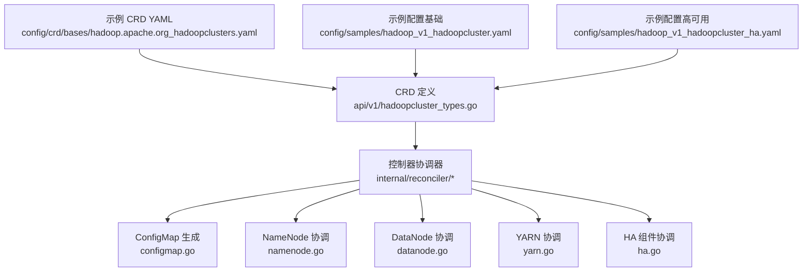
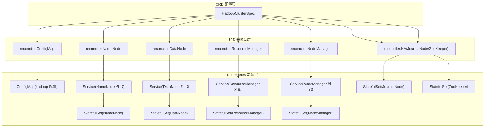
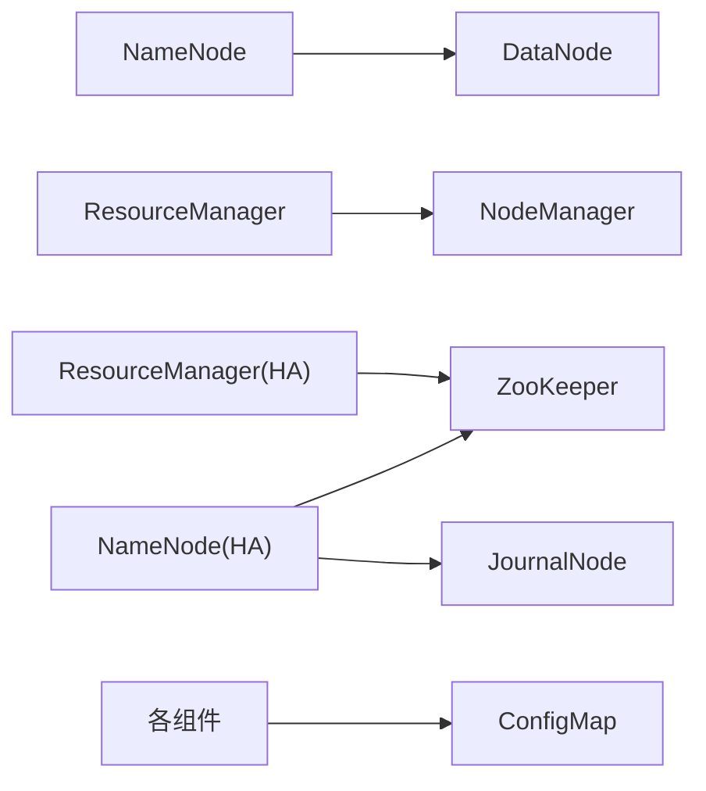
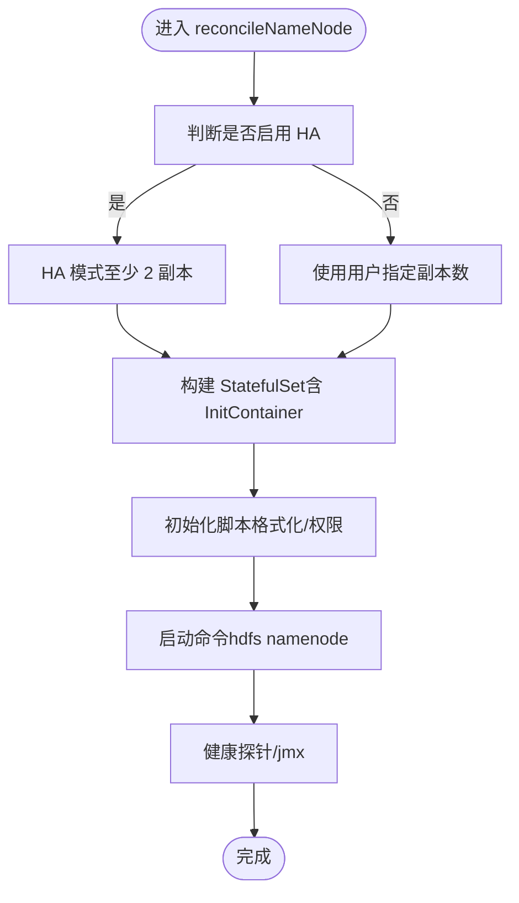
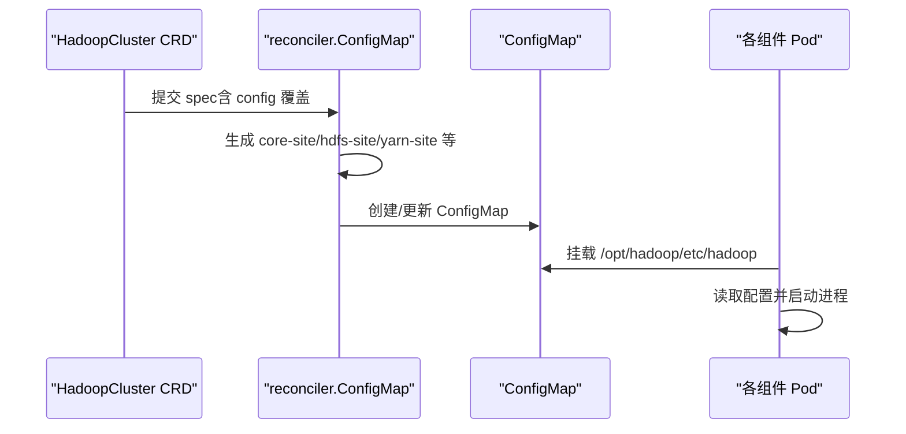

# 配置参考

<cite>
**本文引用的文件**
- [hadoopcluster_types.go](file://hadoop-operator/api/v1/hadoopcluster_types.go)
- [hadoop_v1_hadoopcluster.yaml](file://hadoop-operator/config/samples/hadoop_v1_hadoopcluster.yaml)
- [hadoop_v1_hadoopcluster_ha.yaml](file://hadoop-operator/config/samples/hadoop_v1_hadoopcluster_ha.yaml)
- [hadoop.apache.org_hadoopclusters.yaml](file://hadoop-operator/config/crd/bases/hadoop.apache.org_hadoopclusters.yaml)
- [namenode.go](file://hadoop-operator/internal/reconciler/namenode.go)
- [datanode.go](file://hadoop-operator/internal/reconciler/datanode.go)
- [yarn.go](file://hadoop-operator/internal/reconciler/yarn.go)
- [ha.go](file://hadoop-operator/internal/reconciler/ha.go)
- [configmap.go](file://hadoop-operator/internal/reconciler/configmap.go)
- [README.md](file://hadoop-operator/README.md)
</cite>

## 目录
1. [简介](#简介)
2. [项目结构](#项目结构)
3. [核心组件](#核心组件)
4. [架构总览](#架构总览)
5. [详细组件分析](#详细组件分析)
6. [依赖关系分析](#依赖关系分析)
7. [性能与资源建议](#性能与资源建议)
8. [故障排查指南](#故障排查指南)
9. [结论](#结论)
10. [附录](#附录)

## 简介
本文件为 HadoopCluster CRD 的配置参考，面向运维与平台工程师，系统梳理 HDFS（NameNode、DataNode、JournalNode）、YARN（ResourceManager、NodeManager）、镜像、资源限制、存储、高可用（HA）、监控等配置项的数据类型、默认行为、使用场景与约束，并提供基础与高可用配置示例路径与验证方法，帮助快速、正确地部署与维护 Hadoop 集群于 Kubernetes。

## 项目结构
- CRD 定义与类型：位于 api/v1，定义了 HadoopClusterSpec/HadoopClusterStatus 及各子结构（如 HDFS、YARN、Config、Security、Metrics）。
- 控制器与协调器：位于 internal/reconciler，负责根据 CRD 配置生成 ConfigMap、Service、StatefulSet 等资源。
- 示例与 CRD YAML：位于 config/samples 与 config/crd/bases，提供基础与高可用样例及 CRD 规范。
- README：包含安装、使用、离线部署与故障排查指引。

图表来源
- [hadoopcluster_types.go:24-46](file://hadoop-operator/api/v1/hadoopcluster_types.go#L24-L46)
- [hadoop.apache.org_hadoopclusters.yaml:42-313](file://hadoop-operator/config/crd/bases/hadoop.apache.org_hadoopclusters.yaml#L42-L313)
- [configmap.go:44-68](file://hadoop-operator/internal/reconciler/configmap.go#L44-L68)
- [namenode.go:117-317](file://hadoop-operator/internal/reconciler/namenode.go#L117-L317)
- [datanode.go:116-321](file://hadoop-operator/internal/reconciler/datanode.go#L116-L321)
- [yarn.go:115-447](file://hadoop-operator/internal/reconciler/yarn.go#L115-L447)
- [ha.go:34-363](file://hadoop-operator/internal/reconciler/ha.go#L34-L363)

章节来源
- [hadoopcluster_types.go:24-46](file://hadoop-operator/api/v1/hadoopcluster_types.go#L24-L46)
- [hadoop.apache.org_hadoopclusters.yaml:27-406](file://hadoop-operator/config/crd/bases/hadoop.apache.org_hadoopclusters.yaml#L27-L406)

## 核心组件
- HadoopClusterSpec：顶层配置对象，包含镜像、HDFS、YARN、配置覆盖、安全、监控等字段。
- HDFS：NameNode、DataNode 配置；NameNode 支持 HA（含 JournalNode、ZooKeeper）。
- YARN：ResourceManager、NodeManager 配置；ResourceManager 支持 HA。
- Config：对 core-site.xml、hdfs-site.xml、yarn-site.xml、mapred-site.xml、capacity-scheduler.xml 的键值覆盖。
- Security：Kerberos、TLS、Ranger 集成开关与参数预留。
- Metrics：Prometheus 指标开关、导出器镜像、ServiceMonitor 标签与抓取间隔。

章节来源
- [hadoopcluster_types.go:24-46](file://hadoop-operator/api/v1/hadoopcluster_types.go#L24-L46)
- [hadoopcluster_types.go:61-148](file://hadoop-operator/api/v1/hadoopcluster_types.go#L61-L148)
- [hadoopcluster_types.go:214-295](file://hadoop-operator/api/v1/hadoopcluster_types.go#L214-L295)

## 架构总览
HadoopCluster CRD 通过控制器将用户配置转换为 Kubernetes 资源：
- ConfigMap：生成各组件配置文件（core-site、hdfs-site、yarn-site、mapred-site、capacity-scheduler）。
- Service：Headless 服务用于 StatefulSet 内部通信，外部服务（NodePort/LoadBalancer）暴露 RPC/Web 端口。
- StatefulSet：NameNode、DataNode、ResourceManager、NodeManager 以有状态方式部署。
- HA 组件：JournalNode、ZooKeeper（内部或外部）保障 NameNode/ResourceManager 的自动故障转移。

图表来源
- [configmap.go:44-68](file://hadoop-operator/internal/reconciler/configmap.go#L44-L68)
- [namenode.go:36-114](file://hadoop-operator/internal/reconciler/namenode.go#L36-L114)
- [datanode.go:35-113](file://hadoop-operator/internal/reconciler/datanode.go#L35-L113)
- [yarn.go:34-113](file://hadoop-operator/internal/reconciler/yarn.go#L34-L113)
- [ha.go:34-177](file://hadoop-operator/internal/reconciler/ha.go#L34-L177)

## 详细组件分析

### HDFS 配置（NameNode、DataNode、JournalNode）
- NameNode
  - 副本数 replicas：非 HA 默认 1；启用 HA 至少 2。
  - 资源 requests/limits：未设置时采用内置默认值。
  - 存储 storage：size、storageClassName、accessMode。
  - 服务 service：type、nodePorts、annotations。
  - HA：enabled、journalNode（副本、资源、存储）、zookeeper（外部连接串）。
  - 亲和性/容忍度：affinity、tolerations。
- DataNode
  - 副本数 replicas：默认 3。
  - 资源 requests/limits：未设置时采用内置默认值。
  - 存储 storage：size、storageClassName、accessMode。
  - 服务 service：type、nodePorts、annotations。
  - 亲和性/容忍度：affinity、tolerations。
- JournalNode（仅当 NameNode HA 启用时创建）
  - 副本数 replicas：最小 3（仲裁要求）。
  - 资源 requests/limits：未设置时采用内置默认值。
  - 存储 storage：size、storageClassName。
  - 端口：RPC 8485、Web 8480。
- ZooKeeper（内部）
  - 当未配置外部 ZooKeeper 时，内部部署 3 副本，端口 2181/2888/3888。
  - 内部 ZooKeeper 服务名与地址由控制器生成。

章节来源
- [hadoopcluster_types.go:69-140](file://hadoop-operator/api/v1/hadoopcluster_types.go#L69-L140)
- [hadoopcluster_types.go:111-120](file://hadoop-operator/api/v1/hadoopcluster_types.go#L111-L120)
- [hadoopcluster_types.go:92-102](file://hadoop-operator/api/v1/hadoopcluster_types.go#L92-L102)
- [hadoopcluster_types.go:190-199](file://hadoop-operator/api/v1/hadoopcluster_types.go#L190-L199)
- [hadoopcluster_types.go:201-212](file://hadoop-operator/api/v1/hadoopcluster_types.go#L201-L212)
- [namenode.go:117-317](file://hadoop-operator/internal/reconciler/namenode.go#L117-L317)
- [datanode.go:116-321](file://hadoop-operator/internal/reconciler/datanode.go#L116-L321)
- [ha.go:179-363](file://hadoop-operator/internal/reconciler/ha.go#L179-L363)

### YARN 配置（ResourceManager、NodeManager）
- ResourceManager
  - 副本数 replicas：默认 1；启用 HA 至少 2。
  - 资源 requests/limits：未设置时采用内置默认值。
  - 服务 service：type、nodePorts、annotations。
  - HA：enabled。
  - 亲和性/容忍度：affinity、tolerations。
- NodeManager
  - 副本数 replicas：默认 2。
  - 资源 requests/limits：未设置时采用内置默认值。
  - 服务 service：type、nodePorts、annotations。
  - 亲和性/容忍度：affinity、tolerations。

章节来源
- [hadoopcluster_types.go:142-187](file://hadoop-operator/api/v1/hadoopcluster_types.go#L142-L187)
- [yarn.go:115-447](file://hadoop-operator/internal/reconciler/yarn.go#L115-L447)

### 镜像配置
- repository：镜像仓库，默认“apache/hadoop”。
- tag：镜像标签，默认“3.3.6”。
- pullPolicy：镜像拉取策略。
- pullSecrets：镜像拉取密钥列表。

章节来源
- [hadoopcluster_types.go:48-59](file://hadoop-operator/api/v1/hadoopcluster_types.go#L48-L59)
- [configmap.go:235-245](file://hadoop-operator/internal/reconciler/configmap.go#L235-L245)

### 资源限制与默认值
- NameNode：requests 默认约“500m CPU、2Gi 内存”，limits 默认约“1000m CPU、4Gi 内存”。
- DataNode：requests 默认约“500m CPU、2Gi 内存”，limits 默认约“1000m CPU、4Gi 内存”。
- ResourceManager：requests 默认约“500m CPU、2Gi 内存”，limits 默认约“1000m CPU、4Gi 内存”。
- NodeManager：requests 默认约“500m CPU、2Gi 内存”，limits 默认约“1000m CPU、4Gi 内存”。
- JournalNode：requests 默认约“250m CPU、1Gi 内存”，limits 默认约“500m CPU、2Gi 内存”。

章节来源
- [namenode.go:140-152](file://hadoop-operator/internal/reconciler/namenode.go#L140-L152)
- [datanode.go:133-145](file://hadoop-operator/internal/reconciler/datanode.go#L133-L145)
- [yarn.go:138-150](file://hadoop-operator/internal/reconciler/yarn.go#L138-L150)
- [ha.go:236-248](file://hadoop-operator/internal/reconciler/ha.go#L236-L248)

### 存储配置
- NameNode/DataNode/JournalNode：size、storageClassName、accessMode（ReadWriteOnce）。
- 默认存储大小：NameNode 默认“20Gi”、DataNode 默认“100Gi”、JournalNode 默认“20Gi”。

章节来源
- [hadoopcluster_types.go:190-199](file://hadoop-operator/api/v1/hadoopcluster_types.go#L190-L199)
- [namenode.go:154-163](file://hadoop-operator/internal/reconciler/namenode.go#L154-L163)
- [datanode.go:147-156](file://hadoop-operator/internal/reconciler/datanode.go#L147-L156)
- [ha.go:250-253](file://hadoop-operator/internal/reconciler/ha.go#L250-L253)

### 高可用配置
- NameNode HA
  - replicas 至少 2；启用 HA 时自动创建 JournalNode（默认 3 副本）与 ZooKeeper（内部）。
  - fs.defaultFS 在 HA 模式下指向逻辑命名空间名称。
- ResourceManager HA
  - replicas 至少 2；启用 HA 时在 yarn-site 中注入 zk 地址与 rm 配置。
- ZooKeeper
  - 外部：通过 connectionString 指定；内部：自动部署 3 副本，端口 2181/2888/3888。

章节来源
- [hadoopcluster_types.go:92-102](file://hadoop-operator/api/v1/hadoopcluster_types.go#L92-L102)
- [hadoopcluster_types.go:111-120](file://hadoop-operator/api/v1/hadoopcluster_types.go#L111-L120)
- [configmap.go:95-98](file://hadoop-operator/internal/reconciler/configmap.go#L95-L98)
- [configmap.go:120-130](file://hadoop-operator/internal/reconciler/configmap.go#L120-L130)
- [configmap.go:153-162](file://hadoop-operator/internal/reconciler/configmap.go#L153-L162)
- [ha.go:34-177](file://hadoop-operator/internal/reconciler/ha.go#L34-L177)

### 监控配置
- enabled：是否启用指标。
- exporterImage：Prometheus 导出器镜像。
- serviceMonitor：enabled、labels、interval。

章节来源
- [hadoopcluster_types.go:273-295](file://hadoop-operator/api/v1/hadoopcluster_types.go#L273-L295)

### 安全配置
- Kerberos：enabled、realm、kdc、adminServer、keytabSecret。
- TLS：enabled、certificateSecret。
- Ranger：enabled、adminURL。
- 注意：这些为预留字段，具体集成需配合镜像与密钥配置。

章节来源
- [hadoopcluster_types.go:233-271](file://hadoop-operator/api/v1/hadoopcluster_types.go#L233-L271)

### 配置覆盖（HadoopConfig）
- coreSite、hdfsSite、yarnSite、mapredSite、capacityScheduler：键值对覆盖。
- 控制器会合并用户覆盖与默认值，生成各组件配置文件。

章节来源
- [hadoopcluster_types.go:214-231](file://hadoop-operator/api/v1/hadoopcluster_types.go#L214-L231)
- [configmap.go:100-104](file://hadoop-operator/internal/reconciler/configmap.go#L100-L104)
- [configmap.go:132-136](file://hadoop-operator/internal/reconciler/configmap.go#L132-L136)
- [configmap.go:164-168](file://hadoop-operator/internal/reconciler/configmap.go#L164-L168)
- [configmap.go:178-182](file://hadoop-operator/internal/reconciler/configmap.go#L178-L182)
- [configmap.go:202-206](file://hadoop-operator/internal/reconciler/configmap.go#L202-L206)

## 依赖关系分析
- NameNode 依赖 DataNode 提供存储与计算能力；DataNode 依赖 NameNode 的元数据服务。
- ResourceManager 依赖 NodeManager 提供容器与资源；NodeManager 依赖 ResourceManager 的调度指令。
- HA 模式下，NameNode/ResourceManager 依赖 ZooKeeper；JournalNode 为 NameNode HA 的共享编辑日志。
- ConfigMap 为所有组件提供统一配置注入。

图表来源
- [configmap.go:70-209](file://hadoop-operator/internal/reconciler/configmap.go#L70-L209)
- [ha.go:34-177](file://hadoop-operator/internal/reconciler/ha.go#L34-L177)
- [namenode.go:158-159](file://hadoop-operator/internal/reconciler/namenode.go#L158-L159)
- [yarn.go:344-345](file://hadoop-operator/internal/reconciler/yarn.go#L344-L345)

## 性能与资源建议
- NameNode/ResourceManager：建议从默认值起步，结合业务负载逐步扩容副本与资源配额。
- DataNode：磁盘容量按数据规模与副本数预留冗余，I/O 与网络带宽是关键瓶颈。
- JournalNode：独立资源与存储，避免与 NameNode 共享 IO。
- NodeManager：根据应用任务内存/CPU 使用情况调整 pmem/vmem 检查与最大分配值。
- 网络与存储：确保 PVC 动态绑定与访问模式满足多副本读写需求。

[本节为通用建议，不直接分析具体文件]

## 故障排查指南
- Pod 启动失败
  - 使用 describe 查看事件与容器启动日志；检查镜像拉取策略与密钥。
- NameNode 格式化失败
  - 检查 PVC 是否就绪；必要时手动格式化（谨慎操作）。
- DataNode 无法连接 NameNode
  - 检查服务 DNS 名称与端口可达性；核对 ConfigMap 中 fs.defaultFS 与 HA 配置。
- 镜像拉取失败
  - 校验镜像存在性与私有仓库凭据 Secret。

章节来源
- [README.md:276-318](file://hadoop-operator/README.md#L276-L318)

## 结论
HadoopCluster CRD 提供了对 HDFS/YARN 组件的集中配置与高可用支持。通过合理的资源、存储与 HA 配置，可在 Kubernetes 上稳定运行 Hadoop 集群。建议从基础配置入手，逐步引入 HA 与监控，并结合业务负载持续优化资源与存储策略。

[本节为总结，不直接分析具体文件]

## 附录

### 配置参数总表（字段、类型、默认值、说明）
- 顶层
  - image.repository：字符串，默认“apache/hadoop”
  - image.tag：字符串，默认“3.3.6”
  - image.pullPolicy：枚举（K8s 拉取策略）
  - image.pullSecrets：数组（LocalObjectReference）
  - hdfs.nameNode.replicas：整数，默认 1（HA 时至少 2）
  - hdfs.nameNode.resources.requests.cpu/memory：资源
  - hdfs.nameNode.resources.limits.cpu/memory：资源
  - hdfs.nameNode.storage.size/accessMode/storageClassName：字符串/枚举/字符串
  - hdfs.nameNode.service.type/nodePorts/annotations：枚举/字典/字典
  - hdfs.nameNode.ha.enabled：布尔
  - hdfs.nameNode.ha.journalNode.replicas：整数，默认 3
  - hdfs.nameNode.ha.journalNode.resources：资源
  - hdfs.nameNode.ha.journalNode.storage.size/storageClassName：字符串/字符串
  - hdfs.nameNode.ha.zookeeper.connectionString：字符串（外部 ZooKeeper）
  - hdfs.nameNode.affinity/tolerations：对象/数组
  - hdfs.dataNode.replicas：整数，默认 3
  - hdfs.dataNode.resources.requests/limits：资源
  - hdfs.dataNode.storage.size/accessMode/storageClassName：字符串/枚举/字符串
  - hdfs.dataNode.service.type/nodePorts/annotations：枚举/字典/字典
  - hdfs.dataNode.affinity/tolerations：对象/数组
  - yarn.resourceManager.replicas：整数，默认 1（HA 时至少 2）
  - yarn.resourceManager.resources.requests/limits：资源
  - yarn.resourceManager.service.type/nodePorts/annotations：枚举/字典/字典
  - yarn.resourceManager.ha.enabled：布尔
  - yarn.resourceManager.affinity/tolerations：对象/数组
  - yarn.nodeManager.replicas：整数，默认 2
  - yarn.nodeManager.resources.requests/limits：资源
  - yarn.nodeManager.service.type/nodePorts/annotations：枚举/字典/字典
  - yarn.nodeManager.affinity/tolerations：对象/数组
  - config.coreSite/hdfsSite/yarnSite/mapredSite/capacityScheduler：字典
  - security.kerberos.enabled/realm/kdc/adminServer/keytabSecret：布尔/字符串/字符串/字符串/字符串
  - security.tls.enabled/certificateSecret：布尔/字符串
  - security.ranger.enabled/adminURL：布尔/字符串
  - metrics.enabled/exporterImage/serviceMonitor.enabled/labels/interval：布尔/字符串/布尔/字典/字符串

章节来源
- [hadoopcluster_types.go:48-295](file://hadoop-operator/api/v1/hadoopcluster_types.go#L48-L295)
- [hadoop.apache.org_hadoopclusters.yaml:44-312](file://hadoop-operator/config/crd/bases/hadoop.apache.org_hadoopclusters.yaml#L44-L312)

### 配置示例路径
- 基础配置：[hadoop_v1_hadoopcluster.yaml:1-80](file://hadoop-operator/config/samples/hadoop_v1_hadoopcluster.yaml#L1-L80)
- 高可用配置：[hadoop_v1_hadoopcluster_ha.yaml:1-107](file://hadoop-operator/config/samples/hadoop_v1_hadoopcluster_ha.yaml#L1-L107)

### 关键流程图：NameNode 初始化与启动

图表来源
- [namenode.go:117-317](file://hadoop-operator/internal/reconciler/namenode.go#L117-L317)
- [namenode.go:328-362](file://hadoop-operator/internal/reconciler/namenode.go#L328-L362)

### 关键序列图：配置生成与注入

图表来源
- [configmap.go:44-68](file://hadoop-operator/internal/reconciler/configmap.go#L44-L68)
- [configmap.go:70-209](file://hadoop-operator/internal/reconciler/configmap.go#L70-L209)