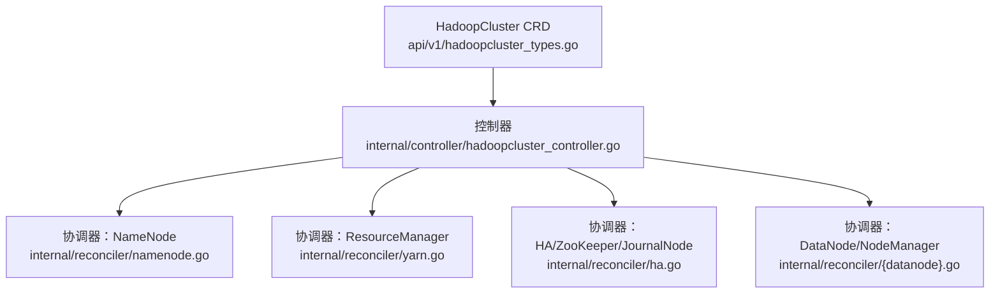
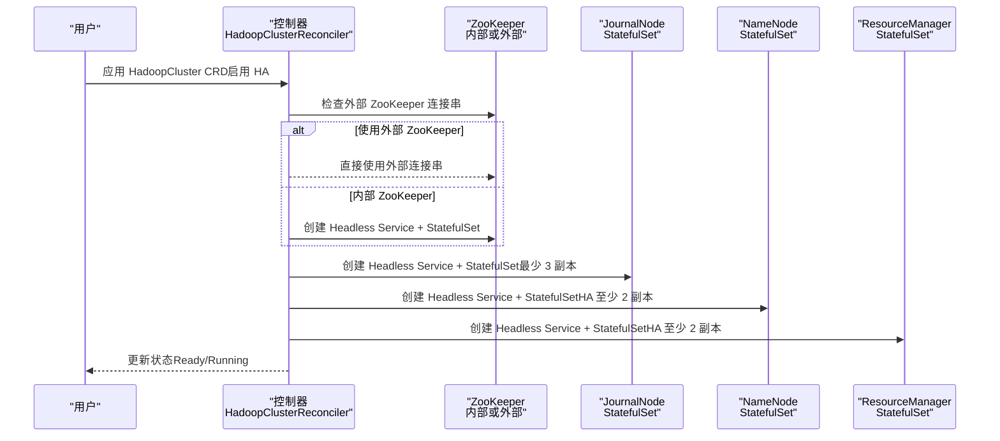
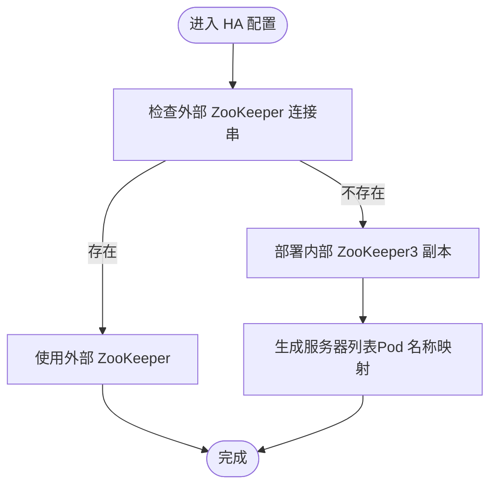
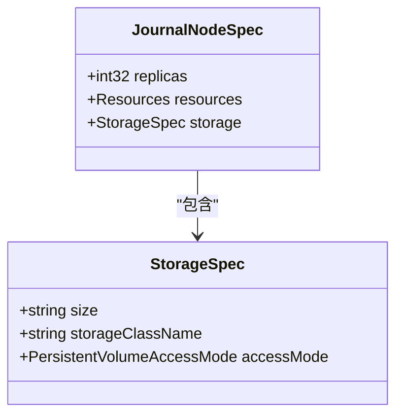
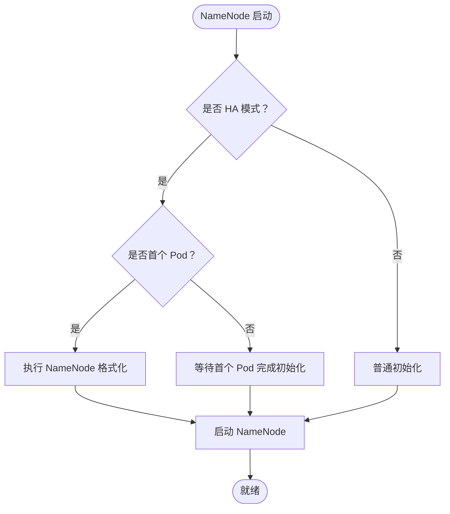
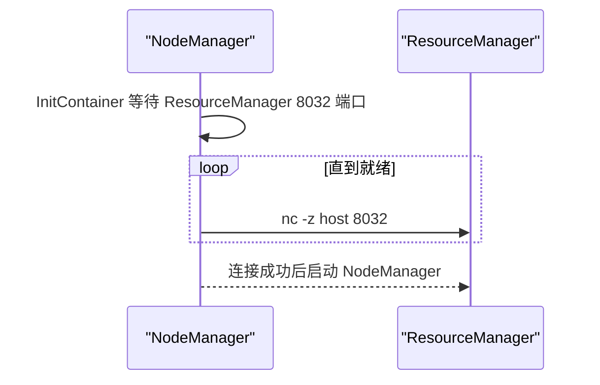
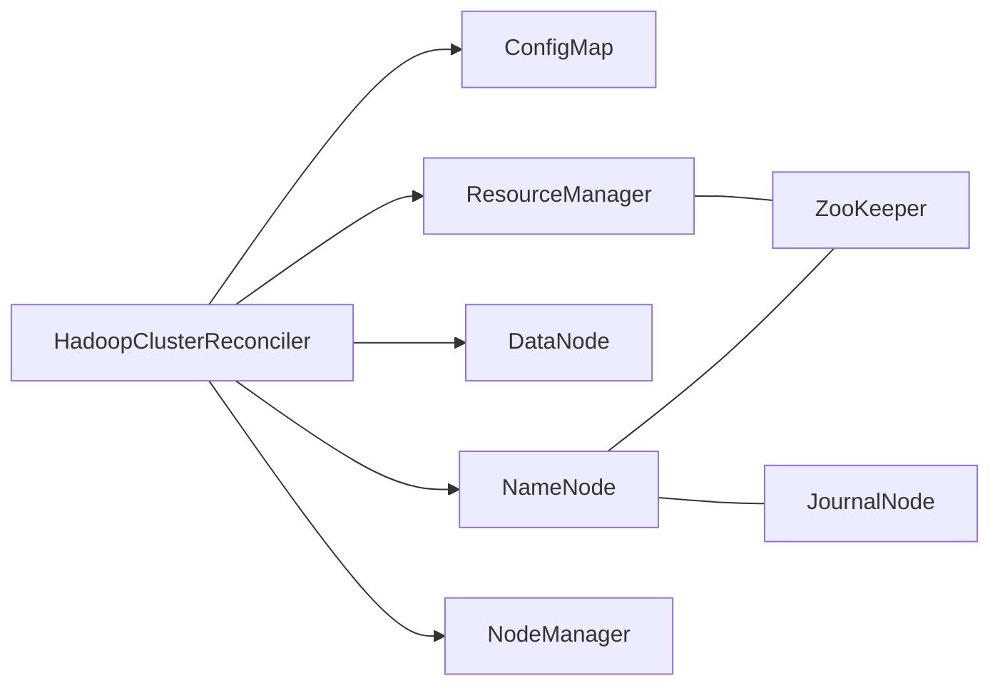

# 高可用配置

<cite>
**本文引用的文件列表**
- [hadoopcluster_types.go](file://hadoop-operator/api/v1/hadoopcluster_types.go)
- [ha.go](file://hadoop-operator/internal/reconciler/ha.go)
- [hadoopcluster_controller.go](file://hadoop-operator/internal/controller/hadoopcluster_controller.go)
- [namenode.go](file://hadoop-operator/internal/reconciler/namenode.go)
- [yarn.go](file://hadoop-operator/internal/reconciler/yarn.go)
- [hadoop_v1_hadoopcluster_ha.yaml](file://hadoop-operator/config/samples/hadoop_v1_hadoopcluster_ha.yaml)
- [hadoop_v1_hadoopcluster.yaml](file://hadoop-operator/config/samples/hadoop_v1_hadoopcluster.yaml)
- [README.md](file://hadoop-operator/README.md)
</cite>

## 目录
1. [简介](#简介)
2. [项目结构](#项目结构)
3. [核心组件](#核心组件)
4. [架构总览](#架构总览)
5. [详细组件分析](#详细组件分析)
6. [依赖关系分析](#依赖关系分析)
7. [性能考量](#性能考量)
8. [故障排查指南](#故障排查指南)
9. [结论](#结论)
10. [附录](#附录)

## 简介
本文件面向需要在 Kubernetes 上部署高可用 Hadoop 集群的用户与运维工程师，系统性地梳理 Hadoop Operator 中的高可用配置模型与实现细节。重点覆盖以下内容：
- HASpec 结构与高可用配置选项（NameNode HA、ResourceManager HA）
- ZooKeeper 集成配置（ZooKeeperSpec）与 JournalNode 配置要求
- 双 NameNode 与双 ResourceManager 的完整部署示例
- 高可用模式下的配置约束、故障转移机制与监控配置
- 外部 ZooKeeper 与内部 ZooKeeper 的选择指南

## 项目结构
该仓库采用标准的 Kubernetes Operator 分层组织方式：
- api/v1：CRD 类型定义与状态结构
- internal/controller：主控制器，负责资源编排与状态更新
- internal/reconciler：各组件协调器（NameNode、DataNode、ResourceManager、NodeManager、HA/ZooKeeper/JournalNode）
- config/samples：示例 CRD YAML（含 HA 示例）



图表来源
- [hadoopcluster_types.go:24-46](file://hadoop-operator/api/v1/hadoopcluster_types.go#L24-L46)
- [hadoopcluster_controller.go:104-115](file://hadoop-operator/internal/controller/hadoopcluster_controller.go#L104-L115)
- [ha.go:34-177](file://hadoop-operator/internal/reconciler/ha.go#L34-L177)
- [namenode.go:35-114](file://hadoop-operator/internal/reconciler/namenode.go#L35-L114)
- [yarn.go:34-113](file://hadoop-operator/internal/reconciler/yarn.go#L34-L113)

章节来源
- [hadoopcluster_types.go:24-46](file://hadoop-operator/api/v1/hadoopcluster_types.go#L24-L46)
- [hadoopcluster_controller.go:104-115](file://hadoop-operator/internal/controller/hadoopcluster_controller.go#L104-L115)

## 核心组件
本节聚焦高可用配置的核心数据结构与控制流程。

- HadoopClusterSpec：顶层配置入口，包含 HDFS、YARN、镜像、安全、指标等字段
- HDFSSpec/NameNodeSpec：HDFS 层配置，NameNode 支持副本数、资源、存储、服务、HA、亲和性与容忍度
- YARNSpec/ResourceManagerSpec：YARN 层配置，ResourceManager 支持副本数、资源、服务、HA、亲和性与容忍度
- HASpec：高可用配置主体，包含 ZooKeeperSpec 与 JournalNodeSpec
- ZooKeeperSpec：外部 ZooKeeper 连接串配置
- JournalNodeSpec：JournalNode 副本数、资源与存储配置

章节来源
- [hadoopcluster_types.go:24-46](file://hadoop-operator/api/v1/hadoopcluster_types.go#L24-L46)
- [hadoopcluster_types.go:61-90](file://hadoop-operator/api/v1/hadoopcluster_types.go#L61-L90)
- [hadoopcluster_types.go:142-169](file://hadoop-operator/api/v1/hadoopcluster_types.go#L142-L169)
- [hadoopcluster_types.go:92-120](file://hadoop-operator/api/v1/hadoopcluster_types.go#L92-L120)

## 架构总览
下图展示了高可用模式下的组件交互与控制流，包括 ZooKeeper 协调、JournalNode 日志同步、NameNode/ResourceManager 的 HA 状态管理。



图表来源
- [hadoopcluster_controller.go:104-115](file://hadoop-operator/internal/controller/hadoopcluster_controller.go#L104-L115)
- [ha.go:34-177](file://hadoop-operator/internal/reconciler/ha.go#L34-L177)
- [namenode.go:116-317](file://hadoop-operator/internal/reconciler/namenode.go#L116-L317)
- [yarn.go:115-240](file://hadoop-operator/internal/reconciler/yarn.go#L115-L240)

## 详细组件分析

### HASpec 与 ZooKeeper 集成
- ZooKeeperSpec：当提供连接串时，Operator 将跳过内部 ZooKeeper 的部署，直接使用外部 ZooKeeper；否则自动部署 3 副本的内部 ZooKeeper（Headless Service + StatefulSet），监听客户端、Peer、Election 端口
- ZooKeeper 服务器列表生成：内部 ZooKeeper 会根据集群名称与命名空间生成服务器列表，确保 Pod 间选举与复制正常工作



图表来源
- [ha.go:34-177](file://hadoop-operator/internal/reconciler/ha.go#L34-L177)
- [hadoopcluster_types.go:104-109](file://hadoop-operator/api/v1/hadoopcluster_types.go#L104-L109)

章节来源
- [ha.go:34-177](file://hadoop-operator/internal/reconciler/ha.go#L34-L177)
- [hadoopcluster_types.go:92-120](file://hadoop-operator/api/v1/hadoopcluster_types.go#L92-L120)

### JournalNode 配置与约束
- 副本数：建议至少 3 个以满足仲裁（quorum）要求
- 资源：默认请求与限制已内置，可根据实际负载调整
- 存储：默认大小与 StorageClass 可按需设置
- 端口：RPC（8485）、Web（8480），健康探针基于 Web 端口



图表来源
- [hadoopcluster_types.go:111-120](file://hadoop-operator/api/v1/hadoopcluster_types.go#L111-L120)
- [hadoopcluster_types.go:189-199](file://hadoop-operator/api/v1/hadoopcluster_types.go#L189-L199)

章节来源
- [ha.go:179-363](file://hadoop-operator/internal/reconciler/ha.go#L179-L363)
- [hadoopcluster_types.go:111-120](file://hadoop-operator/api/v1/hadoopcluster_types.go#L111-L120)

### NameNode HA 配置与启动脚本
- 副本数：HA 模式下至少 2 个
- 亲和性：示例中使用反亲和避免同主机部署
- 初始化脚本：在 HA 模式下，仅首个 Pod 执行格式化逻辑，其他 Pod 等待其完成
- 服务：Headless 服务用于稳定 DNS，外部服务暴露 RPC/Web 端口



图表来源
- [namenode.go:116-317](file://hadoop-operator/internal/reconciler/namenode.go#L116-L317)
- [hadoopcluster_types.go:69-90](file://hadoop-operator/api/v1/hadoopcluster_types.go#L69-L90)

章节来源
- [namenode.go:116-317](file://hadoop-operator/internal/reconciler/namenode.go#L116-L317)
- [hadoop_v1_hadoopcluster_ha.yaml:12-42](file://hadoop-operator/config/samples/hadoop_v1_hadoopcluster_ha.yaml#L12-L42)

### ResourceManager HA 配置
- 副本数：HA 模式下至少 2 个
- 亲和性：示例中使用反亲和避免同主机部署
- 服务：Headless 服务用于稳定 DNS，外部服务暴露 RPC/Web 端口
- NodeManager 启动前会等待 ResourceManager 就绪（通过端口探测）



图表来源
- [yarn.go:312-447](file://hadoop-operator/internal/reconciler/yarn.go#L312-L447)
- [hadoopcluster_types.go:150-169](file://hadoop-operator/api/v1/hadoopcluster_types.go#L150-L169)

章节来源
- [yarn.go:115-240](file://hadoop-operator/internal/reconciler/yarn.go#L115-L240)
- [hadoop_v1_hadoopcluster_ha.yaml:56-77](file://hadoop-operator/config/samples/hadoop_v1_hadoopcluster_ha.yaml#L56-L77)

### 监控配置
- 指标开关：可启用 Prometheus 指标导出
- ServiceMonitor：可配置标签与抓取间隔，便于 Prometheus Operator 自动发现

章节来源
- [hadoopcluster_types.go:273-295](file://hadoop-operator/api/v1/hadoopcluster_types.go#L273-L295)
- [hadoop_v1_hadoopcluster_ha.yaml:101-107](file://hadoop-operator/config/samples/hadoop_v1_hadoopcluster_ha.yaml#L101-L107)

## 依赖关系分析
- 控制器顺序：先创建 ConfigMap，再依次创建 NameNode、DataNode、ResourceManager、NodeManager
- HA 组件依赖：NameNode HA 依赖 ZooKeeper 与 JournalNode；ResourceManager HA 依赖 ZooKeeper（如启用）
- 状态更新：控制器周期性更新集群状态（Phase、Conditions、各组件 Ready/Total 副本数）



图表来源
- [hadoopcluster_controller.go:104-115](file://hadoop-operator/internal/controller/hadoopcluster_controller.go#L104-L115)
- [ha.go:34-177](file://hadoop-operator/internal/reconciler/ha.go#L34-L177)
- [namenode.go:116-317](file://hadoop-operator/internal/reconciler/namenode.go#L116-L317)
- [yarn.go:115-240](file://hadoop-operator/internal/reconciler/yarn.go#L115-L240)

章节来源
- [hadoopcluster_controller.go:104-115](file://hadoop-operator/internal/controller/hadoopcluster_controller.go#L104-L115)

## 性能考量
- 资源分配：NameNode/ResourceManager 默认请求与限制已内置，建议结合业务负载进行调整
- 存储规模：JournalNode 默认存储大小与副本数可按数据量与吞吐需求调整
- 亲和性：反亲和配置有助于避免单点故障，提升 HA 可靠性
- 网络与端口：确保 ZooKeeper/JournalNode/NameNode/ResourceManager 的服务端口可达

## 故障排查指南
- Pod 启动失败：查看 Pod 事件与上一次容器日志
- NameNode 格式化失败：检查 PVC 状态与手动格式化命令
- DataNode 无法连接 NameNode：检查网络连通性与配置
- 镜像拉取失败：检查镜像是否存在与 Secret 配置

章节来源
- [README.md:276-318](file://hadoop-operator/README.md#L276-L318)

## 结论
本文件系统性梳理了 Hadoop Operator 的高可用配置模型与实现要点，涵盖 NameNode HA、ResourceManager HA、ZooKeeper 集成与 JournalNode 配置，并提供了完整的部署示例与故障排查建议。通过合理配置 ZooKeeper 与 JournalNode，结合严格的资源与存储规划，可在 Kubernetes 上构建稳定可靠的 Hadoop 高可用集群。

## 附录

### 配置参考清单
- NameNode HA
  - replicas：至少 2
  - ha.enabled：true
  - journalNode.replicas：至少 3
  - storage.size：按数据量与副本数评估
  - affinity：建议使用反亲和
- ResourceManager HA
  - replicas：至少 2
  - ha.enabled：true
  - affinity：建议使用反亲和
- ZooKeeper
  - 外部：提供 connectionString
  - 内部：不提供 connectionString，自动部署 3 副本
- JournalNode
  - replicas：至少 3
  - storage.size：默认 20Gi，可按需增大
  - resources：默认请求与限制已内置
- 监控
  - metrics.enabled：true
  - serviceMonitor.enabled：true
  - labels：Prometheus 实例匹配标签

章节来源
- [hadoop_v1_hadoopcluster_ha.yaml:12-107](file://hadoop-operator/config/samples/hadoop_v1_hadoopcluster_ha.yaml#L12-L107)
- [hadoopcluster_types.go:92-120](file://hadoop-operator/api/v1/hadoopcluster_types.go#L92-L120)

### 生产环境高可用配置

生产环境建议使用完整的生产级高可用配置：

```yaml
apiVersion: hadoop.apache.org/v1
kind: HadoopCluster
metadata:
  name: hadoop-production
  namespace: hadoop
spec:
  image:
    repository: apache/hadoop
    tag: "3.3.6"
  
  hdfs:
    nameNode:
      replicas: 2
      ha:
        enabled: true
        journalNode:
          replicas: 3
          storage:
            size: "100Gi"
      resources:
        requests:
          memory: "8Gi"
          cpu: "2000m"
        limits:
          memory: "16Gi"
          cpu: "4000m"
      storage:
        size: "200Gi"
      affinity:
        podAntiAffinity:
          requiredDuringSchedulingIgnoredDuringExecution:
          - labelSelector:
              matchExpressions:
              - key: app.kubernetes.io/component
                operator: In
                values:
                - namenode
            topologyKey: kubernetes.io/hostname
    
    dataNode:
      replicas: 3
      resources:
        requests:
          memory: "4Gi"
          cpu: "1000m"
        limits:
          memory: "8Gi"
          cpu: "2000m"
      storage:
        size: "1Ti"
  
  yarn:
    resourceManager:
      replicas: 2
      ha:
        enabled: true
      resources:
        requests:
          memory: "4Gi"
          cpu: "1000m"
        limits:
          memory: "8Gi"
          cpu: "2000m"
      affinity:
        podAntiAffinity:
          requiredDuringSchedulingIgnoredDuringExecution:
          - labelSelector:
              matchExpressions:
              - key: app.kubernetes.io/component
                operator: In
                values:
                - resourcemanager
            topologyKey: kubernetes.io/hostname
    
    nodeManager:
      replicas: 3
      resources:
        requests:
          memory: "4Gi"
          cpu: "1000m"
        limits:
          memory: "8Gi"
          cpu: "2000m"
  
  metrics:
    enabled: true
    serviceMonitor:
      enabled: true
      labels:
        release: prometheus
```

### 部署示例路径
- 生产环境高可用示例：[hadoop_v1_hadoopcluster_production.yaml](file://hadoop-operator/config/samples/hadoop_v1_hadoopcluster_production.yaml)
- 双 NameNode + 双 ResourceManager HA 示例：[hadoop_v1_hadoopcluster_ha.yaml](file://hadoop-operator/config/samples/hadoop_v1_hadoopcluster_ha.yaml)
- 基础单实例示例：[hadoop_v1_hadoopcluster.yaml](file://hadoop-operator/config/samples/hadoop_v1_hadoopcluster.yaml)

章节来源
- [hadoop_v1_hadoopcluster_production.yaml:1-264](file://hadoop-operator/config/samples/hadoop_v1_hadoopcluster_production.yaml#L1-L264)
- [hadoop_v1_hadoopcluster_ha.yaml:1-107](file://hadoop-operator/config/samples/hadoop_v1_hadoopcluster_ha.yaml#L1-L107)
- [hadoop_v1_hadoopcluster.yaml:1-80](file://hadoop-operator/config/samples/hadoop_v1_hadoopcluster.yaml#L1-L80)