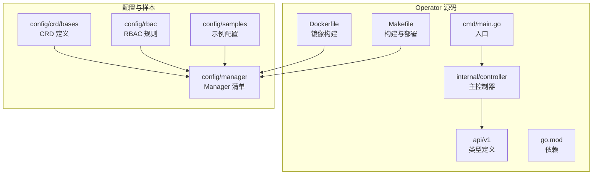
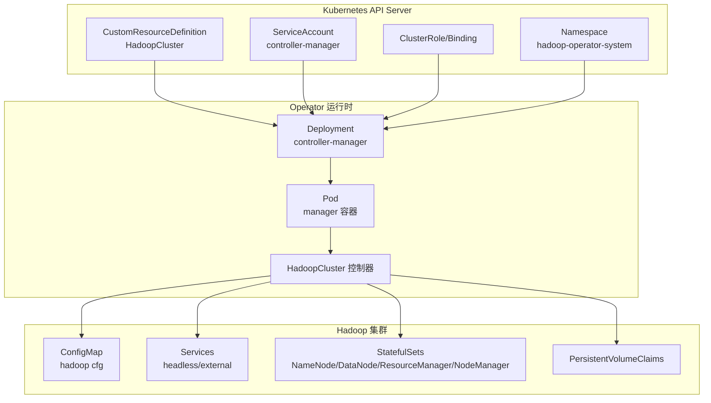
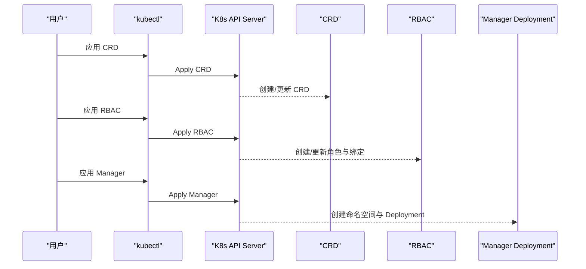
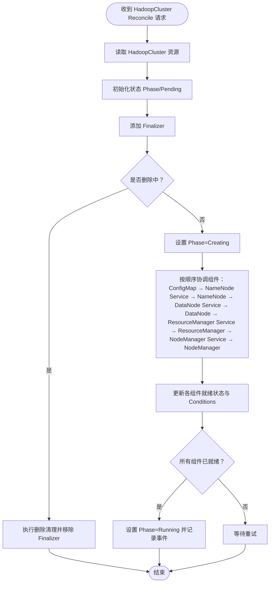
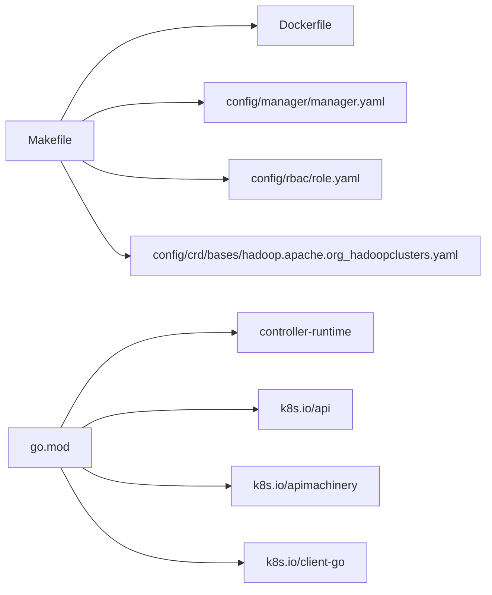

# 快速开始

<cite>
**本文引用的文件**
- [README.md](file://README.md)
- [main.go](file://cmd/main.go)
- [go.mod](file://go.mod)
- [Makefile](file://Makefile)
- [hadoopcluster_types.go](file://api/v1/hadoopcluster_types.go)
- [hadoop.apache.org_hadoopclusters.yaml](file://config/crd/bases/hadoop.apache.org_hadoopclusters.yaml)
- [manager.yaml](file://config/manager/manager.yaml)
- [role.yaml](file://config/rbac/role.yaml)
- [service_account.yaml](file://config/rbac/service_account.yaml)
- [hadoop_v1_hadoopcluster.yaml](file://config/samples/hadoop_v1_hadoopcluster.yaml)
- [hadoop_v1_hadoopcluster_ha.yaml](file://config/samples/hadoop_v1_hadoopcluster_ha.yaml)
- [offline-deployment.yaml](file://config/samples/offline-deployment.yaml)
- [hadoopcluster_controller.go](file://internal/controller/hadoopcluster_controller.go)
- [Dockerfile](file://Dockerfile)
</cite>

## 目录
1. [简介](#简介)
2. [项目结构](#项目结构)
3. [核心组件](#核心组件)
4. [架构总览](#架构总览)
5. [详细组件分析](#详细组件分析)
6. [依赖分析](#依赖分析)
7. [性能考虑](#性能考虑)
8. [故障排查指南](#故障排查指南)
9. [结论](#结论)
10. [附录](#附录)

## 简介
本指南面向首次接触 Apache Hadoop Operator v3 的用户，帮助你在 30 分钟内完成从环境准备、Operator 安装、Hadoop 集群部署到验证的全流程。内容涵盖：
- 前置要求与环境准备
- 两种安装方式：kubectl 部署与本地开发模式
- 基础与高可用部署的命令与配置要点
- 部署验证方法（集群状态、Pod 状态、UI 访问）
- 离线环境部署与镜像准备流程

## 项目结构
该仓库采用标准的 Kubebuilder 项目结构，核心目录与职责如下：
- api/v1：自定义资源 CRD 的 Go 类型定义
- cmd/main.go：Operator 入口，初始化控制器运行时、注册控制器与健康检查
- internal/controller：主控制器，负责 HadoopCluster 资源的协调与状态更新
- config：Kubernetes 清单与 RBAC、CRD、Manager 部署配置
- config/samples：示例 HadoopCluster 配置（基础与高可用、离线部署）
- hack/offline：离线部署相关脚本（镜像保存/加载/镜像清单）
- Dockerfile、Makefile、go.mod：构建、打包与依赖管理

图表来源
- [main.go:54-149](file://cmd/main.go#L54-L149)
- [hadoopcluster_controller.go:104-145](file://internal/controller/hadoopcluster_controller.go#L104-L145)
- [hadoopcluster_types.go:24-46](file://api/v1/hadoopcluster_types.go#L24-L46)

章节来源
- [README.md:233-251](file://README.md#L233-L251)

## 核心组件
- 自定义资源 CRD：HadoopCluster，定义了 HDFS 与 YARN 的完整配置模型，支持镜像、存储、服务暴露、高可用、监控等能力
- 主控制器：按顺序协调 ConfigMap、服务、StatefulSets 等资源，维护集群状态与就绪条件
- 运行时入口：初始化控制器运行时、健康检查、指标与 Webhook 服务器

章节来源
- [hadoopcluster_types.go:24-46](file://api/v1/hadoopcluster_types.go#L24-L46)
- [hadoopcluster_controller.go:104-145](file://internal/controller/hadoopcluster_controller.go#L104-L145)
- [main.go:97-142](file://cmd/main.go#L97-L142)

## 架构总览
Operator 通过 CRD 管理 Hadoop 集群生命周期，控制器根据 HadoopCluster 规格协调底层 Kubernetes 资源（ConfigMap、Services、StatefulSets、PVC）。

图表来源
- [manager.yaml:10-79](file://config/manager/manager.yaml#L10-L79)
- [role.yaml:1-100](file://config/rbac/role.yaml#L1-L100)
- [service_account.yaml:1-9](file://config/rbac/service_account.yaml#L1-L9)
- [hadoop.apache.org_hadoopclusters.yaml:1-411](file://config/crd/bases/hadoop.apache.org_hadoopclusters.yaml#L1-L411)
- [hadoopcluster_controller.go:230-238](file://internal/controller/hadoopcluster_controller.go#L230-L238)

## 详细组件分析

### 1) 前置要求与环境准备
- Kubernetes 版本：1.24+
- kubectl 已正确配置
- Helm 3.x（可选）

章节来源
- [README.md:17-22](file://README.md#L17-L22)

### 2) 安装 Operator（两种方式）

#### 方式一：使用 kubectl 部署
- 安装 CRD
- 安装 RBAC
- 部署 Manager（Deployment）

图表来源
- [hadoop.apache.org_hadoopclusters.yaml:1-411](file://config/crd/bases/hadoop.apache.org_hadoopclusters.yaml#L1-L411)
- [role.yaml:1-100](file://config/rbac/role.yaml#L1-L100)
- [service_account.yaml:1-9](file://config/rbac/service_account.yaml#L1-L9)
- [manager.yaml:10-79](file://config/manager/manager.yaml#L10-L79)

章节来源
- [README.md:23-36](file://README.md#L23-L36)

#### 方式二：本地开发模式（直接运行）
- 下载依赖
- 直接运行 Operator（无需打包镜像）

章节来源
- [README.md:38-50](file://README.md#L38-L50)
- [Makefile:65-67](file://Makefile#L65-L67)
- [go.mod:1-69](file://go.mod#L1-L69)

### 3) 部署 Hadoop 集群

#### 基础部署
- 应用基础示例配置，启动单副本 NameNode、DataNode、ResourceManager、NodeManager

章节来源
- [README.md:52-64](file://README.md#L52-L64)
- [hadoop_v1_hadoopcluster.yaml:1-80](file://config/samples/hadoop_v1_hadoopcluster.yaml#L1-L80)

#### 高可用部署
- 启用 NameNode HA 与 ResourceManager HA，配置 JournalNode 与反亲和性
- 支持外部或内置 ZooKeeper（示例中展示外部连接串）

章节来源
- [README.md:60-64](file://README.md#L60-L64)
- [hadoop_v1_hadoopcluster_ha.yaml:1-107](file://config/samples/hadoop_v1_hadoopcluster_ha.yaml#L1-L107)

#### 离线部署
- 准备离线镜像包、加载镜像至私有仓库或导入目标环境
- 配置镜像拉取 Secret，并在 HadoopCluster 中引用
- 应用离线示例配置

章节来源
- [README.md:84-126](file://README.md#L84-L126)
- [offline-deployment.yaml:1-135](file://config/samples/offline-deployment.yaml#L1-L135)

### 4) 部署验证

#### 集群状态检查
- 查看 HadoopCluster 列表与状态列
- 关注 Phase 与 Conditions

章节来源
- [README.md:66-82](file://README.md#L66-L82)
- [hadoopcluster_types.go:297-345](file://api/v1/hadoopcluster_types.go#L297-L345)

#### Pod 状态查看
- 通过标签选择器筛选对应集群的 Pods
- 关注 Ready 状态与重启次数

章节来源
- [README.md:72-73](file://README.md#L72-L73)

#### Web UI 访问
- NameNode UI：通过端口转发访问指定端口
- ResourceManager UI：通过端口转发访问指定端口

章节来源
- [README.md:75-81](file://README.md#L75-L81)

### 5) CRD 配置说明（摘要）
- 镜像配置：仓库、标签、拉取策略、拉取密钥
- HDFS：NameNode/DataNode 副本、资源、存储、服务类型与 NodePort 映射、HA 与 JournalNode
- YARN：ResourceManager/NodeManager 副本、资源、服务类型与 NodePort 映射、HA 与反亲和性
- 配置覆盖：core-site、hdfs-site、yarn-site、mapred-site、capacity-scheduler
- 监控：启用 Prometheus 指标与 ServiceMonitor

章节来源
- [README.md:128-229](file://README.md#L128-L229)
- [hadoopcluster_types.go:24-46](file://api/v1/hadoopcluster_types.go#L24-L46)
- [hadoopcluster_types.go:61-187](file://api/v1/hadoopcluster_types.go#L61-L187)
- [hadoopcluster_types.go:214-295](file://api/v1/hadoopcluster_types.go#L214-L295)

### 6) 控制器工作流（协调顺序）
控制器按固定顺序协调各组件，完成后更新集群状态与就绪条件。

图表来源
- [hadoopcluster_controller.go:60-145](file://internal/controller/hadoopcluster_controller.go#L60-L145)
- [hadoopcluster_controller.go:176-227](file://internal/controller/hadoopcluster_controller.go#L176-L227)

章节来源
- [hadoopcluster_controller.go:104-145](file://internal/controller/hadoopcluster_controller.go#L104-L145)
- [hadoopcluster_controller.go:169-174](file://internal/controller/hadoopcluster_controller.go#L169-L174)
- [hadoopcluster_controller.go:176-227](file://internal/controller/hadoopcluster_controller.go#L176-L227)

### 7) 构建与镜像（可选）
- 构建二进制与容器镜像
- 推送镜像至仓库

章节来源
- [README.md:253-274](file://README.md#L253-L274)
- [Makefile:61-78](file://Makefile#L61-L78)
- [Dockerfile:1-34](file://Dockerfile#L1-L34)

## 依赖分析
- 运行时依赖：controller-runtime、k8s API、client-go
- 版本约束：Go 1.21；Kubernetes 1.29.x（测试环境）
- Operator 与 Kubernetes API 的耦合点主要集中在 CRD、RBAC、Manager 清单与控制器逻辑

图表来源
- [Makefile:103-118](file://Makefile#L103-L118)
- [go.mod:5-10](file://go.mod#L5-L10)
- [manager.yaml:10-79](file://config/manager/manager.yaml#L10-L79)
- [role.yaml:1-100](file://config/rbac/role.yaml#L1-100)
- [hadoop.apache.org_hadoopclusters.yaml:1-411](file://config/crd/bases/hadoop.apache.org_hadoopclusters.yaml#L1-L411)

章节来源
- [go.mod:1-69](file://go.mod#L1-L69)
- [Makefile:103-118](file://Makefile#L103-L118)

## 性能考虑
- 资源请求与限制：合理设置内存与 CPU，避免过度分配导致调度失败
- 存储：根据数据规模配置 PVC 大小与 StorageClass，确保 I/O 性能满足需求
- 反亲和性：在 HA 模式下使用 Pod 反亲和性，提升容灾能力
- 监控：启用 Prometheus 指标有助于及时发现异常

## 故障排查指南
- Pod 启动失败：查看事件与日志，确认镜像拉取、资源配额与权限
- NameNode 格式化失败：检查 PVC 状态与存储后端，必要时进行强制格式化
- DataNode 无法连接 NameNode：检查网络连通性与配置
- 镜像拉取失败：确认私有仓库凭证与 Secret 配置

章节来源
- [README.md:276-318](file://README.md#L276-L318)

## 结论
通过本指南，你可以在 30 分钟内完成 Hadoop Operator v3 的安装与 Hadoop 集群的基础/高可用部署，并掌握验证方法。建议在生产环境中结合离线部署流程与监控体系，进一步提升稳定性与可观测性。

## 附录

### A. 快速命令清单（不含具体代码片段）
- 安装 CRD：应用 CRD YAML
- 安装 RBAC：应用 RBAC 清单
- 部署 Manager：应用 Manager 清单
- 本地运行：下载依赖后直接运行
- 基础集群：应用基础示例配置
- 高可用集群：应用高可用示例配置
- 离线镜像准备：保存/加载镜像，配置私有仓库与 Secret
- 验证：查看集群状态、Pod 状态、端口转发访问 UI

章节来源
- [README.md:23-126](file://README.md#L23-L126)