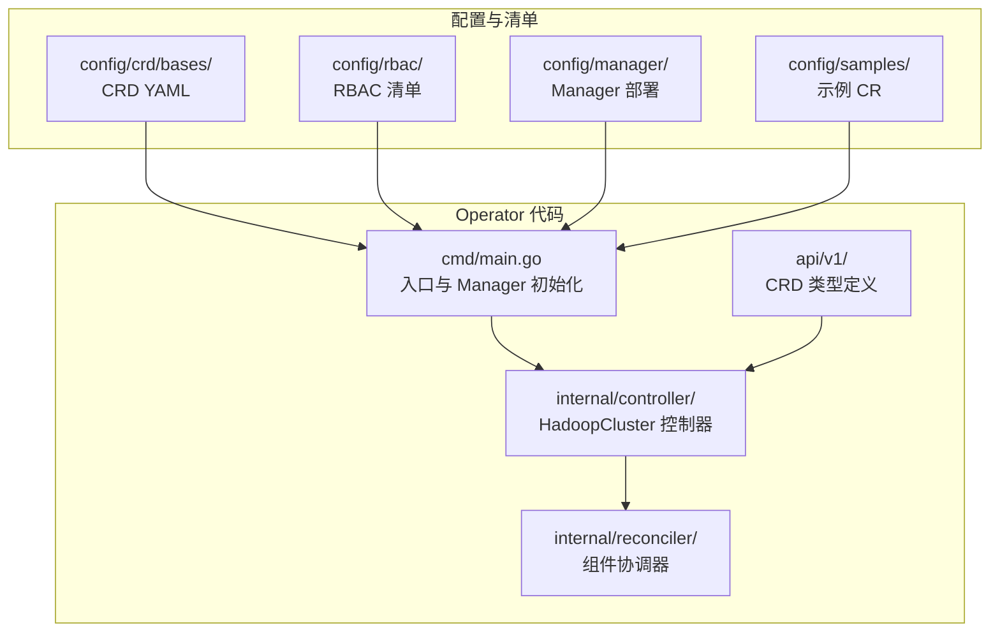
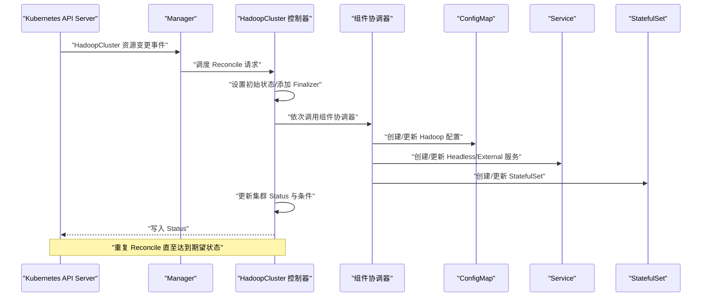
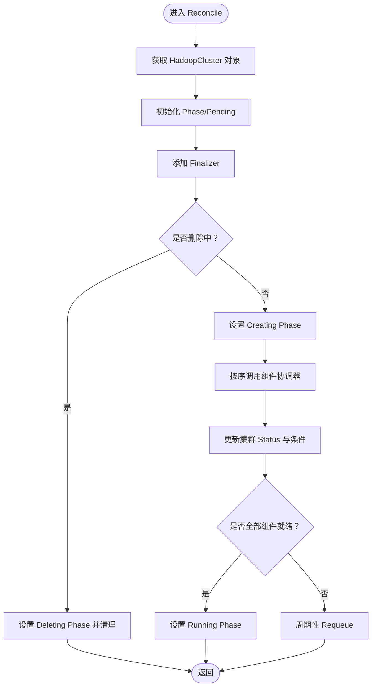
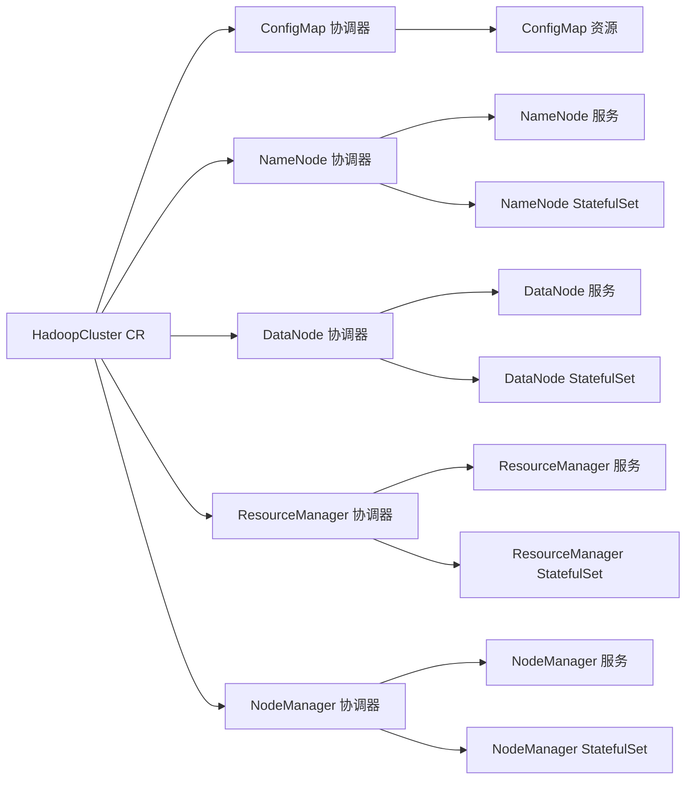
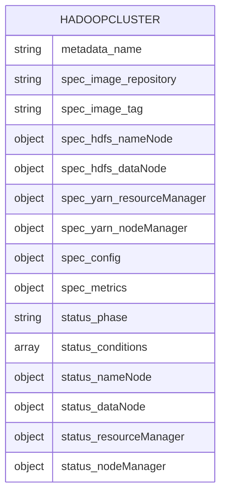
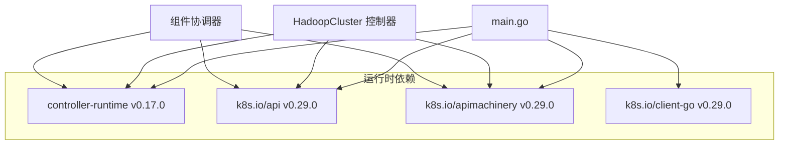

# 架构概览

<cite>
**本文档引用的文件**
- [main.go](file://hadoop-operator/cmd/main.go)
- [hadoopcluster_controller.go](file://hadoop-operator/internal/controller/hadoopcluster_controller.go)
- [hadoopcluster_types.go](file://hadoop-operator/api/v1/hadoopcluster_types.go)
- [configmap.go](file://hadoop-operator/internal/reconciler/configmap.go)
- [namenode.go](file://hadoop-operator/internal/reconciler/namenode.go)
- [datanode.go](file://hadoop-operator/internal/reconciler/datanode.go)
- [yarn.go](file://hadoop-operator/internal/reconciler/yarn.go)
- [hadoop.apache.org_hadoopclusters.yaml](file://hadoop-operator/config/crd/bases/hadoop.apache.org_hadoopclusters.yaml)
- [go.mod](file://hadoop-operator/go.mod)
- [README.md](file://hadoop-operator/README.md)
- [hadoop_v1_hadoopcluster.yaml](file://hadoop-operator/config/samples/hadoop_v1_hadoopcluster.yaml)
- [hadoop_v1_hadoopcluster_ha.yaml](file://hadoop-operator/config/samples/hadoop_v1_hadoopcluster_ha.yaml)
</cite>

## 目录
1. [简介](#简介)
2. [项目结构](#项目结构)
3. [核心组件](#核心组件)
4. [架构总览](#架构总览)
5. [详细组件分析](#详细组件分析)
6. [依赖关系分析](#依赖关系分析)
7. [性能考虑](#性能考虑)
8. [故障排查指南](#故障排查指南)
9. [结论](#结论)
10. [附录](#附录)

## 简介
本文件为 Apache Hadoop Operator v3 的架构概览文档，面向希望理解该 Operator 在 Kubernetes 上如何以声明式方式编排 Hadoop 集群（HDFS + YARN）的开发者与运维人员。文档从系统架构、控制器模式、组件协调器模式、数据流与状态管理等方面进行深入解析，并结合实际代码文件路径给出可视化图表，帮助读者快速掌握 Operator 的工作原理与扩展点。

## 项目结构
该项目采用典型的 Kubebuilder 项目结构，主要模块如下：
- api/v1：自定义资源类型定义（CRD），包含 HadoopCluster 的 Spec 与 Status 结构
- internal/controller：主控制器，负责监听 HadoopCluster 资源并触发协调流程
- internal/reconciler：组件协调器，按顺序创建/更新 ConfigMap、服务与 StatefulSet
- config：CRD、RBAC、Manager 部署清单与示例
- cmd/main.go：Operator 入口，初始化 Manager、注册控制器与健康检查
- go.mod：Go 依赖与版本约束

**图表来源**
- [main.go:54-149](file://hadoop-operator/cmd/main.go#L54-L149)
- [hadoopcluster_controller.go:230-239](file://hadoop-operator/internal/controller/hadoopcluster_controller.go#L230-L239)
- [hadoopcluster_types.go:397-413](file://hadoop-operator/api/v1/hadoopcluster_types.go#L397-L413)
- [hadoop.apache.org_hadoopclusters.yaml:1-200](file://hadoop-operator/config/crd/bases/hadoop.apache.org_hadoopclusters.yaml#L1-L200)

**章节来源**
- [README.md:233-251](file://hadoop-operator/README.md#L233-L251)
- [go.mod:1-69](file://hadoop-operator/go.mod#L1-L69)

## 核心组件
- 自定义资源 CRD：HadoopCluster，定义了 HDFS 与 YARN 的期望状态、镜像、存储、服务暴露、安全与监控等配置
- 主控制器 HadoopClusterReconciler：监听 HadoopCluster 资源变更，执行组件协调器序列，维护集群状态与条件
- 组件协调器：按序创建/更新 ConfigMap、服务与 StatefulSet，分别对应 HDFS NameNode/DataNode 与 YARN ResourceManager/NodeManager
- Manager：基于 controller-runtime，提供客户端、缓存、指标、健康检查与 Webhook 支持

**章节来源**
- [hadoopcluster_types.go:24-46](file://hadoop-operator/api/v1/hadoopcluster_types.go#L24-L46)
- [hadoopcluster_controller.go:41-46](file://hadoop-operator/internal/controller/hadoopcluster_controller.go#L41-L46)
- [configmap.go:43-68](file://hadoop-operator/internal/reconciler/configmap.go#L43-L68)
- [namenode.go:35-114](file://hadoop-operator/internal/reconciler/namenode.go#L35-L114)
- [datanode.go:34-113](file://hadoop-operator/internal/reconciler/datanode.go#L34-L113)
- [yarn.go:34-113](file://hadoop-operator/internal/reconciler/yarn.go#L34-L113)

## 架构总览
Operator 采用 Kubernetes Operator 模式，基于 controller-runtime 框架实现声明式状态管理。其核心工作流如下：
- Manager 启动后注册 HadoopCluster 控制器，控制器监听 HadoopCluster 资源事件
- Reconcile 循环中，控制器首先确保初始状态与 Finalizer 设置，然后按顺序调用各组件协调器
- 每个协调器负责生成并应用 ConfigMap、Headless/External Service 与 StatefulSet
- 控制器周期性更新集群 Status，记录各组件就绪状态与总体 Ready 条件
- 当所有组件就绪时，集群进入 Running 状态；删除时执行清理逻辑

**图表来源**
- [main.go:97-133](file://hadoop-operator/cmd/main.go#L97-L133)
- [hadoopcluster_controller.go:60-145](file://hadoop-operator/internal/controller/hadoopcluster_controller.go#L60-L145)
- [configmap.go:43-68](file://hadoop-operator/internal/reconciler/configmap.go#L43-L68)
- [namenode.go:35-114](file://hadoop-operator/internal/reconciler/namenode.go#L35-L114)
- [datanode.go:34-113](file://hadoop-operator/internal/reconciler/datanode.go#L34-L113)
- [yarn.go:34-113](file://hadoop-operator/internal/reconciler/yarn.go#L34-L113)

## 详细组件分析

### 控制器架构与 Reconcile 流程
- 角色职责：HadoopClusterReconciler 实现 Reconcile 方法，作为单一入口协调所有组件
- 关键步骤：
  - 获取并校验 HadoopCluster 实例
  - 初始化 Phase 与 Finalizer
  - 处理删除流程（设置 Deleting Phase 并移除 Finalizer）
  - 按顺序调用组件协调器（ConfigMap → NameNode Service → NameNode → DataNode Service → DataNode → ResourceManager Service → ResourceManager → NodeManager Service → NodeManager）
  - 更新 Status（各组件副本数、就绪数、Ready 条件）
  - 若全部组件就绪，更新 Phase 为 Running
  - 设置周期性 Requeue 以便持续监控

**图表来源**
- [hadoopcluster_controller.go:60-145](file://hadoop-operator/internal/controller/hadoopcluster_controller.go#L60-L145)
- [hadoopcluster_controller.go:149-167](file://hadoop-operator/internal/controller/hadoopcluster_controller.go#L149-L167)
- [hadoopcluster_controller.go:169-174](file://hadoop-operator/internal/controller/hadoopcluster_controller.go#L169-L174)
- [hadoopcluster_controller.go:176-227](file://hadoop-operator/internal/controller/hadoopcluster_controller.go#L176-L227)

**章节来源**
- [hadoopcluster_controller.go:41-46](file://hadoop-operator/internal/controller/hadoopcluster_controller.go#L41-L46)
- [hadoopcluster_controller.go:104-127](file://hadoop-operator/internal/controller/hadoopcluster_controller.go#L104-L127)

### 组件协调器模式与数据流
- 协调器接口：每个组件协调器函数签名一致，接收上下文与 HadoopCluster 实例，返回 Reconcile 结果与错误
- 数据流：
  - ConfigMap 协调器：根据 CR 中的 Spec 生成 Hadoop 配置（core-site、hdfs-site、yarn-site、mapred-site、capacity-scheduler），并注入 ZooKeeper 信息（若启用 HA）
  - NameNode 协调器：创建 Headless/External 服务与 StatefulSet，支持 HA 模式下的 JournalNode 与 ZK 集成
  - DataNode 协调器：创建 Headless/External 服务与 StatefulSet，包含等待 NameNode 就绪的 InitContainer
  - ResourceManager 协调器：创建 Headless/External 服务与 StatefulSet，支持 HA 模式
  - NodeManager 协调器：创建 Headless/External 服务与 StatefulSet，包含等待 ResourceManager 就绪的 InitContainer

**图表来源**
- [configmap.go:43-68](file://hadoop-operator/internal/reconciler/configmap.go#L43-L68)
- [namenode.go:35-114](file://hadoop-operator/internal/reconciler/namenode.go#L35-L114)
- [datanode.go:34-113](file://hadoop-operator/internal/reconciler/datanode.go#L34-L113)
- [yarn.go:34-113](file://hadoop-operator/internal/reconciler/yarn.go#L34-L113)

**章节来源**
- [configmap.go:70-209](file://hadoop-operator/internal/reconciler/configmap.go#L70-L209)
- [namenode.go:116-317](file://hadoop-operator/internal/reconciler/namenode.go#L116-L317)
- [datanode.go:115-321](file://hadoop-operator/internal/reconciler/datanode.go#L115-L321)
- [yarn.go:115-447](file://hadoop-operator/internal/reconciler/yarn.go#L115-L447)

### CRD 与声明式状态模型
- CRD 定义：HadoopCluster CRD 描述了 HDFS 与 YARN 的期望状态，包括镜像、资源、存储、服务、HA、安全与监控等字段
- 状态模型：Status 包含 Phase 与 Conditions，以及各组件的副本数与就绪数；控制器通过读取底层 StatefulSet/Service 状态回填 Status
- 打印列：CRD 定义了 Phase 与 Age 的打印列，便于 kubectl 查看

**图表来源**
- [hadoopcluster_types.go:24-46](file://hadoop-operator/api/v1/hadoopcluster_types.go#L24-L46)
- [hadoopcluster_types.go:297-315](file://hadoop-operator/api/v1/hadoopcluster_types.go#L297-L315)
- [hadoop.apache.org_hadoopclusters.yaml:28-200](file://hadoop-operator/config/crd/bases/hadoop.apache.org_hadoopclusters.yaml#L28-L200)

**章节来源**
- [hadoopcluster_types.go:397-413](file://hadoop-operator/api/v1/hadoopcluster_types.go#L397-L413)
- [hadoopcluster_types.go:317-345](file://hadoop-operator/api/v1/hadoopcluster_types.go#L317-L345)

### 关键设计决策与技术选型
- 选择 controller-runtime 框架的原因：
  - 提供成熟的 Manager 生命周期、客户端、缓存、指标与健康检查能力
  - 内置 RBAC 注解与 Scaffold，降低样板代码
  - 支持 Leader Election，便于多实例部署
- 声明式状态管理：
  - 使用 controllerutil.CreateOrUpdate 保证资源与期望状态一致
  - 通过 Status 字段记录观察到的状态，避免直接读取 Pod/容器细节
- 组件间通信机制：
  - 通过 Kubernetes Service 名称与端口进行组件发现（NameNode/ResourceManager 服务名在配置中生成）
  - HA 模式下通过 ZooKeeper 或内置 JournalNode 实现元数据同步
- 安全与监控：
  - 预留 Kerberos/TLS/Ranger 集成字段，便于企业级安全需求
  - 支持 Prometheus 监控与 ServiceMonitor

**章节来源**
- [main.go:97-119](file://hadoop-operator/cmd/main.go#L97-L119)
- [configmap.go:70-209](file://hadoop-operator/internal/reconciler/configmap.go#L70-L209)
- [namenode.go:35-114](file://hadoop-operator/internal/reconciler/namenode.go#L35-L114)
- [yarn.go:34-113](file://hadoop-operator/internal/reconciler/yarn.go#L34-L113)

### 架构演进历史与未来方向
- 历史演进：
  - 从基础的 HDFS + YARN 支持，逐步引入 HA（NameNode/ResourceManager）、ZooKeeper/JournalNode 集成、存储与亲和性配置
  - 引入 ConfigMap 生成器，统一 Hadoop 配置管理
  - 支持离线部署与私有镜像仓库，满足企业内网环境
- 未来方向（基于现有代码结构与 CRD 字段）：
  - 扩展安全集成：完善 Kerberos/TLS/Ranger 的自动化配置
  - 增强监控：支持更多 Exporter 与 ServiceMonitor 配置项
  - 存储与网络：支持更多 StorageClass 与网络策略
  - 运维能力：增加滚动升级、扩缩容策略与故障自愈

**章节来源**
- [README.md:1-14](file://hadoop-operator/README.md#L1-L14)
- [hadoopcluster_types.go:233-295](file://hadoop-operator/api/v1/hadoopcluster_types.go#L233-L295)

## 依赖关系分析
- 语言与框架：Go 1.21 + controller-runtime v0.17.0
- Kubernetes API：使用 apps/v1（StatefulSet）、core/v1（Service/ConfigMap/PVC）等
- 依赖注入与生命周期：Manager 负责启动控制器、注册健康检查与指标端点
- 组件耦合度：控制器与协调器通过接口解耦，协调器内部按组件拆分，职责清晰

**图表来源**
- [go.mod:5-10](file://hadoop-operator/go.mod#L5-L10)
- [main.go:19-40](file://hadoop-operator/cmd/main.go#L19-L40)

**章节来源**
- [go.mod:1-69](file://hadoop-operator/go.mod#L1-L69)

## 性能考虑
- Reconcile 频率：控制器默认每 30 秒 Requeue 一次，可根据集群规模调整
- 资源请求/限制：协调器为各组件设置了合理的 CPU/内存请求与限制，建议根据实际负载调优
- 存储与 IO：NameNode/DataNode 的 PVC 默认使用 ReadWriteOnce，建议结合 StorageClass 与拓扑策略优化 IO
- 探针与健康检查：各组件配置了 Liveness/Readiness 探针，有助于快速发现异常并触发重建

[本节为通用指导，无需特定文件引用]

## 故障排查指南
- 常见问题定位：
  - Pod 启动失败：查看 Pod 事件与日志，确认镜像拉取与权限
  - NameNode 格式化失败：检查 PVC 状态与初始化脚本输出
  - DataNode 无法连接 NameNode：检查服务连通性与配置
  - 镜像拉取失败：验证镜像存在与 Secret 配置
- 建议排查步骤：
  - 使用 kubectl describe 查看资源事件
  - 使用 kubectl logs 查看容器日志
  - 检查 HadoopCluster Status 与 Conditions
  - 验证 ConfigMap 中生成的配置是否符合预期

**章节来源**
- [README.md:276-318](file://hadoop-operator/README.md#L276-L318)

## 结论
Apache Hadoop Operator v3 通过 controller-runtime 框架实现了对 Hadoop 集群的声明式编排，采用“主控制器 + 组件协调器”的模式，将复杂的 HDFS/YARN 部署与运维任务抽象为可组合的协调器函数。CRD 提供了丰富的配置维度，配合 ConfigMap 生成器与 StatefulSet/Service 管理，能够稳定地在 Kubernetes 上交付生产级 Hadoop 集群。未来可在安全、监控与运维能力方面进一步增强，以满足更复杂的企业场景。

[本节为总结，无需特定文件引用]

## 附录
- 示例 CR：基础与 HA 配置样例，展示镜像、资源、存储、服务与 HA 等关键字段
- 部署与验证：提供 CRD 安装、RBAC、Manager 部署与基本验证命令

**章节来源**
- [hadoop_v1_hadoopcluster.yaml:1-80](file://hadoop-operator/config/samples/hadoop_v1_hadoopcluster.yaml#L1-L80)
- [hadoop_v1_hadoopcluster_ha.yaml:1-107](file://hadoop-operator/config/samples/hadoop_v1_hadoopcluster_ha.yaml#L1-L107)
- [README.md:23-82](file://hadoop-operator/README.md#L23-L82)