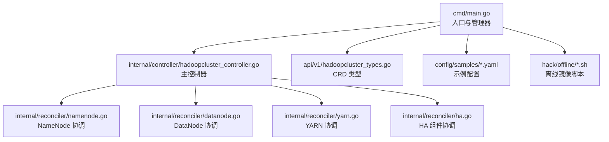
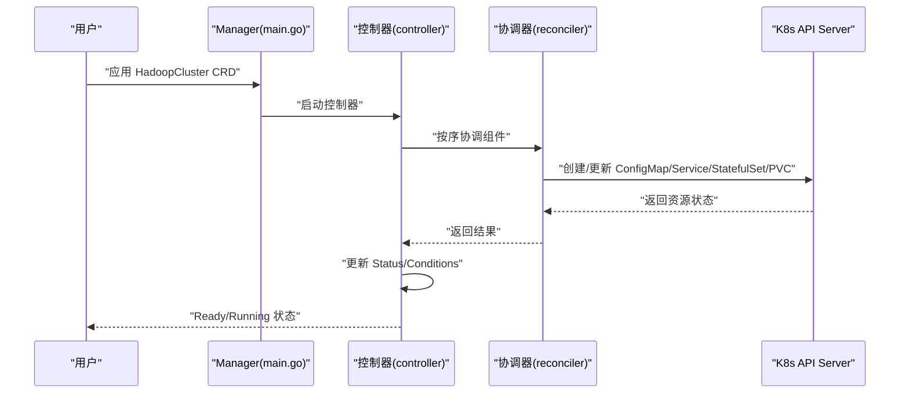
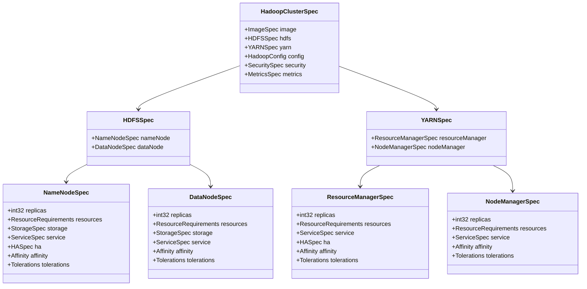
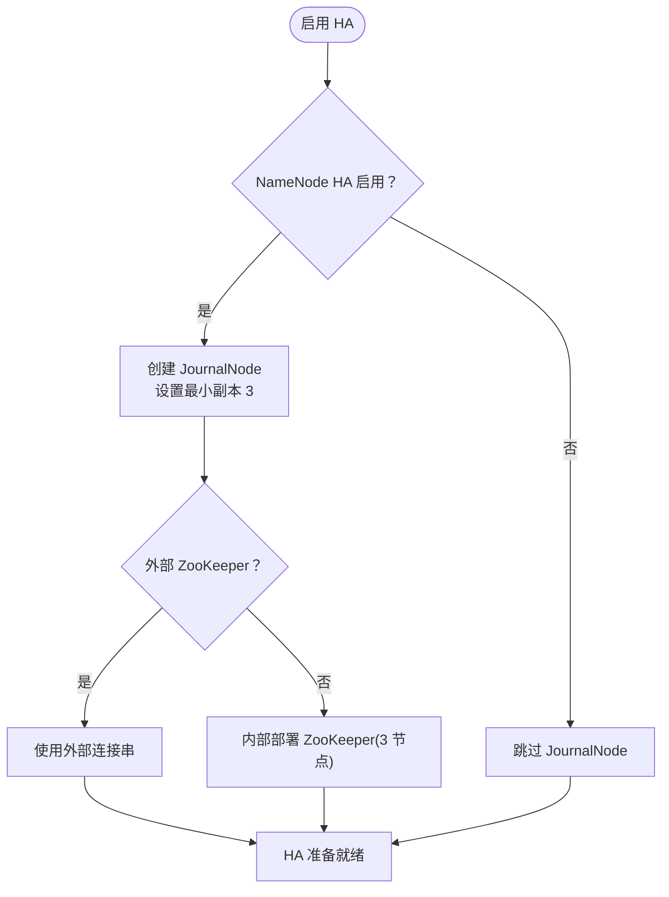
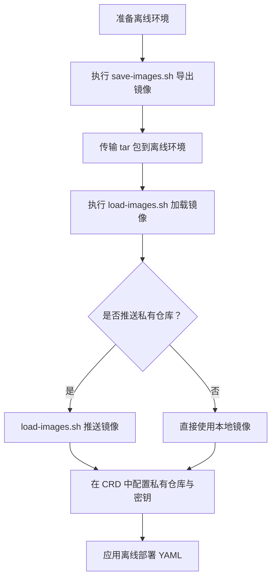
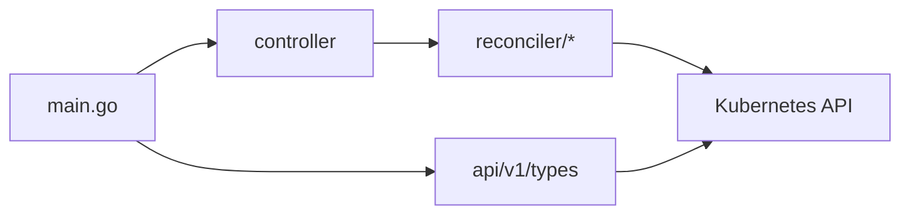

# 核心特性

<cite>
**本文引用的文件**
- [README.md](file://README.md)
- [hadoopcluster_types.go](file://api/v1/hadoopcluster_types.go)
- [main.go](file://cmd/main.go)
- [hadoopcluster_controller.go](file://internal/controller/hadoopcluster_controller.go)
- [namenode.go](file://internal/reconciler/namenode.go)
- [datanode.go](file://internal/reconciler/datanode.go)
- [yarn.go](file://internal/reconciler/yarn.go)
- [ha.go](file://internal/reconciler/ha.go)
- [hadoop_v1_hadoopcluster.yaml](file://config/samples/hadoop_v1_hadoopcluster.yaml)
- [hadoop_v1_hadoopcluster_ha.yaml](file://config/samples/hadoop_v1_hadoopcluster_ha.yaml)
- [offline-deployment.yaml](file://config/samples/offline-deployment.yaml)
- [save-images.sh](file://hack/offline/save-images.sh)
- [load-images.sh](file://hack/offline/load-images.sh)
- [go.mod](file://go.mod)
</cite>

## 目录
1. [简介](#简介)
2. [项目结构](#项目结构)
3. [核心组件](#核心组件)
4. [架构总览](#架构总览)
5. [详细组件分析](#详细组件分析)
6. [依赖关系分析](#依赖关系分析)
7. [性能考量](#性能考量)
8. [故障排查指南](#故障排查指南)
9. [结论](#结论)
10. [附录](#附录)

## 简介
本文件面向 Apache Hadoop Operator v3 的使用者与运维人员，系统性梳理其核心特性与实现要点，重点覆盖以下方面：
- 完整 Hadoop 组件支持：NameNode、DataNode、ResourceManager、NodeManager
- 高可用架构支持：NameNode HA、ResourceManager HA、JournalNode、ZooKeeper 协调
- 配置管理灵活性：通过 CRD 支持 Hadoop 配置覆盖与资源/存储/亲和性等参数
- 离线部署能力：镜像导出/导入脚本与私有仓库集成
- 监控集成：Prometheus 指标与 ServiceMonitor 支持
- 存储管理策略：PVC 动态卷与 StorageClass 配置
- 安全支持接口：Kerberos、TLS、Ranger 预留字段

同时提供特性对比表，帮助用户理解 Operator 相比传统 Hadoop 部署方式的优势。

## 项目结构
该项目采用标准的 Kubebuilder 项目布局，核心目录与职责如下：
- api/v1：CRD 类型定义（HadoopClusterSpec、HadoopClusterStatus 等）
- cmd/main.go：Operator 入口，初始化控制器、指标与健康检查
- internal/controller：主控制器，负责 HadoopCluster 资源的协调与状态更新
- internal/reconciler：各组件协调器（NameNode、DataNode、ResourceManager、NodeManager、HA）
- config/samples：示例 CRD 配置（基础、高可用、离线）
- hack/offline：离线部署镜像处理脚本
- go.mod：Go 依赖声明

图表来源
- [main.go:1-150](file://cmd/main.go#L1-L150)
- [hadoopcluster_controller.go:1-239](file://internal/controller/hadoopcluster_controller.go#L1-L239)
- [hadoopcluster_types.go:1-418](file://api/v1/hadoopcluster_types.go#L1-L418)
- [namenode.go:1-371](file://internal/reconciler/namenode.go#L1-L371)
- [datanode.go:1-331](file://internal/reconciler/datanode.go#L1-L331)
- [yarn.go:1-466](file://internal/reconciler/yarn.go#L1-L466)
- [ha.go:1-394](file://internal/reconciler/ha.go#L1-L394)

章节来源
- [README.md:233-251](file://README.md#L233-L251)
- [go.mod:1-69](file://go.mod#L1-L69)

## 核心组件
- CRD 类型与状态模型：HadoopClusterSpec 定义镜像、HDFS/YARN、配置覆盖、安全、监控等；HadoopClusterStatus 提供阶段与条件信息
- 主控制器：按顺序协调 ConfigMap、服务、StatefulSet/PVC，更新状态并记录事件
- 组件协调器：分别处理 NameNode、DataNode、ResourceManager、NodeManager 的服务与副本集创建/更新
- HA 组件协调器：根据配置决定是否启用内部 ZooKeeper 与 JournalNode，并进行相应资源创建

章节来源
- [hadoopcluster_types.go:24-46](file://api/v1/hadoopcluster_types.go#L24-L46)
- [hadoopcluster_controller.go:41-145](file://internal/controller/hadoopcluster_controller.go#L41-L145)
- [namenode.go:35-114](file://internal/reconciler/namenode.go#L35-L114)
- [datanode.go:34-113](file://internal/reconciler/datanode.go#L34-L113)
- [yarn.go:34-113](file://internal/reconciler/yarn.go#L34-L113)
- [ha.go:34-177](file://internal/reconciler/ha.go#L34-L177)

## 架构总览
Operator 以 CRD 为统一入口，控制器按顺序协调各组件，形成“期望状态”到“实际状态”的闭环。NameNode/ResourceManager/NodeManager 通过 StatefulSet 管理，DataNode 通过 StatefulSet 管理并挂载 PVC；HA 通过 JournalNode 与 ZooKeeper 协调。

图表来源
- [main.go:97-149](file://cmd/main.go#L97-L149)
- [hadoopcluster_controller.go:60-145](file://internal/controller/hadoopcluster_controller.go#L60-L145)
- [hadoopcluster_controller.go:104-127](file://internal/controller/hadoopcluster_controller.go#L104-L127)

## 详细组件分析

### Hadoop 组件支持
- NameNode：创建 Headless 与外部服务，StatefulSet 管理多副本，支持 HA 初始化脚本与探针
- DataNode：等待 NameNode 就绪后初始化权限，挂载 PVC，暴露数据与 Web 端口
- ResourceManager：Headless 与外部服务，支持 HA（至少 2 副本），探针校验 REST 接口
- NodeManager：等待 ResourceManager 就绪后启动，暴露 Web 端口，探针校验节点状态

图表来源
- [hadoopcluster_types.go:24-187](file://api/v1/hadoopcluster_types.go#L24-L187)

章节来源
- [hadoopcluster_types.go:24-187](file://api/v1/hadoopcluster_types.go#L24-L187)
- [namenode.go:116-317](file://internal/reconciler/namenode.go#L116-L317)
- [datanode.go:115-321](file://internal/reconciler/datanode.go#L115-L321)
- [yarn.go:115-447](file://internal/reconciler/yarn.go#L115-L447)

### 高可用架构支持
- NameNode HA：至少 2 个 NameNode 副本，JournalNode 至少 3 个（仲裁），可选外部 ZooKeeper
- ResourceManager HA：至少 2 个 ResourceManager 副本
- ZooKeeper：内部部署 3 节点，或使用外部连接串
- JournalNode：独立 StatefulSet，挂载 PVC，暴露 RPC/Web 端口

图表来源
- [hadoopcluster_types.go:92-120](file://api/v1/hadoopcluster_types.go#L92-L120)
- [ha.go:34-177](file://internal/reconciler/ha.go#L34-L177)
- [hadoop_v1_hadoopcluster_ha.yaml:12-88](file://config/samples/hadoop_v1_hadoopcluster_ha.yaml#L12-L88)

章节来源
- [hadoopcluster_types.go:92-120](file://api/v1/hadoopcluster_types.go#L92-L120)
- [ha.go:34-177](file://internal/reconciler/ha.go#L34-L177)
- [hadoop_v1_hadoopcluster_ha.yaml:12-88](file://config/samples/hadoop_v1_hadoopcluster_ha.yaml#L12-L88)

### 配置管理灵活性
- 镜像：仓库、标签、拉取策略、拉取密钥
- Hadoop 配置覆盖：core-site、hdfs-site、yarn-site、mapred-site、capacity-scheduler
- 资源：requests/limits（CPU/内存）
- 存储：大小、StorageClass、访问模式
- 服务：类型（ClusterIP/NodePort/LoadBalancer）、NodePort 映射、注解
- 亲和性与容忍度：反亲和性、拓扑键
- 监控：开启指标、导出器镜像、ServiceMonitor 标签与抓取间隔

章节来源
- [hadoopcluster_types.go:48-295](file://api/v1/hadoopcluster_types.go#L48-L295)
- [hadoop_v1_hadoopcluster.yaml:6-80](file://config/samples/hadoop_v1_hadoopcluster.yaml#L6-L80)
- [hadoop_v1_hadoopcluster_ha.yaml:6-107](file://config/samples/hadoop_v1_hadoopcluster_ha.yaml#L6-L107)
- [offline-deployment.yaml:6-135](file://config/samples/offline-deployment.yaml#L6-L135)

### 离线部署能力
- 镜像导出：脚本自动拉取并保存 apache/hadoop 与 zookeeper 镜像到 tar 包
- 镜像导入：从 tar 包加载镜像，可选推送至私有仓库
- 私有仓库集成：在 CRD 中配置镜像仓库、标签与拉取密钥

图表来源
- [save-images.sh:1-66](file://hack/offline/save-images.sh#L1-L66)
- [load-images.sh:1-75](file://hack/offline/load-images.sh#L1-L75)
- [offline-deployment.yaml:6-135](file://config/samples/offline-deployment.yaml#L6-L135)

章节来源
- [save-images.sh:1-66](file://hack/offline/save-images.sh#L1-L66)
- [load-images.sh:1-75](file://hack/offline/load-images.sh#L1-L75)
- [offline-deployment.yaml:6-135](file://config/samples/offline-deployment.yaml#L6-L135)

### 监控集成
- 指标开关与导出器镜像：在 CRD 中启用 metrics 并指定导出器镜像
- ServiceMonitor：可选创建，匹配 Prometheus 实例标签
- 探针：NameNode/ResourceManager/DataNode/NodeManager 均配置健康检查与就绪检查

章节来源
- [hadoopcluster_types.go:273-295](file://api/v1/hadoopcluster_types.go#L273-L295)
- [hadoop_v1_hadoopcluster_ha.yaml:101-107](file://config/samples/hadoop_v1_hadoopcluster_ha.yaml#L101-L107)
- [namenode.go:235-254](file://internal/reconciler/namenode.go#L235-L254)
- [yarn.go:189-208](file://internal/reconciler/yarn.go#L189-L208)
- [datanode.go:249-268](file://internal/reconciler/datanode.go#L249-L268)
- [yarn.go:396-415](file://internal/reconciler/yarn.go#L396-L415)

### 存储管理策略
- PVC 动态卷：NameNode/DataNode/JournalNode 均通过 VolumeClaimTemplates 创建 PVC
- StorageClass：可配置 StorageClass 名称与访问模式
- 大小：默认值在协调器中设定，可在 CRD 中覆盖

章节来源
- [hadoopcluster_types.go:189-199](file://api/v1/hadoopcluster_types.go#L189-L199)
- [namenode.go:292-307](file://internal/reconciler/namenode.go#L292-L307)
- [datanode.go:296-311](file://internal/reconciler/datanode.go#L296-L311)
- [ha.go:338-353](file://internal/reconciler/ha.go#L338-L353)

### 安全支持接口
- Kerberos：启用、域、KDC、管理员服务器、Keytab Secret
- TLS：启用、证书 Secret
- Ranger：启用、管理地址
- 注：当前版本为预留字段，具体集成需后续扩展

章节来源
- [hadoopcluster_types.go:233-271](file://api/v1/hadoopcluster_types.go#L233-L271)

## 依赖关系分析
- 控制器依赖：controller-runtime、Kubernetes API、客户端库
- CRD 类型：依赖 Kubernetes API 类型（如 ResourceRequirements、ServiceType 等）
- 组件协调器：依赖 controllerutil、Pod/Service/StatefulSet/PVC 等资源对象

图表来源
- [main.go:37-51](file://cmd/main.go#L37-L51)
- [hadoopcluster_controller.go:37-39](file://internal/controller/hadoopcluster_controller.go#L37-L39)
- [hadoopcluster_types.go:19-22](file://api/v1/hadoopcluster_types.go#L19-L22)

章节来源
- [go.mod:5-10](file://go.mod#L5-L10)
- [main.go:37-51](file://cmd/main.go#L37-L51)
- [hadoopcluster_controller.go:37-39](file://internal/controller/hadoopcluster_controller.go#L37-L39)

## 性能考量
- 资源配额：建议在 CRD 中显式设置 requests/limits，避免默认值不足导致调度失败或 OOM
- 存储 I/O：DataNode/NameNode/JournalNode 的 PVC 大小与 StorageClass 影响吞吐与延迟
- 探针频率：健康/就绪探针周期影响控制器轮询与 Pod 重启风险，应结合集群规模调整
- HA 组件：JournalNode/ZooKeeper 的资源与副本数直接影响 NameNode/ResourceManager 的切换时间

## 故障排查指南
- Pod 启动失败：查看 Pod 事件与上一次容器日志
- NameNode 格式化失败：检查 PVC 状态与手动格式化命令
- DataNode 无法连接 NameNode：使用网络探测确认端口可达与配置正确
- 镜像拉取失败：验证私有仓库凭据与镜像存在性

章节来源
- [README.md:276-318](file://README.md#L276-L318)

## 结论
Hadoop Operator v3 通过 CRD 将 Hadoop 集群的部署、扩缩容与升级抽象为声明式资源，配合控制器实现自动化编排。其核心优势在于：
- 组件覆盖全面且可组合
- HA 机制内置，降低运维复杂度
- 配置灵活，适配多样化环境
- 离线部署友好，支持私有仓库与镜像迁移
- 监控与存储策略可插拔

## 附录

### 特性对比表（Operator vs 传统部署）
- 组件支持
  - Operator：NameNode、DataNode、ResourceManager、NodeManager（含 HA）
  - 传统：手工安装与配置，需自行维护高可用与扩缩容
- 高可用
  - Operator：内置 JournalNode、ZooKeeper（可选外部）与 HA 副本策略
  - 传统：需手动搭建与同步，复杂度高
- 配置管理
  - Operator：CRD 一次性声明，支持配置覆盖与资源/存储/亲和性
  - 传统：分散在多处配置文件，易遗漏或不一致
- 离线部署
  - Operator：提供镜像导出/导入脚本与私有仓库集成
  - 传统：需提前准备镜像与网络策略
- 监控集成
  - Operator：指标与 ServiceMonitor 可选启用
  - 传统：需额外配置 Exporter 与监控系统
- 存储管理
  - Operator：PVC 动态卷与 StorageClass 配置
  - 传统：需预先规划与挂载磁盘
- 安全支持
  - Operator：Kerberos/TLS/Ranger 预留字段
  - 传统：需自行集成安全组件

章节来源
- [README.md:5-13](file://README.md#L5-L13)
- [hadoopcluster_types.go:233-271](file://api/v1/hadoopcluster_types.go#L233-L271)