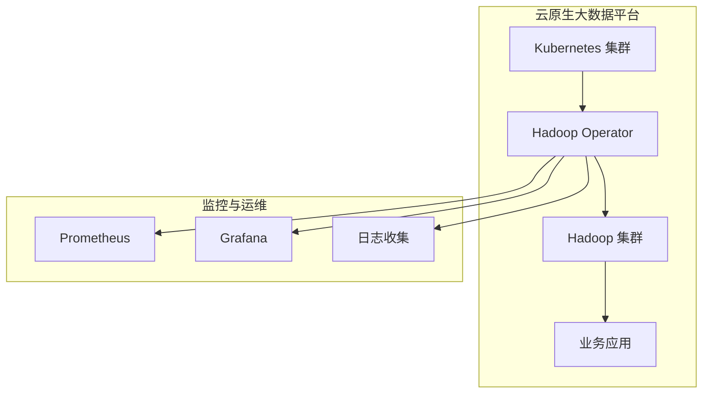
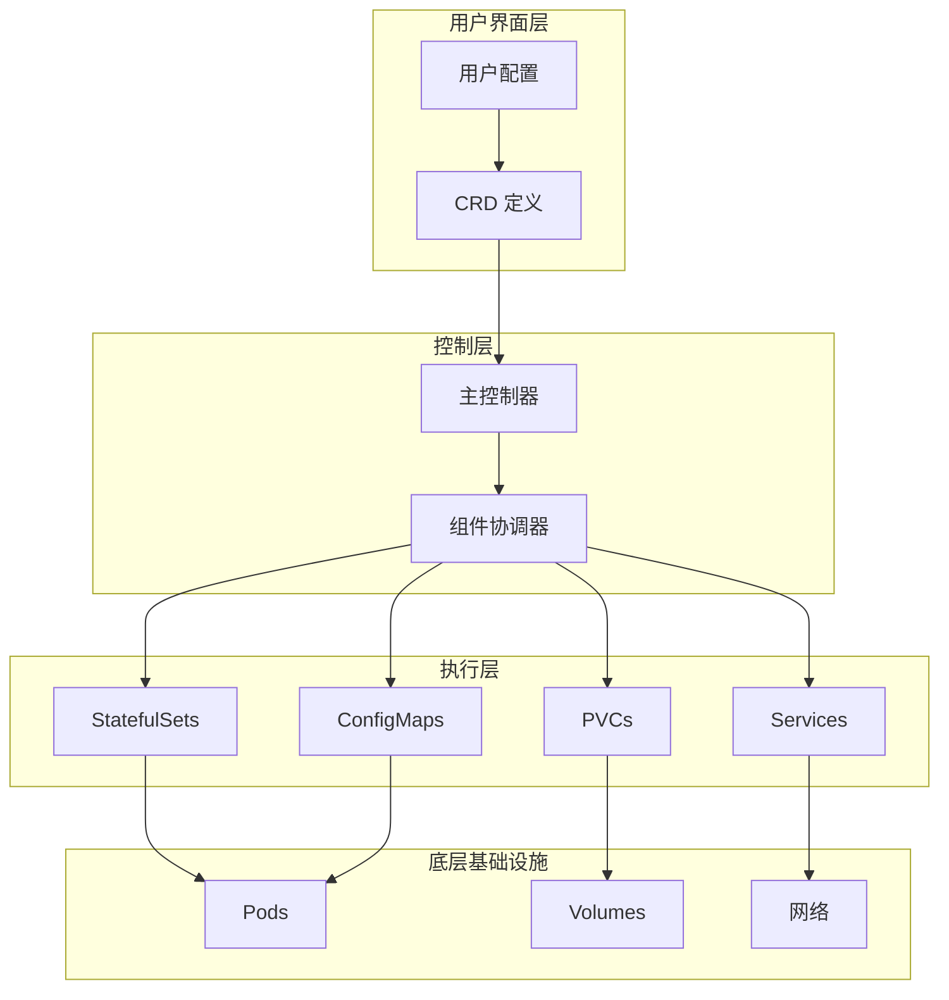
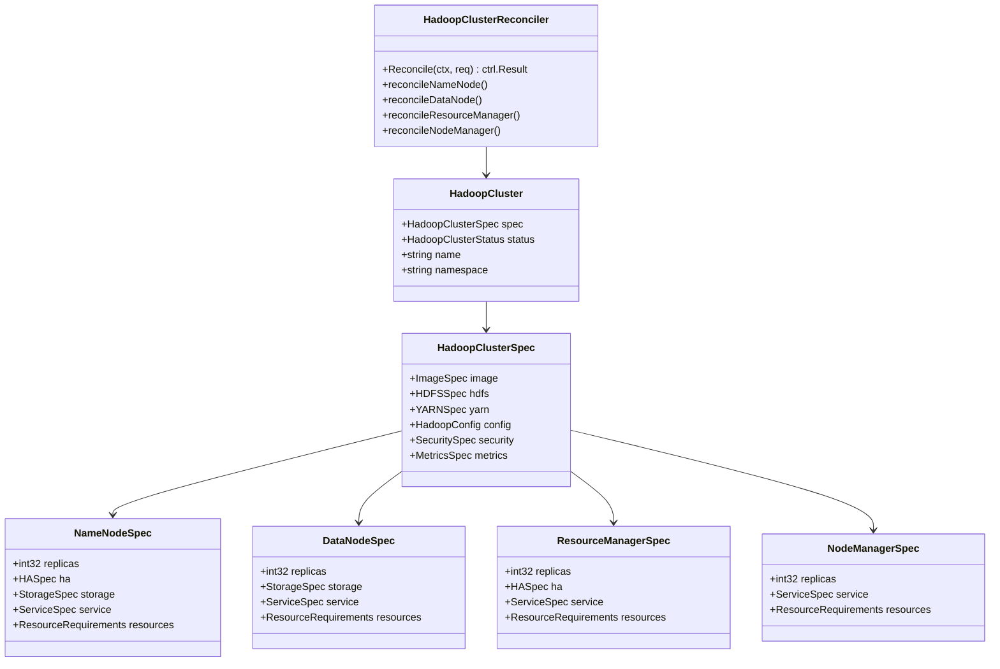
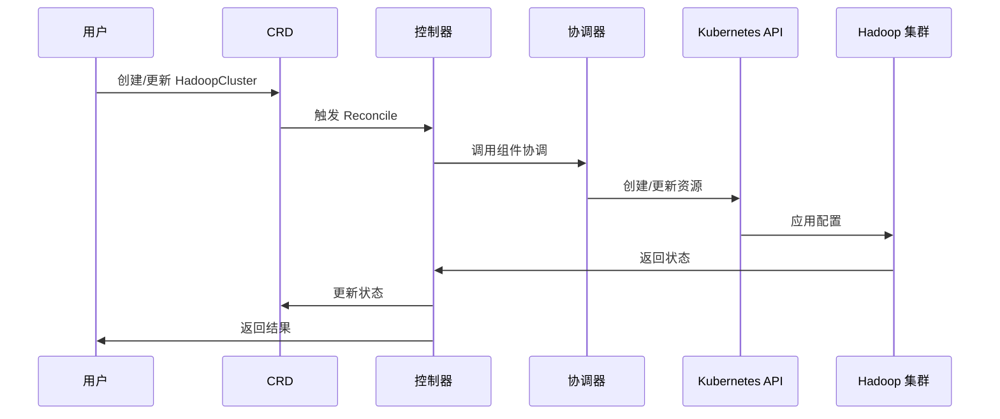
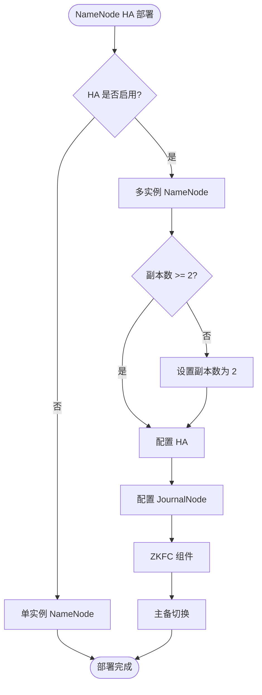
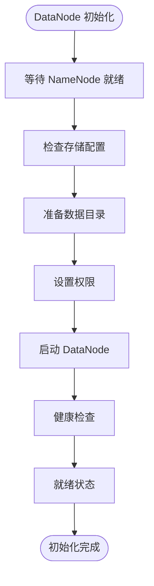
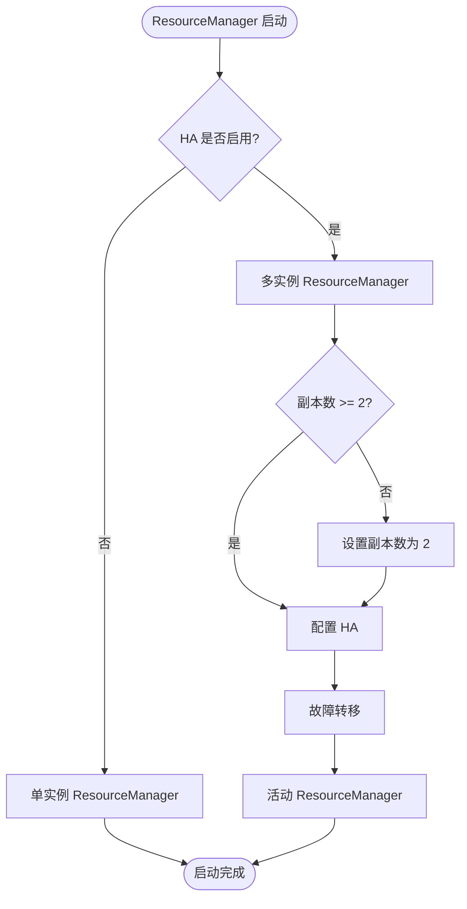
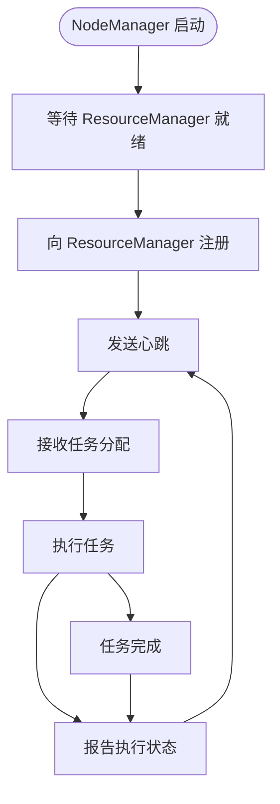
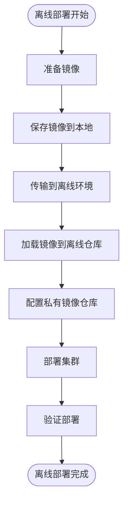

# 项目介绍

<cite>
**本文档引用的文件**
- [README.md](file://hadoop-operator/README.md)
- [main.go](file://hadoop-operator/cmd/main.go)
- [hadoopcluster_types.go](file://hadoop-operator/api/v1/hadoopcluster_types.go)
- [hadoopcluster_controller.go](file://hadoop-operator/internal/controller/hadoopcluster_controller.go)
- [namenode.go](file://hadoop-operator/internal/reconciler/namenode.go)
- [datanode.go](file://hadoop-operator/internal/reconciler/datanode.go)
- [yarn.go](file://hadoop-operator/internal/reconciler/yarn.go)
- [hadoop_v1_hadoopcluster.yaml](file://hadoop-operator/config/samples/hadoop_v1_hadoopcluster.yaml)
- [hadoop_v1_hadoopcluster_ha.yaml](file://hadoop-operator/config/samples/hadoop_v1_hadoopcluster_ha.yaml)
- [hadoop.apache.org_hadoopclusters.yaml](file://hadoop-operator/config/crd/bases/hadoop.apache.org_hadoopclusters.yaml)
- [Dockerfile](file://hadoop-operator/Dockerfile)
- [Makefile](file://hadoop-operator/Makefile)
- [go.mod](file://hadoop-operator/go.mod)
</cite>

## 目录
1. [引言](#引言)
2. [项目概述](#项目概述)
3. [核心价值主张](#核心价值主张)
4. [设计理念](#设计理念)
5. [技术架构](#技术架构)
6. [组件详解](#组件详解)
7. [部署与使用](#部署与使用)
8. [离线部署能力](#离线部署能力)
9. [监控与可观测性](#监控与可观测性)
10. [安全特性](#安全特性)
11. [性能考量](#性能考量)
12. [故障排查指南](#故障排查指南)
13. [结论](#结论)

## 引言

Apache Hadoop Operator v3 是一个专为 Kubernetes 设计的生产级大数据平台管理工具。该项目旨在简化 Hadoop 集群在容器化环境中的部署、管理和运维工作，为现代云原生架构提供可靠的大数据基础设施解决方案。

## 项目概述

### 项目定位

Apache Hadoop Operator v3 是 Apache 软件基金会官方维护的 Kubernetes Operator 项目，专门用于在 Kubernetes 平台上自动化管理 Hadoop 生态系统的完整生命周期。该版本代表了项目在功能完整性、稳定性和企业级特性的重大升级。

### 核心特性

- **完整的 Hadoop 生态系统支持**：涵盖 HDFS 和 YARN 的所有核心组件
- **高可用性架构**：内置 NameNode 和 ResourceManager 的高可用部署能力
- **灵活的配置管理**：通过 CRD 提供细粒度的参数定制
- **企业级部署能力**：支持离线环境和私有镜像仓库
- **监控集成**：原生支持 Prometheus 监控指标收集
- **存储管理**：支持动态 PVC 和多种 StorageClass 配置
- **安全扩展**：预留 Kerberos、TLS、Ranger 等安全集成接口

## 核心价值主张

### 为什么需要 Kubernetes Operator 管理 Hadoop？

传统 Hadoop 部署方式存在以下挑战：
- **复杂的手工配置**：需要大量手动配置和调优
- **运维成本高昂**：缺乏自动化运维工具
- **资源利用率低**：难以实现资源的弹性伸缩
- **故障恢复困难**：集群故障后的恢复过程复杂
- **版本升级困难**：Hadoop 版本升级影响面广且风险高

Apache Hadoop Operator v3 通过以下方式解决这些问题：

1. **声明式配置**：通过 CRD 描述期望状态，Operator 自动实现
2. **自动化运维**：内置健康检查、故障检测和自动恢复机制
3. **资源优化**：基于 Kubernetes 资源调度实现弹性伸缩
4. **标准化流程**：提供一致的部署、升级和运维流程
5. **可观测性**：内置监控和日志收集能力

### 云原生生态系统中的定位

在云原生大数据生态中，Apache Hadoop Operator v3 扮演着关键角色：



**图表来源**
- [hadoopcluster_controller.go:105-115](file://hadoop-operator/internal/controller/hadoopcluster_controller.go#L105-L115)
- [hadoopcluster_types.go:24-46](file://hadoop-operator/api/v1/hadoopcluster_types.go#L24-L46)

## 设计理念

### 声明式管理

项目采用 Kubernetes 原生的声明式管理模式，通过自定义资源定义（CRD）描述 Hadoop 集群的期望状态。Operator 监控这些资源的变化，并自动调整实际状态以匹配期望状态。

### 分层架构设计



**图表来源**
- [main.go:119-133](file://hadoop-operator/cmd/main.go#L119-L133)
- [hadoopcluster_controller.go:104-127](file://hadoop-operator/internal/controller/hadoopcluster_controller.go#L104-L127)

### 组件化设计

每个 Hadoop 组件都有独立的协调器负责其生命周期管理：
- **NameNode 协调器**：管理 NameNode 的初始化、启动和高可用配置
- **DataNode 协调器**：管理 DataNode 的存储配置和节点发现
- **ResourceManager 协调器**：管理 ResourceManager 的高可用和资源分配
- **NodeManager 协调器**：管理 NodeManager 的任务执行和资源监控

## 技术架构

### 核心组件关系



**图表来源**
- [hadoopcluster_types.go:24-46](file://hadoop-operator/api/v1/hadoopcluster_types.go#L24-L46)
- [hadoopcluster_controller.go:42-46](file://hadoop-operator/internal/controller/hadoopcluster_controller.go#L42-L46)

### 控制循环流程



**图表来源**
- [hadoopcluster_controller.go:60-145](file://hadoop-operator/internal/controller/hadoopcluster_controller.go#L60-L145)

## 组件详解

### NameNode 组件

NameNode 是 HDFS 的核心组件，负责管理文件系统的命名空间和数据块映射。在 Kubernetes 中，NameNode 通过 StatefulSet 进行管理，确保稳定的网络标识和持久化存储。

#### 高可用配置



**图表来源**
- [namenode.go:125-129](file://hadoop-operator/internal/reconciler/namenode.go#L125-L129)
- [hadoopcluster_types.go:92-102](file://hadoop-operator/api/v1/hadoopcluster_types.go#L92-L102)

#### 存储配置

NameNode 使用 PersistentVolumeClaim 进行数据持久化，支持多种存储后端：
- **本地存储**：适用于开发和测试环境
- **网络存储**：如 NFS、Ceph 等分布式存储
- **云存储**：AWS EBS、GCE PD 等云原生存储

### DataNode 组件

DataNode 负责存储实际的数据块，是 HDFS 的数据存储节点。在 Kubernetes 中，DataNode 通过 StatefulSet 管理，确保数据的可靠存储和访问。

#### 初始化流程



**图表来源**
- [datanode.go:178-221](file://hadoop-operator/internal/reconciler/datanode.go#L178-L221)

### ResourceManager 组件

ResourceManager 是 YARN 的资源管理器，负责集群资源的统一管理和调度。在 Kubernetes 中，ResourceManager 支持高可用配置，确保资源调度服务的连续性。

#### 资源管理策略



**图表来源**
- [yarn.go:119-127](file://hadoop-operator/internal/reconciler/yarn.go#L119-L127)

### NodeManager 组件

NodeManager 运行在每个计算节点上，负责单个节点上的资源管理和任务执行。它与 ResourceManager 协作，实现集群范围的任务调度。

#### 任务执行流程



**图表来源**
- [yarn.go:361-376](file://hadoop-operator/internal/reconciler/yarn.go#L361-L376)

## 部署与使用

### 快速开始

项目提供了多种部署方式，满足不同环境的需求：

#### 基础部署

```bash
# 安装 CRD
kubectl apply -f config/crd/bases/hadoop.apache.org_hadoopclusters.yaml

# 安装 RBAC
kubectl apply -f config/rbac/

# 部署 Operator
kubectl apply -f config/manager/manager.yaml

# 部署示例集群
kubectl apply -f config/samples/hadoop_v1_hadoopcluster.yaml
```

#### 高可用部署

```bash
# 部署高可用集群配置
kubectl apply -f config/samples/hadoop_v1_hadoopcluster_ha.yaml
```

### 配置管理

通过 HadoopCluster CRD 可以灵活配置各种参数：

#### 基础配置示例

```yaml
apiVersion: hadoop.apache.org/v1
kind: HadoopCluster
metadata:
  name: hadoop-sample
spec:
  image:
    repository: apache/hadoop
    tag: "3.3.6"
    pullPolicy: IfNotPresent
  
  hdfs:
    nameNode:
      replicas: 1
      resources:
        requests:
          memory: "2Gi"
          cpu: "500m"
        limits:
          memory: "4Gi"
          cpu: "1000m"
      storage:
        size: "50Gi"
        storageClassName: standard
      service:
        type: NodePort
        nodePorts:
          web: 30070
          rpc: 30090
    
    dataNode:
      replicas: 3
      resources:
        requests:
          memory: "2Gi"
          cpu: "500m"
        limits:
          memory: "4Gi"
          cpu: "1000m"
      storage:
        size: "200Gi"
        storageClassName: standard
```

**章节来源**
- [hadoop_v1_hadoopcluster.yaml:1-80](file://hadoop-operator/config/samples/hadoop_v1_hadoopcluster.yaml#L1-L80)

## 离线部署能力

### 离线环境部署流程

对于无法访问公网的企业环境，项目提供了完整的离线部署方案：



**图表来源**
- [README.md:84-127](file://hadoop-operator/README.md#L84-L127)

### 镜像管理

项目提供了完整的镜像管理工具链：

1. **镜像准备**：使用 `save-images.sh` 脚本导出所需镜像
2. **离线传输**：通过压缩包传输到离线环境
3. **镜像加载**：使用 `load-images.sh` 脚本加载镜像
4. **仓库配置**：配置镜像拉取凭据和私有仓库

**章节来源**
- [README.md:84-127](file://hadoop-operator/README.md#L84-L127)

## 监控与可观测性

### Prometheus 集成

项目原生支持 Prometheus 监控，提供丰富的指标收集能力：

#### 监控指标类型

| 指标类别 | 指标名称 | 描述 |
|---------|----------|------|
| HDFS | dfs_capacity_used | 已使用容量 |
| HDFS | dfs_capacity_remaining | 剩余容量 |
| HDFS | dfs_num_files | 文件数量 |
| YARN | yarn_cluster_nodes | 节点总数 |
| YARN | yarn_cluster_containers | 容器总数 |
| YARN | yarn_cluster_memory_used | 已用内存 |
| YARN | yarn_cluster_cores_used | 已用核心数 |

### ServiceMonitor 配置

```yaml
metrics:
  enabled: true
  serviceMonitor:
    enabled: true
    labels:
      release: prometheus
```

**章节来源**
- [hadoopcluster_types.go:273-295](file://hadoop-operator/api/v1/hadoopcluster_types.go#L273-L295)

## 安全特性

### 多层次安全设计

项目预留了多种安全集成接口，支持企业级安全需求：

#### Kerberos 集成

```yaml
security:
  kerberos:
    enabled: true
    realm: "EXAMPLE.COM"
    kdc: "kdc.example.com"
    adminServer: "kdc.example.com"
    keytabSecret: "hadoop-keytab"
```

#### TLS 支持

```yaml
security:
  tls:
    enabled: true
    certificateSecret: "hadoop-tls-cert"
```

#### Ranger 集成

```yaml
security:
  ranger:
    enabled: true
    adminURL: "https://ranger.example.com:6080"
```

**章节来源**
- [hadoopcluster_types.go:233-272](file://hadoop-operator/api/v1/hadoopcluster_types.go#L233-L272)

## 性能考量

### 资源优化策略

项目在设计时充分考虑了性能优化：

#### 资源请求与限制

每个组件都设置了合理的默认资源配额：
- **NameNode**：建议至少 4Gi 内存和 2 核 CPU
- **DataNode**：建议至少 4Gi 内存和 2 核 CPU
- **ResourceManager**：建议至少 4Gi 内存和 2 核 CPU
- **NodeManager**：建议至少 4Gi 内存和 2 核 CPU

#### 存储性能优化

- **JournalNode**：建议使用高性能存储，如 SSD
- **NameNode**：建议使用本地 SSD 存储
- **DataNode**：建议使用大容量 HDD 存储

### 高可用性能

HA 配置对性能的影响：
- **NameNode HA**：增加 JournalNode 同步开销，但提供更好的可用性
- **ResourceManager HA**：增加故障切换时间，但提高调度可靠性
- **网络延迟**：跨机房部署会增加网络延迟

## 故障排查指南

### 常见问题诊断

#### NameNode 启动失败

```bash
# 检查 Pod 状态
kubectl get pods -l app=hadoop-namenode

# 查看详细日志
kubectl logs <namenode-pod> --previous

# 检查存储状态
kubectl get pvc -l app=hadoop-namenode
```

#### DataNode 连接问题

```bash
# 检查 NameNode 服务
kubectl get svc <cluster-name>-namenode

# 测试网络连通性
kubectl exec -it <datanode-pod> -- nc -zv <namenode-service> 9000
```

#### 资源不足问题

```bash
# 检查节点资源
kubectl describe nodes

# 检查 Pod 调度
kubectl describe pod <pod-name>

# 检查资源配额
kubectl get resourcequotas
```

### 日志收集

项目提供了完善的日志收集机制：
- **容器日志**：通过 `kubectl logs` 收集
- **系统日志**：通过 DaemonSet 收集节点日志
- **应用日志**：通过 Sidecar 容器收集应用日志

**章节来源**
- [README.md:276-318](file://hadoop-operator/README.md#L276-L318)

## 结论

Apache Hadoop Operator v3 代表了大数据平台容器化转型的重要里程碑。通过提供生产级的 Kubernetes 原生管理能力，该项目为企业数字化转型提供了坚实的技术基础。

### 项目优势总结

1. **企业级可靠性**：经过严格测试和验证，适合生产环境使用
2. **完整的功能覆盖**：支持 Hadoop 生态系统的所有核心组件
3. **灵活的配置选项**：通过 CRD 提供细粒度的配置能力
4. **优秀的运维体验**：自动化程度高，降低运维复杂度
5. **强大的扩展性**：支持多种存储、网络和安全配置

### 未来发展方向

随着云原生技术的不断发展，Apache Hadoop Operator v3 将继续演进：
- **增强的 AI/ML 集成**：更好地支持机器学习工作负载
- **边缘计算支持**：扩展到边缘部署场景
- **多云兼容性**：提供更好的多云部署能力
- **自动化运维**：进一步提升自动化水平

该项目不仅是一个技术工具，更是推动大数据平台现代化转型的重要推动力量，为构建下一代云原生大数据平台奠定了坚实基础。