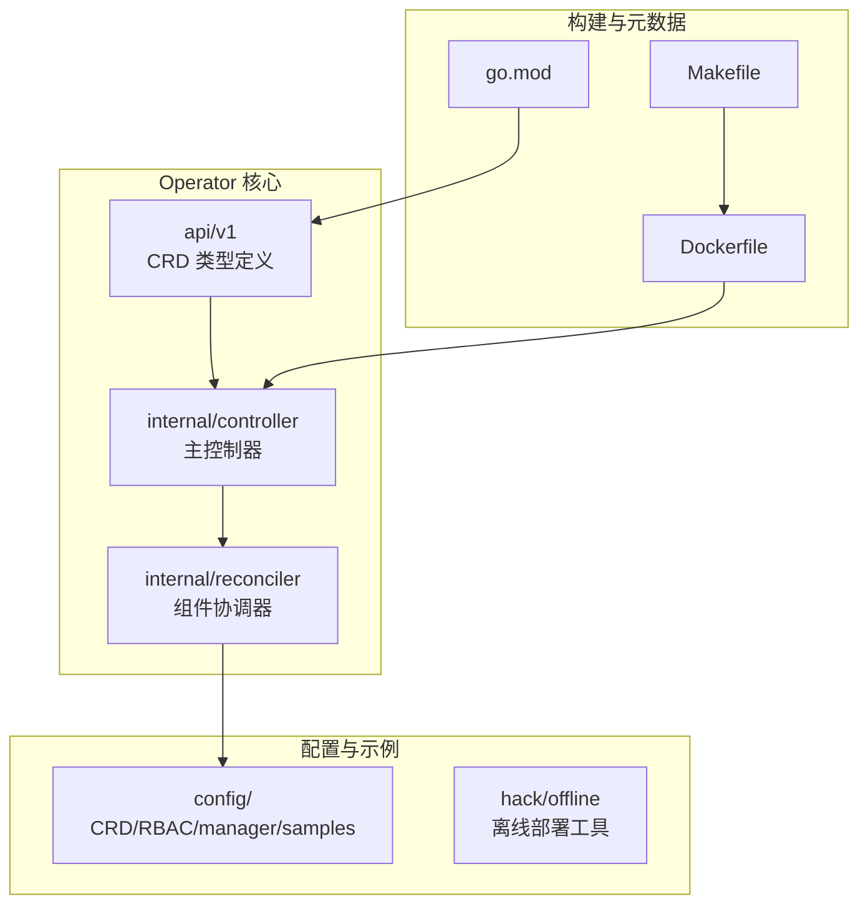
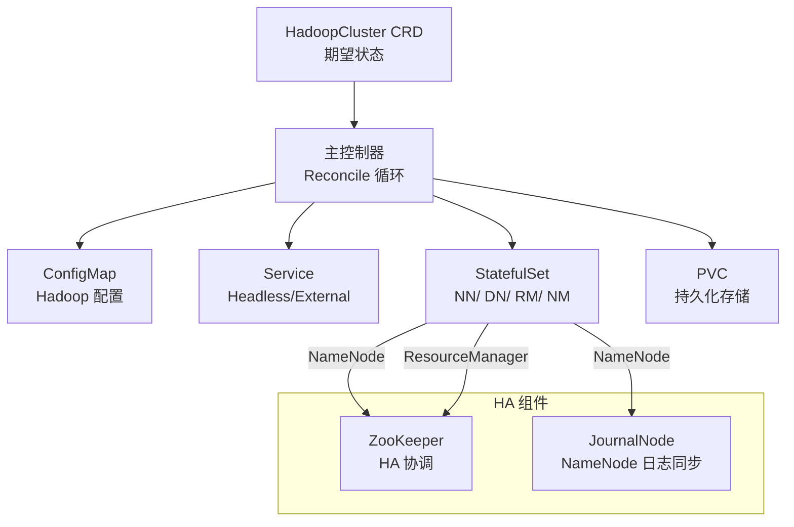
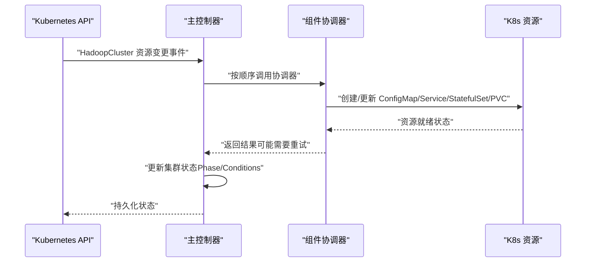
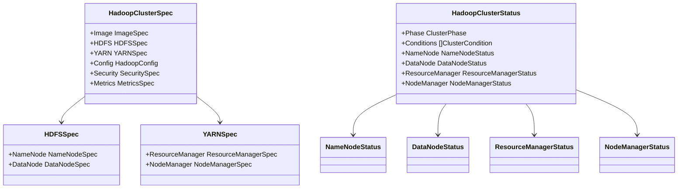
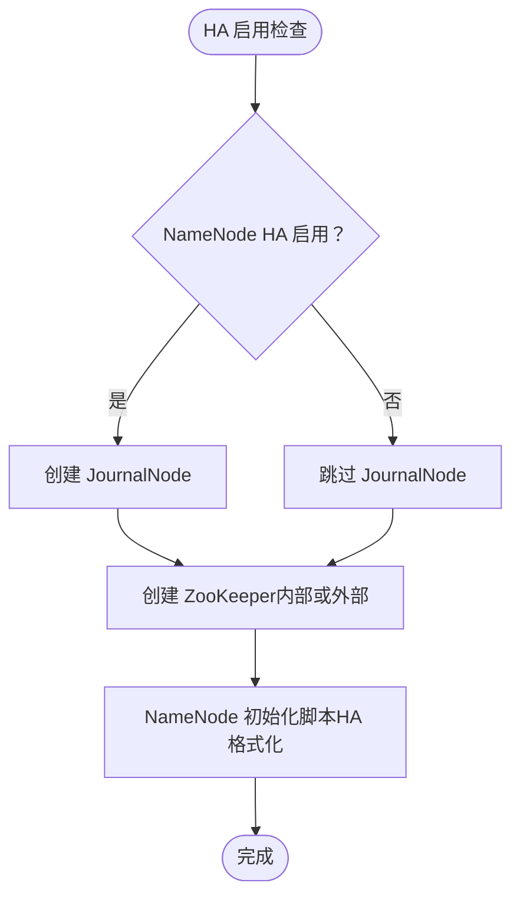
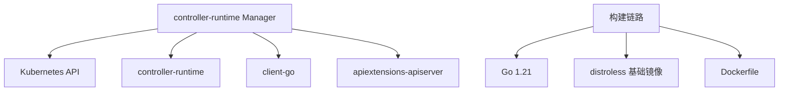

# 项目概述

<cite>
**本文档引用的文件**
- [README.md](file://hadoop-operator/README.md)
- [main.go](file://hadoop-operator/cmd/main.go)
- [groupversion_info.go](file://hadoop-operator/api/v1/groupversion_info.go)
- [hadoopcluster_types.go](file://hadoop-operator/api/v1/hadoopcluster_types.go)
- [hadoopcluster_controller.go](file://hadoop-operator/internal/controller/hadoopcluster_controller.go)
- [namenode.go](file://hadoop-operator/internal/reconciler/namenode.go)
- [datanode.go](file://hadoop-operator/internal/reconciler/datanode.go)
- [ha.go](file://hadoop-operator/internal/reconciler/ha.go)
- [go.mod](file://hadoop-operator/go.mod)
- [Dockerfile](file://hadoop-operator/Dockerfile)
- [Makefile](file://hadoop-operator/Makefile)
- [hadoop_v1_hadoopcluster.yaml](file://hadoop-operator/config/samples/hadoop_v1_hadoopcluster.yaml)
- [hadoop_v1_hadoopcluster_ha.yaml](file://hadoop-operator/config/samples/hadoop_v1_hadoopcluster_ha.yaml)
</cite>

## 目录
1. [简介](#简介)
2. [项目结构](#项目结构)
3. [核心组件](#核心组件)
4. [架构总览](#架构总览)
5. [详细组件分析](#详细组件分析)
6. [依赖关系分析](#依赖关系分析)
7. [性能考虑](#性能考虑)
8. [故障排除指南](#故障排除指南)
9. [结论](#结论)
10. [附录](#附录)

## 简介
Apache Hadoop Operator v3 是一个专为 Kubernetes 设计的生产级 Operator，用于自动化部署与管理 Hadoop 集群。它通过自定义资源定义（CRD）和控制器循环，将 HDFS 和 YARN 的部署、扩缩容、高可用配置、监控集成等复杂运维工作标准化，显著降低了在容器化环境中管理 Hadoop 的门槛。

- **核心目标**：简化 Hadoop 在 Kubernetes 上的部署与生命周期管理，提供高可用、可扩展、可观测的集群管理能力。
- **适用场景**：
  - 在 Kubernetes 集群中快速搭建 HDFS + YARN 的大数据平台
  - 支持离线环境部署，满足内网或受限网络环境需求
  - 提供 Prometheus 监控集成，便于统一观测
  - 支持资源隔离与亲和性配置，适配多租户与混合负载场景
- **目标用户**：
  - 大数据平台工程师与 SRE 团队
  - 需要在 Kubernetes 上稳定运行 Hadoop 的企业用户
  - 对 Hadoop 高可用与监控有明确要求的团队

## 项目结构
项目采用典型的 Kubebuilder 项目结构，分为 API 定义、控制器、协调器（reconciler）、配置与示例等模块。核心目录与职责如下：
- hadoop-operator/api/v1：定义 HadoopCluster CRD 的 Go 类型与版本信息
- hadoop-operator/internal/controller：主控制器，负责协调 HadoopCluster 生命周期
- hadoop-operator/internal/reconciler：按组件拆分的协调器，分别处理 NameNode、DataNode、ResourceManager、NodeManager 及 HA 组件
- hadoop-operator/config：CRD、RBAC、部署配置与示例
- hadoop-operator/hack/offline：离线部署相关脚本
- 根目录下的 Dockerfile、Makefile、go.mod 等构建与打包配置

**图表来源**
- [main.go:1-150](file://hadoop-operator/cmd/main.go#L1-L150)
- [hadoopcluster_controller.go:1-239](file://hadoop-operator/internal/controller/hadoopcluster_controller.go#L1-L239)
- [hadoopcluster_types.go:1-418](file://hadoop-operator/api/v1/hadoopcluster_types.go#L1-L418)

**章节来源**
- [README.md:233-251](file://hadoop-operator/README.md#L233-L251)
- [Makefile:1-165](file://hadoop-operator/Makefile#L1-L165)

## 核心组件
- 自定义资源定义（CRD）：HadoopCluster，描述 HDFS、YARN、镜像、配置、安全、监控等期望状态
- 主控制器：监听 HadoopCluster 资源变更，驱动组件协调器执行实际部署
- 组件协调器：按顺序协调 ConfigMap、Service、StatefulSet/PVC 等资源，确保各组件（NameNode、DataNode、ResourceManager、NodeManager）按期望状态运行
- 高可用支持：NameNode HA 与 ResourceManager HA，内置 JournalNode 与 ZooKeeper 协调（可选外部 ZooKeeper）
- 离线部署：提供镜像导出、导入与私有仓库配置流程
- 监控集成：Prometheus Exporter 与 ServiceMonitor 支持

**章节来源**
- [hadoopcluster_types.go:24-46](file://hadoop-operator/api/v1/hadoopcluster_types.go#L24-L46)
- [hadoopcluster_controller.go:41-145](file://hadoop-operator/internal/controller/hadoopcluster_controller.go#L41-L145)
- [README.md:5-13](file://hadoop-operator/README.md#L5-L13)

## 架构总览
Operator 通过 CRD 描述集群期望状态，控制器根据资源差异进行 reconcile 循环，协调器逐个创建/更新 ConfigMap、Service、StatefulSet 与 PVC，最终形成完整的 HDFS/YARN 集群。HA 模式下额外创建 JournalNode 与 ZooKeeper（或使用外部 ZooKeeper），以保障 NameNode 与 ResourceManager 的高可用。

**图表来源**
- [hadoopcluster_controller.go:104-126](file://hadoop-operator/internal/controller/hadoopcluster_controller.go#L104-L126)
- [namenode.go:35-114](file://hadoop-operator/internal/reconciler/namenode.go#L35-L114)
- [datanode.go:34-113](file://hadoop-operator/internal/reconciler/datanode.go#L34-L113)
- [ha.go:34-177](file://hadoop-operator/internal/reconciler/ha.go#L34-L177)

## 详细组件分析

### 控制器与协调器
- 主控制器负责：
  - 初始化集群状态与终末器（finalizer）
  - 触发组件协调器按顺序执行（ConfigMap → Service → StatefulSet/PVC）
  - 更新集群状态（Phase、Conditions）与 Ready 条件
  - 处理删除流程（Deleting 阶段与清理逻辑）
- 组件协调器按组件拆分，职责清晰：
  - NameNode：创建 Headless/External Service、StatefulSet（含 InitContainer 格式化/权限设置）、PVC
  - DataNode：创建 Headless/External Service、StatefulSet（含等待 NameNode 就绪的 InitContainer）、PVC
  - ResourceManager/NodeManager：创建 Headless/External Service、StatefulSet、PVC
  - HA 组件：ZooKeeper（内部或外部）、JournalNode（NameNode HA 必需）

**图表来源**
- [hadoopcluster_controller.go:60-145](file://hadoop-operator/internal/controller/hadoopcluster_controller.go#L60-L145)
- [namenode.go:116-317](file://hadoop-operator/internal/reconciler/namenode.go#L116-L317)
- [datanode.go:115-321](file://hadoop-operator/internal/reconciler/datanode.go#L115-L321)
- [ha.go:179-363](file://hadoop-operator/internal/reconciler/ha.go#L179-L363)

**章节来源**
- [hadoopcluster_controller.go:41-239](file://hadoop-operator/internal/controller/hadoopcluster_controller.go#L41-L239)
- [namenode.go:1-371](file://hadoop-operator/internal/reconciler/namenode.go#L1-L371)
- [datanode.go:1-331](file://hadoop-operator/internal/reconciler/datanode.go#L1-L331)
- [ha.go:1-394](file://hadoop-operator/internal/reconciler/ha.go#L1-L394)

### CRD 数据模型与状态
- HadoopClusterSpec：包含镜像、HDFS、YARN、配置覆盖、安全、监控等字段
- HadoopClusterStatus：包含 Phase、Conditions 与各组件的 Ready/Replicas/Live/Dead 等状态
- 关键类型包括 ImageSpec、HDFSSpec、YARNSpec、HASpec、StorageSpec、ServiceSpec、HadoopConfig、SecuritySpec、MetricsSpec 等

**图表来源**
- [hadoopcluster_types.go:24-418](file://hadoop-operator/api/v1/hadoopcluster_types.go#L24-L418)

**章节来源**
- [hadoopcluster_types.go:24-418](file://hadoop-operator/api/v1/hadoopcluster_types.go#L24-L418)

### 高可用（HA）实现
- NameNode HA：启用后自动创建 JournalNode 与 ZooKeeper（或使用外部 ZooKeeper），并调整 NameNode 初始化脚本以支持 HA 格式化
- ResourceManager HA：启用后创建多个 ResourceManager 实例，并通过 ZooKeeper 协调主备切换
- JournalNode：独立 StatefulSet，提供 NameNode 元数据同步服务
- ZooKeeper：内部部署默认 3 副本，提供 HA 协调与选举服务

**图表来源**
- [ha.go:34-177](file://hadoop-operator/internal/reconciler/ha.go#L34-L177)
- [namenode.go:328-362](file://hadoop-operator/internal/reconciler/namenode.go#L328-L362)

**章节来源**
- [ha.go:34-394](file://hadoop-operator/internal/reconciler/ha.go#L34-L394)
- [hadoopcluster_types.go:92-120](file://hadoop-operator/api/v1/hadoopcluster_types.go#L92-L120)

### 监控与指标
- Prometheus Exporter：可配置启用，暴露 Hadoop 组件指标
- ServiceMonitor：可选择创建 Prometheus ServiceMonitor，匹配指定标签以抓取指标
- 指标端点与探针：NameNode/ResourceManager/DataNode 均配置健康检查与就绪探针

**章节来源**
- [hadoopcluster_types.go:273-295](file://hadoop-operator/api/v1/hadoopcluster_types.go#L273-L295)
- [hadoop_v1_hadoopcluster_ha.yaml:101-107](file://hadoop-operator/config/samples/hadoop_v1_hadoopcluster_ha.yaml#L101-L107)

## 依赖关系分析
- 运行时依赖：controller-runtime、Kubernetes API、客户端库
- 构建与打包：Go 1.21、distroless 基础镜像、Makefile 提供构建与部署任务
- 外部组件：ZooKeeper（内部或外部）、Hadoop 镜像、Prometheus（可选）

**图表来源**
- [go.mod:5-10](file://hadoop-operator/go.mod#L5-L10)
- [Dockerfile:1-34](file://hadoop-operator/Dockerfile#L1-L34)
- [main.go:19-40](file://hadoop-operator/cmd/main.go#L19-L40)

**章节来源**
- [go.mod:1-69](file://hadoop-operator/go.mod#L1-L69)
- [Dockerfile:1-34](file://hadoop-operator/Dockerfile#L1-L34)
- [main.go:19-52](file://hadoop-operator/cmd/main.go#L19-L52)

## 性能考虑
- 资源请求与限制：建议为 NameNode、DataNode、ResourceManager、NodeManager 明确设置 CPU/内存请求与限制，避免资源争抢
- 存储性能：DataNode 使用 PVC，建议选择高性能 StorageClass 并合理设置容量与访问模式
- 网络与亲和性：利用 Pod 反亲和与容忍度，将关键组件分散到不同节点，提升可用性
- HA 组件：JournalNode 至少 3 副本，ZooKeeper 内部部署默认 3 副本，确保仲裁与一致性
- 监控开销：启用 Prometheus 时注意指标采集频率与标签匹配，避免过度抓取

[本节为通用指导，无需特定文件来源]

## 故障排除指南
- Pod 启动失败：查看 Pod 事件与上一次容器日志，确认镜像拉取、权限与配置是否正确
- NameNode 格式化失败：检查 PVC 状态与存储类，必要时手动格式化（谨慎操作）
- DataNode 无法连接 NameNode：使用网络探测命令检查连通性，核对配置映射
- 镜像拉取失败：验证私有仓库凭据与镜像存在性
- HA 组件异常：检查 JournalNode 与 ZooKeeper 状态，确认仲裁与日志同步正常

**章节来源**
- [README.md:276-318](file://hadoop-operator/README.md#L276-L318)

## 结论
Apache Hadoop Operator v3 通过 CRD 与控制器实现了 Hadoop 在 Kubernetes 上的自动化部署与管理，具备高可用、监控、离线部署等关键能力。其模块化的协调器设计使维护与扩展更加清晰，适合在生产环境中稳定运行 HDFS + YARN 集群。对于初学者，可通过示例配置快速上手；对于有经验的开发者，其可扩展的数据模型与组件化架构提供了充足的定制空间。

[本节为总结性内容，无需特定文件来源]

## 附录

### 快速开始指南
- 前置条件：Kubernetes 1.24+、kubectl、Helm 3.x（可选）
- 安装步骤：
  - 安装 CRD、RBAC、部署 Operator
  - 应用基础或高可用示例配置
- 验证部署：查看集群与 Pod 状态，端口转发访问 NameNode/ResourceManager UI

**章节来源**
- [README.md:15-82](file://hadoop-operator/README.md#L15-L82)
- [hadoop_v1_hadoopcluster.yaml:1-80](file://hadoop-operator/config/samples/hadoop_v1_hadoopcluster.yaml#L1-L80)
- [hadoop_v1_hadoopcluster_ha.yaml:1-107](file://hadoop-operator/config/samples/hadoop_v1_hadoopcluster_ha.yaml#L1-L107)

### 核心特性清单
- 完整组件支持：NameNode、DataNode、ResourceManager、NodeManager
- 高可用（HA）：NameNode HA 与 ResourceManager HA
- 配置管理：通过 CRD 灵活覆盖 Hadoop 配置
- 离线部署：支持私有镜像仓库与离线环境部署
- 监控集成：支持 Prometheus 监控与 ServiceMonitor
- 存储管理：支持动态 PVC 与多种 StorageClass
- 安全支持：预留 Kerberos、TLS、Ranger 集成接口

**章节来源**
- [README.md:5-13](file://hadoop-operator/README.md#L5-L13)