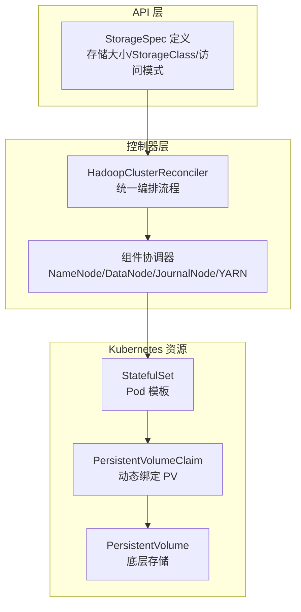
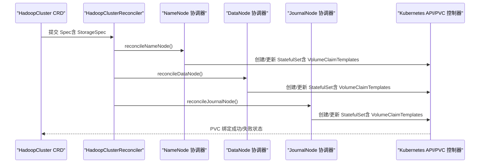
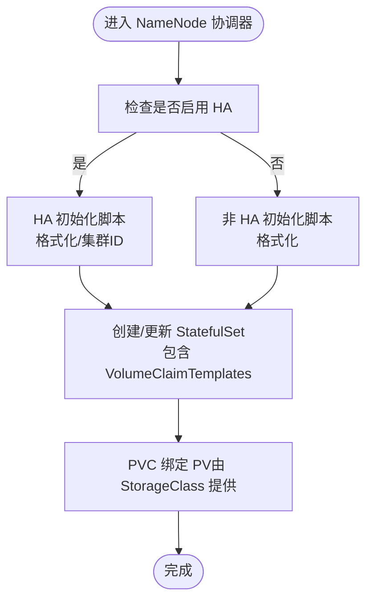
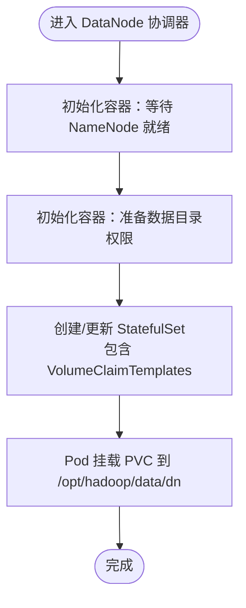
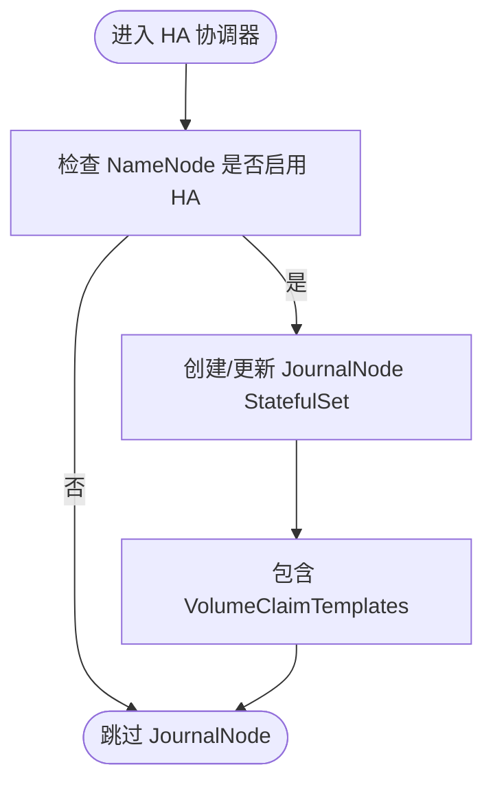
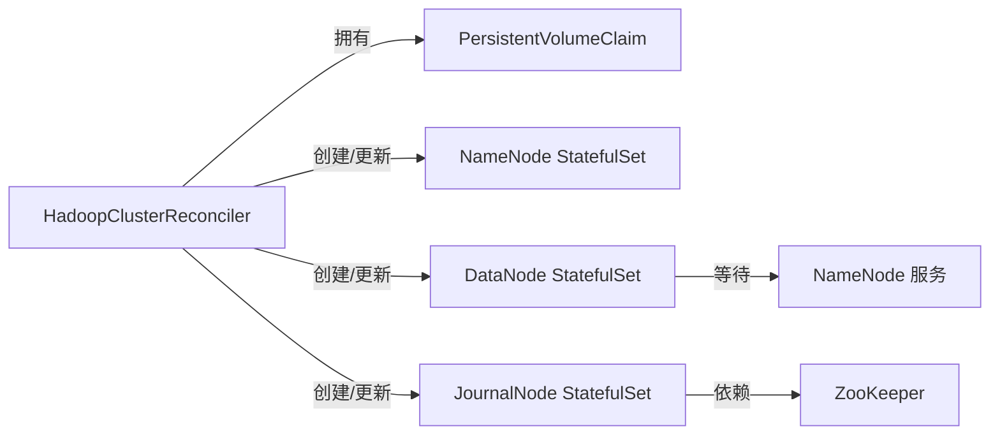

# 存储管理

<cite>
**本文档引用的文件**
- [hadoopcluster_types.go](file://hadoop-operator/api/v1/hadoopcluster_types.go)
- [hadoopcluster_controller.go](file://hadoop-operator/internal/controller/hadoopcluster_controller.go)
- [namenode.go](file://hadoop-operator/internal/reconciler/namenode.go)
- [datanode.go](file://hadoop-operator/internal/reconciler/datanode.go)
- [ha.go](file://hadoop-operator/internal/reconciler/ha.go)
- [yarn.go](file://hadoop-operator/internal/reconciler/yarn.go)
- [hadoop_v1_hadoopcluster.yaml](file://hadoop-operator/config/samples/hadoop_v1_hadoopcluster.yaml)
- [hadoop_v1_hadoopcluster_ha.yaml](file://hadoop-operator/config/samples/hadoop_v1_hadoopcluster_ha.yaml)
- [offline-deployment.yaml](file://hadoop-operator/config/samples/offline-deployment.yaml)
- [README.md](file://hadoop-operator/README.md)
</cite>

## 目录
1. [简介](#简介)
2. [项目结构](#项目结构)
3. [核心组件](#核心组件)
4. [架构总览](#架构总览)
5. [详细组件分析](#详细组件分析)
6. [依赖关系分析](#依赖关系分析)
7. [性能考虑](#性能考虑)
8. [故障排查指南](#故障排查指南)
9. [结论](#结论)
10. [附录](#附录)

## 简介
本章节介绍 Apache Hadoop Operator v3 的存储管理策略，重点覆盖动态 PVC 模板配置、StorageClass 选择、存储后端扩展、持久化卷管理等。文档解释不同存储类型的配置方法，包括本地存储、网络存储、云存储等，并提供存储容量规划指南、性能优化建议和存储故障恢复方案，同时包含存储监控和容量管理的最佳实践。

## 项目结构
Hadoop Operator v3 将存储管理抽象为 CRD 中的 StorageSpec，并在控制器中通过 reconciler 为各组件生成 VolumeClaimTemplates，从而为 NameNode、DataNode、JournalNode 等组件动态创建 PVC 并绑定到对应的 StatefulSet。

图表来源
- [hadoopcluster_types.go:189-199](file://hadoop-operator/api/v1/hadoopcluster_types.go#L189-L199)
- [hadoopcluster_controller.go:104-115](file://hadoop-operator/internal/controller/hadoopcluster_controller.go#L104-L115)
- [namenode.go:292-307](file://hadoop-operator/internal/reconciler/namenode.go#L292-L307)
- [datanode.go:296-311](file://hadoop-operator/internal/reconciler/datanode.go#L296-L311)
- [ha.go:338-353](file://hadoop-operator/internal/reconciler/ha.go#L338-L353)

章节来源
- [hadoopcluster_types.go:189-199](file://hadoop-operator/api/v1/hadoopcluster_types.go#L189-L199)
- [hadoopcluster_controller.go:104-115](file://hadoop-operator/internal/controller/hadoopcluster_controller.go#L104-L115)

## 核心组件
- StorageSpec：定义存储大小、StorageClass 名称、访问模式等字段，用于 NameNode、DataNode、JournalNode 的存储配置。
- 控制器编排：HadoopClusterReconciler 按顺序调用各组件协调器，确保服务、StatefulSet、PVC 等资源按需创建或更新。
- 协调器实现：
  - NameNode 协调器：创建 NameNode StatefulSet，包含 VolumeClaimTemplates 以声明 PVC。
  - DataNode 协调器：创建 DataNode StatefulSet，包含 VolumeClaimTemplates 以声明 PVC。
  - HA 协调器：创建 JournalNode 和 ZooKeeper StatefulSet，均包含 VolumeClaimTemplates。
  - YARN 协调器：ResourceManager/NodeManager 不直接使用 PVC（仅挂载 ConfigMap）。

章节来源
- [hadoopcluster_types.go:189-199](file://hadoop-operator/api/v1/hadoopcluster_types.go#L189-L199)
- [hadoopcluster_controller.go:104-115](file://hadoop-operator/internal/controller/hadoopcluster_controller.go#L104-L115)
- [namenode.go:117-317](file://hadoop-operator/internal/reconciler/namenode.go#L117-L317)
- [datanode.go:116-321](file://hadoop-operator/internal/reconciler/datanode.go#L116-L321)
- [ha.go:179-363](file://hadoop-operator/internal/reconciler/ha.go#L179-L363)
- [yarn.go:115-447](file://hadoop-operator/internal/reconciler/yarn.go#L115-L447)

## 架构总览
存储管理在控制器层面通过 CRD 驱动，组件协调器根据 StorageSpec 生成 PVC 模板，Kubernetes CSI/StorageClass 提供动态卷供应，最终绑定到 StatefulSet 的 Pod 挂载点。

图表来源
- [hadoopcluster_controller.go:104-115](file://hadoop-operator/internal/controller/hadoopcluster_controller.go#L104-L115)
- [namenode.go:117-317](file://hadoop-operator/internal/reconciler/namenode.go#L117-L317)
- [datanode.go:116-321](file://hadoop-operator/internal/reconciler/datanode.go#L116-L321)
- [ha.go:179-363](file://hadoop-operator/internal/reconciler/ha.go#L179-L363)

## 详细组件分析

### StorageSpec 数据模型与默认值
- 字段含义
  - size：存储容量字符串，如 "100Gi"
  - storageClassName：指向 StorageClass 的名称指针；未设置时由集群默认 StorageClass 处理
  - accessMode：PVC 访问模式，默认 ReadWriteOnce
- 默认行为
  - NameNode：默认 size 为 "20Gi"
  - DataNode：默认 size 为 "100Gi"
  - JournalNode：默认 size 为 "20Gi"
  - JournalNode/ZooKeeper：默认 accessMode 为 ReadWriteOnce

章节来源
- [hadoopcluster_types.go:189-199](file://hadoop-operator/api/v1/hadoopcluster_types.go#L189-L199)
- [namenode.go:154-163](file://hadoop-operator/internal/reconciler/namenode.go#L154-L163)
- [datanode.go:147-156](file://hadoop-operator/internal/reconciler/datanode.go#L147-L156)
- [ha.go:250-255](file://hadoop-operator/internal/reconciler/ha.go#L250-L255)

### NameNode 存储管理
- PVC 模板
  - 名称：namenode-data
  - 访问模式：ReadWriteOnce
  - 存储大小：来自 StorageSpec.size，默认 "20Gi"
  - StorageClass：来自 StorageSpec.storageClassName
- 初始化脚本
  - HA 模式下对第一个实例进行格式化处理
  - 非 HA 模式下首次启动进行格式化
- 日志卷
  - 使用 EmptyDir，便于日志收集与清理

图表来源
- [namenode.go:117-317](file://hadoop-operator/internal/reconciler/namenode.go#L117-L317)
- [namenode.go:292-307](file://hadoop-operator/internal/reconciler/namenode.go#L292-L307)

章节来源
- [namenode.go:117-317](file://hadoop-operator/internal/reconciler/namenode.go#L117-L317)

### DataNode 存储管理
- PVC 模板
  - 名称：datanode-data
  - 访问模式：ReadWriteOnce
  - 存储大小：来自 StorageSpec.size，默认 "100Gi"
  - StorageClass：来自 StorageSpec.storageClassName
- 初始化容器
  - wait-for-namenode：等待 NameNode 就绪
  - init-permissions：准备数据目录权限
- 数据目录挂载
  - 通过 subPath 将 PVC 的子路径映射到 /opt/hadoop/data/dn

图表来源
- [datanode.go:116-321](file://hadoop-operator/internal/reconciler/datanode.go#L116-L321)
- [datanode.go:296-311](file://hadoop-operator/internal/reconciler/datanode.go#L296-L311)

章节来源
- [datanode.go:116-321](file://hadoop-operator/internal/reconciler/datanode.go#L116-L321)

### JournalNode 存储管理（HA）
- PVC 模板
  - 名称：journalnode-data
  - 访问模式：ReadWriteOnce
  - 存储大小：来自 StorageSpec.size，默认 "20Gi"
  - StorageClass：来自 StorageSpec.storageClassName
- 依赖关系
  - JournalNode 仅在 NameNode HA 启用时创建
  - 至少需要 3 个副本以满足仲裁

图表来源
- [ha.go:179-363](file://hadoop-operator/internal/reconciler/ha.go#L179-L363)
- [ha.go:338-353](file://hadoop-operator/internal/reconciler/ha.go#L338-L353)

章节来源
- [ha.go:179-363](file://hadoop-operator/internal/reconciler/ha.go#L179-L363)

### ZooKeeper 存储管理（HA）
- PVC 模板
  - 名称：data
  - 访问模式：ReadWriteOnce
  - 存储大小：固定 "10Gi"
- 用途
  - 保存 ZooKeeper 数据，支持 NameNode HA 的元数据协调

章节来源
- [ha.go:152-167](file://hadoop-operator/internal/reconciler/ha.go#L152-L167)

### YARN 组件存储管理
- ResourceManager/NodeManager
  - 不使用 PVC，仅挂载 ConfigMap 作为 Hadoop 配置卷
  - 节点资源与存储配置通过 CRD 的 YARN.spec.resources 控制

章节来源
- [yarn.go:115-447](file://hadoop-operator/internal/reconciler/yarn.go#L115-L447)

## 依赖关系分析
- 控制器对存储资源的依赖
  - 控制器显式拥有 PersistentVolumeClaim 资源，确保生命周期管理
  - 组件协调器通过 VolumeClaimTemplates 声明 PVC，由集群 StorageClass 动态供应
- 组件间存储依赖
  - DataNode 依赖 NameNode 的就绪状态（通过初始化容器等待）
  - JournalNode 依赖 ZooKeeper（内部或外部），用于 HA 共识

图表来源
- [hadoopcluster_controller.go:235-236](file://hadoop-operator/internal/controller/hadoopcluster_controller.go#L235-L236)
- [datanode.go:178-192](file://hadoop-operator/internal/reconciler/datanode.go#L178-L192)
- [ha.go:34-44](file://hadoop-operator/internal/reconciler/ha.go#L34-L44)

章节来源
- [hadoopcluster_controller.go:235-236](file://hadoop-operator/internal/controller/hadoopcluster_controller.go#L235-L236)

## 性能考虑
- 存储类型选择
  - 本地存储（local）：适合高性能场景，但不具备跨节点迁移能力；适用于单节点亲和性或本地盘
  - 网络存储（如 NFS、CephFS）：具备跨节点迁移能力，适合多副本与高可用
  - 云存储（如 AWS EBS、GCE PD、Azure Disk）：具备弹性扩展与快照能力，适合云原生环境
- 访问模式
  - ReadWriteOnce：最常见，适合 StatefulSet 单副本写入
  - ReadWriteMany：当需要多个 Pod 同时读写时使用（需底层存储支持）
- 容量规划
  - NameNode：容量应覆盖元数据与日志，建议按集群规模与块数量估算
  - DataNode：容量应覆盖数据块与副本数，建议预留 20%-30% 空闲空间
  - JournalNode：容量较小但需稳定写入，建议按块大小与写入频率估算
- I/O 优化
  - 使用高性能存储后端（如 SSD）
  - 合理设置副本数与块大小，平衡吞吐与容错
  - 对日志目录使用独立卷，避免与数据卷争用

## 故障排查指南
- PVC 绑定失败
  - 检查 StorageClass 是否存在且支持动态供应
  - 检查存储配额与命名空间资源限制
  - 查看 PVC 事件与状态
- NameNode 初始化失败
  - 检查 PVC 是否已绑定
  - 在 Pod 内执行格式化命令（谨慎操作）
- DataNode 无法连接 NameNode
  - 检查网络连通性与服务发现
  - 检查 Hadoop 配置（core-site、hdfs-site）
- 镜像拉取失败
  - 检查镜像仓库凭据 Secret
  - 确认镜像仓库可达

章节来源
- [README.md:276-318](file://hadoop-operator/README.md#L276-L318)

## 结论
Hadoop Operator v3 通过 StorageSpec 与 VolumeClaimTemplates 将存储管理标准化，结合控制器的编排能力，实现了 NameNode、DataNode、JournalNode 的动态 PVC 管理。通过合理选择 StorageClass、访问模式与容量规划，可在本地、网络与云存储之间灵活切换，并获得良好的性能与可靠性。配合监控与容量管理最佳实践，可进一步提升运维效率与系统稳定性。

## 附录

### 不同存储类型的配置方法
- 本地存储（local）
  - 在 CRD 中将 storageClassName 设置为 "local"
  - 适用于节点亲和性与高性能场景
- 网络存储（NFS/CephFS）
  - 使用对应 StorageClass 名称
  - 支持跨节点迁移与多副本共享
- 云存储（EBS/GCE PD/Azure Disk）
  - 使用云厂商提供的 StorageClass
  - 支持弹性扩容与快照备份

章节来源
- [hadoop_v1_hadoopcluster.yaml:22-42](file://hadoop-operator/config/samples/hadoop_v1_hadoopcluster.yaml#L22-L42)
- [hadoop_v1_hadoopcluster_ha.yaml:29-54](file://hadoop-operator/config/samples/hadoop_v1_hadoopcluster_ha.yaml#L29-L54)
- [offline-deployment.yaml:26-62](file://hadoop-operator/config/samples/offline-deployment.yaml#L26-L62)

### 存储容量规划指南
- NameNode：按元数据与日志估算，建议预留 20%-30% 空闲
- DataNode：按数据块数量与副本数估算，建议预留 20%-30% 空闲
- JournalNode：按块大小与写入频率估算，建议较小容量但稳定写入

### 性能优化建议
- 选择高性能存储后端（SSD）
- 合理设置副本数与块大小
- 对日志目录使用独立卷
- 使用 ReadWriteOnce 以减少锁竞争

### 存储故障恢复方案
- PVC 绑定失败：检查 StorageClass 与配额
- NameNode 初始化失败：重新格式化（谨慎）
- DataNode 连接异常：检查网络与配置
- 镜像拉取失败：检查 Secret 与仓库可达性