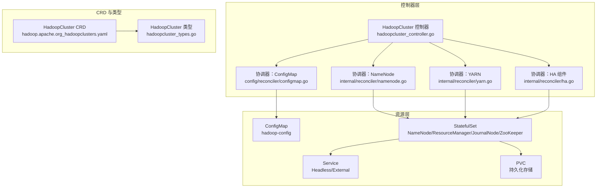
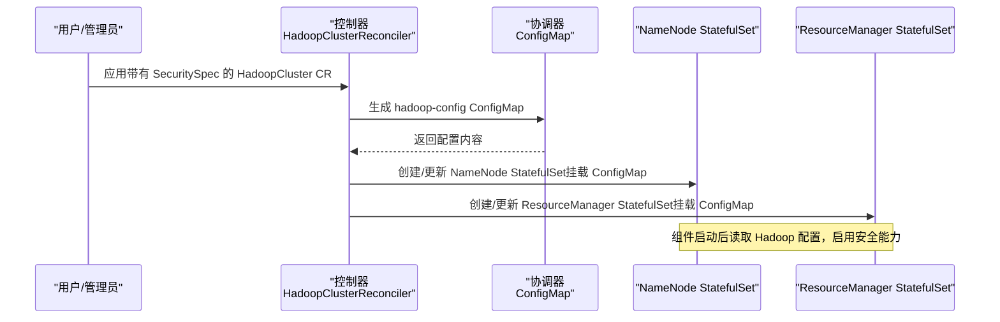
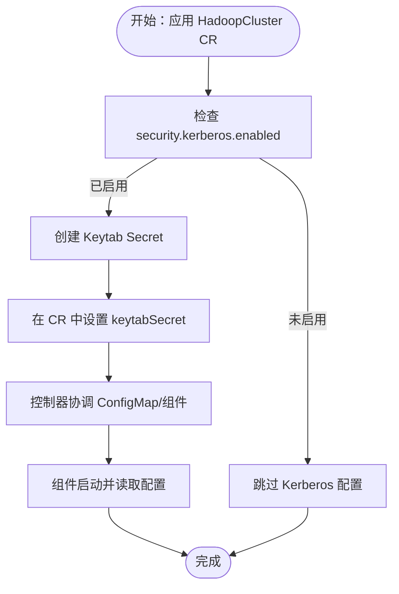
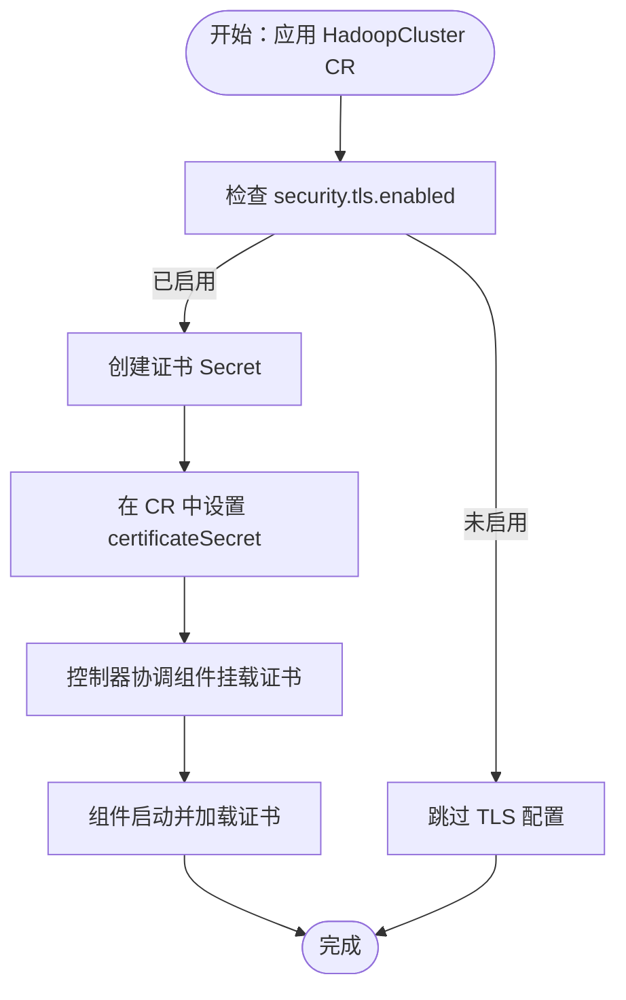
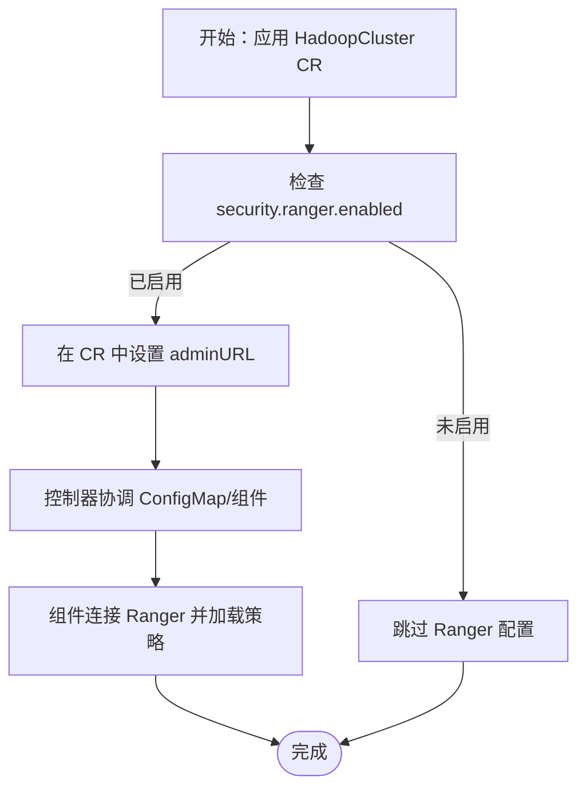
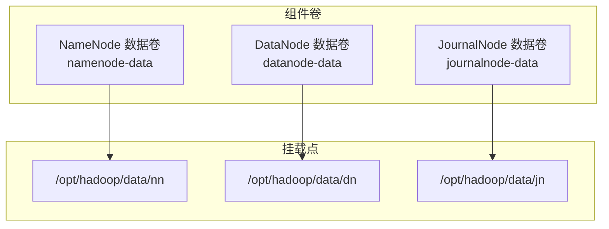
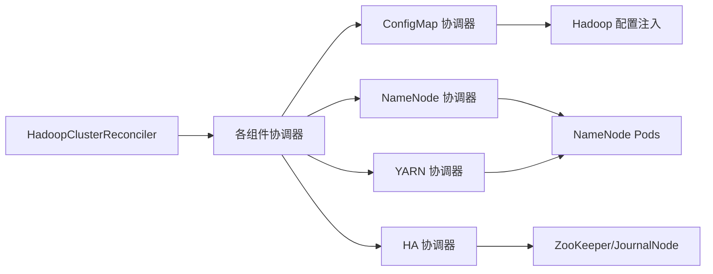

# 安全增强

<cite>
**本文引用的文件**
- [README.md](file://README.md)
- [hadoopcluster_types.go](file://api/v1/hadoopcluster_types.go)
- [hadoop.apache.org_hadoopclusters.yaml](file://config/crd/bases/hadoop.apache.org_hadoopclusters.yaml)
- [hadoopcluster_controller.go](file://internal/controller/hadoopcluster_controller.go)
- [configmap.go](file://internal/reconciler/configmap.go)
- [namenode.go](file://internal/reconciler/namenode.go)
- [yarn.go](file://internal/reconciler/yarn.go)
- [ha.go](file://internal/reconciler/ha.go)
- [main.go](file://cmd/main.go)
- [hadoop_v1_hadoopcluster.yaml](file://config/samples/hadoop_v1_hadoopcluster.yaml)
- [hadoop_v1_hadoopcluster_ha.yaml](file://config/samples/hadoop_v1_hadoopcluster_ha.yaml)
</cite>

## 目录
1. [简介](#简介)
2. [项目结构](#项目结构)
3. [核心组件](#核心组件)
4. [架构总览](#架构总览)
5. [详细组件分析](#详细组件分析)
6. [依赖分析](#依赖分析)
7. [性能考虑](#性能考虑)
8. [故障排查指南](#故障排查指南)
9. [结论](#结论)
10. [附录](#附录)

## 简介
本文件聚焦 Apache Hadoop Operator v3 的“安全增强”能力，基于仓库中已实现的安全字段与控制器逻辑，系统阐述 Kerberos 认证、TLS 加密通信、Ranger 权限管理与安全存储配置的落地方式与最佳实践。文档同时给出部署与配置步骤、常见问题排查与合规性建议，帮助读者在 Kubernetes 环境中安全地部署与运维 Hadoop 集群。

## 项目结构
- CRD 与类型定义：位于 api/v1，定义了 HadoopCluster 的规格与安全字段（Kerberos、TLS、Ranger）。
- 控制器与协调器：位于 internal/controller 与 internal/reconciler，负责根据 CRD 配置创建与维护 Hadoop 组件（NameNode、DataNode、ResourceManager、NodeManager）。
- 配置样例：位于 config/samples，提供基础与高可用部署示例。
- 文档与入口：根目录 README 提供安装、验证与离线部署指引；cmd/main.go 提供管理器启动参数与 TLS/Webhook 安全选项。

**图表来源**
- [hadoopcluster_controller.go:104-126](file://internal/controller/hadoopcluster_controller.go#L104-L126)
- [configmap.go:44-68](file://internal/reconciler/configmap.go#L44-L68)
- [namenode.go:117-317](file://internal/reconciler/namenode.go#L117-L317)
- [yarn.go:115-240](file://internal/reconciler/yarn.go#L115-L240)
- [ha.go:34-177](file://internal/reconciler/ha.go#L34-L177)
- [hadoop.apache.org_hadoopclusters.yaml:209-239](file://config/crd/bases/hadoop.apache.org_hadoopclusters.yaml#L209-L239)
- [hadoopcluster_types.go:233-271](file://api/v1/hadoopcluster_types.go#L233-L271)

**章节来源**
- [README.md:13-13](file://README.md#L13)
- [hadoopcluster_types.go:233-271](file://api/v1/hadoopcluster_types.go#L233-L271)
- [hadoop.apache.org_hadoopclusters.yaml:209-239](file://config/crd/bases/hadoop.apache.org_hadoopclusters.yaml#L209-L239)

## 核心组件
- 安全配置字段（SecuritySpec）
  - Kerberos：启用 Kerberos 认证，包含 Realm、KDC、AdminServer、KeytabSecret 引用。
  - TLS：启用 TLS 加密通信，包含证书 Secret 引用。
  - Ranger：启用 Apache Ranger 集成，包含 AdminURL。
- 控制器与协调器
  - 控制器按顺序协调 ConfigMap、服务与 StatefulSet，确保组件按需创建与更新。
  - 协调器根据 CRD 规格生成 Hadoop 配置（core-site、hdfs-site、yarn-site 等），并注入到容器卷中。
- 管理器启动与安全参数
  - 支持 metrics/webhook 的安全服务与 HTTP/2 禁用策略，提升控制面安全性。

**章节来源**
- [hadoopcluster_types.go:233-271](file://api/v1/hadoopcluster_types.go#L233-L271)
- [hadoop.apache.org_hadoopclusters.yaml:209-239](file://config/crd/bases/hadoop.apache.org_hadoopclusters.yaml#L209-L239)
- [hadoopcluster_controller.go:104-126](file://internal/controller/hadoopcluster_controller.go#L104-L126)
- [configmap.go:70-209](file://internal/reconciler/configmap.go#L70-L209)
- [main.go:83-95](file://cmd/main.go#L83-L95)

## 架构总览
下图展示安全增强在控制器与组件之间的交互路径，强调安全配置如何被注入到 Hadoop 组件中。

**图表来源**
- [hadoopcluster_controller.go:104-126](file://internal/controller/hadoopcluster_controller.go#L104-L126)
- [configmap.go:44-68](file://internal/reconciler/configmap.go#L44-L68)
- [namenode.go:165-310](file://internal/reconciler/namenode.go#L165-L310)
- [yarn.go:152-233](file://internal/reconciler/yarn.go#L152-L233)

## 详细组件分析

### Kerberos 认证配置
- 字段定义
  - SecuritySpec.kerberos.enabled：启用 Kerberos。
  - realm/kdc/adminServer：KDC 与管理服务器信息。
  - keytabSecret：Keytab 密钥表 Secret 名称，用于服务主体认证。
- 实现要点
  - 控制器不直接处理 Keytab 文件或 KDC 管理，但会通过 ConfigMap 注入 Hadoop 配置，使各组件具备 Kerberos 启用条件。
  - 组件（NameNode/ResourceManager 等）启动时读取配置，结合 Keytab Secret 完成认证流程。
- 部署与配置步骤
  - 在集群中创建 Keytab Secret，并在 CR 中设置 keytabSecret。
  - 在 CR 的 security.kerberos 字段中填写 realm、kdc、adminServer。
  - 应用 CR 并观察组件日志确认认证流程正常。
- 最佳实践
  - 将 Keytab Secret 与命名空间隔离，仅授予必要权限。
  - 使用短生命周期的 Keytab 并定期轮换。
  - 在 Hadoop 配置中开启相应安全属性（如 ACL、代理用户等）以配合 Kerberos。

**图表来源**
- [hadoopcluster_types.go:246-257](file://api/v1/hadoopcluster_types.go#L246-L257)
- [hadoopcluster_controller.go:104-126](file://internal/controller/hadoopcluster_controller.go#L104-L126)
- [configmap.go:70-209](file://internal/reconciler/configmap.go#L70-L209)

**章节来源**
- [hadoopcluster_types.go:246-257](file://api/v1/hadoopcluster_types.go#L246-L257)
- [hadoopcluster_controller.go:104-126](file://internal/controller/hadoopcluster_controller.go#L104-L126)
- [configmap.go:70-209](file://internal/reconciler/configmap.go#L70-L209)

### TLS 加密通信
- 字段定义
  - SecuritySpec.tls.enabled：启用 TLS。
  - certificateSecret：证书 Secret 名称，包含服务端证书与私钥。
- 实现要点
  - 控制器不直接生成证书，但会将证书 Secret 挂载到组件容器中，供 Hadoop 组件加载。
  - 组件启动后读取证书配置，建立加密通信通道。
- 部署与配置步骤
  - 准备服务端证书与私钥，创建 Kubernetes Secret。
  - 在 CR 的 security.tls 字段中设置 certificateSecret。
  - 应用 CR 并验证组件日志中的 TLS 初始化信息。
- 最佳实践
  - 使用受信 CA 签发的证书，避免自签名证书带来的兼容性问题。
  - 采用短有效期证书并提前续期，减少泄露风险。
  - 仅允许 TLS 1.2 及以上版本，禁用弱加密套件。

**图表来源**
- [hadoopcluster_types.go:259-264](file://api/v1/hadoopcluster_types.go#L259-L264)
- [hadoopcluster_controller.go:104-126](file://internal/controller/hadoopcluster_controller.go#L104-L126)

**章节来源**
- [hadoopcluster_types.go:259-264](file://api/v1/hadoopcluster_types.go#L259-L264)
- [hadoopcluster_controller.go:104-126](file://internal/controller/hadoopcluster_controller.go#L104-L126)

### Ranger 权限管理
- 字段定义
  - SecuritySpec.ranger.enabled：启用 Ranger。
  - adminURL：Ranger 管理后台地址。
- 实现要点
  - 控制器不直接与 Ranger 交互，但会通过 ConfigMap 注入 Hadoop 配置，使组件具备与 Ranger 对接的能力。
  - 组件启动后读取配置，向 Ranger 查询授权策略。
- 部署与配置步骤
  - 在 CR 的 security.ranger 字段中设置 adminURL。
  - 配置 Ranger 策略，确保 Hadoop 组件的服务主体具备访问权限。
  - 应用 CR 并验证组件日志中的 Ranger 连接与鉴权信息。
- 最佳实践
  - 将 Ranger 策略与最小权限原则结合，避免过度授权。
  - 定期审计策略变更，保留审计日志。
  - 使用 HTTPS 访问 Ranger Admin，确保管理通道安全。

**图表来源**
- [hadoopcluster_types.go:266-271](file://api/v1/hadoopcluster_types.go#L266-L271)
- [hadoopcluster_controller.go:104-126](file://internal/controller/hadoopcluster_controller.go#L104-L126)

**章节来源**
- [hadoopcluster_types.go:266-271](file://api/v1/hadoopcluster_types.go#L266-L271)
- [hadoopcluster_controller.go:104-126](file://internal/controller/hadoopcluster_controller.go#L104-L126)

### 安全存储配置
- 存储与持久化
  - NameNode/DataNode/ResourceManager/JournalNode 均通过 PVC 持久化数据目录，确保元数据与日志的持久化与安全备份。
  - 卷挂载至 /opt/hadoop/data/nn、/opt/hadoop/data/dn 等路径，便于与 Hadoop 配置一致。
- 最佳实践
  - 为敏感数据目录配置只读或受限权限的子路径挂载。
  - 结合 CSI 存储类与快照能力，定期备份关键数据。
  - 对存储卷启用加密（如使用加密的 StorageClass）。

**图表来源**
- [namenode.go:292-308](file://internal/reconciler/namenode.go#L292-L308)
- [yarn.go:347-438](file://internal/reconciler/yarn.go#L347-L438)
- [ha.go:153-170](file://internal/reconciler/ha.go#L153-L170)

**章节来源**
- [namenode.go:292-308](file://internal/reconciler/namenode.go#L292-L308)
- [yarn.go:347-438](file://internal/reconciler/yarn.go#L347-L438)
- [ha.go:153-170](file://internal/reconciler/ha.go#L153-L170)

## 依赖分析
- 控制器与协调器耦合
  - 控制器负责编排顺序与状态更新；协调器负责具体资源生成与挂载。
- 外部依赖
  - Keytab Secret、证书 Secret、Ranger 管理后台均需在集群外部准备并正确配置。
  - HA 组件（ZooKeeper、JournalNode）由协调器创建，为 NameNode/ResourceManager HA 提供基础设施。

**图表来源**
- [hadoopcluster_controller.go:104-126](file://internal/controller/hadoopcluster_controller.go#L104-L126)
- [configmap.go:44-68](file://internal/reconciler/configmap.go#L44-L68)
- [namenode.go:117-317](file://internal/reconciler/namenode.go#L117-L317)
- [yarn.go:115-240](file://internal/reconciler/yarn.go#L115-L240)
- [ha.go:34-177](file://internal/reconciler/ha.go#L34-L177)

**章节来源**
- [hadoopcluster_controller.go:104-126](file://internal/controller/hadoopcluster_controller.go#L104-L126)
- [configmap.go:44-68](file://internal/reconciler/configmap.go#L44-L68)
- [namenode.go:117-317](file://internal/reconciler/namenode.go#L117-L317)
- [yarn.go:115-240](file://internal/reconciler/yarn.go#L115-L240)
- [ha.go:34-177](file://internal/reconciler/ha.go#L34-L177)

## 性能考虑
- 资源请求与限制
  - NameNode/ResourceManager/NodeManager 均支持显式资源请求与限制，建议根据负载调整 CPU/内存配额，避免资源争抢。
- 存储 I/O
  - NameNode/数据目录与 JournalNode 的 IOPS 与吞吐直接影响集群性能，建议选择高性能存储类并合理规划容量。
- 网络与服务暴露
  - 外部服务（NodePort/LoadBalancer）可能引入额外网络开销，建议在内部网络中优先使用 Headless 服务进行组件间通信。

[本节为通用指导，无需列出具体文件来源]

## 故障排查指南
- Keytab 与 Kerberos
  - 确认 Keytab Secret 名称与 CR 中 keytabSecret 一致。
  - 检查组件日志中是否出现 Kerberos 认证失败信息，核对 realm、kdc、adminServer 配置。
- 证书与 TLS
  - 确认证书 Secret 包含正确的证书与私钥，且组件已成功挂载。
  - 如出现握手失败，检查证书链完整性与域名匹配。
- Ranger 连接
  - 确认 adminURL 可达，且组件具备访问 Ranger 的网络策略。
  - 检查策略是否正确下发，组件日志中是否有拒绝或连接异常。
- 存储与权限
  - 检查 PVC 绑定状态与存储类可用性。
  - 确认容器对挂载目录具有必要的读写权限。

**章节来源**
- [README.md:276-318](file://README.md#L276-L318)

## 结论
Hadoop Operator v3 在 CRD 层提供了 Kerberos、TLS、Ranger 的安全能力声明，并通过控制器与协调器将这些配置注入到 Hadoop 组件中。实际的安全效果取决于外部密钥与证书的正确准备、Ranger 策略的合理配置以及存储与网络的安全加固。遵循本文的最佳实践与排障建议，可在 Kubernetes 上构建更安全、合规的 Hadoop 集群。

[本节为总结性内容，无需列出具体文件来源]

## 附录
- 安装与验证
  - 使用 CRD、RBAC 与管理器部署 Operator，并应用示例 CR 进行验证。
- 离线部署
  - 通过离线镜像与私有仓库配置实现离线环境部署，注意镜像拉取 Secret 的正确设置。

**章节来源**
- [README.md:23-82](file://README.md#L23-L82)
- [hadoop_v1_hadoopcluster.yaml:1-80](file://config/samples/hadoop_v1_hadoopcluster.yaml#L1-L80)
- [hadoop_v1_hadoopcluster_ha.yaml:1-107](file://config/samples/hadoop_v1_hadoopcluster_ha.yaml#L1-L107)